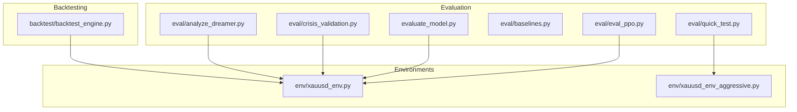
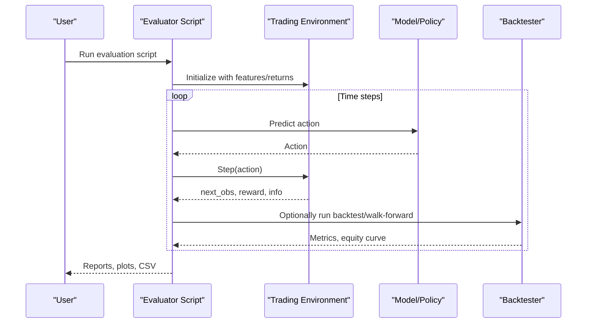
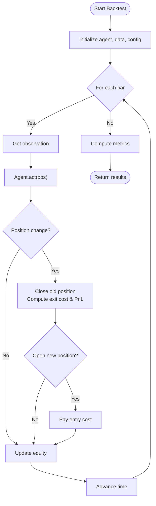
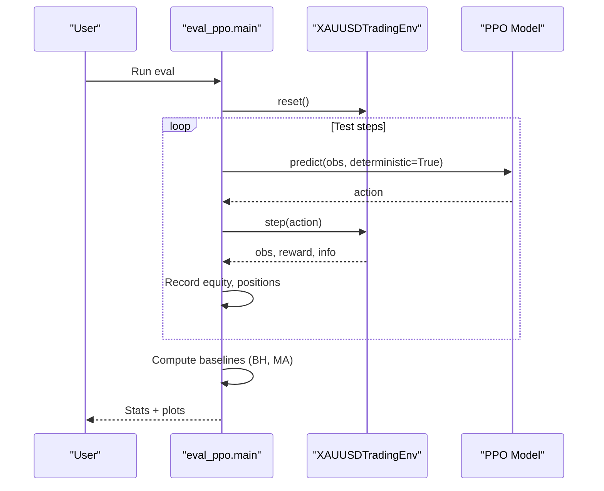
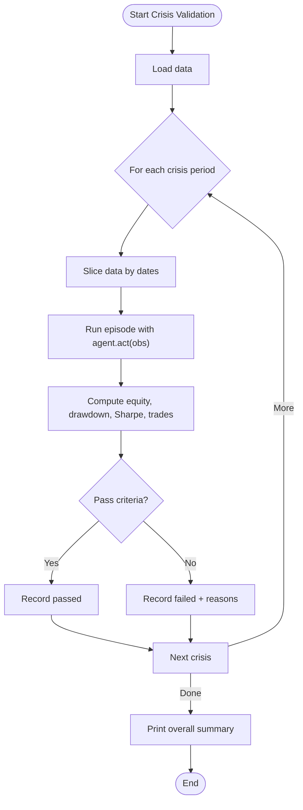
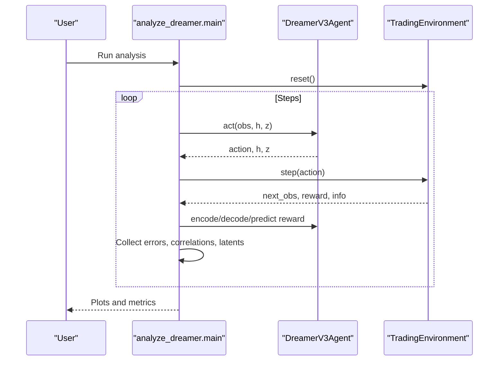
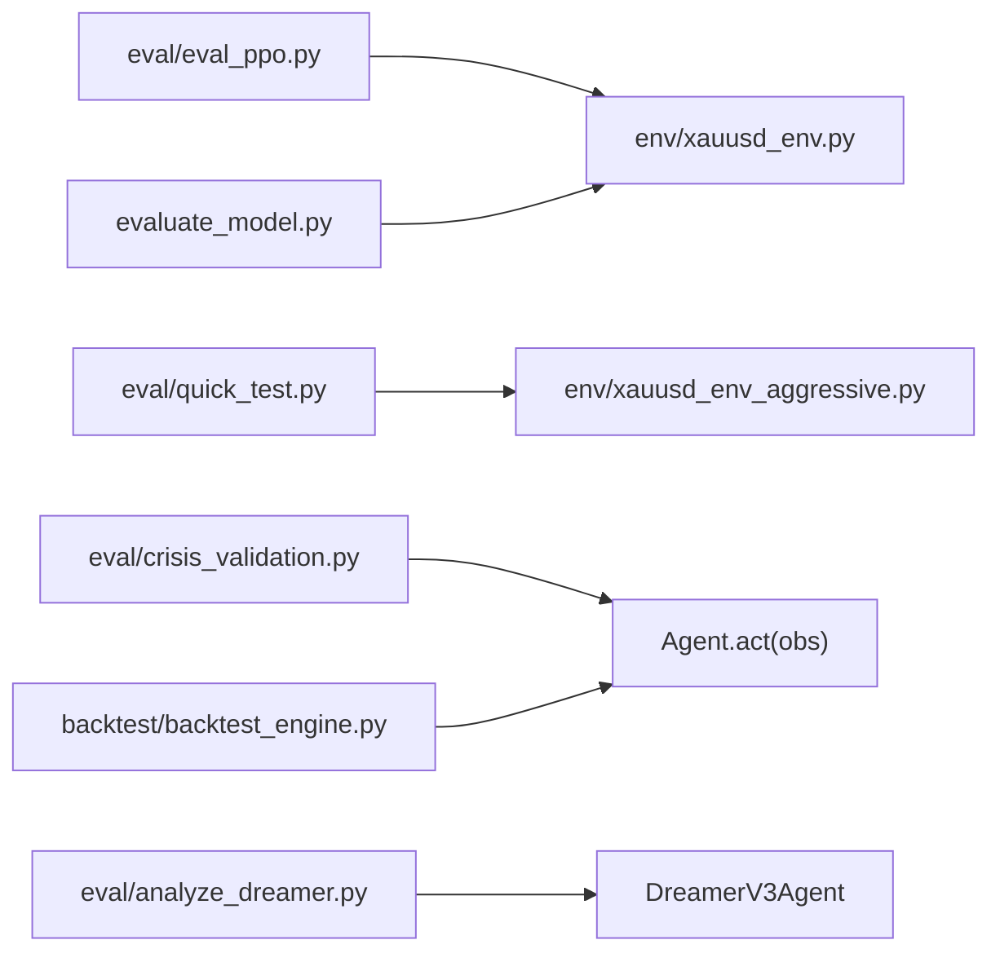

# Evaluation and Testing Tutorials

<cite>
**Referenced Files in This Document**
- [evaluate_model.py](file://evaluate_model.py)
- [eval/eval_ppo.py](file://eval/eval_ppo.py)
- [eval/crisis_validation.py](file://eval/crisis_validation.py)
- [eval/baselines.py](file://eval/baselines.py)
- [eval/analyze_dreamer.py](file://eval/analyze_dreamer.py)
- [eval/quick_test.py](file://eval/quick_test.py)
- [backtest/backtest_engine.py](file://backtest/backtest_engine.py)
- [env/xauusd_env.py](file://env/xauusd_env.py)
- [env/xauusd_env_aggressive.py](file://env/xauusd_env_aggressive.py)
</cite>

## Table of Contents
1. [Introduction](#introduction)
2. [Project Structure](#project-structure)
3. [Core Components](#core-components)
4. [Architecture Overview](#architecture-overview)
5. [Detailed Component Analysis](#detailed-component-analysis)
6. [Dependency Analysis](#dependency-analysis)
7. [Performance Considerations](#performance-considerations)
8. [Troubleshooting Guide](#troubleshooting-guide)
9. [Conclusion](#conclusion)
10. [Appendices](#appendices)

## Introduction
This document provides comprehensive, step-by-step tutorials for evaluating and testing trading models in this repository. It focuses on:
- Backtesting procedures with realistic costs and slippage
- Crisis period validation to stress-test agents under extreme market conditions
- Performance metric analysis and baseline comparisons
- Statistical sanity checks and robustness diagnostics
- Generating performance reports and identifying model weaknesses through systematic tests

The goal is to help you validate model performance reliably before live deployment by using the evaluation scripts and environments already present in the codebase.

## Project Structure
Evaluation and testing are primarily implemented across these modules:
- Backtesting engine with conservative cost assumptions and walk-forward validation
- PPO evaluation against buy-and-hold and moving average baselines
- Crisis period validator targeting known historical crises
- DreamerV3 world model diagnostics (reconstruction, reward prediction, latent space)
- Quick test runner for a swing-trading environment
- General-purpose evaluator that produces equity curves, drawdown plots, and CSV outputs

**Diagram sources**
- [evaluate_model.py:28-85](file://evaluate_model.py#L28-L85)
- [eval/eval_ppo.py:16-41](file://eval/eval_ppo.py#L16-L41)
- [eval/crisis_validation.py:29-171](file://eval/crisis_validation.py#L29-L171)
- [eval/baselines.py:7-53](file://eval/baselines.py#L7-L53)
- [eval/analyze_dreamer.py:23-142](file://eval/analyze_dreamer.py#L23-L142)
- [eval/quick_test.py:10-65](file://eval/quick_test.py#L10-L65)
- [backtest/backtest_engine.py:24-146](file://backtest/backtest_engine.py#L24-L146)
- [env/xauusd_env.py:7-118](file://env/xauusd_env.py#L7-L118)
- [env/xauusd_env_aggressive.py:6-144](file://env/xauusd_env_aggressive.py#L6-L144)

**Section sources**
- [evaluate_model.py:28-85](file://evaluate_model.py#L28-L85)
- [eval/eval_ppo.py:16-41](file://eval/eval_ppo.py#L16-L41)
- [eval/crisis_validation.py:29-171](file://eval/crisis_validation.py#L29-L171)
- [eval/baselines.py:7-53](file://eval/baselines.py#L7-L53)
- [eval/analyze_dreamer.py:23-142](file://eval/analyze_dreamer.py#L23-L142)
- [eval/quick_test.py:10-65](file://eval/quick_test.py#L10-L65)
- [backtest/backtest_engine.py:24-146](file://backtest/backtest_engine.py#L24-L146)
- [env/xauusd_env.py:7-118](file://env/xauusd_env.py#L7-L118)
- [env/xauusd_env_aggressive.py:6-144](file://env/xauusd_env_aggressive.py#L6-L144)

## Core Components
- Rigorous backtester: Implements realistic transaction costs, spread multipliers, slippage, commission, and walk-forward validation. Computes return, risk, trade, and cost metrics.
- PPO evaluator: Runs a trained PPO agent on a held-out test period and compares equity curves to buy-and-hold and MA crossover baselines.
- Crisis validator: Tests an agent across predefined crisis windows with pass/fail criteria based on survival, drawdown, Sharpe-like ratio, and overtrading limits.
- Dreamer analyzer: Evaluates world model reconstruction error, reward prediction correlation, latent space structure, and random-agent comparison.
- Quick test: Fast evaluation of a swing-trading policy on recent data using an aggressive environment.
- General evaluator: Loads features, runs a simple environment, computes standard metrics, and saves plots and CSVs.

**Section sources**
- [backtest/backtest_engine.py:24-146](file://backtest/backtest_engine.py#L24-L146)
- [eval/eval_ppo.py:16-94](file://eval/eval_ppo.py#L16-L94)
- [eval/crisis_validation.py:29-171](file://eval/crisis_validation.py#L29-L171)
- [eval/analyze_dreamer.py:23-142](file://eval/analyze_dreamer.py#L23-L142)
- [eval/quick_test.py:10-65](file://eval/quick_test.py#L10-L65)
- [evaluate_model.py:87-161](file://evaluate_model.py#L87-L161)

## Architecture Overview
The evaluation architecture connects agents or policies to environments and backtesting utilities to produce robust performance estimates.

**Diagram sources**
- [evaluate_model.py:87-161](file://evaluate_model.py#L87-L161)
- [env/xauusd_env.py:75-118](file://env/xauusd_env.py#L75-L118)
- [backtest/backtest_engine.py:73-146](file://backtest/backtest_engine.py#L73-L146)

## Detailed Component Analysis

### Backtesting with Realistic Costs and Walk-Forward Validation
- Purpose: Provide pessimistic, realistic backtests that include spread widening, slippage, commissions, and rolling train/test windows.
- Key behaviors:
  - Tracks trades, entry/exit prices, and per-trade costs
  - Computes total return, annualized return, max drawdown, Sharpe, Sortino, Calmar, win rate, profit factor, average duration, and total costs
  - Offers walk-forward validation to assess stability across time windows

**Diagram sources**
- [backtest/backtest_engine.py:73-146](file://backtest/backtest_engine.py#L73-L146)
- [backtest/backtest_engine.py:219-360](file://backtest/backtest_engine.py#L219-L360)

**Section sources**
- [backtest/backtest_engine.py:24-146](file://backtest/backtest_engine.py#L24-L146)
- [backtest/backtest_engine.py:148-195](file://backtest/backtest_engine.py#L148-L195)
- [backtest/backtest_engine.py:219-360](file://backtest/backtest_engine.py#L219-L360)

### PPO Evaluation and Baseline Comparisons
- Purpose: Evaluate a trained PPO agent on a held-out test period and compare to simple baselines without RL.
- Steps:
  - Load features and returns; split into test set after a fixed date
  - Instantiate environment and load model
  - Roll out deterministic actions, record equity and positions
  - Compute baseline equity curves (buy-and-hold, MA crossover)
  - Print key stats and plot equity curves and positions

**Diagram sources**
- [eval/eval_ppo.py:16-94](file://eval/eval_ppo.py#L16-L94)
- [env/xauusd_env.py:75-118](file://env/xauusd_env.py#L75-L118)

**Section sources**
- [eval/eval_ppo.py:16-94](file://eval/eval_ppo.py#L16-L94)
- [eval/baselines.py:7-53](file://eval/baselines.py#L7-L53)

### Crisis Period Validation
- Purpose: Stress-test agents during known crisis periods to ensure survivability and controlled drawdowns.
- Features:
  - Predefined crisis windows with severity and expected behavior notes
  - Pass criteria: final equity threshold, max drawdown limit, Sharpe-like threshold, and overtrading cap
  - Aggregated summary with pass/fail rates and failure reasons

**Diagram sources**
- [eval/crisis_validation.py:29-171](file://eval/crisis_validation.py#L29-L171)
- [eval/crisis_validation.py:236-317](file://eval/crisis_validation.py#L236-L317)

**Section sources**
- [eval/crisis_validation.py:29-171](file://eval/crisis_validation.py#L29-L171)
- [eval/crisis_validation.py:236-317](file://eval/crisis_validation.py#L236-L317)

### DreamerV3 World Model Diagnostics
- Purpose: Understand what the world model learned via reconstruction quality, reward prediction accuracy, latent space visualization, and comparison to random behavior.
- Analyses:
  - Reconstruction error over steps
  - Correlation between predicted and true rewards
  - PCA of latent states colored by position/reward
  - Random vs agent performance comparison

**Diagram sources**
- [eval/analyze_dreamer.py:23-142](file://eval/analyze_dreamer.py#L23-L142)
- [eval/analyze_dreamer.py:145-216](file://eval/analyze_dreamer.py#L145-L216)
- [eval/analyze_dreamer.py:219-275](file://eval/analyze_dreamer.py#L219-L275)

**Section sources**
- [eval/analyze_dreamer.py:23-142](file://eval/analyze_dreamer.py#L23-L142)
- [eval/analyze_dreamer.py:145-216](file://eval/analyze_dreamer.py#L145-L216)
- [eval/analyze_dreamer.py:219-275](file://eval/analyze_dreamer.py#L219-L275)

### Quick Swing-Trade Test
- Purpose: Rapidly evaluate a swing-trading policy on recent data using an aggressive environment that enforces realistic costs and stop-loss logic.
- Highlights:
  - Uses a wider feature window and three-way actions (short/flat/long)
  - Enforces stop-loss truncation to teach safety
  - Prints final equity, return, trade count, and position exposure

**Section sources**
- [env/xauusd_env_aggressive.py:6-144](file://env/xauusd_env_aggressive.py#L6-L144)
- [eval/quick_test.py:10-65](file://eval/quick_test.py#L10-L65)

### General Model Evaluator
- Purpose: Load features, run a simple environment, compute standard metrics, and generate visualizations plus CSV outputs.
- Outputs:
  - Equity curve, drawdown plot, position timeline
  - Metrics including total return, annualized return, Sharpe, max drawdown, win rate, long percentage, number of trades
  - CSV with timestamped equity and positions

**Section sources**
- [evaluate_model.py:28-85](file://evaluate_model.py#L28-L85)
- [evaluate_model.py:87-161](file://evaluate_model.py#L87-L161)
- [evaluate_model.py:164-199](file://evaluate_model.py#L164-L199)
- [evaluate_model.py:218-306](file://evaluate_model.py#L218-L306)

## Dependency Analysis
Key dependencies among evaluation components:
- PPO evaluation depends on the discrete long-only environment and Stable Baselines PPO model loading
- Crisis validation expects an agent interface with an act method and historical data covering crisis windows
- Dreamer analysis requires a trained checkpoint and optional sklearn/matplotlib for plotting
- Backtester is environment-agnostic but assumes an agent.act(obs) interface and OHLC-style data
- Quick test uses the aggressive environment with short/flat/long actions

**Diagram sources**
- [eval/eval_ppo.py:16-41](file://eval/eval_ppo.py#L16-L41)
- [env/xauusd_env.py:7-118](file://env/xauusd_env.py#L7-L118)
- [env/xauusd_env_aggressive.py:6-144](file://env/xauusd_env_aggressive.py#L6-L144)
- [eval/crisis_validation.py:173-234](file://eval/crisis_validation.py#L173-L234)
- [eval/analyze_dreamer.py:278-345](file://eval/analyze_dreamer.py#L278-L345)
- [evaluate_model.py:218-306](file://evaluate_model.py#L218-L306)
- [backtest/backtest_engine.py:73-146](file://backtest/backtest_engine.py#L73-L146)

**Section sources**
- [eval/eval_ppo.py:16-41](file://eval/eval_ppo.py#L16-L41)
- [env/xauusd_env.py:7-118](file://env/xauusd_env.py#L7-L118)
- [env/xauusd_env_aggressive.py:6-144](file://env/xauusd_env_aggressive.py#L6-L144)
- [eval/crisis_validation.py:173-234](file://eval/crisis_validation.py#L173-L234)
- [eval/analyze_dreamer.py:278-345](file://eval/analyze_dreamer.py#L278-L345)
- [evaluate_model.py:218-306](file://evaluate_model.py#L218-L306)
- [backtest/backtest_engine.py:73-146](file://backtest/backtest_engine.py#L73-L146)

## Performance Considerations
- Use conservative cost assumptions in backtests to avoid overfitting to unrealistic execution conditions
- Prefer walk-forward validation to assess stability across regimes rather than a single train/test split
- Include crisis period validation to detect fragility under stress
- Compare against multiple baselines (buy-and-hold, random, technical rules) to contextualize performance
- Monitor overtrading and turnover penalties to prevent strategies that rely on excessive churn
- For world models, track reconstruction error and reward prediction correlation as proxies for learning quality

[No sources needed since this section provides general guidance]

## Troubleshooting Guide
Common issues and resolutions:
- Missing data for crisis validation: Ensure historical data covers all defined crisis windows; otherwise, tests will be skipped or fail
- Missing checkpoints: Dreamer analysis and general evaluation require valid model files; train first if missing
- Plotting dependencies: Latent space and reward prediction plots require matplotlib and optionally sklearn; install if not present
- Environment mismatch: Ensure your agent’s action space matches the environment (e.g., discrete long-only vs short/flat/long)
- Overfitting signals: If baselines significantly outperform the model on test data, revisit feature engineering, regularization, and cost modeling

**Section sources**
- [eval/crisis_validation.py:95-107](file://eval/crisis_validation.py#L95-L107)
- [eval/analyze_dreamer.py:278-345](file://eval/analyze_dreamer.py#L278-L345)
- [evaluate_model.py:218-306](file://evaluate_model.py#L218-L306)

## Conclusion
This repository provides a robust suite of evaluation tools:
- Realistic backtesting with walk-forward validation
- Crisis period stress testing with clear pass/fail criteria
- Baseline comparisons to contextualize model performance
- World model diagnostics for interpretability and learning quality
- Quick tests for rapid iteration and sanity checks

By combining these approaches, you can systematically validate model performance, identify weaknesses, and build confidence before live deployment.

[No sources needed since this section summarizes without analyzing specific files]

## Appendices

### Step-by-Step: Running Backtests
- Prepare data and implement an agent with an act method
- Configure realistic costs (spread, slippage, commission)
- Run the backtester to obtain equity curves and metrics
- Use walk-forward validation to check stability across windows

**Section sources**
- [backtest/backtest_engine.py:24-146](file://backtest/backtest_engine.py#L24-L146)
- [backtest/backtest_engine.py:148-195](file://backtest/backtest_engine.py#L148-L195)
- [backtest/backtest_engine.py:219-360](file://backtest/backtest_engine.py#L219-L360)

### Step-by-Step: Crisis Period Validation
- Ensure data spans required crisis windows
- Implement agent.act(obs) compatible with the validator
- Run validation and review pass/fail criteria and failure reasons
- Iterate on risk controls if drawdown or overtrading thresholds are breached

**Section sources**
- [eval/crisis_validation.py:29-171](file://eval/crisis_validation.py#L29-L171)
- [eval/crisis_validation.py:236-317](file://eval/crisis_validation.py#L236-L317)

### Step-by-Step: PPO Evaluation and Baselines
- Split data into train/test using a fixed cutoff
- Load PPO model and run deterministic rollouts on test data
- Compute buy-and-hold and MA crossover baselines on the same test period
- Compare equity curves and print key statistics

**Section sources**
- [eval/eval_ppo.py:16-94](file://eval/eval_ppo.py#L16-L94)
- [eval/baselines.py:7-53](file://eval/baselines.py#L7-L53)

### Step-by-Step: DreamerV3 Diagnostics
- Train or load a DreamerV3 checkpoint
- Run reconstruction error analysis and reward prediction correlation
- Visualize latent space and compare to random agent performance
- Use insights to refine world model training or policy

**Section sources**
- [eval/analyze_dreamer.py:23-142](file://eval/analyze_dreamer.py#L23-L142)
- [eval/analyze_dreamer.py:145-216](file://eval/analyze_dreamer.py#L145-L216)
- [eval/analyze_dreamer.py:219-275](file://eval/analyze_dreamer.py#L219-L275)

### Step-by-Step: Quick Swing-Trade Test
- Use the aggressive environment to enforce realistic costs and stop-loss behavior
- Load a trained policy and run on recent data
- Review final equity, return, trade count, and position exposure

**Section sources**
- [env/xauusd_env_aggressive.py:6-144](file://env/xauusd_env_aggressive.py#L6-L144)
- [eval/quick_test.py:10-65](file://eval/quick_test.py#L10-L65)

### Step-by-Step: General Evaluator and Reporting
- Load features and select evaluation period
- Run evaluation to compute metrics and generate plots
- Save detailed CSV with timestamps, equity, and positions for further analysis

**Section sources**
- [evaluate_model.py:218-306](file://evaluate_model.py#L218-L306)