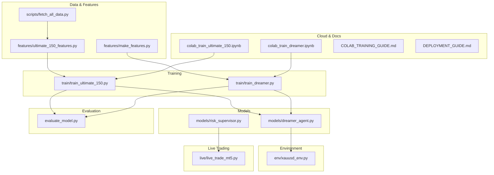
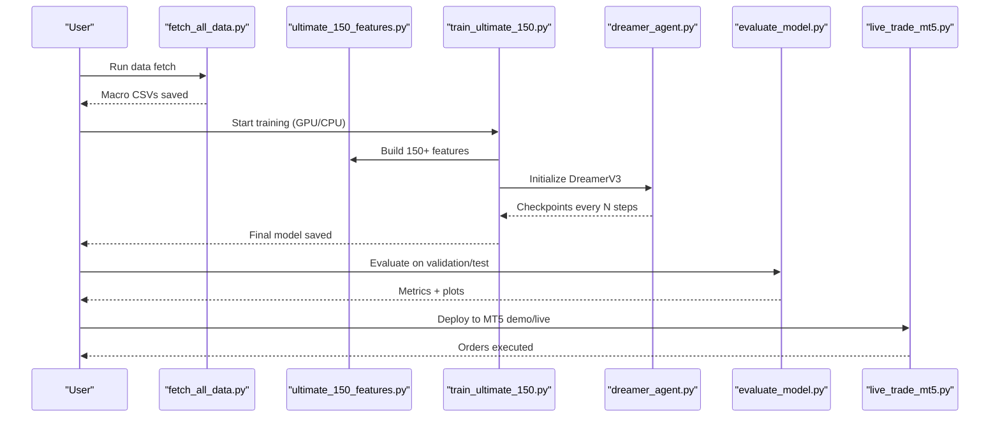
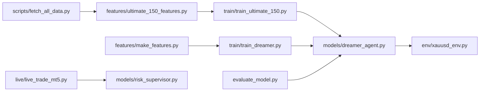
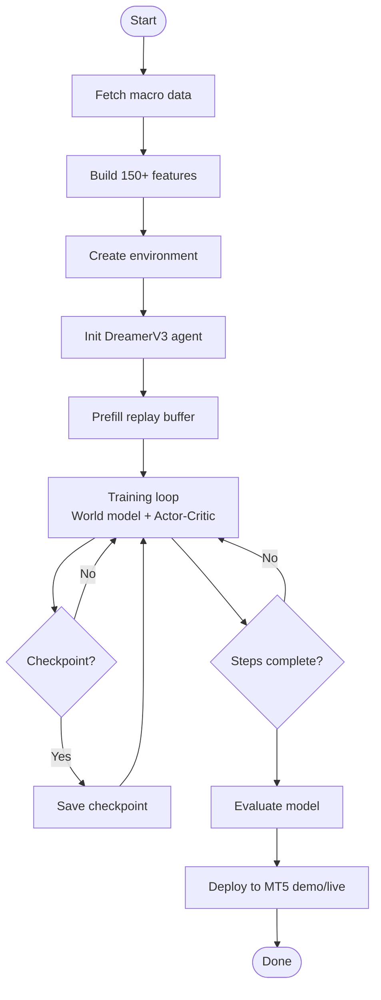
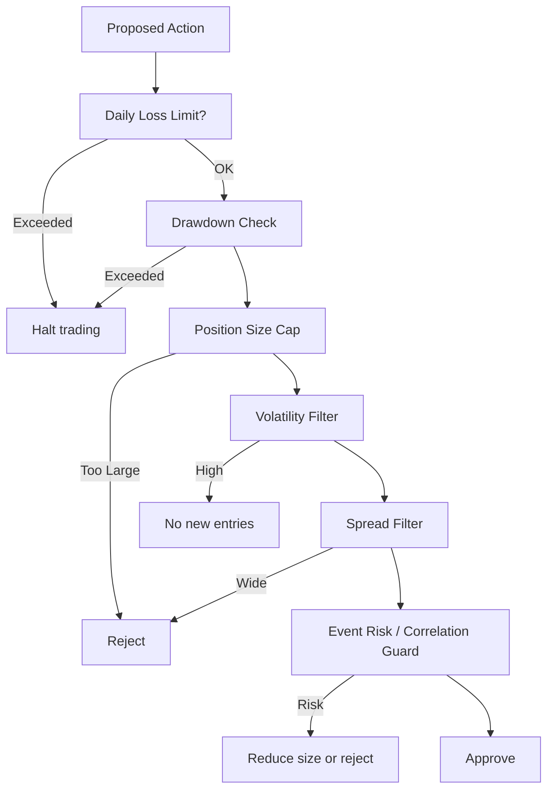

# Examples and Tutorials

<cite>
**Referenced Files in This Document**
- [README.md](file://README.md)
- [requirements.txt](file://requirements.txt)
- [COLAB_TRAINING_GUIDE.md](file://COLAB_TRAINING_GUIDE.md)
- [DEPLOYMENT_GUIDE.md](file://DEPLOYMENT_GUIDE.md)
- [colab_train_dreamer.ipynb](file://colab_train_dreamer.ipynb)
- [colab_train_ultimate_150.ipynb](file://colab_train_ultimate_150.ipynb)
- [train/train_ultimate_150.py](file://train/train_ultimate_150.py)
- [train/train_dreamer.py](file://train/train_dreamer.py)
- [features/ultimate_150_features.py](file://features/ultimate_150_features.py)
- [features/make_features.py](file://features/make_features.py)
- [models/dreamer_agent.py](file://models/dreamer_agent.py)
- [env/xauusd_env.py](file://env/xauusd_env.py)
- [live/live_trade_mt5.py](file://live/live_trade_mt5.py)
- [evaluate_model.py](file://evaluate_model.py)
- [scripts/fetch_all_data.py](file://scripts/fetch_all_data.py)
- [models/risk_supervisor.py](file://models/risk_supervisor.py)
</cite>

## Table of Contents
1. Introduction
2. Project Structure
3. Core Components
4. Architecture Overview
5. Detailed Component Analysis
6. Dependency Analysis
7. Performance Considerations
8. Troubleshooting Guide
9. Conclusion
10. Appendices

## Introduction
This document provides comprehensive, step-by-step tutorials for the autonomous trading system focused on gold (XAUUSD). It covers environment setup, data collection and preprocessing, training with multiple algorithms, evaluation, and live deployment. Practical examples reference actual code paths so you can run them immediately in your environment or via Google Colab notebooks. It also includes best practices for model selection, hyperparameter tuning, performance optimization, adding new instruments, custom risk rules, and integrating with different platforms.

## Project Structure
The repository is organized into clear modules:
- Data and features: scripts to fetch macro data; feature engineering across timeframes, macro, calendar, microstructure
- Training: DreamerV3 and PPO-oriented training scripts
- Models: DreamerV3 agent components and risk supervisor
- Environments: Gym-style trading environments
- Live trading: MT5 integration
- Evaluation: backtesting and metrics
- Cloud training: Colab notebooks and guides
- Deployment: cloud VPS instructions

**Diagram sources**
- [features/ultimate_150_features.py:27-226](file://features/ultimate_150_features.py#L27-L226)
- [features/make_features.py:18-83](file://features/make_features.py#L18-L83)
- [scripts/fetch_all_data.py:131-214](file://scripts/fetch_all_data.py#L131-L214)
- [train/train_ultimate_150.py:154-326](file://train/train_ultimate_150.py#L154-L326)
- [train/train_dreamer.py:128-326](file://train/train_dreamer.py#L128-L326)
- [models/dreamer_agent.py:84-427](file://models/dreamer_agent.py#L84-L427)
- [env/xauusd_env.py:7-118](file://env/xauusd_env.py#L7-L118)
- [live/live_trade_mt5.py:111-173](file://live/live_trade_mt5.py#L111-L173)
- [evaluate_model.py:218-301](file://evaluate_model.py#L218-L301)
- [colab_train_dreamer.ipynb:164-205](file://colab_train_dreamer.ipynb#L164-L205)
- [colab_train_ultimate_150.ipynb:165-213](file://colab_train_ultimate_150.ipynb#L165-L213)
- [COLAB_TRAINING_GUIDE.md:22-110](file://COLAB_TRAINING_GUIDE.md#L22-L110)
- [DEPLOYMENT_GUIDE.md:5-68](file://DEPLOYMENT_GUIDE.md#L5-L68)

**Section sources**
- [README.md:418-471](file://README.md#L418-L471)

## Core Components
- Feature pipeline: multi-timeframe indicators, cross-timeframe signals, macro correlations, economic calendar events, and market microstructure features combined into a unified observation vector.
- Training agents: DreamerV3 world-model RL and PPO-based workflows; both support GPU/MPS/CPU and checkpointing/resume.
- Environment: Gymnasium-compatible trading environment with realistic costs and penalties.
- Risk supervisor: deterministic safety layer that can override AI decisions based on drawdown, volatility, spread, event risk, and trade frequency limits.
- Live execution: MT5 integration for paper/live trading with simple long-only actions.
- Evaluation: offline evaluation producing equity curves, drawdown, Sharpe, win rate, and position statistics.

**Section sources**
- [features/ultimate_150_features.py:27-226](file://features/ultimate_150_features.py#L27-L226)
- [models/dreamer_agent.py:84-427](file://models/dreamer_agent.py#L84-L427)
- [env/xauusd_env.py:7-118](file://env/xauusd_env.py#L7-L118)
- [models/risk_supervisor.py:18-285](file://models/risk_supervisor.py#L18-L285)
- [live/live_trade_mt5.py:111-173](file://live/live_trade_mt5.py#L111-L173)
- [evaluate_model.py:87-161](file://evaluate_model.py#L87-L161)

## Architecture Overview
End-to-end flow from raw data to live trading:

**Diagram sources**
- [scripts/fetch_all_data.py:131-214](file://scripts/fetch_all_data.py#L131-L214)
- [features/ultimate_150_features.py:27-226](file://features/ultimate_150_features.py#L27-L226)
- [train/train_ultimate_150.py:154-326](file://train/train_ultimate_150.py#L154-L326)
- [models/dreamer_agent.py:84-427](file://models/dreamer_agent.py#L84-L427)
- [evaluate_model.py:218-301](file://evaluate_model.py#L218-L301)
- [live/live_trade_mt5.py:111-173](file://live/live_trade_mt5.py#L111-L173)

## Detailed Component Analysis

### Environment Setup and Dependencies
- Install Python 3.12+, create a virtual environment, and install requirements.
- For live trading, ensure MetaTrader 5 is installed and configured.
- Use .env for secrets when integrating external APIs.

Practical references:
- Requirements list and optional packages
- README quick start and installation steps

**Section sources**
- [requirements.txt:1-29](file://requirements.txt#L1-L29)
- [README.md:219-261](file://README.md#L219-L261)

### Collecting and Preprocessing Market Data
- Fetch macro series (VIX, Oil, Bitcoin, EURUSD, Silver, GLD) automatically.
- Prepare XAUUSD OHLCV from MT5 export (M5/M15/H1/H4/D1).
- Generate economic calendar JSON for event-aware features.
- Combine all sources into a unified feature matrix aligned to a base timeframe.

Key flows:
- Macro data download and alignment
- Ultimate feature assembly across timeframes, macro, calendar, microstructure

**Section sources**
- [scripts/fetch_all_data.py:131-214](file://scripts/fetch_all_data.py#L131-L214)
- [features/ultimate_150_features.py:27-226](file://features/ultimate_150_features.py#L27-L226)
- [README.md:294-325](file://README.md#L294-L325)

### Training Models with Different Algorithms
- DreamerV3 training:
  - World model learns dynamics; actor-critic trained in imagined trajectories.
  - Supports resume from checkpoints and periodic saving.
- PPO-based training:
  - Stable baseline algorithm suitable for continuous/discrete action spaces.
  - Used in live MT5 script for inference.

Configuration highlights:
- Steps, batch size, device selection, checkpoint frequency
- Replay buffer prefill for stable learning

**Section sources**
- [train/train_dreamer.py:128-326](file://train/train_dreamer.py#L128-L326)
- [train/train_ultimate_150.py:154-326](file://train/train_ultimate_150.py#L154-L326)
- [models/dreamer_agent.py:84-427](file://models/dreamer_agent.py#L84-L427)

### Evaluating Model Performance
- Load features and a trained checkpoint.
- Run deterministic rollout to compute equity curve, drawdown, Sharpe, win rate, and position stats.
- Save plots and detailed results to CSV.

Usage:
- Select evaluation period (validation/test/all)
- Inspect metrics and visualizations

**Section sources**
- [evaluate_model.py:87-161](file://evaluate_model.py#L87-L161)
- [evaluate_model.py:218-301](file://evaluate_model.py#L218-L301)

### Deploying to Live Trading
- MT5 integration:
  - Fetch latest candles, compute features, predict action, execute/close orders.
  - Simple long-only logic with magic number tagging.
- Paper trading first, then live with small sizes and strict risk controls.

Operational notes:
- Ensure MT5 terminal is running and logged into the correct account.
- Monitor logs and adjust intervals and slippage settings.

**Section sources**
- [live/live_trade_mt5.py:21-173](file://live/live_trade_mt5.py#L21-L173)
- [README.md:380-415](file://README.md#L380-L415)

### Cloud-Based Training with Google Colab
- Two notebooks provided:
  - DreamerV3 training notebook
  - Ultimate 150 features training notebook
- Step-by-step: mount Drive, install deps, verify data, configure parameters, run training, resume after disconnects, download models.

Execution references:
- Cells to mount Drive and set runtime
- Main training cell invoking the appropriate script
- Progress monitoring and backup

**Section sources**
- [colab_train_dreamer.ipynb:32-205](file://colab_train_dreamer.ipynb#L32-L205)
- [colab_train_ultimate_150.ipynb:32-213](file://colab_train_ultimate_150.ipynb#L32-L213)
- [COLAB_TRAINING_GUIDE.md:22-110](file://COLAB_TRAINING_GUIDE.md#L22-L110)

### Best Practices for Model Selection and Hyperparameter Tuning
- Start with PPO for quick baselines; move to DreamerV3 for sample efficiency and planning.
- Tune:
  - Batch size (memory vs speed)
  - Learning rates per component (world model, actor, critic)
  - Horizon and GAE lambda for imagination
  - Exploration schedule and replay buffer size
- Validate across periods and stress-test during crises.

**Section sources**
- [train/train_dreamer.py:192-208](file://train/train_dreamer.py#L192-L208)
- [train/train_ultimate_150.py:221-229](file://train/train_ultimate_150.py#L221-L229)
- [README.md:538-559](file://README.md#L538-L559)

### Extending Features and Adding New Instruments
- Add new instruments by:
  - Including their daily series in the macro fetch pipeline
  - Aligning to the base timeframe index
  - Computing correlation and momentum features
- Extend feature modules:
  - Timeframe features
  - Cross-timeframe features
  - Macro features
  - Calendar features
  - Microstructure features

Implementation pointers:
- Ultimate feature composer aligns and concatenates all feature sets
- Macro feature loader integrates additional series

**Section sources**
- [features/ultimate_150_features.py:47-151](file://features/ultimate_150_features.py#L47-L151)
- [scripts/fetch_all_data.py:147-184](file://scripts/fetch_all_data.py#L147-L184)

### Custom Risk Management Rules
- Use the Risk Supervisor to enforce:
  - Daily loss limits and circuit breakers
  - Max drawdown protection
  - Position sizing caps
  - Volatility, spread, and event filters
  - Trade frequency limits and cooldowns
- Integrate as a wrapper around any agent to approve/reject trades deterministically.

**Section sources**
- [models/risk_supervisor.py:18-285](file://models/risk_supervisor.py#L18-L285)

### Integration with External Data Sources
- Yahoo Finance for macro series
- Economic calendar JSON for event windows
- Optional sentiment/news pipelines can be added similarly

**Section sources**
- [scripts/fetch_all_data.py:27-101](file://scripts/fetch_all_data.py#L27-L101)
- [features/ultimate_150_features.py:94-107](file://features/ultimate_150_features.py#L94-L107)

## Dependency Analysis
High-level dependencies between modules:

**Diagram sources**
- [scripts/fetch_all_data.py:131-214](file://scripts/fetch_all_data.py#L131-L214)
- [features/ultimate_150_features.py:27-226](file://features/ultimate_150_features.py#L27-L226)
- [train/train_ultimate_150.py:154-326](file://train/train_ultimate_150.py#L154-L326)
- [train/train_dreamer.py:128-326](file://train/train_dreamer.py#L128-L326)
- [models/dreamer_agent.py:84-427](file://models/dreamer_agent.py#L84-L427)
- [env/xauusd_env.py:7-118](file://env/xauusd_env.py#L7-L118)
- [evaluate_model.py:218-301](file://evaluate_model.py#L218-L301)
- [live/live_trade_mt5.py:111-173](file://live/live_trade_mt5.py#L111-L173)
- [models/risk_supervisor.py:18-285](file://models/risk_supervisor.py#L18-L285)

**Section sources**
- [requirements.txt:1-29](file://requirements.txt#L1-L29)

## Performance Considerations
- Prefer GPU (CUDA) or MPS (Apple Silicon) for faster training; use CPU only if necessary.
- Adjust batch size to fit memory; larger batches improve throughput but increase memory usage.
- Use longer horizons and tuned GAE lambda for better policy updates in DreamerV3.
- Normalize and clean features; handle NaN/Inf robustly.
- Evaluate out-of-sample and during crisis periods to avoid overfitting.

[No sources needed since this section provides general guidance]

## Troubleshooting Guide
Common issues and resolutions:
- Data not found:
  - Verify paths to macro CSVs and XAUUSD files; re-run data fetch and feature generation.
- Out of memory:
  - Reduce batch size; restart runtime; ensure no other heavy processes.
- Session disconnected (Colab):
  - Resume from last checkpoint; re-run training cells.
- Slow training:
  - Confirm GPU enabled; check device selection; consider Pro+ for consistent A100.
- Live trading errors:
  - Ensure MT5 terminal is running; check symbol availability; validate order parameters and spreads.

References:
- Colab troubleshooting and session management
- MT5 connection and order execution checks

**Section sources**
- [COLAB_TRAINING_GUIDE.md:163-195](file://COLAB_TRAINING_GUIDE.md#L163-L195)
- [colab_train_dreamer.ipynb:320-339](file://colab_train_dreamer.ipynb#L320-L339)
- [live/live_trade_mt5.py:111-173](file://live/live_trade_mt5.py#L111-L173)

## Conclusion
This tutorial set equips you to build, train, evaluate, and deploy an autonomous trading system using state-of-the-art RL techniques. By leveraging rich multi-source features, robust environments, and strong risk controls, you can iterate quickly from local experiments to cloud training and live deployment. Follow the step-by-step guides, adapt configurations to your hardware, and validate thoroughly before risking capital.

[No sources needed since this section summarizes without analyzing specific files]

## Appendices

### Quick Start Checklist
- Install dependencies and set up environment
- Fetch macro data and prepare XAUUSD series
- Generate features and split train/validation
- Train DreamerV3 or PPO; monitor losses and checkpoints
- Evaluate on validation/test; inspect equity and drawdown
- Paper trade on MT5 demo; then go live with small sizes
- Deploy to cloud VPS for 24/7 operation

**Section sources**
- [README.md:219-415](file://README.md#L219-L415)
- [DEPLOYMENT_GUIDE.md:5-68](file://DEPLOYMENT_GUIDE.md#L5-L68)

### Example Workflows

#### End-to-End Training Flow (DreamerV3)

**Diagram sources**
- [scripts/fetch_all_data.py:131-214](file://scripts/fetch_all_data.py#L131-L214)
- [features/ultimate_150_features.py:27-226](file://features/ultimate_150_features.py#L27-L226)
- [train/train_dreamer.py:128-326](file://train/train_dreamer.py#L128-L326)
- [models/dreamer_agent.py:84-427](file://models/dreamer_agent.py#L84-L427)
- [evaluate_model.py:218-301](file://evaluate_model.py#L218-L301)
- [live/live_trade_mt5.py:111-173](file://live/live_trade_mt5.py#L111-L173)

#### Risk Supervisor Decision Flow

**Diagram sources**
- [models/risk_supervisor.py:91-174](file://models/risk_supervisor.py#L91-L174)