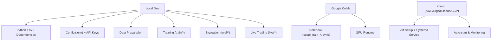
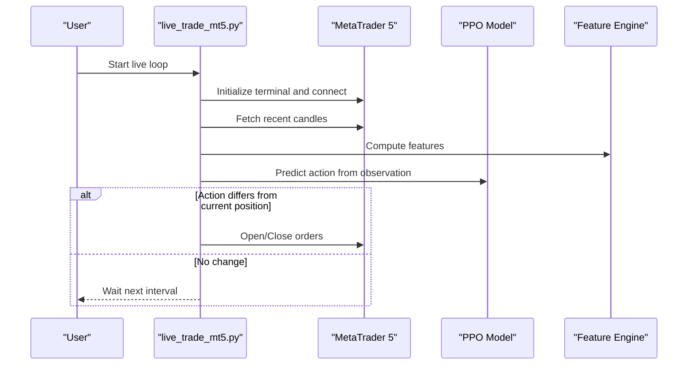
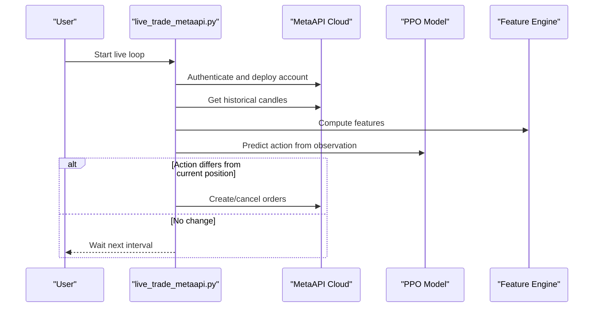
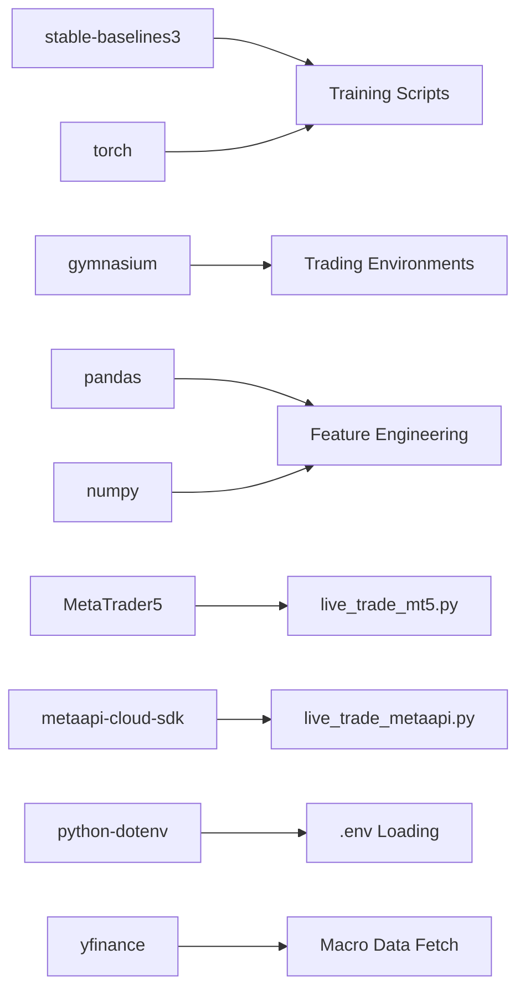

# Setup and Installation Tutorials

<cite>
**Referenced Files in This Document**
- [README.md](file://README.md)
- [requirements.txt](file://requirements.txt)
- [COLAB_TRAINING_GUIDE.md](file://COLAB_TRAINING_GUIDE.md)
- [DEPLOYMENT_GUIDE.md](file://DEPLOYMENT_GUIDE.md)
- [FREE_DEPLOYMENT.md](file://FREE_DEPLOYMENT.md)
- [SECURITY.md](file://SECURITY.md)
- [live_trade_metaapi.py](file://live/live_trade_metaapi.py)
- [live_trade_mt5.py](file://live/live_trade_mt5.py)
- [colab_train_dreamer.ipynb](file://colab_train_dreamer.ipynb)
</cite>

## Table of Contents
1. Introduction
2. Project Structure
3. Core Components
4. Architecture Overview
5. Detailed Component Analysis
6. Dependency Analysis
7. Performance Considerations
8. Troubleshooting Guide
9. Conclusion
10. Appendices

## Introduction
This document provides comprehensive setup and installation tutorials for the autonomous trading system across local development, Google Colab, and cloud platforms. It covers prerequisites, Python environment setup, dependency installation, configuration file setup, API key configuration for MetaTrader 5 and MetaAPI, platform-specific considerations, verification steps, and troubleshooting guidance to ensure a smooth deployment.

## Project Structure
The repository is organized into modules for training, features, environments, evaluation, live trading, scripts, and documentation. Key entry points include:
- Training scripts under train/
- Live trading scripts under live/
- Data utilities and feature engineering under data/ and features/
- Evaluation and backtesting under eval/ and backtest/
- Platform guides and notebooks for Colab and cloud deployment

**Section sources**
- [README.md:418-471](file://README.md#L418-L471)

## Core Components
- Python environment and dependencies managed via requirements.txt
- Environment variables for secure credential management using python-dotenv
- Live trading integrations with MetaTrader 5 and MetaAPI
- Training workflows for PPO and Dreamer V3
- Evaluation and backtesting tools

Key responsibilities:
- Securely load credentials from .env
- Connect to MT5 or MetaAPI for market data and execution
- Load trained models and run inference loops
- Provide scripts to fetch macro data and generate economic calendars

**Section sources**
- [requirements.txt:1-29](file://requirements.txt#L1-L29)
- [SECURITY.md:23-69](file://SECURITY.md#L23-L69)
- [live_trade_metaapi.py:23-39](file://live/live_trade_metaapi.py#L23-L39)
- [live_trade_mt5.py:10-19](file://live/live_trade_mt5.py#L10-L19)

## Architecture Overview
The system integrates data acquisition, feature computation, model inference, and order execution through two primary live paths: MetaTrader 5 and MetaAPI.

**Diagram sources**
- [live_trade_mt5.py:111-174](file://live/live_trade_mt5.py#L111-L174)

**Diagram sources**
- [live_trade_metaapi.py:135-200](file://live/live_trade_metaapi.py#L135-L200)

## Detailed Component Analysis

### Local Development Setup
- Prerequisites: Python 3.12+, optional MetaTrader 5 for live trading, sufficient RAM and disk space
- Steps:
  - Clone repository
  - Create and activate virtual environment
  - Install dependencies from requirements.txt
  - Configure .env with API keys
  - Prepare data (macro data and XAUUSD history)
  - Train or evaluate models
  - Run live trading on demo first

Verification commands:
- Validate environment and imports
- Quick environment test script
- Backtest engine on historical data

Platform notes:
- Apple Silicon: Use MPS device flag for faster training
- NVIDIA GPU: Use CUDA device flag
- CPU-only: Slower but functional

**Section sources**
- [README.md:219-262](file://README.md#L219-L262)
- [README.md:294-368](file://README.md#L294-L368)
- [README.md:579-591](file://README.md#L579-L591)
- [requirements.txt:1-29](file://requirements.txt#L1-L29)

### Google Colab Setup
- Upload project to Google Drive
- Open notebook and enable GPU runtime
- Mount Drive, install dependencies, verify data
- Configure training parameters and start training
- Handle session disconnects by resuming from checkpoints
- Download and validate final model

Verification commands:
- Check GPU availability
- Verify data files and shapes
- Confirm PyTorch CUDA usage

**Section sources**
- [COLAB_TRAINING_GUIDE.md:14-110](file://COLAB_TRAINING_GUIDE.md#L14-L110)
- [COLAB_TRAINING_GUIDE.md:163-196](file://COLAB_TRAINING_GUIDE.md#L163-L196)
- [colab_train_dreamer.ipynb:32-103](file://colab_train_dreamer.ipynb#L32-L103)
- [colab_train_dreamer.ipynb:110-161](file://colab_train_dreamer.ipynb#L110-L161)

### Cloud Deployment (AWS Lightsail, DigitalOcean, Google Cloud Free Tier)
- Create VM instance (Ubuntu 22.04 LTS recommended)
- SSH into server and set up Python 3.12 environment
- Install system dependencies and Python packages
- Upload code and trained model artifacts
- Configure systemd service for auto-start and restart on crash
- Monitor logs and manage bot lifecycle

Verification commands:
- Check service status
- View live logs
- Ensure network connectivity and API access

**Section sources**
- [DEPLOYMENT_GUIDE.md:1-68](file://DEPLOYMENT_GUIDE.md#L1-L68)
- [DEPLOYMENT_GUIDE.md:72-98](file://DEPLOYMENT_GUIDE.md#L72-L98)
- [FREE_DEPLOYMENT.md:24-95](file://FREE_DEPLOYMENT.md#L24-L95)
- [FREE_DEPLOYMENT.md:145-183](file://FREE_DEPLOYMENT.md#L145-L183)

### Configuration File Setup and API Keys
- Create .env from example template
- Fill in MetaAPI token and account ID
- Optionally configure NewsAPI key
- Keep .env out of version control
- On servers, set environment variables directly or use .env

Security best practices:
- Never hardcode secrets
- Restrict file permissions on .env
- Rotate compromised credentials immediately
- Use separate keys for testing vs production

**Section sources**
- [SECURITY.md:23-69](file://SECURITY.md#L23-L69)
- [SECURITY.md:86-111](file://SECURITY.md#L86-L111)
- [SECURITY.md:115-132](file://SECURITY.md#L115-L132)
- [README.md:264-292](file://README.md#L264-L292)

### Live Trading Integration
- MetaTrader 5:
  - Initialize terminal and connect
  - Fetch market data and compute features
  - Load model and predict actions
  - Execute orders with risk controls
- MetaAPI:
  - Authenticate and deploy account
  - Fetch historical candles asynchronously
  - Compute features and predict actions
  - Manage orders and positions with retries and timeouts

Verification steps:
- Confirm connection to MT5 or MetaAPI
- Validate model loading
- Test order placement on demo accounts

**Section sources**
- [live_trade_mt5.py:111-174](file://live/live_trade_mt5.py#L111-L174)
- [live_trade_metaapi.py:135-200](file://live/live_trade_metaapi.py#L135-L200)

## Dependency Analysis
Core dependencies include deep reinforcement learning libraries, data processing tools, trading platform SDKs, and utilities. Optional packages support data fetching, visualization, and advanced analytics.

**Diagram sources**
- [requirements.txt:1-29](file://requirements.txt#L1-L29)
- [live_trade_mt5.py:1-19](file://live/live_trade_mt5.py#L1-L19)
- [live_trade_metaapi.py:1-27](file://live/live_trade_metaapi.py#L1-L27)

**Section sources**
- [requirements.txt:1-29](file://requirements.txt#L1-L29)

## Performance Considerations
- Prefer GPU acceleration (CUDA or MPS) for training
- Adjust batch size based on available memory
- Use parallel environments to speed up training
- Optimize data pipelines to avoid bottlenecks
- Monitor resource usage on cloud instances

[No sources needed since this section provides general guidance]

## Troubleshooting Guide
Common issues and resolutions:
- GPU not available: Enable GPU runtime and verify CUDA detection
- Data file not found: Check paths and ensure uploads are correct
- Out of memory: Reduce batch size and restart runtime
- Session disconnected: Resume training from last checkpoint
- Connection failures: Add retries and timeouts; verify credentials
- Permission errors: Restrict .env file permissions and ensure proper environment variable loading

Verification commands:
- Check GPU status and CUDA availability
- Validate data shapes and columns
- Inspect service status and logs

**Section sources**
- [COLAB_TRAINING_GUIDE.md:163-196](file://COLAB_TRAINING_GUIDE.md#L163-L196)
- [SECURITY.md:86-111](file://SECURITY.md#L86-L111)
- [DEPLOYMENT_GUIDE.md:137-158](file://DEPLOYMENT_GUIDE.md#L137-L158)
- [FREE_DEPLOYMENT.md:303-334](file://FREE_DEPLOYMENT.md#L303-L334)

## Conclusion
You now have step-by-step instructions to set up the autonomous trading system locally, in Google Colab, and on cloud platforms. Follow the security guidelines, verify your environment, and start with paper trading before going live. Use the provided guides and scripts to train, evaluate, and deploy robust trading agents.

[No sources needed since this section summarizes without analyzing specific files]

## Appendices

### Environment Validation Commands
- Local:
  - Activate virtual environment and import core packages
  - Run quick environment test script
  - Execute backtest engine on historical data
- Colab:
  - Mount Drive and check GPU
  - Verify data files and shapes
  - Confirm PyTorch CUDA availability
- Cloud:
  - Check service status and logs
  - Validate network and API connectivity

**Section sources**
- [README.md:579-591](file://README.md#L579-L591)
- [colab_train_dreamer.ipynb:32-103](file://colab_train_dreamer.ipynb#L32-L103)
- [DEPLOYMENT_GUIDE.md:137-158](file://DEPLOYMENT_GUIDE.md#L137-L158)