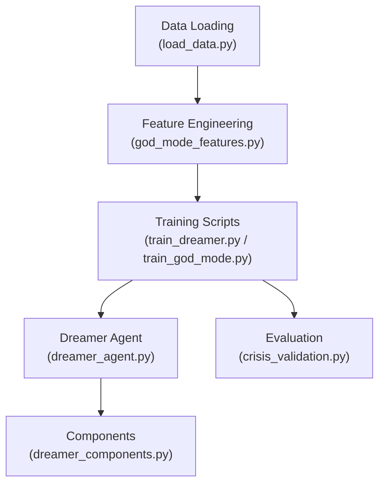
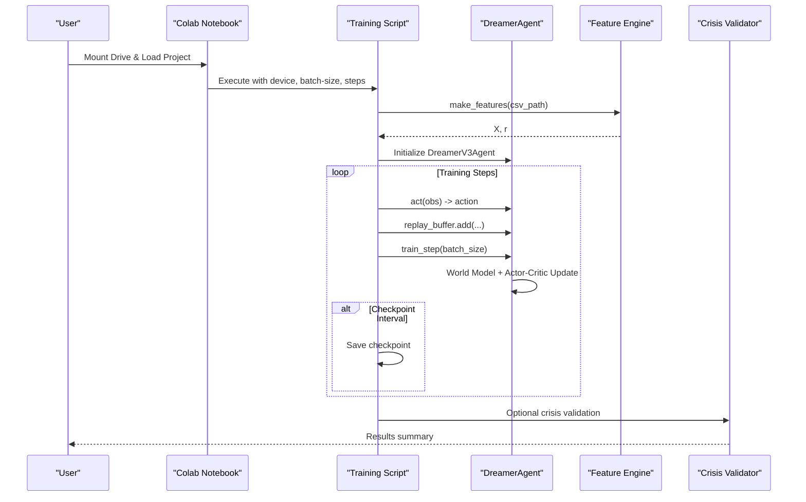
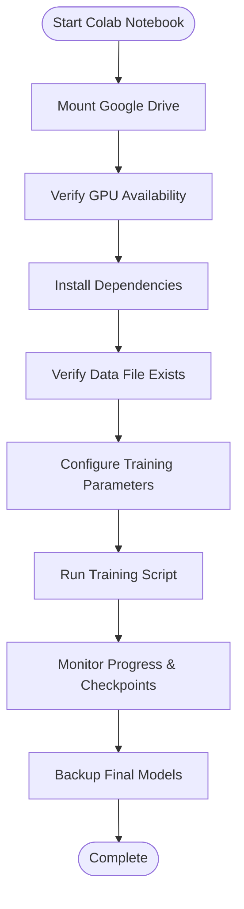
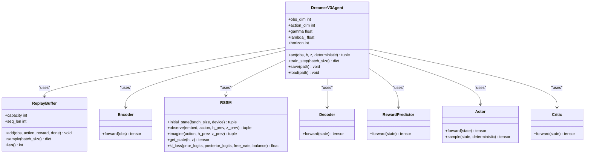
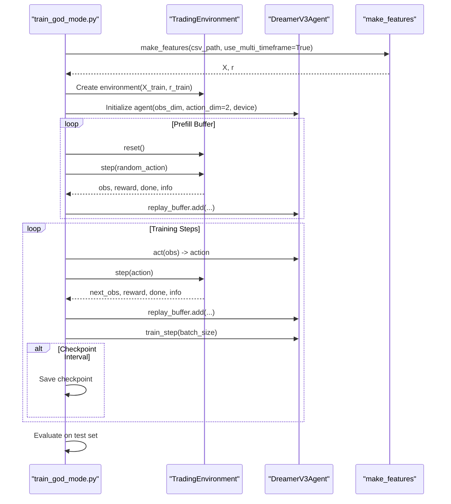
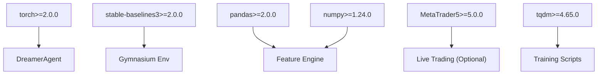

# Dreamer V3 Training Tutorial

<cite>
**Referenced Files in This Document**
- [COLAB_TRAINING_GUIDE.md](file://COLAB_TRAINING_GUIDE.md)
- [colab_train_dreamer.ipynb](file://colab_train_dreamer.ipynb)
- [train/train_dreamer.py](file://train/train_dreamer.py)
- [train/train_god_mode.py](file://train/train_god_mode.py)
- [models/dreamer_agent.py](file://models/dreamer_agent.py)
- [models/dreamer_components.py](file://models/dreamer_components.py)
- [features/god_mode_features.py](file://features/god_mode_features.py)
- [data/load_data.py](file://data/load_data.py)
- [requirements.txt](file://requirements.txt)
- [eval/crisis_validation.py](file://eval/crisis_validation.py)
</cite>

## Table of Contents
1. [Introduction](#introduction)
2. [Project Structure](#project-structure)
3. [Core Components](#core-components)
4. [Architecture Overview](#architecture-overview)
5. [Detailed Component Analysis](#detailed-component-analysis)
6. [Dependency Analysis](#dependency-analysis)
7. [Performance Considerations](#performance-considerations)
8. [Troubleshooting Guide](#troubleshooting-guide)
9. [Conclusion](#conclusion)
10. [Appendices](#appendices)

## Introduction
This tutorial provides a complete, step-by-step guide to training a world model-based reinforcement learning agent (Dreamer V3) for trading on Google Colab. It focuses on the “God Mode” configuration targeting 1 million steps with auto-resume capabilities and checkpoint handling. You will learn how to prepare data, configure training, monitor progress, handle session disconnections, manage memory, and extract results. The guide also includes performance expectations across different Colab hardware tiers and practical troubleshooting strategies.

## Project Structure
The repository is organized into modules that separate data preparation, feature engineering, model architecture, training scripts, evaluation, and deployment utilities. Key directories include:
- data: Data loading and preprocessing utilities
- features: Feature engineering including multi-timeframe and macro features
- models: Dreamer V3 implementation and components
- train: Training entry points for standard and God Mode configurations
- eval: Evaluation and crisis validation tools
- notebooks: Colab notebook for end-to-end training workflow

**Diagram sources**
- [data/load_data.py:1-84](file://data/load_data.py#L1-L84)
- [features/god_mode_features.py:291-413](file://features/god_mode_features.py#L291-L413)
- [train/train_dreamer.py:128-331](file://train/train_dreamer.py#L128-L331)
- [train/train_god_mode.py:134-393](file://train/train_god_mode.py#L134-L393)
- [models/dreamer_agent.py:84-427](file://models/dreamer_agent.py#L84-L427)
- [models/dreamer_components.py:71-295](file://models/dreamer_components.py#L71-L295)
- [eval/crisis_validation.py:29-171](file://eval/crisis_validation.py#L29-L171)

**Section sources**
- [data/load_data.py:1-84](file://data/load_data.py#L1-L84)
- [features/god_mode_features.py:291-413](file://features/god_mode_features.py#L291-L413)
- [train/train_dreamer.py:128-331](file://train/train_dreamer.py#L128-L331)
- [train/train_god_mode.py:134-393](file://train/train_god_mode.py#L134-L393)
- [models/dreamer_agent.py:84-427](file://models/dreamer_agent.py#L84-L427)
- [models/dreamer_components.py:71-295](file://models/dreamer_components.py#L71-L295)
- [eval/crisis_validation.py:29-171](file://eval/crisis_validation.py#L29-L171)

## Core Components
- Data loader: Reads OHLCV CSVs, normalizes column names, validates OHLC constraints, and prepares time-indexed data.
- Feature engine: Generates multi-timeframe technical indicators, macro correlations (DXY, SPX, US10Y), and optional economic calendar awareness.
- Dreamer V3 agent: Implements world model learning (encoder, RSSM, decoder, reward predictor) and actor-critic policy/value networks with replay buffer and imagination-based planning.
- Training scripts: Provide both a baseline training flow and a God Mode flow with comprehensive features and extended training targets.
- Evaluation: Crisis validation framework to test robustness under known market stress periods.

**Section sources**
- [data/load_data.py:5-73](file://data/load_data.py#L5-L73)
- [features/god_mode_features.py:23-379](file://features/god_mode_features.py#L23-L379)
- [models/dreamer_agent.py:24-147](file://models/dreamer_agent.py#L24-L147)
- [models/dreamer_components.py:71-295](file://models/dreamer_components.py#L71-L295)
- [train/train_dreamer.py:128-331](file://train/train_dreamer.py#L128-L331)
- [train/train_god_mode.py:134-393](file://train/train_god_mode.py#L134-L393)
- [eval/crisis_validation.py:29-171](file://eval/crisis_validation.py#L29-L171)

## Architecture Overview
The training pipeline integrates data ingestion, feature engineering, and Dreamer V3 RL training with periodic checkpoints and auto-resume support. The Colab notebook orchestrates environment setup, dependency installation, data verification, parameter configuration, and execution of the training script.

**Diagram sources**
- [colab_train_dreamer.ipynb:164-205](file://colab_train_dreamer.ipynb#L164-L205)
- [train/train_dreamer.py:168-292](file://train/train_dreamer.py#L168-L292)
- [train/train_god_mode.py:182-333](file://train/train_god_mode.py#L182-L333)
- [models/dreamer_agent.py:148-304](file://models/dreamer_agent.py#L148-L304)
- [features/god_mode_features.py:382-413](file://features/god_mode_features.py#L382-L413)
- [eval/crisis_validation.py:109-171](file://eval/crisis_validation.py#L109-L171)

## Detailed Component Analysis

### Colab Training Workflow
- Setup: Mount Google Drive, verify GPU availability, install dependencies, and confirm PyTorch CUDA support.
- Data verification: Ensure the expected CSV exists and contains required columns; inspect shape and sample rows.
- Configuration: Set target steps (1,000,000 for God Mode), batch size, device selection, and checkpoint frequency. Resume from a previous checkpoint if provided.
- Execution: Launch training via subprocess call to the appropriate training script with arguments for device, batch size, and steps.
- Monitoring: Periodically list saved checkpoints and estimate progress based on filenames containing step numbers.
- Backup: Archive final models and back up to Google Drive with timestamped folders.

**Diagram sources**
- [colab_train_dreamer.ipynb:32-103](file://colab_train_dreamer.ipynb#L32-L103)
- [colab_train_dreamer.ipynb:106-161](file://colab_train_dreamer.ipynb#L106-L161)
- [colab_train_dreamer.ipynb:164-205](file://colab_train_dreamer.ipynb#L164-L205)
- [colab_train_dreamer.ipynb:208-249](file://colab_train_dreamer.ipynb#L208-L249)
- [colab_train_dreamer.ipynb:251-301](file://colab_train_dreamer.ipynb#L251-L301)

**Section sources**
- [colab_train_dreamer.ipynb:32-103](file://colab_train_dreamer.ipynb#L32-L103)
- [colab_train_dreamer.ipynb:106-161](file://colab_train_dreamer.ipynb#L106-L161)
- [colab_train_dreamer.ipynb:164-205](file://colab_train_dreamer.ipynb#L164-L205)
- [colab_train_dreamer.ipynb:208-249](file://colab_train_dreamer.ipynb#L208-L249)
- [colab_train_dreamer.ipynb:251-301](file://colab_train_dreamer.ipynb#L251-L301)

### Dreamer V3 Agent and Components
- Replay Buffer: Stores sequences of observations, actions, rewards, and done flags; samples contiguous sequences for training.
- World Model: Encoder compresses observations; RSSM learns latent dynamics with deterministic and stochastic states; Decoder reconstructs observations; Reward Predictor estimates returns in symlog space.
- Policy and Value: Actor outputs categorical action distribution; Critic estimates values; both trained using imagined trajectories over a horizon.
- Training Loop: Alternates between world model updates and actor-critic optimization; uses gradient clipping and KL regularization to stabilize learning.

**Diagram sources**
- [models/dreamer_agent.py:24-147](file://models/dreamer_agent.py#L24-L147)
- [models/dreamer_agent.py:148-304](file://models/dreamer_agent.py#L148-L304)
- [models/dreamer_components.py:71-295](file://models/dreamer_components.py#L71-L295)

**Section sources**
- [models/dreamer_agent.py:24-147](file://models/dreamer_agent.py#L24-L147)
- [models/dreamer_agent.py:148-304](file://models/dreamer_agent.py#L148-L304)
- [models/dreamer_components.py:71-295](file://models/dreamer_components.py#L71-L295)

### God Mode Training Flow
- Data Preparation: Loads OHLCV with macro columns (DXY, SPX, US10Y); generates multi-timeframe features (H1, H4, D1), macro correlations, and optional economic calendar awareness.
- Environment: Custom trading environment simulates long-only positions with transaction costs and computes rewards based on returns and position changes.
- Training Phases: Prefill replay buffer with random exploration; train world model and actor-critic alternately; save checkpoints at intervals; evaluate on test set.
- Auto-Resume: Supports resuming from a specified checkpoint path; training continues seamlessly after session disconnects.

**Diagram sources**
- [train/train_god_mode.py:182-333](file://train/train_god_mode.py#L182-L333)
- [features/god_mode_features.py:382-413](file://features/god_mode_features.py#L382-L413)
- [models/dreamer_agent.py:148-304](file://models/dreamer_agent.py#L148-L304)

**Section sources**
- [train/train_god_mode.py:182-333](file://train/train_god_mode.py#L182-L333)
- [features/god_mode_features.py:382-413](file://features/god_mode_features.py#L382-L413)
- [models/dreamer_agent.py:148-304](file://models/dreamer_agent.py#L148-L304)

### Baseline Training Flow
- Data Handling: Automatically selects macro-enhanced data if available; otherwise falls back to basic OHLCV.
- Environment and Agent: Similar structure to God Mode but with fewer features and simpler configuration.
- Training Loop: Prefill buffer, alternate world model and actor-critic updates, periodic checkpointing, and test set evaluation.

**Section sources**
- [train/train_dreamer.py:168-292](file://train/train_dreamer.py#L168-L292)

### Evaluation and Validation
- Crisis Validator: Tests agent behavior during historical crises (e.g., COVID crash, rate hikes, SVB collapse). Computes metrics like equity survival, drawdown, Sharpe ratio, and trade frequency.
- Usage: After training, run validation to ensure robustness before live deployment.

**Section sources**
- [eval/crisis_validation.py:29-171](file://eval/crisis_validation.py#L29-L171)

## Dependency Analysis
The system depends on deep learning frameworks, data processing libraries, and optional visualization and ML tools. Requirements are explicitly listed and installed in the Colab environment.

**Diagram sources**
- [requirements.txt:1-29](file://requirements.txt#L1-L29)
- [models/dreamer_agent.py:11-21](file://models/dreamer_agent.py#L11-L21)
- [features/god_mode_features.py:14-19](file://features/god_mode_features.py#L14-L19)
- [train/train_dreamer.py:7-18](file://train/train_dreamer.py#L7-L18)

**Section sources**
- [requirements.txt:1-29](file://requirements.txt#L1-L29)
- [models/dreamer_agent.py:11-21](file://models/dreamer_agent.py#L11-L21)
- [features/god_mode_features.py:14-19](file://features/god_mode_features.py#L14-L19)
- [train/train_dreamer.py:7-18](file://train/train_dreamer.py#L7-L18)

## Performance Considerations
- Hardware Tiers and Expected Times:
  - Colab Free (T4): 20–30 hours total, typically requiring 2–3 session resumes to reach 1 million steps.
  - Colab Pro (V100): 12–18 hours, fewer resumes needed.
  - Colab Pro+ (A100): 5–7 hours, often continuous single session.
- Memory Management:
  - Reduce batch size if out-of-memory errors occur (e.g., from 128 down to 64 or 32).
  - Restart runtime when necessary and re-run setup cells to clear memory.
- Training Speed:
  - Ensure GPU is enabled and detected by PyTorch.
  - Avoid CPU usage by mistake; verify device selection in configuration.
  - Be aware of potential throttling on long-running sessions; consider upgrading for consistent performance.
- Checkpoint Frequency:
  - Default interval saves every 10,000 steps; adjust based on storage and resume needs.
- Multi-Model Ensembles:
  - Train multiple models with different seeds to create ensembles for improved robustness.

**Section sources**
- [COLAB_TRAINING_GUIDE.md:7-11](file://COLAB_TRAINING_GUIDE.md#L7-L11)
- [COLAB_TRAINING_GUIDE.md:132-195](file://COLAB_TRAINING_GUIDE.md#L132-L195)
- [COLAB_TRAINING_GUIDE.md:199-215](file://COLAB_TRAINING_GUIDE.md#L199-L215)
- [colab_train_dreamer.ipynb:144-161](file://colab_train_dreamer.ipynb#L144-L161)

## Troubleshooting Guide
Common issues and solutions:
- GPU Not Available:
  - Enable GPU in runtime settings, restart runtime, and reinstall dependencies to verify CUDA detection.
- Data File Not Found:
  - Confirm the correct path in the notebook; verify upload to Google Drive; run data verification cell to diagnose.
- Out of Memory:
  - Lower batch size; restart runtime; re-run setup cells; ensure no other processes consume GPU memory.
- Session Disconnected:
  - Normal for Colab Free after ~12 hours; re-run setup and training cells to resume from last checkpoint automatically.
- Training Too Slow:
  - Verify GPU usage; check if running on CPU; consider upgrading to Pro+ for sustained A100 access.

**Section sources**
- [COLAB_TRAINING_GUIDE.md:163-195](file://COLAB_TRAINING_GUIDE.md#L163-L195)
- [colab_train_dreamer.ipynb:320-339](file://colab_train_dreamer.ipynb#L320-L339)

## Conclusion
You now have a complete roadmap to train a Dreamer V3 world model-based trading agent in Google Colab with “God Mode” features targeting 1 million steps. The workflow covers data preparation, model training, progress monitoring, checkpoint handling, and result extraction. With auto-resume capabilities and structured troubleshooting, you can reliably train across different hardware tiers and validate robustness through crisis testing before considering live deployment.

## Appendices

### Step-by-Step Instructions Summary
- Prepare project files and upload to Google Drive.
- Open the Colab notebook and enable GPU runtime.
- Mount Drive, load project, install dependencies, and verify data.
- Configure training parameters (steps, batch size, device, checkpoint frequency).
- Start training; monitor progress via checkpoints and logs.
- Handle session disconnects by re-running setup and training cells to resume.
- Download and backup final models; optionally run crisis validation.

**Section sources**
- [COLAB_TRAINING_GUIDE.md:22-110](file://COLAB_TRAINING_GUIDE.md#L22-L110)
- [colab_train_dreamer.ipynb:32-205](file://colab_train_dreamer.ipynb#L32-L205)
- [colab_train_dreamer.ipynb:208-301](file://colab_train_dreamer.ipynb#L208-L301)