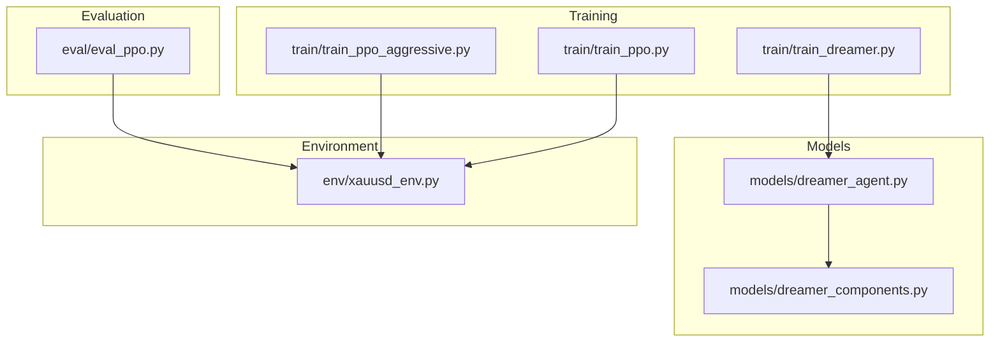
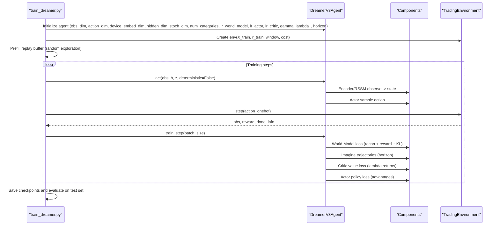
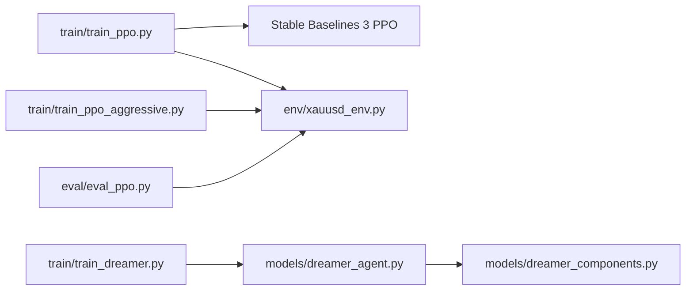

# Hyperparameter Optimization Guide

<cite>
**Referenced Files in This Document**
- [train_ppo.py](file://train/train_ppo.py)
- [train_dreamer.py](file://train/train_dreamer.py)
- [dreamer_agent.py](file://models/dreamer_agent.py)
- [dreamer_components.py](file://models/dreamer_components.py)
- [xauusd_env.py](file://env/xauusd_env.py)
- [eval_ppo.py](file://eval/eval_ppo.py)
- [DREAMER_IMPLEMENTATION_GUIDE.md](file://DREAMER_IMPLEMENTATION_GUIDE.md)
- [COLAB_TRAINING_GUIDE.md](file://COLAB_TRAINING_GUIDE.md)
</cite>

## Table of Contents
1. Introduction
2. Project Structure
3. Core Components
4. Architecture Overview
5. Detailed Component Analysis
6. Dependency Analysis
7. Performance Considerations
8. Troubleshooting Guide
9. Conclusion
10. Appendices

## Introduction
This guide provides a comprehensive, code-sourced hyperparameter optimization strategy for the two training algorithms implemented in this project: Proximal Policy Optimization (PPO) and DreamerV3. It focuses on learning rates, batch sizes, network architectures, reward function weights, systematic tuning approaches (grid search and automated methods), practical sweep examples, performance analysis, selection criteria, resource constraints, stability considerations, and validation strategies to prevent overfitting.

## Project Structure
The repository implements two distinct RL pipelines:
- PPO via Stable Baselines 3 with vectorized environments
- DreamerV3 model-based RL with a world model, actor-critic policy, and imagination-based planning

**Diagram sources**
- [train_ppo.py:1-93](file://train/train_ppo.py#L1-L93)
- [train_dreamer.py:1-331](file://train/train_dreamer.py#L1-L331)
- [dreamer_agent.py:1-460](file://models/dreamer_agent.py#L1-L460)
- [dreamer_components.py:1-338](file://models/dreamer_components.py#L1-L338)
- [xauusd_env.py:1-118](file://env/xauusd_env.py#L1-L118)
- [eval_ppo.py:1-94](file://eval/eval_ppo.py#L1-L94)

**Section sources**
- [train_ppo.py:1-93](file://train/train_ppo.py#L1-L93)
- [train_dreamer.py:1-331](file://train/train_dreamer.py#L1-L331)
- [dreamer_agent.py:1-460](file://models/dreamer_agent.py#L1-L460)
- [dreamer_components.py:1-338](file://models/dreamer_components.py#L1-L338)
- [xauusd_env.py:1-118](file://env/xauusd_env.py#L1-L118)
- [eval_ppo.py:1-94](file://eval/eval_ppo.py#L1-L94)

## Core Components
- PPO Training: Uses a vectorized environment and SB3’s PPO implementation with discrete actions. Key tunables include n_steps, batch_size, gamma, learning_rate, and entropy coefficient when using the aggressive variant.
- DreamerV3 Training: Implements a world model (encoder, RSSM, decoder, reward predictor) and an actor-critic policy trained via imagination. Tunables include architecture dimensions, learning rates per component, horizon, discount factor, GAE lambda, KL regularization terms, and replay buffer settings.
- Environment Reward Design: The trading environment composes PnL, trade costs, turnover penalties, flat penalties, and hold bonuses to shape behavior and stability.

**Section sources**
- [train_ppo.py:46-58](file://train/train_ppo.py#L46-L58)
- [train_ppo_aggressive.py:50-59](file://train/train_ppo_aggressive.py#L50-L59)
- [dreamer_agent.py:91-143](file://models/dreamer_agent.py#L91-L143)
- [dreamer_components.py:71-205](file://models/dreamer_components.py#L71-L205)
- [xauusd_env.py:21-31](file://env/xauusd_env.py#L21-L31)
- [xauusd_env.py:75-117](file://env/xauusd_env.py#L75-L117)

## Architecture Overview

**Diagram sources**
- [train_dreamer.py:128-331](file://train/train_dreamer.py#L128-L331)
- [dreamer_agent.py:148-304](file://models/dreamer_agent.py#L148-L304)
- [dreamer_components.py:71-205](file://models/dreamer_components.py#L71-L205)
- [xauusd_env.py:75-117](file://env/xauusd_env.py#L75-L117)

## Detailed Component Analysis

### PPO Hyperparameters and Tuning
Key tunables observed in the code:
- Learning rate: default 3e-4
- Batch size: 256 (standard), 512 (aggressive macro version)
- n_steps: 1024 (standard), 2048 (aggressive)
- gamma: 0.99
- Entropy coefficient: 0.01 (aggressive variant)
- Number of parallel environments: 8 (standard), 16 (aggressive)
- Window size: 64 (standard), 120 (aggressive macro)
- Cost per trade: 0.0001

Systematic tuning approach:
- Grid search over learning_rate ∈ {1e-4, 3e-4, 1e-3}, batch_size ∈ {128, 256, 512}, n_steps ∈ {512, 1024, 2048}, ent_coef ∈ {0.0, 0.01, 0.05}
- Use fixed seeds and identical data splits; evaluate out-of-sample equity curves and metrics (final equity, trades, % time long/short)
- Track convergence speed and stability (loss variance, equity drawdowns)

Practical sweep example:
- Run multiple jobs varying learning_rate and batch_size while holding other parameters constant
- For each run, log final test equity, number of trades, and % time long; select configuration that maximizes out-of-sample equity with acceptable turnover and drawdown

Selection criteria:
- Highest out-of-sample equity with stable equity curve
- Reasonable turnover (avoid excessive trading due to high entropy or low cost)
- Robustness across different market regimes (validate on separate periods)

Resource constraints:
- Increase N_ENVS cautiously; memory scales with batch_size × n_steps × N_ENVS
- On CPU, prefer smaller batch_size and fewer envs; on GPU, increase batch_size up to memory limits

Validation strategy:
- Train/test split by date; evaluate on unseen period
- Compare against baselines (buy-and-hold, moving average crossover)

**Section sources**
- [train_ppo.py:11-23](file://train/train_ppo.py#L11-L23)
- [train_ppo.py:46-58](file://train/train_ppo.py#L46-L58)
- [train_ppo_aggressive.py:11-23](file://train/train_ppo_aggressive.py#L11-L23)
- [train_ppo_aggressive.py:50-59](file://train/train_ppo_aggressive.py#L50-L59)
- [eval_ppo.py:45-70](file://eval/eval_ppo.py#L45-L70)

### DreamerV3 Hyperparameters and Tuning
Core components and their tunables:
- Architecture:
  - embed_dim: 256
  - hidden_dim: 512
  - stoch_dim: 32
  - num_categories: 32
- Learning rates:
  - lr_world_model: 3e-4
  - lr_actor: 1e-4
  - lr_critic: 3e-4
- Planning and returns:
  - gamma: 0.99
  - lambda_: 0.95
  - horizon: 15
- Regularization:
  - free_nats: 1.0
  - kl_balance: 0.8
- Training schedule:
  - BATCH_SIZE: 16 (default), recommended 64 for GPU
  - PREFILL_STEPS: 5,000
  - TRAIN_STEPS: 100,000
  - TRAIN_EVERY: 4
  - SAVE_EVERY: 10,000

Systematic tuning approach:
- Start from defaults; tune learning rates first (actor typically slower than world model/critic)
- Adjust horizon to balance planning depth vs compute; longer horizons improve lookahead but increase variance and cost
- Tune KL regularization (free_nats, kl_balance) to avoid posterior collapse or underuse of latent space
- Increase batch_size if GPU memory allows; monitor world model reconstruction and reward prediction losses

Practical sweep example:
- Sweep lr_actor ∈ {5e-5, 1e-4, 2e-4}, lr_world_model ∈ {1e-4, 3e-4, 1e-3}, horizon ∈ {10, 15, 25}, free_nats ∈ {0.5, 1.0, 2.0}
- Evaluate final test equity, world model loss trajectory, KL loss stability, and policy/value loss convergence

Selection criteria:
- Stable world model losses (recon and reward) decreasing without divergence
- KL loss within reasonable range (not collapsing nor exploding)
- Out-of-sample equity improvement with controlled turnover and drawdown

Resource constraints:
- Memory usage scales with batch_size, horizon, and architecture sizes
- Reduce hidden_dim/embed_dim or batch_size if encountering OOM
- Use device auto-detection (CUDA/MPS/CPU) to optimize throughput

Validation strategy:
- Use prefill phase to ensure diverse experiences before training
- Monitor evaluation metrics on test set; compare against baselines
- Checkpoint frequently and resume training if needed

**Section sources**
- [train_dreamer.py:21-33](file://train/train_dreamer.py#L21-L33)
- [train_dreamer.py:194-208](file://train/train_dreamer.py#L194-L208)
- [dreamer_agent.py:91-143](file://models/dreamer_agent.py#L91-L143)
- [dreamer_components.py:71-205](file://models/dreamer_components.py#L71-L205)
- [DREAMER_IMPLEMENTATION_GUIDE.md:143-186](file://DREAMER_IMPLEMENTATION_GUIDE.md#L143-L186)

### Reward Function Weights and Stability
The environment reward combines multiple terms to encourage profitable and stable behavior:
- PnL from previous position
- Trade cost proportional to position changes
- Turnover penalty to discourage frequent flips
- Flat penalty to nudge exposure in drift markets
- Hold bonus to reward stability (no change in position)

Tuning guidance:
- Increase turnover_coef to reduce whipsaw trading
- Adjust flat_penalty to control tendency to stay flat
- Adjust hold_bonus to stabilize positions and reduce churn
- Ensure cost_per_trade reflects realistic transaction costs

Impact on training:
- Balanced rewards lead to smoother equity curves and lower turnover
- Over-penalizing turnover can suppress legitimate signals; under-penalizing leads to overtrading

**Section sources**
- [xauusd_env.py:21-31](file://env/xauusd_env.py#L21-L31)
- [xauusd_env.py:75-117](file://env/xauusd_env.py#L75-L117)

## Dependency Analysis

**Diagram sources**
- [train_ppo.py:1-93](file://train/train_ppo.py#L1-L93)
- [train_dreamer.py:1-331](file://train/train_dreamer.py#L1-L331)
- [dreamer_agent.py:1-460](file://models/dreamer_agent.py#L1-L460)
- [dreamer_components.py:1-338](file://models/dreamer_components.py#L1-L338)
- [xauusd_env.py:1-118](file://env/xauusd_env.py#L1-L118)
- [eval_ppo.py:1-94](file://eval/eval_ppo.py#L1-L94)

**Section sources**
- [train_ppo.py:1-93](file://train/train_ppo.py#L1-L93)
- [train_dreamer.py:1-331](file://train/train_dreamer.py#L1-L331)
- [dreamer_agent.py:1-460](file://models/dreamer_agent.py#L1-L460)
- [dreamer_components.py:1-338](file://models/dreamer_components.py#L1-L338)
- [xauusd_env.py:1-118](file://env/xauusd_env.py#L1-L118)
- [eval_ppo.py:1-94](file://eval/eval_ppo.py#L1-L94)

## Performance Considerations
- PPO:
  - Larger batch_size and n_steps improve gradient estimates but require more memory
  - Increasing N_ENVS improves sample efficiency; ensure OS limits allow many processes
  - Entropy coefficient encourages exploration; too high may destabilize policy
- DreamerV3:
  - Horizon controls planning depth; longer horizons increase computation and variance
  - Batch_size affects throughput; start small and scale up with available GPU memory
  - KL regularization prevents posterior collapse; tune free_nats and kl_balance based on KL loss behavior
- Environment:
  - Realistic cost_per_trade and turnover penalties are critical for meaningful performance
  - Max episode steps influence training dynamics; shorter episodes may accelerate learning but limit long-term planning

[No sources needed since this section provides general guidance]

## Troubleshooting Guide
Common issues and remedies:
- PPO instability:
  - Reduce learning rate or batch size
  - Lower entropy coefficient to reduce exploration noise
- DreamerV3 training issues:
  - Loss NaN: check data for inf/nan; reduce learning rates; increase gradient clipping
  - KL loss too high/low: adjust free_nats; high indicates excessive regularization, low indicates posterior collapse
  - CUDA OOM: reduce batch_size or architecture dimensions; switch to CPU if necessary
- Evaluation discrepancies:
  - Ensure consistent feature windows and cost assumptions between train and eval
  - Validate against baselines to confirm model is not overfitting

**Section sources**
- [DREAMER_IMPLEMENTATION_GUIDE.md:242-261](file://DREAMER_IMPLEMENTATION_GUIDE.md#L242-L261)
- [COLAB_TRAINING_GUIDE.md:163-195](file://COLAB_TRAINING_GUIDE.md#L163-L195)

## Conclusion
This guide outlined actionable hyperparameter optimization strategies for both PPO and DreamerV3 in the trading system. By systematically tuning learning rates, batch sizes, network architectures, planning horizons, and reward weights—and validating on out-of-sample data—you can achieve robust, stable performance. Use grid searches and automated sweeps to explore configurations, monitor key loss trajectories and equity curves, and select models that generalize well across market regimes while respecting resource constraints.

[No sources needed since this section summarizes without analyzing specific files]

## Appendices

### Appendix A: PPO Configuration Reference
- Default PPO:
  - n_steps: 1024
  - batch_size: 256
  - gamma: 0.99
  - learning_rate: 3e-4
- Aggressive Macro PPO:
  - n_steps: 2048
  - batch_size: 512
  - gamma: 0.99
  - learning_rate: 3e-4
  - ent_coef: 0.01

**Section sources**
- [train_ppo.py:46-58](file://train/train_ppo.py#L46-L58)
- [train_ppo_aggressive.py:50-59](file://train/train_ppo_aggressive.py#L50-L59)

### Appendix B: DreamerV3 Configuration Reference
- Architecture:
  - embed_dim: 256
  - hidden_dim: 512
  - stoch_dim: 32
  - num_categories: 32
- Learning Rates:
  - lr_world_model: 3e-4
  - lr_actor: 1e-4
  - lr_critic: 3e-4
- Planning:
  - gamma: 0.99
  - lambda_: 0.95
  - horizon: 15
- Regularization:
  - free_nats: 1.0
  - kl_balance: 0.8
- Training Schedule:
  - BATCH_SIZE: 16 (default), 64 recommended for GPU
  - PREFILL_STEPS: 5,000
  - TRAIN_STEPS: 100,000
  - TRAIN_EVERY: 4
  - SAVE_EVERY: 10,000

**Section sources**
- [train_dreamer.py:194-208](file://train/train_dreamer.py#L194-L208)
- [dreamer_agent.py:91-143](file://models/dreamer_agent.py#L91-L143)
- [DREAMER_IMPLEMENTATION_GUIDE.md:143-186](file://DREAMER_IMPLEMENTATION_GUIDE.md#L143-L186)

### Appendix C: Environment Reward Terms
- Trade cost: cost_per_trade × |Δposition|
- Turnover penalty: turnover_coef × |Δposition|
- Flat penalty: flat_penalty if new_pos == 0
- Hold bonus: hold_bonus if Δposition == 0
- PnL: previous_position × return

**Section sources**
- [xauusd_env.py:75-117](file://env/xauusd_env.py#L75-L117)