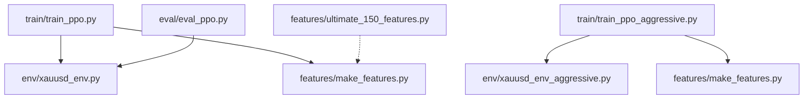
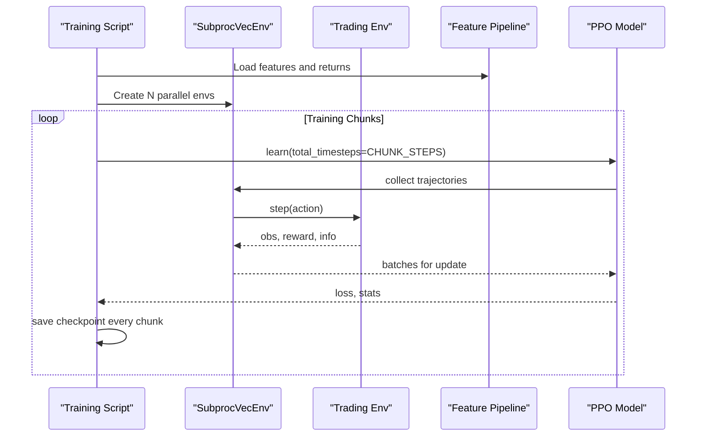
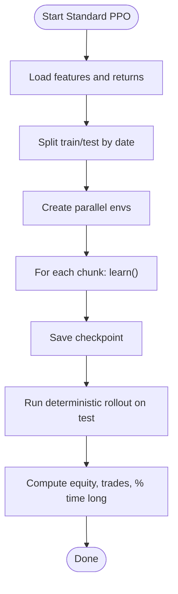
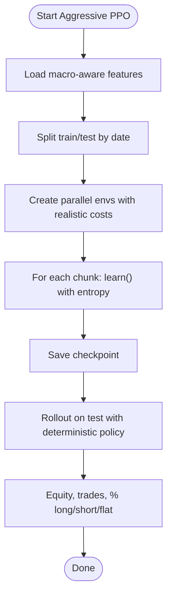
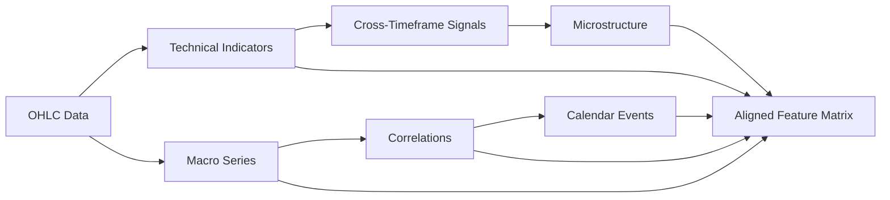
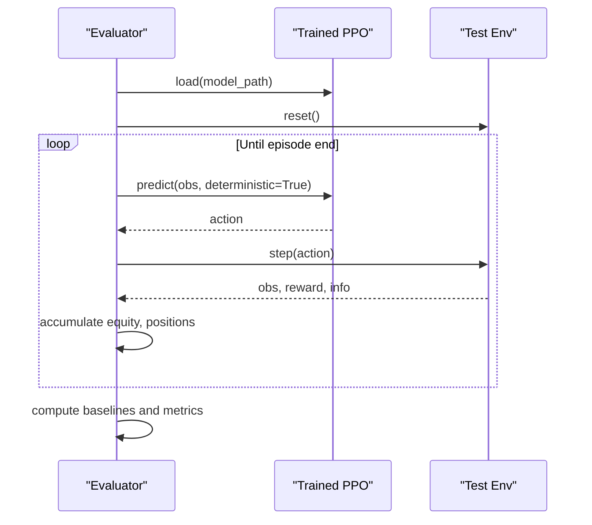
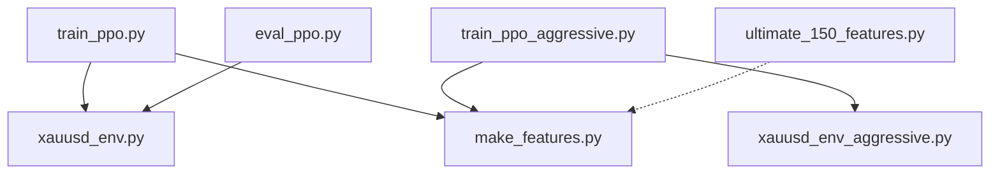

# PPO Training Tutorial

<cite>
**Referenced Files in This Document**
- [train_ppo.py](file://train/train_ppo.py)
- [train_ppo_aggressive.py](file://train/train_ppo_aggressive.py)
- [xauusd_env.py](file://env/xauusd_env.py)
- [xauusd_env_aggressive.py](file://env/xauusd_env_aggressive.py)
- [ultimate_150_features.py](file://features/ultimate_150_features.py)
- [make_features.py](file://features/make_features.py)
- [eval_ppo.py](file://eval/eval_ppo.py)
- [README.md](file://README.md)
</cite>

## Table of Contents
1. [Introduction](#introduction)
2. [Project Structure](#project-structure)
3. [Core Components](#core-components)
4. [Architecture Overview](#architecture-overview)
5. [Detailed Component Analysis](#detailed-component-analysis)
6. [Dependency Analysis](#dependency-analysis)
7. [Performance Considerations](#performance-considerations)
8. [Troubleshooting Guide](#troubleshooting-guide)
9. [Conclusion](#conclusion)
10. [Appendices](#appendices)

## Introduction
This tutorial explains how to train Proximal Policy Optimization (PPO) agents for XAUUSD trading using the repository’s standard and aggressive configurations. It covers environment setup, hyperparameter tuning, performance optimization, and practical guidance on interpreting training metrics and avoiding overfitting. You will learn when to use each mode, their trade-offs, and how to monitor progress effectively.

## Project Structure
The PPO training pipeline is centered around two scripts:
- Standard PPO training with long-only actions and a moderate feature window
- Aggressive PPO training with long/flat/short actions, macro-aware features, and stricter realism

Key modules:
- Environments define observation/action spaces and reward logic
- Feature pipelines provide market intelligence inputs
- Evaluation script runs out-of-sample rollouts and compares to baselines

**Diagram sources**
- [train_ppo.py:1-93](file://train/train_ppo.py#L1-L93)
- [train_ppo_aggressive.py:1-124](file://train/train_ppo_aggressive.py#L1-L124)
- [xauusd_env.py:1-118](file://env/xauusd_env.py#L1-L118)
- [xauusd_env_aggressive.py:1-144](file://env/xauusd_env_aggressive.py#L1-L144)
- [make_features.py:1-83](file://features/make_features.py#L1-L83)
- [ultimate_150_features.py:1-294](file://features/ultimate_150_features.py#L1-L294)
- [eval_ppo.py:1-94](file://eval/eval_ppo.py#L1-L94)

**Section sources**
- [train_ppo.py:1-93](file://train/train_ppo.py#L1-L93)
- [train_ppo_aggressive.py:1-124](file://train/train_ppo_aggressive.py#L1-L124)
- [make_features.py:1-83](file://features/make_features.py#L1-L83)
- [ultimate_150_features.py:1-294](file://features/ultimate_150_features.py#L1-L294)
- [eval_ppo.py:1-94](file://eval/eval_ppo.py#L1-L94)

## Core Components
- Standard PPO agent:
  - Discrete action space {Flat, Long}
  - Observation: flattened window of features plus current position
  - Reward includes PnL, transaction costs, turnover penalty, small flat penalty, and hold bonus
  - Uses SubprocVecEnv for parallel environments and chunked learning with periodic checkpoints

- Aggressive PPO agent:
  - Discrete action space {Short, Flat, Long}
  - Wider feature window and macro-aware data
  - Realistic cost model, optional leverage, stop-loss truncation
  - Higher exploration via entropy coefficient; larger batch and step sizes

- Features:
  - make_features builds normalized technical and optional macro features from OHLC
  - ultimate_150_features aggregates multi-timeframe, cross-timeframe, macro, calendar, and microstructure features into a unified matrix

- Evaluation:
  - Loads trained PPO model and rolls out on test period
  - Computes equity curve and compares to buy-and-hold and moving average baseline

**Section sources**
- [xauusd_env.py:1-118](file://env/xauusd_env.py#L1-L118)
- [xauusd_env_aggressive.py:1-144](file://env/xauusd_env_aggressive.py#L1-L144)
- [make_features.py:1-83](file://features/make_features.py#L1-L83)
- [ultimate_150_features.py:1-294](file://features/ultimate_150_features.py#L1-L294)
- [eval_ppo.py:1-94](file://eval/eval_ppo.py#L1-L94)

## Architecture Overview
The training flow uses Stable-Baselines3 PPO with vectorized environments. The standard mode focuses on long-only strategies with a compact feature window, while the aggressive mode adds shorting, macro awareness, and stricter realism.

**Diagram sources**
- [train_ppo.py:25-67](file://train/train_ppo.py#L25-L67)
- [train_ppo_aggressive.py:25-84](file://train/train_ppo_aggressive.py#L25-L84)
- [xauusd_env.py:75-118](file://env/xauusd_env.py#L75-L118)
- [xauusd_env_aggressive.py:86-144](file://env/xauusd_env_aggressive.py#L86-L144)

## Detailed Component Analysis

### Standard PPO Training
- Environment:
  - Action space: {Flat, Long}
  - Observation: last WINDOW features flattened + current position
  - Reward: PnL minus costs and penalties, plus stability bonuses
  - Episode termination by dataset end or max steps

- Training configuration:
  - n_steps per env, batch_size, gamma, learning_rate
  - Chunked learning with periodic saves
  - Quick evaluation on held-out test set

**Diagram sources**
- [train_ppo.py:25-88](file://train/train_ppo.py#L25-L88)
- [xauusd_env.py:21-118](file://env/xauusd_env.py#L21-L118)

**Section sources**
- [train_ppo.py:1-93](file://train/train_ppo.py#L1-L93)
- [xauusd_env.py:1-118](file://env/xauusd_env.py#L1-L118)

### Aggressive PPO Training
- Environment:
  - Action space: {Short, Flat, Long}
  - Wider window and macro-aware features
  - Realistic cost model, optional leverage, stop-loss truncation
  - No participation trophies: no flat penalty or artificial profit multiplier

- Training configuration:
  - Larger n_steps and batch_size
  - Entropy coefficient for exploration
  - Macro-aware data path and longer horizon

**Diagram sources**
- [train_ppo_aggressive.py:25-118](file://train/train_ppo_aggressive.py#L25-L118)
- [xauusd_env_aggressive.py:20-144](file://env/xauusd_env_aggressive.py#L20-L144)

**Section sources**
- [train_ppo_aggressive.py:1-124](file://train/train_ppo_aggressive.py#L1-L124)
- [xauusd_env_aggressive.py:1-144](file://env/xauusd_env_aggressive.py#L1-L144)

### Feature Engineering
- make_features:
  - Builds normalized technical features (returns, volatility, momentum, MA diffs, RSI, MACD)
  - Optionally integrates macro series (DXY, SPX, US10Y) and correlations
  - Returns normalized feature matrix and log returns

- ultimate_150_features:
  - Combines multi-timeframe indicators, cross-timeframe signals, macro, calendar events, and microstructure
  - Aligns all sources to a base timeframe index and fills missing values
  - Produces a large feature matrix ready for advanced models

**Diagram sources**
- [make_features.py:18-78](file://features/make_features.py#L18-L78)
- [ultimate_150_features.py:27-226](file://features/ultimate_150_features.py#L27-L226)

**Section sources**
- [make_features.py:1-83](file://features/make_features.py#L1-L83)
- [ultimate_150_features.py:1-294](file://features/ultimate_150_features.py#L1-L294)

### Evaluation and Baselines
- Loads trained PPO model
- Runs deterministic rollout on test period
- Compares equity curves to buy-and-hold and moving average strategy
- Prints key metrics and plots equity and positions

**Diagram sources**
- [eval_ppo.py:16-94](file://eval/eval_ppo.py#L16-L94)

**Section sources**
- [eval_ppo.py:1-94](file://eval/eval_ppo.py#L1-L94)

## Dependency Analysis
- Training scripts depend on:
  - Stable-Baselines3 PPO and SubprocVecEnv
  - Feature pipeline (make_features or ultimate_150_features)
  - Trading environments (standard or aggressive)
- Environments depend on:
  - Gymnasium spaces and numpy
  - Feature windows and return series
- Evaluation depends on:
  - Trained model artifacts
  - Test features and returns

**Diagram sources**
- [train_ppo.py:1-93](file://train/train_ppo.py#L1-L93)
- [train_ppo_aggressive.py:1-124](file://train/train_ppo_aggressive.py#L1-L124)
- [xauusd_env.py:1-118](file://env/xauusd_env.py#L1-L118)
- [xauusd_env_aggressive.py:1-144](file://env/xauusd_env_aggressive.py#L1-L144)
- [make_features.py:1-83](file://features/make_features.py#L1-L83)
- [ultimate_150_features.py:1-294](file://features/ultimate_150_features.py#L1-L294)
- [eval_ppo.py:1-94](file://eval/eval_ppo.py#L1-L94)

**Section sources**
- [train_ppo.py:1-93](file://train/train_ppo.py#L1-L93)
- [train_ppo_aggressive.py:1-124](file://train/train_ppo_aggressive.py#L1-L124)
- [eval_ppo.py:1-94](file://eval/eval_ppo.py#L1-L94)

## Performance Considerations
- Parallelism:
  - Use multiple vectorized environments to increase throughput
  - Adjust number of environments based on available CPU cores and memory
- Batch and step sizing:
  - Larger n_steps and batch_size improve sample efficiency but require more memory
  - Aggressive mode uses larger values to stabilize learning with more complex actions
- Exploration:
  - Entropy coefficient encourages diverse actions; tune if policy collapses too early
- Discount factor:
  - Gamma balances immediate vs future rewards; typical values near 0.99 work well
- Costs and realism:
  - Transaction costs and turnover penalties prevent over-trading
  - Stop-loss truncation in aggressive mode teaches risk control
- Feature scaling:
  - Normalization improves convergence; ensure consistent preprocessing across train/test
- Monitoring:
  - Track equity growth, trade frequency, and position distribution
  - Compare against baselines to validate value-add

[No sources needed since this section provides general guidance]

## Troubleshooting Guide
- Overfitting signs:
  - Training equity rises sharply while test equity stagnates or declines
  - Excessive trading frequency on test set
  - High sensitivity to small parameter changes
- Mitigation:
  - Increase regularization via entropy coefficient
  - Reduce model capacity or simplify features
  - Add more diverse data (macro, calendar, microstructure)
  - Use earlier checkpoints that generalize better
- Environment issues:
  - NaNs or infinities in features can break training; ensure cleaning and normalization
  - Misaligned timestamps cause mis-sampled observations; verify reindexing and forward-fill
- Cost modeling:
  - If profits vanish on test, review cost_per_trade and turnover_coef
  - In aggressive mode, adjust leverage and stop_loss_pct to reflect realistic constraints
- Hardware limits:
  - Out-of-memory errors: reduce batch_size, n_steps, or number of environments
  - Slow training: enable GPU/MPS if available; increase parallel envs

**Section sources**
- [xauusd_env.py:21-118](file://env/xauusd_env.py#L21-L118)
- [xauusd_env_aggressive.py:20-144](file://env/xauusd_env_aggressive.py#L20-L144)
- [make_features.py:18-78](file://features/make_features.py#L18-L78)
- [ultimate_150_features.py:156-183](file://features/ultimate_150_features.py#L156-L183)

## Conclusion
You now have a complete guide to training PPO agents for XAUUSD using both standard and aggressive configurations. Use the standard mode for robust long-only strategies and the aggressive mode when you need full directional flexibility and macro awareness. Monitor training carefully, interpret metrics thoughtfully, and adjust parameters to match market conditions and your risk tolerance.

[No sources needed since this section summarizes without analyzing specific files]

## Appendices

### Step-by-Step Training Workflow
- Prepare data:
  - Ensure OHLC and optional macro datasets are present
  - Generate economic calendar if needed
- Choose mode:
  - Standard: long-only, moderate complexity
  - Aggressive: long/flat/short, macro-aware, realistic costs
- Run training:
  - Execute the appropriate training script
  - Monitor logs for losses and rewards
  - Save checkpoints periodically
- Evaluate:
  - Roll out on test data
  - Compare to baselines
  - Inspect equity curves and positions

**Section sources**
- [train_ppo.py:25-88](file://train/train_ppo.py#L25-L88)
- [train_ppo_aggressive.py:25-118](file://train/train_ppo_aggressive.py#L25-L118)
- [eval_ppo.py:16-94](file://eval/eval_ppo.py#L16-L94)

### Hyperparameter Tuning Reference
- Learning rate:
  - Typical starting point around 3e-4; reduce if unstable
- Batch size:
  - Start with 256 (standard) or 512 (aggressive); adjust for memory
- n_steps:
  - 1024 (standard), 2048 (aggressive); larger improves stability
- Gamma:
  - 0.99 for long-term planning
- Entropy coefficient:
  - 0.01 in aggressive mode to encourage exploration
- Window size:
  - 64 (standard), 120+ (aggressive) for broader context
- Costs:
  - cost_per_trade and turnover_coef should reflect real spreads/commissions
- Leverage and stop-loss:
  - Tune leverage conservatively; use stop-loss to enforce risk control

**Section sources**
- [train_ppo.py:46-54](file://train/train_ppo.py#L46-L54)
- [train_ppo_aggressive.py:50-59](file://train/train_ppo_aggressive.py#L50-L59)
- [xauusd_env.py:21-44](file://env/xauusd_env.py#L21-L44)
- [xauusd_env_aggressive.py:20-50](file://env/xauusd_env_aggressive.py#L20-L50)

### Interpreting Training Metrics
- Equity curve:
  - Smooth upward trend indicates learning; sharp spikes may indicate overfitting
- Trade frequency:
  - Excessive turnover suggests insufficient cost penalties
- Position distribution:
  - Balanced long/short usage in aggressive mode shows adaptability
- Baseline comparison:
  - Consistent outperformance vs buy-and-hold and moving averages validates strategy

**Section sources**
- [eval_ppo.py:45-94](file://eval/eval_ppo.py#L45-L94)

### When to Use Each Mode
- Standard mode:
  - Suitable for conservative strategies focused on long exposure
  - Faster setup and easier interpretation
- Aggressive mode:
  - Preferred when markets require shorting and macro insights
  - Better for volatile regimes where hedging and risk control matter

**Section sources**
- [xauusd_env.py:7-17](file://env/xauusd_env.py#L7-L17)
- [xauusd_env_aggressive.py:6-16](file://env/xauusd_env_aggressive.py#L6-L16)
- [README.md:123-133](file://README.md#L123-L133)