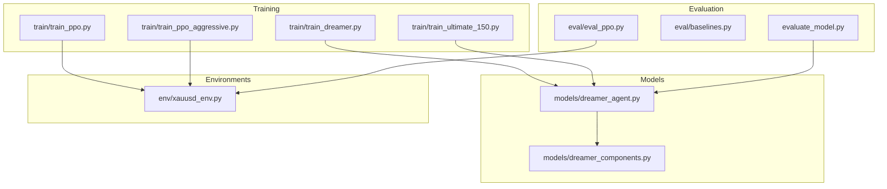
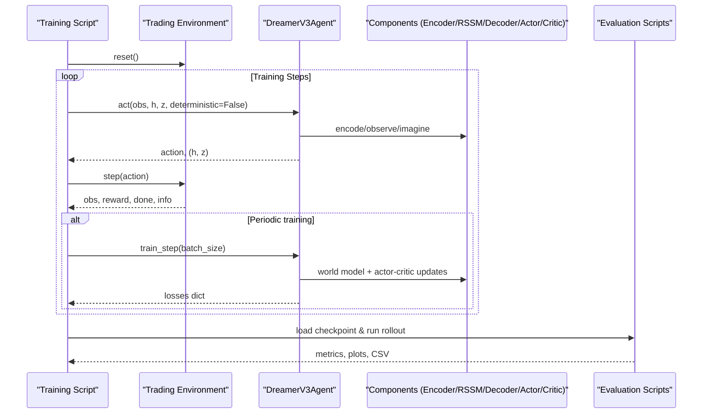
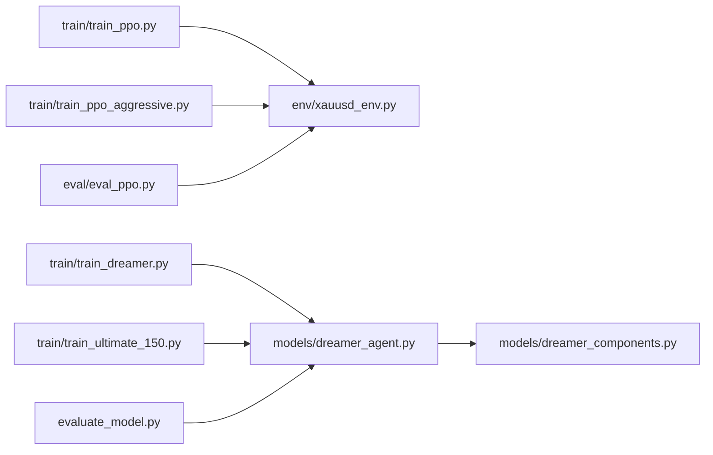

# Training Monitoring and Debugging

<cite>
**Referenced Files in This Document**
- [train/train_ppo.py](file://train/train_ppo.py)
- [train/train_dreamer.py](file://train/train_dreamer.py)
- [train/train_ultimate_150.py](file://train/train_ultimate_150.py)
- [train/train_ppo_aggressive.py](file://train/train_ppo_aggressive.py)
- [models/dreamer_agent.py](file://models/dreamer_agent.py)
- [models/dreamer_components.py](file://models/dreamer_components.py)
- [env/xauusd_env.py](file://env/xauusd_env.py)
- [eval/eval_ppo.py](file://eval/eval_ppo.py)
- [eval/baselines.py](file://eval/baselines.py)
- [evaluate_model.py](file://evaluate_model.py)
</cite>

## Table of Contents
1. Introduction
2. Project Structure
3. Core Components
4. Architecture Overview
5. Detailed Component Analysis
6. Dependency Analysis
7. Performance Considerations
8. Troubleshooting Guide
9. Conclusion
10. Appendices

## Introduction
This guide provides a comprehensive approach to monitoring training progress, visualizing performance, and debugging common issues across the algorithms implemented in this repository (PPO via Stable Baselines3 and DreamerV3). It covers logging frameworks, metric collection, visualization methods, diagnostic techniques for vanishing gradients, reward hacking, and convergence problems, plus step-by-step debugging workflows, profiling strategies, memory management, GPU utilization monitoring, and distributed training considerations.

## Project Structure
The codebase is organized by responsibility:
- Training scripts under train/ orchestrate environment setup, agent initialization, and training loops with periodic checkpointing and basic console logs.
- Models under models/ implement the DreamerV3 agent and its components (encoder, RSSM, decoder, reward predictor, actor, critic).
- Environments under env/ define trading environments that expose observations, rewards, and info fields used for metrics.
- Evaluation under eval/ and evaluate_model.py provide post-training analysis, baseline comparisons, and plotting utilities.

**Diagram sources**
- [train/train_ppo.py:25-67](file://train/train_ppo.py#L25-L67)
- [train/train_dreamer.py:128-208](file://train/train_dreamer.py#L128-L208)
- [train/train_ultimate_150.py:154-235](file://train/train_ultimate_150.py#L154-L235)
- [train/train_ppo_aggressive.py:25-84](file://train/train_ppo_aggressive.py#L25-L84)
- [models/dreamer_agent.py:84-147](file://models/dreamer_agent.py#L84-L147)
- [models/dreamer_components.py:71-205](file://models/dreamer_components.py#L71-L205)
- [env/xauusd_env.py:7-118](file://env/xauusd_env.py#L7-L118)
- [eval/eval_ppo.py:16-94](file://eval/eval_ppo.py#L16-L94)
- [eval/baselines.py:7-54](file://eval/baselines.py#L7-L54)
- [evaluate_model.py:87-161](file://evaluate_model.py#L87-L161)

**Section sources**
- [train/train_ppo.py:25-67](file://train/train_ppo.py#L25-L67)
- [train/train_dreamer.py:128-208](file://train/train_dreamer.py#L128-L208)
- [train/train_ultimate_150.py:154-235](file://train/train_ultimate_150.py#L154-L235)
- [train/train_ppo_aggressive.py:25-84](file://train/train_ppo_aggressive.py#L25-L84)
- [models/dreamer_agent.py:84-147](file://models/dreamer_agent.py#L84-L147)
- [models/dreamer_components.py:71-205](file://models/dreamer_components.py#L71-L205)
- [env/xauusd_env.py:7-118](file://env/xauusd_env.py#L7-L118)
- [eval/eval_ppo.py:16-94](file://eval/eval_ppo.py#L16-L94)
- [eval/baselines.py:7-54](file://eval/baselines.py#L7-L54)
- [evaluate_model.py:87-161](file://evaluate_model.py#L87-L161)

## Core Components
- PPO training uses Stable Baselines3 with parallel vectorized environments and periodic checkpoint saving. Logging is primarily via SB3’s built-in verbose output and print statements.
- DreamerV3 training includes explicit phases: replay buffer prefill, world model learning, actor-critic updates on imagined trajectories, and periodic checkpointing. It prints loss breakdowns at intervals.
- Evaluation scripts compute equity curves, positions, and compare against baselines (buy-and-hold, moving average crossover), producing plots and CSV outputs.

Key responsibilities:
- Data loading and feature construction are handled by external modules; training scripts slice train/test sets by date.
- Environments return info dictionaries containing equity and position, enabling metric extraction during rollouts.
- DreamerV3 agent exposes losses and supports saving/loading checkpoints.

**Section sources**
- [train/train_ppo.py:25-67](file://train/train_ppo.py#L25-L67)
- [train/train_dreamer.py:210-292](file://train/train_dreamer.py#L210-L292)
- [train/train_ultimate_150.py:236-317](file://train/train_ultimate_150.py#L236-L317)
- [env/xauusd_env.py:75-118](file://env/xauusd_env.py#L75-L118)
- [eval/eval_ppo.py:24-94](file://eval/eval_ppo.py#L24-L94)
- [evaluate_model.py:87-161](file://evaluate_model.py#L87-L161)

## Architecture Overview
The system integrates RL training with custom environments and model architectures. PPO leverages SB3’s infrastructure, while DreamerV3 implements a world model (RSSM) and actor-critic trained on imagined trajectories.

**Diagram sources**
- [train/train_dreamer.py:210-292](file://train/train_dreamer.py#L210-L292)
- [models/dreamer_agent.py:148-304](file://models/dreamer_agent.py#L148-L304)
- [models/dreamer_components.py:71-205](file://models/dreamer_components.py#L71-L205)
- [env/xauusd_env.py:75-118](file://env/xauusd_env.py#L75-L118)
- [evaluate_model.py:87-161](file://evaluate_model.py#L87-L161)

## Detailed Component Analysis

### PPO Training and Monitoring
- Parallel environments: SubprocVecEnv runs multiple instances to accelerate data collection.
- Checkpointing: Saves models periodically and keeps a “latest” artifact for quick evaluation.
- Metrics: During evaluation, equity curves and position histories are recorded and plotted.

Monitoring tips:
- Use SB3’s verbose logging to track learning progress.
- Track equity and trade counts from environment info during rollouts.
- Compare against baselines (buy-and-hold, MA crossover) to contextualize performance.

**Section sources**
- [train/train_ppo.py:25-67](file://train/train_ppo.py#L25-L67)
- [eval/eval_ppo.py:24-94](file://eval/eval_ppo.py#L24-L94)
- [eval/baselines.py:7-54](file://eval/baselines.py#L7-L54)

### DreamerV3 Training Loop and Loss Tracking
- Replay buffer prefill ensures sufficient experience before training.
- World model training minimizes reconstruction, reward prediction, and KL divergence losses.
- Actor-critic training uses imagined trajectories with lambda-returns and policy gradient updates.
- Losses are printed at intervals to monitor stability and convergence.

Monitoring tips:
- Watch world model loss trends; rising reconstruction or reward loss may indicate instability.
- Monitor KL loss to ensure posterior collapse is avoided.
- Track value and policy losses to detect overfitting or under-exploration.

**Section sources**
- [train/train_dreamer.py:210-292](file://train/train_dreamer.py#L210-L292)
- [models/dreamer_agent.py:190-304](file://models/dreamer_agent.py#L190-L304)
- [models/dreamer_components.py:188-205](file://models/dreamer_components.py#L188-L205)

### DreamerV3 Components and Stability Mechanisms
- Encoder applies symlog transformations to stabilize large-valued inputs.
- RSSM learns latent dynamics with prior/posterior distributions and KL regularization.
- Decoder reconstructs observations using symexp to maintain scale consistency.
- Reward predictor and actor/critic operate in latent space for efficient planning.

Stability mechanisms:
- Gradient clipping prevents exploding gradients during updates.
- KL balancing and free nats mitigate posterior collapse.
- Symmetric log/exp transforms improve numerical stability.

**Section sources**
- [models/dreamer_components.py:22-30](file://models/dreamer_components.py#L22-L30)
- [models/dreamer_components.py:71-205](file://models/dreamer_components.py#L71-L205)
- [models/dreamer_agent.py:255-263](file://models/dreamer_agent.py#L255-L263)

### Environment Metrics and Info Fields
- The environment returns info with equity, position, and cost-related fields, enabling direct metric extraction during rollouts.
- Position changes incur costs and penalties, shaping reward signals to discourage excessive trading.

Monitoring tips:
- Log equity curves and position sequences to detect oscillation or stagnation.
- Inspect trade costs and turnover penalties to identify reward hacking patterns.

**Section sources**
- [env/xauusd_env.py:75-118](file://env/xauusd_env.py#L75-L118)

### Evaluation and Visualization
- Evaluation scripts compute equity curves, drawdown, Sharpe ratio, win rate, and position statistics.
- Plots visualize equity, drawdown, and positions over time; results can be saved as images and CSVs.

Monitoring tips:
- Use baseline comparisons to validate RL performance.
- Save detailed results for offline analysis and reporting.

**Section sources**
- [evaluate_model.py:87-161](file://evaluate_model.py#L87-L161)
- [eval/eval_ppo.py:24-94](file://eval/eval_ppo.py#L24-L94)
- [eval/baselines.py:7-54](file://eval/baselines.py#L7-L54)

## Dependency Analysis
- Training scripts depend on environments and agents; evaluation depends on trained models and environments.
- DreamerV3 agent composes multiple components; training loops coordinate interactions between agent and environment.

**Diagram sources**
- [train/train_ppo.py:25-67](file://train/train_ppo.py#L25-L67)
- [train/train_dreamer.py:128-208](file://train/train_dreamer.py#L128-L208)
- [train/train_ultimate_150.py:154-235](file://train/train_ultimate_150.py#L154-L235)
- [train/train_ppo_aggressive.py:25-84](file://train/train_ppo_aggressive.py#L25-L84)
- [models/dreamer_agent.py:84-147](file://models/dreamer_agent.py#L84-L147)
- [models/dreamer_components.py:71-205](file://models/dreamer_components.py#L71-L205)
- [env/xauusd_env.py:7-118](file://env/xauusd_env.py#L7-L118)
- [eval/eval_ppo.py:16-94](file://eval/eval_ppo.py#L16-L94)
- [evaluate_model.py:87-161](file://evaluate_model.py#L87-L161)

**Section sources**
- [train/train_ppo.py:25-67](file://train/train_ppo.py#L25-L67)
- [train/train_dreamer.py:128-208](file://train/train_dreamer.py#L128-L208)
- [train/train_ultimate_150.py:154-235](file://train/train_ultimate_150.py#L154-L235)
- [train/train_ppo_aggressive.py:25-84](file://train/train_ppo_aggressive.py#L25-L84)
- [models/dreamer_agent.py:84-147](file://models/dreamer_agent.py#L84-L147)
- [models/dreamer_components.py:71-205](file://models/dreamer_components.py#L71-L205)
- [env/xauusd_env.py:7-118](file://env/xauusd_env.py#L7-L118)
- [eval/eval_ppo.py:16-94](file://eval/eval_ppo.py#L16-L94)
- [evaluate_model.py:87-161](file://evaluate_model.py#L87-L161)

## Performance Considerations
- Batch sizes and horizon: Larger batch sizes and appropriate imagination horizons improve sample efficiency but increase memory usage.
- Device selection: Auto-detects CUDA/MPS/CPU; prefer GPU acceleration for faster training.
- Parallel environments: SubprocVecEnv scales data collection; tune N_ENVS based on hardware.
- Gradient clipping: Prevents instability during updates; adjust max_norm if needed.
- Memory management: Ensure replay buffer capacity fits available RAM; consider reducing sequence length if memory constrained.

[No sources needed since this section provides general guidance]

## Troubleshooting Guide

### Vanishing Gradients
Symptoms:
- Stagnant or extremely small loss values; no improvement in policy/value networks.
- Near-zero gradients observed during backpropagation.

Diagnostics:
- Inspect encoder and RSSM parameter norms and gradients; verify activation functions and normalization layers.
- Check KL loss behavior; overly aggressive KL regularization can suppress learning.

Remedies:
- Reduce KL balance or free_nats to allow more expressive posteriors.
- Increase learning rates cautiously; ensure gradient clipping thresholds are not too low.
- Validate input scaling; symlog transformations should prevent extreme values.

**Section sources**
- [models/dreamer_components.py:188-205](file://models/dreamer_components.py#L188-L205)
- [models/dreamer_agent.py:255-263](file://models/dreamer_agent.py#L255-L263)

### Reward Hacking
Symptoms:
- Excessive trading or trivial actions that exploit reward structure without genuine performance gains.
- High turnover penalties or flat penalties not curbing undesirable behavior.

Diagnostics:
- Analyze position sequences and trade costs from environment info.
- Review reward composition; ensure costs and penalties align with desired behavior.

Remedies:
- Adjust cost_per_trade, turnover_coef, flat_penalty, hold_bonus to penalize undesired actions.
- Introduce additional constraints or shaping terms to discourage flip-flopping.

**Section sources**
- [env/xauusd_env.py:75-118](file://env/xauusd_env.py#L75-L118)

### Convergence Problems
Symptoms:
- Oscillating losses; inconsistent improvements across episodes.
- Poor out-of-sample performance despite good in-sample metrics.

Diagnostics:
- Monitor world model reconstruction and reward prediction losses; ensure they decrease steadily.
- Evaluate policy and value losses; check for divergence or saturation.

Remedies:
- Tune learning rates for world model, actor, and critic separately.
- Increase replay buffer size or adjust TRAIN_EVERY frequency.
- Validate data splits and feature quality; ensure no look-ahead leakage.

**Section sources**
- [train/train_dreamer.py:210-292](file://train/train_dreamer.py#L210-L292)
- [models/dreamer_agent.py:190-304](file://models/dreamer_agent.py#L190-L304)

### Step-by-Step Debugging Workflow
1. Start with small-scale runs:
   - Reduce steps, batch size, and window to quickly validate pipeline.
2. Enable verbose logging:
   - Use SB3 verbose for PPO; add periodic prints for DreamerV3 losses.
3. Collect metrics:
   - Extract equity, positions, and costs from environment info during rollouts.
4. Visualize:
   - Plot equity curves, drawdown, and positions; compare against baselines.
5. Iterate hyperparameters:
   - Adjust learning rates, batch sizes, KL settings, and reward shaping.
6. Profile:
   - Use PyTorch profiler or similar tools to identify bottlenecks.

**Section sources**
- [train/train_ppo.py:25-67](file://train/train_ppo.py#L25-L67)
- [train/train_dreamer.py:210-292](file://train/train_dreamer.py#L210-L292)
- [eval/eval_ppo.py:24-94](file://eval/eval_ppo.py#L24-L94)
- [evaluate_model.py:87-161](file://evaluate_model.py#L87-L161)

### Profiling Techniques
- PyTorch Profiler:
  - Wrap training loops to capture CPU/GPU kernels and memory usage.
- Memory snapshots:
  - Use torch.cuda.memory_summary() to inspect GPU memory allocation.
- Replay buffer inspection:
  - Verify sequence lengths and batch sampling to avoid memory spikes.

[No sources needed since this section provides general guidance]

### Memory Management
- Replay buffer capacity:
  - Set capacity to fit dataset size; reduce seq_len if necessary.
- Batch sizing:
  - Balance between throughput and memory; start small and scale up.
- Device placement:
  - Ensure tensors and models are on the same device; avoid unnecessary transfers.

[No sources needed since this section provides general guidance]

### GPU Utilization Monitoring
- CUDA availability:
  - Scripts auto-detect CUDA/MPS/CPU; confirm device selection.
- Utilization tools:
  - Use nvidia-smi or equivalent to monitor GPU usage during training.
- Vectorized environments:
  - Tune N_ENVS to maximize GPU throughput without overloading memory.

**Section sources**
- [train/train_dreamer.py:140-159](file://train/train_dreamer.py#L140-L159)
- [train/train_ultimate_150.py:205-216](file://train/train_ultimate_150.py#L205-L216)

### Distributed Training Considerations
- Current implementation:
  - Uses multiprocessing for parallel environments; not fully distributed across nodes.
- Scaling options:
  - Consider multi-GPU setups with data parallelism or distributed RL libraries.
- Synchronization:
  - Ensure consistent state sharing and checkpointing across processes.

[No sources needed since this section provides general guidance]

## Conclusion
This repository provides robust training and evaluation pipelines for PPO and DreamerV3 in a trading context. By leveraging environment info for metrics, structured logging, and visualization tools, you can effectively monitor training progress and diagnose common issues such as vanishing gradients, reward hacking, and convergence problems. Adopt the recommended profiling and memory management practices to optimize performance and scale training efficiently.

[No sources needed since this section summarizes without analyzing specific files]

## Appendices

### Key Logging and Visualization Locations
- PPO training logs via SB3 verbose and print statements.
- DreamerV3 loss breakdowns printed at intervals during training.
- Evaluation scripts produce plots and CSV outputs for detailed analysis.

**Section sources**
- [train/train_ppo.py:25-67](file://train/train_ppo.py#L25-L67)
- [train/train_dreamer.py:210-292](file://train/train_dreamer.py#L210-L292)
- [eval/eval_ppo.py:24-94](file://eval/eval_ppo.py#L24-L94)
- [evaluate_model.py:87-161](file://evaluate_model.py#L87-L161)