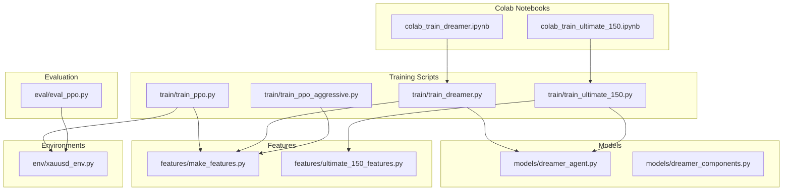
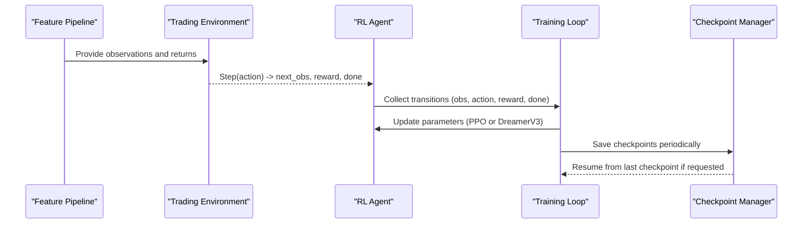
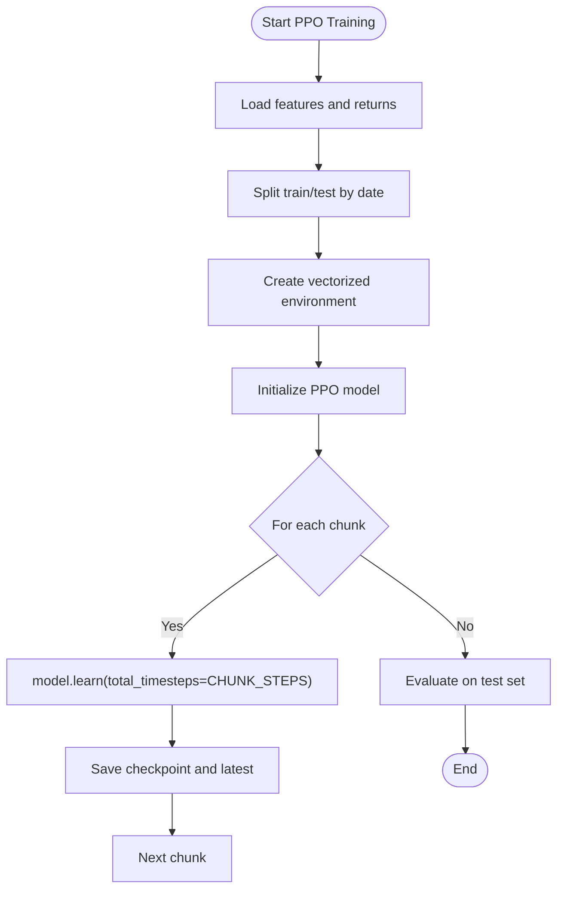
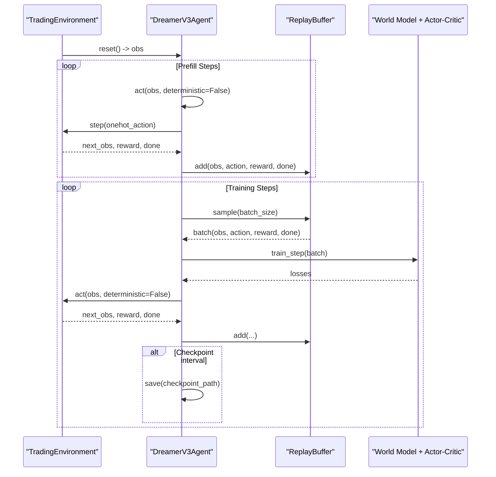
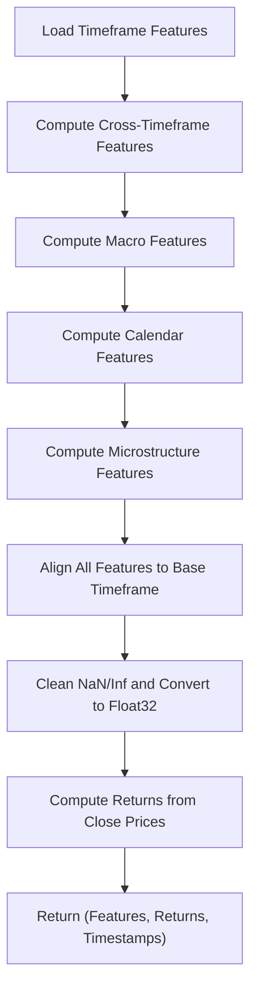
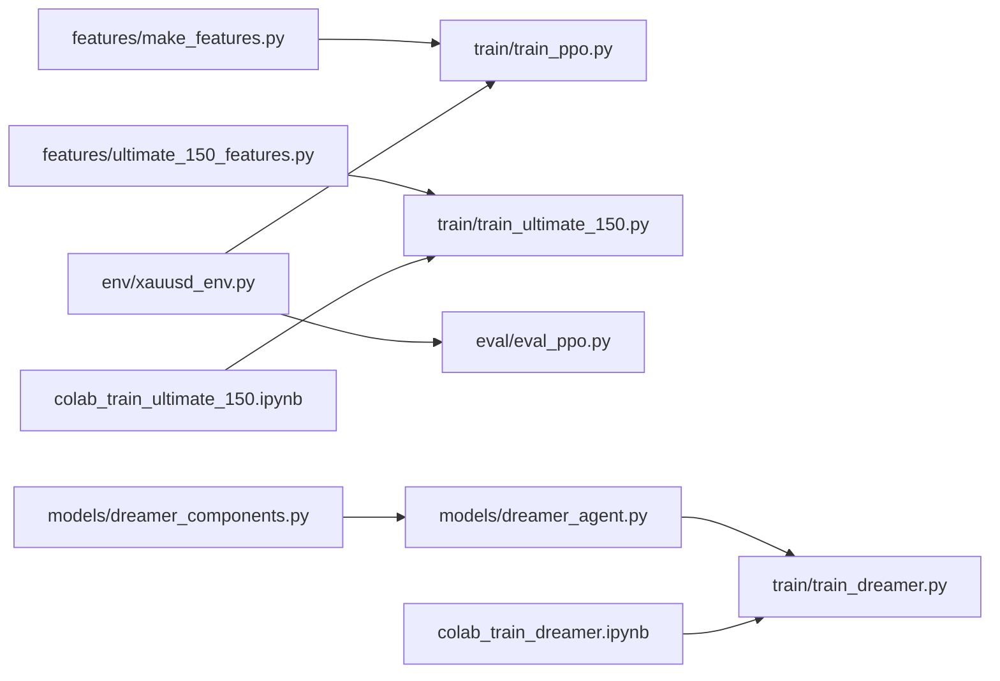

# Training and Experimentation Tutorials

<cite>
**Referenced Files in This Document**
- [train/train_ppo.py](file://train/train_ppo.py)
- [train/train_dreamer.py](file://train/train_dreamer.py)
- [train/train_ultimate_150.py](file://train/train_ultimate_150.py)
- [train/train_ppo_aggressive.py](file://train/train_ppo_aggressive.py)
- [models/dreamer_agent.py](file://models/dreamer_agent.py)
- [models/dreamer_components.py](file://models/dreamer_components.py)
- [env/xauusd_env.py](file://env/xauusd_env.py)
- [features/ultimate_150_features.py](file://features/ultimate_150_features.py)
- [features/make_features.py](file://features/make_features.py)
- [eval/eval_ppo.py](file://eval/eval_ppo.py)
- [colab_train_dreamer.ipynb](file://colab_train_dreamer.ipynb)
- [colab_train_ultimate_150.ipynb](file://colab_train_ultimate_150.ipynb)
- [README.md](file://README.md)
</cite>

## Table of Contents
1. Introduction
2. Project Structure
3. Core Components
4. Architecture Overview
5. Detailed Component Analysis
6. Dependency Analysis
7. Performance Considerations
8. Troubleshooting Guide
9. Conclusion
10. Appendices

## Introduction
This document provides step-by-step training and experimentation tutorials for:
- PPO agents (standard and aggressive variants)
- Dreamer V3 world models
- Ultimate 150+ feature sets

It includes Google Colab notebook workflows, hyperparameter tuning guidance, performance optimization techniques, checkpoint management and resume capabilities, monitoring strategies, and advice on selecting algorithms based on market conditions and resource constraints.

## Project Structure
The repository organizes training scripts under train/, model implementations under models/, environments under env/, features under features/, evaluation under eval/, and Colab notebooks at the root. The README outlines the project’s goals, algorithm choices, and performance targets.

**Diagram sources**
- [train/train_ppo.py:1-93](file://train/train_ppo.py#L1-L93)
- [train/train_dreamer.py:1-331](file://train/train_dreamer.py#L1-L331)
- [train/train_ultimate_150.py:1-331](file://train/train_ultimate_150.py#L1-L331)
- [train/train_ppo_aggressive.py:1-124](file://train/train_ppo_aggressive.py#L1-L124)
- [models/dreamer_agent.py:1-460](file://models/dreamer_agent.py#L1-L460)
- [models/dreamer_components.py:1-200](file://models/dreamer_components.py#L1-L200)
- [env/xauusd_env.py:1-118](file://env/xauusd_env.py#L1-L118)
- [features/make_features.py:1-83](file://features/make_features.py#L1-L83)
- [features/ultimate_150_features.py:1-294](file://features/ultimate_150_features.py#L1-L294)
- [eval/eval_ppo.py:1-94](file://eval/eval_ppo.py#L1-L94)
- [colab_train_dreamer.ipynb:1-360](file://colab_train_dreamer.ipynb#L1-L360)
- [colab_train_ultimate_150.ipynb:1-348](file://colab_train_ultimate_150.ipynb#L1-L348)

**Section sources**
- [README.md:1-200](file://README.md#L1-L200)

## Core Components
- PPO Training: Uses Stable-Baselines3 PPO with a custom XAUUSD environment and feature pipeline. Supports chunked training and periodic checkpoints.
- Dreamer V3 Training: Implements a world model (RSSM), encoder/decoder, reward predictor, actor-critic, and replay buffer. Includes prefill phase and scheduled training steps with logging and checkpointing.
- Ultimate 150+ Features: Aggregates multi-timeframe indicators, cross-timeframe signals, macro correlations, economic calendar events, and microstructure features into a unified observation space.
- Evaluation: Loads trained PPO models and compares against baselines (buy-and-hold, moving average crossover) on out-of-sample data.

Key configuration highlights:
- PPO: n_steps, batch_size, gamma, learning_rate; parallel environments via SubprocVecEnv; save prefixes and latest checkpoints.
- Dreamer V3: batch size, prefill steps, train steps, training frequency, device selection (auto/cuda/mps/cpu), checkpoint intervals.
- Ultimate 150+: base timeframe selection, resume support, detailed logging, and structured saving of checkpoints.

**Section sources**
- [train/train_ppo.py:11-67](file://train/train_ppo.py#L11-L67)
- [train/train_dreamer.py:21-34](file://train/train_dreamer.py#L21-L34)
- [train/train_ultimate_150.py:33-47](file://train/train_ultimate_150.py#L33-L47)
- [features/ultimate_150_features.py:27-226](file://features/ultimate_150_features.py#L27-L226)
- [eval/eval_ppo.py:10-26](file://eval/eval_ppo.py#L10-L26)

## Architecture Overview
The system integrates feature engineering, environment simulation, and RL algorithms to learn trading policies. PPO uses a straightforward policy gradient approach with vectorized environments. Dreamer V3 learns a latent world model to imagine trajectories and optimize an actor-critic policy within that imagined world.

**Diagram sources**
- [train/train_ppo.py:25-67](file://train/train_ppo.py#L25-L67)
- [train/train_dreamer.py:128-327](file://train/train_dreamer.py#L128-L327)
- [train/train_ultimate_150.py:154-327](file://train/train_ultimate_150.py#L154-L327)
- [models/dreamer_agent.py:148-304](file://models/dreamer_agent.py#L148-L304)

## Detailed Component Analysis

### PPO Training Workflow
- Feature preparation: Load OHLC data, compute technical and optional macro features, normalize, and return features and returns.
- Environment: Discrete long-only actions with cost-aware rewards, turnover penalties, flat penalty, and hold bonus to encourage stability.
- Training loop: Chunked learning with persistent timesteps across chunks; periodic saves; final quick evaluation on test set.

**Diagram sources**
- [train/train_ppo.py:25-67](file://train/train_ppo.py#L25-L67)
- [features/make_features.py:18-83](file://features/make_features.py#L18-L83)
- [env/xauusd_env.py:21-118](file://env/xauusd_env.py#L21-L118)

**Section sources**
- [train/train_ppo.py:25-93](file://train/train_ppo.py#L25-L93)
- [features/make_features.py:18-83](file://features/make_features.py#L18-L83)
- [env/xauusd_env.py:21-118](file://env/xauusd_env.py#L21-L118)

### Dreamer V3 Training Workflow
- Environment wrapper: Custom TradingEnvironment returning flat numpy arrays for Dreamer compatibility.
- Agent: DreamerV3Agent encapsulates RSSM-based world model, encoder/decoder, reward predictor, actor, critic, and replay buffer.
- Prefill phase: Random exploration fills replay buffer before training.
- Training loop: Periodic training steps with loss reporting; checkpoints saved every N steps; final model saved; test evaluation.

**Diagram sources**
- [train/train_dreamer.py:36-126](file://train/train_dreamer.py#L36-L126)
- [train/train_dreamer.py:128-327](file://train/train_dreamer.py#L128-L327)
- [models/dreamer_agent.py:24-82](file://models/dreamer_agent.py#L24-L82)
- [models/dreamer_agent.py:148-304](file://models/dreamer_agent.py#L148-L304)

**Section sources**
- [train/train_dreamer.py:36-327](file://train/train_dreamer.py#L36-L327)
- [models/dreamer_agent.py:24-304](file://models/dreamer_agent.py#L24-L304)

### Ultimate 150+ Features Pipeline
- Multi-timeframe features: Computes indicators across M5, M15, H1, H4, D1, W1.
- Cross-timeframe features: Captures relationships between timeframes.
- Macro features: Integrates DXY, SPX, US10Y, and correlations.
- Calendar features: Encodes economic events around timestamps.
- Microstructure features: Adds order flow and volatility regime signals.
- Alignment and cleaning: Reindex to base timeframe, fill NaNs, replace infinities, convert to float32.
- Returns computation: Base timeframe close price percentage changes.

**Diagram sources**
- [features/ultimate_150_features.py:47-226](file://features/ultimate_150_features.py#L47-L226)

**Section sources**
- [features/ultimate_150_features.py:27-226](file://features/ultimate_150_features.py#L27-L226)

### PPO Aggressive Variant
- Uses H1 macro-aware data and an aggressive environment variant with different risk controls.
- Larger batch sizes and longer n_steps for more robust learning.
- Saves checkpoints and performs out-of-sample evaluation.

**Section sources**
- [train/train_ppo_aggressive.py:11-124](file://train/train_ppo_aggressive.py#L11-L124)

### Evaluation of PPO Models
- Loads trained PPO model and runs rollout on test period.
- Compares equity curves against buy-and-hold and moving average crossover baselines.
- Prints metrics and plots equity curves and positions.

**Section sources**
- [eval/eval_ppo.py:10-94](file://eval/eval_ppo.py#L10-L94)

## Dependency Analysis
- Training scripts depend on feature modules and environments.
- Dreamer V3 depends on internal components (encoder, RSSM, decoder, reward predictor, actor, critic).
- Colab notebooks orchestrate training by invoking training scripts with configurable parameters and resume paths.

**Diagram sources**
- [features/make_features.py:18-83](file://features/make_features.py#L18-L83)
- [features/ultimate_150_features.py:27-226](file://features/ultimate_150_features.py#L27-L226)
- [env/xauusd_env.py:21-118](file://env/xauusd_env.py#L21-L118)
- [models/dreamer_agent.py:148-304](file://models/dreamer_agent.py#L148-L304)
- [models/dreamer_components.py:71-200](file://models/dreamer_components.py#L71-L200)
- [train/train_ppo.py:25-67](file://train/train_ppo.py#L25-L67)
- [train/train_dreamer.py:128-327](file://train/train_dreamer.py#L128-L327)
- [train/train_ultimate_150.py:154-327](file://train/train_ultimate_150.py#L154-L327)
- [eval/eval_ppo.py:10-94](file://eval/eval_ppo.py#L10-L94)
- [colab_train_dreamer.ipynb:164-205](file://colab_train_dreamer.ipynb#L164-L205)
- [colab_train_ultimate_150.ipynb:195-241](file://colab_train_ultimate_150.ipynb#L195-L241)

**Section sources**
- [train/train_ppo.py:25-67](file://train/train_ppo.py#L25-L67)
- [train/train_dreamer.py:128-327](file://train/train_dreamer.py#L128-L327)
- [train/train_ultimate_150.py:154-327](file://train/train_ultimate_150.py#L154-L327)
- [models/dreamer_agent.py:148-304](file://models/dreamer_agent.py#L148-L304)
- [models/dreamer_components.py:71-200](file://models/dreamer_components.py#L71-L200)
- [features/make_features.py:18-83](file://features/make_features.py#L18-L83)
- [features/ultimate_150_features.py:27-226](file://features/ultimate_150_features.py#L27-L226)
- [env/xauusd_env.py:21-118](file://env/xauusd_env.py#L21-L118)
- [eval/eval_ppo.py:10-94](file://eval/eval_ppo.py#L10-L94)
- [colab_train_dreamer.ipynb:164-205](file://colab_train_dreamer.ipynb#L164-L205)
- [colab_train_ultimate_150.ipynb:195-241](file://colab_train_ultimate_150.ipynb#L195-L241)

## Performance Considerations
- Batch sizing: Increase batch size for GPU utilization; reduce if out-of-memory occurs.
- Device selection: Auto-detect CUDA/MPS/CPU; prefer GPU for faster training.
- Parallel environments: Use multiple subprocess environments for PPO to increase throughput.
- Training frequency: Adjust TRAIN_EVERY to balance environment interactions and updates.
- Horizon and KL regularization: Tune imagination horizon and free nats for stable world model learning.
- Feature dimensionality: Ultimate 150+ features increase memory and compute; consider base timeframe choice (M5 recommended for speed).

[No sources needed since this section provides general guidance]

## Troubleshooting Guide
- Session disconnections in Colab: Use auto-resume by specifying --resume with a checkpoint path; re-run training cells to continue.
- Out-of-memory errors: Reduce batch size; ensure GPU availability; verify device settings.
- Data not found: Verify data file paths and columns; ensure macro files exist when required.
- Slow training: Confirm GPU usage; consider upgrading to Pro+ for longer runtimes and better GPUs.
- Checkpoint integrity: Ensure periodic saves; list checkpoints to track progress; download frequently to avoid loss.

**Section sources**
- [colab_train_dreamer.ipynb:208-248](file://colab_train_dreamer.ipynb#L208-L248)
- [colab_train_ultimate_150.ipynb:218-241](file://colab_train_ultimate_150.ipynb#L218-L241)

## Conclusion
This tutorial covers comprehensive training workflows for PPO and Dreamer V3, including the Ultimate 150+ feature set. It provides actionable guidance for hyperparameter tuning, performance optimization, checkpoint management, and resume capabilities. Choose PPO for stable, production-ready training with simpler setups; choose Dreamer V3 for world-model-based planning and potentially higher sample efficiency. For maximum intelligence, use the Ultimate 150+ features with sufficient compute resources. Evaluate models on out-of-sample data and compare against baselines to validate performance.

[No sources needed since this section summarizes without analyzing specific files]

## Appendices

### Hyperparameter Tuning Examples
- PPO:
  - n_steps: 1024–2048 depending on environment count and hardware
  - batch_size: 256–512 for GPU
  - learning_rate: 3e-4
  - gamma: 0.99
- Dreamer V3:
  - batch_size: 16–128 (GPU)
  - prefill_steps: 5,000
  - train_steps: 100,000–1,000,000
  - train_every: 4
  - device: auto/cuda/mps/cpu
- Ultimate 150+:
  - base_timeframe: M5 for speed; H1 for richer context
  - resume: checkpoint path to continue training

**Section sources**
- [train/train_ppo.py:46-54](file://train/train_ppo.py#L46-L54)
- [train/train_dreamer.py:25-34](file://train/train_dreamer.py#L25-L34)
- [train/train_ultimate_150.py:38-47](file://train/train_ultimate_150.py#L38-L47)
- [colab_train_dreamer.ipynb:140-161](file://colab_train_dreamer.ipynb#L140-L161)
- [colab_train_ultimate_150.ipynb:165-193](file://colab_train_ultimate_150.ipynb#L165-L193)

### Algorithm Selection Guidance
- Market conditions:
  - Trending markets: PPO with longer horizons and momentum features can capture sustained moves.
  - Mean-reverting regimes: Dreamer V3’s world model may better anticipate regime shifts and plan accordingly.
- Resource constraints:
  - CPU-only: Use PPO with smaller batch sizes and fewer environments; consider shorter training runs.
  - GPU available: Leverage Dreamer V3 with larger batches and longer training; Ultimate 150+ features for maximum performance.

[No sources needed since this section provides general guidance]

### Monitoring Training Progress
- PPO:
  - Print chunk progress and saved checkpoints; evaluate on test set for quick metrics.
- Dreamer V3:
  - Log world model, value, and policy losses; print episode rewards and equity; save checkpoints periodically.
- Ultimate 150+:
  - Structured logging of feature shapes, date ranges, and best episode rewards; checkpoint naming includes step numbers.

**Section sources**
- [train/train_ppo.py:56-87](file://train/train_ppo.py#L56-L87)
- [train/train_dreamer.py:246-327](file://train/train_dreamer.py#L246-L327)
- [train/train_ultimate_150.py:258-327](file://train/train_ultimate_150.py#L258-L327)