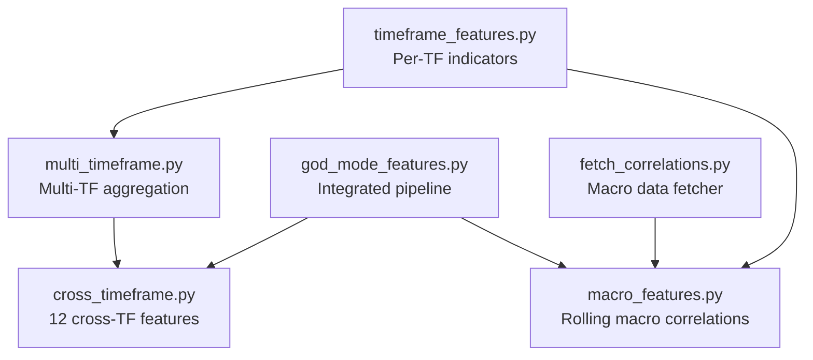
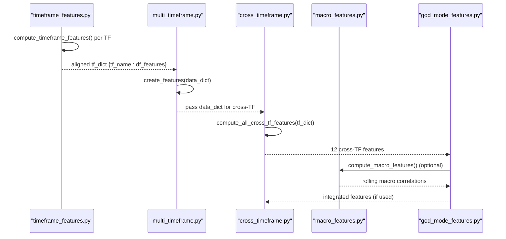
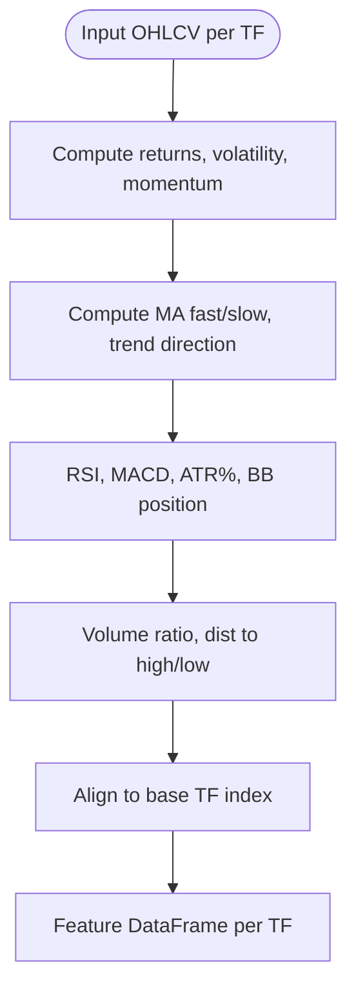
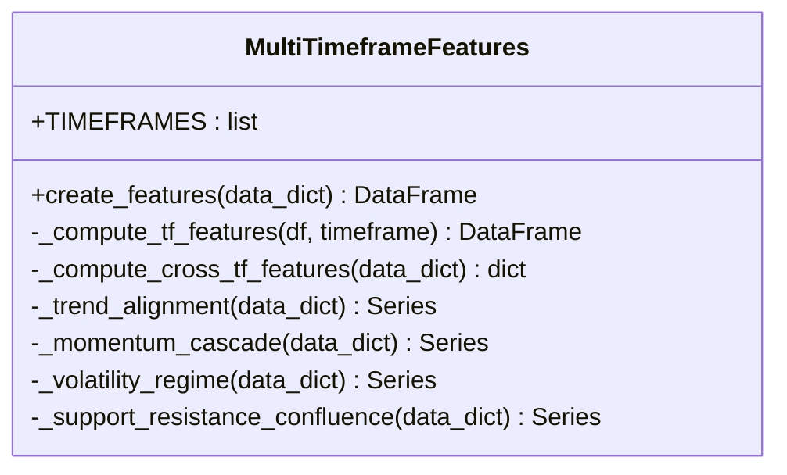
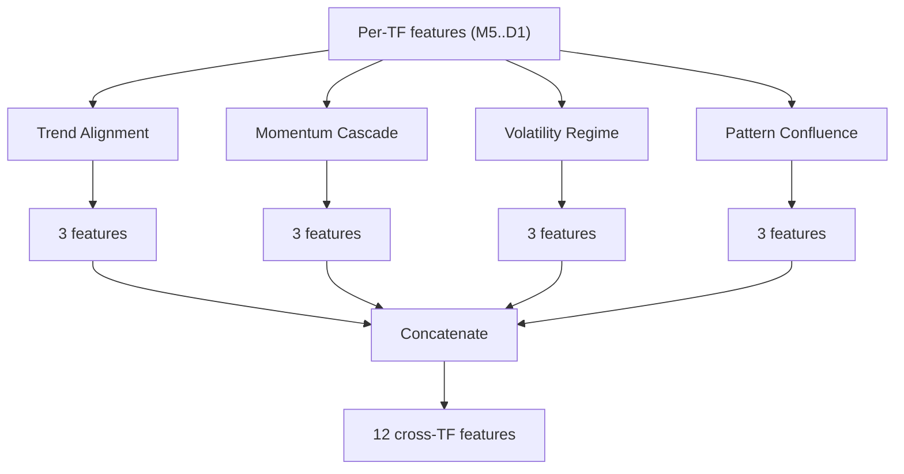
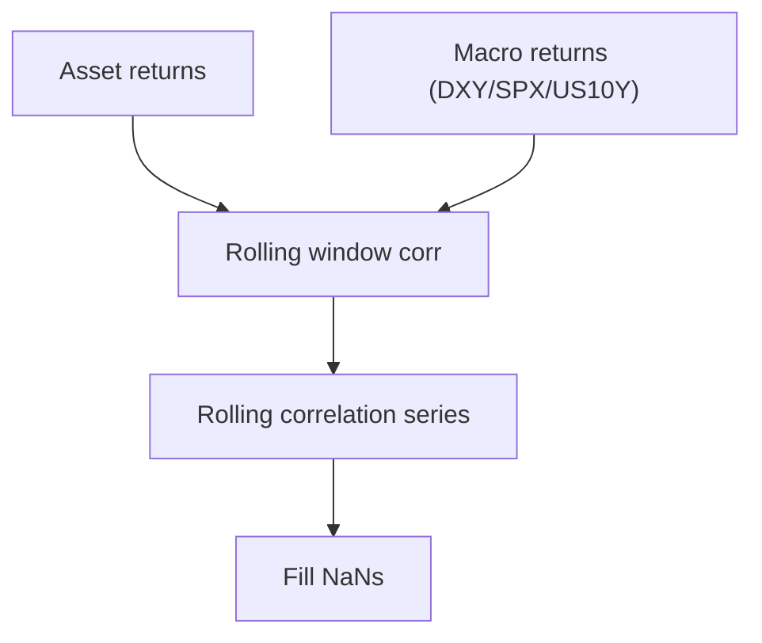
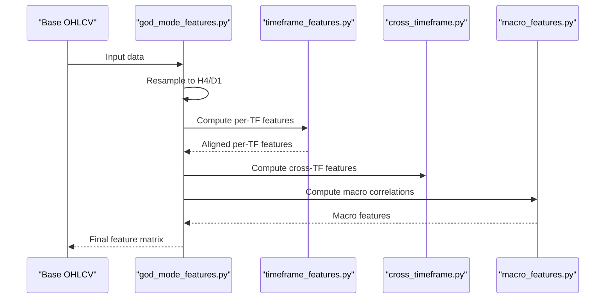
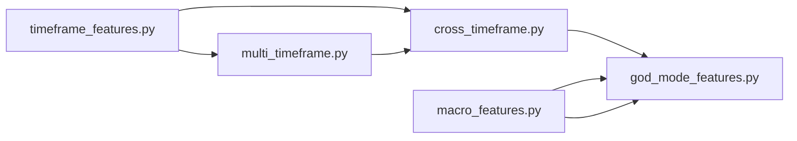

# Cross-Timeframe Correlation

<cite>
**Referenced Files in This Document**
- [cross_timeframe.py](file://features/cross_timeframe.py)
- [multi_timeframe.py](file://features/multi_timeframe.py)
- [timeframe_features.py](file://features/timeframe_features.py)
- [macro_features.py](file://features/macro_features.py)
- [god_mode_features.py](file://features/god_mode_features.py)
- [fetch_correlations.py](file://data/fetch_correlations.py)
</cite>

## Table of Contents
1. Introduction
2. Project Structure
3. Core Components
4. Architecture Overview
5. Detailed Component Analysis
6. Dependency Analysis
7. Performance Considerations
8. Troubleshooting Guide
9. Conclusion
10. Appendices

## Introduction
This document explains the cross-timeframe correlation system that generates 12 sophisticated features measuring relationships across M5, M15, H1, H4, D1 (and optionally W1). It covers how the system computes correlations, divergences, and synchronization measures to identify multi-timeframe trading opportunities where shorter-term trends align with longer-term momentum. It also documents signal generation logic, practical interpretation, common pitfalls such as spurious correlations and regime changes, and guidance for customizing thresholds and adapting to different market conditions.

## Project Structure
The cross-timeframe feature pipeline is implemented across several modules:
- Timeframe-level feature computation per timeframe (M5–D1/W1)
- Multi-timeframe aggregation and alignment
- Cross-timeframe feature synthesis (trend alignment, momentum cascade, volatility regime, pattern confluence)
- Macro correlation features (optional integration with macro series)
- Data fetching utilities for macro data

**Diagram sources**
- [timeframe_features.py:22-99](file://features/timeframe_features.py#L22-L99)
- [multi_timeframe.py:55-96](file://features/multi_timeframe.py#L55-L96)
- [cross_timeframe.py:205-249](file://features/cross_timeframe.py#L205-L249)
- [macro_features.py:114-132](file://features/macro_features.py#L114-L132)
- [god_mode_features.py:291-379](file://features/god_mode_features.py#L291-L379)
- [fetch_correlations.py:5-54](file://data/fetch_correlations.py#L5-L54)

**Section sources**
- [timeframe_features.py:22-99](file://features/timeframe_features.py#L22-L99)
- [multi_timeframe.py:55-96](file://features/multi_timeframe.py#L55-L96)
- [cross_timeframe.py:205-249](file://features/cross_timeframe.py#L205-L249)
- [macro_features.py:114-132](file://features/macro_features.py#L114-L132)
- [god_mode_features.py:291-379](file://features/god_mode_features.py#L291-L379)
- [fetch_correlations.py:5-54](file://data/fetch_correlations.py#L5-L54)

## Core Components
- Per-timeframe feature engine: Computes price action, trend, technicals, volume, and support/resistance distances for each timeframe.
- Multi-timeframe aggregator: Aligns timeframes and creates basic cross-timeframe signals (trend alignment, momentum cascade, volatility regime, S/R confluence).
- Cross-timeframe feature synthesizer: Produces 12 advanced features grouped into four categories:
  - Trend Alignment (3): overall agreement, strength cascade, divergence
  - Momentum Cascade (3): higher-to-lower momentum interactions
  - Volatility Regime (3): current vs long-term vol, spikes, compression
  - Pattern Confluence (3): support/resistance confluence, breakout alignment
- Macro correlation features: Rolling correlations between asset returns and macro series (e.g., DXY, SPX, US10Y).

**Section sources**
- [timeframe_features.py:22-99](file://features/timeframe_features.py#L22-L99)
- [multi_timeframe.py:158-186](file://features/multi_timeframe.py#L158-L186)
- [cross_timeframe.py:21-202](file://features/cross_timeframe.py#L21-L202)
- [macro_features.py:114-132](file://features/macro_features.py#L114-L132)

## Architecture Overview
The system processes raw OHLCV data per timeframe, computes standardized features, aligns them to a base timeframe (typically M5), and then derives cross-timeframe features that capture inter-temporal relationships. Optional macro features add external correlation context.

**Diagram sources**
- [timeframe_features.py:236-304](file://features/timeframe_features.py#L236-L304)
- [multi_timeframe.py:55-96](file://features/multi_timeframe.py#L55-L96)
- [cross_timeframe.py:205-249](file://features/cross_timeframe.py#L205-L249)
- [macro_features.py:363-445](file://features/macro_features.py#L363-L445)
- [god_mode_features.py:291-379](file://features/god_mode_features.py#L291-L379)

## Detailed Component Analysis

### Timeframe Features Engine
- Purpose: Generate consistent, normalized features per timeframe to enable robust cross-timeframe analysis.
- Key outputs include returns, volatility, momentum at multiple horizons, moving averages, trend direction, RSI, MACD, ATR%, Bollinger Band position, volume ratio, and distance to recent high/low.
- Alignment: Higher timeframes are forward-filled to match the base timeframe index to ensure point-in-time consistency.

**Diagram sources**
- [timeframe_features.py:22-99](file://features/timeframe_features.py#L22-L99)
- [timeframe_features.py:207-233](file://features/timeframe_features.py#L207-L233)

**Section sources**
- [timeframe_features.py:22-99](file://features/timeframe_features.py#L22-L99)
- [timeframe_features.py:207-233](file://features/timeframe_features.py#L207-L233)

### Multi-Timeframe Aggregation
- Purpose: Combine per-TF features and compute simple cross-timeframe signals like trend alignment, momentum cascade, volatility regime, and support/resistance confluence.
- Provides a baseline set of cross-TF features and an interface for more advanced synthesis.

**Diagram sources**
- [multi_timeframe.py:32-96](file://features/multi_timeframe.py#L32-L96)
- [multi_timeframe.py:158-186](file://features/multi_timeframe.py#L158-L186)

**Section sources**
- [multi_timeframe.py:32-96](file://features/multi_timeframe.py#L32-L96)
- [multi_timeframe.py:158-186](file://features/multi_timeframe.py#L158-L186)

### Cross-Timeframe Feature Synthesizer (12 Features)
- Trend Alignment (3):
  - trend_alignment_all: Average of per-TF trend directions (-1 to +1)
  - trend_strength_cascade: Multiplicative cascade from higher to lower TFs to amplify agreement
  - trend_divergence: Standard deviation of per-TF trends (higher indicates conflict)
- Momentum Cascade (3):
  - momentum_d1_h1: Product of D1 and H1 momentum
  - momentum_h4_h1: Product of H4 and H1 momentum
  - momentum_h1_m15: Product of H1 and M15 momentum
- Volatility Regime (3):
  - volatility_regime: Current H1 vol vs long-term average
  - volatility_spike: Binary flag when current vol > 2x recent average
  - volatility_compression: Binary flag when current vol < 0.5x recent average
- Pattern Confluence (3):
  - support_confluence: Fraction of TFs near support within threshold
  - resistance_confluence: Fraction of TFs near resistance within threshold
  - breakout_alignment: Whether multiple TFs show momentum in same direction

**Diagram sources**
- [cross_timeframe.py:21-66](file://features/cross_timeframe.py#L21-L66)
- [cross_timeframe.py:69-102](file://features/cross_timeframe.py#L69-L102)
- [cross_timeframe.py:105-138](file://features/cross_timeframe.py#L105-L138)
- [cross_timeframe.py:141-202](file://features/cross_timeframe.py#L141-L202)
- [cross_timeframe.py:205-249](file://features/cross_timeframe.py#L205-L249)

**Section sources**
- [cross_timeframe.py:21-66](file://features/cross_timeframe.py#L21-L66)
- [cross_timeframe.py:69-102](file://features/cross_timeframe.py#L69-L102)
- [cross_timeframe.py:105-138](file://features/cross_timeframe.py#L105-L138)
- [cross_timeframe.py:141-202](file://features/cross_timeframe.py#L141-L202)
- [cross_timeframe.py:205-249](file://features/cross_timeframe.py#L205-L249)

### Macro Correlation Features
- Purpose: Capture external drivers by computing rolling correlations between asset returns and macro series (DXY, SPX, US10Y, etc.).
- Implementation uses rolling windows on returns to estimate dynamic correlation; missing values are filled to maintain continuity.

**Diagram sources**
- [macro_features.py:114-132](file://features/macro_features.py#L114-L132)
- [macro_features.py:363-445](file://features/macro_features.py#L363-L445)
- [god_mode_features.py:194-232](file://features/god_mode_features.py#L194-L232)

**Section sources**
- [macro_features.py:114-132](file://features/macro_features.py#L114-L132)
- [macro_features.py:363-445](file://features/macro_features.py#L363-L445)
- [god_mode_features.py:194-232](file://features/god_mode_features.py#L194-L232)

### Integrated Pipeline (God Mode)
- Combines multi-timeframe features, cross-timeframe synthesis, and macro correlations into a unified feature set.
- Resamples to higher timeframes (H4, D1) and aligns to base frequency before computing cross-TF features.

**Diagram sources**
- [god_mode_features.py:291-379](file://features/god_mode_features.py#L291-L379)
- [timeframe_features.py:236-304](file://features/timeframe_features.py#L236-L304)
- [macro_features.py:363-445](file://features/macro_features.py#L363-L445)

**Section sources**
- [god_mode_features.py:291-379](file://features/god_mode_features.py#L291-L379)

## Dependency Analysis
- The cross-timeframe module depends on per-timeframe features and optional macro features.
- Multi-timeframe aggregation provides both standalone cross-TF signals and input to the advanced synthesizer.
- God mode integrates all components and can operate with or without macro data.

**Diagram sources**
- [timeframe_features.py:236-304](file://features/timeframe_features.py#L236-L304)
- [multi_timeframe.py:55-96](file://features/multi_timeframe.py#L55-L96)
- [cross_timeframe.py:205-249](file://features/cross_timeframe.py#L205-L249)
- [macro_features.py:363-445](file://features/macro_features.py#L363-L445)
- [god_mode_features.py:291-379](file://features/god_mode_features.py#L291-L379)

**Section sources**
- [timeframe_features.py:236-304](file://features/timeframe_features.py#L236-L304)
- [multi_timeframe.py:55-96](file://features/multi_timeframe.py#L55-L96)
- [cross_timeframe.py:205-249](file://features/cross_timeframe.py#L205-L249)
- [macro_features.py:363-445](file://features/macro_features.py#L363-L445)
- [god_mode_features.py:291-379](file://features/god_mode_features.py#L291-L379)

## Performance Considerations
- Rolling computations: Use appropriate windows to balance responsiveness and stability. Shorter windows react faster but are noisier; longer windows smooth noise but lag.
- Alignment overhead: Forward-filling higher timeframes to base frequency avoids look-ahead bias but requires careful indexing.
- Memory usage: Concatenating many features across timeframes increases memory; consider chunked processing if needed.
- Macro data latency: Daily macro series resampled to intraday may introduce stale information; ensure timely updates.

[No sources needed since this section provides general guidance]

## Troubleshooting Guide
Common issues and remedies:
- Spurious correlations:
  - Symptom: High correlation over short windows due to noise.
  - Remedy: Increase rolling window length; require minimum sample size; validate with out-of-sample periods.
- Regime changes affecting correlations:
  - Symptom: Correlation shifts abruptly during market stress or policy changes.
  - Remedy: Use adaptive windows or regime filters; monitor rolling correlation stability; reduce reliance on unstable features during transitions.
- Optimal window selection:
  - Guidance: Match window lengths to the intended horizon (e.g., 20–50 bars for intraday, 100+ for daily). Validate via walk-forward analysis.
- Missing or misaligned data:
  - Symptom: NaNs or misaligned indices causing incorrect signals.
  - Remedy: Ensure proper reindexing and forward-fill; verify timezone normalization for macro data.

**Section sources**
- [macro_features.py:114-132](file://features/macro_features.py#L114-L132)
- [macro_features.py:78-111](file://features/macro_features.py#L78-L111)
- [timeframe_features.py:207-233](file://features/timeframe_features.py#L207-L233)

## Conclusion
The cross-timeframe correlation system delivers a structured set of 12 features that quantify multi-timeframe relationships through trend alignment, momentum cascades, volatility regimes, and pattern confluence. These features help detect when shorter-term trends align with longer-term momentum, improving signal quality. Macro correlations provide additional context about external drivers. By tuning rolling windows, thresholds, and alignment strategies, practitioners can adapt the system to varying market conditions while mitigating risks like spurious correlations and regime shifts.

[No sources needed since this section summarizes without analyzing specific files]

## Appendices

### Concrete Examples of Cross-Timeframe Feature Computation
- Trend alignment: Average per-TF trend direction to measure agreement; multiplicative cascade amplifies strong multi-TF consensus; standard deviation captures divergence.
- Momentum cascade: Multiply adjacent TF momenta (e.g., D1×H1, H4×H1, H1×M15) to emphasize aligned momentum flow.
- Volatility regime: Compare current H1 volatility to long-term average; flag spikes and compression to anticipate breakouts or consolidations.
- Pattern confluence: Count TFs near support/resistance; confirm breakout alignment when multiple TFs show directional momentum.

**Section sources**
- [cross_timeframe.py:21-66](file://features/cross_timeframe.py#L21-L66)
- [cross_timeframe.py:69-102](file://features/cross_timeframe.py#L69-L102)
- [cross_timeframe.py:105-138](file://features/cross_timeframe.py#L105-L138)
- [cross_timeframe.py:141-202](file://features/cross_timeframe.py#L141-L202)

### Interpretation of Multi-Timeframe Signals
- Strong bullish signal: Positive trend alignment, positive momentum cascade across TFs, low volatility compression, and support confluence.
- Weak or conflicting signal: Low trend alignment, mixed momentum cascade, high divergence, or absence of breakout alignment.
- Breakout setup: Volatility compression followed by breakout alignment and rising momentum cascade.

**Section sources**
- [cross_timeframe.py:21-202](file://features/cross_timeframe.py#L21-L202)

### Practical Trading Applications
- Entry timing: Use M5/M15 momentum aligned with H1/H4/D1 trends to time entries.
- Risk management: Reduce exposure during high divergence or volatility spikes; increase sizing when multi-TF alignment is strong.
- Macro-aware positioning: Incorporate rolling macro correlations to adjust exposure based on risk-on/risk-off regimes.

**Section sources**
- [macro_features.py:363-445](file://features/macro_features.py#L363-L445)
- [god_mode_features.py:291-379](file://features/god_mode_features.py#L291-L379)

### Customization Guidance
- Thresholds: Adjust support/resistance proximity thresholds and volatility spike/compression multipliers to suit instrument characteristics.
- Windows: Tune rolling windows for momentum and volatility metrics based on desired sensitivity and noise tolerance.
- Regime adaptation: Introduce regime filters (e.g., VIX-based) to modulate feature weights or stop trading during extreme uncertainty.

**Section sources**
- [macro_features.py:114-132](file://features/macro_features.py#L114-L132)
- [cross_timeframe.py:105-138](file://features/cross_timeframe.py#L105-L138)

### Data Fetching for Macro Correlations
- Macro series (DXY, SPX, US10Y) can be fetched and saved for correlation computation.
- Ensure consistent time alignment and timezone handling before computing rolling correlations.

**Section sources**
- [fetch_correlations.py:5-54](file://data/fetch_correlations.py#L5-L54)
- [macro_features.py:78-111](file://features/macro_features.py#L78-L111)