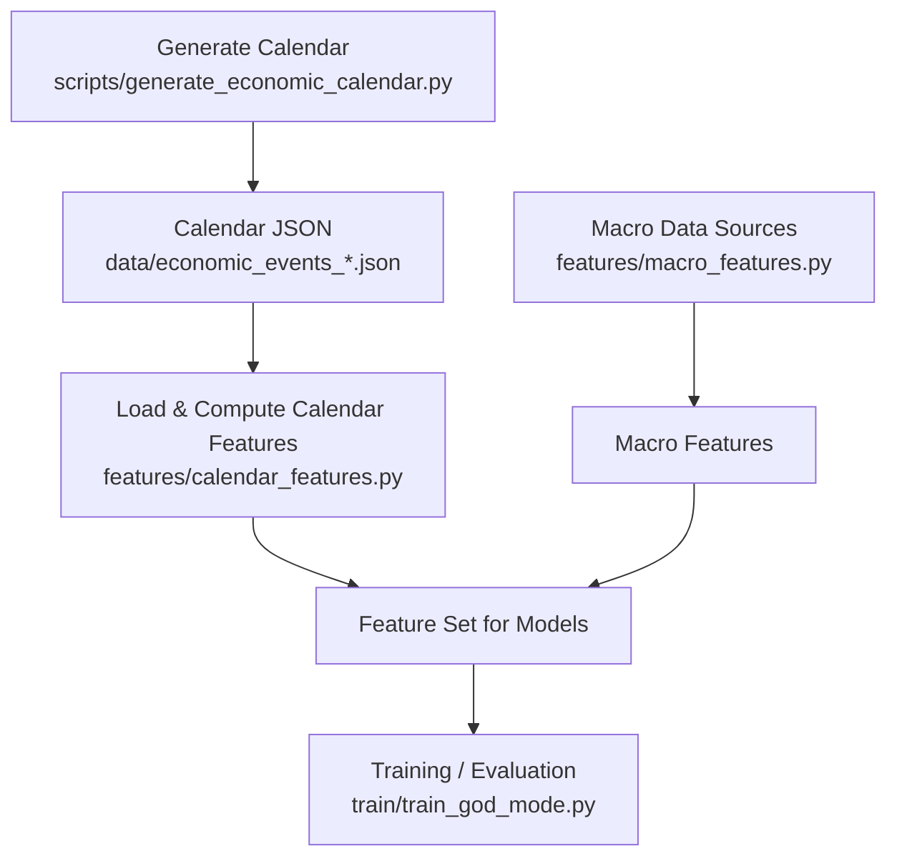
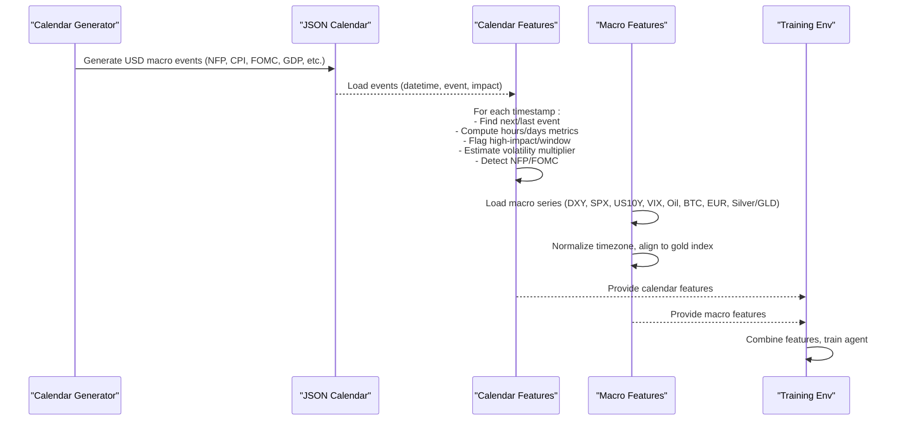
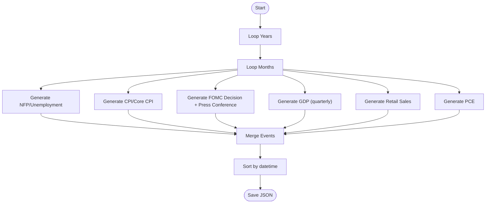
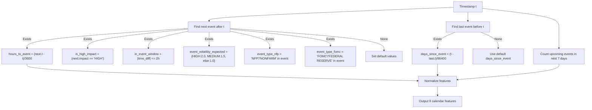
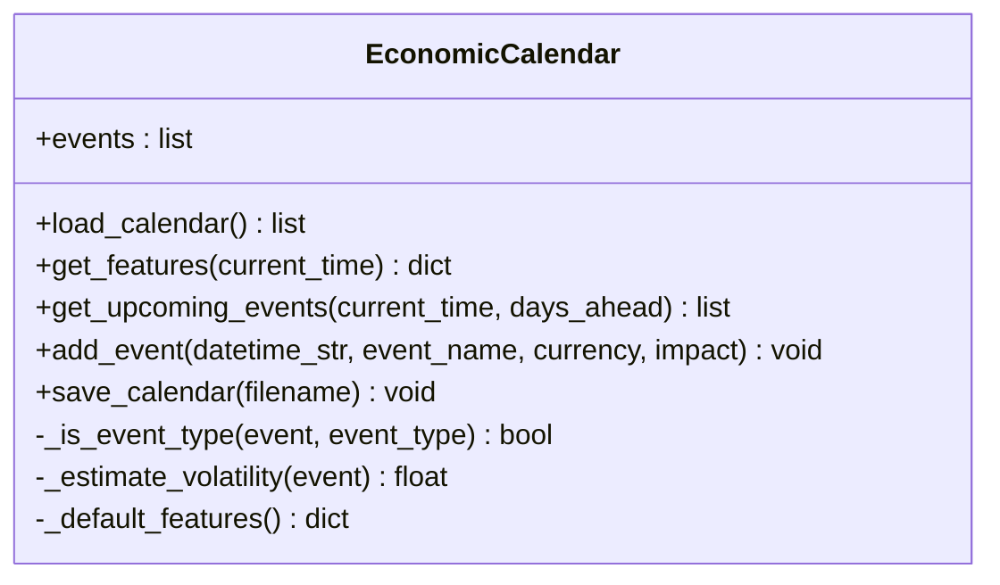
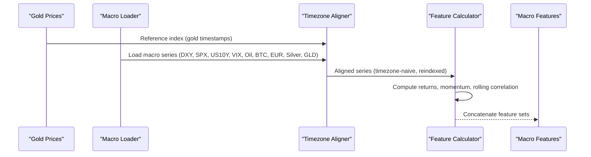
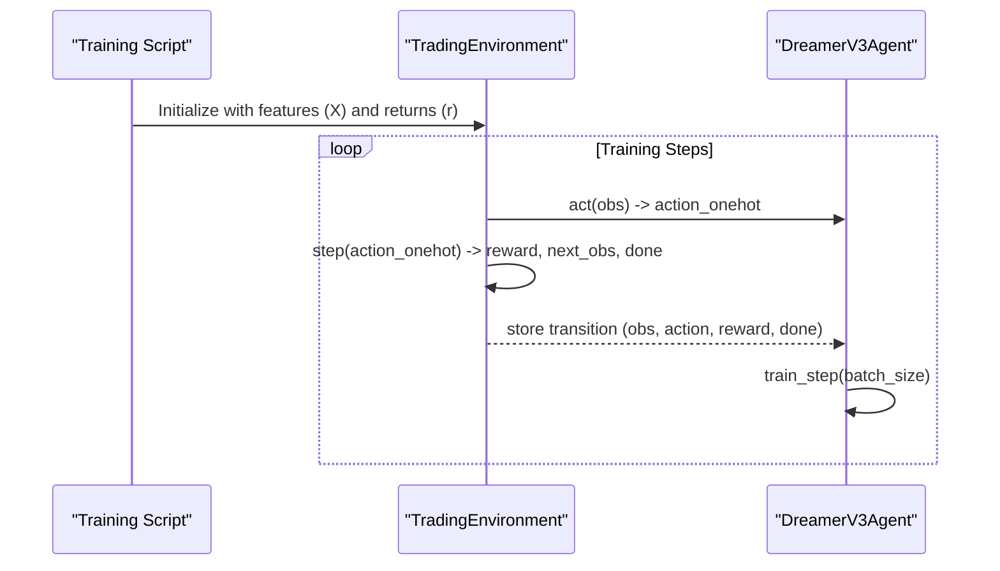
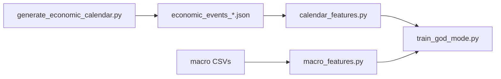

# Economic Calendar Features

<cite>
**Referenced Files in This Document**
- [calendar_features.py](file://features/calendar_features.py)
- [economic_calendar.py](file://data/economic_calendar.py)
- [generate_economic_calendar.py](file://scripts/generate_economic_calendar.py)
- [macro_features.py](file://features/macro_features.py)
- [make_features.py](file://features/make_features.py)
- [train_god_mode.py](file://train/train_god_mode.py)
- [sentiment_analysis.py](file://data/sentiment_analysis.py)
</cite>

## Table of Contents
1. [Introduction](#introduction)
2. [Project Structure](#project-structure)
3. [Core Components](#core-components)
4. [Architecture Overview](#architecture-overview)
5. [Detailed Component Analysis](#detailed-component-analysis)
6. [Dependency Analysis](#dependency-analysis)
7. [Performance Considerations](#performance-considerations)
8. [Troubleshooting Guide](#troubleshooting-guide)
9. [Conclusion](#conclusion)
10. [Appendices](#appendices)

## Introduction
This document explains the economic calendar feature system that generates event-driven features for macroeconomic announcements such as NFP, CPI, FOMC meetings, GDP releases, and other high-impact events. It covers how scheduled events are detected, how temporal proximity is computed, how expected volatility and event type signals are derived, and how these features integrate with price action analysis and model training. It also provides guidance on customizing event importance weights and adjusting sensitivity to different types of announcements.

## Project Structure
The economic calendar feature system spans data generation, feature computation, and integration into the broader modeling pipeline:

- Data generation: scripts produce a JSON calendar covering multiple years of USD macro events.
- Feature computation: modules compute 8 calendar-based features per timestamp and additional macro features from correlated assets.
- Integration: features are used by higher-level pipelines and training scripts to inform trading decisions around known event windows.

**Diagram sources**
- [generate_economic_calendar.py:231-268](file://scripts/generate_economic_calendar.py#L231-L268)
- [calendar_features.py:23-50](file://features/calendar_features.py#L23-L50)
- [macro_features.py:26-75](file://features/macro_features.py#L26-L75)
- [train_god_mode.py:182-209](file://train/train_god_mode.py#L182-L209)

**Section sources**
- [generate_economic_calendar.py:231-268](file://scripts/generate_economic_calendar.py#L231-L268)
- [calendar_features.py:23-50](file://features/calendar_features.py#L23-L50)
- [macro_features.py:26-75](file://features/macro_features.py#L26-L75)
- [train_god_mode.py:182-209](file://train/train_god_mode.py#L182-L209)

## Core Components
- Economic Calendar Generator: Produces a comprehensive JSON calendar of USD macro events across years, including NFP, CPI, FOMC, GDP, Retail Sales, PCE, and related speeches.
- Calendar Feature Engine: Computes 8 features per timestamp based on proximity to upcoming/past events, impact classification, event window flags, expected volatility multipliers, and event type indicators (NFP/FOMC).
- Macro Feature Engine: Adds cross-asset features (DXY, SPX, US10Y, VIX, Oil, BTC, EURUSD, Silver/GLD) aligned to gold timestamps.
- Training Integration: Uses combined features (including calendar-aware ones) in a reinforcement learning environment for policy learning.

Key responsibilities:
- Event detection: Identify next/last events relative to each timestamp.
- Temporal proximity: Hours until next event, days since last event, density of upcoming events.
- Impact assessment: Binary high-impact flag, event window flag, expected volatility multiplier.
- Type detection: One-hot-like flags for NFP and FOMC.
- Alignment: Timezone normalization and resampling to align macro series to intraday gold timestamps.

**Section sources**
- [calendar_features.py:111-249](file://features/calendar_features.py#L111-L249)
- [economic_calendar.py:27-79](file://data/economic_calendar.py#L27-L79)
- [macro_features.py:363-445](file://features/macro_features.py#L363-L445)
- [train_god_mode.py:182-209](file://train/train_god_mode.py#L182-L209)

## Architecture Overview
The system transforms scheduled macro events into quantitative features that inform models about market-moving dates and expected volatility regimes.

**Diagram sources**
- [generate_economic_calendar.py:231-268](file://scripts/generate_economic_calendar.py#L231-L268)
- [calendar_features.py:111-249](file://features/calendar_features.py#L111-L249)
- [macro_features.py:363-445](file://features/macro_features.py#L363-L445)
- [train_god_mode.py:182-209](file://train/train_god_mode.py#L182-L209)

## Detailed Component Analysis

### Economic Calendar Generator
- Purpose: Create a rule-based calendar of major USD macro events over a specified date range.
- Event types generated:
  - Non-Farm Payrolls (NFP) and Unemployment Rate on the first Friday of each month.
  - CPI and Core CPI mid-month.
  - FOMC Rate Decisions and press conferences at typical meeting times.
  - GDP quarterly releases.
  - Retail Sales monthly.
  - PCE monthly.
- Output: Sorted JSON list of events with datetime, event name, currency, impact, description, and typical move estimates.

**Diagram sources**
- [generate_economic_calendar.py:36-69](file://scripts/generate_economic_calendar.py#L36-L69)
- [generate_economic_calendar.py:72-104](file://scripts/generate_economic_calendar.py#L72-L104)
- [generate_economic_calendar.py:107-151](file://scripts/generate_economic_calendar.py#L107-L151)
- [generate_economic_calendar.py:154-178](file://scripts/generate_economic_calendar.py#L154-L178)
- [generate_economic_calendar.py:181-202](file://scripts/generate_economic_calendar.py#L181-L202)
- [generate_economic_calendar.py:205-228](file://scripts/generate_economic_calendar.py#L205-L228)
- [generate_economic_calendar.py:231-268](file://scripts/generate_economic_calendar.py#L231-L268)

**Section sources**
- [generate_economic_calendar.py:36-69](file://scripts/generate_economic_calendar.py#L36-L69)
- [generate_economic_calendar.py:72-104](file://scripts/generate_economic_calendar.py#L72-L104)
- [generate_economic_calendar.py:107-151](file://scripts/generate_economic_calendar.py#L107-L151)
- [generate_economic_calendar.py:154-178](file://scripts/generate_economic_calendar.py#L154-L178)
- [generate_economic_calendar.py:181-202](file://scripts/generate_economic_calendar.py#L181-L202)
- [generate_economic_calendar.py:205-228](file://scripts/generate_economic_calendar.py#L205-L228)
- [generate_economic_calendar.py:231-268](file://scripts/generate_economic_calendar.py#L231-L268)

### Calendar Feature Engine
- Inputs: DataFrame timestamps (e.g., gold OHLCV index) and loaded calendar events.
- Outputs: 8 features per timestamp:
  - hours_to_event: Normalized hours until next event (capped and normalized).
  - days_since_event: Normalized days since last event (capped and normalized).
  - event_density: Count of upcoming events in next 7 days (normalized).
  - is_high_impact: Binary flag if next event is HIGH impact.
  - in_event_window: Binary flag within ±2 hours of next event.
  - event_volatility_expected: Multiplier based on impact level (HIGH/MEDIUM/LOW).
  - event_type_nfp: Binary indicator for NFP-type events.
  - event_type_fomc: Binary indicator for FOMC/Fed-related events.
- Processing logic:
  - Find next and last events relative to each timestamp.
  - Compute time differences and apply caps/normalization.
  - Derive binary flags and volatility multipliers.
  - Handle missing calendar gracefully with defaults.

**Diagram sources**
- [calendar_features.py:53-108](file://features/calendar_features.py#L53-L108)
- [calendar_features.py:111-249](file://features/calendar_features.py#L111-L249)

**Section sources**
- [calendar_features.py:53-108](file://features/calendar_features.py#L53-L108)
- [calendar_features.py:111-249](file://features/calendar_features.py#L111-L249)

### EconomicCalendar Class (Alternative API)
- Provides an object-oriented interface to load, query, and save calendar events.
- Methods:
  - get_features(current_time): Returns a dict of calendar features for a single timestamp.
  - get_upcoming_events(current_time, days_ahead): Lists upcoming events within a horizon.
  - add_event(...), save_calendar(...): Manage event lists persistently.
- Volatility estimation uses an internal map keyed by event names (NFP, CPI, FOMC, Fed Speech, GDP, Retail Sales, Unemployment, Interest Rate).

**Diagram sources**
- [economic_calendar.py:27-79](file://data/economic_calendar.py#L27-L79)
- [economic_calendar.py:181-275](file://data/economic_calendar.py#L181-L275)
- [economic_calendar.py:276-334](file://data/economic_calendar.py#L276-L334)

**Section sources**
- [economic_calendar.py:27-79](file://data/economic_calendar.py#L27-L79)
- [economic_calendar.py:181-275](file://data/economic_calendar.py#L181-L275)
- [economic_calendar.py:276-334](file://data/economic_calendar.py#L276-L334)

### Macro Features Integration
- Loads multiple macro series (DXY, SPX, US10Y, VIX, Oil, BTC, EURUSD, Silver, GLD).
- Aligns all series to gold timestamps via timezone normalization and forward-filling daily data.
- Computes returns, momentum, and rolling correlations with gold for each source.
- Combines into a unified macro feature set aligned to the original timeframe.

**Diagram sources**
- [macro_features.py:26-75](file://features/macro_features.py#L26-L75)
- [macro_features.py:78-132](file://features/macro_features.py#L78-L132)
- [macro_features.py:135-360](file://features/macro_features.py#L135-L360)
- [macro_features.py:363-445](file://features/macro_features.py#L363-L445)

**Section sources**
- [macro_features.py:26-75](file://features/macro_features.py#L26-L75)
- [macro_features.py:78-132](file://features/macro_features.py#L78-L132)
- [macro_features.py:135-360](file://features/macro_features.py#L135-L360)
- [macro_features.py:363-445](file://features/macro_features.py#L363-L445)

### Training Integration
- The training script constructs a trading environment using combined features (multi-timeframe, macro, and calendar-aware features).
- Observations include a sliding window of features plus current position; actions are flat or long.
- The environment computes rewards from returns minus trade costs and feeds observations to the agent.

**Diagram sources**
- [train_god_mode.py:42-131](file://train/train_god_mode.py#L42-L131)
- [train_god_mode.py:182-209](file://train/train_god_mode.py#L182-L209)
- [train_god_mode.py:256-333](file://train/train_god_mode.py#L256-L333)

**Section sources**
- [train_god_mode.py:42-131](file://train/train_god_mode.py#L42-L131)
- [train_god_mode.py:182-209](file://train/train_god_mode.py#L182-L209)
- [train_god_mode.py:256-333](file://train/train_god_mode.py#L256-L333)

## Dependency Analysis
- Calendar generator depends on date utilities to compute recurring event schedules.
- Calendar features depend on a JSON calendar file and gold timestamps.
- Macro features depend on external CSV files for macro series and rely on timezone alignment to match gold timestamps.
- Training integrates both calendar and macro features into a unified observation space.

**Diagram sources**
- [generate_economic_calendar.py:231-268](file://scripts/generate_economic_calendar.py#L231-L268)
- [calendar_features.py:23-50](file://features/calendar_features.py#L23-L50)
- [macro_features.py:26-75](file://features/macro_features.py#L26-L75)
- [train_god_mode.py:182-209](file://train/train_god_mode.py#L182-L209)

**Section sources**
- [generate_economic_calendar.py:231-268](file://scripts/generate_economic_calendar.py#L231-L268)
- [calendar_features.py:23-50](file://features/calendar_features.py#L23-L50)
- [macro_features.py:26-75](file://features/macro_features.py#L26-L75)
- [train_god_mode.py:182-209](file://train/train_god_mode.py#L182-L209)

## Performance Considerations
- Efficiency:
  - Calendar feature computation iterates over timestamps; consider vectorization or indexing strategies for very large datasets.
  - Macro features use rolling windows and correlations; ensure appropriate window sizes to balance responsiveness and stability.
- Timezone handling:
  - Ensure all series are timezone-naive and aligned to the reference index to avoid misalignment during feature computation.
- Missing data:
  - Graceful fallbacks exist when calendar or macro data are unavailable; verify defaults do not mask important signals.
- Normalization:
  - Features are normalized/capped to maintain stable scales for model training.

[No sources needed since this section provides general guidance]

## Troubleshooting Guide
Common issues and resolutions:
- Calendar file not found:
  - Ensure the JSON calendar exists at the expected path; otherwise, defaults will be used.
  - Regenerate the calendar using the provided script to cover your desired date range.
- No macro data available:
  - Verify CSV files exist in the data directory and contain expected columns; macro features will fall back gracefully.
- Misaligned timestamps:
  - Confirm that macro series are converted to timezone-naive UTC and reindexed to match gold timestamps.
- Excessive NaNs:
  - Check for gaps in macro series and ensure forward-fill alignment; inspect intermediate outputs for missing values.

**Section sources**
- [calendar_features.py:23-50](file://features/calendar_features.py#L23-L50)
- [macro_features.py:26-75](file://features/macro_features.py#L26-L75)
- [economic_calendar.py:99-113](file://data/economic_calendar.py#L99-L113)

## Conclusion
The economic calendar feature system converts scheduled macroeconomic announcements into actionable signals through robust event detection, temporal proximity calculations, impact classification, and expected volatility estimation. Combined with macro features and integrated into the training pipeline, these features help the model anticipate high-volatility periods and adjust behavior around key announcements. Proper data hygiene, timezone alignment, and thoughtful customization of event weights and sensitivities can significantly improve predictive performance.

[No sources needed since this section summarizes without analyzing specific files]

## Appendices

### Customization Guidance
- Adjusting event importance weights:
  - Modify impact-to-volatility mapping in the calendar feature engine to reflect different expected moves per event type.
  - Update the EconomicCalendar’s EVENT_VOLATILITY_MAP to tune sensitivity for specific announcements.
- Sensitivity to announcement types:
  - Tune event window thresholds (e.g., ±2 hours) to broaden or narrow the pre/post-event capture zone.
  - Adjust density calculation windows (e.g., 7 days) to reflect varying event clustering expectations.
- Extending event detection:
  - Add new event keywords to the detection logic for specialized announcements (e.g., PMI, ISM, Jobless Claims).
  - Incorporate sentiment signals from news or Fed speeches to complement calendar features.

**Section sources**
- [calendar_features.py:165-187](file://features/calendar_features.py#L165-L187)
- [economic_calendar.py:57-67](file://data/economic_calendar.py#L57-L67)
- [sentiment_analysis.py:141-175](file://data/sentiment_analysis.py#L141-L175)