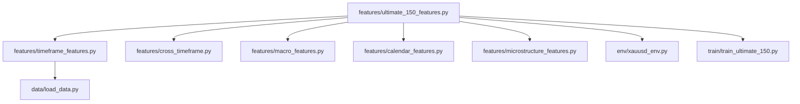
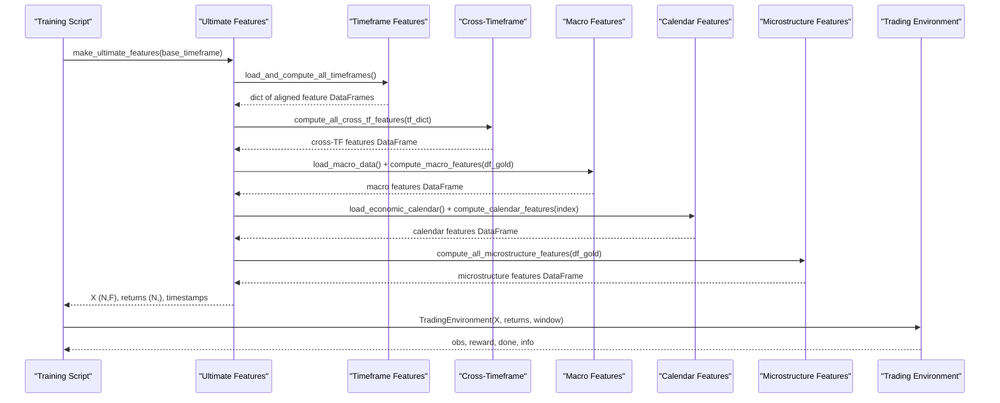
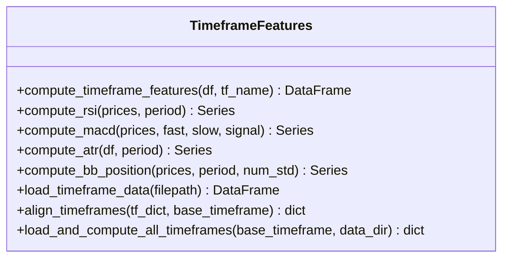
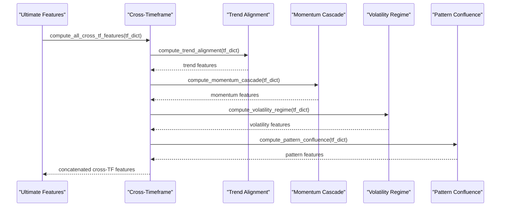
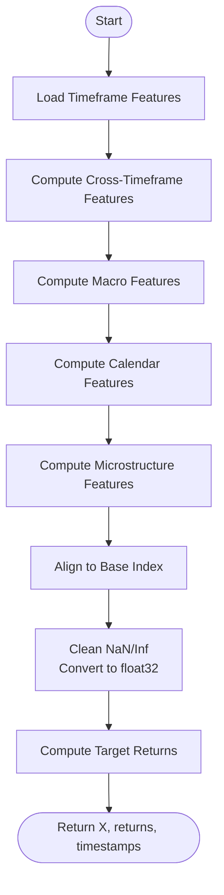
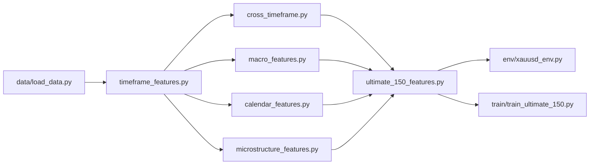

# Feature Engineering System

<cite>
**Referenced Files in This Document**
- [features/__init__.py](file://features/__init__.py)
- [features/make_features.py](file://features/make_features.py)
- [features/ultimate_150_features.py](file://features/ultimate_150_features.py)
- [features/timeframe_features.py](file://features/timeframe_features.py)
- [features/cross_timeframe.py](file://features/cross_timeframe.py)
- [features/macro_features.py](file://features/macro_features.py)
- [features/calendar_features.py](file://features/calendar_features.py)
- [features/microstructure_features.py](file://features/microstructure_features.py)
- [features/god_mode_features.py](file://features/god_mode_features.py)
- [data/load_data.py](file://data/load_data.py)
- [env/xauusd_env.py](file://env/xauusd_env.py)
- [train/train_ultimate_150.py](file://train/train_ultimate_150.py)
</cite>

## Table of Contents
1. [Introduction](#introduction)
2. [Project Structure](#project-structure)
3. [Core Components](#core-components)
4. [Architecture Overview](#architecture-overview)
5. [Detailed Component Analysis](#detailed-component-analysis)
6. [Dependency Analysis](#dependency-analysis)
7. [Performance Considerations](#performance-considerations)
8. [Troubleshooting Guide](#troubleshooting-guide)
9. [Conclusion](#conclusion)
10. [Appendices](#appendices)

## Introduction
This document explains the comprehensive feature engineering system that produces 150+ market features across multiple timeframes (M5, M15, H1, H4, D1, W1). It covers:
- Technical indicators library for trend, momentum, volatility, and volume
- Macro correlation features integrating VIX, Oil, Bitcoin, DXY, SPX, US10Y, EURUSD, Silver/GLD
- Economic calendar integration for event-driven features
- Market microstructure analysis capturing session effects, liquidity, and volume dynamics
- Configuration options, parameterization, and return shapes for training pipelines
- Integration with trading environments and model inputs
- Common issues such as scaling, missing data handling, and computational optimization

The system is designed to be modular, robust, and scalable, enabling both rapid prototyping and production-grade training runs.

## Project Structure
The feature system is organized into focused modules that compute specific categories of features and a master orchestrator that combines them into a unified matrix aligned to a base timeframe.

**Diagram sources**
- [features/ultimate_150_features.py:27-226](file://features/ultimate_150_features.py#L27-L226)
- [features/timeframe_features.py:22-304](file://features/timeframe_features.py#L22-L304)
- [features/cross_timeframe.py:205-249](file://features/cross_timeframe.py#L205-L249)
- [features/macro_features.py:26-445](file://features/macro_features.py#L26-L445)
- [features/calendar_features.py:23-249](file://features/calendar_features.py#L23-L249)
- [features/microstructure_features.py:170-225](file://features/microstructure_features.py#L170-L225)
- [data/load_data.py:5-73](file://data/load_data.py#L5-L73)
- [env/xauusd_env.py:7-118](file://env/xauusd_env.py#L7-L118)
- [train/train_ultimate_150.py:49-151](file://train/train_ultimate_150.py#L49-L151)

**Section sources**
- [features/__init__.py:1-8](file://features/__init__.py#L1-L8)
- [features/ultimate_150_features.py:27-226](file://features/ultimate_150_features.py#L27-L226)

## Core Components
- Timeframe Features: 16 standardized features per timeframe covering price action, trend, technicals, and support/resistance.
- Cross-Timeframe Features: 12 advanced features capturing multi-timeframe alignment, momentum cascades, volatility regimes, and pattern confluence.
- Macro Features: 24 features from macro series including returns, momentum, and rolling correlations with gold.
- Calendar Features: 8 event-aware features encoding proximity to events, impact levels, density, and type flags.
- Microstructure Features: 12 features modeling sessions, time-of-day effects, volume profile, imbalance, spread proxy, and liquidity regime.
- Master Orchestrator: Combines all components, aligns timestamps, cleans data, computes targets, and returns normalized matrices ready for training.

Key configuration points:
- Base timeframe selection (M5 recommended for speed)
- Data directory path for OHLCV and macro files
- Indicator parameters (e.g., RSI period, MA windows, ATR window, Bollinger Band width)
- Alignment method (forward-fill higher TFs to base index)
- Cleaning strategy (NaN/Inf replacement, float32 conversion)

Return values:
- Features matrix: shape (N, 152+) dtype float32
- Returns vector: shape (N,) target returns
- Timestamps: DatetimeIndex for alignment and slicing

**Section sources**
- [features/timeframe_features.py:22-99](file://features/timeframe_features.py#L22-L99)
- [features/cross_timeframe.py:205-249](file://features/cross_timeframe.py#L205-L249)
- [features/macro_features.py:363-445](file://features/macro_features.py#L363-L445)
- [features/calendar_features.py:111-249](file://features/calendar_features.py#L111-L249)
- [features/microstructure_features.py:170-225](file://features/microstructure_features.py#L170-L225)
- [features/ultimate_150_features.py:27-226](file://features/ultimate_150_features.py#L27-L226)

## Architecture Overview
The pipeline loads OHLCV data, computes per-timeframe features, derives cross-timeframe intelligence, integrates macro correlations, augments with economic calendar signals, adds microstructure context, and outputs a unified feature matrix aligned to a base timeframe.

**Diagram sources**
- [features/ultimate_150_features.py:27-226](file://features/ultimate_150_features.py#L27-L226)
- [features/timeframe_features.py:236-304](file://features/timeframe_features.py#L236-L304)
- [features/cross_timeframe.py:205-249](file://features/cross_timeframe.py#L205-L249)
- [features/macro_features.py:26-445](file://features/macro_features.py#L26-L445)
- [features/calendar_features.py:23-249](file://features/calendar_features.py#L23-L249)
- [features/microstructure_features.py:170-225](file://features/microstructure_features.py#L170-L225)
- [train/train_ultimate_150.py:172-204](file://train/train_ultimate_150.py#L172-L204)
- [env/xauusd_env.py:7-118](file://env/xauusd_env.py#L7-L118)

## Detailed Component Analysis

### Timeframe Features
Computes 16 features per timeframe:
- Price Action: returns, volatility (rolling std), momentum at multiple horizons
- Trend: fast/slow moving averages, difference normalized by price, trend direction
- Technicals: RSI (normalized), MACD histogram normalized by price, ATR as % of price, Bollinger Band position
- Volume & S/R: volume ratio vs average, distance to recent high/low

Parameters:
- RSI period defaults to 14
- MACD spans: fast=12, slow=26, signal=9
- ATR period defaults to 14
- Bollinger Band period defaults to 20 with 2 standard deviations

Alignment:
- Higher timeframe features are forward-filled to the base timeframe index

Output:
- Per-timeframe DataFrame with prefixed columns (e.g., M5_return, H1_rsi)

**Section sources**
- [features/timeframe_features.py:22-99](file://features/timeframe_features.py#L22-L99)
- [features/timeframe_features.py:102-178](file://features/timeframe_features.py#L102-L178)
- [features/timeframe_features.py:207-233](file://features/timeframe_features.py#L207-L233)

#### Class Diagram (Timeframe Features)

**Diagram sources**
- [features/timeframe_features.py:22-304](file://features/timeframe_features.py#L22-L304)

### Cross-Timeframe Features
Generates 12 features capturing hierarchical relationships:
- Trend Alignment: overall agreement, cascade strength, divergence
- Momentum Cascade: interactions between higher and lower timeframe momentum
- Volatility Regime: current vs long-term volatility, spikes, compression
- Pattern Confluence: support/resistance confluence and breakout alignment

Inputs:
- Dict of per-timeframe feature DataFrames aligned to base index

Outputs:
- DataFrame with 12 cross-timeframe features

**Section sources**
- [features/cross_timeframe.py:21-66](file://features/cross_timeframe.py#L21-L66)
- [features/cross_timeframe.py:69-102](file://features/cross_timeframe.py#L69-L102)
- [features/cross_timeframe.py:105-138](file://features/cross_timeframe.py#L105-L138)
- [features/cross_timeframe.py:141-202](file://features/cross_timeframe.py#L141-L202)
- [features/cross_timeframe.py:205-249](file://features/cross_timeframe.py#L205-L249)

#### Sequence Diagram (Cross-Timeframe Computation)

**Diagram sources**
- [features/cross_timeframe.py:205-249](file://features/cross_timeframe.py#L205-L249)

### Macro Features
Integrates 8 macro sources providing 24 features:
- Sources: DXY, SPX, US10Y, VIX, Oil (WTI), Bitcoin, EURUSD, Silver/GLD
- Each source contributes returns, momentum, and rolling correlation with gold
- Timezone normalization ensures alignment with gold timestamps
- Daily resampling when using intraday gold data; forward-filling back to base frequency

Configuration:
- Rolling correlation window defaults to 120 days
- VIX level normalized by dividing by 50; regime threshold at 20

Outputs:
- Macro features DataFrame aligned to gold timestamps

**Section sources**
- [features/macro_features.py:26-75](file://features/macro_features.py#L26-L75)
- [features/macro_features.py:78-132](file://features/macro_features.py#L78-L132)
- [features/macro_features.py:135-160](file://features/macro_features.py#L135-L160)
- [features/macro_features.py:163-188](file://features/macro_features.py#L163-L188)
- [features/macro_features.py:191-216](file://features/macro_features.py#L191-L216)
- [features/macro_features.py:219-242](file://features/macro_features.py#L219-L242)
- [features/macro_features.py:245-270](file://features/macro_features.py#L245-L270)
- [features/macro_features.py:273-298](file://features/macro_features.py#L273-L298)
- [features/macro_features.py:301-326](file://features/macro_features.py#L301-L326)
- [features/macro_features.py:329-360](file://features/macro_features.py#L329-L360)
- [features/macro_features.py:363-445](file://features/macro_features.py#L363-L445)

### Calendar Features
Produces 8 event-aware features:
- Timing: hours to next event, days since last event, event density (upcoming events in 7 days)
- Impact: high-impact flag, in-event window (±2 hours), expected volatility multiplier
- Type: NFP detection, FOMC detection

Processing:
- Loads JSON calendar file and iterates timestamps to compute nearest events
- Normalizes time-based features to bounded ranges

Outputs:
- Calendar features DataFrame aligned to base index

**Section sources**
- [features/calendar_features.py:23-50](file://features/calendar_features.py#L23-L50)
- [features/calendar_features.py:53-108](file://features/calendar_features.py#L53-L108)
- [features/calendar_features.py:111-249](file://features/calendar_features.py#L111-L249)

### Microstructure Features
Captures 12 microstructure signals:
- Session Effects: Asian, London, NY, overlap detection based on UTC hours
- Time Effects: hour-of-day, day-of-week, week-of-month, month-of-year
- Volume Analysis: volume percentile profile, volume imbalance proxy
- Liquidity: spread proxy (high-low over close), liquidity regime (relative to rolling average)

Outputs:
- Microstructure features DataFrame aligned to base index

**Section sources**
- [features/microstructure_features.py:22-51](file://features/microstructure_features.py#L22-L51)
- [features/microstructure_features.py:54-86](file://features/microstructure_features.py#L54-L86)
- [features/microstructure_features.py:89-130](file://features/microstructure_features.py#L89-L130)
- [features/microstructure_features.py:133-167](file://features/microstructure_features.py#L133-L167)
- [features/microstructure_features.py:170-225](file://features/microstructure_features.py#L170-L225)

### Master Orchestrator (Ultimate 150+ Features)
Combines all modules into a single pipeline:
- Step 1: Load timeframe features for M5/M15/H1/H4/D1/W1
- Step 2: Compute cross-timeframe features
- Step 3: Compute macro features (with daily resampling and alignment)
- Step 4: Compute calendar features
- Step 5: Compute microstructure features
- Step 6: Align all to base index and concatenate
- Step 7: Clean NaN/Inf, convert to float32
- Step 8: Compute target returns from base timeframe close prices

Returns:
- Features matrix (N, 152+)
- Returns vector (N,)
- Timestamps (N,)

**Section sources**
- [features/ultimate_150_features.py:27-226](file://features/ultimate_150_features.py#L27-L226)

#### Flowchart (Ultimate Pipeline)

**Diagram sources**
- [features/ultimate_150_features.py:47-182](file://features/ultimate_150_features.py#L47-L182)

### God Mode Features (Alternative Aggregator)
Provides an alternative aggregator that can:
- Resample to H4/D1 from H1 and compute per-timeframe features
- Combine macro correlations and simplified calendar placeholders
- Return a large feature set suitable for single or multi-timeframe usage

Note: The Ultimate 150+ module is the primary orchestrator; God Mode offers flexibility for different data layouts.

**Section sources**
- [features/god_mode_features.py:291-379](file://features/god_mode_features.py#L291-L379)

### Simple Feature Builder (Legacy Example)
A compact example demonstrating basic feature computation (returns, volatility, momentum, moving averages, RSI, MACD) and normalization. Useful for quick experiments or minimal feature sets.

**Section sources**
- [features/make_features.py:6-78](file://features/make_features.py#L6-L78)

## Dependency Analysis
The system exhibits clear separation of concerns:
- Timeframe features depend only on OHLCV data
- Cross-timeframe features depend on aligned per-timeframe outputs
- Macro features depend on external macro CSVs and timezone normalization
- Calendar features depend on a JSON calendar file
- Microstructure features depend on OHLCV and time index
- Ultimate orchestrator depends on all above and provides final alignment and cleaning

Potential circular dependencies:
- None detected; modules import each other only via the orchestrator

External integrations:
- data/load_data.py standardizes column names and validates OHLC
- env/xauusd_env.py consumes features and returns for RL training
- train/train_ultimate_150.py wires features into a custom environment and agent

**Diagram sources**
- [data/load_data.py:5-73](file://data/load_data.py#L5-L73)
- [features/timeframe_features.py:236-304](file://features/timeframe_features.py#L236-L304)
- [features/cross_timeframe.py:205-249](file://features/cross_timeframe.py#L205-L249)
- [features/macro_features.py:26-445](file://features/macro_features.py#L26-L445)
- [features/calendar_features.py:23-249](file://features/calendar_features.py#L23-L249)
- [features/microstructure_features.py:170-225](file://features/microstructure_features.py#L170-L225)
- [features/ultimate_150_features.py:27-226](file://features/ultimate_150_features.py#L27-L226)
- [env/xauusd_env.py:7-118](file://env/xauusd_env.py#L7-L118)
- [train/train_ultimate_150.py:172-204](file://train/train_ultimate_150.py#L172-L204)

**Section sources**
- [features/ultimate_150_features.py:27-226](file://features/ultimate_150_features.py#L27-L226)
- [data/load_data.py:5-73](file://data/load_data.py#L5-L73)
- [env/xauusd_env.py:7-118](file://env/xauusd_env.py#L7-L118)
- [train/train_ultimate_150.py:172-204](file://train/train_ultimate_150.py#L172-L204)

## Performance Considerations
- Use M5 as base timeframe for faster iteration; higher timeframes are forward-filled to reduce computation
- Prefer vectorized pandas/numpy operations already used (rolling, ewm, corr)
- Convert to float32 early to reduce memory footprint
- Avoid recomputing expensive indicators by caching intermediate results if needed
- Limit calendar processing by subsampling timestamps during development
- For macro features, daily resampling reduces correlation computations; ensure proper alignment before reindexing

[No sources needed since this section provides general guidance]

## Troubleshooting Guide
Common issues and resolutions:
- Missing macro files: Modules log warnings and skip unavailable sources; ensure required CSVs exist in data directory
- Timezone mismatches: Macro features normalize timezone-naive indices; verify input series have consistent timezone handling
- NaN/Inf values: Pipeline fills NaNs with zeros and replaces infinities; check upstream calculations if excessive cleaning occurs
- Column validation: load_data.py enforces OHLC constraints; invalid rows will raise errors—clean raw data beforehand
- Alignment gaps: Forward-fill is used; if gaps persist, inspect resampling rules and base index consistency

Operational checks:
- Verify timeframe files exist for required TFs; W1 is optional
- Confirm calendar JSON path and format matches expectations
- Validate macro series contain close prices or compatible naming

**Section sources**
- [features/macro_features.py:51-75](file://features/macro_features.py#L51-L75)
- [features/calendar_features.py:32-50](file://features/calendar_features.py#L32-L50)
- [features/ultimate_150_features.py:156-174](file://features/ultimate_150_features.py#L156-L174)
- [data/load_data.py:55-73](file://data/load_data.py#L55-L73)

## Conclusion
The feature engineering system delivers a robust, modular foundation for quantitative trading research and production training. By combining multi-timeframe technicals, cross-timeframe intelligence, macro correlations, event awareness, and microstructure context, it provides rich observations for models while maintaining clean data hygiene and performance-conscious design. The orchestrator exposes simple interfaces returning feature matrices, returns, and timestamps, seamlessly integrating with RL environments and training scripts.

[No sources needed since this section summarizes without analyzing specific files]

## Appendices

### API Reference Summary
- make_ultimate_features(base_timeframe='M5', data_dir='data')
  - Inputs: base timeframe string, data directory path
  - Outputs: (X: ndarray (N, 152+)), (returns: ndarray (N,)), (timestamps: DatetimeIndex)
- load_and_compute_all_timeframes(base_timeframe='M5', data_dir='data')
  - Outputs: dict of aligned feature DataFrames per timeframe
- compute_all_cross_tf_features(tf_dict)
  - Inputs: dict of aligned per-timeframe feature DataFrames
  - Outputs: DataFrame with 12 cross-timeframe features
- load_macro_data(data_dir='data'), compute_macro_features(df_gold, macro_dict)
  - Inputs: macro CSV directory, gold DataFrame, macro series dict
  - Outputs: DataFrame with 24 macro features aligned to gold timestamps
- load_economic_calendar(filepath), compute_calendar_features(df_timestamps, calendar)
  - Inputs: JSON filepath, base index, calendar list
  - Outputs: DataFrame with 8 calendar features
- compute_all_microstructure_features(df)
  - Inputs: OHLCV DataFrame with DatetimeIndex
  - Outputs: DataFrame with 12 microstructure features

**Section sources**
- [features/ultimate_150_features.py:27-226](file://features/ultimate_150_features.py#L27-L226)
- [features/timeframe_features.py:236-304](file://features/timeframe_features.py#L236-L304)
- [features/cross_timeframe.py:205-249](file://features/cross_timeframe.py#L205-L249)
- [features/macro_features.py:26-445](file://features/macro_features.py#L26-L445)
- [features/calendar_features.py:23-249](file://features/calendar_features.py#L23-L249)
- [features/microstructure_features.py:170-225](file://features/microstructure_features.py#L170-L225)

### Integration with Training and Environments
- Training script constructs a custom environment using features and returns
- Observation space is flattened window of features plus current position
- Actions are discrete (flat/long) with cost penalties and PnL rewards

**Section sources**
- [train/train_ultimate_150.py:49-151](file://train/train_ultimate_150.py#L49-L151)
- [env/xauusd_env.py:7-118](file://env/xauusd_env.py#L7-L118)