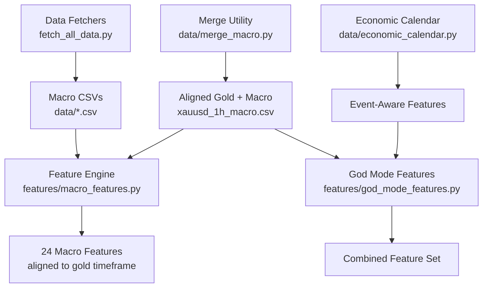
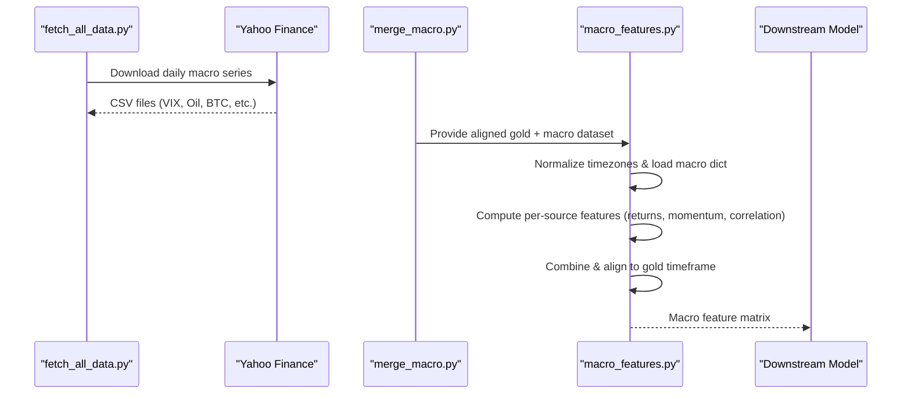
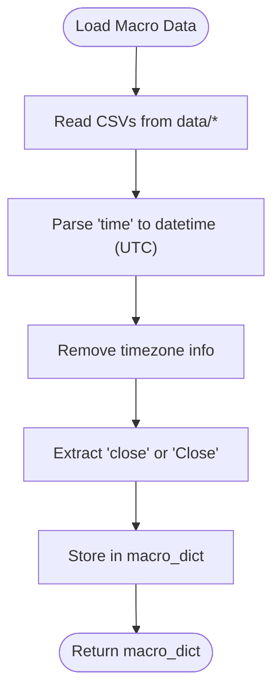
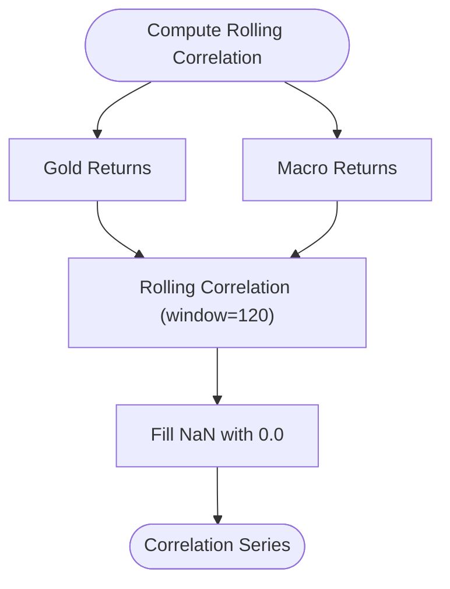
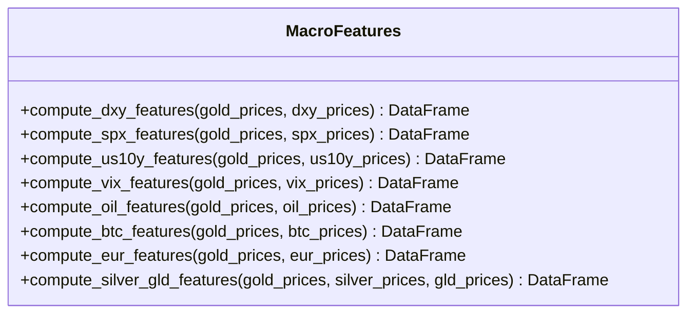
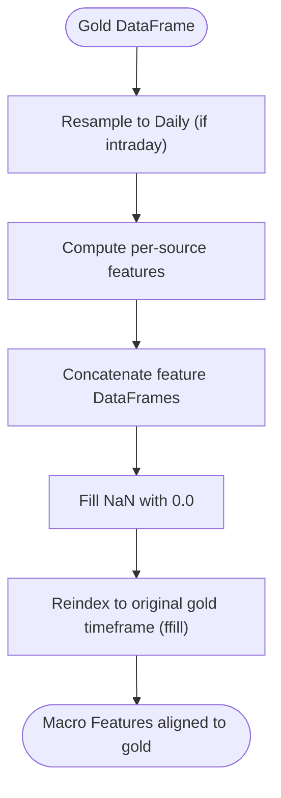
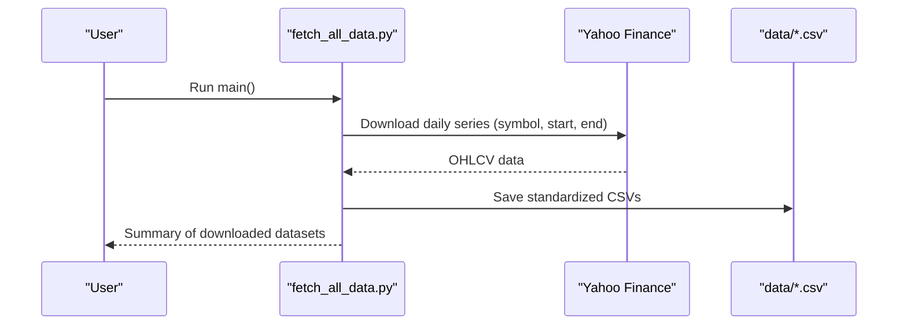
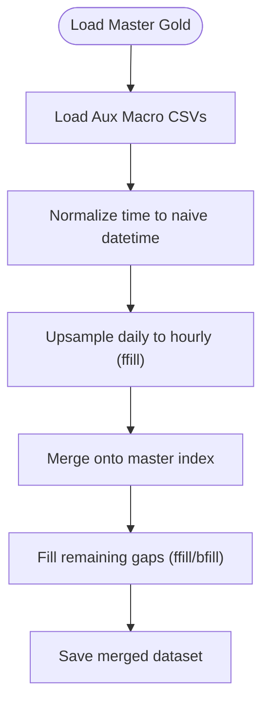
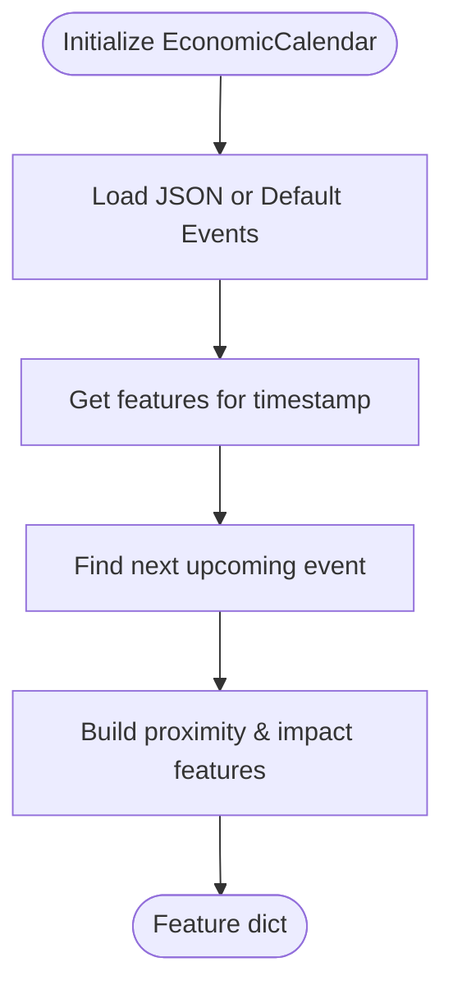
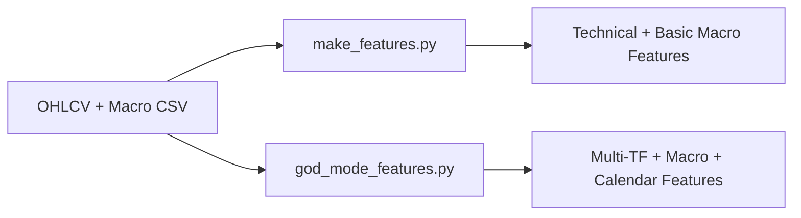

# Macro Market Integration

<cite>
**Referenced Files in This Document**
- [macro_features.py](file://features/macro_features.py)
- [merge_macro.py](file://data/merge_macro.py)
- [fetch_correlations.py](file://data/fetch_correlations.py)
- [load_data.py](file://data/load_data.py)
- [economic_calendar.py](file://data/economic_calendar.py)
- [make_features.py](file://features/make_features.py)
- [god_mode_features.py](file://features/god_mode_features.py)
- [fetch_all_data.py](file://scripts/fetch_all_data.py)
</cite>

## Table of Contents
1. Introduction
2. Project Structure
3. Core Components
4. Architecture Overview
5. Detailed Component Analysis
6. Dependency Analysis
7. Performance Considerations
8. Troubleshooting Guide
9. Conclusion
10. Appendices

## Introduction
This document explains the macro market integration system that incorporates 24 macroeconomic features from global markets to inform gold trading strategies. It covers how data is fetched from VIX, Oil (WTI), Bitcoin, DXY (US Dollar Index), SPX (S&P 500), US10Y (Treasury Yields), EURUSD, Silver, and GLD; how these series are aligned temporally with price data; how correlation analysis and feature computation translate macro conditions into actionable signals; and how to handle data quality issues, missing values, and macro events. Guidance is also provided for customizing macro feature sets and adjusting sensitivity to different macroeconomic conditions.

## Project Structure
The macro integration spans data acquisition, merging, feature engineering, and event-awareness modules:
- Data acquisition scripts fetch daily macro series from Yahoo Finance and FRED-compatible sources.
- Merging utilities align daily macro series to intraday gold timeframes using forward-fill techniques.
- Feature modules compute returns, momentum, regime indicators, and rolling correlations between gold and macro series.
- Economic calendar integration adds event-aware features around high-impact releases.

**Diagram sources**
- [fetch_all_data.py:131-214](file://scripts/fetch_all_data.py#L131-L214)
- [merge_macro.py:4-56](file://data/merge_macro.py#L4-L56)
- [macro_features.py:26-75](file://features/macro_features.py#L26-L75)
- [economic_calendar.py:27-79](file://data/economic_calendar.py#L27-L79)
- [god_mode_features.py:291-379](file://features/god_mode_features.py#L291-L379)

**Section sources**
- [fetch_all_data.py:131-214](file://scripts/fetch_all_data.py#L131-L214)
- [merge_macro.py:4-56](file://data/merge_macro.py#L4-L56)
- [macro_features.py:26-75](file://features/macro_features.py#L26-L75)
- [economic_calendar.py:27-79](file://data/economic_calendar.py#L27-L79)
- [god_mode_features.py:291-379](file://features/god_mode_features.py#L291-L379)

## Core Components
- Macro data loader and alignment: loads multiple macro CSVs, normalizes timezones, and aligns to gold timestamps.
- Feature generators per macro source: each produces three features (returns/momentum/regime or correlation).
- Correlation engine: rolling correlation between gold returns and macro returns over a fixed window.
- Event-aware features: economic calendar integration provides proximity-to-event and volatility forecasts.
- Unified feature assembly: combines all macro features and aligns them back to the target gold timeframe.

Key responsibilities:
- Data fetching: Yahoo Finance-based downloaders for VIX, Oil, Bitcoin, EURUSD, Silver, GLD, DXY, SPX, US10Y.
- Temporal alignment: forward-fill daily macro series to match intraday gold bars.
- Feature computation: standardized return, momentum, regime, and correlation metrics.
- Quality control: timezone normalization, NaN handling, and validation checks.

**Section sources**
- [macro_features.py:26-75](file://features/macro_features.py#L26-L75)
- [macro_features.py:114-132](file://features/macro_features.py#L114-L132)
- [macro_features.py:135-360](file://features/macro_features.py#L135-L360)
- [macro_features.py:363-445](file://features/macro_features.py#L363-L445)
- [fetch_all_data.py:131-214](file://scripts/fetch_all_data.py#L131-L214)
- [merge_macro.py:4-56](file://data/merge_macro.py#L4-L56)
- [economic_calendar.py:181-234](file://data/economic_calendar.py#L181-L234)

## Architecture Overview
The system follows a pipeline:
1. Fetch daily macro series from Yahoo Finance and save as CSVs.
2. Load gold OHLC data and merge macro series by reindexing daily values to hourly timestamps via forward-fill.
3. Compute 24 macro features across eight sources, each contributing three engineered features.
4. Align macro features to the target gold timeframe (e.g., M5/H1) using forward-fill.
5. Optionally integrate economic calendar features for event-aware modeling.

**Diagram sources**
- [fetch_all_data.py:131-214](file://scripts/fetch_all_data.py#L131-L214)
- [merge_macro.py:4-56](file://data/merge_macro.py#L4-L56)
- [macro_features.py:26-75](file://features/macro_features.py#L26-L75)
- [macro_features.py:363-445](file://features/macro_features.py#L363-L445)

## Detailed Component Analysis

### Macro Data Loading and Timezone Alignment
- Loads macro CSVs from the data directory, standardizes column names, converts timestamps to timezone-naive UTC, and extracts close prices.
- Provides a robust timezone normalization function to align any series to a reference index (gold timestamps), using forward-fill to propagate daily values.

**Diagram sources**
- [macro_features.py:26-75](file://features/macro_features.py#L26-L75)

**Section sources**
- [macro_features.py:26-75](file://features/macro_features.py#L26-L75)
- [macro_features.py:78-111](file://features/macro_features.py#L78-L111)

### Rolling Correlation Engine
- Computes rolling correlation between gold returns and macro returns over a fixed window (default 120 days).
- Returns are derived via percentage changes; correlation results are filled with zeros where insufficient history exists.

**Diagram sources**
- [macro_features.py:114-132](file://features/macro_features.py#L114-L132)

**Section sources**
- [macro_features.py:114-132](file://features/macro_features.py#L114-L132)

### Per-Source Feature Generators (24 Features)
Each macro source contributes three features:
- DXY: return, 20-day momentum, gold-DXY correlation
- SPX: return, 20-day momentum, gold-SPX correlation
- US10Y: daily change, 20-day momentum, gold-yields correlation
- VIX: normalized level, daily change, regime indicator (>20 high fear)
- Oil: return, 20-day momentum, gold-oil correlation
- Bitcoin: return, 20-day momentum, gold-BTC correlation
- EURUSD: return, 20-day momentum, gold-EUR correlation
- Silver/GLD: gold-silver ratio (normalized), gold-silver correlation, GLD flow proxy

These functions align each macro series to gold timestamps before computing features.

**Diagram sources**
- [macro_features.py:135-360](file://features/macro_features.py#L135-L360)

**Section sources**
- [macro_features.py:135-160](file://features/macro_features.py#L135-L160)
- [macro_features.py:163-188](file://features/macro_features.py#L163-L188)
- [macro_features.py:191-216](file://features/macro_features.py#L191-L216)
- [macro_features.py:219-242](file://features/macro_features.py#L219-L242)
- [macro_features.py:245-270](file://features/macro_features.py#L245-L270)
- [macro_features.py:273-298](file://features/macro_features.py#L273-L298)
- [macro_features.py:301-326](file://features/macro_features.py#L301-L326)
- [macro_features.py:329-360](file://features/macro_features.py#L329-L360)

### Unified Macro Feature Assembly
- Resamples gold to daily if needed to align with macro series.
- Computes per-source features and concatenates them into a single DataFrame.
- Fills NaNs with zeros and reindexes to original gold timeframe using forward-fill.

**Diagram sources**
- [macro_features.py:363-445](file://features/macro_features.py#L363-L445)

**Section sources**
- [macro_features.py:363-445](file://features/macro_features.py#L363-L445)

### Data Fetching Mechanisms
- Uses Yahoo Finance to download daily series for VIX, Oil (WTI), Bitcoin, EURUSD, Silver, GLD, DXY, SPX, US10Y.
- Saves standardized CSVs with lowercase columns and a unified time column.
- Supports flexible date ranges and logs progress and errors.

**Diagram sources**
- [fetch_all_data.py:27-64](file://scripts/fetch_all_data.py#L27-L64)
- [fetch_all_data.py:131-214](file://scripts/fetch_all_data.py#L131-L214)

**Section sources**
- [fetch_all_data.py:27-64](file://scripts/fetch_all_data.py#L27-L64)
- [fetch_all_data.py:131-214](file://scripts/fetch_all_data.py#L131-L214)

### Temporal Alignment and Merging
- The merge utility loads master gold data and auxiliary macro series, then upsamples daily values to hourly using forward-fill to match master timestamps.
- Handles holidays and gaps by filling remaining NaNs via forward/backward fill.

**Diagram sources**
- [merge_macro.py:4-56](file://data/merge_macro.py#L4-L56)

**Section sources**
- [merge_macro.py:4-56](file://data/merge_macro.py#L4-L56)

### Economic Calendar Integration
- Tracks scheduled high-impact USD events (NFP, CPI, FOMC, GDP, Retail Sales, Unemployment, Fed speeches).
- Generates features such as hours until next event, high-impact flags, event windows, and expected volatility multipliers.
- Provides default calendar when external file is missing and supports saving/updating events.

**Diagram sources**
- [economic_calendar.py:27-79](file://data/economic_calendar.py#L27-L79)
- [economic_calendar.py:181-234](file://data/economic_calendar.py#L181-L234)

**Section sources**
- [economic_calendar.py:27-79](file://data/economic_calendar.py#L27-L79)
- [economic_calendar.py:181-234](file://data/economic_calendar.py#L181-L234)
- [economic_calendar.py:337-374](file://data/economic_calendar.py#L337-L374)

### Alternative Feature Sets and God Mode
- make_features.py demonstrates a simpler feature set including technical indicators and basic macro returns/correlations.
- god_mode_features.py integrates multi-timeframe features, macro correlations, and placeholders for calendar features, producing a comprehensive feature matrix for advanced models.

**Diagram sources**
- [make_features.py:18-78](file://features/make_features.py#L18-L78)
- [god_mode_features.py:291-379](file://features/god_mode_features.py#L291-L379)

**Section sources**
- [make_features.py:18-78](file://features/make_features.py#L18-L78)
- [god_mode_features.py:291-379](file://features/god_mode_features.py#L291-L379)

## Dependency Analysis
- Data sources: Yahoo Finance via yfinance; optional FRED-like series through similar mechanisms.
- Modules:
  - fetch_all_data.py depends on yfinance and pandas.
  - merge_macro.py depends on load_data.py and pandas.
  - macro_features.py depends on pandas/numpy and uses timezone-aware operations.
  - economic_calendar.py depends on pandas/numpy/json and manages event calendars.
  - god_mode_features.py depends on pandas/numpy and optionally imports economic calendar.

Potential coupling:
- Strong cohesion within macro_features.py for per-source computations.
- Loose coupling via CSV intermediates between fetchers and feature engines.
- Optional dependency on economic calendar for event-aware features.

External integrations:
- Yahoo Finance API rate limits and symbol availability may affect reliability.
- Timezone handling must be consistent across sources to avoid misalignment.

**Section sources**
- [fetch_all_data.py:131-214](file://scripts/fetch_all_data.py#L131-L214)
- [merge_macro.py:4-56](file://data/merge_macro.py#L4-L56)
- [macro_features.py:26-75](file://features/macro_features.py#L26-L75)
- [economic_calendar.py:27-79](file://data/economic_calendar.py#L27-L79)
- [god_mode_features.py:291-379](file://features/god_mode_features.py#L291-L379)

## Performance Considerations
- Rolling correlation over long windows can be computationally intensive; consider vectorized implementations or chunked processing for large datasets.
- Forward-filling daily data to intraday frequencies increases memory usage; ensure efficient indexing and minimal intermediate copies.
- Multi-timeframe feature generation resamples data; use appropriate aggregation functions and drop unnecessary columns early.
- Logging verbosity can slow execution; adjust logging levels in production environments.

[No sources needed since this section provides general guidance]

## Troubleshooting Guide
Common issues and resolutions:
- Missing macro CSVs: Ensure fetch_all_data.py has successfully downloaded required series and saved them to data/*.csv.
- Timezone mismatches: Use normalize_timezone to convert series to timezone-naive UTC and align to gold timestamps.
- NaN propagation: After correlation and momentum calculations, fill NaNs with zeros to prevent model instability.
- Holiday gaps: When merging daily macro to hourly gold, apply ffill/bfill to handle non-trading days.
- Event calendar not found: The system falls back to a default calendar; update data/economic_events.json for accurate scheduling.

Validation steps:
- Check loaded macro series lengths and date ranges.
- Verify feature shapes align with gold timeframe after reindexing.
- Inspect sample outputs for unexpected NaNs or constant values.

**Section sources**
- [macro_features.py:26-75](file://features/macro_features.py#L26-L75)
- [macro_features.py:78-111](file://features/macro_features.py#L78-L111)
- [macro_features.py:363-445](file://features/macro_features.py#L363-L445)
- [merge_macro.py:4-56](file://data/merge_macro.py#L4-L56)
- [economic_calendar.py:181-234](file://data/economic_calendar.py#L181-L234)

## Conclusion
The macro market integration system provides a robust pipeline to ingest, align, and engineer 24 macroeconomic features across key global indicators. By combining returns, momentum, regime detection, and rolling correlations with gold, it translates macro conditions into actionable signals. Economic calendar integration further enhances strategy resilience around high-impact events. Users can customize feature sets, adjust sensitivity via thresholds (e.g., VIX regime), and extend the system with additional macro sources while maintaining temporal alignment and data quality.

[No sources needed since this section summarizes without analyzing specific files]

## Appendices

### Examples of Macro Feature Generation
- DXY features: daily return, 20-day momentum, rolling gold-DXY correlation.
- SPX features: daily return, 20-day momentum, rolling gold-SPX correlation.
- US10Y features: daily change, 20-day momentum, rolling gold-yields correlation.
- VIX features: normalized level, daily change, regime indicator based on threshold.
- Oil features: daily return, 20-day momentum, rolling gold-oil correlation.
- Bitcoin features: daily return, 20-day momentum, rolling gold-BTC correlation.
- EURUSD features: daily return, 20-day momentum, rolling gold-EUR correlation.
- Silver/GLD features: gold-silver ratio (normalized), rolling gold-silver correlation, GLD flow proxy.

**Section sources**
- [macro_features.py:135-360](file://features/macro_features.py#L135-L360)

### Correlation Calculations Between Gold and Macro Indicators
- Rolling correlation computed over a fixed window (default 120 days) between gold returns and macro returns.
- Correlation series are filled with zeros where insufficient history exists to maintain stable inputs.

**Section sources**
- [macro_features.py:114-132](file://features/macro_features.py#L114-L132)

### Temporal Alignment of Macro Data with Price Data
- Daily macro series are aligned to gold timestamps using forward-fill to propagate last known values across intraday bars.
- Timezone normalization ensures consistent alignment across sources with varying timezone metadata.

**Section sources**
- [macro_features.py:78-111](file://features/macro_features.py#L78-L111)
- [merge_macro.py:4-56](file://data/merge_macro.py#L4-L56)

### Data Quality Issues and Missing Value Handling
- Missing macro CSVs result in warnings and skipped computations for that source.
- NaN values after feature computation are filled with zeros to prevent downstream instability.
- Holiday gaps handled via forward/backward fill during merging.

**Section sources**
- [macro_features.py:26-75](file://features/macro_features.py#L26-L75)
- [macro_features.py:363-445](file://features/macro_features.py#L363-L445)
- [merge_macro.py:4-56](file://data/merge_macro.py#L4-L56)

### Impact of Macro Events on Gold Trading Strategies
- Economic calendar features provide proximity-to-event and volatility forecasts to adapt strategy sensitivity around NFP, CPI, FOMC, and other high-impact releases.
- Event windows flag periods of elevated expected volatility, enabling dynamic risk management.

**Section sources**
- [economic_calendar.py:27-79](file://data/economic_calendar.py#L27-L79)
- [economic_calendar.py:181-234](file://data/economic_calendar.py#L181-L234)

### Customizing Macro Feature Sets and Adjusting Sensitivity
- Add new macro sources by extending load_macro_data mappings and implementing a corresponding compute_*_features function returning three features.
- Adjust sensitivity by modifying thresholds (e.g., VIX regime threshold) or rolling windows for momentum and correlation.
- Integrate additional event types in the economic calendar to refine volatility forecasts.

**Section sources**
- [macro_features.py:26-75](file://features/macro_features.py#L26-L75)
- [macro_features.py:219-242](file://features/macro_features.py#L219-L242)
- [economic_calendar.py:276-314](file://data/economic_calendar.py#L276-L314)