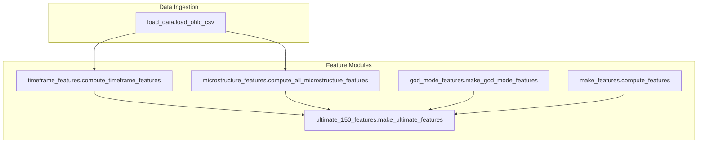
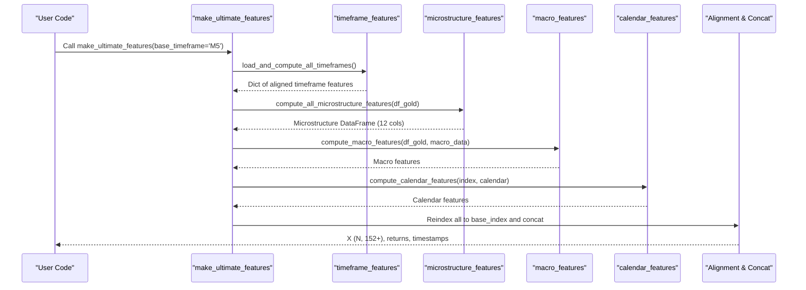
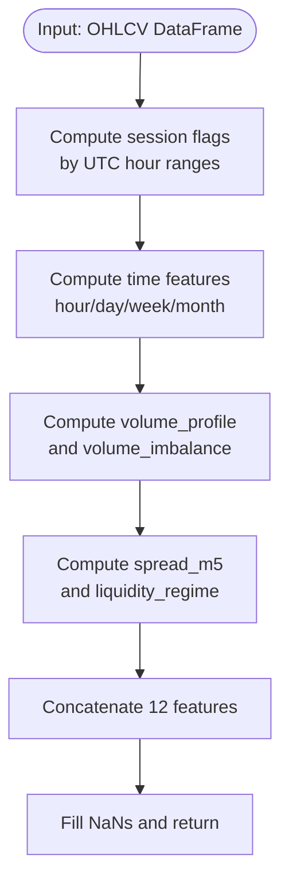
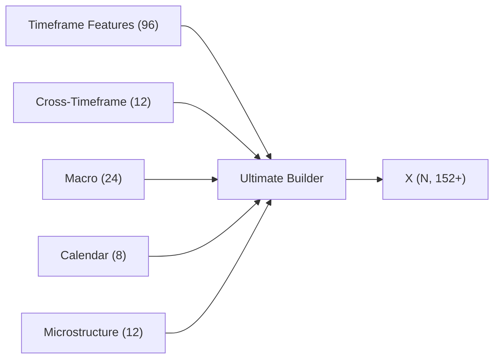
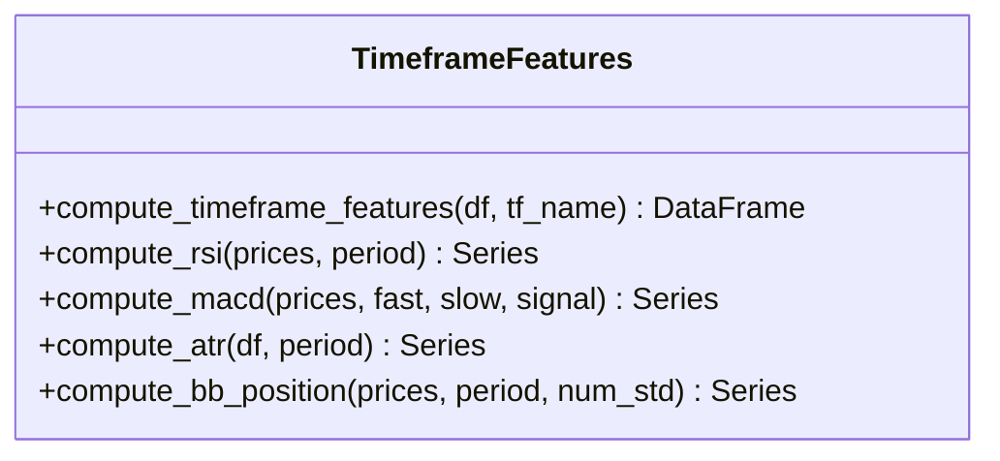
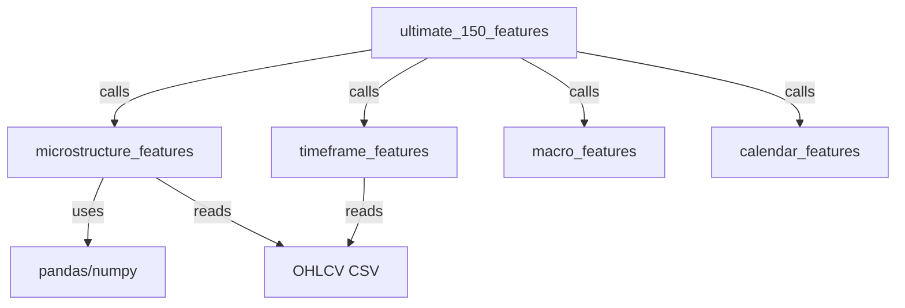

# Market Microstructure Analysis

<cite>
**Referenced Files in This Document**
- [microstructure_features.py](file://features/microstructure_features.py)
- [ultimate_150_features.py](file://features/ultimate_150_features.py)
- [timeframe_features.py](file://features/timeframe_features.py)
- [god_mode_features.py](file://features/god_mode_features.py)
- [make_features.py](file://features/make_features.py)
- [load_data.py](file://data/load_data.py)
- [README.md](file://README.md)
</cite>

## Table of Contents
1. [Introduction](#introduction)
2. [Project Structure](#project-structure)
3. [Core Components](#core-components)
4. [Architecture Overview](#architecture-overview)
5. [Detailed Component Analysis](#detailed-component-analysis)
6. [Dependency Analysis](#dependency-analysis)
7. [Performance Considerations](#performance-considerations)
8. [Troubleshooting Guide](#troubleshooting-guide)
9. [Conclusion](#conclusion)
10. [Appendices](#appendices)

## Introduction
This document explains the market microstructure analysis system that contributes 12 advanced features to capture intraday trading dynamics and integrate with higher-level technical analysis. The system focuses on session effects, time-of-day effects, volume-based signals, and liquidity regime detection. It also outlines how these microstructure features are combined into a comprehensive feature set for training models and supports customization of windows and sensitivity to different market regimes.

The repository provides:
- A dedicated microstructure module computing 12 features across sessions, time, volume, and liquidity
- An integration layer that combines timeframe, cross-timeframe, macro, calendar, and microstructure features into a unified dataset
- Utilities for loading and cleaning OHLCV data, including tick-level columns when available

## Project Structure
The microstructure components live under the features directory and are orchestrated by an “ultimate” feature builder that aligns multiple sources to a common base timeframe. Data ingestion is standardized via a loader that handles MT5-style headers and ensures numeric OHLC and time indices.

**Diagram sources**
- [load_data.py:5-73](file://data/load_data.py#L5-L73)
- [timeframe_features.py:22-99](file://features/timeframe_features.py#L22-L99)
- [microstructure_features.py:170-225](file://features/microstructure_features.py#L170-L225)
- [ultimate_150_features.py:27-154](file://features/ultimate_150_features.py#L27-L154)
- [god_mode_features.py:291-379](file://features/god_mode_features.py#L291-L379)
- [make_features.py:18-78](file://features/make_features.py#L18-L78)

**Section sources**
- [load_data.py:5-73](file://data/load_data.py#L5-L73)
- [ultimate_150_features.py:27-154](file://features/ultimate_150_features.py#L27-L154)

## Core Components
- Session Effects (4): Asian, London, New York, and overlap detection based on UTC hours
- Time Effects (4): hour-of-day, day-of-week, week-of-month, month-of-year
- Volume Analysis (2): rolling volume percentile profile and signed volume imbalance proxy
- Liquidity (2): spread proxy derived from high-low range relative to close and a liquidity regime indicator

These 12 features are computed per bar and aligned to the base timeframe index before being concatenated into the final observation vector used by models.

**Section sources**
- [microstructure_features.py:22-167](file://features/microstructure_features.py#L22-L167)
- [microstructure_features.py:170-225](file://features/microstructure_features.py#L170-L225)

## Architecture Overview
The ultimate feature pipeline orchestrates multiple feature sources and aligns them to a base timeframe (default M5). Microstructure features are computed on the base timeframe’s OHLCV series and then forward-filled to match the base index.

**Diagram sources**
- [ultimate_150_features.py:27-154](file://features/ultimate_150_features.py#L27-L154)
- [microstructure_features.py:170-225](file://features/microstructure_features.py#L170-L225)
- [timeframe_features.py:236-304](file://features/timeframe_features.py#L236-L304)

## Detailed Component Analysis

### Microstructure Features Module
Computes 12 features grouped into four categories:

- Session Effects
  - session_asian: Boolean-like indicator for Asian session hours (UTC)
  - session_london: Boolean-like indicator for London session hours (UTC)
  - session_ny: Boolean-like indicator for New York session hours (UTC)
  - session_overlap: Boolean-like indicator for London–New York overlap period (UTC)

- Time Effects
  - hour_of_day: Normalized hour (0–1)
  - day_of_week: Normalized weekday (0–1)
  - week_of_month: First/last week effect (0 or 1; middle mapped to 0.5)
  - month_of_year: Normalized month (0–1)

- Volume Analysis
  - volume_profile: Rolling percentile rank of current volume over a lookback window
  - volume_imbalance: Signed net volume proxy using price change direction and rolling sums

- Liquidity
  - spread_m5: Spread proxy computed as (high - low) / close
  - liquidity_regime: Binary regime label comparing current spread to rolling average spread

Implementation highlights:
- Uses pandas rolling operations for percentiles and sums
- Handles missing OHLC/volume gracefully with defaults and warnings
- Fills NaNs to ensure stable downstream modeling

**Diagram sources**
- [microstructure_features.py:22-167](file://features/microstructure_features.py#L22-L167)
- [microstructure_features.py:170-225](file://features/microstructure_features.py#L170-L225)

**Section sources**
- [microstructure_features.py:22-167](file://features/microstructure_features.py#L22-L167)
- [microstructure_features.py:170-225](file://features/microstructure_features.py#L170-L225)

### Ultimate Feature Integration
The ultimate pipeline:
- Loads multi-timeframe features (16 per timeframe)
- Computes cross-timeframe features (e.g., trend alignment, momentum cascade)
- Adds macro correlation features
- Adds economic calendar features
- Adds microstructure features (12)
- Aligns everything to the base timeframe index and concatenates

This yields a rich observation space (152+ features) suitable for RL or supervised learning.

**Diagram sources**
- [ultimate_150_features.py:27-154](file://features/ultimate_150_features.py#L27-L154)
- [ultimate_150_features.py:175-225](file://features/ultimate_150_features.py#L175-L225)

**Section sources**
- [ultimate_150_features.py:27-154](file://features/ultimate_150_features.py#L27-L154)
- [ultimate_150_features.py:175-225](file://features/ultimate_150_features.py#L175-L225)

### Timeframe Features (Context for Microstructure)
Each timeframe computes 16 features including returns, volatility, momentum, moving averages, RSI, MACD, ATR, Bollinger Band position, volume ratio, and distance to recent high/low. These provide context for interpreting microstructure signals across scales.

**Diagram sources**
- [timeframe_features.py:22-99](file://features/timeframe_features.py#L22-L99)
- [timeframe_features.py:102-178](file://features/timeframe_features.py#L102-L178)

**Section sources**
- [timeframe_features.py:22-99](file://features/timeframe_features.py#L22-L99)

### God Mode Features (Alternative Aggregation)
An alternative aggregation path computes multi-timeframe features, macro correlations, and calendar placeholders, producing a large feature set suitable for training. While not identical to the ultimate pipeline, it demonstrates similar composition patterns and can be used interchangeably depending on data availability.

**Section sources**
- [god_mode_features.py:291-379](file://features/god_mode_features.py#L291-L379)

### Data Loading and Cleaning
The loader standardizes MT5-style headers, constructs a datetime index, validates OHLC relationships, and retains only necessary columns. This ensures consistent inputs for microstructure computations.

**Section sources**
- [load_data.py:5-73](file://data/load_data.py#L5-L73)

## Dependency Analysis
- Microstructure features depend on:
  - pandas/numpy for rolling statistics and boolean logic
  - DatetimeIndex for hour/day extraction
  - OHLCV columns (close, high, low, volume)
- Ultimate features orchestrate:
  - Timeframe features (multiple timeframes)
  - Cross-timeframe features
  - Macro features
  - Calendar features
  - Microstructure features
- All outputs are reindexed to a common base timeframe and concatenated

Potential coupling points:
- Base timeframe selection affects alignment and lookbacks
- Missing OHLC/volume triggers fallbacks and default values
- Forward-fill alignment may introduce slight lag for higher timeframes

**Diagram sources**
- [microstructure_features.py:170-225](file://features/microstructure_features.py#L170-L225)
- [ultimate_150_features.py:27-154](file://features/ultimate_150_features.py#L27-L154)
- [timeframe_features.py:236-304](file://features/timeframe_features.py#L236-L304)

**Section sources**
- [microstructure_features.py:170-225](file://features/microstructure_features.py#L170-L225)
- [ultimate_150_features.py:27-154](file://features/ultimate_150_features.py#L27-L154)

## Performance Considerations
- Rolling windows:
  - Volume profile uses a rolling percentile over a fixed window; adjust window size for responsiveness vs stability trade-offs
  - Volume imbalance uses short-term rolling sums; consider longer windows for smoother signals
- Spread proxy:
  - High-low/close is a simple proxy; in tick-level environments with explicit bid/ask, replace with actual spread measures
- Alignment:
  - Forward-filling higher timeframes introduces minimal lag but preserves shape; ensure base timeframe frequency matches model expectations
- Memory:
  - Convert to float32 after concatenation to reduce memory footprint
- Data quality:
  - Missing OHLC/volume triggers defaults; validate input data to avoid silent degradation

[No sources needed since this section provides general guidance]

## Troubleshooting Guide
Common issues and resolutions:
- Missing OHLC/volume columns:
  - Microstructure module logs warnings and falls back to defaults; verify input DataFrame contains required columns
- NaN propagation:
  - Initial bars may produce NaNs due to rolling windows; code fills NaNs with neutral values; confirm no residual NaNs remain before training
- Index misalignment:
  - Ensure all feature sources share the same DatetimeIndex; the ultimate pipeline reindexes to the base timeframe
- Invalid OHLC:
  - Loader enforces high >= max(open, close, low) and low <= min(open, close, high); fix data if validation fails

**Section sources**
- [microstructure_features.py:101-105](file://features/microstructure_features.py#L101-L105)
- [microstructure_features.py:146-152](file://features/microstructure_features.py#L146-L152)
- [load_data.py:55-59](file://data/load_data.py#L55-L59)

## Conclusion
The microstructure module delivers 12 robust features capturing session timing, time-of-day effects, volume imbalances, and liquidity regimes. Integrated within the ultimate feature pipeline, these signals enrich the observation space alongside multi-timeframe, macro, and calendar features. Users can customize lookback windows and thresholds to adapt to different market regimes and data frequencies. For tick-level environments, consider replacing proxies with precise order flow metrics such as true bid-ask spreads and order book imbalance.

[No sources needed since this section summarizes without analyzing specific files]

## Appendices

### Appendix A: Microstructure Feature Definitions and Interpretation
- session_asian/session_london/session_ny/session_overlap: Indicate active trading sessions; useful for regime-aware strategies
- hour_of_day/day_of_week/week_of_month/month_of_year: Capture intraday and seasonal seasonality
- volume_profile: Percentile rank of current volume; spikes may indicate institutional activity
- volume_imbalance: Net signed volume proxy; positive values suggest buying pressure, negative selling pressure
- spread_m5: Range-based spread proxy; lower values imply tighter spreads and better liquidity
- liquidity_regime: Compares current spread to rolling average; +1 indicates high liquidity, -1 low liquidity

[No sources needed since this section describes concepts without analyzing specific files]

### Appendix B: Customization Guidance
- Adjust rolling windows:
  - Increase volume_profile window for smoother percentile ranks
  - Extend volume_imbalance window to reduce noise during volatile periods
- Modify session definitions:
  - Update UTC hour ranges to reflect your broker’s session times or regional preferences
- Replace spread proxy:
  - If tick-level bid/ask data is available, compute exact spread and use it instead of high-low/close
- Regime sensitivity:
  - Tune liquidity_regime threshold by adjusting the rolling window or using quantile-based thresholds

[No sources needed since this section provides general guidance]