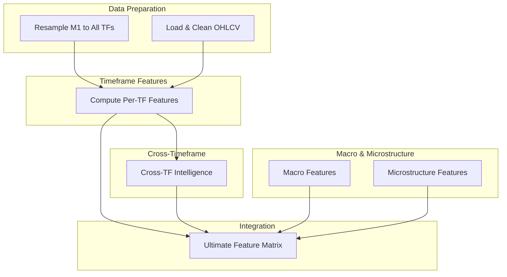
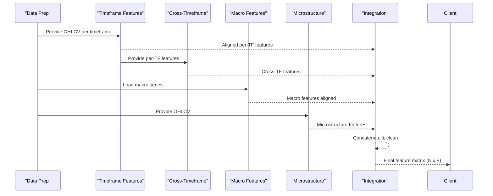
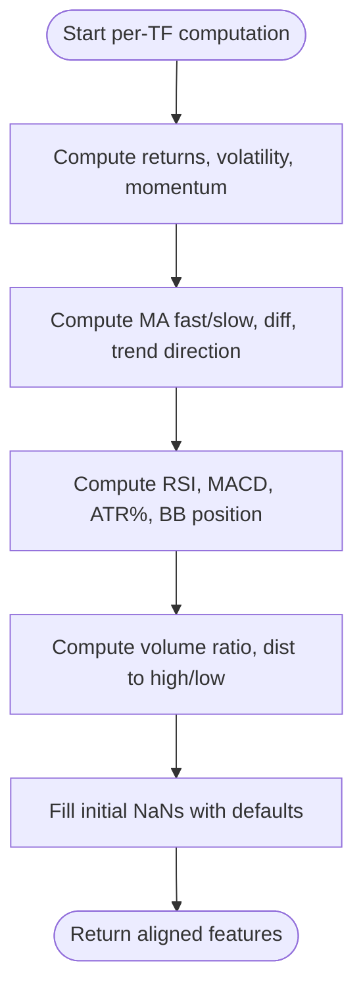
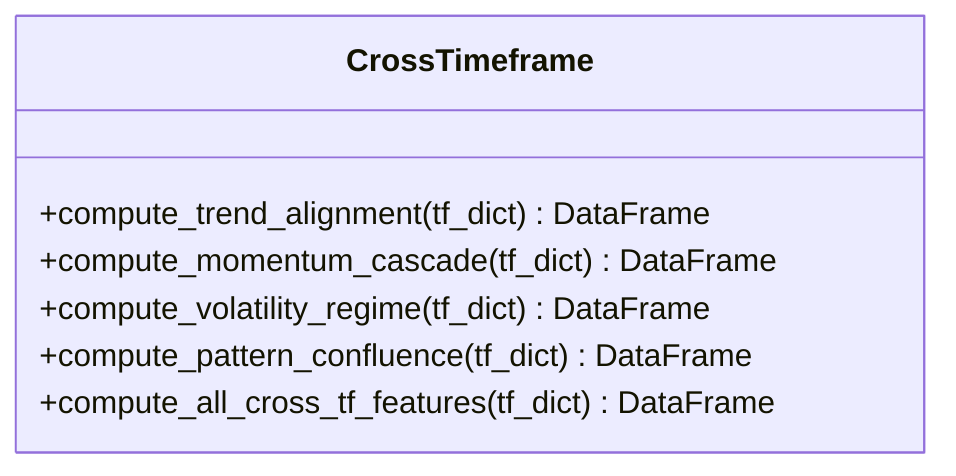
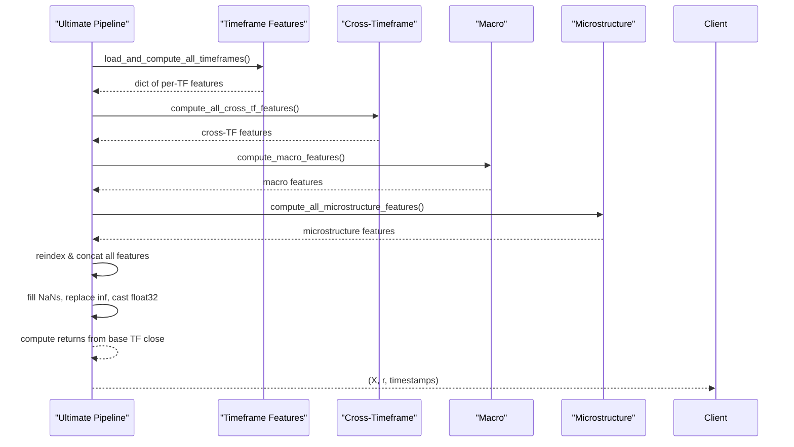
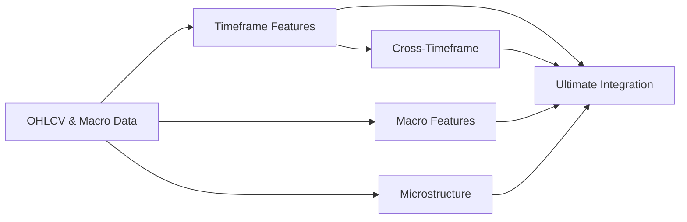

# Multi-Timeframe Analysis

<cite>
**Referenced Files in This Document**
- [multi_timeframe.py](file://features/multi_timeframe.py)
- [timeframe_features.py](file://features/timeframe_features.py)
- [cross_timeframe.py](file://features/cross_timeframe.py)
- [ultimate_150_features.py](file://features/ultimate_150_features.py)
- [microstructure_features.py](file://features/microstructure_features.py)
- [macro_features.py](file://features/macro_features.py)
- [resample_m1_to_all_timeframes.py](file://scripts/resample_m1_to_all_timeframes.py)
- [load_data.py](file://data/load_data.py)
</cite>

## Table of Contents
1. Introduction
2. Project Structure
3. Core Components
4. Architecture Overview
5. Detailed Component Analysis
6. Dependency Analysis
7. Performance Considerations
8. Troubleshooting Guide
9. Conclusion
10. Appendices

## Introduction
This document explains the multi-timeframe analysis system that computes technical indicators across six timeframes (M5, M15, H1, H4, D1, W1) to provide comprehensive market context for trading decisions. It covers how timeframe-specific features are computed (trend, momentum, volatility, volume), how cross-timeframe relationships are derived, and how everything is combined into a unified feature matrix aligned to a base timeframe. It also documents configuration options, parameter tuning, performance optimization techniques, and common issues such as data alignment, missing data handling, and computational efficiency.

## Project Structure
The multi-timeframe system is implemented as a set of modular components:
- Timeframe feature computation per timeframe
- Cross-timeframe intelligence combining multiple timeframes
- Macro and microstructure features integrated with timeframe features
- A master pipeline that combines all sources into a final feature matrix
- Data preparation utilities to resample and align OHLCV data

**Diagram sources**
- [resample_m1_to_all_timeframes.py:61-88](file://scripts/resample_m1_to_all_timeframes.py#L61-L88)
- [load_data.py:5-73](file://data/load_data.py#L5-L73)
- [timeframe_features.py:22-99](file://features/timeframe_features.py#L22-L99)
- [cross_timeframe.py:205-249](file://features/cross_timeframe.py#L205-L249)
- [macro_features.py:363-445](file://features/macro_features.py#L363-L445)
- [microstructure_features.py:170-225](file://features/microstructure_features.py#L170-L225)
- [ultimate_150_features.py:27-226](file://features/ultimate_150_features.py#L27-L226)

**Section sources**
- [resample_m1_to_all_timeframes.py:1-172](file://scripts/resample_m1_to_all_timeframes.py#L1-L172)
- [load_data.py:1-84](file://data/load_data.py#L1-L84)
- [timeframe_features.py:1-356](file://features/timeframe_features.py#L1-L356)
- [cross_timeframe.py:1-309](file://features/cross_timeframe.py#L1-L309)
- [macro_features.py:1-513](file://features/macro_features.py#L1-L513)
- [microstructure_features.py:1-286](file://features/microstructure_features.py#L1-L286)
- [ultimate_150_features.py:1-294](file://features/ultimate_150_features.py#L1-L294)

## Core Components
- Timeframe feature computation: Produces 16 standardized features per timeframe including price action, trend indicators, technical indicators, and volume/support-resistance metrics.
- Cross-timeframe intelligence: Derives 12 advanced features capturing trend alignment, momentum cascades, volatility regimes, and support/resistance confluence across timeframes.
- Macro features: Integrates macroeconomic series (DXY, SPX, yields, VIX, oil, BTC, EURUSD, silver/GLD) to add returns, momentum, and correlation signals.
- Microstructure features: Captures session effects, time-of-day patterns, volume profile, and liquidity regime.
- Ultimate integration: Combines all sources into a single feature matrix aligned to a chosen base timeframe (e.g., M5).

Key capabilities:
- Supports M5, M15, H1, H4, D1, and optionally W1.
- Aligns all features to a base timeframe using forward-fill for higher timeframes.
- Provides robust handling of missing data and NaNs.
- Offers configurable parameters for moving averages, periods, and thresholds.

**Section sources**
- [timeframe_features.py:22-99](file://features/timeframe_features.py#L22-L99)
- [cross_timeframe.py:21-203](file://features/cross_timeframe.py#L21-L203)
- [macro_features.py:363-445](file://features/macro_features.py#L363-L445)
- [microstructure_features.py:170-225](file://features/microstructure_features.py#L170-L225)
- [ultimate_150_features.py:27-226](file://features/ultimate_150_features.py#L27-L226)

## Architecture Overview
The system follows a layered architecture:
- Data ingestion and cleaning: Standardizes OHLCV formats and ensures valid ranges.
- Resampling: Converts high-resolution M1 data into multiple lower-frequency timeframes.
- Feature computation: Computes timeframe-specific indicators and cross-timeframe relationships.
- Integration: Combines timeframe, cross-timeframe, macro, calendar, and microstructure features into a unified matrix aligned to a base timeframe.

**Diagram sources**
- [timeframe_features.py:207-304](file://features/timeframe_features.py#L207-L304)
- [cross_timeframe.py:205-249](file://features/cross_timeframe.py#L205-L249)
- [macro_features.py:363-445](file://features/macro_features.py#L363-L445)
- [microstructure_features.py:170-225](file://features/microstructure_features.py#L170-L225)
- [ultimate_150_features.py:119-174](file://features/ultimate_150_features.py#L119-L174)

## Detailed Component Analysis

### Timeframe-Specific Feature Computation
Computes 16 features per timeframe:
- Price action: return, volatility (rolling std), momentum at 5/10/20 periods
- Trend indicators: fast/slow moving averages, normalized difference, trend direction
- Technical indicators: RSI (normalized), MACD histogram normalized by price, ATR as % of price, Bollinger Band position
- Volume and S/R: volume ratio vs rolling average, distance to recent high/low

Configuration and parameter tuning:
- Moving average windows can be adjusted per timeframe via helper functions or by modifying the function logic.
- Indicator periods (RSI, MACD, ATR, BB) are parameterized and can be tuned for different assets or regimes.
- Thresholds for support/resistance proximity can be adjusted to reflect asset-specific behavior.

Alignment and missing data:
- Higher timeframe features are forward-filled to match the base timeframe index.
- Initial NaNs from rolling calculations are filled with sensible defaults (e.g., neutral values).

Performance considerations:
- Vectorized pandas operations minimize overhead.
- Rolling windows are sized appropriately to balance responsiveness and stability.

**Diagram sources**
- [timeframe_features.py:22-99](file://features/timeframe_features.py#L22-L99)

**Section sources**
- [timeframe_features.py:22-99](file://features/timeframe_features.py#L22-L99)
- [timeframe_features.py:102-178](file://features/timeframe_features.py#L102-L178)
- [timeframe_features.py:207-233](file://features/timeframe_features.py#L207-L233)

### Cross-Timeframe Intelligence
Derives 12 advanced features across timeframes:
- Trend alignment: overall agreement, cascade strength, divergence
- Momentum cascade: interactions between higher and lower timeframes (e.g., D1×H1, H4×H1, H1×M15)
- Volatility regime: current vs long-term volatility, spikes, compression
- Pattern confluence: support/resistance confluence and breakout alignment

Implementation highlights:
- Uses per-timeframe trend and momentum columns to compute aggregated signals.
- Employs simple yet effective heuristics (averages, products, counts) to capture hierarchical market dynamics.
- Robust to missing timeframes by defaulting to neutral values when data is unavailable.

**Diagram sources**
- [cross_timeframe.py:21-203](file://features/cross_timeframe.py#L21-L203)
- [cross_timeframe.py:205-249](file://features/cross_timeframe.py#L205-L249)

**Section sources**
- [cross_timeframe.py:21-203](file://features/cross_timeframe.py#L21-L203)
- [cross_timeframe.py:205-249](file://features/cross_timeframe.py#L205-L249)

### Macro and Microstructure Features
- Macro features integrate eight external series to provide returns, momentum, and correlations with gold. They handle timezone normalization and align daily series back to intraday timestamps via forward-fill.
- Microstructure features capture session effects (Asian/London/NY/overlap), time-based seasonality, volume profile, and liquidity regime proxies.

These modules plug into the ultimate integration step to enrich the feature matrix beyond pure price/volume signals.

**Section sources**
- [macro_features.py:363-445](file://features/macro_features.py#L363-L445)
- [microstructure_features.py:170-225](file://features/microstructure_features.py#L170-L225)

### Ultimate Integration Pipeline
Combines all feature sources into a single matrix:
- Loads timeframe features across M5/M15/H1/H4/D1/W1
- Computes cross-timeframe features
- Adds macro and microstructure features
- Aligns all features to a base timeframe (default M5) using forward-fill
- Cleans NaNs and infinities, converts to float32 for memory efficiency
- Computes target returns from base timeframe close prices

Output:
- Feature matrix X of shape (N, 152+)
- Returns vector r of shape (N,)
- Timestamps index for each sample

**Diagram sources**
- [ultimate_150_features.py:27-226](file://features/ultimate_150_features.py#L27-L226)
- [timeframe_features.py:236-304](file://features/timeframe_features.py#L236-L304)
- [cross_timeframe.py:205-249](file://features/cross_timeframe.py#L205-L249)
- [macro_features.py:363-445](file://features/macro_features.py#L363-L445)
- [microstructure_features.py:170-225](file://features/microstructure_features.py#L170-L225)

**Section sources**
- [ultimate_150_features.py:27-226](file://features/ultimate_150_features.py#L27-L226)

### Data Alignment Across Timeframes
- Base timeframe selection: The system aligns all features to a chosen base timeframe (commonly M5).
- Forward-fill strategy: Higher timeframe features are forward-filled to match the base index, preserving temporal consistency.
- Optional W1: If weekly data is not available, it is skipped gracefully.

Common pitfalls addressed:
- Missing files: Required files raise errors; optional ones (like W1) are skipped with warnings.
- Timezone handling: Macro series are normalized to timezone-naive UTC before alignment.
- Index sorting: Data is sorted and deduplicated to ensure consistent ordering.

**Section sources**
- [timeframe_features.py:207-233](file://features/timeframe_features.py#L207-L233)
- [timeframe_features.py:236-304](file://features/timeframe_features.py#L236-L304)
- [macro_features.py:78-111](file://features/macro_features.py#L78-L111)
- [load_data.py:5-73](file://data/load_data.py#L5-L73)

### Configuration Options and Parameter Tuning
- Timeframe selection: Configure which timeframes to include (M5, M15, H1, H4, D1, W1). Some modules allow custom lists; others use fixed sets but skip missing data gracefully.
- Indicator periods: Adjust RSI, MACD, ATR, and Bollinger Band periods to suit asset characteristics and training horizons.
- Moving average windows: Tune fast/slow MA windows per timeframe to capture appropriate trends.
- Thresholds: Modify support/resistance proximity thresholds and volatility spike/compression thresholds based on historical behavior.

Where to adjust:
- Timeframe-specific windows and indicator periods are defined within the respective computation functions.
- Cross-timeframe thresholds and aggregation methods can be tuned to emphasize certain regimes.

**Section sources**
- [timeframe_features.py:52-78](file://features/timeframe_features.py#L52-L78)
- [timeframe_features.py:102-178](file://features/timeframe_features.py#L102-L178)
- [cross_timeframe.py:105-203](file://features/cross_timeframe.py#L105-L203)

### Concrete Examples of Feature Computation and Combination
- Compute per-timeframe features for M5, M15, H1, H4, D1, and optionally W1 using the timeframe module.
- Derive cross-timeframe features by aggregating trends, momentum, volatility, and support/resistance signals across timeframes.
- Add macro and microstructure features to capture broader market context and intraday patterns.
- Align all features to the base timeframe (e.g., M5) and concatenate into a single matrix.
- Clean data (fill NaNs, replace infinities), convert to float32, and compute target returns from base timeframe close prices.

Result:
- A comprehensive feature matrix ready for model training, with rich multi-timeframe context and macro/microstructure signals.

**Section sources**
- [timeframe_features.py:236-304](file://features/timeframe_features.py#L236-L304)
- [cross_timeframe.py:205-249](file://features/cross_timeframe.py#L205-L249)
- [macro_features.py:363-445](file://features/macro_features.py#L363-L445)
- [microstructure_features.py:170-225](file://features/microstructure_features.py#L170-L225)
- [ultimate_150_features.py:119-174](file://features/ultimate_150_features.py#L119-L174)

## Dependency Analysis
The system exhibits clear separation of concerns with minimal coupling:
- Timeframe features depend only on OHLCV data and standard indicator libraries.
- Cross-timeframe features depend on outputs from timeframe features.
- Macro features depend on external series and perform timezone normalization.
- Microstructure features depend on OHLCV and datetime index.
- Ultimate integration orchestrates all modules and handles alignment and cleanup.

Potential circular dependencies: None observed; modules import each other only in test scripts or via the integration layer.

External integrations:
- CSV loaders for OHLCV and macro series
- Pandas/numpy for vectorized computations

**Diagram sources**
- [timeframe_features.py:236-304](file://features/timeframe_features.py#L236-L304)
- [cross_timeframe.py:205-249](file://features/cross_timeframe.py#L205-L249)
- [macro_features.py:363-445](file://features/macro_features.py#L363-L445)
- [microstructure_features.py:170-225](file://features/microstructure_features.py#L170-L225)
- [ultimate_150_features.py:119-174](file://features/ultimate_150_features.py#L119-L174)

**Section sources**
- [ultimate_150_features.py:27-226](file://features/ultimate_150_features.py#L27-L226)

## Performance Considerations
- Vectorization: Heavy use of pandas rolling and ewm operations for efficient computation.
- Memory efficiency: Final feature matrix is cast to float32 to reduce memory footprint.
- Forward-fill alignment: Minimizes expensive joins by reindexing with method='ffill'.
- Optional timeframes: Skipping W1 if not present avoids unnecessary processing.
- Resampling strategy: Efficient aggregation rules for OHLCV resampling from M1 to higher timeframes.

Recommendations:
- Use M5 as base timeframe for faster training while retaining multi-timeframe context.
- Precompute and cache intermediate features if running repeated experiments.
- Monitor memory usage during concatenation; consider chunked processing for very large datasets.

[No sources needed since this section provides general guidance]

## Troubleshooting Guide
Common issues and resolutions:
- Missing data files: Ensure required OHLCV files exist; optional W1 can be skipped.
- Timezone mismatches: Macro series are normalized to timezone-naive UTC; verify input indices are proper DatetimeIndex.
- NaNs and infinities: System fills NaNs with defaults and replaces infinities; check logs for counts and investigate extreme outliers.
- Invalid OHLC: Loader validates high >= max(open, close, low) and low <= min(open, close, low); correct data if validation fails.
- Alignment artifacts: Forward-fill may propagate stale higher timeframe values; validate that base timeframe has sufficient coverage.

Operational tips:
- Run test functions in each module to verify correctness before full pipeline execution.
- Inspect logs for feature counts and NaN/inf statistics to detect anomalies early.

**Section sources**
- [timeframe_features.py:236-304](file://features/timeframe_features.py#L236-L304)
- [macro_features.py:78-111](file://features/macro_features.py#L78-L111)
- [load_data.py:55-73](file://data/load_data.py#L55-L73)
- [ultimate_150_features.py:156-174](file://features/ultimate_150_features.py#L156-L174)

## Conclusion
The multi-timeframe analysis system provides a robust, modular framework for computing comprehensive market context across six timeframes. By combining timeframe-specific indicators, cross-timeframe intelligence, macroeconomic signals, and microstructure features, it produces a rich feature matrix aligned to a base timeframe. The system is designed for configurability, performance, and reliability, with careful handling of data alignment, missing values, and computational efficiency. Users can tune parameters to suit their assets and strategies while leveraging a scalable pipeline suitable for training advanced models.

[No sources needed since this section summarizes without analyzing specific files]

## Appendices

### Appendix A: Timeframe-Specific Feature Summary
- Price Action: returns, volatility, momentum at multiple horizons
- Trend: fast/slow MA, normalized difference, directional signal
- Technical: RSI, MACD histogram normalized, ATR as % price, BB position
- Volume/SR: volume ratio, distances to recent high/low

**Section sources**
- [timeframe_features.py:22-99](file://features/timeframe_features.py#L22-L99)

### Appendix B: Cross-Timeframe Feature Summary
- Trend alignment: agreement, cascade strength, divergence
- Momentum cascade: pairwise interactions across timeframes
- Volatility regime: current vs long-term, spikes, compression
- Pattern confluence: support/resistance confluence, breakout alignment

**Section sources**
- [cross_timeframe.py:21-203](file://features/cross_timeframe.py#L21-L203)

### Appendix C: Data Resampling and Loading
- Resample M1 to M5/M15/H1/H4/D1 using OHLCV aggregation rules
- Load and clean OHLCV with standardized column names and validation

**Section sources**
- [resample_m1_to_all_timeframes.py:61-88](file://scripts/resample_m1_to_all_timeframes.py#L61-L88)
- [load_data.py:5-73](file://data/load_data.py#L5-L73)