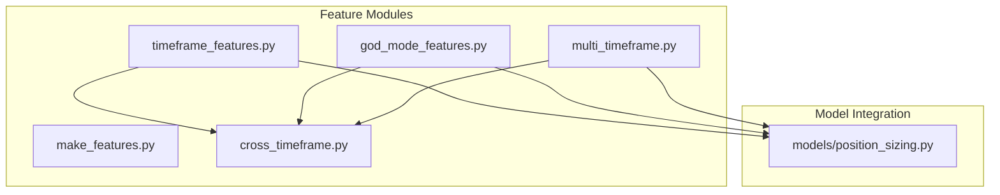
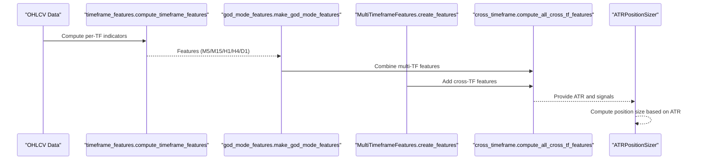
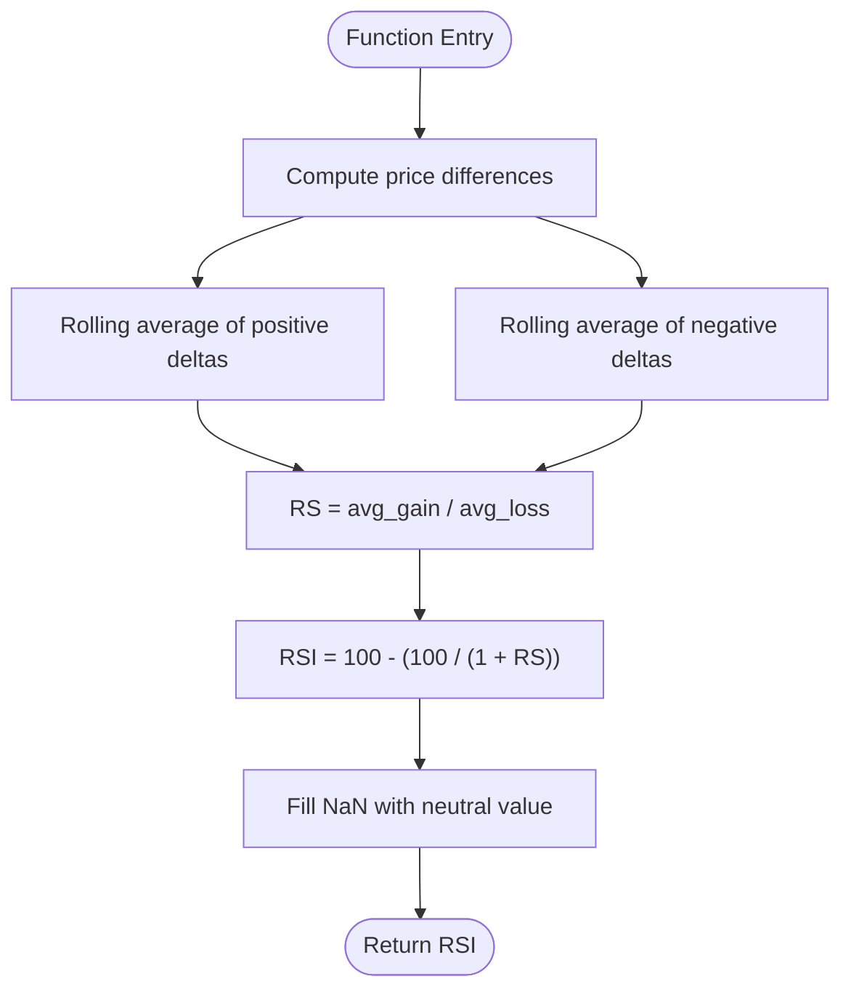
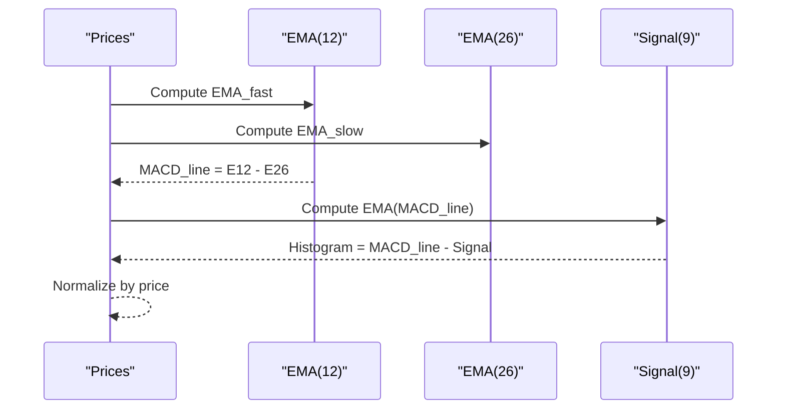
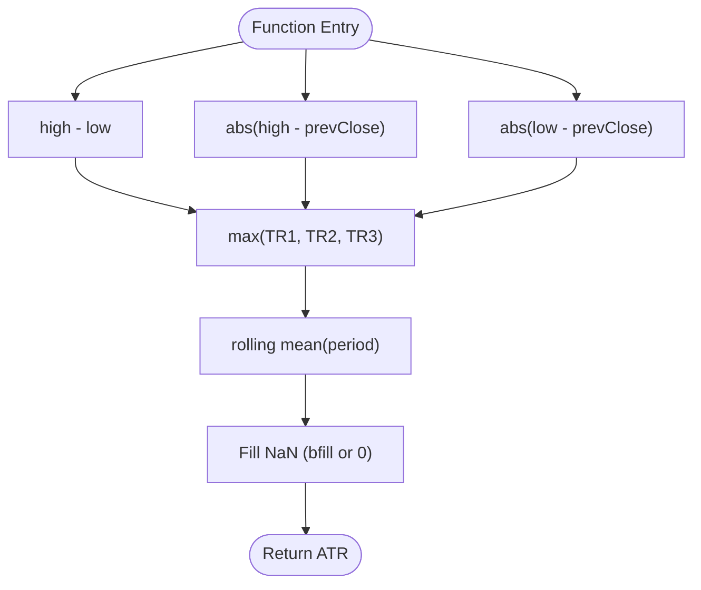
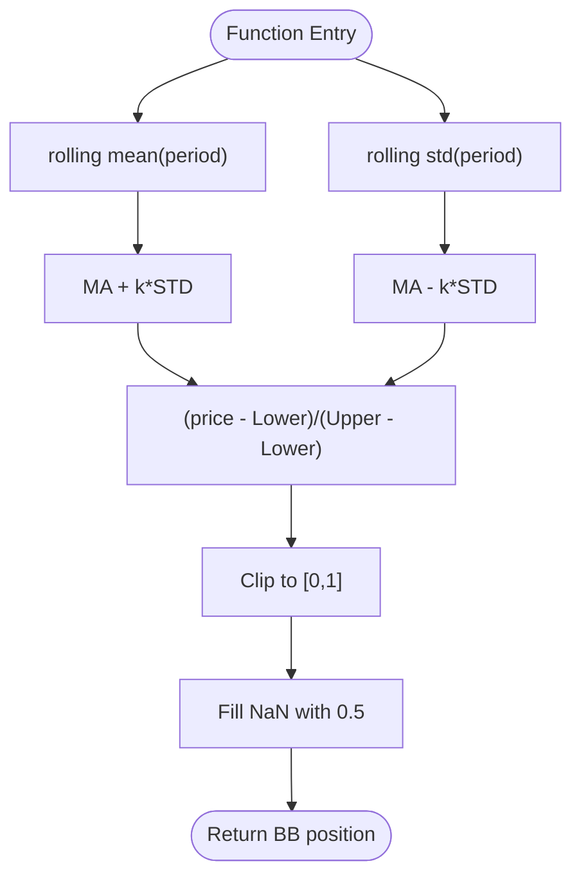
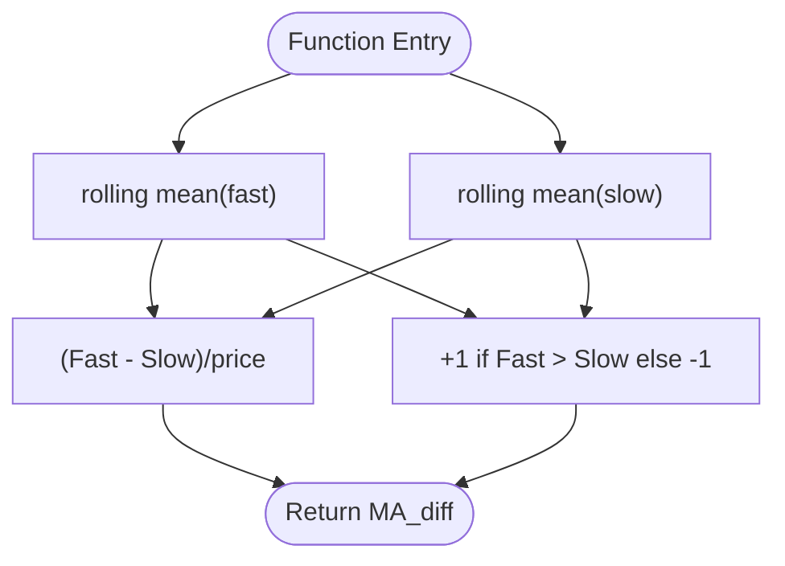
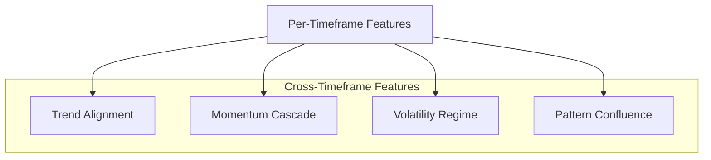
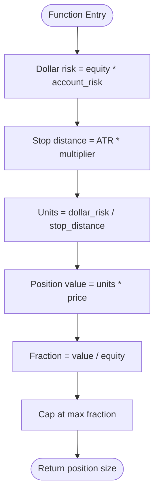
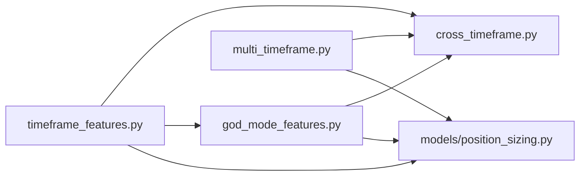

# Technical Indicators Library

<cite>
**Referenced Files in This Document**
- [README.md](file://README.md)
- [timeframe_features.py](file://features/timeframe_features.py)
- [god_mode_features.py](file://features/god_mode_features.py)
- [multi_timeframe.py](file://features/multi_timeframe.py)
- [make_features.py](file://features/make_features.py)
- [cross_timeframe.py](file://features/cross_timeframe.py)
- [position_sizing.py](file://models/position_sizing.py)
</cite>

## Table of Contents
1. [Introduction](#introduction)
2. [Project Structure](#project-structure)
3. [Core Components](#core-components)
4. [Architecture Overview](#architecture-overview)
5. [Detailed Component Analysis](#detailed-component-analysis)
6. [Dependency Analysis](#dependency-analysis)
7. [Performance Considerations](#performance-considerations)
8. [Troubleshooting Guide](#troubleshooting-guide)
9. [Conclusion](#conclusion)
10. [Appendices](#appendices)

## Introduction
This document provides comprehensive technical documentation for the technical indicators library used across multiple modules to compute trend-following, momentum, volatility, and volume-based features for a multi-timeframe trading system. It explains mathematical formulations, parameter configurations, trading interpretations, code-level integration points, performance optimizations, and common pitfalls such as indicator lag, overfitting, and normalization strategies. The library supports 96+ indicators conceptually (as described in project documentation) and implements key components including RSI, MACD, ATR, Bollinger Bands position, moving averages, momentum, and cross-timeframe synthesis.

## Project Structure
The indicators are implemented primarily under the features package with supporting modules:
- timeframe_features.py: Single-timeframe feature computation (RSI, MACD, ATR, Bollinger Bands position, moving averages, momentum).
- god_mode_features.py: Aggregated “God Mode” features combining multi-timeframe, macro correlations, and calendar awareness.
- multi_timeframe.py: MultiTimeframeFeatures class computing per-timeframe indicators and cross-timeframe features.
- make_features.py: Simple pipeline computing core indicators and normalizing features for modeling.
- cross_timeframe.py: Advanced cross-timeframe intelligence (trend alignment, momentum cascade, volatility regime, pattern confluence).
- models/position_sizing.py: ATR-based position sizing using computed volatility.

**Diagram sources**
- [timeframe_features.py:22-179](file://features/timeframe_features.py#L22-L179)
- [god_mode_features.py:53-131](file://features/god_mode_features.py#L53-L131)
- [multi_timeframe.py:98-156](file://features/multi_timeframe.py#L98-L156)
- [make_features.py:18-78](file://features/make_features.py#L18-L78)
- [cross_timeframe.py:21-202](file://features/cross_timeframe.py#L21-L202)
- [position_sizing.py:295-335](file://models/position_sizing.py#L295-L335)

**Section sources**
- [README.md:73-115](file://README.md#L73-L115)
- [timeframe_features.py:22-179](file://features/timeframe_features.py#L22-L179)
- [god_mode_features.py:53-131](file://features/god_mode_features.py#L53-L131)
- [multi_timeframe.py:98-156](file://features/multi_timeframe.py#L98-L156)
- [make_features.py:18-78](file://features/make_features.py#L18-L78)
- [cross_timeframe.py:21-202](file://features/cross_timeframe.py#L21-L202)
- [position_sizing.py:295-335](file://models/position_sizing.py#L295-L335)

## Core Components
This section summarizes the primary indicator categories and their implementations:

- Trend-following indicators
  - Moving Averages (fast/slow), MA difference, trend direction
  - MACD (line, signal, histogram normalized by price)
- Momentum oscillators
  - RSI (normalized to 0–1 or 0–100 depending on module)
- Volatility measures
  - ATR (absolute and percentage of price)
  - Bollinger Bands position (0–1 normalized)
- Volume-based indicators
  - Volume ratio (current vs rolling average)
  - Macro correlation features (DXY, SPX, US10Y) integrated in God Mode

Mathematical formulations and parameters:
- RSI: Uses rolling averages of gains and losses over period; returns 0–100 then often normalized to 0–1.
- MACD: Exponential moving averages (fast=12, slow=26) minus signal line (span=9); normalized by price.
- ATR: True Range computed from high-low, previous close differences; smoothed via rolling mean.
- Bollinger Bands: Rolling mean ± k*std; position = (price - lower)/(upper - lower), clipped to [0,1].
- Moving Averages: Fast and slow windows vary by timeframe; MA diff normalized by price; trend binary (+1/-1).
- Volume Ratio: Current volume divided by rolling average (e.g., 20-period).

Trading interpretations:
- RSI > 0.7 (or >70): Overbought; potential reversal down.
- RSI < 0.3 (or <30): Oversold; potential reversal up.
- MACD histogram positive/negative indicates momentum shifts; crossovers suggest trend changes.
- ATR increases indicate rising volatility; useful for stop placement and position sizing.
- BB position near 1 suggests price at upper band (overextended); near 0 suggests lower band (oversold).
- Volume spikes confirm breakouts or reversals when aligned with price action.

Code references:
- RSI implementation paths: [timeframe_features.py:102-116], [god_mode_features.py:23-34], [multi_timeframe.py:319-330], [make_features.py:6-16]
- MACD implementation paths: [timeframe_features.py:119-135], [god_mode_features.py:97-102], [make_features.py:33-39]
- ATR implementation paths: [timeframe_features.py:138-156], [god_mode_features.py:37-50], [multi_timeframe.py:332-347]
- Bollinger Bands position: [timeframe_features.py:159-178], [god_mode_features.py:108-114], [multi_timeframe.py:139-145]
- Moving Averages and trend: [timeframe_features.py:52-64], [god_mode_features.py:75-92], [multi_timeframe.py:120-130]
- Volume ratio: [timeframe_features.py:82-84], [god_mode_features.py:116-122], [multi_timeframe.py:147-154]

**Section sources**
- [timeframe_features.py:52-178](file://features/timeframe_features.py#L52-L178)
- [god_mode_features.py:23-131](file://features/god_mode_features.py#L23-L131)
- [multi_timeframe.py:120-156](file://features/multi_timeframe.py#L120-L156)
- [make_features.py:6-39](file://features/make_features.py#L6-L39)

## Architecture Overview
The indicator engine is modular:
- Per-timeframe computation produces standardized features (returns, volatility, momentum, MAs, RSI, MACD, ATR, BB position, volume ratios).
- Cross-timeframe synthesis aggregates these into higher-order features (trend alignment, momentum cascade, volatility regime, support/resistance confluence).
- God Mode integrates macro correlations and economic calendar awareness.
- Position sizing uses ATR to dynamically adjust exposure.

**Diagram sources**
- [timeframe_features.py:22-99](file://features/timeframe_features.py#L22-L99)
- [god_mode_features.py:291-379](file://features/god_mode_features.py#L291-L379)
- [multi_timeframe.py:55-96](file://features/multi_timeframe.py#L55-L96)
- [cross_timeframe.py:205-249](file://features/cross_timeframe.py#L205-L249)
- [position_sizing.py:295-335](file://models/position_sizing.py#L295-L335)

**Section sources**
- [timeframe_features.py:22-99](file://features/timeframe_features.py#L22-L99)
- [god_mode_features.py:291-379](file://features/god_mode_features.py#L291-L379)
- [multi_timeframe.py:55-96](file://features/multi_timeframe.py#L55-L96)
- [cross_timeframe.py:205-249](file://features/cross_timeframe.py#L205-L249)
- [position_sizing.py:295-335](file://models/position_sizing.py#L295-L335)

## Detailed Component Analysis

### RSI (Relative Strength Index)
- Mathematical formulation: Computes rolling average of gains and losses over period; RS = avg_gain / avg_loss; RSI = 100 - (100 / (1 + RS)).
- Parameters: period (default 14).
- Interpretation: Values near 0–100; normalized to 0–1 in some modules for modeling.
- Implementation highlights:
  - Handles NaNs by filling with neutral value (50 or 0.5).
  - Used across timeframes and aggregated into cross-timeframe features.

**Diagram sources**
- [timeframe_features.py:102-116](file://features/timeframe_features.py#L102-L116)
- [god_mode_features.py:23-34](file://features/god_mode_features.py#L23-L34)
- [multi_timeframe.py:319-330](file://features/multi_timeframe.py#L319-L330)
- [make_features.py:6-16](file://features/make_features.py#L6-L16)

**Section sources**
- [timeframe_features.py:102-116](file://features/timeframe_features.py#L102-L116)
- [god_mode_features.py:23-34](file://features/god_mode_features.py#L23-L34)
- [multi_timeframe.py:319-330](file://features/multi_timeframe.py#L319-L330)
- [make_features.py:6-16](file://features/make_features.py#L6-L16)

### MACD (Moving Average Convergence Divergence)
- Mathematical formulation: EMA_fast (12) - EMA_slow (26) = MACD line; Signal = EMA(MACD_line, span=9); Histogram = MACD_line - Signal; normalized by price.
- Parameters: fast=12, slow=26, signal=9.
- Interpretation: Positive histogram indicates bullish momentum; negative indicates bearish; crossovers signal trend changes.
- Implementation highlights: Normalized by price to scale across assets/timeframes.

**Diagram sources**
- [timeframe_features.py:119-135](file://features/timeframe_features.py#L119-L135)
- [god_mode_features.py:97-102](file://features/god_mode_features.py#L97-L102)
- [make_features.py:33-39](file://features/make_features.py#L33-L39)

**Section sources**
- [timeframe_features.py:119-135](file://features/timeframe_features.py#L119-L135)
- [god_mode_features.py:97-102](file://features/god_mode_features.py#L97-L102)
- [make_features.py:33-39](file://features/make_features.py#L33-L39)

### ATR (Average True Range)
- Mathematical formulation: TR = max(high-low, |high-prevClose|, |low-prevClose|); ATR = rolling mean of TR over period.
- Parameters: period (default 14).
- Interpretation: Measures volatility; used for stops and dynamic position sizing.
- Implementation highlights: Fills initial NaNs via backfill or zero fill; percentage form used for scaling.

**Diagram sources**
- [timeframe_features.py:138-156](file://features/timeframe_features.py#L138-L156)
- [god_mode_features.py:37-50](file://features/god_mode_features.py#L37-L50)
- [multi_timeframe.py:332-347](file://features/multi_timeframe.py#L332-L347)

**Section sources**
- [timeframe_features.py:138-156](file://features/timeframe_features.py#L138-L156)
- [god_mode_features.py:37-50](file://features/god_mode_features.py#L37-L50)
- [multi_timeframe.py:332-347](file://features/multi_timeframe.py#L332-L347)

### Bollinger Bands Position
- Mathematical formulation: MA = rolling mean(period); Std = rolling std(period); Upper = MA + k*Std; Lower = MA - k*Std; Position = (price - Lower)/(Upper - Lower), clipped to [0,1].
- Parameters: period (default 20), num_std (default 2).
- Interpretation: Near 1 implies overbought; near 0 implies oversold; 0.5 is middle band.
- Implementation highlights: Clipping ensures bounded feature for modeling stability.

**Diagram sources**
- [timeframe_features.py:159-178](file://features/timeframe_features.py#L159-L178)
- [god_mode_features.py:108-114](file://features/god_mode_features.py#L108-L114)
- [multi_timeframe.py:139-145](file://features/multi_timeframe.py#L139-L145)

**Section sources**
- [timeframe_features.py:159-178](file://features/timeframe_features.py#L159-L178)
- [god_mode_features.py:108-114](file://features/god_mode_features.py#L108-L114)
- [multi_timeframe.py:139-145](file://features/multi_timeframe.py#L139-L145)

### Moving Averages and Trend Direction
- Mathematical formulation: Fast MA and Slow MA; MA_diff = (Fast - Slow)/price; trend = +1 if Fast > Slow else -1.
- Parameters: Windows vary by timeframe (e.g., H1 fast=24, slow=120).
- Interpretation: Trend direction and strength; divergence between fast and slow MAs indicates momentum shifts.
- Implementation highlights: Timeframe-specific windows ensure consistent behavior across scales.

**Diagram sources**
- [timeframe_features.py:52-64](file://features/timeframe_features.py#L52-L64)
- [god_mode_features.py:75-92](file://features/god_mode_features.py#L75-L92)
- [multi_timeframe.py:120-130](file://features/multi_timeframe.py#L120-L130)

**Section sources**
- [timeframe_features.py:52-64](file://features/timeframe_features.py#L52-L64)
- [god_mode_features.py:75-92](file://features/god_mode_features.py#L75-L92)
- [multi_timeframe.py:120-130](file://features/multi_timeframe.py#L120-L130)

### Volume-Based Features
- Mathematical formulation: Volume_ratio = current_volume / rolling_average(volume).
- Parameters: Rolling window (e.g., 20).
- Interpretation: Spikes in volume confirm breakouts or reversals; sustained high volume supports trend continuation.
- Implementation highlights: Graceful handling when volume column missing; defaults to neutral values.

**Section sources**
- [timeframe_features.py:82-84](file://features/timeframe_features.py#L82-L84)
- [god_mode_features.py:116-122](file://features/god_mode_features.py#L116-L122)
- [multi_timeframe.py:147-154](file://features/multi_timeframe.py#L147-L154)

### Cross-Timeframe Intelligence
- Trend Alignment: Average of trends across timeframes; captures agreement/divergence.
- Momentum Cascade: Product of momentum across adjacent timeframes (e.g., D1×H1, H4×H1).
- Volatility Regime: Ratio of short-term to long-term volatility; detects spikes/compression.
- Pattern Confluence: Counts timeframes near support/resistance; breakout alignment checks directional consensus.

**Diagram sources**
- [cross_timeframe.py:21-202](file://features/cross_timeframe.py#L21-L202)
- [timeframe_features.py:22-99](file://features/timeframe_features.py#L22-L99)

**Section sources**
- [cross_timeframe.py:21-202](file://features/cross_timeframe.py#L21-L202)
- [timeframe_features.py:22-99](file://features/timeframe_features.py#L22-L99)

### Macro Correlations and Calendar Awareness (God Mode)
- Macro features: Returns and momentum for DXY, SPX, US10Y; rolling correlations with gold returns.
- Economic calendar: Hours to next event, high-impact flags, event window detection.
- Integration: Concatenated with multi-timeframe features to produce 100+ feature set.

**Section sources**
- [god_mode_features.py:194-232](file://features/god_mode_features.py#L194-L232)
- [god_mode_features.py:235-288](file://features/god_mode_features.py#L235-L288)
- [god_mode_features.py:291-379](file://features/god_mode_features.py#L291-L379)

### ATR-Based Position Sizing
- Mathematical formulation: Dollar risk = equity × account_risk; Stop distance = ATR × multiplier; Units = dollar_risk / stop_distance; Fraction = units × price / equity; capped at maximum.
- Parameters: account_risk (default 0.02), atr_multiplier (default 2.0).
- Interpretation: Larger ATR reduces position size for same risk; adapts to volatility regimes.

**Diagram sources**
- [position_sizing.py:295-335](file://models/position_sizing.py#L295-L335)

**Section sources**
- [position_sizing.py:295-335](file://models/position_sizing.py#L295-L335)

## Dependency Analysis
Indicator modules depend on pandas/numpy for vectorized computations and inter-module dependencies exist for aggregation:
- timeframe_features.py provides base indicators used by cross_timeframe.py and god_mode_features.py.
- multi_timeframe.py encapsulates per-timeframe logic and cross-timeframe synthesis.
- make_features.py offers a simplified pipeline for modeling inputs.
- position_sizing.py consumes ATR outputs for dynamic sizing.

**Diagram sources**
- [timeframe_features.py:22-179](file://features/timeframe_features.py#L22-L179)
- [cross_timeframe.py:21-202](file://features/cross_timeframe.py#L21-L202)
- [god_mode_features.py:53-131](file://features/god_mode_features.py#L53-L131)
- [multi_timeframe.py:98-156](file://features/multi_timeframe.py#L98-L156)
- [position_sizing.py:295-335](file://models/position_sizing.py#L295-L335)

**Section sources**
- [timeframe_features.py:22-179](file://features/timeframe_features.py#L22-L179)
- [cross_timeframe.py:21-202](file://features/cross_timeframe.py#L21-L202)
- [god_mode_features.py:53-131](file://features/god_mode_features.py#L53-L131)
- [multi_timeframe.py:98-156](file://features/multi_timeframe.py#L98-L156)
- [position_sizing.py:295-335](file://models/position_sizing.py#L295-L335)

## Performance Considerations
- Vectorization: All indicators use pandas rolling/ewm operations for efficient computation.
- Memory: Aligning timeframes via reindex and forward-fill minimizes duplication; avoid unnecessary copies.
- Normalization: Features are normalized (e.g., RSI to 0–1, MACD by price, BB position clipped) to stabilize training and improve model convergence.
- Parameter tuning: Use timeframe-specific windows (e.g., H1 fast/slow MAs) to reduce lag while maintaining robustness.
- Avoid overfitting: Limit hyperparameter search space; prefer parsimonious combinations and cross-validation.

[No sources needed since this section provides general guidance]

## Troubleshooting Guide
Common issues and resolutions:
- NaN propagation: Ensure proper fillna/bfill strategies for early periods; check default fills (e.g., RSI neutral, BB position mid-band).
- Missing columns: Handle optional volume columns gracefully; fallback to neutral values.
- Misaligned timeframes: Use align_timeframes or reindex with ffill to synchronize series before concatenation.
- Indicator lag: Adjust rolling windows appropriately; shorter windows increase responsiveness but may increase noise.
- Over-optimization: Validate out-of-sample; avoid excessive parameter tuning that fits noise.

**Section sources**
- [timeframe_features.py:94-99](file://features/timeframe_features.py#L94-L99)
- [god_mode_features.py:116-122](file://features/god_mode_features.py#L116-L122)
- [multi_timeframe.py:351-396](file://features/multi_timeframe.py#L351-L396)
- [cross_timeframe.py:234-236](file://features/cross_timeframe.py#L234-L236)

## Conclusion
The technical indicators library provides a robust, modular foundation for multi-timeframe feature engineering, integrating trend, momentum, volatility, and volume signals with macro awareness and cross-timeframe synthesis. Implementations emphasize normalization, scalability, and practical trading interpretations. Proper parameter selection, careful handling of NaNs, and disciplined validation against overfitting are essential for reliable deployment.

[No sources needed since this section summarizes without analyzing specific files]

## Appendices
- Usage examples and integration patterns can be found in module docstrings and test blocks within each file.
- For advanced combinations, refer to cross_timeframe.py functions for trend alignment, momentum cascade, volatility regime, and pattern confluence.
- For macro integration and calendar awareness, see god_mode_features.py.

[No sources needed since this section provides general guidance]