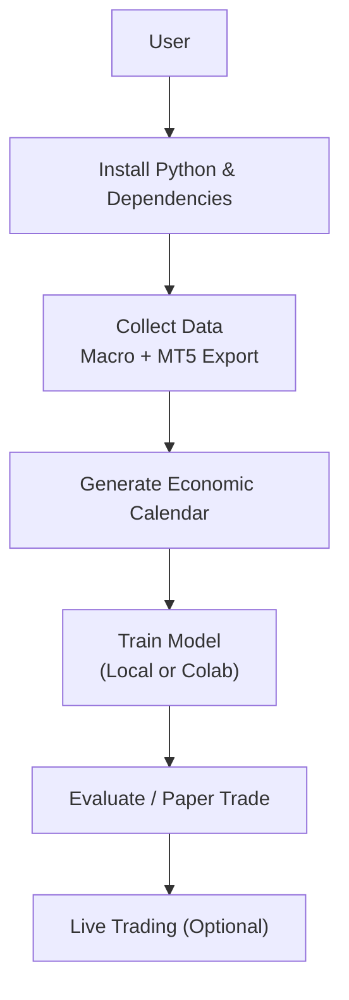
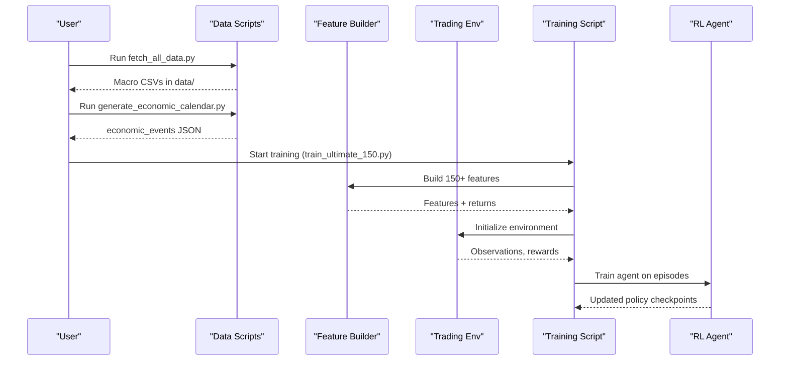
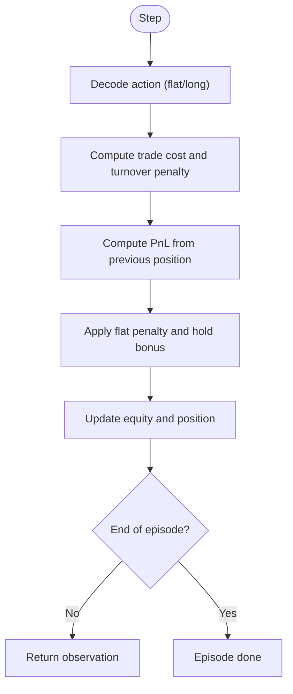
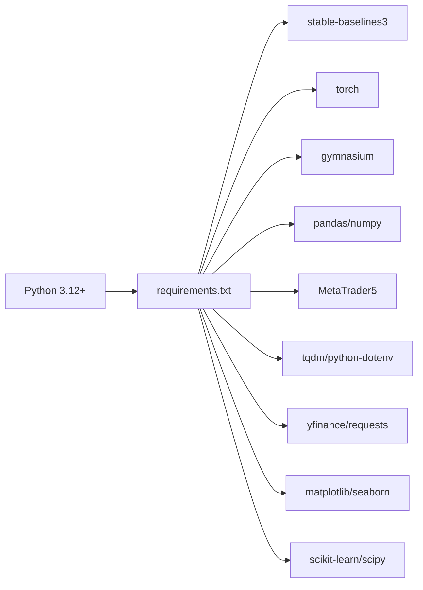

# Getting Started Guide

<cite>
**Referenced Files in This Document**
- [README.md](file://README.md)
- [requirements.txt](file://requirements.txt)
- [scripts/fetch_all_data.py](file://scripts/fetch_all_data.py)
- [scripts/generate_economic_calendar.py](file://scripts/generate_economic_calendar.py)
- [COLAB_TRAINING_GUIDE.md](file://COLAB_TRAINING_GUIDE.md)
- [SECURITY.md](file://SECURITY.md)
- [train/train_ultimate_150.py](file://train/train_ultimate_150.py)
- [data/load_data.py](file://data/load_data.py)
- [env/xauusd_env.py](file://env/xauusd_env.py)
</cite>

## Table of Contents
1. Introduction
2. Project Structure
3. Core Components
4. Architecture Overview
5. Detailed Component Analysis
6. Dependency Analysis
7. Performance Considerations
8. Troubleshooting Guide
9. Conclusion
10. Appendices

## Introduction
This guide helps you set up and run the autonomous trading AI system for XAUUSD (gold). It covers installation, data preparation, environment configuration, training workflows (local and Google Colab), and verification steps to ensure everything is working correctly before live trading.

## Project Structure
At a high level:
- Data scripts fetch macro data and generate economic calendars.
- Training scripts build features and train RL agents.
- Environments define the trading simulation used during training.
- Utilities load and validate OHLC data from MetaTrader 5 exports.

[No sources needed since this diagram shows conceptual workflow, not actual code structure]

## Core Components
- Requirements and dependencies are defined in requirements.txt.
- Data collection utilities:
  - scripts/fetch_all_data.py downloads macro datasets from free sources.
  - scripts/generate_economic_calendar.py creates a JSON calendar of major USD events.
- Training entry point:
  - train/train_ultimate_150.py orchestrates feature creation and DreamerV3 training with 150+ features.
- Environment:
  - env/xauusd_env.py defines a Gymnasium-based long-only trading environment.
- Data loading:
  - data/load_data.py standardizes MT5 CSV exports into a consistent schema.

Key setup prerequisites:
- Python 3.12+
- MetaTrader 5 (for exporting XAUUSD history; required only if you plan to use MT5 data or live trading)
- Dependencies installed via requirements.txt

**Section sources**
- [requirements.txt:1-29](file://requirements.txt#L1-L29)
- [scripts/fetch_all_data.py:1-233](file://scripts/fetch_all_data.py#L1-L233)
- [scripts/generate_economic_calendar.py:1-310](file://scripts/generate_economic_calendar.py#L1-L310)
- [train/train_ultimate_150.py:1-200](file://train/train_ultimate_150.py#L1-L200)
- [env/xauusd_env.py:1-118](file://env/xauusd_env.py#L1-L118)
- [data/load_data.py:1-84](file://data/load_data.py#L1-L84)

## Architecture Overview
The system follows a pipeline:
- Data ingestion: macro series and MT5 XAUUSD OHLC.
- Feature engineering: multi-timeframe indicators, macro correlations, calendar features.
- RL training: agent learns policies using environments that simulate trading with costs and penalties.
- Evaluation and deployment: backtesting, paper trading, and optional live execution via MT5 or cloud APIs.

**Diagram sources**
- [scripts/fetch_all_data.py:131-214](file://scripts/fetch_all_data.py#L131-L214)
- [scripts/generate_economic_calendar.py:231-283](file://scripts/generate_economic_calendar.py#L231-L283)
- [train/train_ultimate_150.py:154-200](file://train/train_ultimate_150.py#L154-L200)
- [env/xauusd_env.py:21-118](file://env/xauusd_env.py#L21-L118)

## Detailed Component Analysis

### Installation and Setup
- Install Python 3.12+.
- Clone the repository and create a virtual environment.
- Activate the environment and install dependencies from requirements.txt.
- Verify core packages import successfully (e.g., torch, stable-baselines3, gymnasium, MetaTrader5, pandas, numpy).

What gets installed (selected):
- Deep reinforcement learning libraries (stable-baselines3, torch, gymnasium)
- Data processing (pandas, numpy)
- Platform integration (MetaTrader5)
- Utilities (tqdm, python-dotenv)
- Optional data fetching (yfinance, requests)
- Visualization (matplotlib, seaborn)
- Advanced features (scikit-learn, scipy)

**Section sources**
- [requirements.txt:1-29](file://requirements.txt#L1-L29)

### Data Collection
- Macro data:
  - Run scripts/fetch_all_data.py to download daily series such as VIX, WTI Oil, Bitcoin, EURUSD, Silver, GLD ETF, and optionally US Dollar Index.
  - Outputs are saved under data/ as CSV files.
- Economic calendar:
  - Run scripts/generate_economic_calendar.py to produce a JSON file covering scheduled USD macro events (NFP, CPI, FOMC, GDP, Retail Sales, PCE) across multiple years.
- XAUUSD from MetaTrader 5:
  - Use MT5’s History Center to export XAUUSD M5 and M15 timeframes as CSV files into data/.
  - The loader expects MT5-style columns and will normalize them into a unified schema with time, OHLC, and optional volume/spread fields.

Expected outputs:
- Macro CSVs in data/
- Economic events JSON in data/
- XAUUSD M5/M15 CSVs in data/

**Section sources**
- [scripts/fetch_all_data.py:131-214](file://scripts/fetch_all_data.py#L131-L214)
- [scripts/generate_economic_calendar.py:231-283](file://scripts/generate_economic_calendar.py#L231-L283)
- [data/load_data.py:5-73](file://data/load_data.py#L5-L73)

### Environment Configuration and Security
- Create a .env file for API keys and tokens.
- Keep .env out of version control (ensure it is ignored by git).
- Required variables include MetaAPI credentials for cloud trading; optional variables may include news APIs.
- Follow best practices: never hardcode secrets, rotate compromised keys immediately, restrict file permissions on Linux/macOS, and use separate keys for testing vs production.

Security checklist highlights:
- Use .env for local development and environment variables in production.
- Restrict access to .env.
- Test on demo accounts first.
- Enable 2FA on broker accounts.

**Section sources**
- [SECURITY.md:1-167](file://SECURITY.md#L1-L167)

### Training Workflows

#### Local Training
- Use the ultimate feature training script to train a DreamerV3 agent with 150+ features.
- Configure device (cpu, mps for Apple Silicon, cuda for NVIDIA GPUs), batch size, and total steps.
- The script builds features, splits train/validation, initializes the environment, and trains the agent while saving checkpoints.

Typical parameters:
- Steps: millions (e.g., 1,000,000)
- Batch size: adjust based on GPU memory
- Device: auto-detect or specify cpu/mps/cuda
- Base timeframe: M5/M15/H1

**Section sources**
- [train/train_ultimate_150.py:154-200](file://train/train_ultimate_150.py#L154-L200)

#### Google Colab Deployment
- Upload your project to Google Drive and open the provided notebook in Colab.
- Enable GPU runtime and follow the step-by-step cells to mount drive, install dependencies, verify data, configure parameters, and start training.
- Training resumes automatically from checkpoints after session disconnects.
- Download and validate the trained model locally after completion.

Time estimates vary by tier:
- Free (T4): longer sessions with resuming
- Pro/Pro+: faster continuous runs

**Section sources**
- [COLAB_TRAINING_GUIDE.md:1-314](file://COLAB_TRAINING_GUIDE.md#L1-L314)

### Trading Environment Details
The environment simulates long-only trading with discrete actions:
- Action 0: Flat
- Action 1: Long
Reward includes realized PnL minus trade costs, turnover penalties, flat penalty, and a small hold bonus to encourage stability.

Observation space:
- Rolling window of features flattened plus current position indicator.

Environment behavior:
- Position applied on next step to avoid look-ahead bias.
- Tracks equity and provides info for monitoring.

**Diagram sources**
- [env/xauusd_env.py:75-118](file://env/xauusd_env.py#L75-L118)

**Section sources**
- [env/xauusd_env.py:1-118](file://env/xauusd_env.py#L1-L118)

## Dependency Analysis
Core dependencies and their roles:
- stable-baselines3: RL algorithms and utilities
- torch: deep learning backend
- gymnasium: environment interface
- pandas/numpy: data manipulation
- MetaTrader5: platform integration for live trading and data
- tqdm/python-dotenv: progress bars and environment variable management
- yfinance/requests: optional data fetching
- matplotlib/seaborn: visualization
- scikit-learn/scipy: advanced analytics

**Diagram sources**
- [requirements.txt:1-29](file://requirements.txt#L1-L29)

**Section sources**
- [requirements.txt:1-29](file://requirements.txt#L1-L29)

## Performance Considerations
- Hardware acceleration:
  - Apple Silicon (MPS) or NVIDIA CUDA significantly speed up training compared to CPU.
- Batch size tuning:
  - Increase batch size for faster throughput if GPU memory allows.
- Data quality:
  - Ensure MT5 exports cover sufficient history and are properly formatted.
- Environment settings:
  - Adjust cost_per_trade, turnover_coef, and penalties to reflect realistic slippage and spreads.
- Training duration:
  - Millions of steps typically require hours to days depending on hardware.

[No sources needed since this section provides general guidance]

## Troubleshooting Guide
Common issues and resolutions:
- Missing dependencies:
  - Reinstall from requirements.txt if imports fail.
- MetaTrader 5 data errors:
  - Ensure exported CSVs have correct columns; the loader normalizes MT5 angle-bracket headers and validates OHLC consistency.
- Session disconnects (Colab):
  - Training resumes from checkpoints; re-run setup cells to reconnect and continue.
- Out-of-memory errors:
  - Reduce batch size or close other processes.
- API key issues:
  - Verify .env contents and permissions; ensure keys are not committed to git.

Verification steps:
- Import checks for core packages.
- Run data loaders to confirm MT5 CSV parsing.
- Execute a short training loop or smoke test to validate environment and device usage.

**Section sources**
- [data/load_data.py:5-73](file://data/load_data.py#L5-L73)
- [COLAB_TRAINING_GUIDE.md:163-196](file://COLAB_TRAINING_GUIDE.md#L163-L196)
- [SECURITY.md:79-111](file://SECURITY.md#L79-L111)

## Conclusion
You now have the essentials to install the system, prepare data, configure secure credentials, and train models locally or on Google Colab. Validate your setup with the provided verification steps before moving to evaluation and live trading. Always start with demo accounts and conservative risk settings when going live.

[No sources needed since this section summarizes without analyzing specific files]

## Appendices

### Quick Start Checklist
- Install Python 3.12+ and activate a virtual environment.
- Install dependencies from requirements.txt.
- Collect macro data using scripts/fetch_all_data.py.
- Generate economic calendar using scripts/generate_economic_calendar.py.
- Export XAUUSD M5/M15 from MetaTrader 5 into data/.
- Configure .env with API keys and ensure it is ignored by git.
- Train using train/train_ultimate_150.py (local) or the Colab notebook.
- Evaluate and paper trade before considering live deployment.

**Section sources**
- [README.md:219-361](file://README.md#L219-L361)
- [scripts/fetch_all_data.py:131-214](file://scripts/fetch_all_data.py#L131-L214)
- [scripts/generate_economic_calendar.py:231-283](file://scripts/generate_economic_calendar.py#L231-L283)
- [SECURITY.md:23-68](file://SECURITY.md#L23-L68)
- [train/train_ultimate_150.py:154-200](file://train/train_ultimate_150.py#L154-L200)
- [COLAB_TRAINING_GUIDE.md:65-110](file://COLAB_TRAINING_GUIDE.md#L65-L110)