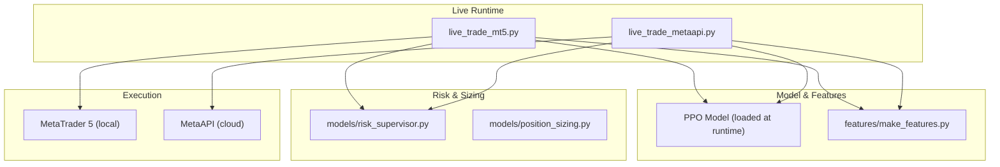
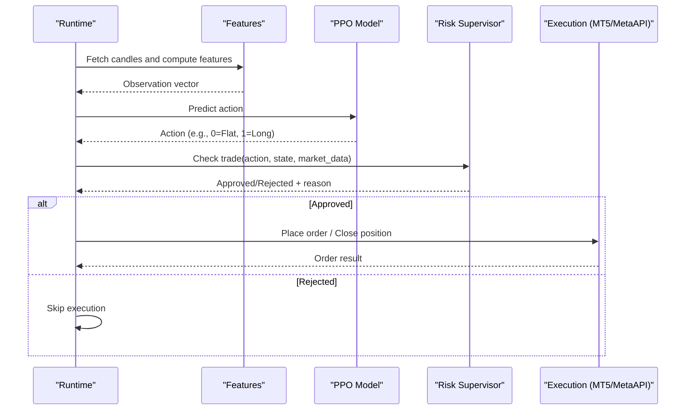
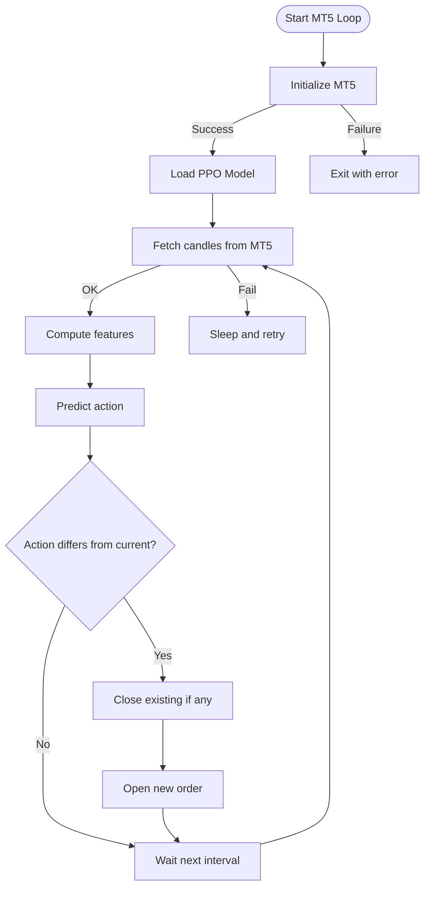
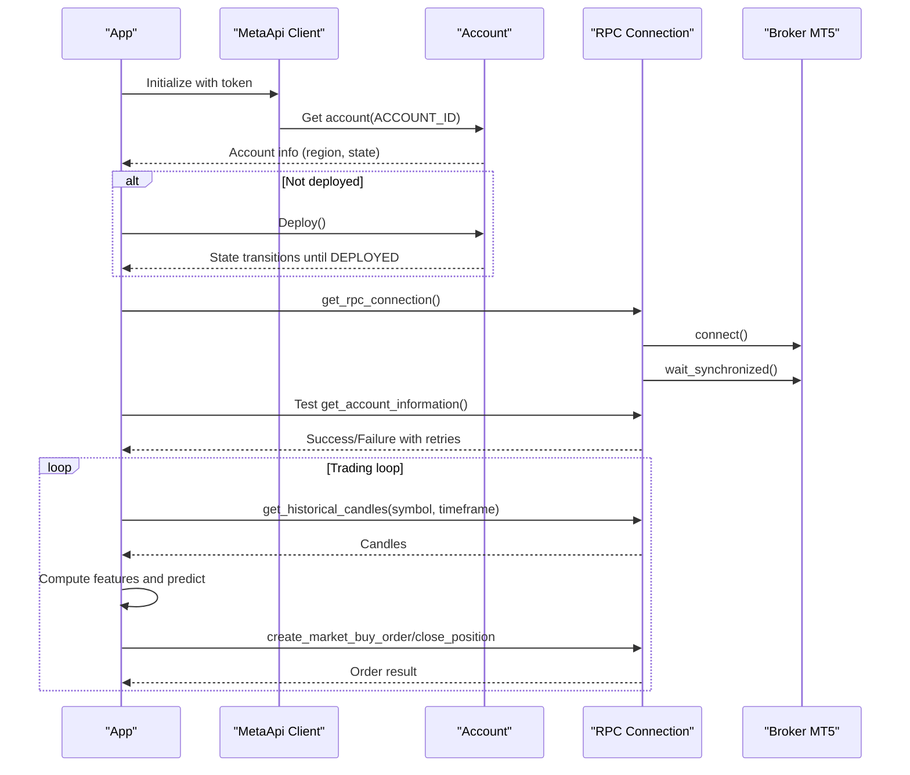
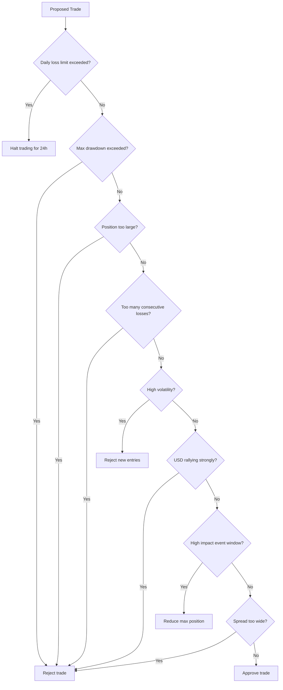
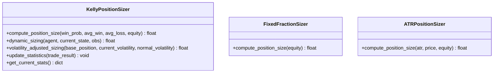
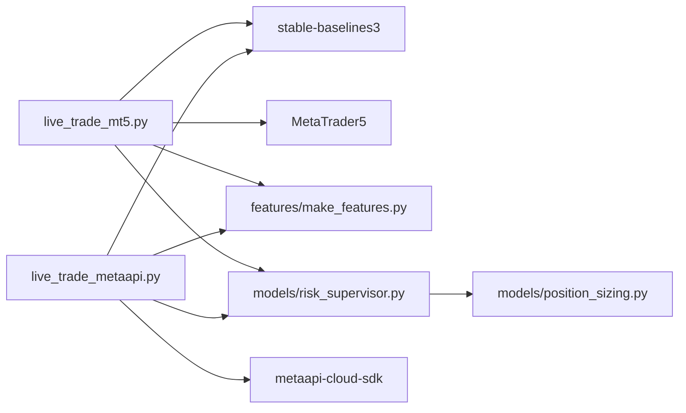

# Live Trading and Deployment

<cite>
**Referenced Files in This Document**
- [live_trade_mt5.py](file://live/live_trade_mt5.py)
- [live_trade_metaapi.py](file://live/live_trade_metaapi.py)
- [risk_supervisor.py](file://models/risk_supervisor.py)
- [position_sizing.py](file://models/position_sizing.py)
- [make_features.py](file://features/make_features.py)
- [DEPLOYMENT_GUIDE.md](file://DEPLOYMENT_GUIDE.md)
- [FREE_DEPLOYMENT.md](file://FREE_DEPLOYMENT.md)
- [README.md](file://README.md)
- [requirements.txt](file://requirements.txt)
</cite>

## Table of Contents
1. Introduction
2. Project Structure
3. Core Components
4. Architecture Overview
5. Detailed Component Analysis
6. Dependency Analysis
7. Performance Considerations
8. Troubleshooting Guide
9. Conclusion
10. Appendices

## Introduction
This document provides production-grade guidance for deploying and operating live trading with this system. It covers:
- MetaTrader 5 (MT5) integration: connection, order execution, position management, error handling
- MetaAPI cloud trading: authentication, request formatting, response processing, remote execution without local MT5
- Deployment strategies for local and cloud environments
- Monitoring and logging for production tracking
- Operational procedures for maintenance and updates
- Concrete examples from the codebase for initialization, order placement, position monitoring, and risk enforcement
- Configuration options for trading parameters, risk limits, and execution settings
- Relationships with trained models, data feeds, and external platforms
- Common deployment issues and performance optimization for real-time trading

## Project Structure
The live trading runtime is implemented in two entry points:
- Local MT5 execution via the MetaTrader 5 Python API
- Cloud execution via MetaAPI using asynchronous HTTP/RPC calls to a broker’s MT5 instance hosted in the cloud

Key modules involved:
- Feature computation pipeline used by both runtimes
- Risk supervisor enforcing hard safety rules
- Position sizing utilities for dynamic sizing strategies
- Deployment guides for VPS/cloud services

**Diagram sources**
- [live_trade_mt5.py:111-174](file://live/live_trade_mt5.py#L111-L174)
- [live_trade_metaapi.py:135-231](file://live/live_trade_metaapi.py#L135-L231)
- [make_features.py:18-78](file://features/make_features.py#L18-L78)
- [risk_supervisor.py:18-76](file://models/risk_supervisor.py#L18-L76)
- [position_sizing.py:29-65](file://models/position_sizing.py#L29-L65)

**Section sources**
- [live_trade_mt5.py:111-174](file://live/live_trade_mt5.py#L111-L174)
- [live_trade_metaapi.py:135-231](file://live/live_trade_metaapi.py#L135-L231)
- [make_features.py:18-78](file://features/make_features.py#L18-L78)
- [risk_supervisor.py:18-76](file://models/risk_supervisor.py#L18-L76)
- [position_sizing.py:29-65](file://models/position_sizing.py#L29-L65)

## Core Components
- MT5 Live Runner: Initializes MT5, loads model, fetches market data, computes features, predicts actions, executes orders, manages positions, handles errors and reconnection.
- MetaAPI Live Runner: Authenticates to MetaAPI, deploys account if needed, establishes RPC connection, runs async loop for data fetching, feature computation, prediction, order placement, and robust reconnection on network failures.
- Risk Supervisor: Deterministic safety layer that approves or rejects AI decisions based on daily loss limits, drawdown protection, volatility filters, spread checks, event windows, trade frequency limits, and more.
- Position Sizing: Implements Kelly-based sizing, fixed fraction, and ATR-based sizing to control exposure dynamically.
- Feature Pipeline: Computes normalized technical and macro features used as observations for the RL model.

**Section sources**
- [live_trade_mt5.py:21-109](file://live/live_trade_mt5.py#L21-L109)
- [live_trade_metaapi.py:40-134](file://live/live_trade_metaapi.py#L40-L134)
- [risk_supervisor.py:91-174](file://models/risk_supervisor.py#L91-L174)
- [position_sizing.py:66-111](file://models/position_sizing.py#L66-L111)
- [make_features.py:18-78](file://features/make_features.py#L18-L78)

## Architecture Overview
The system follows an observation-predict-execute loop with safety enforcement:
- Data ingestion: OHLCV candles fetched from MT5 or MetaAPI
- Feature computation: Technical and macro features normalized into observation vectors
- Model inference: PPO policy predicts action (e.g., flat or long)
- Risk enforcement: Risk Supervisor approves/rejects trades based on hard constraints
- Execution: Orders sent via MT5 or MetaAPI; positions monitored and closed when necessary
- Resilience: Retries, timeouts, and reconnection logic ensure stability

**Diagram sources**
- [live_trade_mt5.py:111-174](file://live/live_trade_mt5.py#L111-L174)
- [live_trade_metaapi.py:100-134](file://live/live_trade_metaapi.py#L100-L134)
- [risk_supervisor.py:91-174](file://models/risk_supervisor.py#L91-L174)

## Detailed Component Analysis

### MetaTrader 5 Integration (Local)
- Connection setup: Initialize MT5 session, verify terminal info, handle initialization failure.
- Market data: Fetch recent candles, convert timestamps, map tick volume to volume.
- Order execution: Build requests with symbol, volume, price, deviation, magic number, time type, filling type; send via order_send; log results.
- Position management: Query current positions by symbol and magic; close existing positions before opening new ones; determine current position type.
- Error handling: Retry on data fetch failures; graceful shutdown on interrupt; print detailed logs for debugging.

**Diagram sources**
- [live_trade_mt5.py:111-174](file://live/live_trade_mt5.py#L111-L174)
- [live_trade_mt5.py:21-109](file://live/live_trade_mt5.py#L21-L109)

**Section sources**
- [live_trade_mt5.py:21-109](file://live/live_trade_mt5.py#L21-L109)
- [live_trade_mt5.py:111-174](file://live/live_trade_mt5.py#L111-L174)

### MetaAPI Cloud Trading (Remote)
- Authentication: Load token and account ID from environment variables; initialize MetaApi client.
- Account lifecycle: Retrieve account info, deploy if not deployed, wait for deployment completion, stabilize broker connection.
- Connection: Establish RPC connection, wait for synchronization, test connectivity with retries.
- Data fetching: Asynchronous historical candle retrieval with timeout and retry logic; transform to DataFrame.
- Position monitoring: Query positions filtered by symbol and magic number; return current position type and ID.
- Order execution: Create market buy orders or close positions using connection methods; handle exceptions and log outcomes.
- Resilience: Wrap each step with timeouts; detect “not connected” or timeout errors; attempt reconnect and resynchronize.

**Diagram sources**
- [live_trade_metaapi.py:135-231](file://live/live_trade_metaapi.py#L135-L231)
- [live_trade_metaapi.py:40-134](file://live/live_trade_metaapi.py#L40-L134)

**Section sources**
- [live_trade_metaapi.py:23-38](file://live/live_trade_metaapi.py#L23-L38)
- [live_trade_metaapi.py:40-134](file://live/live_trade_metaapi.py#L40-L134)
- [live_trade_metaapi.py:135-231](file://live/live_trade_metaapi.py#L135-L231)

### Risk Management Enforcement
- Hard-coded circuit breakers: Daily loss limit triggers a halt; maximum drawdown protection; max position size caps; consecutive loss limits; high volatility filters; correlation guards; event risk filters; trade frequency limits; spread filters; market hours checks.
- State tracking: Tracks daily PnL, equity peak/current, trade counters, last trade time, trade history; supports emergency shutdown.
- Approval workflow: Before executing any trade, the risk supervisor evaluates conditions and returns approval status and reason; rejected trades are overridden to flat.

**Diagram sources**
- [risk_supervisor.py:91-174](file://models/risk_supervisor.py#L91-L174)

**Section sources**
- [risk_supervisor.py:18-76](file://models/risk_supervisor.py#L18-L76)
- [risk_supervisor.py:91-174](file://models/risk_supervisor.py#L91-L174)
- [risk_supervisor.py:176-241](file://models/risk_supervisor.py#L176-L241)

### Position Sizing Strategies
- Kelly Criterion: Computes optimal fraction based on win probability and reward-to-risk ratio; uses fractional Kelly for safety; caps at maximum position; integrates volatility adjustments.
- Fixed Fraction: Simple constant risk per trade.
- ATR-Based: Uses Average True Range to size positions so dollar risk remains consistent across volatility regimes.

**Diagram sources**
- [position_sizing.py:29-65](file://models/position_sizing.py#L29-L65)
- [position_sizing.py:66-111](file://models/position_sizing.py#L66-L111)
- [position_sizing.py:189-216](file://models/position_sizing.py#L189-L216)
- [position_sizing.py:265-336](file://models/position_sizing.py#L265-L336)

**Section sources**
- [position_sizing.py:29-65](file://models/position_sizing.py#L29-L65)
- [position_sizing.py:66-111](file://models/position_sizing.py#L66-L111)
- [position_sizing.py:189-216](file://models/position_sizing.py#L189-L216)
- [position_sizing.py:265-336](file://models/position_sizing.py#L265-L336)

### Feature Computation and Observations
- Computes technical indicators (returns, volatility, momentum, moving averages, RSI, MACD differences).
- Optionally integrates macro features (DXY, SPX, US10Y changes, correlations).
- Normalizes features and produces clean observation vectors for the RL model.

**Section sources**
- [make_features.py:18-78](file://features/make_features.py#L18-L78)

## Dependency Analysis
- External libraries:
  - stable-baselines3 for PPO model loading and inference
  - MetaTrader5 for local MT5 integration
  - metaapi-cloud-sdk for cloud trading via MetaAPI
  - pandas/numpy for data processing
  - python-dotenv for secure configuration loading
- Internal dependencies:
  - Features module supplies observations
  - Risk supervisor enforces safety constraints
  - Position sizing informs exposure control

**Diagram sources**
- [live_trade_mt5.py:1-16](file://live/live_trade_mt5.py#L1-L16)
- [live_trade_metaapi.py:1-38](file://live/live_trade_metaapi.py#L1-L38)
- [requirements.txt:1-29](file://requirements.txt#L1-L29)

**Section sources**
- [requirements.txt:1-29](file://requirements.txt#L1-L29)
- [live_trade_mt5.py:1-16](file://live/live_trade_mt5.py#L1-L16)
- [live_trade_metaapi.py:1-38](file://live/live_trade_metaapi.py#L1-L38)

## Performance Considerations
- Latency minimization:
  - Use appropriate timeframes (e.g., H1) to reduce frequency of checks while maintaining signal quality
  - Batch feature computation efficiently; avoid unnecessary recomputations
- Network resilience:
  - Implement timeouts and retries for data fetching and order submission
  - Detect disconnections and reconnect automatically
- Resource usage:
  - Keep memory footprint low by limiting history windows and cleaning up unused data
  - Prefer asynchronous operations for cloud execution to maximize throughput
- Execution quality:
  - Set reasonable deviation and filling types to balance slippage and fill reliability
  - Monitor spreads and avoid trading during illiquid periods

[No sources needed since this section provides general guidance]

## Troubleshooting Guide
Common issues and resolutions:
- MT5 initialization failure:
  - Verify MT5 terminal is running and logged into the correct account
  - Check last_error codes and ensure required permissions
- No candles received:
  - Increase retry attempts and delays
  - Validate symbol and timeframe availability
- MetaAPI deployment timeout:
  - Ensure account exists and has sufficient permissions
  - Wait for deployment to complete; monitor state transitions
- Connection instability:
  - Use built-in reconnect logic; increase sleep intervals between retries
  - Validate firewall and network policies allow outbound connections
- Order rejection:
  - Check lot size minimums, margin requirements, and symbol trading restrictions
  - Review spread filters and volatility thresholds in risk supervisor
- High latency or timeouts:
  - Optimize feature computation window
  - Use closer data centers or brokers where possible

**Section sources**
- [live_trade_mt5.py:111-174](file://live/live_trade_mt5.py#L111-L174)
- [live_trade_metaapi.py:40-134](file://live/live_trade_metaapi.py#L40-L134)
- [live_trade_metaapi.py:135-231](file://live/live_trade_metaapi.py#L135-L231)
- [risk_supervisor.py:91-174](file://models/risk_supervisor.py#L91-L174)

## Conclusion
This system provides robust live trading capabilities through both local MT5 and cloud-based MetaAPI execution. The modular design separates data ingestion, feature computation, model inference, risk enforcement, and execution, enabling resilient and maintainable operations. With proper configuration, monitoring, and deployment practices, the system can operate reliably in production environments while enforcing strict risk controls.

[No sources needed since this section summarizes without analyzing specific files]

## Appendices

### Deployment Strategies
- AWS Lightsail: Low-cost VPS with systemd service management and journalctl logging
- DigitalOcean: Similar setup with droplets and service management
- Google Cloud Free Tier: e2-micro VM with auto-start and monitoring via console
- Local Mac: Using screen or nohup for persistent sessions

**Section sources**
- [DEPLOYMENT_GUIDE.md:3-68](file://DEPLOYMENT_GUIDE.md#L3-L68)
- [DEPLOYMENT_GUIDE.md:72-133](file://DEPLOYMENT_GUIDE.md#L72-L133)
- [FREE_DEPLOYMENT.md:24-180](file://FREE_DEPLOYMENT.md#L24-L180)

### Configuration Options
- Trading parameters:
  - Symbol, timeframe, volume, model path, observation window, magic number
- Risk limits:
  - Max daily loss, max position size, max drawdown, volatility threshold, max spread, max trades per day, min trade interval, max consecutive losses
- Execution settings:
  - Deviation, order time type, filling type, retry counts, timeouts

**Section sources**
- [live_trade_mt5.py:11-16](file://live/live_trade_mt5.py#L11-L16)
- [live_trade_metaapi.py:23-38](file://live/live_trade_metaapi.py#L23-L38)
- [risk_supervisor.py:35-76](file://models/risk_supervisor.py#L35-L76)

### Relationships with Models, Data Feeds, and Platforms
- Trained models: PPO models loaded at runtime for decision-making
- Data feeds: MT5 local feed or MetaAPI cloud feed providing OHLCV data
- External platforms: MT5 terminal for local execution; MetaAPI for cloud execution connecting to broker MT5 instances

**Section sources**
- [live_trade_mt5.py:111-174](file://live/live_trade_mt5.py#L111-L174)
- [live_trade_metaapi.py:135-231](file://live/live_trade_metaapi.py#L135-L231)
- [README.md:135-148](file://README.md#L135-L148)