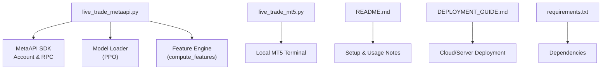
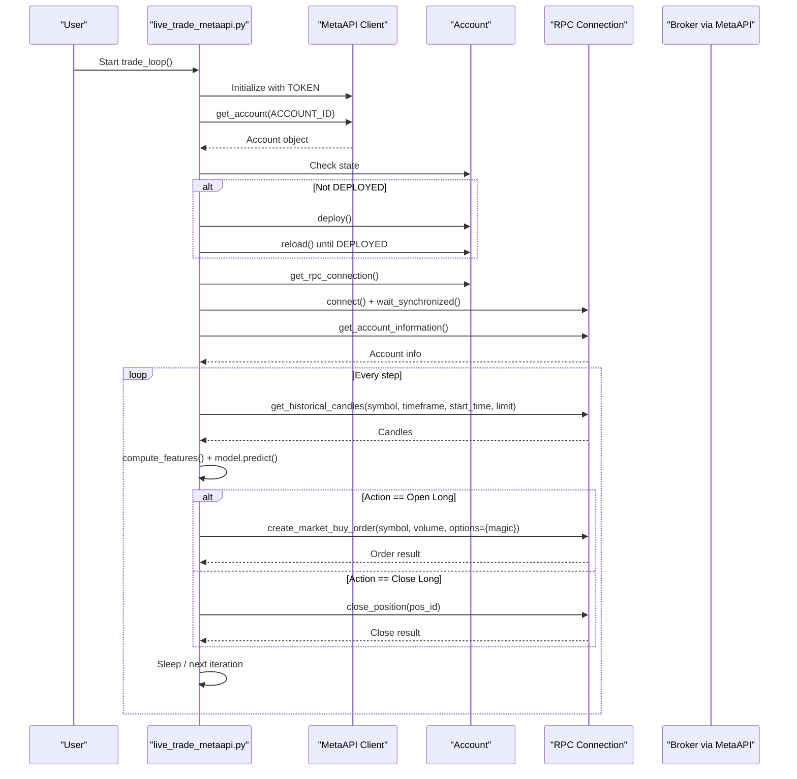
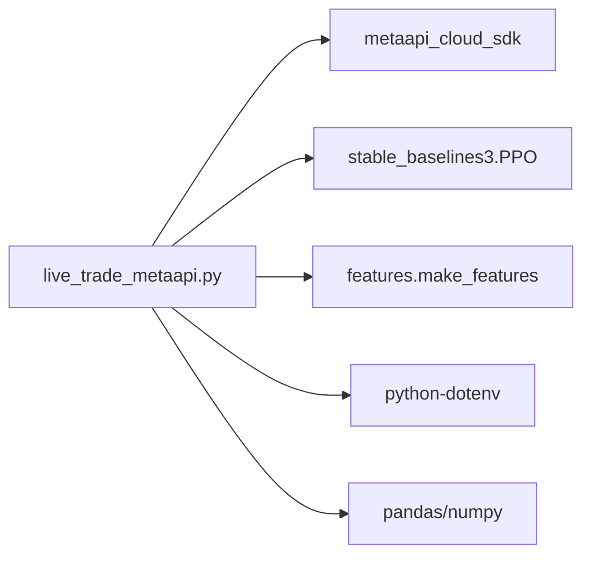

# MetaAPI Cloud Trading

<cite>
**Referenced Files in This Document**
- [live_trade_metaapi.py](file://live/live_trade_metaapi.py)
- [live_trade_mt5.py](file://live/live_trade_mt5.py)
- [README.md](file://README.md)
- [DEPLOYMENT_GUIDE.md](file://DEPLOYMENT_GUIDE.md)
- [requirements.txt](file://requirements.txt)
</cite>

## Table of Contents
1. [Introduction](#introduction)
2. [Project Structure](#project-structure)
3. [Core Components](#core-components)
4. [Architecture Overview](#architecture-overview)
5. [Detailed Component Analysis](#detailed-component-analysis)
6. [Dependency Analysis](#dependency-analysis)
7. [Performance Considerations](#performance-considerations)
8. [Troubleshooting Guide](#troubleshooting-guide)
9. [Conclusion](#conclusion)
10. [Appendices](#appendices)

## Introduction
This document explains how to operate the trading system using MetaAPI cloud trading as an alternative to a local MetaTrader 5 (MT5) deployment. The cloud-based approach removes the need for a local MT5 terminal by connecting to a broker account via MetaAPI’s SDK and executing trades remotely. It covers authentication, connection establishment, request formatting for market data and orders, response handling, error management, and operational best practices. It also compares MetaAPI advantages versus local MT5 deployment and provides configuration guidance for different trading scenarios.

## Project Structure
The repository includes two live execution paths:
- Local MT5 execution via the MT5 Python API
- Cloud execution via MetaAPI

Key files relevant to this guide:
- live/live_trade_metaapi.py: Cloud trading loop with MetaAPI SDK integration
- live/live_trade_mt5.py: Local MT5 trading loop for comparison
- README.md: High-level project overview and quick start instructions
- DEPLOYMENT_GUIDE.md: Deployment options and monitoring
- requirements.txt: Dependencies including python-dotenv and MetaTrader5

**Diagram sources**
- [live_trade_metaapi.py:1-231](file://live/live_trade_metaapi.py#L1-L231)
- [live_trade_mt5.py:1-174](file://live/live_trade_mt5.py#L1-L174)
- [README.md:135-148](file://README.md#L135-L148)
- [DEPLOYMENT_GUIDE.md:101-133](file://DEPLOYMENT_GUIDE.md#L101-L133)
- [requirements.txt:10-16](file://requirements.txt#L10-L16)

**Section sources**
- [live_trade_metaapi.py:1-231](file://live/live_trade_metaapi.py#L1-L231)
- [live_trade_mt5.py:1-174](file://live/live_trade_mt5.py#L1-L174)
- [README.md:135-148](file://README.md#L135-L148)
- [DEPLOYMENT_GUIDE.md:101-133](file://DEPLOYMENT_GUIDE.md#L101-L133)
- [requirements.txt:10-16](file://requirements.txt#L10-L16)

## Core Components
- Authentication and Account Setup
  - Credentials are loaded from environment variables for security: METAAPI_TOKEN and METAAPI_ACCOUNT_ID.
  - The script initializes the MetaAPI client and retrieves the account object using the provided token and account ID.
  - If the account is not deployed, it triggers deployment and waits until the state becomes DEPLOYED before proceeding.

- Connection Establishment
  - After deployment, the script obtains an RPC connection from the account and connects synchronously.
  - It waits for synchronization and then performs a test call to get account information to confirm connectivity.

- Market Data Retrieval
  - Historical candles are fetched asynchronously with retry logic and timeouts to ensure robustness.
  - Data is transformed into a DataFrame for feature computation.

- Position Management and Order Execution
  - Current positions are queried and filtered by symbol and magic number.
  - Orders are placed or closed based on model actions, with appropriate error handling and logging.

- Loop and Resilience
  - The main loop runs continuously, wrapping each step with timeout protection.
  - On connection issues, it attempts reconnection automatically.

**Section sources**
- [live_trade_metaapi.py:23-38](file://live/live_trade_metaapi.py#L23-L38)
- [live_trade_metaapi.py:40-86](file://live/live_trade_metaapi.py#L40-L86)
- [live_trade_metaapi.py:88-134](file://live/live_trade_metaapi.py#L88-L134)
- [live_trade_metaapi.py:135-220](file://live/live_trade_metaapi.py#L135-L220)

## Architecture Overview
The MetaAPI cloud trading architecture integrates the AI model with remote broker execution through MetaAPI’s SDK. The flow emphasizes reliability with retries, timeouts, and reconnection logic.

**Diagram sources**
- [live_trade_metaapi.py:135-220](file://live/live_trade_metaapi.py#L135-L220)
- [live_trade_metaapi.py:40-86](file://live/live_trade_metaapi.py#L40-L86)
- [live_trade_metaapi.py:88-134](file://live/live_trade_metaapi.py#L88-L134)

## Detailed Component Analysis

### Authentication and Account Setup
- Environment variables:
  - METAAPI_TOKEN: Your MetaAPI access token
  - METAAPI_ACCOUNT_ID: Your broker account identifier
- Initialization:
  - Create a MetaAPI client instance with the token
  - Retrieve the account using the account ID
  - Ensure the account is deployed; if not, deploy and poll until DEPLOYED
- Best practices:
  - Store credentials in .env and load via python-dotenv
  - Never hardcode tokens in source code

**Section sources**
- [live_trade_metaapi.py:23-38](file://live/live_trade_metaapi.py#L23-L38)
- [live_trade_metaapi.py:135-168](file://live/live_trade_metaapi.py#L135-L168)
- [README.md:264-291](file://README.md#L264-L291)

### Connection Establishment
- Obtain an RPC connection from the account and connect synchronously
- Wait for synchronization to ensure subscriptions are ready
- Validate connectivity by fetching account information with retries and timeouts
- Automatic reconnection is attempted when network errors or timeouts occur

**Section sources**
- [live_trade_metaapi.py:170-197](file://live/live_trade_metaapi.py#L170-L197)
- [live_trade_metaapi.py:202-220](file://live/live_trade_metaapi.py#L202-L220)

### Market Data Queries
- Fetch historical candles asynchronously with a timeout
- Implement retry logic for empty results and exceptions
- Transform candle data into a DataFrame for feature computation
- Use sufficient history to stabilize feature normalization

**Section sources**
- [live_trade_metaapi.py:40-86](file://live/live_trade_metaapi.py#L40-L86)

### Order Placement and Position Management
- Determine current position by querying positions and filtering by symbol and magic number
- Place buy orders with magic numbers to identify strategy-managed positions
- Close positions by ID returned from open orders
- Handle errors gracefully and log outcomes

**Section sources**
- [live_trade_metaapi.py:88-134](file://live/live_trade_metaapi.py#L88-L134)

### Response Processing and Status Monitoring
- Monitor order results and print confirmation messages
- Track account balance and state during initialization
- Log warnings and errors for retries and failures
- Maintain a steady loop with periodic sleeps to avoid overloading APIs

**Section sources**
- [live_trade_metaapi.py:182-197](file://live/live_trade_metaapi.py#L182-L197)
- [live_trade_metaapi.py:202-220](file://live/live_trade_metaapi.py#L202-L220)

### Comparison: MetaAPI vs Local MT5
- MetaAPI (cloud):
  - No local MT5 terminal required
  - Remote execution from anywhere
  - Automatic reconnection and multi-broker support
- Local MT5:
  - Requires MT5 installed and running locally
  - Direct platform integration with synchronous calls
  - Simpler setup but tied to local machine availability

**Section sources**
- [README.md:135-148](file://README.md#L135-L148)
- [live_trade_mt5.py:1-174](file://live/live_trade_mt5.py#L1-L174)

## Dependency Analysis
- External dependencies:
  - metaapi_cloud_sdk: Provides MetaAPI client and RPC methods
  - stable_baselines3: Loads and runs the trained PPO model
  - pandas/numpy: Data processing and feature engineering
  - python-dotenv: Secure credential loading
- Internal modules:
  - features.make_features.compute_features: Feature computation pipeline
- Coupling:
  - The trading script depends on the MetaAPI SDK for all broker interactions
  - Model inference is decoupled from execution logic, enabling easy swapping of strategies

**Diagram sources**
- [live_trade_metaapi.py:1-10](file://live/live_trade_metaapi.py#L1-L10)
- [requirements.txt:1-16](file://requirements.txt#L1-L16)

**Section sources**
- [live_trade_metaapi.py:1-10](file://live/live_trade_metaapi.py#L1-L10)
- [requirements.txt:1-16](file://requirements.txt#L1-L16)

## Performance Considerations
- Timeouts and Retries:
  - Network operations use timeouts and retries to handle transient failures
  - Avoid excessive polling; batch requests where possible
- Resource Efficiency:
  - Keep feature windows reasonable to balance accuracy and memory usage
  - Minimize redundant computations inside the loop
- Rate Limiting:
  - Respect MetaAPI rate limits by spacing out requests and avoiding tight loops
  - Use backoff strategies when encountering throttling responses
- Latency:
  - Prefer asynchronous calls for non-blocking operations
  - Cache static configurations and reduce repeated lookups

[No sources needed since this section provides general guidance]

## Troubleshooting Guide
Common issues and resolutions:
- Missing credentials:
  - Ensure METAAPI_TOKEN and METAAPI_ACCOUNT_ID are set in .env
  - Verify that .env is loaded and not committed to version control
- Account not deployed:
  - Trigger deployment and wait until state is DEPLOYED
  - Monitor logs for deployment progress and errors
- Connection failures:
  - Reconnect and wait for synchronization
  - Test connectivity by fetching account information
- Data fetch errors:
  - Retry with exponential backoff
  - Validate time ranges and symbol/timeframe combinations
- Order execution errors:
  - Check symbol availability, lot sizes, and margin requirements
  - Inspect error messages and adjust parameters accordingly

**Section sources**
- [live_trade_metaapi.py:135-197](file://live/live_trade_metaapi.py#L135-L197)
- [live_trade_metaapi.py:202-220](file://live/live_trade_metaapi.py#L202-L220)

## Conclusion
MetaAPI cloud trading offers a robust, infrastructure-light alternative to local MT5 deployment. By leveraging environment-based authentication, resilient connections, and structured request/response handling, the system enables reliable remote trading operations. Following the configuration examples, rate limiting considerations, and best practices outlined here will help you achieve consistent performance and minimize downtime.

[No sources needed since this section summarizes without analyzing specific files]

## Appendices

### Configuration Examples for Different Scenarios
- Standard Strategy:
  - Symbol: XAUUSD
  - Timeframe: 1h
  - Volume: 0.01 lots
  - Magic number: unique per strategy
- Aggressive Strategy:
  - Increase frequency checks and reduce hold times
  - Adjust volume and stop-loss/take-profit parameters
- Swing Strategy:
  - Use higher timeframes (H4/D1)
  - Larger position sizing with wider stops

**Section sources**
- [live_trade_metaapi.py:32-38](file://live/live_trade_metaapi.py#L32-L38)
- [README.md:123-132](file://README.md#L123-L132)

### Operational Best Practices
- Security:
  - Store secrets in .env and never commit them
- Reliability:
  - Implement timeouts, retries, and automatic reconnection
  - Monitor logs and set up alerts for critical failures
- Risk Management:
  - Enforce maximum risk per trade and daily loss limits
  - Use magic numbers to isolate strategy-managed positions
- Deployment:
  - Run on a reliable VPS or cloud instance
  - Use process managers (systemd, screen, nohup) for persistence

**Section sources**
- [README.md:264-291](file://README.md#L264-L291)
- [DEPLOYMENT_GUIDE.md:101-133](file://DEPLOYMENT_GUIDE.md#L101-L133)