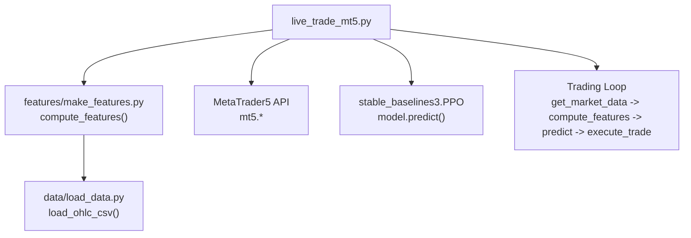
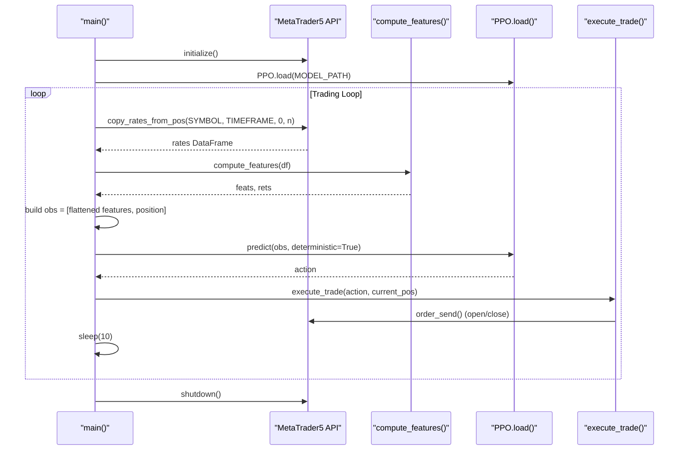
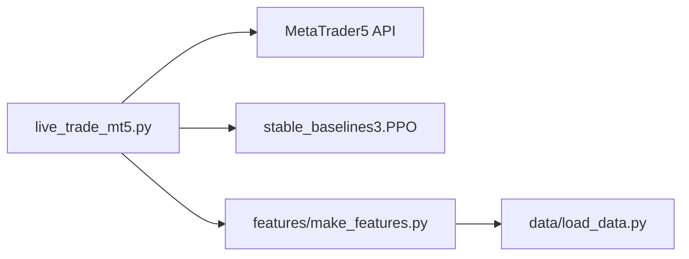

# MetaTrader 5 Integration

<cite>
**Referenced Files in This Document**
- [live_trade_mt5.py](file://live/live_trade_mt5.py)
- [make_features.py](file://features/make_features.py)
- [load_data.py](file://data/load_data.py)
- [xauusd_env.py](file://env/xauusd_env.py)
- [README.md](file://README.md)
</cite>

## Table of Contents
1. Introduction
2. Project Structure
3. Core Components
4. Architecture Overview
5. Detailed Component Analysis
6. Dependency Analysis
7. Performance Considerations
8. Troubleshooting Guide
9. Conclusion

## Introduction
This document explains how the autonomous trading system integrates with MetaTrader 5 (MT5) for live trading on XAUUSD. It covers MT5 terminal setup, API initialization and connection management, the real-time trading loop that fetches market data via mt5.copy_rates_from_pos, computes features through compute_features, loads a trained PPO model with PPO.load, and executes trades using open_order, close_position, and execute_trade. It also documents error handling strategies, configuration parameters (SYMBOL, TIMEFRAME, VOLUME, DEVIATION, MAGIC), observation construction combining features and position state, and deterministic prediction to ensure consistent behavior.

## Project Structure
The live trading integration is implemented in a single entry script that orchestrates MT5 connectivity, feature computation, model inference, and order execution. Supporting modules provide feature engineering and data loading utilities used during training and evaluation; the live script focuses on runtime operations.

**Diagram sources**
- [live_trade_mt5.py:1-174](file://live/live_trade_mt5.py#L1-L174)
- [make_features.py:18-78](file://features/make_features.py#L18-L78)
- [load_data.py:5-73](file://data/load_data.py#L5-L73)

**Section sources**
- [live_trade_mt5.py:1-174](file://live/live_trade_mt5.py#L1-L174)
- [README.md:135-148](file://README.md#L135-L148)

## Core Components
- MT5 Connection Management: initialize(), terminal_info(), shutdown()
- Market Data Retrieval: copy_rates_from_pos() to fetch OHLCV candles
- Feature Computation: compute_features() to generate normalized indicators
- Model Inference: PPO.load() and deterministic model.predict()
- Order Execution: open_order() for BUY, close_position() for closing positions, execute_trade() mapping actions to orders
- Observation Construction: concatenation of flattened recent features and current position state

Key configuration parameters:
- SYMBOL: "XAUUSD"
- TIMEFRAME: H1
- VOLUME: minimum lot size
- DEVIATION: price deviation tolerance
- MAGIC: unique identifier for agent-managed positions

**Section sources**
- [live_trade_mt5.py:10-16](file://live/live_trade_mt5.py#L10-L16)
- [live_trade_mt5.py:21-30](file://live/live_trade_mt5.py#L21-L30)
- [live_trade_mt5.py:32-56](file://live/live_trade_mt5.py#L32-L56)
- [live_trade_mt5.py:57-95](file://live/live_trade_mt5.py#L57-L95)
- [live_trade_mt5.py:97-109](file://live/live_trade_mt5.py#L97-L109)
- [live_trade_mt5.py:111-173](file://live/live_trade_mt5.py#L111-L173)
- [make_features.py:18-78](file://features/make_features.py#L18-L78)

## Architecture Overview
The live trading loop runs continuously:
1. Initialize MT5 and load the PPO model once at startup.
2. Fetch recent market data from MT5 using mt5.copy_rates_from_pos.
3. Compute features via compute_features, which returns normalized indicator arrays.
4. Build an observation by flattening the last WINDOW steps of features and appending the current position state.
5. Predict action deterministically using PPO.load().predict(obs, deterministic=True).
6. Map the predicted action to trade execution via execute_trade, which calls open_order or close_position as needed.
7. Sleep briefly and repeat.

**Diagram sources**
- [live_trade_mt5.py:111-173](file://live/live_trade_mt5.py#L111-L173)
- [live_trade_mt5.py:21-30](file://live/live_trade_mt5.py#L21-L30)
- [live_trade_mt5.py:32-56](file://live/live_trade_mt5.py#L32-L56)
- [make_features.py:18-78](file://features/make_features.py#L18-L78)

## Detailed Component Analysis

### MT5 Terminal Installation and Initialization
- Ensure the MT5 terminal is installed and logged into a broker account (demo recommended for initial testing).
- The script initializes MT5 via initialize() and prints terminal info upon success. On failure, it logs the error code and exits gracefully.
- At termination (Ctrl+C), shutdown() is called to release resources.

Operational notes:
- The script uses H1 timeframe for trading signals.
- The symbol is set to XAUUSD.

**Section sources**
- [live_trade_mt5.py:111-116](file://live/live_trade_mt5.py#L111-L116)
- [live_trade_mt5.py:168-171](file://live/live_trade_mt5.py#L168-L171)
- [README.md:219-227](file://README.md#L219-L227)

### Market Data Retrieval with mt5.copy_rates_from_pos
- get_market_data(symbol, n=500) retrieves the most recent n candles from MT5 using mt5.copy_rates_from_pos.
- Returns None if retrieval fails; the main loop retries after a delay.
- The returned rates are converted to a pandas DataFrame and standardized column names (e.g., tick_volume renamed to volume).

Error handling:
- If rates is None, the loop sleeps and continues fetching later.

**Section sources**
- [live_trade_mt5.py:21-30](file://live/live_trade_mt5.py#L21-L30)
- [live_trade_mt5.py:124-131](file://live/live_trade_mt5.py#L124-L131)

### Feature Computation via compute_features
- compute_features builds technical indicators including returns, volatility, momentum, moving averages, RSI, MACD differences, and optional macro correlations when available.
- It cleans data, normalizes features, and returns both features and returns arrays suitable for RL input.
- The live script uses this function to produce normalized features for the observation window.

Complexity considerations:
- Rolling windows and EWMA computations scale linearly with the number of rows; ensure sufficient history (n) to cover warm-up periods and the observation window.

**Section sources**
- [make_features.py:18-78](file://features/make_features.py#L18-L78)
- [live_trade_mt5.py:133-147](file://live/live_trade_mt5.py#L133-L147)

### Model Prediction with PPO.load
- The script loads a pre-trained PPO model from a zip file path configured at startup.
- Predictions are made deterministically to ensure consistent trading behavior across runs.
- The action space is discrete: 0 (Flat) and 1 (Long).

Deterministic approach:
- deterministic=True ensures the same observation yields the same action, reducing randomness in live execution.

**Section sources**
- [live_trade_mt5.py:118-120](file://live/live_trade_mt5.py#L118-L120)
- [live_trade_mt5.py:155-157](file://live/live_trade_mt5.py#L155-L157)

### Observation Construction: Features + Position State
- The observation is built by concatenating the flattened features of the last WINDOW steps with the current position state (0 for flat, 1 for long).
- This mirrors the environment’s observation design where the last dimension includes a scalar position indicator.

Environment alignment:
- The RL environment constructs observations similarly by stacking windowed features and appending the position state.

**Section sources**
- [live_trade_mt5.py:140-153](file://live/live_trade_mt5.py#L140-L153)
- [xauusd_env.py:49-68](file://env/xauusd_env.py#L49-L68)

### Order Execution Mechanics
- open_order(order_type):
  - Retrieves the latest tick for the symbol and selects ask/bid based on order type.
  - Sends a buy/sell deal request with configured volume, deviation, magic, comment, time-in-force, and filling mode.
  - Prints result comments for visibility.

- close_position(position_type):
  - Queries open positions for the symbol and iterates to find matching types.
  - Constructs a closing deal request with opposite order type and the exact position volume.
  - Uses the same magic number to associate orders with the agent.

- execute_trade(action, current_pos_type):
  - Compares the predicted action with the current position.
  - If different, closes existing positions first, then opens new ones as required.
  - Supports long-only logic in this implementation.

MAGIC number usage:
- A fixed MAGIC value identifies orders placed by the agent, enabling filtering and management of agent-managed positions.

**Section sources**
- [live_trade_mt5.py:32-56](file://live/live_trade_mt5.py#L32-L56)
- [live_trade_mt5.py:57-95](file://live/live_trade_mt5.py#L57-L95)
- [live_trade_mt5.py:97-109](file://live/live_trade_mt5.py#L97-L109)

### Configuration Parameters
- SYMBOL: "XAUUSD" — target instrument for trading.
- TIMEFRAME: H1 — timeframe for market data and signal generation.
- VOLUME: minimum lot size — controls position sizing per order.
- DEVIATION: price deviation tolerance — allows slippage within specified points.
- MAGIC: unique ID — associates orders/positions with the agent for lifecycle management.

These parameters are defined at the top of the live script and used throughout the trading loop and order functions.

**Section sources**
- [live_trade_mt5.py:10-16](file://live/live_trade_mt5.py#L10-L16)
- [live_trade_mt5.py:57-75](file://live/live_trade_mt5.py#L57-L75)
- [live_trade_mt5.py:77-95](file://live/live_trade_mt5.py#L77-L95)

### Error Handling Strategies
- Connection failures:
  - initialize() failure prints error code and exits early to avoid undefined state.
- Market data retrieval issues:
  - If copy_rates_from_pos returns None, the loop sleeps and retries to handle transient network or server issues.
- Order rejections:
  - Results from order_send() are printed for debugging; additional checks can be added to handle specific rejection codes.
- Insufficient data:
  - If the feature matrix does not yet have enough rows for the observation window, the loop sleeps until sufficient history accumulates.

Robustness tips:
- Add explicit checks for order_send() result validity and retry with backoff on failures.
- Log detailed errors for MT5.last_error() when applicable.

**Section sources**
- [live_trade_mt5.py:111-116](file://live/live_trade_mt5.py#L111-L116)
- [live_trade_mt5.py:124-131](file://live/live_trade_mt5.py#L124-L131)
- [live_trade_mt5.py:142-145](file://live/live_trade_mt5.py#L142-L145)
- [live_trade_mt5.py:74-75](file://live/live_trade_mt5.py#L74-L75)

### Deterministic Prediction Approach
- The model is loaded once and predictions are made with deterministic=True to ensure consistent decisions for identical observations.
- This reduces stochasticity in live trading and improves reproducibility during monitoring and debugging.

**Section sources**
- [live_trade_mt5.py:118-120](file://live/live_trade_mt5.py#L118-L120)
- [live_trade_mt5.py:155-157](file://live/live_trade_mt5.py#L155-L157)

## Dependency Analysis
The live trading module depends on:
- MetaTrader5 Python API for market data and order execution.
- stable_baselines3 for loading and running the PPO policy.
- features.make_features for computing normalized indicators from raw OHLCV data.
- data.load_data for CSV parsing utilities used in training/evaluation contexts.

**Diagram sources**
- [live_trade_mt5.py:1-8](file://live/live_trade_mt5.py#L1-L8)
- [make_features.py:1-4](file://features/make_features.py#L1-L4)
- [load_data.py:1-4](file://data/load_data.py#L1-L4)

**Section sources**
- [live_trade_mt5.py:1-8](file://live/live_trade_mt5.py#L1-L8)
- [make_features.py:1-4](file://features/make_features.py#L1-L4)
- [load_data.py:1-4](file://data/load_data.py#L1-L4)

## Performance Considerations
- Data windowing: Ensure n is large enough to cover warm-up periods and the observation window to avoid insufficient data delays.
- Feature normalization: compute_features normalizes features to improve model stability and convergence.
- Execution frequency: The loop sleeps between iterations; adjust interval based on timeframe and desired responsiveness.
- Slippage and deviation: Configure DEVIATION appropriately to balance fill reliability and price control.
- Volume sizing: Start with minimal VOLUME to test execution quality before scaling up.

[No sources needed since this section provides general guidance]

## Troubleshooting Guide
Common issues and resolutions:
- MT5 initialization fails:
  - Verify MT5 terminal is installed and logged in. Check error code from last_error() and ensure permissions allow API access.
- No market data received:
  - Confirm symbol and timeframe exist in MT5. Retry with increased n and check network connectivity.
- Insufficient features:
  - Wait for more bars to accumulate; the loop pauses until the observation window is satisfied.
- Order rejections:
  - Review order_send() results and MT5 error messages. Validate symbol availability, margin requirements, and filling modes.
- Position mismatch:
  - Ensure MAGIC matches between open and close requests. Verify positions_get filters by symbol and magic.

**Section sources**
- [live_trade_mt5.py:111-116](file://live/live_trade_mt5.py#L111-L116)
- [live_trade_mt5.py:124-131](file://live/live_trade_mt5.py#L124-L131)
- [live_trade_mt5.py:142-145](file://live/live_trade_mt5.py#L142-L145)
- [live_trade_mt5.py:74-75](file://live/live_trade_mt5.py#L74-L75)
- [live_trade_mt5.py:97-109](file://live/live_trade_mt5.py#L97-L109)

## Conclusion
The MT5 integration provides a robust foundation for live trading XAUUSD using a trained PPO policy. The system initializes MT5, fetches market data, computes normalized features, constructs observations that include both market signals and current position state, predicts actions deterministically, and executes trades with clear configuration and error handling. By tuning SYMBOL, TIMEFRAME, VOLUME, DEVIATION, and MAGIC, operators can adapt the system to their broker constraints and risk preferences while maintaining consistent and reproducible behavior.

[No sources needed since this section summarizes without analyzing specific files]