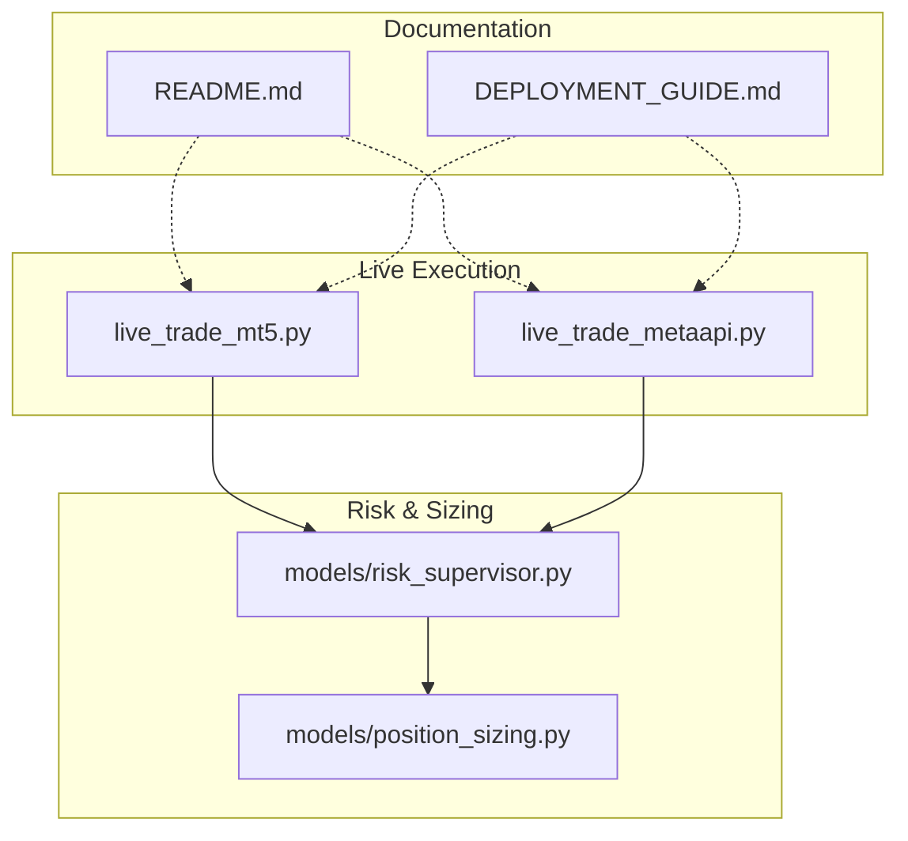
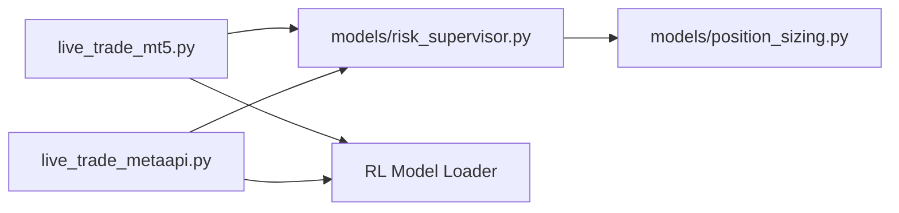

# Operational Monitoring

<cite>
**Referenced Files in This Document**
- [live_trade_mt5.py](file://live/live_trade_mt5.py)
- [live_trade_metaapi.py](file://live/live_trade_metaapi.py)
- [risk_supervisor.py](file://models/risk_supervisor.py)
- [position_sizing.py](file://models/position_sizing.py)
- [README.md](file://README.md)
- [DEPLOYMENT_GUIDE.md](file://DEPLOYMENT_GUIDE.md)
</cite>

## Table of Contents
1. Introduction
2. Project Structure
3. Core Components
4. Architecture Overview
5. Detailed Component Analysis
6. Dependency Analysis
7. Performance Considerations
8. Troubleshooting Guide
9. Conclusion
10. Appendices

## Introduction
This document provides operational monitoring guidance for the live trading system, focusing on real-time monitoring strategies (position tracking, PnL calculation, performance metrics), alerting mechanisms (drawdowns, connectivity failures, unusual patterns), logging and audit trails (orders, market snapshots, model predictions), dashboard setup concepts, automated health checks (MT5/MetaAPI connectivity, model loading, data feed validation), troubleshooting (latency, memory leaks, resource exhaustion), and maintenance procedures (updates, retraining, optimization).

The system supports two live execution backends:
- MetaTrader 5 (MT5) via a local client
- MetaAPI (cloud) via asynchronous API calls

A deterministic risk supervisor enforces hard safety limits over AI decisions, and position sizing utilities provide dynamic sizing based on volatility and statistical estimates.

## Project Structure
Key directories relevant to operations:
- live/: Live trading loops for MT5 and MetaAPI
- models/: Risk management and position sizing components
- README.md and DEPLOYMENT_GUIDE.md: Deployment and operational notes



**Diagram sources**
- [live_trade_mt5.py:1-174](file://live/live_trade_mt5.py#L1-L174)
- [live_trade_metaapi.py:1-231](file://live/live_trade_metaapi.py#L1-L231)
- [risk_supervisor.py:1-387](file://models/risk_supervisor.py#L1-L387)
- [position_sizing.py:1-399](file://models/position_sizing.py#L1-L399)
- [README.md:418-470](file://README.md#L418-L470)
- [DEPLOYMENT_GUIDE.md:137-158](file://DEPLOYMENT_GUIDE.md#L137-L158)

**Section sources**
- [README.md:418-470](file://README.md#L418-L470)
- [DEPLOYMENT_GUIDE.md:137-158](file://DEPLOYMENT_GUIDE.md#L137-L158)

## Core Components
- Live execution loops:
  - MT5 loop: fetches market data, computes features, predicts actions, executes orders, sleeps between cycles
  - MetaAPI loop: async data fetching with retries, connection lifecycle management, order execution, timeout handling
- Risk Supervisor: deterministic safety layer enforcing daily loss limits, drawdown protection, spread/volatility filters, event risk, trade frequency controls, and emergency shutdown
- Position Sizing: Kelly-based sizing, fixed fraction, ATR-based sizing; includes volatility adjustment and statistics updates

These components form the backbone for operational monitoring: they expose state (positions, equity, daily PnL), generate logs, and enforce guardrails that can trigger alerts.

**Section sources**
- [live_trade_mt5.py:21-166](file://live/live_trade_mt5.py#L21-L166)
- [live_trade_metaapi.py:40-134](file://live/live_trade_metaapi.py#L40-L134)
- [risk_supervisor.py:18-286](file://models/risk_supervisor.py#L18-L286)
- [position_sizing.py:29-262](file://models/position_sizing.py#L29-L262)

## Architecture Overview
High-level flow for live trading and monitoring:

```mermaid
sequenceDiagram
participant User as "Operator"
participant Loop as "Live Loop"
participant Data as "Market Data"
participant Model as "RL Model"
participant Exec as "Execution (MT5/MetaAPI)"
participant Risk as "Risk Supervisor"
participant Log as "Logs/Alerts"
User->>Loop : Start
Loop->>Data : Fetch candles / ticks
Data-->>Loop : DataFrame
Loop->>Model : Predict action
Model-->>Loop : Action
Loop->>Risk : check_trade(action, state, market_data)
Risk-->>Loop : approved/rejected + reason
alt Approved
Loop->>Exec : Open/Close order
Exec-->>Loop : Order result
Loop->>Log : Record order, PnL snapshot
else Rejected
Loop->>Log : Record rejection reason
end
Loop->>Loop : Sleep until next cycle
```

**Diagram sources**
- [live_trade_mt5.py:111-166](file://live/live_trade_mt5.py#L111-L166)
- [live_trade_metaapi.py:135-220](file://live/live_trade_metaapi.py#L135-L220)
- [risk_supervisor.py:91-174](file://models/risk_supervisor.py#L91-L174)

## Detailed Component Analysis

### Live Trading Loop (MT5)
- Market data retrieval from MT5 with fallback on failure
- Feature computation and observation construction
- Deterministic prediction and action mapping
- Order execution with deviation and magic number tagging
- Position detection by symbol and magic number
- Cycle sleep interval for H1 timeframe

Operational monitoring implications:
- Track data fetch success/failure and retry behavior
- Log each decision timestamp, current position, and predicted action
- Capture order send results and errors for audit trail
- Monitor time spent per cycle to detect latency issues

**Section sources**
- [live_trade_mt5.py:21-109](file://live/live_trade_mt5.py#L21-L109)
- [live_trade_mt5.py:111-166](file://live/live_trade_mt5.py#L111-L166)

### Live Trading Loop (MetaAPI)
- Async historical candle fetching with timeouts and retries
- Robust connection lifecycle: deploy account if needed, wait for synchronization, test connectivity with retries
- Dynamic reconnection on network errors or timeouts
- Order creation and position closing with error handling
- Logging suppressed for SDK internals to reduce noise

Operational monitoring implications:
- Measure data fetch latency and failure rates
- Alert on deployment delays or connection instability
- Record all order outcomes and exceptions
- Track reconnection events and durations

**Section sources**
- [live_trade_metaapi.py:40-86](file://live/live_trade_metaapi.py#L40-L86)
- [live_trade_metaapi.py:135-220](file://live/live_trade_metaapi.py#L135-L220)

### Risk Supervisor
- Enforces multiple safety rules: daily loss limit, max drawdown, position size caps, consecutive losses, volatility filter, correlation guard, event risk, max trades/day, cooldown, spread filter, market hours
- Maintains state: daily PnL, peak/current equity, trade counters, halt timers
- Provides statistics and emergency shutdown capability

Operational monitoring implications:
- Emit warnings when thresholds are approached or breached
- Log every approval/rejection with reasons for auditability
- Expose statistics for dashboards (approval rate, rejection reasons, daily PnL, drawdown)
- Support external alerting on critical events (halt, emergency shutdown)

**Section sources**
- [risk_supervisor.py:18-286](file://models/risk_supervisor.py#L18-L286)

### Position Sizing
- Kelly Criterion with fractional scaling and maximum caps
- Volatility-adjusted sizing to maintain consistent dollar risk
- Fixed fraction and ATR-based sizing alternatives
- Statistics update from trade history to refine win rate and average win/loss

Operational monitoring implications:
- Track recommended vs executed position sizes
- Monitor volatility regimes and their impact on sizing
- Log sizing inputs and outputs for post-trade analysis

**Section sources**
- [position_sizing.py:29-262](file://models/position_sizing.py#L29-L262)

### Real-Time Monitoring Strategies
- Position tracking:
  - MT5: query positions by symbol and magic number; log current type and volume
  - MetaAPI: retrieve positions via RPC; track position IDs for closes
- PnL calculation:
  - Use Risk Supervisor’s daily PnL and equity tracking to compute realized/unrealized changes
  - Update after each trade closure using PnL and equity snapshots
- Performance metrics collection:
  - Approval/rejection rates from Risk Supervisor
  - Trade frequency, average hold times, slippage/spread conditions at execution
  - Latency metrics for data fetch, model inference, and order submission

Implementation anchors:
- Position queries and order execution in live loops
- Daily PnL/equity tracking in Risk Supervisor
- Statistics exposure for dashboards

**Section sources**
- [live_trade_mt5.py:77-109](file://live/live_trade_mt5.py#L77-L109)
- [live_trade_metaapi.py:88-98](file://live/live_trade_metaapi.py#L88-L98)
- [risk_supervisor.py:176-267](file://models/risk_supervisor.py#L176-L267)

### Alerting Mechanisms
Critical events to alert on:
- Large drawdowns: when drawdown exceeds configured threshold
- Connection failures: MT5 initialization failures, MetaAPI timeouts/reconnects
- Unusual trading patterns: spikes in rejection rate, excessive trade frequency, wide spreads during entries
- Circuit breaker activations: daily loss limit exceeded, high volatility preventing new entries

Where these are handled:
- Risk Supervisor emits warnings and halts on breaches
- Live loops print errors and attempt reconnections; integrate with external alerting (email/SMS/webhook) around these points

**Section sources**
- [risk_supervisor.py:104-174](file://models/risk_supervisor.py#L104-L174)
- [live_trade_metaapi.py:202-220](file://live/live_trade_metaapi.py#L202-L220)

### Logging Strategy for Audit Trails
Recommended categories:
- Order history: timestamps, symbols, volumes, order types, prices, deviations, magic numbers, results
- Market data snapshots: last fetched bars, feature shapes, volatility/spread values at decision time
- Model predictions: observations used, predicted actions, confidence proxies (if available)
- Risk decisions: approvals/rejections with reasons, daily PnL, drawdown levels
- System events: connections established/disconnected, deployments, reconnections, timeouts

Integration points:
- Print statements in live loops serve as basic logs; promote to structured logging with file rotation
- Risk Supervisor logs warnings and critical events; capture and forward to centralized logging
- Use environment variables for credentials and configuration to avoid leaking secrets

**Section sources**
- [live_trade_mt5.py:57-95](file://live/live_trade_mt5.py#L57-L95)
- [live_trade_metaapi.py:120-133](file://live/live_trade_metaapi.py#L120-L133)
- [risk_supervisor.py:211-286](file://models/risk_supervisor.py#L211-L286)

### Dashboard Setup Concepts
Visualizations to implement:
- Equity curve and drawdown chart
- Daily PnL and cumulative returns
- Position status and open trades
- Risk metrics: approval/rejection rates, spread/volatility overlays
- System health: connection status, latency histograms, error counts

Data sources:
- Risk Supervisor statistics (daily PnL, equity, rejection reasons)
- Live loop logs (order outcomes, timestamps)
- External metrics store (time-series DB) for efficient querying

Note: The repository does not include a built-in dashboard module; integrate with a lightweight web app or BI tool consuming logs/metrics.

[No sources needed since this section describes conceptual dashboard setup]

### Automated Health Checks
Components to monitor:
- MT5 connectivity: initialize() success, terminal info availability
- MetaAPI connectivity: account deployment status, RPC connection, account information retrieval
- Model loading: ensure model path exists and loads successfully
- Data feed validation: non-empty candles, recent timestamps, feature completeness

Implementation anchors:
- MT5 initialization and error reporting
- MetaAPI account deployment and connection tests with retries
- Timeouts and retry logic for data fetching

**Section sources**
- [live_trade_mt5.py:111-120](file://live/live_trade_mt5.py#L111-L120)
- [live_trade_metaapi.py:135-199](file://live/live_trade_metaapi.py#L135-L199)

### Maintenance Procedures
- System updates:
  - Deploy code changes via version control; restart service using systemd or process manager
  - Validate environment variables and dependencies before restart
- Model retraining:
  - Train new models offline; evaluate on out-of-sample data; roll out latest model artifact
  - Ensure model path references updated artifacts in live scripts
- Performance optimization:
  - Tune sleep intervals and batch sizes
  - Reduce logging verbosity in production; use structured logs
  - Monitor memory usage and GC behavior; cap history buffers

Operational notes:
- Use deployment guides to manage services and view logs
- Keep minimum position sizes and risk limits conservative during rollout

**Section sources**
- [DEPLOYMENT_GUIDE.md:37-68](file://DEPLOYMENT_GUIDE.md#L37-L68)
- [DEPLOYMENT_GUIDE.md:137-158](file://DEPLOYMENT_GUIDE.md#L137-L158)
- [README.md:561-575](file://README.md#L561-L575)

## Dependency Analysis
Core runtime dependencies and relationships:
- Live loops depend on market data providers (MT5/MetaAPI) and RL model loaders
- Risk Supervisor depends on state and market data to enforce safety rules
- Position sizing depends on agent outputs or heuristics and market volatility



**Diagram sources**
- [live_trade_mt5.py:111-166](file://live/live_trade_mt5.py#L111-L166)
- [live_trade_metaapi.py:135-220](file://live/live_trade_metaapi.py#L135-L220)
- [risk_supervisor.py:91-174](file://models/risk_supervisor.py#L91-L174)
- [position_sizing.py:113-187](file://models/position_sizing.py#L113-L187)

**Section sources**
- [live_trade_mt5.py:111-166](file://live/live_trade_mt5.py#L111-L166)
- [live_trade_metaapi.py:135-220](file://live/live_trade_metaapi.py#L135-L220)
- [risk_supervisor.py:91-174](file://models/risk_supervisor.py#L91-L174)
- [position_sizing.py:113-187](file://models/position_sizing.py#L113-L187)

## Performance Considerations
- Latency:
  - Minimize data fetch window to necessary length; cache features where possible
  - Use timeouts and retries to prevent blocking loops
- Memory:
  - Limit history buffers (e.g., keep last N trades)
  - Avoid retaining large DataFrames beyond feature computation
- CPU/GPU:
  - Run model inference deterministically to reduce overhead
  - Batch operations only if supported by the model backend
- Network:
  - Implement exponential backoff for retries
  - Monitor bandwidth and API quotas

[No sources needed since this section provides general guidance]

## Troubleshooting Guide
Common operational issues and remedies:
- Latency problems:
  - Check data fetch timeouts and retry counts
  - Reduce feature computation complexity or precompute features
  - Profile model inference time; consider smaller models or quantization
- Memory leaks:
  - Inspect growing lists (trade history, logs); cap sizes
  - Release references to large objects after use
  - Monitor process memory over time
- Resource exhaustion:
  - Limit concurrent tasks; ensure proper cleanup on exceptions
  - Set appropriate sleep intervals to avoid tight loops
  - Use process managers to auto-restart on crashes

Where to look:
- Live loops’ exception handlers and retry logic
- Risk Supervisor’s state resets and limits
- Deployment logs via systemd/journalctl or nohup/screen

**Section sources**
- [live_trade_metaapi.py:40-86](file://live/live_trade_metaapi.py#L40-L86)
- [live_trade_metaapi.py:202-220](file://live/live_trade_metaapi.py#L202-L220)
- [DEPLOYMENT_GUIDE.md:137-158](file://DEPLOYMENT_GUIDE.md#L137-L158)

## Conclusion
The system provides robust foundations for operational monitoring through:
- Deterministic risk enforcement with comprehensive safeguards
- Structured live loops for both MT5 and MetaAPI with error handling and retries
- Clear integration points for logging, metrics, and alerting

To achieve production-grade monitoring, augment the existing components with:
- Centralized logging and metrics collection
- Alerting pipelines for critical events
- Dashboards visualizing equity curves, risk metrics, and system health
- Automated health checks integrated into deployment workflows

[No sources needed since this section summarizes without analyzing specific files]

## Appendices

### Appendix A: Key Monitoring Metrics Checklist
- Position status and size
- Daily PnL and equity
- Drawdown percentage
- Spread and volatility at decision time
- Approval/rejection rates and reasons
- Order success rate and latency
- Connection uptime and reconnection frequency

[No sources needed since this section lists conceptual checklist items]