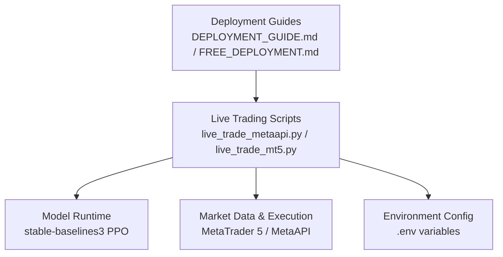
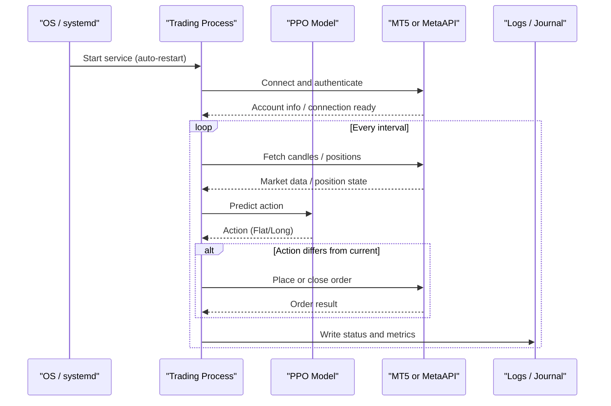
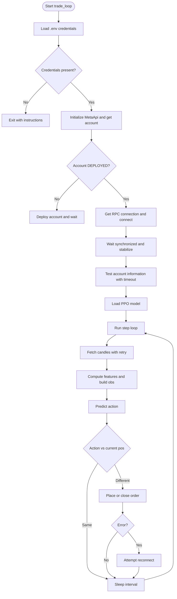
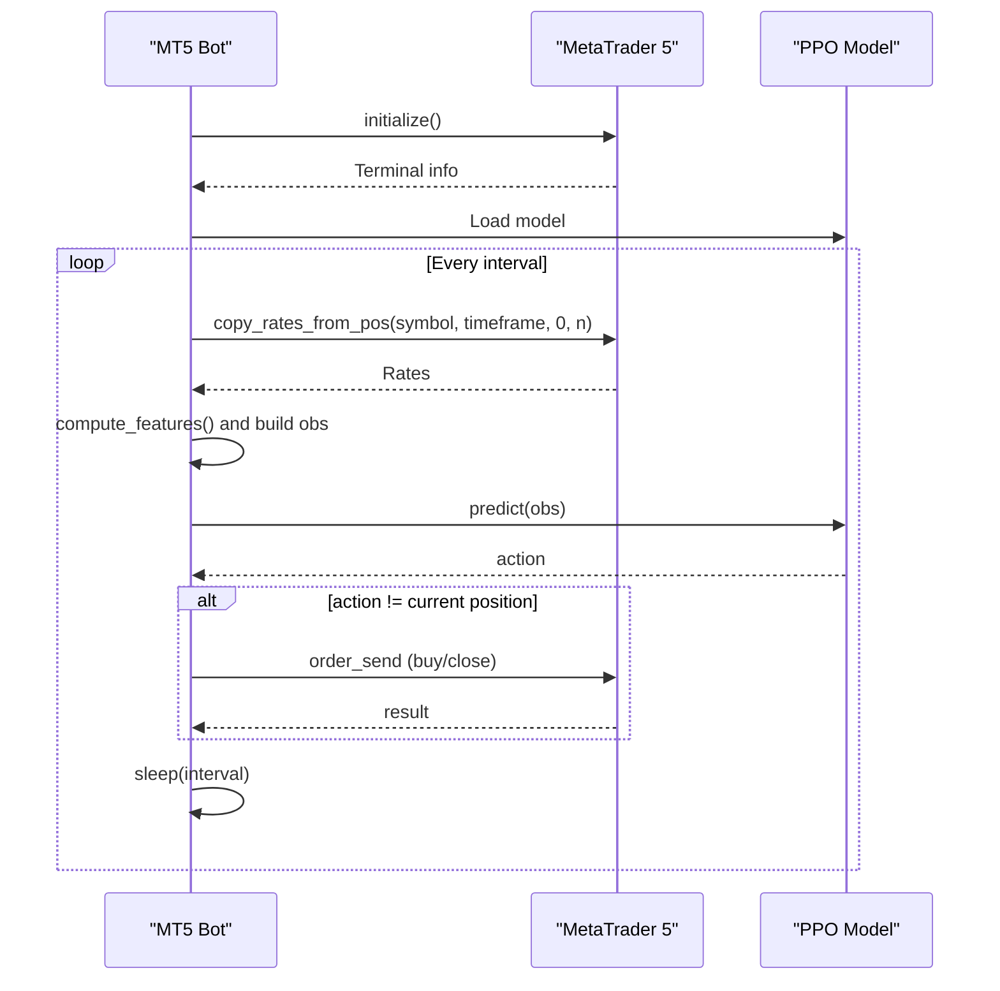
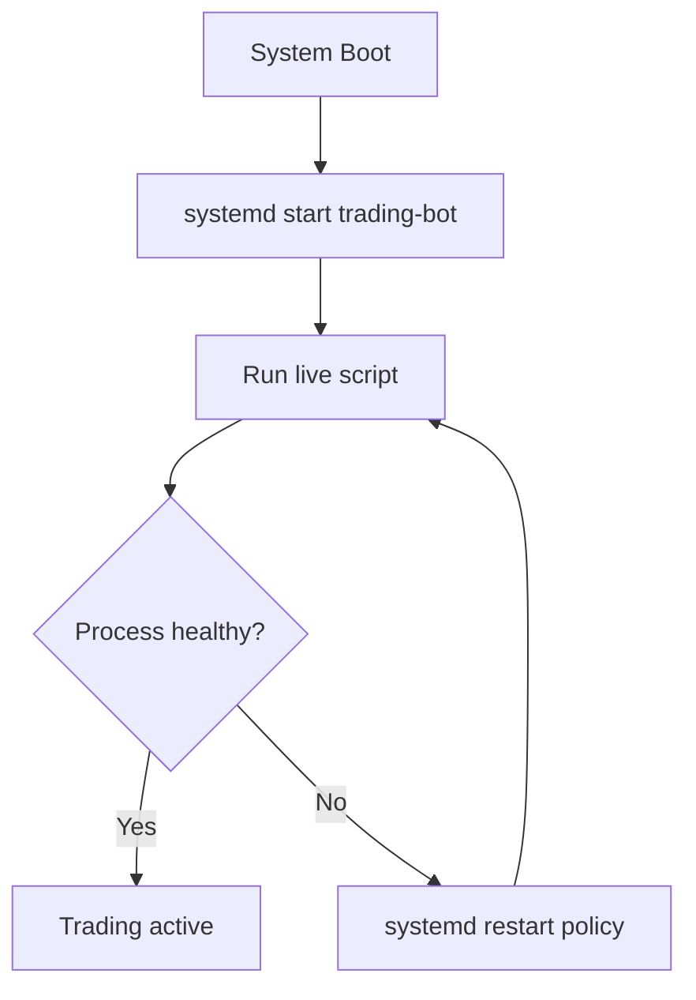
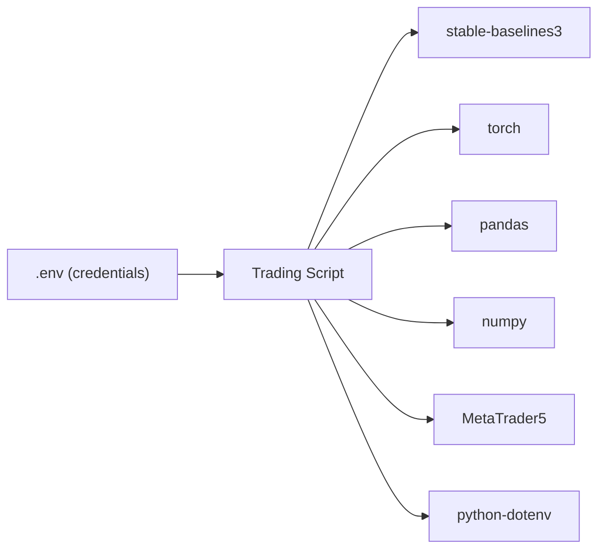

# Production Deployment

<cite>
**Referenced Files in This Document**
- [DEPLOYMENT_GUIDE.md](file://DEPLOYMENT_GUIDE.md)
- [FREE_DEPLOYMENT.md](file://FREE_DEPLOYMENT.md)
- [README.md](file://README.md)
- [SECURITY.md](file://SECURITY.md)
- [requirements.txt](file://requirements.txt)
- [live_trade_metaapi.py](file://live/live_trade_metaapi.py)
- [live_trade_mt5.py](file://live/live_trade_mt5.py)
</cite>

## Table of Contents
1. Introduction
2. Project Structure
3. Core Components
4. Architecture Overview
5. Detailed Component Analysis
6. Dependency Analysis
7. Performance Considerations
8. Troubleshooting Guide
9. Conclusion
10. Appendices

## Introduction
This document provides comprehensive production deployment guidance for the autonomous trading system, covering both paid and free deployment options. It details server requirements, environment configuration, containerization strategies, monitoring and logging, scaling considerations, backup and recovery, and security practices. The goal is to enable reliable 24/7 operation with secure credential management and robust operational controls.

## Project Structure
The repository includes live trading scripts, training and evaluation modules, feature engineering, and deployment guides. For production, the primary entry points are the live trading scripts that connect to either MetaTrader 5 or MetaAPI. Deployment documentation outlines cloud providers (AWS Lightsail, DigitalOcean, Google Cloud Free Tier), local execution on macOS, and service management via systemd.

**Diagram sources**
- [DEPLOYMENT_GUIDE.md:1-192](file://DEPLOYMENT_GUIDE.md#L1-L192)
- [FREE_DEPLOYMENT.md:1-360](file://FREE_DEPLOYMENT.md#L1-L360)
- [live_trade_metaapi.py:1-231](file://live/live_trade_metaapi.py#L1-L231)
- [live_trade_mt5.py:1-174](file://live/live_trade_mt5.py#L1-L174)

**Section sources**
- [DEPLOYMENT_GUIDE.md:1-192](file://DEPLOYMENT_GUIDE.md#L1-L192)
- [FREE_DEPLOYMENT.md:1-360](file://FREE_DEPLOYMENT.md#L1-L360)
- [README.md:219-262](file://README.md#L219-L262)

## Core Components
- Live trading engines:
  - MetaAPI-based async loop with retry logic, account deployment checks, connection stabilization, and model inference.
  - MT5-based synchronous loop using the MetaTrader 5 Python API for data retrieval and order execution.
- Model runtime:
  - Loads a trained PPO model from disk and performs deterministic predictions per cycle.
- Environment configuration:
  - Credentials loaded from environment variables via python-dotenv; .env must be excluded from version control.
- System integration:
  - systemd services for auto-start and restart policies on Linux servers.

Key responsibilities:
- Data acquisition and feature computation prior to inference.
- Position state awareness to avoid redundant orders.
- Robust error handling and reconnection logic for network and broker connectivity.
- Logging and observability through standard output and OS-level logs.

**Section sources**
- [live_trade_metaapi.py:23-39](file://live/live_trade_metaapi.py#L23-L39)
- [live_trade_metaapi.py:40-86](file://live/live_trade_metaapi.py#L40-L86)
- [live_trade_metaapi.py:100-134](file://live/live_trade_metaapi.py#L100-L134)
- [live_trade_metaapi.py:135-231](file://live/live_trade_metaapi.py#L135-L231)
- [live_trade_mt5.py:10-19](file://live/live_trade_mt5.py#L10-L19)
- [live_trade_mt5.py:21-30](file://live/live_trade_mt5.py#L21-L30)
- [live_trade_mt5.py:32-96](file://live/live_trade_mt5.py#L32-L96)
- [live_trade_mt5.py:97-174](file://live/live_trade_mt5.py#L97-L174)
- [SECURITY.md:23-68](file://SECURITY.md#L23-L68)
- [README.md:264-292](file://README.md#L264-L292)

## Architecture Overview
The production architecture centers on a long-running process that periodically fetches market data, computes features, runs model inference, and executes trades via either MetaTrader 5 or MetaAPI. On Linux servers, systemd ensures automatic startup and restarts on failure. Monitoring uses OS journaling and application logs.

**Diagram sources**
- [DEPLOYMENT_GUIDE.md:37-68](file://DEPLOYMENT_GUIDE.md#L37-L68)
- [FREE_DEPLOYMENT.md:145-183](file://FREE_DEPLOYMENT.md#L145-L183)
- [live_trade_metaapi.py:135-231](file://live/live_trade_metaapi.py#L135-L231)
- [live_trade_mt5.py:111-174](file://live/live_trade_mt5.py#L111-L174)

## Detailed Component Analysis

### MetaAPI Live Trading Engine
- Environment-driven credentials: loads METAAPI_TOKEN and METAAPI_ACCOUNT_ID from .env.
- Async lifecycle: deploys account if needed, waits for synchronization, tests connection with retries.
- Data pipeline: fetches historical candles with timeout and retry, computes features, builds observation vector including current position.
- Execution: opens long or closes existing long based on model action; handles errors and reconnection attempts.
- Observability: prints timestamps, actions, and order results; suppresses noisy SDK logs.

**Diagram sources**
- [live_trade_metaapi.py:23-39](file://live/live_trade_metaapi.py#L23-L39)
- [live_trade_metaapi.py:40-86](file://live/live_trade_metaapi.py#L40-L86)
- [live_trade_metaapi.py:100-134](file://live/live_trade_metaapi.py#L100-L134)
- [live_trade_metaapi.py:135-231](file://live/live_trade_metaapi.py#L135-L231)

**Section sources**
- [live_trade_metaapi.py:23-39](file://live/live_trade_metaapi.py#L23-L39)
- [live_trade_metaapi.py:40-86](file://live/live_trade_metaapi.py#L40-L86)
- [live_trade_metaapi.py:100-134](file://live/live_trade_metaapi.py#L100-L134)
- [live_trade_metaapi.py:135-231](file://live/live_trade_metaapi.py#L135-L231)

### MT5 Live Trading Engine
- Synchronous loop using MetaTrader 5 Python API.
- Data retrieval: copies rates from MT5 terminal into a DataFrame.
- Feature computation and observation construction similar to MetaAPI engine.
- Execution: sends buy orders or closes positions based on model action; uses deviation and magic number tagging.
- Lifecycle: initializes MT5, loads model, loops with periodic sleep.

**Diagram sources**
- [live_trade_mt5.py:111-174](file://live/live_trade_mt5.py#L111-L174)
- [live_trade_mt5.py:21-30](file://live/live_trade_mt5.py#L21-L30)
- [live_trade_mt5.py:32-96](file://live/live_trade_mt5.py#L32-L96)

**Section sources**
- [live_trade_mt5.py:10-19](file://live/live_trade_mt5.py#L10-L19)
- [live_trade_mt5.py:21-30](file://live/live_trade_mt5.py#L21-L30)
- [live_trade_mt5.py:32-96](file://live/live_trade_mt5.py#L32-L96)
- [live_trade_mt5.py:97-174](file://live/live_trade_mt5.py#L97-L174)

### Service Management and Auto-Start
- systemd unit files ensure the bot starts on boot and restarts automatically on failure.
- Logs are accessible via journalctl; status checks via systemctl.
- Both paid (AWS Lightsail, DigitalOcean) and free (Google Cloud e2-micro) deployments use the same service pattern.

**Diagram sources**
- [DEPLOYMENT_GUIDE.md:37-68](file://DEPLOYMENT_GUIDE.md#L37-L68)
- [FREE_DEPLOYMENT.md:145-183](file://FREE_DEPLOYMENT.md#L145-L183)

**Section sources**
- [DEPLOYMENT_GUIDE.md:37-68](file://DEPLOYMENT_GUIDE.md#L37-L68)
- [FREE_DEPLOYMENT.md:145-183](file://FREE_DEPLOYMENT.md#L145-L183)

## Dependency Analysis
- Runtime dependencies include stable-baselines3, torch, gymnasium, pandas, numpy, MetaTrader5, tqdm, and python-dotenv. Optional packages support data fetching, visualization, and advanced analytics.
- The live scripts depend on these libraries for model loading, data processing, and platform integrations.

**Diagram sources**
- [requirements.txt:1-29](file://requirements.txt#L1-L29)
- [live_trade_metaapi.py:1-10](file://live/live_trade_metaapi.py#L1-L10)
- [live_trade_mt5.py:1-10](file://live/live_trade_mt5.py#L1-L10)

**Section sources**
- [requirements.txt:1-29](file://requirements.txt#L1-L29)
- [README.md:248-262](file://README.md#L248-L262)

## Performance Considerations
- Resource usage: The system primarily performs periodic data fetches, feature computation, and single-model inference. Low CPU and modest RAM are typically sufficient for one instance.
- Latency: Network timeouts and retries are implemented; ensure low-latency connectivity to brokers and data sources.
- Concurrency: The MetaAPI engine uses asyncio for non-blocking operations; MT5 engine is synchronous but lightweight.
- Scaling: For high-frequency scenarios, consider multiple isolated instances behind a load balancer distributing by symbol or strategy, each with its own model and credentials. Ensure broker rate limits and account constraints are respected.
- Storage: Persistent disks store models and logs; monitor disk usage and rotate logs to prevent exhaustion.

[No sources needed since this section provides general guidance]

## Troubleshooting Guide
- Service not running:
  - Check status and logs with systemctl and journalctl.
  - Verify .env file presence and permissions.
- Connection issues:
  - The MetaAPI engine includes retries and reconnection logic; confirm network access and correct credentials.
  - MT5 requires an active terminal session; ensure MT5 is installed and configured on the host.
- Out of disk space:
  - Clean up old logs and unused packages; monitor disk usage regularly.
- Credential problems:
  - Rotate compromised keys immediately; update .env and restart the service.

**Section sources**
- [DEPLOYMENT_GUIDE.md:137-158](file://DEPLOYMENT_GUIDE.md#L137-L158)
- [FREE_DEPLOYMENT.md:186-217](file://FREE_DEPLOYMENT.md#L186-L217)
- [FREE_DEPLOYMENT.md:303-334](file://FREE_DEPLOYMENT.md#L303-L334)
- [SECURITY.md:70-84](file://SECURITY.md#L70-L84)
- [live_trade_metaapi.py:170-197](file://live/live_trade_metaapi.py#L170-L197)
- [live_trade_mt5.py:111-119](file://live/live_trade_mt5.py#L111-L119)

## Conclusion
This deployment guide enables reliable production operation of the autonomous trading system across paid and free cloud environments. By following the provided steps for server setup, environment configuration, service management, and security practices, you can achieve resilient 24/7 trading with robust monitoring and recovery mechanisms. Adhering to the recommended scaling and maintenance procedures will help maintain performance and compliance over time.

[No sources needed since this section summarizes without analyzing specific files]

## Appendices

### Paid Deployment Options
- AWS Lightsail:
  - Create Ubuntu 22.04 LTS instance; minimum 512 MB RAM and 1 vCPU recommended.
  - Upload code, set up systemd service, manage via systemctl and journalctl.
- DigitalOcean:
  - Similar steps to Lightsail; choose closest datacenter for latency.

**Section sources**
- [DEPLOYMENT_GUIDE.md:3-86](file://DEPLOYMENT_GUIDE.md#L3-L86)

### Free Deployment Option
- Google Cloud Free Tier:
  - Use e2-micro instance in eligible regions; persistent disk included.
  - Install Python 3.12, create virtual environment, install dependencies, upload code, configure systemd service.
  - Monitor VM status and free tier usage via Google Cloud Console.

**Section sources**
- [FREE_DEPLOYMENT.md:1-141](file://FREE_DEPLOYMENT.md#L1-L141)
- [FREE_DEPLOYMENT.md:145-183](file://FREE_DEPLOYMENT.md#L145-L183)
- [FREE_DEPLOYMENT.md:260-278](file://FREE_DEPLOYMENT.md#L260-L278)

### Local Execution (macOS)
- Use screen or nohup to keep the process running after closing the terminal.
- Manage logs and processes via standard macOS tools.

**Section sources**
- [DEPLOYMENT_GUIDE.md:101-133](file://DEPLOYMENT_GUIDE.md#L101-L133)

### Environment Configuration and API Key Management
- Create .env from .env.example; populate METAAPI_TOKEN and METAAPI_ACCOUNT_ID.
- Keep .env out of version control; restrict file permissions on servers.
- For Docker, pass secrets via --env-file; for cloud platforms, use platform-specific secret managers.

**Section sources**
- [README.md:264-292](file://README.md#L264-L292)
- [SECURITY.md:23-68](file://SECURITY.md#L23-L68)
- [SECURITY.md:79-84](file://SECURITY.md#L79-L84)

### Containerization Strategy
- Build a minimal image with required Python dependencies and the trading script.
- Inject credentials at runtime using environment variables or mounted secret files.
- Configure health checks and restart policies in your container orchestrator.

[No sources needed since this section provides general guidance]

### Monitoring and Logging
- Use systemd journalctl for centralized logs; tail logs in real-time during troubleshooting.
- Implement application-level logging for key events: connection status, model predictions, order results, and errors.
- Set up alerts for critical failures and resource exhaustion.

**Section sources**
- [DEPLOYMENT_GUIDE.md:137-158](file://DEPLOYMENT_GUIDE.md#L137-L158)
- [FREE_DEPLOYMENT.md:186-217](file://FREE_DEPLOYMENT.md#L186-L217)

### Backup and Recovery
- Back up trained models, configuration files, and logs regularly.
- Store backups securely offsite; test restoration procedures periodically.
- Maintain runbooks for disaster recovery, including credential rotation and service restarts.

[No sources needed since this section provides general guidance]

### Security Considerations
- Firewall configuration: restrict inbound ports to necessary services only.
- Access controls: use SSH keys, limit user privileges, and enforce least privilege.
- Audit logging: enable OS and application audit logs; review regularly for anomalies.
- Compliance: follow organizational policies for secret management and incident response.

**Section sources**
- [SECURITY.md:113-133](file://SECURITY.md#L113-L133)
- [SECURITY.md:150-163](file://SECURITY.md#L150-L163)