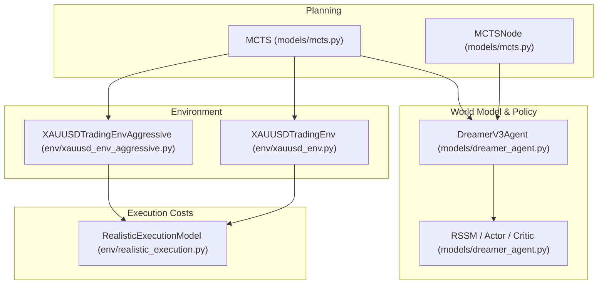
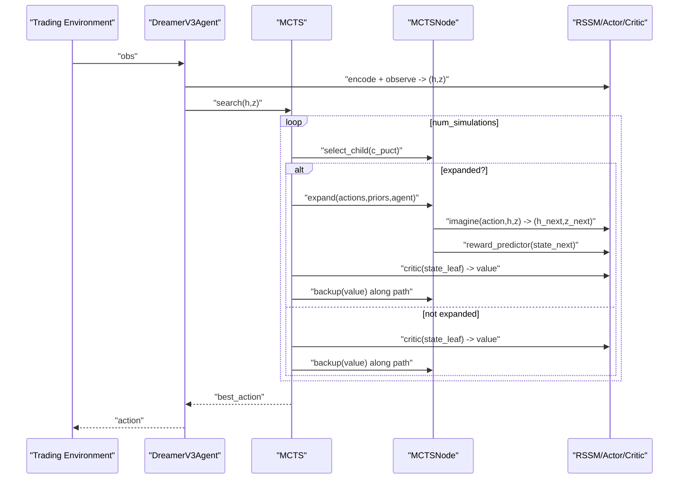
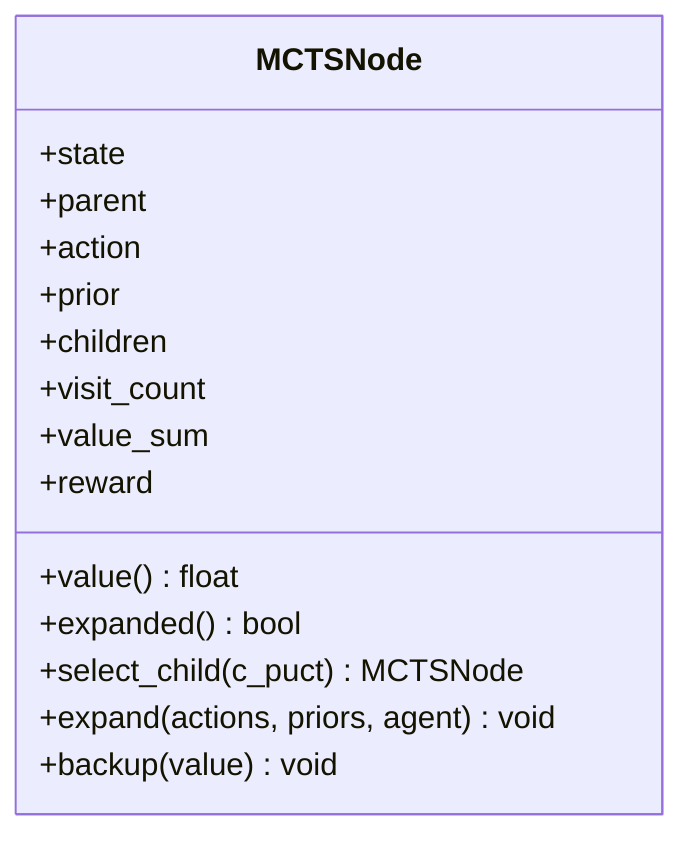
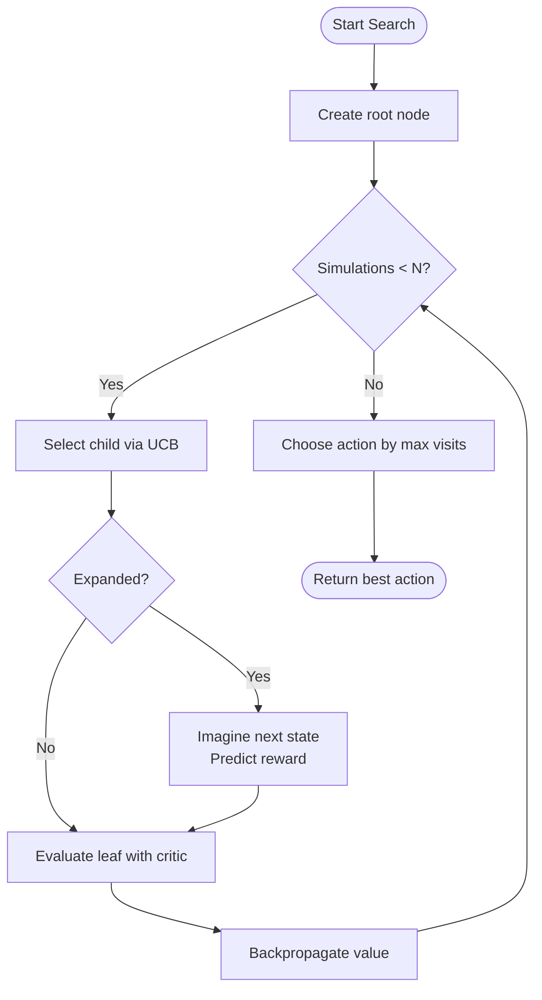
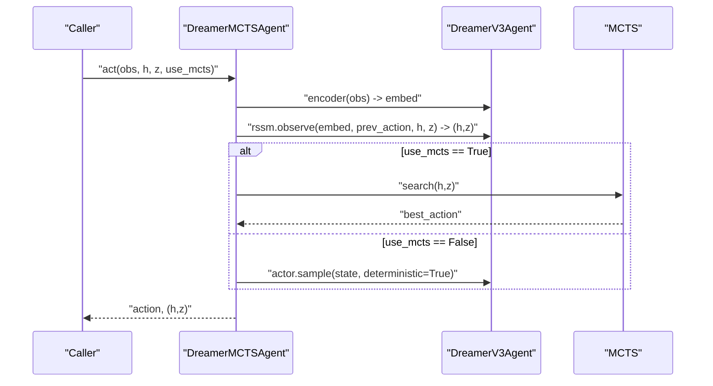
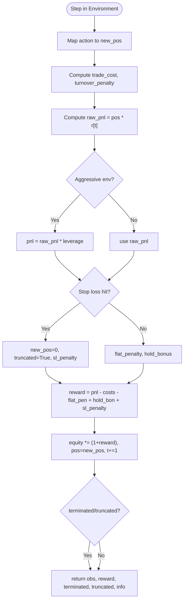
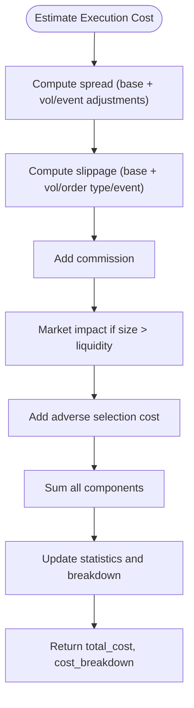
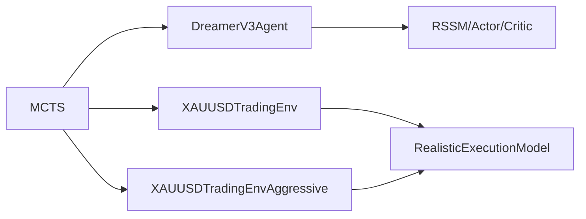

# Decision Optimization (MCTS)

<cite>
**Referenced Files in This Document**
- [models/mcts.py](file://models/mcts.py)
- [env/xauusd_env.py](file://env/xauusd_env.py)
- [env/xauusd_env_aggressive.py](file://env/xauusd_env_aggressive.py)
- [models/dreamer_agent.py](file://models/dreamer_agent.py)
- [env/realistic_execution.py](file://env/realistic_execution.py)
- [README.md](file://README.md)
</cite>

## Table of Contents
1. Introduction
2. Project Structure
3. Core Components
4. Architecture Overview
5. Detailed Component Analysis
6. Dependency Analysis
7. Performance Considerations
8. Troubleshooting Guide
9. Conclusion
10. Appendices

## Introduction
This document explains the Monte Carlo Tree Search (MCTS) implementation used for decision optimization in complex trading scenarios within this project. It covers how MCTS integrates with a DreamerV3-based world model to plan over imagined market futures, how it selects actions using exploration-exploitation trade-offs, and how it interacts with trading environments that model realistic costs and constraints. You will find configuration guidance for search depth, exploration balance, and simulation budget; examples showing how sequences are evaluated; and performance considerations for real-time decision making.

## Project Structure
The MCTS planning layer sits on top of a DreamerV3 agent and interacts with discrete trading environments. The key modules involved are:
- MCTS planning and tree management
- DreamerV3 agent providing world model, policy, and value estimates
- Trading environments defining state representation, action spaces, and reward modeling
- Realistic execution utilities for cost-aware evaluation

**Diagram sources**
- [models/mcts.py:20-116](file://models/mcts.py#L20-L116)
- [models/mcts.py:118-242](file://models/mcts.py#L118-L242)
- [models/dreamer_agent.py:84-188](file://models/dreamer_agent.py#L84-L188)
- [env/xauusd_env.py:7-118](file://env/xauusd_env.py#L7-L118)
- [env/xauusd_env_aggressive.py:6-144](file://env/xauusd_env_aggressive.py#L6-L144)
- [env/realistic_execution.py:24-229](file://env/realistic_execution.py#L24-L229)

**Section sources**
- [models/mcts.py:1-331](file://models/mcts.py#L1-L331)
- [models/dreamer_agent.py:1-200](file://models/dreamer_agent.py#L1-L200)
- [env/xauusd_env.py:1-118](file://env/xauusd_env.py#L1-L118)
- [env/xauusd_env_aggressive.py:1-144](file://env/xauusd_env_aggressive.py#L1-L144)
- [env/realistic_execution.py:1-356](file://env/realistic_execution.py#L1-L356)
- [README.md:475-526](file://README.md#L475-L526)

## Core Components
- MCTSNode: Represents a state-action pair during planning, tracks visit counts, Q-values, immediate rewards, and supports selection via UCB and expansion using the world model.
- MCTS: Orchestrates search iterations (selection, expansion, simulation, backpropagation), returns best action based on visit counts or statistics.
- DreamerMCTSAgent: Wraps a DreamerV3 agent and optionally uses MCTS for action selection at each step.
- Trading Environments: Define observation windows, action spaces, and reward functions including transaction costs, turnover penalties, flat penalties, hold bonuses, leverage, and stop-loss logic.
- Realistic Execution Model: Provides cost estimation for spread, slippage, commissions, market impact, and adverse selection, useful for evaluating strategies under realistic conditions.

**Section sources**
- [models/mcts.py:20-116](file://models/mcts.py#L20-L116)
- [models/mcts.py:118-242](file://models/mcts.py#L118-L242)
- [models/mcts.py:245-291](file://models/mcts.py#L245-L291)
- [env/xauusd_env.py:21-118](file://env/xauusd_env.py#L21-L118)
- [env/xauusd_env_aggressive.py:20-144](file://env/xauusd_env_aggressive.py#L20-L144)
- [env/realistic_execution.py:24-229](file://env/realistic_execution.py#L24-L229)

## Architecture Overview
MCTS plans by simulating futures through the learned world model. At each planning step:
- Selection traverses the tree using UCB to balance exploration and exploitation.
- Expansion imagines next states and predicts immediate rewards using the world model.
- Simulation evaluates leaf nodes with the critic’s value estimate.
- Backpropagation updates ancestors with discounted values.

**Diagram sources**
- [models/mcts.py:145-193](file://models/mcts.py#L145-L193)
- [models/mcts.py:20-116](file://models/mcts.py#L20-L116)
- [models/dreamer_agent.py:148-188](file://models/dreamer_agent.py#L148-L188)

## Detailed Component Analysis

### MCTSNode: State-Action Planning Unit
- Stores latent state (h, z), parent pointer, action taken, prior probability from policy, children map, visit count, value sum, and immediate reward.
- Computes average Q-value safely when unvisited.
- Selects child via UCB: combines Q-value with exploration bonus scaled by priors and visit counts.
- Expands by imagining next states and predicting rewards using the world model.
- Backpropagates values up the tree.

**Diagram sources**
- [models/mcts.py:20-116](file://models/mcts.py#L20-L116)

**Section sources**
- [models/mcts.py:20-116](file://models/mcts.py#L20-L116)

### MCTS: Search Orchestrator
- Initializes with agent, number of simulations, exploration constant c_puct, and discount factor gamma.
- Defines action set (e.g., flat/long; extended to include short in other contexts).
- Runs search loop:
  - Selection: traverse to leaf using UCB.
  - Expansion: get policy priors from actor, imagine next states, predict rewards.
  - Simulation: evaluate leaf with critic.
  - Backpropagation: update ancestors with discounted values.
- Returns best action by highest visit count; also provides stats method returning visit counts, Q-values, expected rewards.

**Diagram sources**
- [models/mcts.py:145-193](file://models/mcts.py#L145-L193)
- [models/mcts.py:195-242](file://models/mcts.py#L195-L242)

**Section sources**
- [models/mcts.py:118-242](file://models/mcts.py#L118-L242)

### DreamerMCTSAgent: Integration Wrapper
- Encodes observations, maintains latent state (h, z), and either uses MCTS planning or direct actor sampling.
- When MCTS is enabled, passes (h, z) to MCTS to select the best action; otherwise samples deterministically from the actor.

**Diagram sources**
- [models/mcts.py:245-291](file://models/mcts.py#L245-L291)
- [models/dreamer_agent.py:148-188](file://models/dreamer_agent.py#L148-L188)

**Section sources**
- [models/mcts.py:245-291](file://models/mcts.py#L245-L291)
- [models/dreamer_agent.py:84-188](file://models/dreamer_agent.py#L84-L188)

### Trading Environments: State Representation and Reward Modeling
- XAUUSDTradingEnv (long-only):
  - Observation: windowed features plus current position indicator.
  - Actions: Flat or Long.
  - Reward: PnL from previous position minus trade costs, turnover penalty, flat penalty, plus hold bonus.
  - Tracks equity and terminates at horizon or max steps.
- XAUUSDTradingEnvAggressive (long/short):
  - Observation: wider window features plus position (-1, 0, 1).
  - Actions: Short, Flat, Long.
  - Reward: Leverage-adjusted PnL minus costs, plus auxiliary bonuses/penalties; includes stop-loss logic that forces exit and truncation upon breach.

**Diagram sources**
- [env/xauusd_env.py:75-118](file://env/xauusd_env.py#L75-L118)
- [env/xauusd_env_aggressive.py:86-144](file://env/xauusd_env_aggressive.py#L86-L144)

**Section sources**
- [env/xauusd_env.py:21-118](file://env/xauusd_env.py#L21-L118)
- [env/xauusd_env_aggressive.py:20-144](file://env/xauusd_env_aggressive.py#L20-L144)

### Realistic Execution Model: Cost-Aware Evaluation
- Models spread widening, slippage scaling with volatility, commissions, market impact, and adverse selection.
- Estimates total execution cost and adjusts fill price accordingly.
- Useful for validating strategy robustness under realistic trading frictions.

**Diagram sources**
- [env/realistic_execution.py:88-169](file://env/realistic_execution.py#L88-L169)

**Section sources**
- [env/realistic_execution.py:24-229](file://env/realistic_execution.py#L24-L229)

## Dependency Analysis
- MCTS depends on the DreamerV3 agent for:
  - World model imagination (RSSM) to generate next latent states.
  - Policy network to obtain action priors.
  - Critic to evaluate leaf values.
- MCTSNode expands using the agent’s world model and reward predictor.
- Environments provide discrete action spaces and reward signals; aggressive environment adds leverage and stop-loss behavior.
- Realistic execution model can be used alongside environments to simulate practical costs.

**Diagram sources**
- [models/mcts.py:118-242](file://models/mcts.py#L118-L242)
- [models/dreamer_agent.py:84-188](file://models/dreamer_agent.py#L84-L188)
- [env/xauusd_env.py:7-118](file://env/xauusd_env.py#L7-L118)
- [env/xauusd_env_aggressive.py:6-144](file://env/xauusd_env_aggressive.py#L6-L144)
- [env/realistic_execution.py:24-229](file://env/realistic_execution.py#L24-L229)

**Section sources**
- [models/mcts.py:118-242](file://models/mcts.py#L118-L242)
- [models/dreamer_agent.py:84-188](file://models/dreamer_agent.py#L84-L188)
- [env/xauusd_env.py:7-118](file://env/xauusd_env.py#L7-L118)
- [env/xauusd_env_aggressive.py:6-144](file://env/xauusd_env_aggressive.py#L6-L144)
- [env/realistic_execution.py:24-229](file://env/realistic_execution.py#L24-L229)

## Performance Considerations
- Computational efficiency:
  - Number of simulations controls planning depth and runtime; increase cautiously for better quality but higher latency.
  - C_puct tunes exploration vs exploitation; higher values encourage exploring less-visited actions.
  - Discount factor gamma influences how far ahead values are propagated; typical values around 0.99 align with long-horizon objectives.
- Memory management:
  - Tree growth is bounded per search iteration; avoid retaining large trees across steps unless needed for analysis.
  - Reuse agent and world model instances; batch operations where possible.
- Real-time decision making:
  - For low-latency needs, consider reducing num_simulations or falling back to direct actor sampling when MCTS is too slow.
  - Use CPU/GPU device placement appropriately; ensure tensors are moved efficiently.
- Validation techniques:
  - Compare MCTS-selected actions against baseline policies using visit counts and Q-values.
  - Evaluate strategies with realistic execution costs to assess robustness.
  - Monitor performance across different market regimes (calm vs volatile) and adjust parameters accordingly.

[No sources needed since this section provides general guidance]

## Troubleshooting Guide
- MCTS not selecting any action:
  - Ensure actions list matches environment action space; verify priors are computed correctly from the actor.
  - Check that the agent’s device and tensor shapes are consistent during imagine and critic calls.
- Poor search quality:
  - Increase num_simulations to allow more thorough exploration.
  - Tune c_puct to balance exploration; too low may exploit prematurely, too high may waste simulations on unlikely actions.
  - Validate world model predictions; check reward predictor outputs and critic values for stability.
- Environment issues:
  - Confirm observation window and feature dimensions match expectations.
  - Verify reward components (costs, penalties, bonuses) are configured appropriately for your strategy.
  - In aggressive mode, ensure stop-loss thresholds are reasonable to avoid frequent truncations.

**Section sources**
- [models/mcts.py:145-193](file://models/mcts.py#L145-L193)
- [models/mcts.py:20-116](file://models/mcts.py#L20-L116)
- [env/xauusd_env.py:21-118](file://env/xauusd_env.py#L21-L118)
- [env/xauusd_env_aggressive.py:20-144](file://env/xauusd_env_aggressive.py#L20-L144)

## Conclusion
The MCTS implementation provides a principled planning mechanism for trading decisions by leveraging a learned world model to simulate future market states. Through UCB-based selection, expansion via imagination, and backpropagation of discounted values, MCTS identifies promising actions while balancing exploration and exploitation. Integrated with flexible trading environments and realistic execution cost modeling, it supports robust strategy development and evaluation. Proper tuning of simulation budget, exploration constant, and discount factor enables adaptation to diverse market conditions and trading strategies.

[No sources needed since this section summarizes without analyzing specific files]

## Appendices

### Configuration Parameters Summary
- num_simulations: Controls search budget; higher improves planning quality but increases compute time.
- c_puct: Exploration constant; increases exploration of less-visited actions.
- gamma: Discount factor for backpropagation; typically near 0.99 for long-term objectives.
- Action sets:
  - Long-only: Flat, Long.
  - Aggressive: Short, Flat, Long.
- Environment-specific settings:
  - Window sizes, cost_per_trade, turnover_coef, flat_penalty, hold_bonus, leverage, stop_loss_pct.

**Section sources**
- [models/mcts.py:126-143](file://models/mcts.py#L126-L143)
- [env/xauusd_env.py:21-45](file://env/xauusd_env.py#L21-L45)
- [env/xauusd_env_aggressive.py:20-50](file://env/xauusd_env_aggressive.py#L20-L50)

### Example: Evaluating Trading Sequences with MCTS
- At each step, MCTS builds a tree of imagined futures using the world model.
- Each branch represents a sequence of actions; leaf values reflect predicted cumulative returns adjusted by costs and risks.
- Visit counts indicate which actions lead to more promising trajectories; Q-values summarize expected outcomes.
- Use search_with_stats to inspect visit_counts, q_values, and expected_rewards for interpretability.

**Section sources**
- [models/mcts.py:195-242](file://models/mcts.py#L195-L242)

### Example: Considering Future State Transitions
- Expansion uses RSSM.imagine to transition latent states given candidate actions.
- Immediate rewards are predicted via reward_predictor, enabling short-horizon feedback.
- Backpropagation accumulates discounted values, allowing longer-horizon planning effects to influence earlier decisions.

**Section sources**
- [models/mcts.py:72-103](file://models/mcts.py#L72-L103)
- [models/mcts.py:105-116](file://models/mcts.py#L105-L116)

### Example: Optimizing Entry/Exit Timing
- In long-only environment, actions switch between Flat and Long; MCTS evaluates timing by comparing expected returns versus costs and penalties.
- In aggressive environment, actions include Short; stop-loss logic enforces risk control and can truncate episodes to teach safety.
- Realistic execution costs help penalize frequent or costly trades, encouraging stable and profitable timing.

**Section sources**
- [env/xauusd_env.py:75-118](file://env/xauusd_env.py#L75-L118)
- [env/xauusd_env_aggressive.py:86-144](file://env/xauusd_env_aggressive.py#L86-L144)
- [env/realistic_execution.py:88-169](file://env/realistic_execution.py#L88-L169)

### Guidance: Tuning MCTS for Different Market Conditions
- Calm markets: Lower num_simulations may suffice; moderate c_puct to favor exploitation.
- Volatile markets: Increase num_simulations; raise c_puct to explore alternative exits or hedges; consider tighter stop-loss thresholds in aggressive mode.
- Strategy-specific tuning:
  - Mean-reversion: Emphasize shorter horizons and lower gamma.
  - Trend-following: Use higher gamma and larger windows to capture sustained moves.
- Validation:
  - Compare MCTS vs baseline policies using out-of-sample backtests.
  - Use realistic execution costs to ensure strategies survive frictions.
  - Monitor metrics like Sharpe ratio, drawdown, win rate, and profit factor.

**Section sources**
- [env/xauusd_env_aggressive.py:20-50](file://env/xauusd_env_aggressive.py#L20-L50)
- [env/realistic_execution.py:75-86](file://env/realistic_execution.py#L75-L86)
- [README.md:538-575](file://README.md#L538-L575)