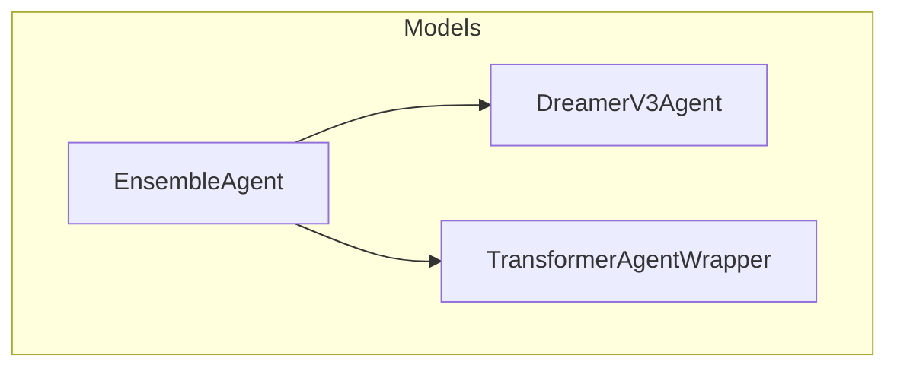
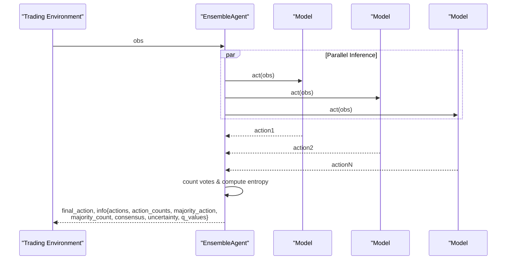
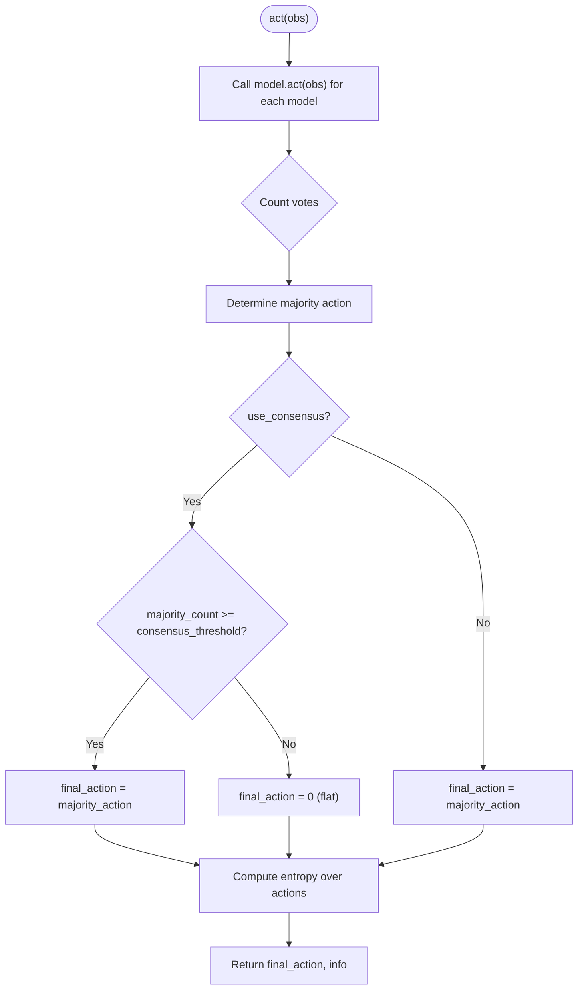
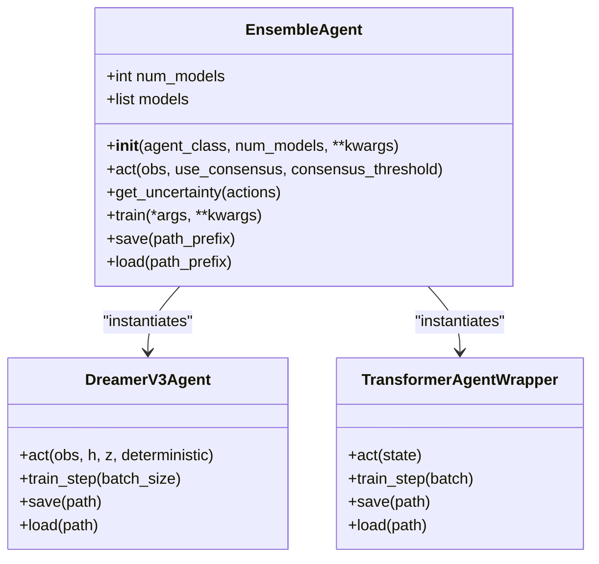

# Ensemble Methods

<cite>
**Referenced Files in This Document**
- [ensemble.py](file://models/ensemble.py)
- [dreamer_agent.py](file://models/dreamer_agent.py)
- [transformer_policy.py](file://models/transformer_policy.py)
</cite>

## Table of Contents
1. [Introduction](#introduction)
2. [Project Structure](#project-structure)
3. [Core Components](#core-components)
4. [Architecture Overview](#architecture-overview)
5. [Detailed Component Analysis](#detailed-component-analysis)
6. [Dependency Analysis](#dependency-analysis)
7. [Performance Considerations](#performance-considerations)
8. [Troubleshooting Guide](#troubleshooting-guide)
9. [Conclusion](#conclusion)
10. [Appendices](#appendices)

## Introduction
This document explains the ensemble methods component that combines multiple trading models to improve robustness, reduce overfitting, and provide uncertainty estimates through consensus-based decision making. The core is the EnsembleAgent class, which instantiates several agents with different random seeds and slight architectural variations, aggregates their actions via voting, and uses disagreement as a measure of uncertainty. It also documents save/load functionality for managing multiple model states and provides practical guidance for configuring ensemble size, consensus thresholds, and individual model parameters.

## Project Structure
The ensemble system lives under the models package and integrates with other agent implementations:
- EnsembleAgent orchestrates multiple agents and handles voting and uncertainty estimation.
- DreamerV3Agent and TransformerAgentWrapper are example agents that can be ensembled; they implement act(), train(), and save()/load() interfaces required by the ensemble.

**Diagram sources**
- [ensemble.py:27-180](file://models/ensemble.py#L27-L180)
- [dreamer_agent.py:84-188](file://models/dreamer_agent.py#L84-L188)
- [transformer_policy.py:252-372](file://models/transformer_policy.py#L252-L372)

**Section sources**
- [ensemble.py:1-180](file://models/ensemble.py#L1-L180)
- [dreamer_agent.py:84-188](file://models/dreamer_agent.py#L84-L188)
- [transformer_policy.py:252-372](file://models/transformer_policy.py#L252-L372)

## Core Components
- EnsembleAgent: Manages an ensemble of N agents, creates diversity via seeds and small architecture tweaks, performs action voting, computes uncertainty from disagreement, and delegates training/saving/loading to each model.
- Individual Agents (examples):
  - DreamerV3Agent: Implements act(), train(), save(), load().
  - TransformerAgentWrapper: Implements act(), save(), load() and can be used as a policy head replacement within DreamerV3 or standalone.

Key responsibilities:
- Diversity creation: Different seeds and hidden_dim offsets per model.
- Voting: Majority vote with optional consensus gating.
- Uncertainty: Entropy over action distribution across models.
- Persistence: Save/load all models with indexed filenames.

**Section sources**
- [ensemble.py:27-180](file://models/ensemble.py#L27-L180)
- [dreamer_agent.py:84-188](file://models/dreamer_agent.py#L84-L188)
- [transformer_policy.py:252-372](file://models/transformer_policy.py#L252-L372)

## Architecture Overview
The ensemble wraps any compatible agent class. During inference, it calls each model’s act(obs), optionally retrieves Q-values if available, counts votes, applies consensus rules, and returns the final action along with rich diagnostics.

**Diagram sources**
- [ensemble.py:67-130](file://models/ensemble.py#L67-L130)

## Detailed Component Analysis

### EnsembleAgent Class
Responsibilities:
- Initialization: Creates N models with distinct seeds and slight architectural variation (e.g., hidden_dim offset).
- Action selection: Calls each model.act(obs), collects actions and optional Q-values, counts votes, applies consensus threshold, and returns final action plus detailed info.
- Uncertainty estimation: Computes entropy over the distribution of actions across models.
- Training and persistence: Delegates to each model’s train(), save(), load().

Configuration examples:
- Ensemble size: num_models controls how many agents are instantiated.
- Consensus threshold: consensus_threshold sets the minimum number of agreeing models required to trade when use_consensus=True.
- Model parameters: Pass kwargs to agent_class; the ensemble slightly varies some parameters (e.g., hidden_dim) to encourage diversity.

Behavioral notes:
- If consensus is not met and use_consensus=True, the ensemble returns a flat action (no position).
- Info dict includes per-model actions, vote counts, majority details, consensus flag, uncertainty, and optional Q-values.

**Diagram sources**
- [ensemble.py:67-130](file://models/ensemble.py#L67-L130)
- [ensemble.py:132-154](file://models/ensemble.py#L132-L154)

**Section sources**
- [ensemble.py:27-180](file://models/ensemble.py#L27-L180)

### Integrating with DreamerV3Agent
- The ensemble can wrap DreamerV3Agent instances. Each instance will have its own world model and actor-critic components.
- DreamerV3Agent implements act(), train(), save(), load(), enabling full lifecycle management within the ensemble.

Usage pattern:
- Instantiate EnsembleAgent with agent_class=DreamerV3Agent and pass Dreamer-specific hyperparameters (e.g., obs_dim, action_dim, device, hidden_dim).
- Train each model independently using ensemble.train(...).
- Save/load all models via ensemble.save(path_prefix)/ensemble.load(path_prefix), which writes one file per model.

**Section sources**
- [dreamer_agent.py:84-188](file://models/dreamer_agent.py#L84-L188)
- [dreamer_agent.py:405-427](file://models/dreamer_agent.py#L405-L427)
- [ensemble.py:156-180](file://models/ensemble.py#L156-L180)

### Integrating with TransformerAgentWrapper
- TransformerAgentWrapper provides a transformer-based actor/critic and supports act(), save(), load().
- It can be used directly in an ensemble or as a replacement for MLP heads in DreamerV3.

Usage pattern:
- Instantiate EnsembleAgent with agent_class=TransformerAgentWrapper and pass state_dim, action_dim, hidden_dim, num_heads, num_layers, seq_len.
- Use ensemble.act(obs) to get consensus-driven actions and uncertainty.

**Section sources**
- [transformer_policy.py:252-372](file://models/transformer_policy.py#L252-L372)
- [ensemble.py:27-180](file://models/ensemble.py#L27-L180)

### Voting and Uncertainty Mechanics
- Voting: Counts occurrences of each discrete action and selects the majority. When consensus is enforced, only proceed if the majority meets the threshold; otherwise return a flat action.
- Uncertainty: Entropy computed over the empirical distribution of actions across models. Higher entropy indicates more disagreement and higher uncertainty.

Practical tips:
- Increase consensus_threshold to be more conservative (fewer trades, fewer false positives).
- Monitor uncertainty to avoid trading during high-disagreement regimes.

**Section sources**
- [ensemble.py:67-154](file://models/ensemble.py#L67-L154)

## Dependency Analysis
- EnsembleAgent depends on any agent class implementing:
  - act(obs) -> action
  - Optional get_q_value(obs, action) -> float
  - train(*args, **kwargs)
  - save(path), load(path)
- Example integrations:
  - DreamerV3Agent: Full RL agent with world model and actor-critic.
  - TransformerAgentWrapper: Transformer-based policy with sequence handling.

**Diagram sources**
- [ensemble.py:27-180](file://models/ensemble.py#L27-L180)
- [dreamer_agent.py:84-188](file://models/dreamer_agent.py#L84-L188)
- [transformer_policy.py:252-372](file://models/transformer_policy.py#L252-L372)

**Section sources**
- [ensemble.py:27-180](file://models/ensemble.py#L27-L180)
- [dreamer_agent.py:84-188](file://models/dreamer_agent.py#L84-L188)
- [transformer_policy.py:252-372](file://models/transformer_policy.py#L252-L372)

## Performance Considerations
- Real-time inference:
  - Parallelism: Run model.act(obs) calls concurrently across models to reduce latency.
  - Device placement: Ensure models are on the same device (e.g., GPU) to minimize data transfer overhead.
  - Batch vs. single-step: For transformers, maintain minimal sequence buffers to avoid excessive memory usage.
- Memory footprint:
  - Each model stores its own weights; total memory scales linearly with ensemble size.
- Throughput:
  - Larger ensembles increase throughput requirements; consider reducing num_models or using smaller architectures for low-latency environments.
- Caching:
  - If observations repeat frequently, cache recent results to avoid redundant computation.

[No sources needed since this section provides general guidance]

## Troubleshooting Guide
Common issues and remedies:
- No consensus reached often:
  - Lower consensus_threshold or disable use_consensus temporarily to diagnose model behavior.
  - Inspect info['action_counts'] and info['uncertainty'] to understand disagreement patterns.
- High uncertainty:
  - Indicates model disagreement; consider pausing trading or tightening risk controls until uncertainty drops.
- Save/load mismatches:
  - Ensure path_prefix matches the files created by ensemble.save(); verify each model_i.pt exists before loading.
- Agent compatibility:
  - Confirm the chosen agent_class implements act(), and optionally get_q_value(), train(), save(), load().

Debugging techniques:
- Log per-model actions and Q-values to identify outliers.
- Track consensus rate over time to detect regime changes.
- Visualize uncertainty trends alongside PnL to correlate decisions with market conditions.

**Section sources**
- [ensemble.py:67-180](file://models/ensemble.py#L67-L180)
- [dreamer_agent.py:405-427](file://models/dreamer_agent.py#L405-L427)
- [transformer_policy.py:357-372](file://models/transformer_policy.py#L357-L372)

## Conclusion
The ensemble approach improves robustness and reduces overfitting by combining diverse models and acting only under consensus. It provides built-in uncertainty quantification via model disagreement, enabling safer trading decisions. With straightforward configuration of ensemble size and consensus thresholds, and reliable save/load mechanisms for multiple models, the system supports both offline training and real-time deployment scenarios.

[No sources needed since this section summarizes without analyzing specific files]

## Appendices

### Configuration Examples
- Ensemble size: Set num_models to balance performance and accuracy.
- Consensus threshold: Adjust consensus_threshold to control conservatism.
- Model parameters: Pass agent-specific kwargs (e.g., hidden_dim, num_heads, seq_len) to agent_class; the ensemble introduces small variations to promote diversity.

[No sources needed since this section provides general guidance]

### Practical Usage Scenarios
- Backtesting:
  - Initialize ensemble with your preferred agent_class and run act(obs) over historical sequences, logging info for post-hoc analysis.
- Live trading:
  - Load pre-trained models via ensemble.load(path_prefix), then call act(obs) at each step with appropriate risk controls based on uncertainty.

[No sources needed since this section provides general guidance]