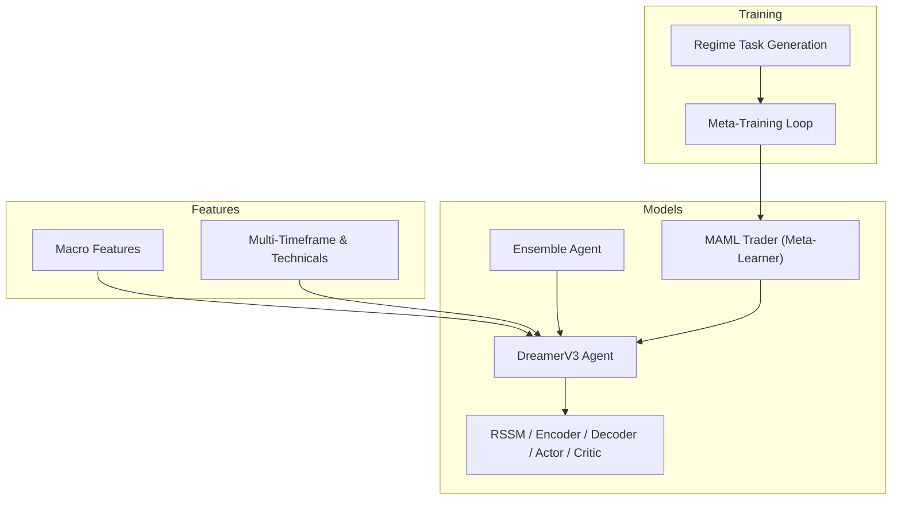
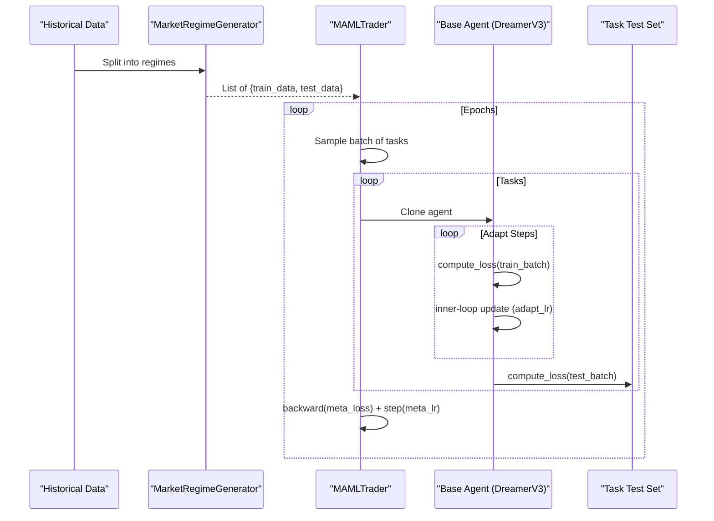
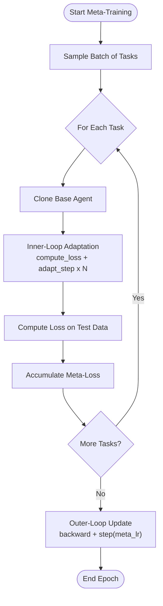
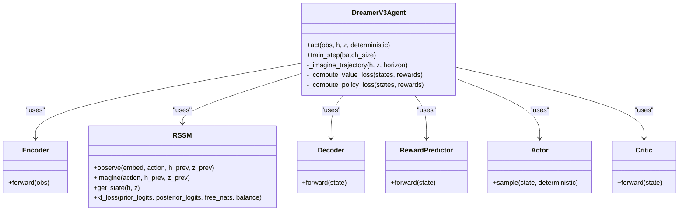
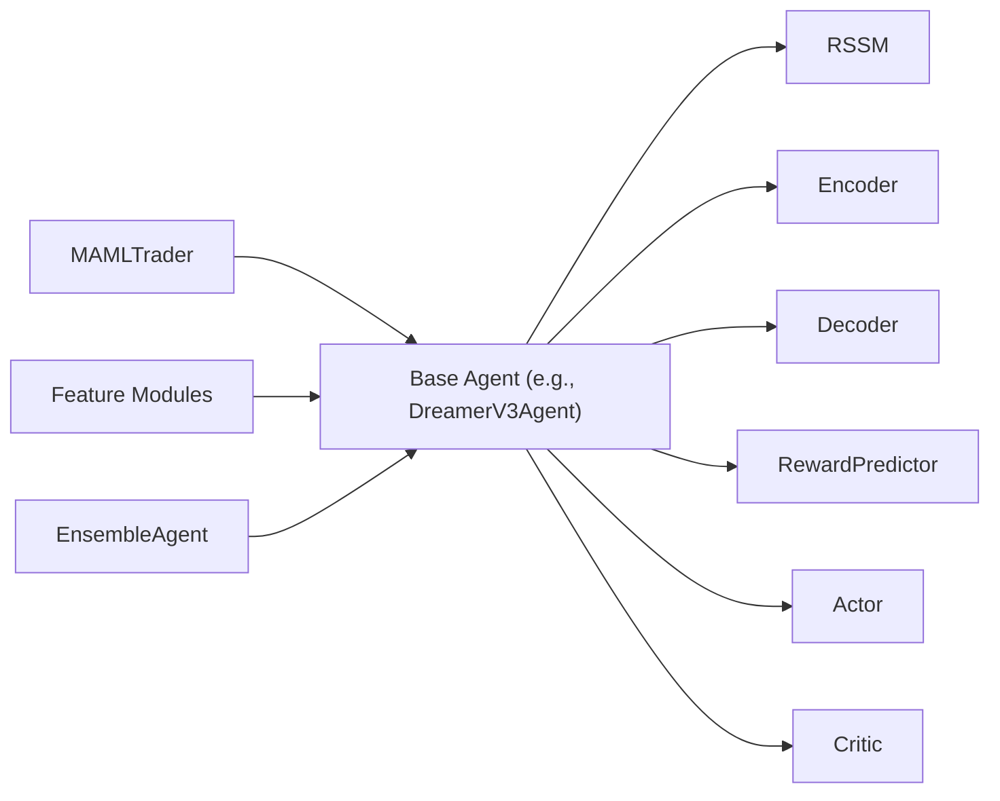

# Meta-Learning Components

<cite>
**Referenced Files in This Document**
- [meta_learning.py](file://models/meta_learning.py)
- [dreamer_agent.py](file://models/dreamer_agent.py)
- [dreamer_components.py](file://models/dreamer_components.py)
- [ensemble.py](file://models/ensemble.py)
- [macro_features.py](file://features/macro_features.py)
- [god_mode_features.py](file://features/god_mode_features.py)
- [README.md](file://README.md)
</cite>

## Table of Contents
1. [Introduction](#introduction)
2. [Project Structure](#project-structure)
3. [Core Components](#core-components)
4. [Architecture Overview](#architecture-overview)
5. [Detailed Component Analysis](#detailed-component-analysis)
6. [Dependency Analysis](#dependency-analysis)
7. [Performance Considerations](#performance-considerations)
8. [Troubleshooting Guide](#troubleshooting-guide)
9. [Conclusion](#conclusion)
10. [Appendices](#appendices)

## Introduction
This document explains the meta-learning components that enable adaptive strategy adjustment under changing market conditions. It covers task representation, adaptation mechanisms, learning rate optimization for rapid evolution, regime change detection, and integration with base trading models. It also provides examples such as volatility regime detection, trend strength assessment, and mean-reversion vs momentum switching, along with training processes, monitoring guidance, and debugging strategies.

## Project Structure
The repository organizes trading AI into features, environments, models, training scripts, and evaluation tools. The meta-learning layer sits above base agents (e.g., Dreamer V3 or PPO-based policies) and orchestrates fast adaptation to new regimes using a Model-Agnostic Meta-Learning (MAML) loop. Market regime tasks are derived from historical data via feature engineering modules that capture macro correlations, multi-timeframe signals, and volatility regimes.

**Diagram sources**
- [dreamer_agent.py:84-146](file://models/dreamer_agent.py#L84-L146)
- [dreamer_components.py:71-205](file://models/dreamer_components.py#L71-L205)
- [ensemble.py:27-130](file://models/ensemble.py#L27-L130)
- [meta_learning.py:32-115](file://models/meta_learning.py#L32-L115)
- [macro_features.py:26-75](file://features/macro_features.py#L26-L75)
- [god_mode_features.py:53-191](file://features/god_mode_features.py#L53-L191)

**Section sources**
- [README.md:418-471](file://README.md#L418-L471)

## Core Components
- MAML Trader: Wraps a base agent and performs meta-training across multiple market regimes to learn an initialization that adapts quickly via a few gradient steps. It maintains separate meta and adaptation learning rates and supports inner-loop adaptation and outer-loop meta-updates.
- Market Regime Generator: Splits historical data into regime tasks (trending, ranging, high volatility), preparing train/test splits per regime for meta-training.
- Dreamer V3 Agent: A world-model RL agent with encoder, RSSM, decoder, reward predictor, actor, and critic. It learns latent market dynamics and plans via imagined trajectories.
- Ensemble Agent: Aggregates multiple diverse base agents, uses consensus voting, and estimates uncertainty to gate trading decisions.
- Feature Modules: Macro features and multi-timeframe technical indicators provide rich inputs for regime-aware modeling.

Key responsibilities:
- Task representation: Each regime is a task with its own train/test data split.
- Adaptation mechanism: Inner-loop updates on task-specific data; outer-loop meta-updates improve the shared initialization.
- Learning rate optimization: Distinct meta_lr and adapt_lr control global initialization updates and quick adaptation steps respectively.
- Regime identification: Derived from rolling volatility, correlation, and cross-timeframe alignment features.

**Section sources**
- [meta_learning.py:32-171](file://models/meta_learning.py#L32-L171)
- [dreamer_agent.py:84-146](file://models/dreamer_agent.py#L84-L146)
- [dreamer_components.py:71-205](file://models/dreamer_components.py#L71-L205)
- [ensemble.py:27-130](file://models/ensemble.py#L27-L130)
- [macro_features.py:114-132](file://features/macro_features.py#L114-L132)
- [god_mode_features.py:134-191](file://features/god_mode_features.py#L134-L191)

## Architecture Overview
The system composes meta-learning around a base agent (Dreamer V3). During meta-training, multiple regime tasks are sampled each epoch. For each task, the base agent is cloned and adapted via a few gradient steps on task-specific data. The resulting performance on the task’s test set drives the meta-update to the shared initialization. At inference time, fast adaptation can be applied to new regimes with minimal data.

**Diagram sources**
- [meta_learning.py:66-115](file://models/meta_learning.py#L66-L115)
- [dreamer_agent.py:190-304](file://models/dreamer_agent.py#L190-L304)

## Detailed Component Analysis

### MAML Trader (Meta-Learning Wrapper)
Responsibilities:
- Maintain meta optimizer over base agent parameters.
- Perform inner-loop adaptation per task using a configurable number of steps and adaptation learning rate.
- Compute meta-loss on task test sets and perform outer-loop updates to improve the shared initialization.
- Provide fast_adapt for online adaptation to new regimes.

Implementation highlights:
- Uses deep cloning to isolate task-specific adaptations.
- Manual gradient step for inner-loop to preserve higher-order gradients required by MAML.
- Logging and configurable hyperparameters for meta and adaptation phases.

**Diagram sources**
- [meta_learning.py:66-115](file://models/meta_learning.py#L66-L115)
- [meta_learning.py:148-171](file://models/meta_learning.py#L148-L171)

**Section sources**
- [meta_learning.py:32-171](file://models/meta_learning.py#L32-L171)

### Market Regime Generator
Responsibilities:
- Identify trending, ranging, and high-volatility periods from historical data.
- Produce per-regime train/test splits for meta-training.

Notes:
- Placeholder methods indicate where sophisticated regime detection should be integrated (e.g., using rolling volatility ratios and correlation shifts).

**Section sources**
- [meta_learning.py:174-261](file://models/meta_learning.py#L174-L261)

### Dreamer V3 Agent (World-Model RL)
Responsibilities:
- Learn a compact latent representation of market states via encoder and RSSM.
- Predict rewards and reconstruct observations to validate world model fidelity.
- Train actor-critic on imagined trajectories for policy improvement.

Key components:
- Encoder: Maps raw observations to embeddings with symlog stabilization.
- RSSM: Recurrent state space model with deterministic hidden state and stochastic categorical latent capturing regime-like structure.
- Decoder/Reward Predictor: Reconstruct observations and predict rewards in latent space.
- Actor/Critic: Policy and value networks trained on imagined rollouts.

**Diagram sources**
- [dreamer_agent.py:84-146](file://models/dreamer_agent.py#L84-L146)
- [dreamer_components.py:71-205](file://models/dreamer_components.py#L71-L205)
- [dreamer_components.py:208-294](file://models/dreamer_components.py#L208-L294)

**Section sources**
- [dreamer_agent.py:84-427](file://models/dreamer_agent.py#L84-L427)
- [dreamer_components.py:71-294](file://models/dreamer_components.py#L71-L294)

### Ensemble Agent (Robust Decision-Making)
Responsibilities:
- Maintain multiple diverse base agents.
- Aggregate actions via majority voting and enforce consensus thresholds.
- Estimate uncertainty from disagreement entropy to gate risky trades.

Integration points:
- Can wrap any agent class implementing act/train/save/load.
- Provides uncertainty metrics useful for meta-learning gating and risk controls.

**Section sources**
- [ensemble.py:27-180](file://models/ensemble.py#L27-L180)

### Feature Engineering for Regime Detection
- Macro features: Rolling returns, momentum, and correlations with DXY, SPX, US10Y, VIX, oil, Bitcoin, EURUSD, silver/GLD. These help detect macro-driven regime shifts.
- Multi-timeframe and technicals: RSI, MACD, ATR, Bollinger Bands, moving average trends, volume ratios, support/resistance distances, and cross-timeframe alignment/volatility regime metrics.

Use cases:
- Volatility regime detection: Ratio of short-term to long-term volatility indicates regime shifts.
- Trend strength assessment: Moving average differences and trend alignment across timeframes.
- Mean-reversion vs momentum switching: Correlation changes and momentum cascade signals inform strategy selection.

**Section sources**
- [macro_features.py:26-75](file://features/macro_features.py#L26-L75)
- [macro_features.py:114-132](file://features/macro_features.py#L114-L132)
- [god_mode_features.py:53-191](file://features/god_mode_features.py#L53-L191)

## Dependency Analysis
High-level dependencies:
- MAML Trader depends on a base agent interface (e.g., Dreamer V3) and requires compute_loss and parameter access for inner-loop updates.
- Dreamer V3 depends on RSSM, Encoder, Decoder, RewardPredictor, Actor, Critic.
- Ensemble Agent depends on multiple instances of a base agent class.
- Feature modules feed into base agents through observation pipelines.

**Diagram sources**
- [meta_learning.py:32-115](file://models/meta_learning.py#L32-L115)
- [dreamer_agent.py:84-146](file://models/dreamer_agent.py#L84-L146)
- [dreamer_components.py:71-205](file://models/dreamer_components.py#L71-L205)
- [ensemble.py:27-130](file://models/ensemble.py#L27-L130)

**Section sources**
- [meta_learning.py:32-171](file://models/meta_learning.py#L32-L171)
- [dreamer_agent.py:84-427](file://models/dreamer_agent.py#L84-L427)
- [dreamer_components.py:71-294](file://models/dreamer_components.py#L71-L294)
- [ensemble.py:27-180](file://models/ensemble.py#L27-L180)

## Performance Considerations
- Meta-learning efficiency: Use small adapt_steps and moderate adapt_lr to avoid overfitting during fast adaptation while maintaining stability. Tune meta_lr to balance global initialization updates.
- World model quality: Monitor reconstruction and reward prediction losses; poor fidelity degrades imagined trajectory training.
- Ensemble diversity: Ensure architectural variations and different seeds to maximize disagreement when needed; too much similarity reduces robustness.
- Feature scaling: Apply symlog transformations and normalization to stabilize training and reduce outlier impact.
- Hardware utilization: Leverage GPU/MPS for faster meta-epochs and longer imagination horizons.

[No sources needed since this section provides general guidance]

## Troubleshooting Guide
Common issues and remedies:
- Meta-training divergence:
  - Reduce meta_lr and adapt_lr; increase gradient clipping for base agent.
  - Verify task splits are representative and not leaking test information.
- Fast adaptation instability:
  - Lower adapt_lr; reduce adapt_steps; ensure recent data batches are properly normalized.
- Poor regime detection:
  - Enhance regime generator with robust volatility and correlation thresholds; incorporate cross-timeframe alignment metrics.
- Ensemble disagreement spikes:
  - Check for data drift; consider temporarily lowering consensus threshold or increasing regularization.
- Dreamer V3 training stalls:
  - Inspect KL loss and free nats; adjust balance to prevent posterior collapse.
  - Validate replay buffer size and sequence sampling.

Monitoring recommendations:
- Track meta-loss per epoch and per-task test losses to detect overfitting.
- Log adaptation curves (loss vs step) during fast_adapt to assess convergence speed.
- Record ensemble uncertainty and consensus rates to correlate with performance drops.
- Monitor feature distributions (volatility regime, macro correlations) for drift.

**Section sources**
- [meta_learning.py:66-115](file://models/meta_learning.py#L66-L115)
- [dreamer_agent.py:190-304](file://models/dreamer_agent.py#L190-L304)
- [dreamer_components.py:188-205](file://models/dreamer_components.py#L188-L205)
- [ensemble.py:67-130](file://models/ensemble.py#L67-L130)
- [macro_features.py:114-132](file://features/macro_features.py#L114-L132)
- [god_mode_features.py:134-191](file://features/god_mode_features.py#L134-L191)

## Conclusion
The meta-learning layer enables rapid strategy adaptation to evolving market regimes by learning a flexible initialization over diverse tasks. Combined with a world-model RL base agent and robust feature engineering, it supports dynamic regime detection and informed strategy selection. Ensemble aggregation adds resilience and uncertainty awareness. Proper tuning of learning rates, adaptation steps, and regime detection heuristics ensures stable and effective adaptation in live markets.

[No sources needed since this section summarizes without analyzing specific files]

## Appendices

### Training Process for Meta-Learners
- Data preparation:
  - Generate regime tasks from historical data using feature-derived signals (volatility, correlations, cross-timeframe alignment).
  - Split each regime into train/test sets for inner-loop adaptation and meta-evaluation.
- Loss functions:
  - Base agent losses include reconstruction, reward prediction, KL regularization, value loss, and policy loss.
  - Meta-loss aggregates task test losses after adaptation.
- Convergence criteria:
  - Stabilization of meta-loss across epochs.
  - Consistent improvement in out-of-sample task performance.
  - Controlled adaptation curves during fast_adapt.

**Section sources**
- [meta_learning.py:66-115](file://models/meta_learning.py#L66-L115)
- [dreamer_agent.py:190-304](file://models/dreamer_agent.py#L190-L304)
- [dreamer_components.py:188-205](file://models/dreamer_components.py#L188-L205)

### Integration with Base Trading Models
- Wrap base agents (e.g., Dreamer V3) within MAMLTrader to enable meta-training and fast adaptation.
- Use EnsembleAgent to aggregate multiple base agents for robust decision-making and uncertainty estimation.
- Feed engineered features into base agents to enrich state representations for regime-aware behavior.

**Section sources**
- [meta_learning.py:32-115](file://models/meta_learning.py#L32-L115)
- [dreamer_agent.py:84-146](file://models/dreamer_agent.py#L84-L146)
- [ensemble.py:27-130](file://models/ensemble.py#L27-L130)

### Examples of Meta-Learning Applications
- Volatility regime detection:
  - Use rolling volatility ratios and macro correlation shifts to identify high/low volatility regimes; trigger adaptation steps when thresholds breach.
- Trend strength assessment:
  - Combine multi-timeframe moving average differences and trend alignment scores to gauge trend persistence; adapt strategy parameters accordingly.
- Mean-reversion vs momentum switching:
  - Leverage momentum cascade and correlation changes to switch between mean-reversion and momentum strategies; use ensemble uncertainty to modulate confidence.

**Section sources**
- [macro_features.py:114-132](file://features/macro_features.py#L114-L132)
- [god_mode_features.py:134-191](file://features/god_mode_features.py#L134-L191)