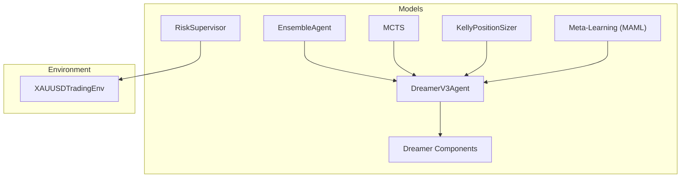
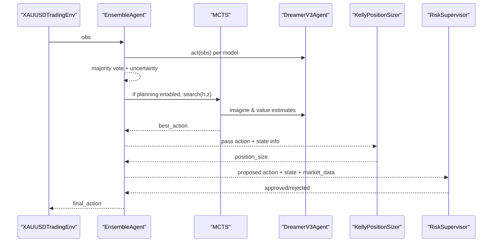
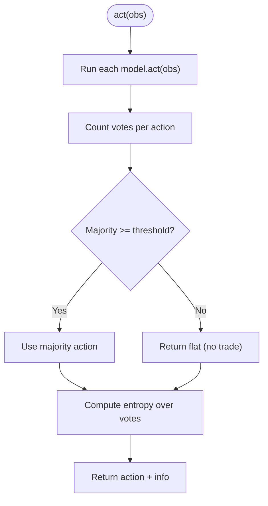
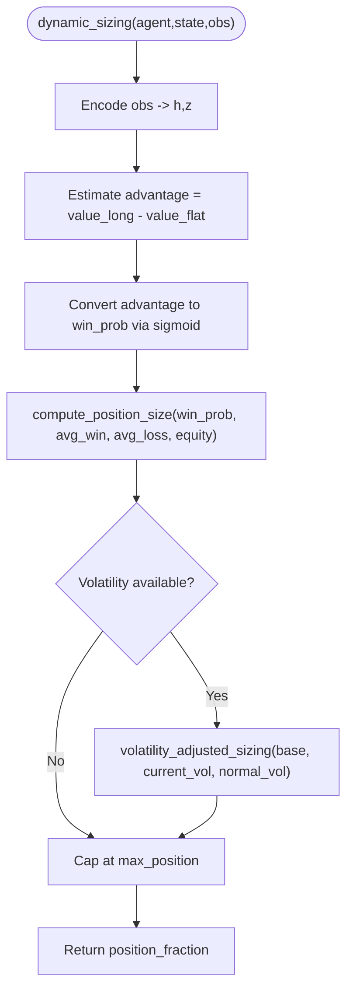
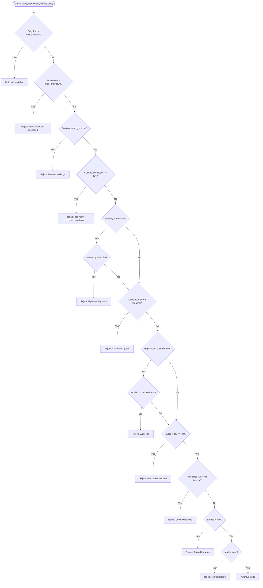
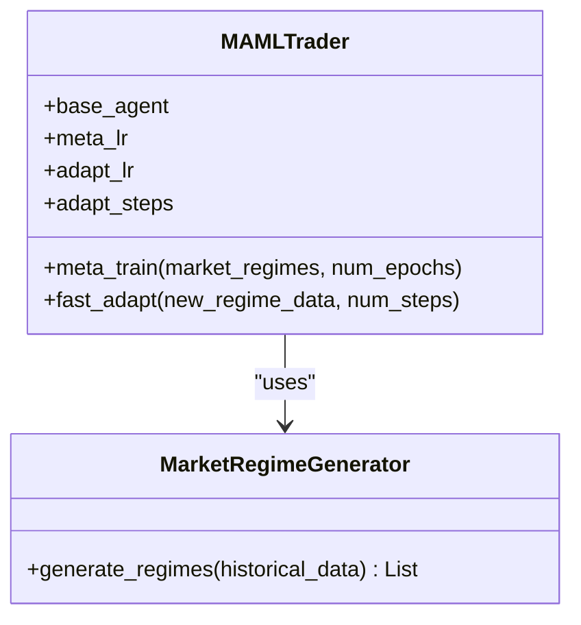
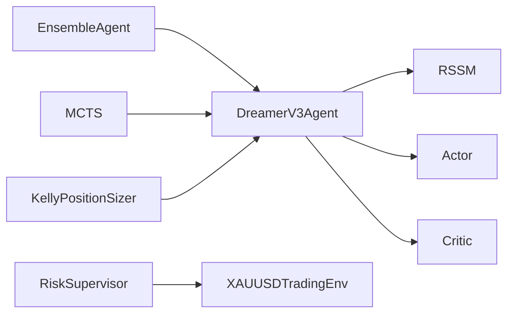

# Model Management

<cite>
**Referenced Files in This Document**
- [ensemble.py](file://models/ensemble.py)
- [position_sizing.py](file://models/position_sizing.py)
- [risk_supervisor.py](file://models/risk_supervisor.py)
- [meta_learning.py](file://models/meta_learning.py)
- [mcts.py](file://models/mcts.py)
- [dreamer_agent.py](file://models/dreamer_agent.py)
- [dreamer_components.py](file://models/dreamer_components.py)
- [xauusd_env.py](file://env/xauusd_env.py)
</cite>

## Table of Contents
1. [Introduction](#introduction)
2. [Project Structure](#project-structure)
3. [Core Components](#core-components)
4. [Architecture Overview](#architecture-overview)
5. [Detailed Component Analysis](#detailed-component-analysis)
6. [Dependency Analysis](#dependency-analysis)
7. [Performance Considerations](#performance-considerations)
8. [Troubleshooting Guide](#troubleshooting-guide)
9. [Conclusion](#conclusion)
10. [Appendices](#appendices)

## Introduction
This document explains the advanced model management components that govern decision-making, risk control, and planning for trading agents. It covers:
- Ensemble methods to combine multiple model predictions with consensus and uncertainty estimation
- Position sizing strategies based on account equity and risk tolerance (Kelly Criterion, volatility-adjusted sizing, ATR-based sizing)
- Risk supervision systems enforcing drawdown protection, position limits, and market condition filters
- Meta-learning for adaptive strategy adjustment across market regimes
- Monte Carlo Tree Search (MCTS) for lookahead planning using a world model

It also documents configuration options, integration points with the trading environment and execution layer, performance considerations for real-time decisions, memory management for large ensembles, and debugging techniques for complex interactions.

## Project Structure
The relevant modules are organized under models/ and env/. The core components interact as follows:
- EnsembleAgent wraps multiple agents and produces consensus actions with uncertainty metrics
- KellyPositionSizer and related sizers compute dynamic position sizes from win probability, equity, and volatility
- RiskSupervisor enforces hard safety rules and can override or halt trades
- MCTS uses the agent’s world model to simulate futures and select robust actions
- Meta-learning adapts policies quickly to new regimes
- DreamerV3Agent provides the world model, actor, critic, and latent state used by ensemble, MCTS, and sizing logic
- XAUUSDTradingEnv provides the trading environment and reward structure



**Diagram sources**
- [ensemble.py:27-130](file://models/ensemble.py#L27-L130)
- [position_sizing.py:29-187](file://models/position_sizing.py#L29-L187)
- [risk_supervisor.py:18-174](file://models/risk_supervisor.py#L18-L174)
- [mcts.py:118-193](file://models/mcts.py#L118-L193)
- [dreamer_agent.py:84-188](file://models/dreamer_agent.py#L84-L188)
- [dreamer_components.py:71-186](file://models/dreamer_components.py#L71-L186)
- [xauusd_env.py:7-117](file://env/xauusd_env.py#L7-L117)

**Section sources**
- [ensemble.py:27-130](file://models/ensemble.py#L27-L130)
- [position_sizing.py:29-187](file://models/position_sizing.py#L29-L187)
- [risk_supervisor.py:18-174](file://models/risk_supervisor.py#L18-L174)
- [mcts.py:118-193](file://models/mcts.py#L118-L193)
- [dreamer_agent.py:84-188](file://models/dreamer_agent.py#L84-L188)
- [dreamer_components.py:71-186](file://models/dreamer_components.py#L71-L186)
- [xauusd_env.py:7-117](file://env/xauusd_env.py#L7-L117)

## Core Components
- Ensemble voting: Majority vote with configurable threshold; returns uncertainty via entropy and optional Q-values
- Position sizing: Kelly Criterion with fractional scaling, volatility adjustments, and ATR-based sizing
- Risk supervisor: Deterministic checks including daily loss limit, drawdown cap, spread filter, volatility filter, event risk, trade frequency controls
- Meta-learning: MAML-style fast adaptation to new regimes with few gradient steps
- MCTS: Planning over imagined trajectories using RSSM, actor priors, and critic values to choose robust actions

**Section sources**
- [ensemble.py:27-130](file://models/ensemble.py#L27-L130)
- [position_sizing.py:29-187](file://models/position_sizing.py#L29-L187)
- [risk_supervisor.py:18-174](file://models/risk_supervisor.py#L18-L174)
- [meta_learning.py:32-146](file://models/meta_learning.py#L32-L146)
- [mcts.py:118-193](file://models/mcts.py#L118-L193)

## Architecture Overview
The system integrates multiple layers:
- Decision layer: EnsembleAgent aggregates multiple agents’ actions into a consensus action with uncertainty
- Planning layer: MCTS explores future states using the world model to refine action selection
- Sizing layer: KellyPositionSizer computes optimal position size based on estimated win probability and historical statistics
- Safety layer: RiskSupervisor enforces hard constraints and can override or halt trades
- Environment layer: XAUUSDTradingEnv provides observations, rewards, and state transitions



**Diagram sources**
- [ensemble.py:67-130](file://models/ensemble.py#L67-L130)
- [mcts.py:145-193](file://models/mcts.py#L145-L193)
- [dreamer_agent.py:148-188](file://models/dreamer_agent.py#L148-L188)
- [position_sizing.py:113-187](file://models/position_sizing.py#L113-L187)
- [risk_supervisor.py:91-174](file://models/risk_supervisor.py#L91-L174)
- [xauusd_env.py:75-117](file://env/xauusd_env.py#L75-L117)

## Detailed Component Analysis

### Ensemble Voting Mechanism
- Creates multiple agents with varied seeds and slight architecture differences
- Aggregates actions via majority vote; requires consensus above a threshold to trade
- Computes uncertainty using entropy over action distribution
- Optionally collects Q-values per model for richer diagnostics



**Diagram sources**
- [ensemble.py:67-130](file://models/ensemble.py#L67-L130)
- [ensemble.py:132-154](file://models/ensemble.py#L132-L154)

**Section sources**
- [ensemble.py:27-130](file://models/ensemble.py#L27-L130)
- [ensemble.py:132-154](file://models/ensemble.py#L132-L154)

### Dynamic Position Sizing Strategies
- KellyCriterion-based sizing: Uses win probability, average win/loss, and fractional Kelly to compute safe position fractions
- Volatility-adjusted sizing: Reduces position size when current volatility exceeds normal levels
- ATR-based sizing: Converts account risk and stop distance (ATR multiplier) into position fraction
- Dynamic sizing via agent’s world model: Estimates win probability from advantage and maps to Kelly sizing



**Diagram sources**
- [position_sizing.py:113-187](file://models/position_sizing.py#L113-L187)
- [position_sizing.py:189-216](file://models/position_sizing.py#L189-L216)
- [position_sizing.py:286-335](file://models/position_sizing.py#L286-L335)

**Section sources**
- [position_sizing.py:29-187](file://models/position_sizing.py#L29-L187)
- [position_sizing.py:189-216](file://models/position_sizing.py#L189-L216)
- [position_sizing.py:286-335](file://models/position_sizing.py#L286-L335)

### Risk Supervision System
- Enforces hard-coded safety rules: daily loss limit, maximum drawdown, position size caps, volatility filters, correlation guards, event risk filters, trade frequency limits, spread filters, market hours checks
- Tracks state: daily PnL, peak equity, consecutive losses, last trade time
- Provides approval/rejection with reasons and statistics



**Diagram sources**
- [risk_supervisor.py:91-174](file://models/risk_supervisor.py#L91-L174)

**Section sources**
- [risk_supervisor.py:18-174](file://models/risk_supervisor.py#L18-L174)
- [risk_supervisor.py:176-267](file://models/risk_supervisor.py#L176-L267)

### Meta-Learning for Adaptive Strategy Adjustment
- MAMLTrader meta-trains on multiple market regimes to learn an initialization that adapts quickly
- Fast adaptation uses a small number of gradient steps on new regime data
- MarketRegimeGenerator splits historical data into tasks representing different regimes



**Diagram sources**
- [meta_learning.py:32-146](file://models/meta_learning.py#L32-L146)
- [meta_learning.py:174-245](file://models/meta_learning.py#L174-L245)

**Section sources**
- [meta_learning.py:32-146](file://models/meta_learning.py#L32-L146)
- [meta_learning.py:174-245](file://models/meta_learning.py#L174-L245)

### Monte Carlo Tree Search (MCTS) for Decision Optimization
- MCTSNode represents state-action pairs with visit counts, value sums, and priors from policy
- Selection uses UCB formula balancing exploitation (Q-value) and exploration (prior bonus)
- Expansion imagines next states via RSSM and predicts immediate rewards
- Simulation evaluates leaf nodes using critic
- Backpropagation updates ancestors with discounted rewards
- DreamerMCTSAgent integrates MCTS with DreamerV3Agent for planning-aware action selection

```mermaid
sequenceDiagram
participant Agent as "DreamerMCTSAgent"
participant MCTS as "MCTS"
participant Node as "MCTSNode"
participant RSSM as "RSSM"
participant Actor as "Actor"
participant Critic as "Critic"
Agent->>MCTS : search(h, z)
loop num_simulations
MCTS->>Node : select_child(c_puct)
alt node expanded?
MCTS->>Actor : get priors(state)
MCTS->>RSSM : imagine(action, h, z)
MCTS->>Critic : value(state_next)
MCTS->>Node : expand(actions, priors, agent)
MCTS->>Node : backup(value)
else leaf
MCTS->>Critic : value(leaf_state)
MCTS->>Node : backup(value)
end
end
MCTS-->>Agent : best_action
```

**Diagram sources**
- [mcts.py:20-116](file://models/mcts.py#L20-L116)
- [mcts.py:118-193](file://models/mcts.py#L118-L193)
- [mcts.py:245-291](file://models/mcts.py#L245-L291)
- [dreamer_components.py:127-186](file://models/dreamer_components.py#L127-L186)

**Section sources**
- [mcts.py:20-116](file://models/mcts.py#L20-L116)
- [mcts.py:118-193](file://models/mcts.py#L118-L193)
- [mcts.py:245-291](file://models/mcts.py#L245-L291)

## Dependency Analysis
Key dependencies and relationships:
- EnsembleAgent depends on an agent_class (e.g., DreamerV3Agent) and orchestrates multiple instances
- MCTS depends on DreamerV3Agent’s RSSM, actor, and critic for planning
- KellyPositionSizer may use agent’s world model outputs to estimate win probability
- RiskSupervisor is independent but wraps around the agent to enforce safety
- XAUUSDTradingEnv provides discrete actions and reward signals used during training and evaluation



**Diagram sources**
- [dreamer_agent.py:84-188](file://models/dreamer_agent.py#L84-L188)
- [dreamer_components.py:92-186](file://models/dreamer_components.py#L92-L186)
- [ensemble.py:27-130](file://models/ensemble.py#L27-L130)
- [mcts.py:118-193](file://models/mcts.py#L118-L193)
- [position_sizing.py:113-187](file://models/position_sizing.py#L113-L187)
- [risk_supervisor.py:91-174](file://models/risk_supervisor.py#L91-L174)
- [xauusd_env.py:7-117](file://env/xauusd_env.py#L7-L117)

**Section sources**
- [dreamer_agent.py:84-188](file://models/dreamer_agent.py#L84-L188)
- [dreamer_components.py:92-186](file://models/dreamer_components.py#L92-L186)
- [ensemble.py:27-130](file://models/ensemble.py#L27-L130)
- [mcts.py:118-193](file://models/mcts.py#L118-L193)
- [position_sizing.py:113-187](file://models/position_sizing.py#L113-L187)
- [risk_supervisor.py:91-174](file://models/risk_supervisor.py#L91-L174)
- [xauusd_env.py:7-117](file://env/xauusd_env.py#L7-L117)

## Performance Considerations
- Real-time decision making:
  - Ensemble inference scales linearly with number of models; consider reducing num_models or using lightweight agents for live trading
  - MCTS planning adds computational overhead proportional to num_simulations; tune c_puct and gamma for speed-accuracy trade-offs
  - Position sizing computations are lightweight; ensure volatility inputs are efficient to compute
- Memory management:
  - Large ensembles increase memory usage due to multiple model copies; share weights where possible or use parameter-efficient variants
  - MCTS maintains tree structures; limit depth or reuse nodes across timesteps to reduce memory pressure
  - ReplayBuffer and sequence sampling consume memory; manage capacity and batch sizes carefully
- Debugging techniques:
  - Log ensemble voting details (actions, counts, uncertainty) to diagnose disagreement spikes
  - Track risk supervisor rejection reasons and approval rates to identify constraint bottlenecks
  - Inspect MCTS visit counts and Q-values to understand planning confidence and explore-exploit balance
  - Monitor position sizing statistics (win rate, avg win/loss) to calibrate Kelly parameters

[No sources needed since this section provides general guidance]

## Troubleshooting Guide
Common issues and resolutions:
- Ensemble disagreement:
  - Symptom: Frequent no-trade due to low consensus
  - Action: Lower consensus_threshold temporarily; investigate model divergence; retrain with more diverse data
  - Reference: [ensemble.py:67-130](file://models/ensemble.py#L67-L130), [ensemble.py:132-154](file://models/ensemble.py#L132-L154)
- Overly conservative sizing:
  - Symptom: Very small positions even with strong signals
  - Action: Increase kelly_fraction; verify avg_win/avg_loss estimates; check volatility scaling
  - Reference: [position_sizing.py:29-187](file://models/position_sizing.py#L29-L187), [position_sizing.py:189-216](file://models/position_sizing.py#L189-L216)
- Excessive risk overrides:
  - Symptom: Trades frequently rejected by RiskSupervisor
  - Action: Review thresholds (daily loss, drawdown, spread); adjust max_trades_per_day and min_time_between_trades
  - Reference: [risk_supervisor.py:91-174](file://models/risk_supervisor.py#L91-L174), [risk_supervisor.py:176-267](file://models/risk_supervisor.py#L176-L267)
- Slow MCTS planning:
  - Symptom: High latency per decision
  - Action: Reduce num_simulations; adjust c_puct; ensure device placement is optimal
  - Reference: [mcts.py:118-193](file://models/mcts.py#L118-L193), [mcts.py:245-291](file://models/mcts.py#L245-L291)
- Meta-learning adaptation instability:
  - Symptom: Poor performance after fast adaptation
  - Action: Tune adapt_lr and adapt_steps; ensure regime data quality; validate base agent stability
  - Reference: [meta_learning.py:32-146](file://models/meta_learning.py#L32-L146)

**Section sources**
- [ensemble.py:67-130](file://models/ensemble.py#L67-L130)
- [ensemble.py:132-154](file://models/ensemble.py#L132-L154)
- [position_sizing.py:29-187](file://models/position_sizing.py#L29-L187)
- [position_sizing.py:189-216](file://models/position_sizing.py#L189-L216)
- [risk_supervisor.py:91-174](file://models/risk_supervisor.py#L91-L174)
- [risk_supervisor.py:176-267](file://models/risk_supervisor.py#L176-L267)
- [mcts.py:118-193](file://models/mcts.py#L118-L193)
- [mcts.py:245-291](file://models/mcts.py#L245-L291)
- [meta_learning.py:32-146](file://models/meta_learning.py#L32-L146)

## Conclusion
The advanced model management components provide a robust framework for trading decisions:
- Ensemble voting improves reliability through consensus and quantifies uncertainty
- Dynamic position sizing aligns exposure with edge and market conditions
- Risk supervision ensures safety with deterministic overrides and comprehensive checks
- Meta-learning enables rapid adaptation to changing regimes
- MCTS enhances decision quality via lookahead planning using the world model

Together, these modules integrate with the environment and execution layer to deliver safe, adaptive, and optimized trading behavior. Proper tuning of configuration parameters and careful monitoring of performance metrics are essential for success.

[No sources needed since this section summarizes without analyzing specific files]

## Appendices

### Configuration Options Summary
- Ensemble:
  - num_models: Number of agents in ensemble
  - consensus_threshold: Minimum agreeing models to trade
  - use_consensus: Enable/disable consensus requirement
  - Reference: [ensemble.py:35-65](file://models/ensemble.py#L35-L65), [ensemble.py:67-130](file://models/ensemble.py#L67-L130)
- Position Sizing:
  - max_position: Maximum position fraction
  - kelly_fraction: Fraction of Kelly to use
  - account_risk, atr_multiplier: For ATR-based sizing
  - Reference: [position_sizing.py:41-64](file://models/position_sizing.py#L41-L64), [position_sizing.py:295-304](file://models/position_sizing.py#L295-L304)
- Risk Supervisor:
  - max_daily_loss, max_drawdown, vol_threshold, max_spread, max_trades_per_day, min_trade_interval, max_consecutive_losses
  - Reference: [risk_supervisor.py:43-65](file://models/risk_supervisor.py#L43-L65), [risk_supervisor.py:77-89](file://models/risk_supervisor.py#L77-L89)
- MCTS:
  - num_simulations, c_puct, gamma
  - Reference: [mcts.py:126-143](file://models/mcts.py#L126-L143)
- Meta-Learning:
  - meta_lr, adapt_lr, adapt_steps
  - Reference: [meta_learning.py:39-64](file://models/meta_learning.py#L39-L64)

**Section sources**
- [ensemble.py:35-65](file://models/ensemble.py#L35-L65)
- [ensemble.py:67-130](file://models/ensemble.py#L67-L130)
- [position_sizing.py:41-64](file://models/position_sizing.py#L41-L64)
- [position_sizing.py:295-304](file://models/position_sizing.py#L295-L304)
- [risk_supervisor.py:43-65](file://models/risk_supervisor.py#L43-L65)
- [risk_supervisor.py:77-89](file://models/risk_supervisor.py#L77-L89)
- [mcts.py:126-143](file://models/mcts.py#L126-L143)
- [meta_learning.py:39-64](file://models/meta_learning.py#L39-L64)