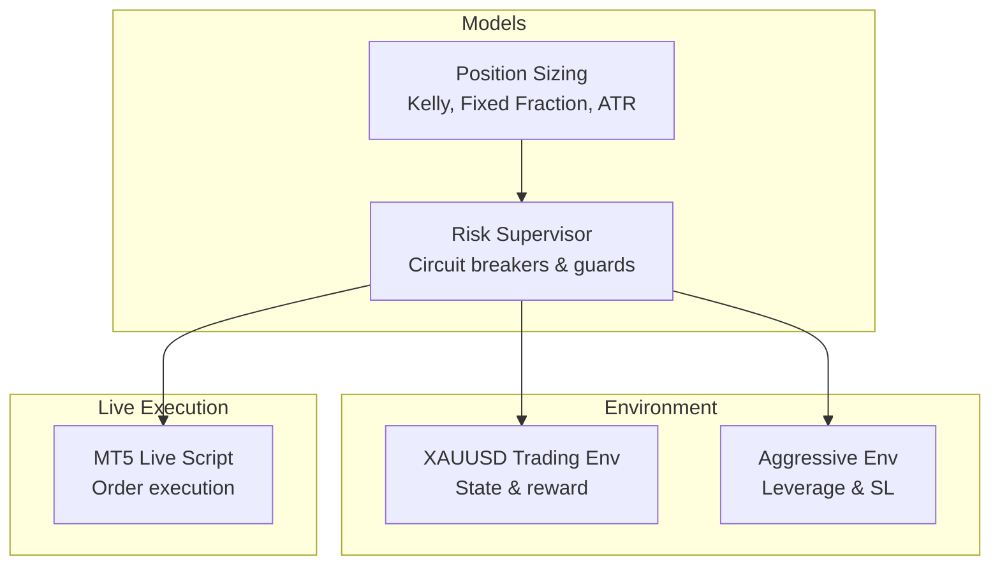
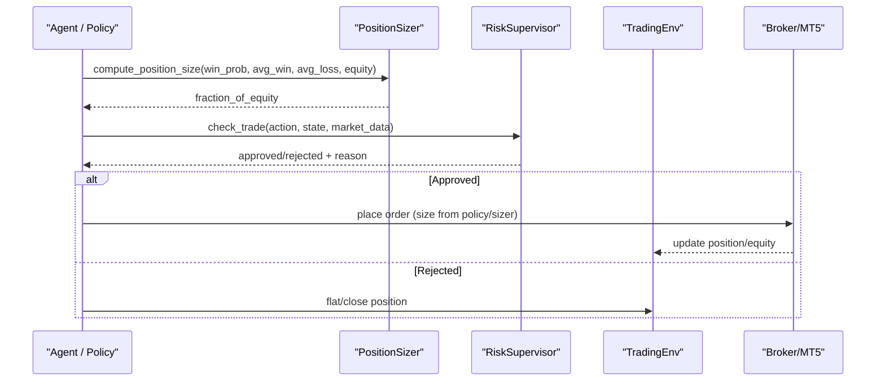
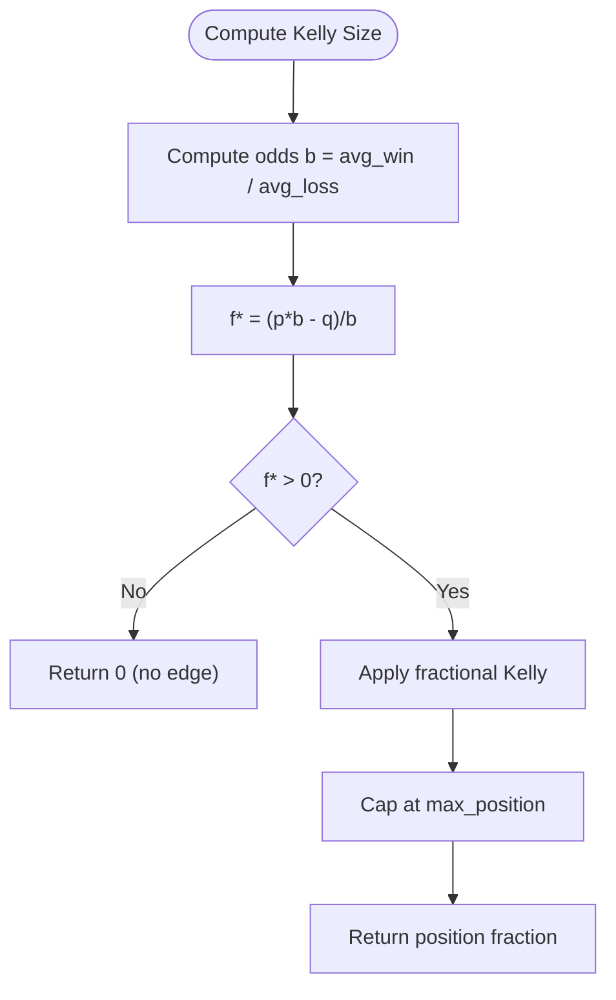
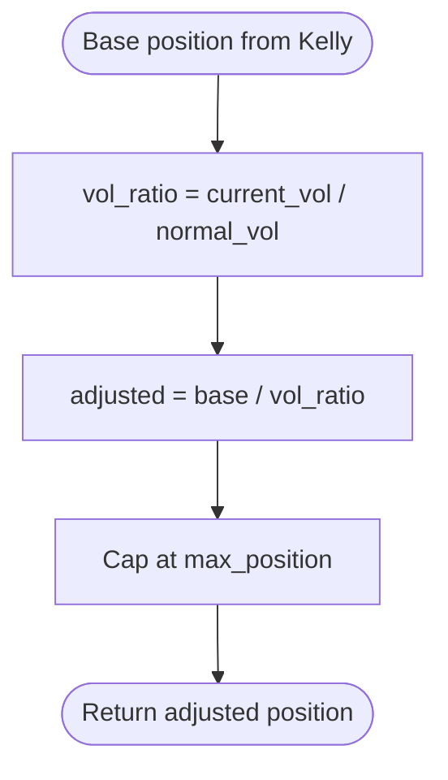
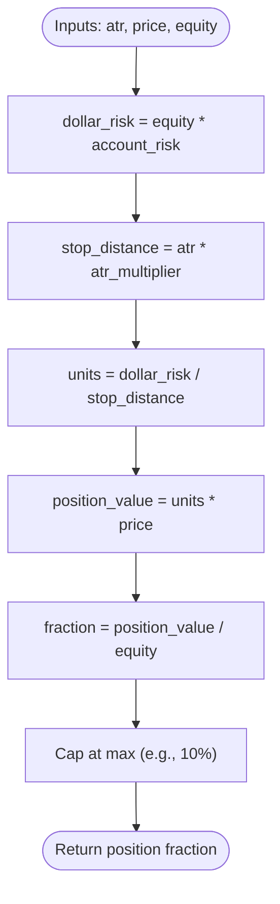
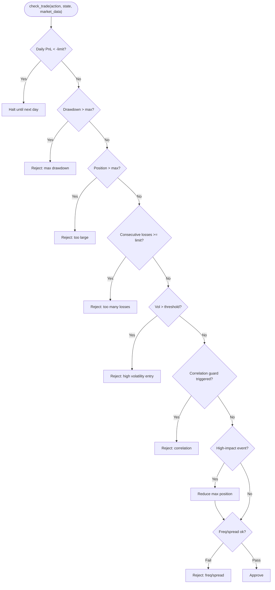
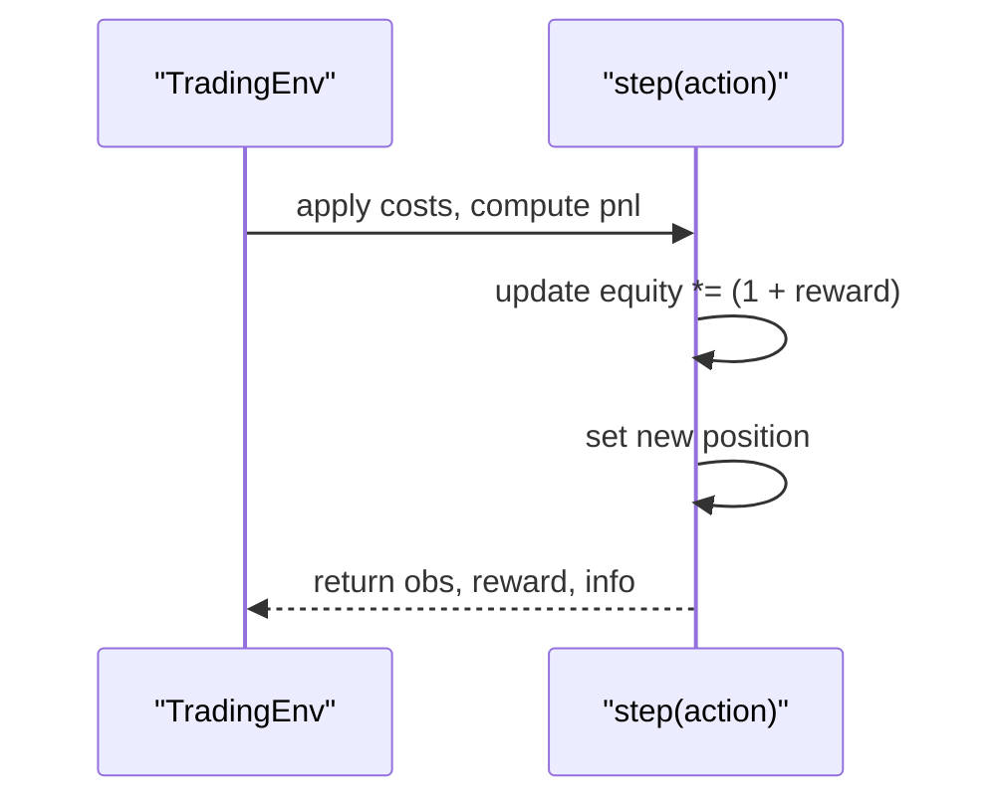
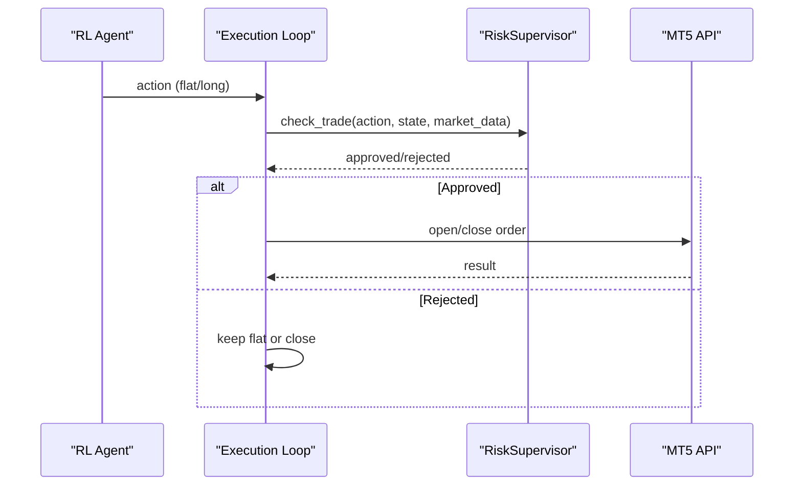
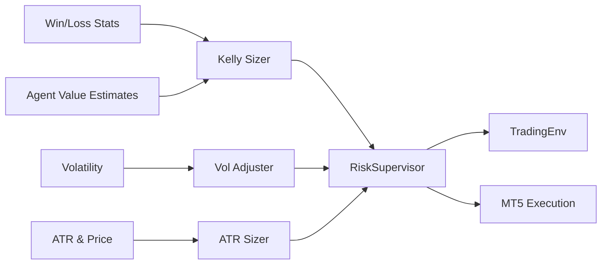

# Position Sizing Strategies

<cite>
**Referenced Files in This Document**
- [position_sizing.py](file://models/position_sizing.py)
- [risk_supervisor.py](file://models/risk_supervisor.py)
- [xauusd_env.py](file://env/xauusd_env.py)
- [xauusd_env_aggressive.py](file://env/xauusd_env_aggressive.py)
- [live_trade_mt5.py](file://live/live_trade_mt5.py)
- [README.md](file://README.md)
</cite>

## Table of Contents
1. Introduction
2. Project Structure
3. Core Components
4. Architecture Overview
5. Detailed Component Analysis
6. Dependency Analysis
7. Performance Considerations
8. Troubleshooting Guide
9. Conclusion
10. Appendices

## Introduction
This document explains position sizing strategies that dynamically adjust trade sizes based on account equity, risk tolerance, and market conditions. It covers the mathematical foundations used in the codebase (Kelly criterion, volatility-adjusted sizing, ATR-based sizing), configuration options for risk parameters and maximum position limits, examples of how sizes change with different inputs, integration points with stop-loss placement and portfolio management, performance considerations for real-time calculation, and troubleshooting guidance for common issues such as over-leveraging or under-utilization of capital.

## Project Structure
Position sizing is implemented primarily in a dedicated module and enforced by a risk supervisor layer. The trading environment provides state and execution semantics, while live execution scripts demonstrate how sizing integrates with order submission.

**Diagram sources**
- [position_sizing.py:29-335](file://models/position_sizing.py#L29-L335)
- [risk_supervisor.py:18-174](file://models/risk_supervisor.py#L18-L174)
- [xauusd_env.py:7-118](file://env/xauusd_env.py#L7-L118)
- [xauusd_env_aggressive.py:6-144](file://env/xauusd_env_aggressive.py#L6-L144)
- [live_trade_mt5.py:32-96](file://live/live_trade_mt5.py#L32-L96)

**Section sources**
- [position_sizing.py:29-335](file://models/position_sizing.py#L29-L335)
- [risk_supervisor.py:18-174](file://models/risk_supervisor.py#L18-L174)
- [xauusd_env.py:7-118](file://env/xauusd_env.py#L7-L118)
- [xauusd_env_aggressive.py:6-144](file://env/xauusd_env_aggressive.py#L6-L144)
- [live_trade_mt5.py:32-96](file://live/live_trade_mt5.py#L32-L96)

## Core Components
- Kelly-based sizing with fractional scaling, caps, and confidence-driven probability estimation via an agent’s value estimates.
- Volatility-adjusted sizing to reduce exposure when markets are more volatile than normal.
- ATR-based sizing to tie position size to stop distance and account risk percentage.
- Risk supervisor enforcing hard constraints: daily loss limits, drawdown protection, max position size, volatility filters, event risk reduction, spread filters, and trade frequency controls.
- Environments providing state tracking (equity, positions) and optional leverage/stop-loss mechanics for training and evaluation.

**Section sources**
- [position_sizing.py:29-335](file://models/position_sizing.py#L29-L335)
- [risk_supervisor.py:18-174](file://models/risk_supervisor.py#L18-L174)
- [xauusd_env.py:7-118](file://env/xauusd_env.py#L7-L118)
- [xauusd_env_aggressive.py:6-144](file://env/xauusd_env_aggressive.py#L6-L144)

## Architecture Overview
The system computes a candidate position size using one or more sizing methods, then passes it through a risk supervisor that can approve, reject, or constrain the trade based on global safety rules. In live trading, the approved action maps to concrete orders with fixed lot sizes; in environments, equity and position states evolve deterministically per step.

**Diagram sources**
- [position_sizing.py:66-111](file://models/position_sizing.py#L66-L111)
- [risk_supervisor.py:91-174](file://models/risk_supervisor.py#L91-L174)
- [xauusd_env.py:75-118](file://env/xauusd_env.py#L75-L118)
- [live_trade_mt5.py:32-96](file://live/live_trade_mt5.py#L32-L96)

## Detailed Component Analysis

### Kelly Criterion Position Sizing
- Mathematical foundation: uses win probability, average win, and average loss to compute the Kelly fraction, then applies a fractional multiplier for safety and caps at a maximum position.
- Confidence mapping: dynamic sizing can derive a win probability estimate from an agent’s value advantage and convert it via a sigmoid function, clamped to a reasonable range.
- Edge handling: returns zero when there is no edge; minimum fallback when average loss is zero.

**Diagram sources**
- [position_sizing.py:66-111](file://models/position_sizing.py#L66-L111)

Configuration options
- Max position cap: limits the final fraction of equity to prevent overexposure.
- Kelly fraction: scales down full Kelly to reduce drawdowns (e.g., quarter Kelly).
- Initial statistics: default win rate and average win/loss used before enough data is available.

Examples
- Strong edge scenario: higher win probability and favorable reward-to-risk produce larger positions up to the cap.
- Weak/no edge: lower win probability or poor reward-to-risk reduces or eliminates position size.

Integration notes
- Dynamic sizing can use agent value estimates to approximate win probability.
- Volatility adjustment can further scale down positions when current volatility exceeds normal levels.

**Section sources**
- [position_sizing.py:29-111](file://models/position_sizing.py#L29-L111)
- [position_sizing.py:113-187](file://models/position_sizing.py#L113-L187)

### Volatility-Adjusted Sizing
- Purpose: maintain consistent dollar risk across varying volatility regimes by inversely scaling position size with volatility ratio.
- Behavior: if current volatility is higher than normal, position size decreases; still respects maximum position cap.

**Diagram sources**
- [position_sizing.py:189-216](file://models/position_sizing.py#L189-L216)

Practical implications
- During high-volatility events, positions shrink automatically, reducing risk without manual intervention.
- Requires reliable estimates of current and normal volatility.

**Section sources**
- [position_sizing.py:189-216](file://models/position_sizing.py#L189-L216)

### ATR-Based Position Sizing
- Purpose: size positions so that dollar risk equals a fixed percentage of equity divided by stop distance measured in ATR units.
- Inputs: ATR, price, equity, account risk percentage, and ATR multiplier for stop distance.
- Output: position fraction capped at a maximum to avoid excessive exposure.

**Diagram sources**
- [position_sizing.py:286-335](file://models/position_sizing.py#L286-L335)

Use cases
- Works well when stops are placed relative to recent volatility (ATR).
- Ensures consistent risk regardless of asset price level.

**Section sources**
- [position_sizing.py:286-335](file://models/position_sizing.py#L286-L335)

### Risk Supervisor (Hard Safety Layer)
- Enforces global constraints independent of the sizing method:
  - Daily loss limit with circuit breaker halt
  - Maximum drawdown protection
  - Position size limits
  - Consecutive loss limits
  - Volatility filter (blocks new entries during spikes)
  - Correlation guard (e.g., USD strength vs Gold)
  - Event risk filter (reduces max position during high-impact news)
  - Trade frequency controls (max trades per day, cooldown between trades)
  - Spread filter and market hours checks
- Provides approval/rejection decisions and statistics for monitoring.

**Diagram sources**
- [risk_supervisor.py:91-174](file://models/risk_supervisor.py#L91-L174)

Configuration options
- Default conservative settings include maximum daily loss, maximum position size, maximum drawdown, volatility threshold, max spread, max trades per day, minimum time between trades, and consecutive loss limit.
- These can be customized via a config dictionary passed to the supervisor.

**Section sources**
- [risk_supervisor.py:35-89](file://models/risk_supervisor.py#L35-L89)
- [risk_supervisor.py:91-174](file://models/risk_supervisor.py#L91-L174)

### Environment Integration and Stop-Loss Mechanics
- Standard environment tracks equity and position changes per step, applying costs and penalties to shape behavior.
- Aggressive environment introduces leverage and simplified stop-loss logic that truncates episodes when stops are hit, teaching safer behavior during training.

**Diagram sources**
- [xauusd_env.py:75-118](file://env/xauusd_env.py#L75-L118)
- [xauusd_env_aggressive.py:86-144](file://env/xauusd_env_aggressive.py#L86-L144)

Stop-loss interaction
- In aggressive mode, hitting a stop triggers a heavy penalty and episode termination, reinforcing risk-aware policies.
- In live systems, stop-loss placement should complement sizing to ensure consistent risk per trade.

**Section sources**
- [xauusd_env_aggressive.py:86-144](file://env/xauusd_env_aggressive.py#L86-L144)

### Live Execution and Portfolio Management
- Live script demonstrates discrete actions (flat/long) and executes orders with fixed lot sizes. While this example uses a constant volume, the same control flow can incorporate dynamic sizing outputs from the position sizer and risk supervisor.
- Portfolio-level considerations:
  - Combine multiple assets by summing position fractions across instruments.
  - Use risk supervisor to enforce concentration limits and correlation guards.
  - Ensure execution respects broker lot constraints and slippage expectations.

**Diagram sources**
- [live_trade_mt5.py:32-96](file://live/live_trade_mt5.py#L32-L96)
- [risk_supervisor.py:91-174](file://models/risk_supervisor.py#L91-L174)

**Section sources**
- [live_trade_mt5.py:32-96](file://live/live_trade_mt5.py#L32-L96)

## Dependency Analysis
- Position sizing depends on statistical estimates (win rate, average win/loss) and optionally on agent-derived probabilities.
- Risk supervisor depends on market data features (volatility, spread, DXY momentum, event flags) and internal state (daily PnL, peak equity).
- Environments provide state transitions and equity updates; aggressive environment adds leverage and stop-loss effects.
- Live execution bridges decisions to broker APIs with fixed lot sizes in the provided script.

**Diagram sources**
- [position_sizing.py:66-216](file://models/position_sizing.py#L66-L216)
- [risk_supervisor.py:91-174](file://models/risk_supervisor.py#L91-L174)
- [xauusd_env.py:75-118](file://env/xauusd_env.py#L75-L118)
- [live_trade_mt5.py:32-96](file://live/live_trade_mt5.py#L32-L96)

**Section sources**
- [position_sizing.py:66-216](file://models/position_sizing.py#L66-L216)
- [risk_supervisor.py:91-174](file://models/risk_supervisor.py#L91-L174)

## Performance Considerations
- Real-time computation: Kelly and ATR calculations are lightweight; ensure efficient updates of win/loss statistics and volatility metrics.
- Avoid unnecessary recomputation: cache normal volatility and rolling statistics where appropriate.
- Batch processing: when evaluating multiple signals, vectorize computations for win probabilities and sizing.
- Monitoring: track approval/rejection rates and reasons to detect bottlenecks or overly restrictive rules.

[No sources needed since this section provides general guidance]

## Troubleshooting Guide
Common issues and resolutions:
- Over-leveraging:
  - Symptom: Positions exceed acceptable risk thresholds.
  - Resolution: Lower kelly_fraction or max_position; tighten risk supervisor max_position and drawdown limits; increase volatility threshold sensitivity.
- Under-utilization of capital:
  - Symptom: Very small positions even with strong signals.
  - Resolution: Increase kelly_fraction moderately; verify win probability estimates are not overly conservative; ensure normal volatility baseline is realistic.
- Frequent rejections:
  - Symptom: Trades blocked often due to volatility, spread, or event risk.
  - Resolution: Review market_data inputs; adjust thresholds; consider widening min_time_between_trades or relaxing event risk only temporarily.
- Stop-loss interactions:
  - Symptom: Aggressive environment truncates frequently.
  - Resolution: Tune stop_loss_pct and leverage; ensure sizing aligns with stop distance to avoid frequent hits.

**Section sources**
- [position_sizing.py:66-111](file://models/position_sizing.py#L66-L111)
- [position_sizing.py:189-216](file://models/position_sizing.py#L189-L216)
- [risk_supervisor.py:91-174](file://models/risk_supervisor.py#L91-L174)
- [xauusd_env_aggressive.py:86-144](file://env/xauusd_env_aggressive.py#L86-L144)

## Conclusion
The system combines mathematically grounded position sizing (Kelly, volatility-adjusted, ATR-based) with a robust risk supervisor to protect against adverse market conditions and operational risks. By tuning configuration parameters and integrating sizing with stop-loss placement and portfolio constraints, traders can achieve adaptive exposure that scales with confidence and market regime while maintaining strict risk boundaries.

[No sources needed since this section summarizes without analyzing specific files]

## Appendices

### Configuration Options Summary
- Position sizing:
  - max_position: maximum fraction of equity per position
  - kelly_fraction: fraction of Kelly to use (conservative recommended)
  - account_risk: percent of equity risked per trade (ATR method)
  - atr_multiplier: stop distance in ATR units (ATR method)
- Risk supervisor:
  - max_daily_loss: circuit breaker threshold
  - max_drawdown: peak-to-trough limit
  - vol_threshold: volatility spike threshold
  - max_spread: maximum allowed spread
  - max_trades_per_day: daily trade count limit
  - min_trade_interval: cooldown between trades
  - max_consecutive_losses: consecutive loss limit

**Section sources**
- [position_sizing.py:41-65](file://models/position_sizing.py#L41-L65)
- [position_sizing.py:295-304](file://models/position_sizing.py#L295-L304)
- [risk_supervisor.py:35-89](file://models/risk_supervisor.py#L35-L89)

### Examples of Position Size Changes
- Account balance growth:
  - With fixed risk percentages (ATR/Fixed Fraction), absolute risk grows with equity; fractions remain stable.
  - Kelly-based sizing adjusts with updated win/loss statistics; fractions may increase or decrease as edge changes.
- Volatility regimes:
  - Higher volatility reduces positions via inverse scaling; lower volatility allows larger positions within caps.
- Confidence levels:
  - Higher estimated win probability increases Kelly fraction; low confidence yields smaller or zero positions.

**Section sources**
- [position_sizing.py:66-111](file://models/position_sizing.py#L66-L111)
- [position_sizing.py:189-216](file://models/position_sizing.py#L189-L216)
- [position_sizing.py:286-335](file://models/position_sizing.py#L286-L335)

### Integration Notes
- Stop-loss placement:
  - Align ATR-based sizing with stop distances to maintain consistent dollar risk.
  - Use environment stop-loss logic to validate sizing under stress scenarios.
- Portfolio management:
  - Sum position fractions across assets; enforce concentration limits via risk supervisor.
  - Monitor correlation guards to avoid overexposure to correlated moves.

**Section sources**
- [xauusd_env_aggressive.py:86-144](file://env/xauusd_env_aggressive.py#L86-L144)
- [risk_supervisor.py:91-174](file://models/risk_supervisor.py#L91-L174)