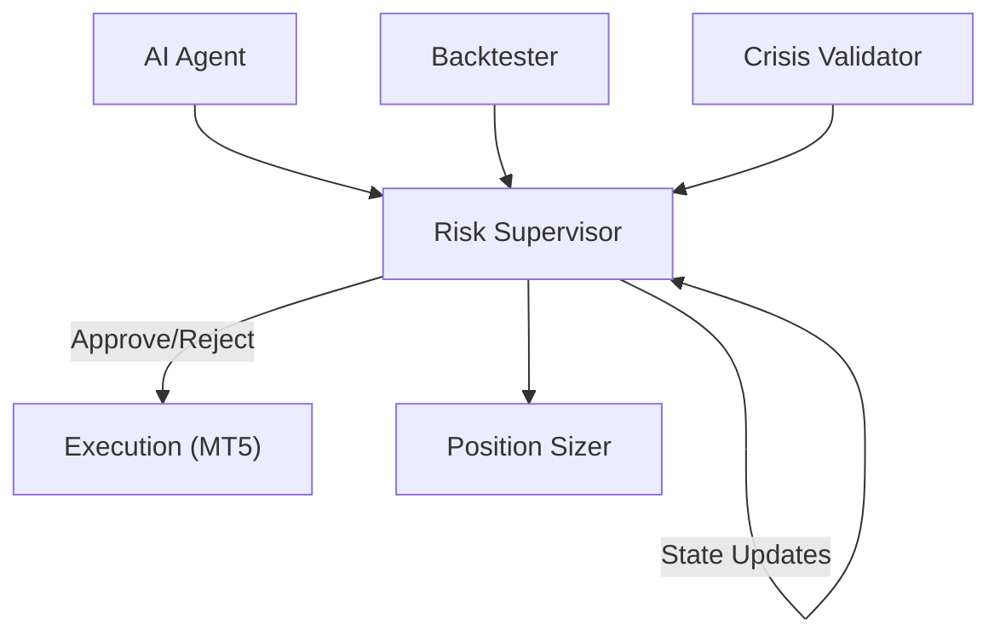
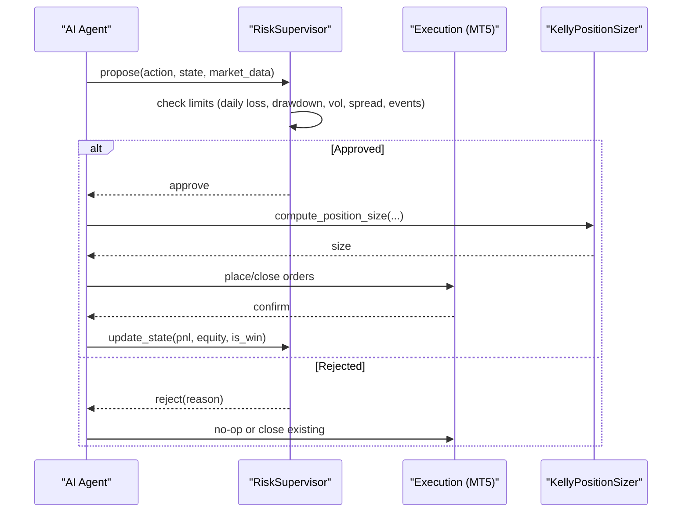
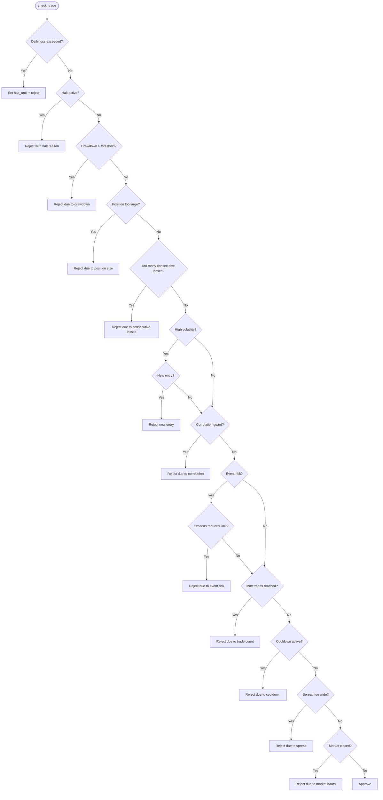
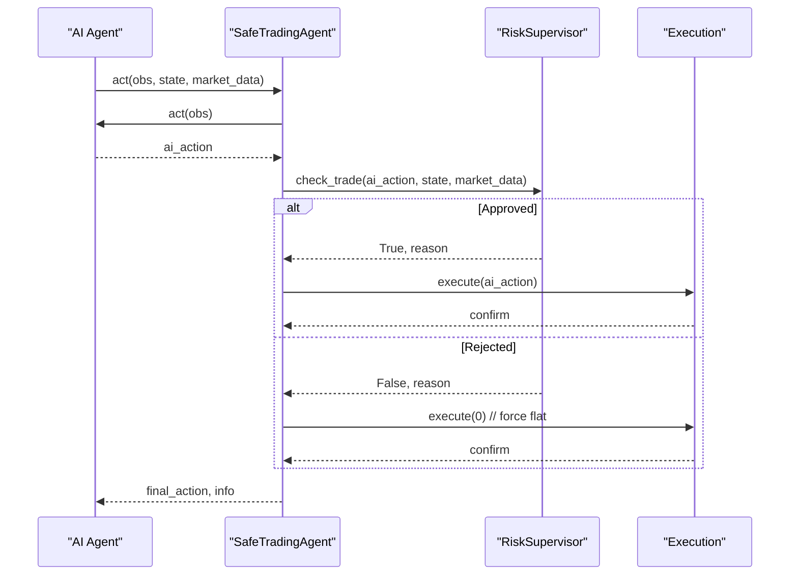
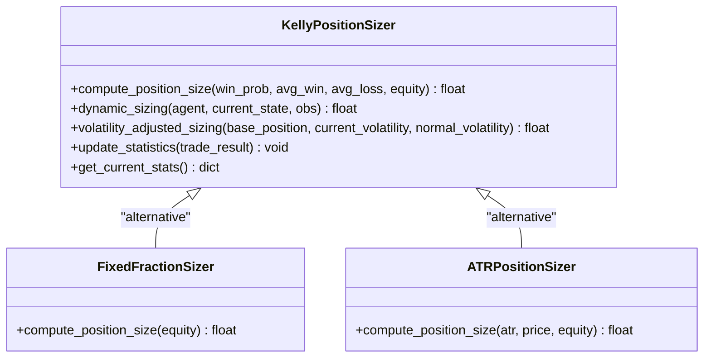
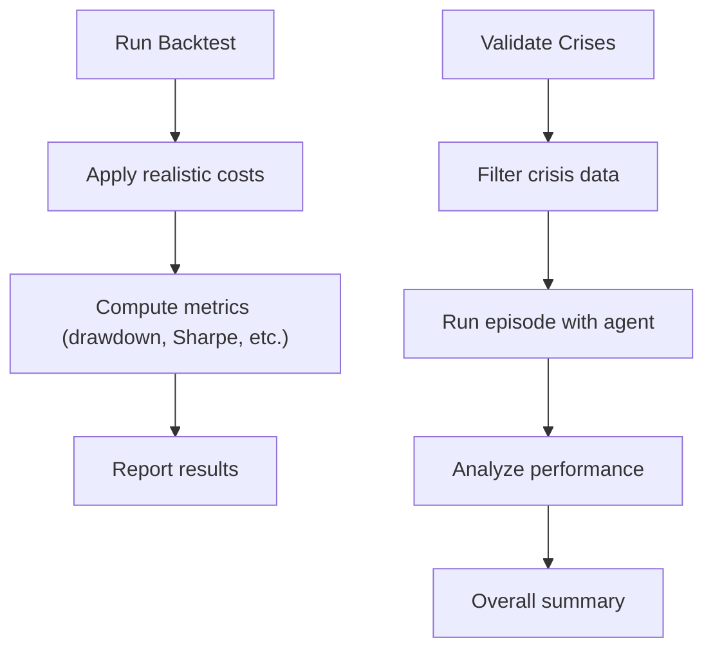
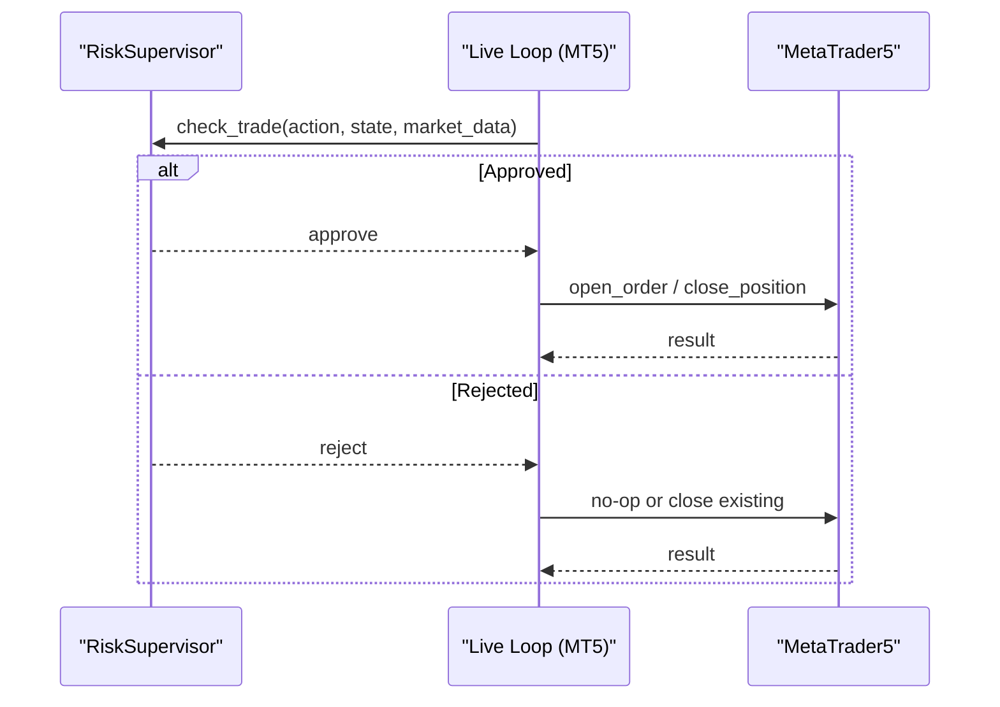
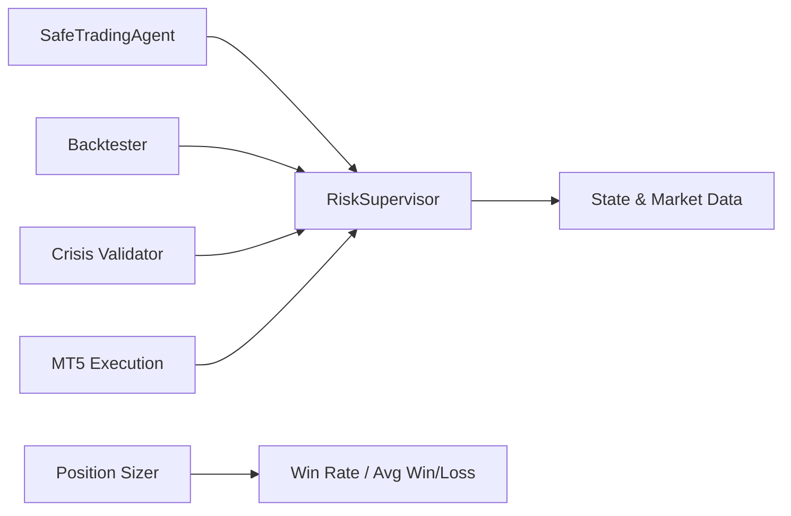

# Risk Supervision

<cite>
**Referenced Files in This Document**
- [risk_supervisor.py](file://models/risk_supervisor.py)
- [position_sizing.py](file://models/position_sizing.py)
- [backtest_engine.py](file://backtest/backtest_engine.py)
- [crisis_validation.py](file://eval/crisis_validation.py)
- [live_trade_mt5.py](file://live/live_trade_mt5.py)
- [xauusd_env.py](file://env/xauusd_env.py)
</cite>

## Table of Contents
1. [Introduction](#introduction)
2. [Project Structure](#project-structure)
3. [Core Components](#core-components)
4. [Architecture Overview](#architecture-overview)
5. [Detailed Component Analysis](#detailed-component-analysis)
6. [Dependency Analysis](#dependency-analysis)
7. [Performance Considerations](#performance-considerations)
8. [Troubleshooting Guide](#troubleshooting-guide)
9. [Conclusion](#conclusion)
10. [Appendices](#appendices)

## Introduction
This document explains the risk supervision system that provides safety overrides and drawdown protection for trading operations. It covers real-time position tracking, drawdown detection, automatic intervention triggers, and configurable risk parameters such as maximum daily losses, position concentration limits, and correlation-based exposure controls. It also documents how the supervisor can halt trading when thresholds are breached, integrates with execution systems to cancel orders and close positions, and provides guidance on tuning parameters and validating controls via backtesting and crisis validation.

## Project Structure
The risk supervision system is implemented as a deterministic safety layer that sits between the AI agent and the execution engine. Key modules include:
- Risk Supervisor: Hard-coded rules to approve/reject trades and enforce circuit breakers.
- Position Sizing: Kelly-based and volatility-adjusted sizing to control exposure.
- Backtesting: Realistic cost modeling and walk-forward validation to test risk controls.
- Crisis Validation: Stress testing across known historical crises.
- Live Execution: MetaTrader 5 integration for order placement and closure.
- Environment: Gym-style environment used for training and evaluation.

**Diagram sources**
- [risk_supervisor.py:18-174](file://models/risk_supervisor.py#L18-L174)
- [position_sizing.py:29-111](file://models/position_sizing.py#L29-L111)
- [backtest_engine.py:24-146](file://backtest/backtest_engine.py#L24-L146)
- [crisis_validation.py:29-171](file://eval/crisis_validation.py#L29-L171)
- [live_trade_mt5.py:32-96](file://live/live_trade_mt5.py#L32-L96)

**Section sources**
- [risk_supervisor.py:18-174](file://models/risk_supervisor.py#L18-L174)
- [position_sizing.py:29-111](file://models/position_sizing.py#L29-L111)
- [backtest_engine.py:24-146](file://backtest/backtest_engine.py#L24-L146)
- [crisis_validation.py:29-171](file://eval/crisis_validation.py#L29-L171)
- [live_trade_mt5.py:32-96](file://live/live_trade_mt5.py#L32-L96)

## Core Components
- RiskSupervisor: Enforces hard limits (daily loss, drawdown, volatility, spread, event risk, overtrading), tracks state (equity, peak equity, daily PnL, consecutive losses), and can trigger a time-bound or emergency halt.
- SafeTradingAgent: Wrapper that obtains an action from the AI agent and enforces the RiskSupervisor’s decision; if rejected, it forces a flat action.
- KellyPositionSizer: Computes optimal position sizes using fractional Kelly, with caps and volatility adjustments.
- RigorousBacktester: Simulates trades with realistic costs, slippage, and metrics including max drawdown and Sharpe ratio.
- CrisisValidator: Runs agents through predefined crisis periods and evaluates survival and drawdown constraints.
- MT5 Execution: Places and closes orders, supporting safe cancellation and position closure.

**Section sources**
- [risk_supervisor.py:18-174](file://models/risk_supervisor.py#L18-L174)
- [position_sizing.py:29-111](file://models/position_sizing.py#L29-L111)
- [backtest_engine.py:24-146](file://backtest/backtest_engine.py#L24-L146)
- [crisis_validation.py:29-171](file://eval/crisis_validation.py#L29-L171)
- [live_trade_mt5.py:32-96](file://live/live_trade_mt5.py#L32-L96)

## Architecture Overview
The system follows a layered architecture where the AI proposes actions, the RiskSupervisor validates them against market conditions and portfolio state, and only approved actions reach execution. The supervisor maintains state to track drawdowns, daily PnL, and trade frequency, and can intervene by halting trading or forcing flat positions.

**Diagram sources**
- [risk_supervisor.py:91-174](file://models/risk_supervisor.py#L91-L174)
- [position_sizing.py:66-111](file://models/position_sizing.py#L66-L111)
- [live_trade_mt5.py:32-96](file://live/live_trade_mt5.py#L32-L96)

## Detailed Component Analysis

### RiskSupervisor
- Purpose: Deterministic safety layer that overrides AI decisions to prevent catastrophic losses.
- Key checks:
  - Daily loss limit with circuit breaker (time-bound halt).
  - Maximum drawdown protection based on peak equity.
  - Position size limits.
  - Consecutive losses protection.
  - Volatility filter (restrict new entries during high volatility).
  - Correlation guard (e.g., USD momentum vs Gold).
  - Event risk filter (reduce position size during high-impact news windows).
  - Overtrading prevention (max trades per day, minimum interval).
  - Spread filter (avoid wide spreads).
  - Market hours check (optional).
- State management: Tracks daily PnL, equity, peak equity, trade counters, consecutive losses, and halt timers.
- Intervention mechanisms:
  - Time-bound halt until a specified time.
  - Emergency shutdown (long-term manual restart required).
  - Forcing flat action when rejected.

**Diagram sources**
- [risk_supervisor.py:91-174](file://models/risk_supervisor.py#L91-L174)

**Section sources**
- [risk_supervisor.py:18-174](file://models/risk_supervisor.py#L18-L174)

### SafeTradingAgent
- Purpose: Combines AI agent with RiskSupervisor to ensure all executed actions pass safety checks.
- Behavior:
  - Calls AI agent to get proposed action.
  - Invokes RiskSupervisor.check_trade.
  - If approved, executes AI action; if rejected, forces flat action and logs rejection reason.

**Diagram sources**
- [risk_supervisor.py:289-339](file://models/risk_supervisor.py#L289-L339)

**Section sources**
- [risk_supervisor.py:289-339](file://models/risk_supervisor.py#L289-L339)

### KellyPositionSizer
- Purpose: Compute optimal position sizes using fractional Kelly Criterion with caps and volatility adjustments.
- Features:
  - Fractional Kelly to reduce aggressiveness.
  - Dynamic sizing using agent’s value estimates to approximate win probability.
  - Volatility-adjusted sizing to maintain constant dollar risk.
  - Fixed fraction and ATR-based sizing alternatives.

**Diagram sources**
- [position_sizing.py:29-111](file://models/position_sizing.py#L29-L111)
- [position_sizing.py:265-335](file://models/position_sizing.py#L265-L335)

**Section sources**
- [position_sizing.py:29-111](file://models/position_sizing.py#L29-L111)
- [position_sizing.py:265-335](file://models/position_sizing.py#L265-L335)

### Backtester and Crisis Validator
- RigorousBacktester:
  - Models realistic transaction costs, slippage, and spread multipliers.
  - Computes comprehensive metrics including max drawdown, Sharpe, Sortino, Calmar ratios.
  - Supports walk-forward validation for robustness.
- CrisisValidator:
  - Tests agents across known crisis periods (e.g., COVID crash, rate hikes, SVB collapse).
  - Evaluates survival (final equity), drawdown limits, Sharpe thresholds, and overtrading.

**Diagram sources**
- [backtest_engine.py:73-146](file://backtest/backtest_engine.py#L73-L146)
- [crisis_validation.py:109-171](file://eval/crisis_validation.py#L109-L171)

**Section sources**
- [backtest_engine.py:73-146](file://backtest/backtest_engine.py#L73-L146)
- [crisis_validation.py:109-171](file://eval/crisis_validation.py#L109-L171)

### Execution Integration (MetaTrader 5)
- Order Placement and Closure:
  - open_order places buy/sell orders with symbol, volume, deviation, magic number, and filling type.
  - close_position retrieves positions and sends closing orders.
- Safety Hooks:
  - In live mode, integrate RiskSupervisor before calling open_order/close_position to ensure only approved actions execute.
  - Use consistent magic numbers to identify agent-managed positions.

**Diagram sources**
- [live_trade_mt5.py:32-96](file://live/live_trade_mt5.py#L32-L96)
- [risk_supervisor.py:91-174](file://models/risk_supervisor.py#L91-L174)

**Section sources**
- [live_trade_mt5.py:32-96](file://live/live_trade_mt5.py#L32-L96)

## Dependency Analysis
- RiskSupervisor depends on market_data inputs (volatility, spread, DXY momentum, event flags) and state (position, equity).
- SafeTradingAgent depends on both AI agent and RiskSupervisor.
- Position sizers depend on statistical estimates (win rate, average win/loss) and volatility measures.
- Backtester and CrisisValidator depend on historical data and agent behavior to evaluate risk controls.
- Live execution depends on MT5 connectivity and order APIs.

**Diagram sources**
- [risk_supervisor.py:91-174](file://models/risk_supervisor.py#L91-L174)
- [position_sizing.py:66-111](file://models/position_sizing.py#L66-L111)
- [backtest_engine.py:73-146](file://backtest/backtest_engine.py#L73-L146)
- [crisis_validation.py:109-171](file://eval/crisis_validation.py#L109-L171)
- [live_trade_mt5.py:32-96](file://live/live_trade_mt5.py#L32-L96)

**Section sources**
- [risk_supervisor.py:91-174](file://models/risk_supervisor.py#L91-L174)
- [position_sizing.py:66-111](file://models/position_sizing.py#L66-L111)
- [backtest_engine.py:73-146](file://backtest/backtest_engine.py#L73-L146)
- [crisis_validation.py:109-171](file://eval/crisis_validation.py#L109-L171)
- [live_trade_mt5.py:32-96](file://live/live_trade_mt5.py#L32-L96)

## Performance Considerations
- Conservative defaults: The RiskSupervisor uses conservative thresholds (e.g., 2% daily loss, 15% drawdown) to protect capital.
- Cost-aware backtesting: Realistic spread, slippage, and commission assumptions prevent overoptimistic performance estimates.
- Volatility scaling: Position sizing adjusts to market volatility to maintain consistent risk exposure.
- Event risk filters: Reduce position sizes during high-impact news to avoid adverse moves.
- Circuit breakers: Time-bound halts and emergency shutdowns prevent runaway losses.

[No sources needed since this section provides general guidance]

## Troubleshooting Guide
- Frequent rejections:
  - Check spread filter and volatility thresholds; widen intervals or adjust thresholds if necessary.
  - Review event risk windows; consider reducing exposure during news.
- Halts triggered:
  - Inspect daily PnL and drawdown; reset daily counters at midnight UTC.
  - Use emergency_shutdown only for critical failures requiring manual restart.
- Execution issues:
  - Ensure MT5 connection and correct symbol/timeframe settings.
  - Verify magic numbers and order types match broker requirements.
- Backtest discrepancies:
  - Validate cost assumptions (spread multiplier, slippage) align with live conditions.
  - Use walk-forward validation to assess stability across regimes.

**Section sources**
- [risk_supervisor.py:176-241](file://models/risk_supervisor.py#L176-L241)
- [backtest_engine.py:202-217](file://backtest/backtest_engine.py#L202-L217)
- [live_trade_mt5.py:111-174](file://live/live_trade_mt5.py#L111-L174)

## Conclusion
The risk supervision system provides a robust, deterministic safety layer that protects trading operations through real-time monitoring, drawdown protection, and automatic interventions. It integrates seamlessly with execution systems to ensure safe order handling and supports rigorous validation via backtesting and crisis analysis. Proper tuning of risk parameters and continuous monitoring are essential to adapt to varying market conditions and strategy behaviors.

[No sources needed since this section summarizes without analyzing specific files]

## Appendices

### Configurable Risk Parameters
- Maximum daily loss: Limits cumulative daily PnL; triggers a time-bound halt when breached.
- Maximum drawdown: Protects against sustained equity declines relative to peak.
- Position size limits: Caps exposure per trade to manage concentration risk.
- Volatility threshold: Restricts new entries during high volatility.
- Spread filter: Avoids trading when spreads exceed acceptable levels.
- Event risk filter: Reduces position sizes during high-impact news windows.
- Overtrading prevention: Enforces maximum trades per day and minimum intervals.
- Correlation guard: Uses correlated asset signals (e.g., DXY momentum) to restrict risky entries.

**Section sources**
- [risk_supervisor.py:35-89](file://models/risk_supervisor.py#L35-L89)
- [risk_supervisor.py:91-174](file://models/risk_supervisor.py#L91-L174)

### Examples of Supervisor Intervention
- Market stress scenario:
  - High volatility detected; new entries blocked while allowing exits.
  - Correlation guard rejects long Gold when USD rallies strongly.
- Emergency liquidation:
  - Daily loss limit exceeded; circuit breaker activates and halts trading for a defined period.
  - Emergency shutdown invoked for severe anomalies; requires manual restart.
- Multi-position management:
  - Track daily PnL and equity to enforce drawdown limits across all positions.
  - Adjust position sizes via Kelly sizing to maintain consistent risk.

**Section sources**
- [risk_supervisor.py:91-174](file://models/risk_supervisor.py#L91-L174)
- [risk_supervisor.py:176-241](file://models/risk_supervisor.py#L176-L241)

### Tuning Guidance and Backtesting Approaches
- Parameter tuning:
  - Start with conservative defaults; gradually relax thresholds based on backtest results and live performance.
  - Adjust volatility and spread thresholds according to instrument characteristics and market regime.
  - Use fractional Kelly and volatility-adjusted sizing to balance growth and risk.
- Backtesting:
  - Use realistic costs and slippage; validate with walk-forward splits.
  - Test across crisis periods to ensure resilience; aim for survival and controlled drawdowns.
- Validation:
  - Monitor approval/rejection rates and reasons to refine thresholds.
  - Compare backtested metrics (Sharpe, Sortino, Calmar) with live outcomes to calibrate expectations.

**Section sources**
- [backtest_engine.py:73-146](file://backtest/backtest_engine.py#L73-L146)
- [crisis_validation.py:109-171](file://eval/crisis_validation.py#L109-L171)
- [position_sizing.py:66-111](file://models/position_sizing.py#L66-L111)