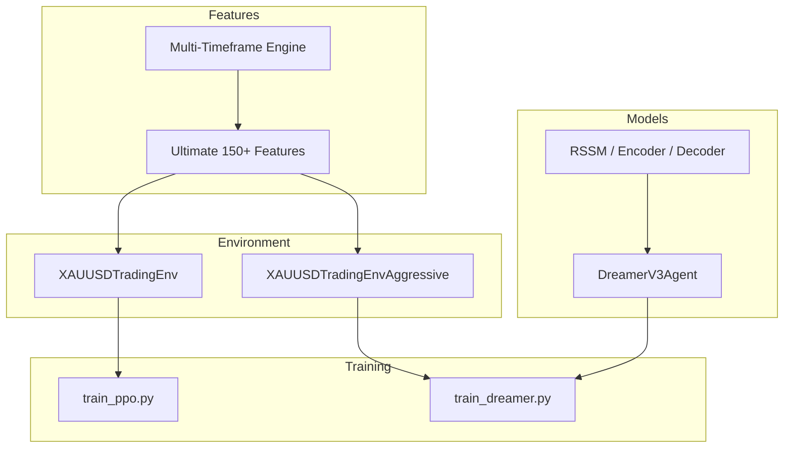
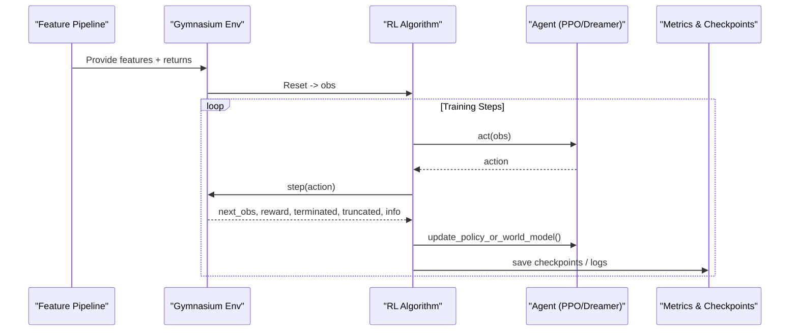
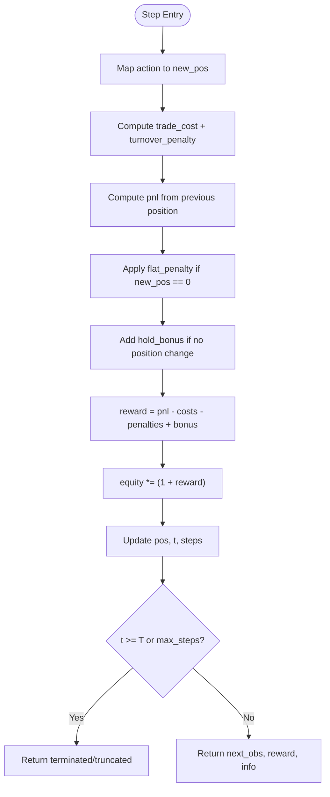
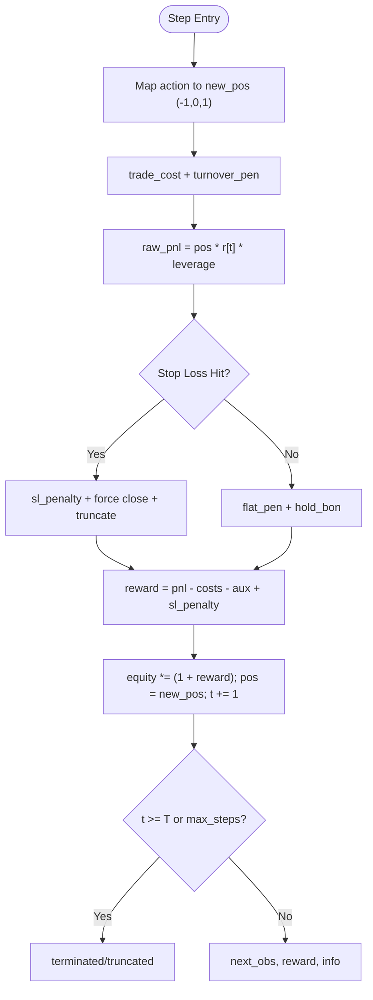
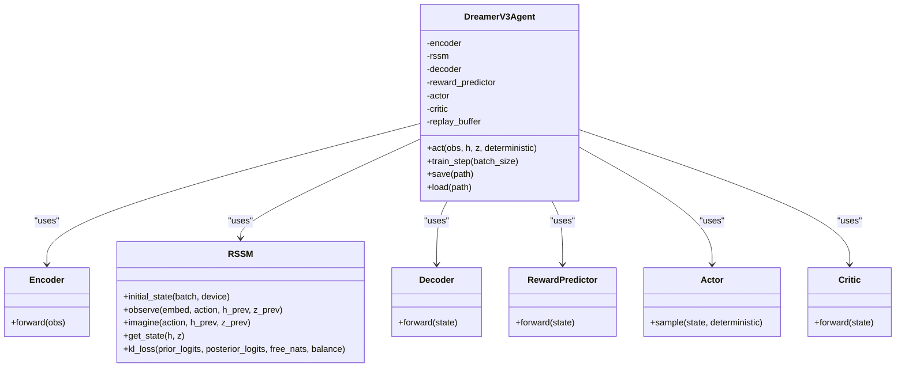
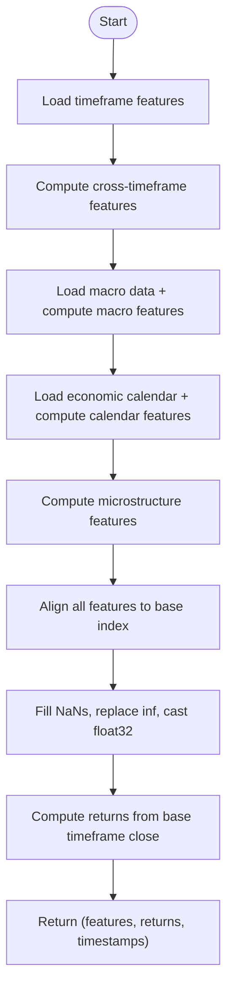
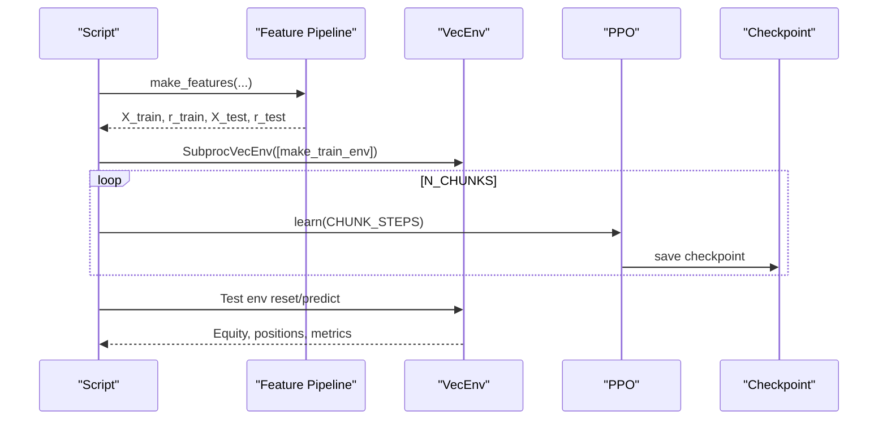
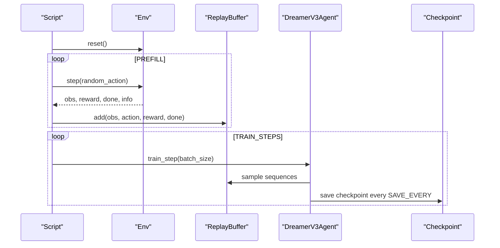
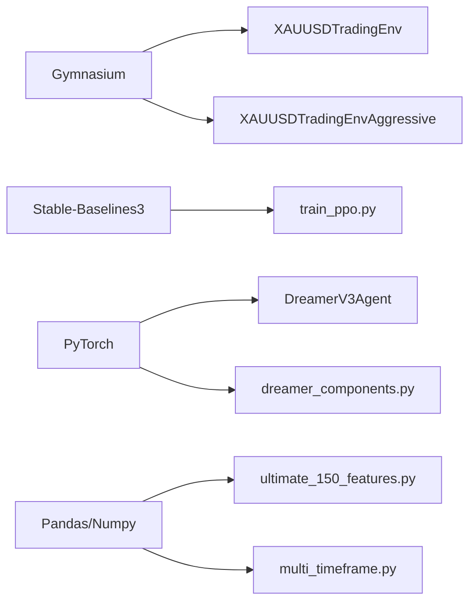

# Project Overview

<cite>
**Referenced Files in This Document**
- [README.md](file://README.md)
- [xauusd_env.py](file://env/xauusd_env.py)
- [xauusd_env_aggressive.py](file://env/xauusd_env_aggressive.py)
- [dreamer_agent.py](file://models/dreamer_agent.py)
- [dreamer_components.py](file://models/dreamer_components.py)
- [train_ppo.py](file://train/train_ppo.py)
- [train_dreamer.py](file://train/train_dreamer.py)
- [ultimate_150_features.py](file://features/ultimate_150_features.py)
- [multi_timeframe.py](file://features/multi_timeframe.py)
</cite>

## Table of Contents
1. [Introduction](#introduction)
2. [Project Structure](#project-structure)
3. [Core Components](#core-components)
4. [Architecture Overview](#architecture-overview)
5. [Detailed Component Analysis](#detailed-component-analysis)
6. [Dependency Analysis](#dependency-analysis)
7. [Performance Considerations](#performance-considerations)
8. [Troubleshooting Guide](#troubleshooting-guide)
9. [Conclusion](#conclusion)
10. [Appendices](#appendices)

## Introduction
This project is an autonomous trading AI system designed to trade gold (XAUUSD) using Deep Reinforcement Learning (DRL). It combines a rich feature set (140+ market features), multi-timeframe analysis, and macro-aware signals to make trading decisions across time horizons. The system supports two core algorithms:
- PPO (Proximal Policy Optimization): A stable, widely used on-policy algorithm for continuous control tasks like position sizing and directional decisions.
- Dreamer V3: A model-based RL approach that learns a world model of market dynamics and plans via imagination, improving sample efficiency and long-horizon reasoning.

The environment is implemented as a Gymnasium environment, enabling standardized training with RL libraries such as Stable-Baselines3. Feature engineering integrates technical indicators, cross-timeframe relationships, macro correlations, economic calendar events, and microstructure signals into a unified observation space.

Conceptually, the system:
- Observes a rolling window of engineered features plus current position state.
- Decides actions (e.g., flat, long, short depending on environment variant).
- Receives rewards based on realized returns, costs, turnover penalties, and optional risk controls.
- Updates policy or world model to maximize cumulative reward over time.

For beginners, think of this as teaching an AI to “read” many market signals simultaneously and learn from simulated trades how to profit while managing risk. For experienced developers, the codebase provides modular environments, robust feature pipelines, and production-grade RL training loops with checkpointing and evaluation.

**Section sources**
- [README.md:27-41](file://README.md#L27-L41)
- [README.md:45-70](file://README.md#L45-L70)
- [README.md:73-120](file://README.md#L73-L120)
- [README.md:172-216](file://README.md#L172-L216)

## Project Structure
At a high level, the repository is organized by responsibility:
- env: Trading environments implementing the Gymnasium interface for RL training and evaluation.
- features: Comprehensive feature engineering pipeline combining multiple data sources and timeframes.
- models: RL agent implementations including Dreamer V3 components and auxiliary modules.
- train: Training scripts for PPO and Dreamer V3 with configuration and checkpointing.
- live: Live trading integrations (MT5, MetaAPI).
- backtest, eval: Backtesting and evaluation utilities.
- scripts: Data fetching and preprocessing helpers.

**Diagram sources**
- [ultimate_150_features.py:27-226](file://features/ultimate_150_features.py#L27-L226)
- [multi_timeframe.py:32-96](file://features/multi_timeframe.py#L32-L96)
- [xauusd_env.py:7-57](file://env/xauusd_env.py#L7-L57)
- [xauusd_env_aggressive.py:6-64](file://env/xauusd_env_aggressive.py#L6-L64)
- [dreamer_agent.py:84-147](file://models/dreamer_agent.py#L84-L147)
- [dreamer_components.py:71-200](file://models/dreamer_components.py#L71-L200)
- [train_ppo.py:25-67](file://train/train_ppo.py#L25-L67)
- [train_dreamer.py:128-200](file://train/train_dreamer.py#L128-L200)

**Section sources**
- [README.md:418-471](file://README.md#L418-L471)

## Core Components
- XAUUSDTradingEnv: A Gymnasium environment for long-only discrete trading with a sliding window observation, cost-aware reward shaping, and equity tracking.
- XAUUSDTradingEnvAggressive: An extended environment supporting long/short positions, leverage, stop-loss logic, and stricter realism in costs and penalties.
- DreamerV3Agent: A complete Dreamer V3 implementation with encoder, RSSM world model, decoder, reward predictor, actor, critic, replay buffer, and training loop for world model + imagined policy updates.
- Ultimate 150+ Features: Master pipeline aggregating timeframe features, cross-timeframe metrics, macro correlations, economic calendar signals, and microstructure features into a unified dataset.
- Multi-Timeframe Engine: Computes aligned features across M5/M15/H1/H4/D1/W1 and derives cross-timeframe alignment and regime signals.

These components work together to provide a robust RL training setup where the agent observes rich market context and learns policies that balance return and risk.

**Section sources**
- [xauusd_env.py:7-118](file://env/xauusd_env.py#L7-L118)
- [xauusd_env_aggressive.py:6-144](file://env/xauusd_env_aggressive.py#L6-L144)
- [dreamer_agent.py:84-460](file://models/dreamer_agent.py#L84-L460)
- [dreamer_components.py:71-200](file://models/dreamer_components.py#L71-L200)
- [ultimate_150_features.py:27-226](file://features/ultimate_150_features.py#L27-L226)
- [multi_timeframe.py:32-200](file://features/multi_timeframe.py#L32-L200)

## Architecture Overview
The system follows a standard RL architecture adapted for financial markets:
- Observation: Rolling window of engineered features (timeframe, macro, calendar, microstructure) concatenated with current position state.
- Action Space: Discrete actions (flat/long; or short/flat/long in aggressive mode).
- Reward: Realized returns adjusted for transaction costs, turnover penalties, flat penalties, hold bonuses, and optional stop-loss penalties.
- Environment: Gymnasium-compliant step/reset semantics with termination/truncation handling.
- Algorithms:
  - PPO: Trained via Stable-Baselines3 with parallel environments and periodic checkpointing.
  - Dreamer V3: Learns a world model (encoder + RSSM + decoder + reward predictor) and improves policy via imagined trajectories and actor-critic updates.

**Diagram sources**
- [ultimate_150_features.py:27-226](file://features/ultimate_150_features.py#L27-L226)
- [xauusd_env.py:70-118](file://env/xauusd_env.py#L70-L118)
- [xauusd_env_aggressive.py:81-144](file://env/xauusd_env_aggressive.py#L81-L144)
- [train_ppo.py:25-67](file://train/train_ppo.py#L25-L67)
- [train_dreamer.py:128-200](file://train/train_dreamer.py#L128-L200)
- [dreamer_agent.py:190-304](file://models/dreamer_agent.py#L190-L304)

## Detailed Component Analysis

### XAUUSDTradingEnv (Long-Only)
- Purpose: Provides a simple, cost-aware environment for learning long-only strategies with discrete actions.
- Observation: Concatenates a sliding window of features and current position.
- Actions: Flat (0) or Long (1).
- Reward: Includes realized returns, trade costs, turnover penalty, flat penalty, and hold bonus to encourage stability.
- Termination: Episode ends at horizon or max steps.

**Diagram sources**
- [xauusd_env.py:75-118](file://env/xauusd_env.py#L75-L118)

**Section sources**
- [xauusd_env.py:7-118](file://env/xauusd_env.py#L7-L118)

### XAUUSDTradingEnvAggressive (Long/Short, Leverage, Stop-Loss)
- Purpose: Supports long/short actions, leverage, and stop-loss logic to enforce realistic risk management during training.
- Observation: Sliding window plus current position (-1, 0, 1).
- Actions: Short (0), Flat (1), Long (2).
- Reward: Incorporates leverage-adjusted PnL, costs, turnover, optional flat penalty/hold bonus, and heavy stop-loss penalty with truncation to teach safety.

**Diagram sources**
- [xauusd_env_aggressive.py:86-144](file://env/xauusd_env_aggressive.py#L86-L144)

**Section sources**
- [xauusd_env_aggressive.py:6-144](file://env/xauusd_env_aggressive.py#L6-L144)

### Dreamer V3 Agent
- Purpose: Implements a world model-based RL agent that learns market dynamics and plans via imagination.
- Components:
  - Encoder: Compresses observations into embeddings.
  - RSSM: Recurrent State Space Model with deterministic hidden state and stochastic latent states; supports observe and imagine modes.
  - Decoder: Reconstructs observations from latent state.
  - Reward Predictor: Predicts rewards in latent space.
  - Actor-Critic: Policy and value networks trained on imagined trajectories.
- Training Loop:
  - Phase 1: Train world model (reconstruction, reward prediction, KL regularization).
  - Phase 2: Imagine trajectories and train actor-critic using lambda-returns and policy gradients.

**Diagram sources**
- [dreamer_agent.py:84-147](file://models/dreamer_agent.py#L84-L147)
- [dreamer_components.py:71-200](file://models/dreamer_components.py#L71-L200)

**Section sources**
- [dreamer_agent.py:84-460](file://models/dreamer_agent.py#L84-L460)
- [dreamer_components.py:71-200](file://models/dreamer_components.py#L71-L200)

### Feature Engineering: Ultimate 150+ Features
- Purpose: Aggregates diverse data sources into a comprehensive observation matrix for RL agents.
- Sources:
  - Timeframe features across M5/M15/H1/H4/D1/W1.
  - Cross-timeframe alignment and regime signals.
  - Macro correlations (e.g., DXY, SPX, US10Y, VIX, Oil, Bitcoin).
  - Economic calendar events (NFP, CPI, FOMC, GDP).
  - Market microstructure signals (order flow proxies, spread monitoring, volatility regimes).
- Output: Unified feature matrix and target returns aligned to a base timeframe index.

**Diagram sources**
- [ultimate_150_features.py:27-226](file://features/ultimate_150_features.py#L27-L226)

**Section sources**
- [ultimate_150_features.py:27-226](file://features/ultimate_150_features.py#L27-L226)
- [multi_timeframe.py:32-200](file://features/multi_timeframe.py#L32-L200)

### PPO Training Workflow
- Purpose: Train a PPO policy on the trading environment using parallel environments and periodic checkpointing.
- Key Steps:
  - Generate features and returns.
  - Split into train/test sets by date.
  - Create vectorized environments.
  - Train in chunks with saving checkpoints.
  - Quick evaluation on test set.

**Diagram sources**
- [train_ppo.py:25-87](file://train/train_ppo.py#L25-L87)

**Section sources**
- [train_ppo.py:25-93](file://train/train_ppo.py#L25-L93)

### Dreamer V3 Training Workflow
- Purpose: Train a world model and policy using sequence-based replay and imagined rollouts.
- Key Steps:
  - Prepare environment and observation dimension.
  - Prefill replay buffer with random exploration.
  - Alternate between world model training and actor-critic updates on imagined trajectories.
  - Save checkpoints periodically.

**Diagram sources**
- [train_dreamer.py:128-200](file://train/train_dreamer.py#L128-L200)
- [dreamer_agent.py:190-304](file://models/dreamer_agent.py#L190-L304)

**Section sources**
- [train_dreamer.py:128-200](file://train/train_dreamer.py#L128-L200)
- [dreamer_agent.py:190-304](file://models/dreamer_agent.py#L190-L304)

## Dependency Analysis
Key dependencies and their roles:
- Gymnasium: Standard RL environment interface used by both trading environments.
- Stable-Baselines3: Used for PPO training and vectorized environments.
- PyTorch: Underlying framework for Dreamer V3 components and agent logic.
- Pandas/Numpy: Data manipulation and numerical computations in feature engineering and environment steps.
- Optional: MetaTrader5/MetaAPI for live trading integration (not analyzed here).

**Diagram sources**
- [xauusd_env.py:1-5](file://env/xauusd_env.py#L1-L5)
- [xauusd_env_aggressive.py:1-4](file://env/xauusd_env_aggressive.py#L1-L4)
- [train_ppo.py:1-9](file://train/train_ppo.py#L1-L9)
- [dreamer_agent.py:11-21](file://models/dreamer_agent.py#L11-L21)
- [dreamer_components.py:15-19](file://models/dreamer_components.py#L15-L19)
- [ultimate_150_features.py:18-21](file://features/ultimate_150_features.py#L18-L21)
- [multi_timeframe.py:23-26](file://features/multi_timeframe.py#L23-L26)

**Section sources**
- [train_ppo.py:1-9](file://train/train_ppo.py#L1-L9)
- [dreamer_agent.py:11-21](file://models/dreamer_agent.py#L11-L21)
- [dreamer_components.py:15-19](file://models/dreamer_components.py#L15-L19)
- [ultimate_150_features.py:18-21](file://features/ultimate_150_features.py#L18-L21)
- [multi_timeframe.py:23-26](file://features/multi_timeframe.py#L23-L26)

## Performance Considerations
- Feature Dimensionality: The ultimate feature set increases observation size significantly; ensure sufficient memory and consider batching strategies.
- Parallel Environments: PPO uses vectorized environments to accelerate training; tune n_envs based on hardware.
- Hardware Acceleration: Use CUDA or MPS for faster training; Dreamer V3 benefits from GPU acceleration due to recurrent and neural network operations.
- Reward Shaping: Cost-aware rewards and penalties help prevent overtrading and encourage stable policies; adjust parameters per strategy.
- Stop-Loss and Risk Controls: Aggressive environment includes stop-loss logic to enforce risk awareness; calibrate thresholds to match real-world execution.
- Evaluation: Always evaluate on out-of-sample data and perform crisis validation to assess robustness under stress conditions.

[No sources needed since this section provides general guidance]

## Troubleshooting Guide
Common issues and resolutions:
- Environment Errors: Ensure features and returns arrays are aligned in length and dtype; verify observation shape matches expected dimensions.
- Training Instability: Adjust learning rates, batch sizes, and gradient clipping; monitor losses and rewards for divergence.
- Memory Issues: Reduce window size or batch size; use float32 features and avoid unnecessary copies.
- Data Alignment: When combining multi-timeframe and macro features, align indices and handle missing values consistently.
- Live Trading Setup: Verify API keys and broker connections; start with demo accounts and small position sizes.

**Section sources**
- [xauusd_env.py:31-38](file://env/xauusd_env.py#L31-L38)
- [xauusd_env_aggressive.py:36-40](file://env/xauusd_env_aggressive.py#L36-L40)
- [dreamer_agent.py:190-204](file://models/dreamer_agent.py#L190-L204)
- [ultimate_150_features.py:156-182](file://features/ultimate_150_features.py#L156-L182)

## Conclusion
This autonomous trading AI system integrates advanced feature engineering, robust RL environments, and state-of-the-art algorithms (PPO and Dreamer V3) to autonomously trade XAUUSD. By leveraging 140+ market features and multi-timeframe analysis, it captures nuanced market dynamics and adapts to changing regimes. The modular design enables experimentation with different risk profiles and strategies, while the Gymnasium interface ensures compatibility with established RL toolchains. For beginners, it offers an accessible entry point into algorithmic trading with clear workflows; for quantitative developers, it provides a flexible foundation for research and production deployment.

[No sources needed since this section summarizes without analyzing specific files]

## Appendices
- Practical Examples:
  - Long-Only Strategy: Use XAUUSDTradingEnv with PPO to learn conservative entries and exits, focusing on cost-aware rewards and stability bonuses.
  - Aggressive Strategy: Use XAUUSDTradingEnvAggressive with Dreamer V3 to explore long/short opportunities with leverage and stop-loss enforcement.
  - Feature-Driven Training: Generate ultimate features to expose the agent to macro and micro signals, improving decision quality across regimes.

[No sources needed since this section provides conceptual examples]