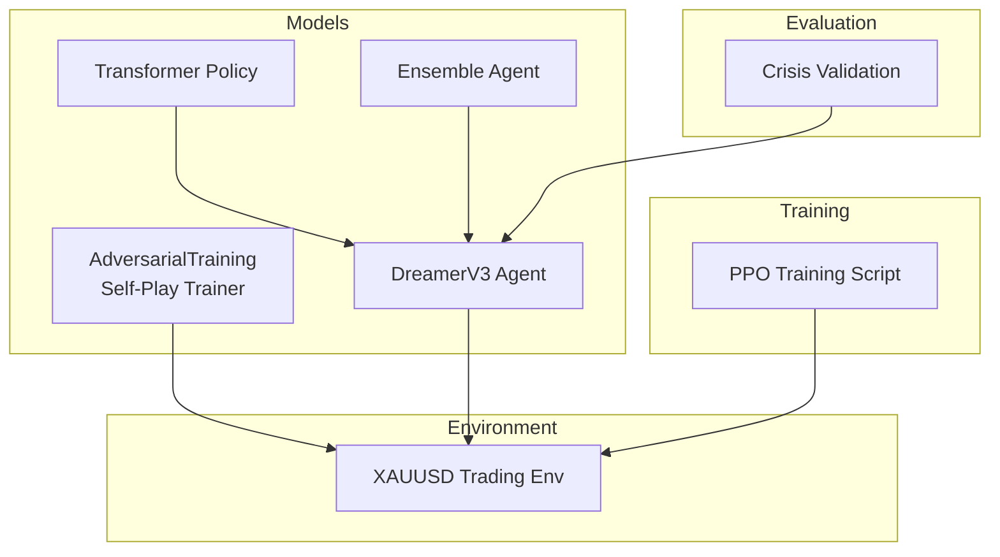
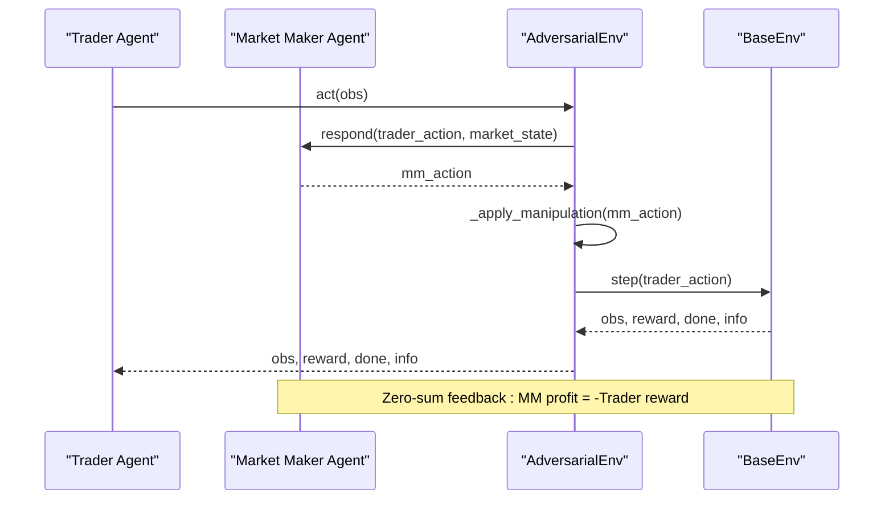
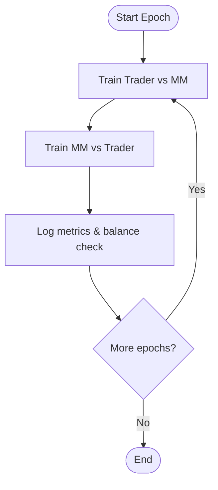
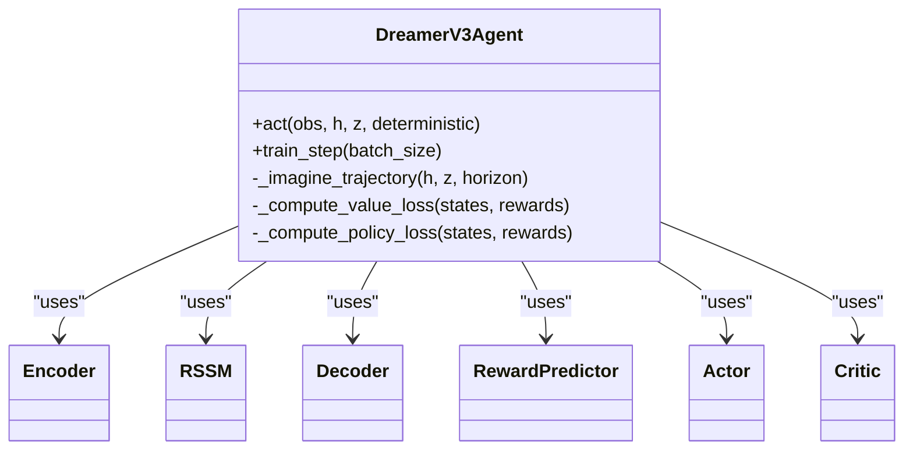
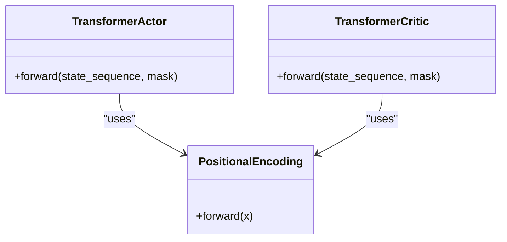
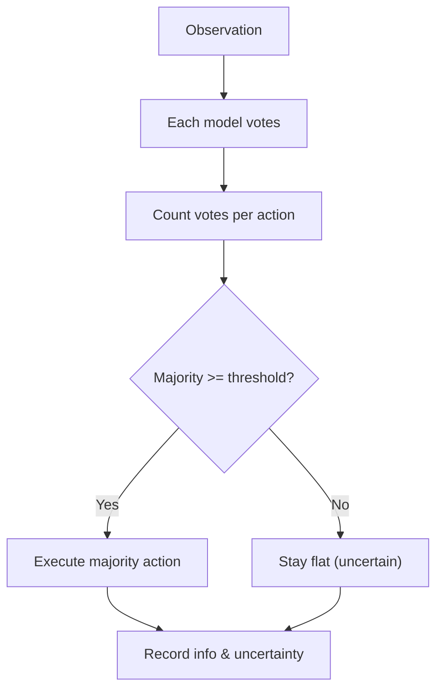
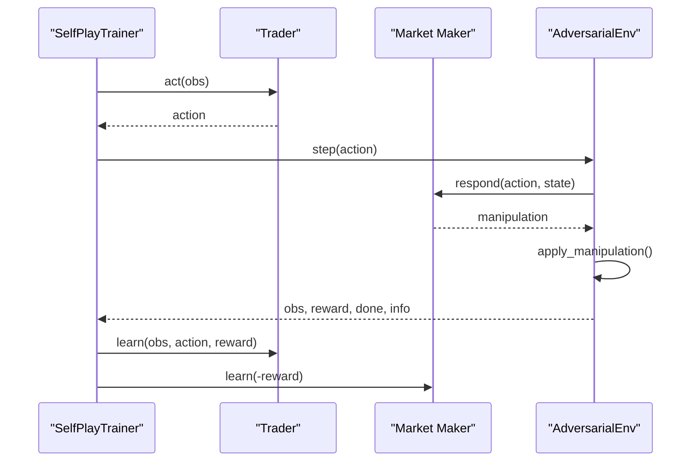
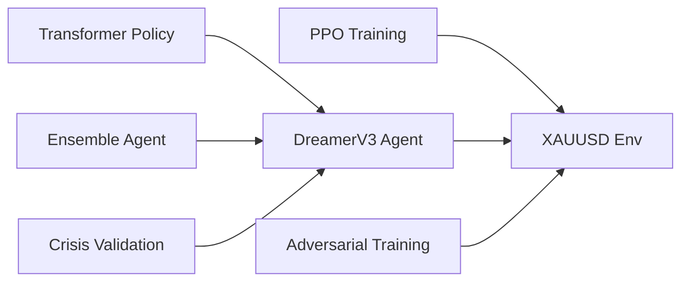

# Adversarial Training Techniques

<cite>
**Referenced Files in This Document**
- [adversarial_training.py](file://models/adversarial_training.py)
- [xauusd_env.py](file://env/xauusd_env.py)
- [train_ppo.py](file://train/train_ppo.py)
- [dreamer_agent.py](file://models/dreamer_agent.py)
- [transformer_policy.py](file://models/transformer_policy.py)
- [ensemble.py](file://models/ensemble.py)
- [crisis_validation.py](file://eval/crisis_validation.py)
- [README.md](file://README.md)
</cite>

## Table of Contents
1. [Introduction](#introduction)
2. [Project Structure](#project-structure)
3. [Core Components](#core-components)
4. [Architecture Overview](#architecture-overview)
5. [Detailed Component Analysis](#detailed-component-analysis)
6. [Dependency Analysis](#dependency-analysis)
7. [Performance Considerations](#performance-considerations)
8. [Troubleshooting Guide](#troubleshooting-guide)
9. [Conclusion](#conclusion)

## Introduction
This document explains the adversarial training techniques implemented to improve the robustness of trading agents. It focuses on:
- The adversarial framework that perturbs observations or market conditions to train policies resilient to worst-case scenarios.
- Attack generation processes that create challenging environments for policy evaluation and learning.
- Defense mechanisms that make policies invariant to small observation perturbations while preserving performance on clean data.
- Concrete examples from the codebase, including self-play adversarial training, dual training loops for trader and adversary, and gradient manipulation techniques.
- Hyperparameters controlling attack strength, perturbation bounds, and balancing robustness versus accuracy.
- How adversarial training mitigates overfitting to specific market regimes and improves generalization.
- Computational overhead and training stability considerations when implementing adversarial training.

## Project Structure
The repository organizes RL components, environments, and training scripts into clear modules. Adversarial training is encapsulated under models, with environment wrappers enabling adversarial interactions. Training orchestration lives under train, and evaluation utilities help validate robustness across crises.

**Diagram sources**
- [adversarial_training.py:358-438](file://models/adversarial_training.py#L358-L438)
- [dreamer_agent.py:84-140](file://models/dreamer_agent.py#L84-L140)
- [transformer_policy.py:67-153](file://models/transformer_policy.py#L67-L153)
- [ensemble.py:27-130](file://models/ensemble.py#L27-L130)
- [xauusd_env.py:7-118](file://env/xauusd_env.py#L7-L118)
- [train_ppo.py:25-67](file://train/train_ppo.py#L25-L67)
- [crisis_validation.py:29-171](file://eval/crisis_validation.py#L29-L171)

**Section sources**
- [README.md:418-471](file://README.md#L418-L471)

## Core Components
- Self-Play Adversarial Training: A Market Maker agent learns to manipulate market conditions (e.g., widen spreads, fake breakouts, stop hunts) to exploit a Trader’s weaknesses. A Self-Play Trainer alternates between training the Trader against the current Market Maker and improving the Market Maker against the current Trader.
- Adversarial Environment Wrapper: Wraps a base trading environment to inject manipulations based on the Market Maker’s actions, creating worst-case scenarios for the Trader.
- DreamerV3 World Model RL: Learns a world model and imagines trajectories to train actor-critic policies; supports gradient clipping and KL balancing for stability.
- Transformer Policy: Uses attention to capture long-range dependencies in historical state sequences, improving pattern recognition and robustness.
- Ensemble Agent: Aggregates multiple models to reduce variance and overfitting, providing uncertainty estimates via disagreement.
- Crisis Validation: Evaluates agent behavior during known crisis periods to ensure robustness under stress.

**Section sources**
- [adversarial_training.py:35-221](file://models/adversarial_training.py#L35-L221)
- [adversarial_training.py:223-356](file://models/adversarial_training.py#L223-L356)
- [dreamer_agent.py:84-140](file://models/dreamer_agent.py#L84-L140)
- [transformer_policy.py:67-153](file://models/transformer_policy.py#L67-L153)
- [ensemble.py:27-130](file://models/ensemble.py#L27-L130)
- [crisis_validation.py:29-171](file://eval/crisis_validation.py#L29-L171)

## Architecture Overview
The adversarial architecture centers on a self-play loop where the Trader and Market Maker co-evolve. The Market Maker observes the Trader’s recent actions and market state to select manipulations. The Trader trains in an adversarial environment that applies these manipulations before executing its action. DreamerV3 provides a world model-based approach to imagine and plan under adversarial conditions, while Transformers enhance temporal reasoning. Ensembles add robustness through diversity and consensus.

**Diagram sources**
- [adversarial_training.py:252-289](file://models/adversarial_training.py#L252-L289)
- [adversarial_training.py:299-340](file://models/adversarial_training.py#L299-L340)

## Detailed Component Analysis

### Self-Play Adversarial Training
- Market Maker Agent: Encodes market state and detected Trader patterns to choose manipulation strategies such as widening spreads, creating fake breakouts, or hunting stops. It maintains a history of Trader actions to infer patterns and adapt.
- AdversarialTradingEnv: Intercepts Trader actions, applies Market Maker manipulations to the base environment, and returns modified transitions. Rewards are structured as zero-sum to drive adversarial dynamics.
- SelfPlayTrainer: Orchestrates alternating phases:
  - Phase 1: Train Trader against current Market Maker using the adversarial environment.
  - Phase 2: Train Market Maker against current Trader by leveraging rewards derived from Trader outcomes.

**Diagram sources**
- [adversarial_training.py:396-438](file://models/adversarial_training.py#L396-L438)

**Section sources**
- [adversarial_training.py:35-221](file://models/adversarial_training.py#L35-L221)
- [adversarial_training.py:223-356](file://models/adversarial_training.py#L223-L356)
- [adversarial_training.py:358-438](file://models/adversarial_training.py#L358-L438)

### DreamerV3 World Model and Gradient Manipulation
- World Model Training: Encodes observations, predicts next states and rewards, and balances representation learning with KL regularization to prevent collapse.
- Actor-Critic Training in Imagination: Imagines trajectories using the learned world model and updates value and policy networks. Gradient clipping stabilizes updates.
- Hyperparameters: Includes horizon length, discount factor, KL balance, and free nats to control exploration and representational capacity.

**Diagram sources**
- [dreamer_agent.py:84-140](file://models/dreamer_agent.py#L84-L140)
- [dreamer_agent.py:190-304](file://models/dreamer_agent.py#L190-L304)

**Section sources**
- [dreamer_agent.py:84-140](file://models/dreamer_agent.py#L84-L140)
- [dreamer_agent.py:190-304](file://models/dreamer_agent.py#L190-L304)

### Transformer-Based Policy for Temporal Robustness
- TransformerActor: Embeds sequences of states, adds positional encodings, and uses multi-head attention to identify relevant historical patterns for action selection.
- TransformerCritic: Estimates value functions over sequences, capturing long-term dependencies critical for robust valuation under adversarial conditions.
- Integration: Can replace MLP-based actor/critic in DreamerV3 to leverage attention-driven representations.

**Diagram sources**
- [transformer_policy.py:34-65](file://models/transformer_policy.py#L34-L65)
- [transformer_policy.py:67-153](file://models/transformer_policy.py#L67-L153)
- [transformer_policy.py:166-249](file://models/transformer_policy.py#L166-L249)

**Section sources**
- [transformer_policy.py:67-153](file://models/transformer_policy.py#L67-L153)
- [transformer_policy.py:166-249](file://models/transformer_policy.py#L166-L249)

### Ensemble Agent for Robustness and Uncertainty
- Consensus Decision-Making: Multiple models vote on actions; trade only if majority agrees above a threshold. Disagreement indicates uncertainty.
- Benefits: Reduces overfitting, improves generalization, and provides built-in risk management via uncertainty signals.

**Diagram sources**
- [ensemble.py:67-130](file://models/ensemble.py#L67-L130)

**Section sources**
- [ensemble.py:27-130](file://models/ensemble.py#L27-L130)

### Adversarial Example Generation and Dual Training Loops
- Attack Generation: The Market Maker selects manipulations (spread widening, fake breakouts, stop hunts) to create worst-case scenarios for the Trader. These manipulations are applied within the environment wrapper before executing the Trader’s action.
- Dual Training Loops:
  - Trader Loop: Optimizes policy to maximize reward under adversarial conditions.
  - Adversary Loop: Optimizes Market Maker to minimize Trader reward (zero-sum), driving continuous improvement.
- Gradient Manipulation: DreamerV3 employs gradient clipping and KL balancing to stabilize training under adversarial pressure.

**Diagram sources**
- [adversarial_training.py:396-484](file://models/adversarial_training.py#L396-L484)
- [adversarial_training.py:252-289](file://models/adversarial_training.py#L252-L289)

**Section sources**
- [adversarial_training.py:223-356](file://models/adversarial_training.py#L223-L356)
- [adversarial_training.py:358-484](file://models/adversarial_training.py#L358-L484)
- [dreamer_agent.py:255-263](file://models/dreamer_agent.py#L255-L263)

### Hyperparameters Controlling Attack Strength, Perturbation Bounds, and Balance
- Attack Strength: Controlled by the magnitude and duration of manipulations injected by the Market Maker (e.g., spread multiplier, price move magnitude, number of candles).
- Perturbation Bounds: In the base environment, costs and penalties influence how aggressively the policy trades; adversarial manipulations effectively bound observation changes by simulating realistic slippage and liquidity shocks.
- Training Balance: The zero-sum structure ensures balanced improvement; imbalance checks log warnings when total reward plus MM profit deviates significantly from zero.
- DreamerV3 Stability: Horizon length, gamma, lambda, free nats, and KL balance regulate imagination depth and representational constraints.

**Section sources**
- [adversarial_training.py:299-340](file://models/adversarial_training.py#L299-L340)
- [adversarial_training.py:431-435](file://models/adversarial_training.py#L431-L435)
- [dreamer_agent.py:91-111](file://models/dreamer_agent.py#L91-L111)
- [xauusd_env.py:21-47](file://env/xauusd_env.py#L21-L47)

### Preventing Overfitting and Improving Generalization
- Adversarial Exposure: By training against intelligent manipulations, the policy avoids memorizing narrow market conditions and learns robust decision boundaries.
- Ensemble Diversity: Multiple models with varied seeds and architectures reduce overfitting and provide uncertainty estimates.
- Crisis Validation: Testing across known crisis periods ensures the policy generalizes beyond normal market regimes.

**Section sources**
- [ensemble.py:1-16](file://models/ensemble.py#L1-L16)
- [crisis_validation.py:29-171](file://eval/crisis_validation.py#L29-L171)

## Dependency Analysis
The adversarial system depends on the base trading environment and integrates with RL algorithms (PPO, DreamerV3) and advanced policies (Transformers). Ensembles wrap agents to increase robustness. Evaluation utilities validate performance under stress.

**Diagram sources**
- [train_ppo.py:25-67](file://train/train_ppo.py#L25-L67)
- [dreamer_agent.py:84-140](file://models/dreamer_agent.py#L84-L140)
- [transformer_policy.py:252-372](file://models/transformer_policy.py#L252-L372)
- [ensemble.py:27-130](file://models/ensemble.py#L27-L130)
- [adversarial_training.py:358-438](file://models/adversarial_training.py#L358-L438)
- [crisis_validation.py:29-171](file://eval/crisis_validation.py#L29-L171)

**Section sources**
- [train_ppo.py:25-67](file://train/train_ppo.py#L25-L67)
- [dreamer_agent.py:84-140](file://models/dreamer_agent.py#L84-L140)
- [transformer_policy.py:252-372](file://models/transformer_policy.py#L252-L372)
- [ensemble.py:27-130](file://models/ensemble.py#L27-L130)
- [adversarial_training.py:358-438](file://models/adversarial_training.py#L358-L438)
- [crisis_validation.py:29-171](file://eval/crisis_validation.py#L29-L171)

## Performance Considerations
- Computational Overhead:
  - Self-play requires two concurrent training loops (Trader and Market Maker), increasing compute demands.
  - DreamerV3’s world model and imagined rollouts add significant computation per update.
  - Transformers introduce attention costs proportional to sequence length and hidden dimensions.
  - Ensembles multiply inference and training time by the number of models.
- Training Stability:
  - Use gradient clipping and KL balancing to prevent divergence under adversarial pressure.
  - Monitor zero-sum balance; large deviations indicate instability or mis-specified rewards.
  - Adjust batch sizes, learning rates, and horizon lengths to maintain stable convergence.
- Practical Tips:
  - Start with smaller horizons and gradually increase to manage memory and compute.
  - Use parallel environments to accelerate data collection.
  - Validate frequently on crisis periods to detect overfitting early.

[No sources needed since this section provides general guidance]

## Troubleshooting Guide
- Imbalance in Self-Play: If Trader reward plus MM profit deviates significantly from zero, adjust learning rates or reward shaping to restore balance.
- Instability in DreamerV3: Reduce horizon, lower learning rates, or increase KL penalty to stabilize world model training.
- Overfitting Signals: Declining performance on crisis validation or ensemble disagreement spikes suggest overfitting; consider increasing adversarial intensity or ensemble diversity.
- Environment Issues: Ensure base environment supports manipulation hooks (e.g., spread modification, price injection); otherwise, adversarial effects will not apply.

**Section sources**
- [adversarial_training.py:431-435](file://models/adversarial_training.py#L431-L435)
- [dreamer_agent.py:255-263](file://models/dreamer_agent.py#L255-L263)
- [crisis_validation.py:319-386](file://eval/crisis_validation.py#L319-L386)

## Conclusion
Adversarial training in this repository leverages self-play between a Trader and a Market Maker to produce robust policies capable of handling worst-case market manipulations. DreamerV3’s world model and Transformer-based policies enhance temporal reasoning and planning under adversarial conditions. Ensembles further reduce overfitting and provide uncertainty-aware decisions. Crisis validation ensures resilience across extreme market regimes. Properly tuning hyperparameters for attack strength, perturbation bounds, and training balance is essential to achieve both robustness and accuracy while managing computational costs and maintaining training stability.

[No sources needed since this section summarizes without analyzing specific files]