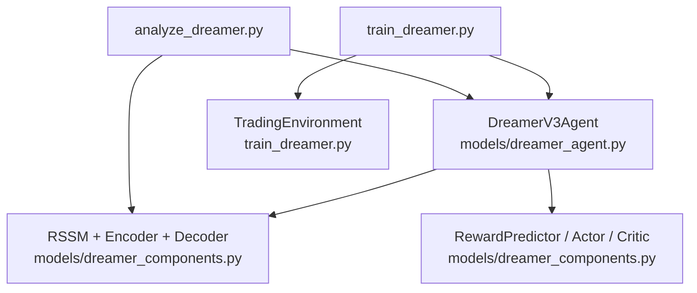
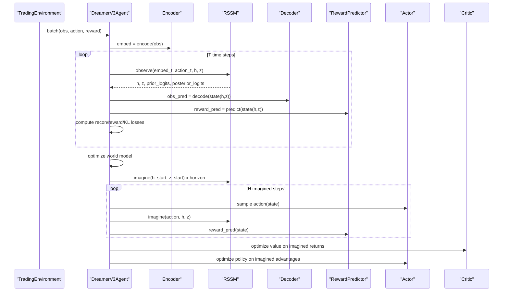
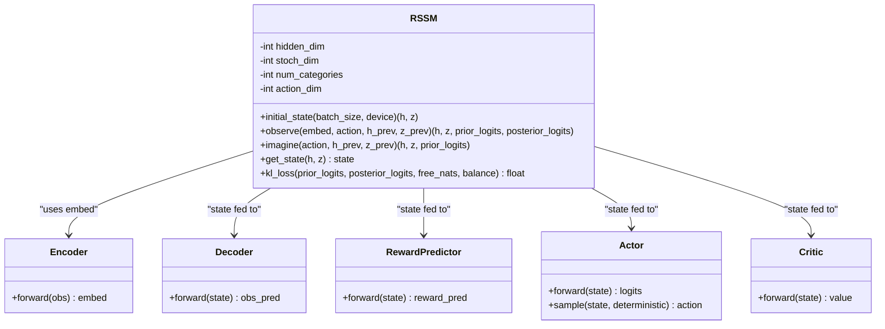
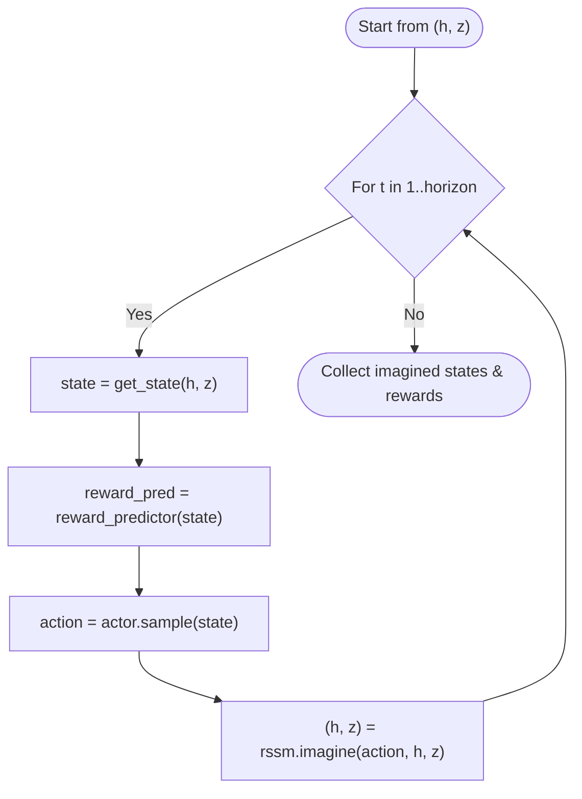
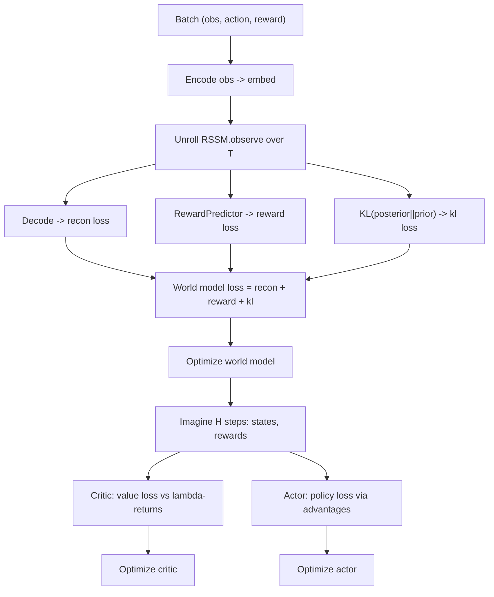
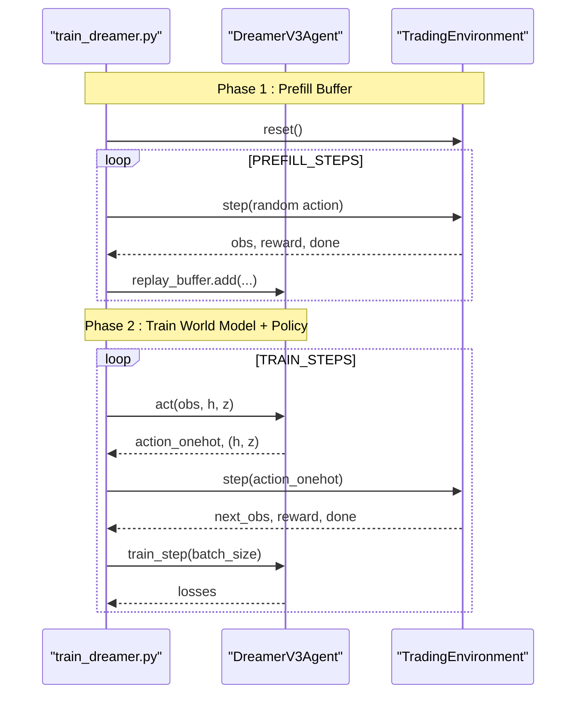
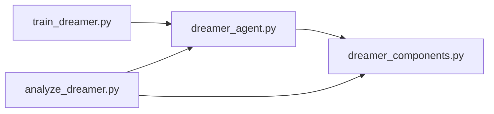

# Dreamer V3 World Model

<cite>
**Referenced Files in This Document**
- [dreamer_agent.py](file://models/dreamer_agent.py)
- [dreamer_components.py](file://models/dreamer_components.py)
- [train_dreamer.py](file://train/train_dreamer.py)
- [analyze_dreamer.py](file://eval/analyze_dreamer.py)
- [DREAMER_IMPLEMENTATION_GUIDE.md](file://DREAMER_IMPLEMENTATION_GUIDE.md)
</cite>

## Table of Contents
1. [Introduction](#introduction)
2. [Project Structure](#project-structure)
3. [Core Components](#core-components)
4. [Architecture Overview](#architecture-overview)
5. [Detailed Component Analysis](#detailed-component-analysis)
6. [Dependency Analysis](#dependency-analysis)
7. [Performance Considerations](#performance-considerations)
8. [Troubleshooting Guide](#troubleshooting-guide)
9. [Conclusion](#conclusion)
10. [Appendices](#appendices)

## Introduction
This document explains the Dreamer V3 world model implementation for trading, focusing on the Recurrent State-Space Model (RSSM), latent space representation, imagination-based planning, and multi-objective training. It provides code-level references to show how the encoder, dynamics model, decoder, reward predictor, actor, and critic interact during training and inference. It also documents hyperparameters such as free_nats, kl_balance, and horizon, and discusses computational considerations for sequence processing and memory management.

## Project Structure
The implementation is organized into:
- Agent orchestration and two-phase training loop
- RSSM and supporting networks
- Training script with environment and data handling
- Evaluation utilities to analyze reconstruction, reward prediction, and latent space

**Diagram sources**
- [train_dreamer.py:128-208](file://train/train_dreamer.py#L128-L208)
- [dreamer_agent.py:84-147](file://models/dreamer_agent.py#L84-L147)
- [dreamer_components.py:71-206](file://models/dreamer_components.py#L71-L206)

**Section sources**
- [train_dreamer.py:128-208](file://train/train_dreamer.py#L128-L208)
- [dreamer_agent.py:84-147](file://models/dreamer_agent.py#L84-L147)
- [dreamer_components.py:71-206](file://models/dreamer_components.py#L71-L206)

## Core Components
- Encoder: compresses observations into embeddings using a small MLP with RMSNorm and SiLU activations; applies symlog transformation for stability.
- RSSM: learns market dynamics via deterministic hidden state h and stochastic categorical latent z; supports observe (posterior) and imagine (prior).
- Decoder: reconstructs observations from concatenated (h, z).
- Reward Predictor: predicts rewards in symlog space from (h, z).
- Actor: outputs categorical action distribution over discrete actions (e.g., flat, long, short).
- Critic: estimates value from (h, z) in symlog space.

Key hyperparameters:
- free_nats: threshold below which KL divergence is not penalized to avoid posterior collapse.
- kl_balance: mixing coefficient to stabilize KL updates by detaching part of the gradient.
- horizon: number of imagined steps used for policy/value optimization.

**Section sources**
- [dreamer_components.py:71-206](file://models/dreamer_components.py#L71-L206)
- [dreamer_agent.py:91-147](file://models/dreamer_agent.py#L91-L147)

## Architecture Overview
The system alternates between learning the world model and optimizing the policy in imagination:
- Phase 1: World model learning minimizes reconstruction loss, reward prediction loss, and KL divergence regularization.
- Phase 2: Imagination generates trajectories using the learned dynamics; actor-critic are optimized on these imagined rollouts.

**Diagram sources**
- [dreamer_agent.py:190-304](file://models/dreamer_agent.py#L190-L304)
- [dreamer_components.py:134-186](file://models/dreamer_components.py#L134-L186)

## Detailed Component Analysis

### RSSM: Latent Space Representation
- Deterministic state h: GRU hidden state capturing temporal memory.
- Stochastic state z: flattened one-hot vectors across stoch_dim × num_categories categories; sampled via Gumbel-Softmax during training and argmax during evaluation.
- Prior p(z|h): generated by prior_net from h.
- Posterior q(z|h,e): generated by posterior_net from h and encoded observation e.
- Dynamics: h_t = GRU([z_{t-1}, a_{t-1}], h_{t-1}).

**Diagram sources**
- [dreamer_components.py:92-206](file://models/dreamer_components.py#L92-L206)
- [dreamer_components.py:71-89](file://models/dreamer_components.py#L71-L89)
- [dreamer_components.py:208-244](file://models/dreamer_components.py#L208-L244)
- [dreamer_components.py:246-295](file://models/dreamer_components.py#L246-L295)

**Section sources**
- [dreamer_components.py:92-206](file://models/dreamer_components.py#L92-L206)

### Imagination-Based Planning
- Starts from final h, z after observing a real sequence.
- Iteratively samples actions from the actor, predicts rewards, and advances the RSSM prior to generate H-step imagined trajectories.
- Imagined states and rewards feed into value and policy optimization.

**Diagram sources**
- [dreamer_agent.py:306-338](file://models/dreamer_agent.py#L306-L338)

**Section sources**
- [dreamer_agent.py:306-338](file://models/dreamer_agent.py#L306-L338)

### Multi-Objective Training
World model objective combines:
- Reconstruction loss: MSE between decoded observations and real observations.
- Reward prediction loss: MSE between predicted and target rewards in symlog space.
- KL divergence regularization: with free_nats and kl_balance to prevent posterior collapse and stabilize training.

Policy and value objectives:
- Value loss: MSE between predicted values and lambda-returns computed from imagined rewards and bootstrapped values.
- Policy loss: REINFORCE-style objective using log-probabilities weighted by advantages derived from TD targets and values.

**Diagram sources**
- [dreamer_agent.py:190-304](file://models/dreamer_agent.py#L190-L304)
- [dreamer_components.py:188-206](file://models/dreamer_components.py#L188-L206)

**Section sources**
- [dreamer_agent.py:190-304](file://models/dreamer_agent.py#L190-L304)
- [dreamer_components.py:188-206](file://models/dreamer_components.py#L188-L206)

### Two-Phase Training Process
- Phase 1: Prefill replay buffer with random exploration to collect diverse sequences.
- Phase 2: Alternating updates—world model learning followed by actor-critic optimization on imagined trajectories. Checkpoints saved periodically.

**Diagram sources**
- [train_dreamer.py:210-292](file://train/train_dreamer.py#L210-L292)
- [dreamer_agent.py:190-304](file://models/dreamer_agent.py#L190-L304)

**Section sources**
- [train_dreamer.py:210-292](file://train/train_dreamer.py#L210-L292)
- [dreamer_agent.py:190-304](file://models/dreamer_agent.py#L190-L304)

## Dependency Analysis
- dreamer_agent.py depends on dreamer_components.py for all neural modules and uses a ReplayBuffer for sequence sampling.
- train_dreamer.py defines a simple TradingEnvironment and orchestrates data loading, agent creation, and training loops.
- analyze_dreamer.py loads checkpoints and evaluates reconstruction, reward prediction, and latent space properties.

**Diagram sources**
- [train_dreamer.py:128-208](file://train/train_dreamer.py#L128-L208)
- [dreamer_agent.py:18-21](file://models/dreamer_agent.py#L18-L21)
- [analyze_dreamer.py:19-20](file://eval/analyze_dreamer.py#L19-L20)

**Section sources**
- [train_dreamer.py:128-208](file://train/train_dreamer.py#L128-L208)
- [dreamer_agent.py:18-21](file://models/dreamer_agent.py#L18-L21)
- [analyze_dreamer.py:19-20](file://eval/analyze_dreamer.py#L19-L20)

## Performance Considerations
- Sequence processing: The agent unrolls sequences of length T for world model training and imagines H steps for policy/value updates. Memory usage scales with batch size, sequence length, and horizon.
- Gradient clipping: Applied to world model, actor, and critic parameters to stabilize training.
- Symlog/symexp: Used for rewards and values to handle large magnitudes and improve numerical stability.
- Batch sizing: Adjust batch size based on available memory; smaller batches reduce memory pressure at the cost of noisier gradients.
- Device selection: Auto-detects CUDA/MPS/CPU; prefer GPU acceleration when available.

[No sources needed since this section provides general guidance]

## Troubleshooting Guide
- Loss instability or NaN: Reduce learning rates, increase gradient clipping, validate data for inf/nan.
- KL issues: If KL is too high, increase free_nats; if too low (posterior collapse), decrease free_nats or adjust kl_balance.
- Memory errors: Reduce batch_size, hidden_dim, or embed_dim; switch to CPU if necessary.
- Poor performance: Tune horizon, gamma, lambda_; ensure sufficient prefill steps; verify reward signal density.

**Section sources**
- [DREAMER_IMPLEMENTATION_GUIDE.md:242-261](file://DREAMER_IMPLEMENTATION_GUIDE.md#L242-L261)

## Conclusion
The Dreamer V3 implementation integrates an RSSM-based world model with imagination-driven planning to learn market dynamics and optimize a trading policy efficiently. The multi-objective training balances reconstruction, reward prediction, and KL regularization, while the actor-critic leverages imagined trajectories for stable policy improvement. Proper tuning of free_nats, kl_balance, and horizon, along with careful memory management, enables effective training on financial time series.

[No sources needed since this section summarizes without analyzing specific files]

## Appendices

### Hyperparameter Reference
- free_nats: Controls minimum KL penalty to avoid posterior collapse.
- kl_balance: Mixes detached and updated KL terms for stability.
- horizon: Number of imagined steps for planning; longer horizons enable deeper lookahead but increase compute.
- gamma, lambda_: Discount factor and GAE parameter for value estimation.
- Learning rates: Separate rates for world model, actor, and critic.

**Section sources**
- [dreamer_agent.py:91-147](file://models/dreamer_agent.py#L91-L147)
- [DREAMER_IMPLEMENTATION_GUIDE.md:143-167](file://DREAMER_IMPLEMENTATION_GUIDE.md#L143-L167)

### Example Workflows from Codebase
- RSSM operations: observe and imagine methods update h and z given actions and encoded observations.
- Trajectory imagination: _imagine_trajectory generates states and rewards for H steps.
- Two-phase training: train_step executes world model learning then actor-critic optimization on imagined rollouts.

**Section sources**
- [dreamer_components.py:134-186](file://models/dreamer_components.py#L134-L186)
- [dreamer_agent.py:306-338](file://models/dreamer_agent.py#L306-L338)
- [dreamer_agent.py:190-304](file://models/dreamer_agent.py#L190-L304)