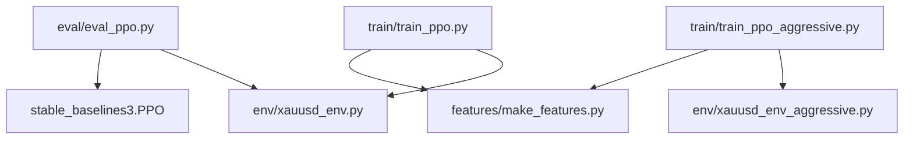
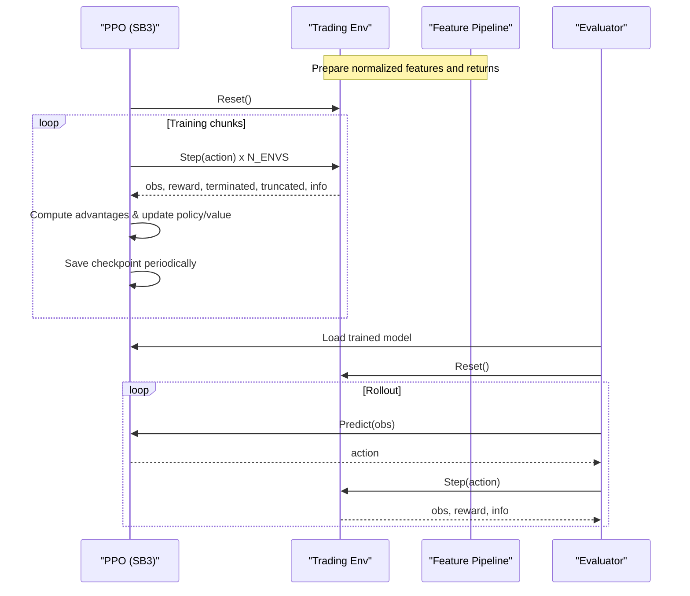
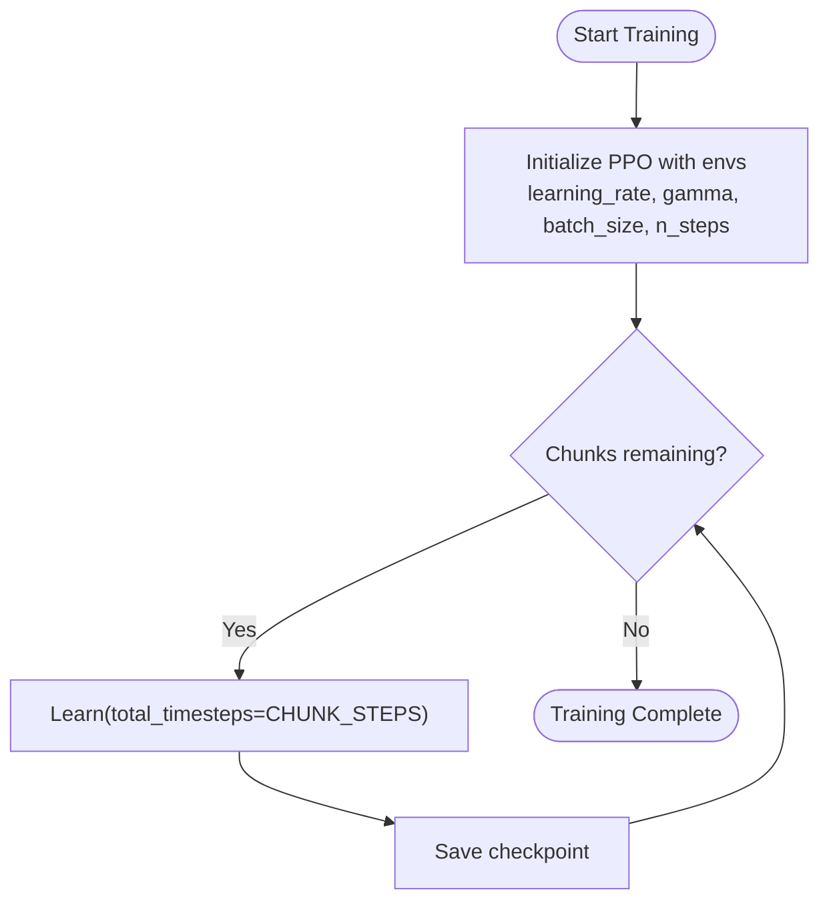
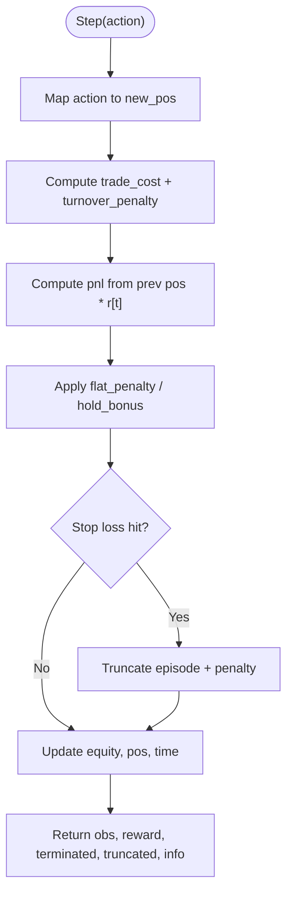
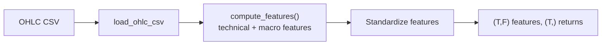
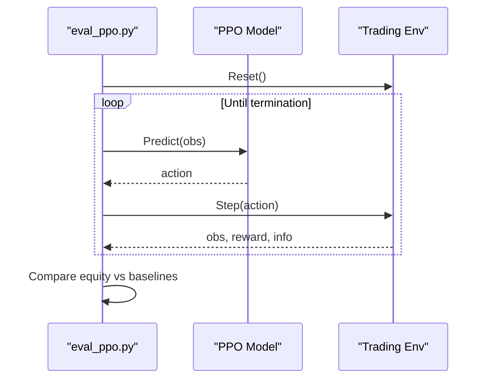
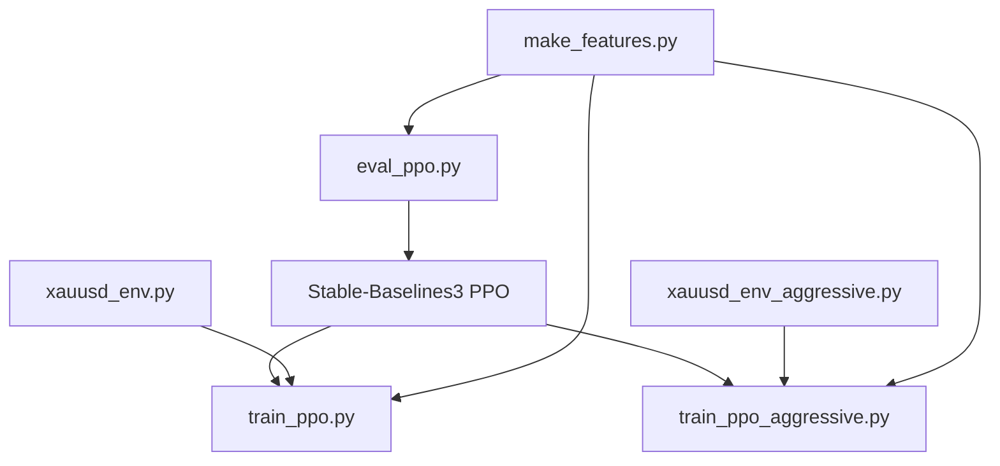

# PPO (Proximal Policy Optimization)

<cite>
**Referenced Files in This Document**
- [train_ppo.py](file://train/train_ppo.py)
- [train_ppo_aggressive.py](file://train/train_ppo_aggressive.py)
- [xauusd_env.py](file://env/xauusd_env.py)
- [xauusd_env_aggressive.py](file://env/xauusd_env_aggressive.py)
- [eval_ppo.py](file://eval/eval_ppo.py)
- [make_features.py](file://features/make_features.py)
- [README.md](file://README.md)
</cite>

## Table of Contents
1. [Introduction](#introduction)
2. [Project Structure](#project-structure)
3. [Core Components](#core-components)
4. [Architecture Overview](#architecture-overview)
5. [Detailed Component Analysis](#detailed-component-analysis)
6. [Dependency Analysis](#dependency-analysis)
7. [Performance Considerations](#performance-considerations)
8. [Troubleshooting Guide](#troubleshooting-guide)
9. [Conclusion](#conclusion)
10. [Appendices](#appendices)

## Introduction
This document explains the PPO-based trading system implemented in this repository. It focuses on how the actor-critic policy is trained with Stable-Baselines3, how the discrete action space and reward structure are designed for trading, and how training scripts orchestrate environment interaction and model saving. It also provides guidance on hyperparameter tuning strategies and common training issues specific to financial markets.

## Project Structure
The PPO implementation centers around:
- Training scripts that configure and run PPO using Stable-Baselines3
- Gymnasium environments modeling XAUUSD trading with discrete actions and realistic costs
- Feature engineering that prepares normalized market features and returns
- Evaluation utilities to test trained models on out-of-sample data

**Diagram sources**
- [train_ppo.py:25-67](file://train/train_ppo.py#L25-L67)
- [train_ppo_aggressive.py:25-84](file://train/train_ppo_aggressive.py#L25-L84)
- [xauusd_env.py:7-57](file://env/xauusd_env.py#L7-L57)
- [xauusd_env_aggressive.py:6-64](file://env/xauusd_env_aggressive.py#L6-L64)
- [make_features.py:18-83](file://features/make_features.py#L18-L83)
- [eval_ppo.py:16-40](file://eval/eval_ppo.py#L16-L40)

**Section sources**
- [train_ppo.py:25-67](file://train/train_ppo.py#L25-L67)
- [train_ppo_aggressive.py:25-84](file://train/train_ppo_aggressive.py#L25-L84)
- [xauusd_env.py:7-57](file://env/xauusd_env.py#L7-L57)
- [xauusd_env_aggressive.py:6-64](file://env/xauusd_env_aggressive.py#L6-L64)
- [make_features.py:18-83](file://features/make_features.py#L18-L83)
- [eval_ppo.py:16-40](file://eval/eval_ppo.py#L16-L40)

## Core Components
- PPO agent via Stable-Baselines3: The training scripts instantiate PPO with an MLP policy and a vectorized environment for parallel rollouts. Key parameters include learning rate, gamma, batch size, and n_steps per environment.
- Trading environments: Two gymnasium environments implement discrete action spaces and reward functions tailored to trading. One supports long-only actions; the other supports short/flat/long with leverage and stop-loss logic.
- Feature pipeline: Normalized technical and macro features plus log returns are prepared for training and evaluation.
- Evaluation: Loads a trained model and runs deterministic rollouts on held-out data, comparing equity curves against baselines.

**Section sources**
- [train_ppo.py:46-58](file://train/train_ppo.py#L46-L58)
- [train_ppo_aggressive.py:50-59](file://train/train_ppo_aggressive.py#L50-L59)
- [xauusd_env.py:7-57](file://env/xauusd_env.py#L7-L57)
- [xauusd_env_aggressive.py:6-64](file://env/xauusd_env_aggressive.py#L6-L64)
- [make_features.py:18-83](file://features/make_features.py#L18-L83)
- [eval_ppo.py:16-40](file://eval/eval_ppo.py#L16-L40)

## Architecture Overview
The system uses an actor-critic architecture through Stable-Baselines3’s PPO:
- Actor (policy network): Outputs a probability distribution over discrete actions (e.g., flat/long or short/flat/long).
- Critic (value function): Estimates state value to compute advantages for policy updates.
- Vectorized environments: Multiple parallel instances collect trajectories efficiently.
- Training loop: Iteratively collects steps, computes advantages, and performs multiple optimization epochs per update.

**Diagram sources**
- [train_ppo.py:46-67](file://train/train_ppo.py#L46-L67)
- [train_ppo_aggressive.py:50-84](file://train/train_ppo_aggressive.py#L50-L84)
- [eval_ppo.py:16-40](file://eval/eval_ppo.py#L16-L40)

## Detailed Component Analysis

### PPO Agent Configuration and Training Loop
- Agent initialization: Uses “MlpPolicy” with vectorized environments. Parameters include learning_rate, gamma, batch_size, and n_steps per environment. The aggressive variant adds entropy coefficient to encourage exploration.
- Training schedule: Chunks of timesteps with periodic checkpoints saved to disk.
- Parallelism: SubprocVecEnv spawns multiple environments to accelerate data collection.

**Diagram sources**
- [train_ppo.py:46-67](file://train/train_ppo.py#L46-L67)
- [train_ppo_aggressive.py:50-84](file://train/train_ppo_aggressive.py#L50-L84)

**Section sources**
- [train_ppo.py:46-67](file://train/train_ppo.py#L46-L67)
- [train_ppo_aggressive.py:50-84](file://train/train_ppo_aggressive.py#L50-L84)

### Environment: Discrete Action Space and Reward Structure
- Standard environment: Actions 0 (Flat) and 1 (Long). Reward includes realized PnL from previous position minus trade cost, turnover penalty, flat penalty, plus hold bonus. Position applied next step to avoid look-ahead bias.
- Aggressive environment: Actions map to -1 (Short), 0 (Flat), 1 (Long). Adds leverage and optional stop-loss truncation with penalties. Encourages only taking trades where expected return exceeds costs.

**Diagram sources**
- [xauusd_env.py:75-118](file://env/xauusd_env.py#L75-L118)
- [xauusd_env_aggressive.py:86-144](file://env/xauusd_env_aggressive.py#L86-L144)

**Section sources**
- [xauusd_env.py:7-57](file://env/xauusd_env.py#L7-L57)
- [xauusd_env.py:75-118](file://env/xauusd_env.py#L75-L118)
- [xauusd_env_aggressive.py:6-64](file://env/xauusd_env_aggressive.py#L6-L64)
- [xauusd_env_aggressive.py:86-144](file://env/xauusd_env_aggressive.py#L86-L144)

### Feature Engineering and Data Flow
- Features: Technical indicators (returns, volatility, momentum, moving average differences, RSI, MACD difference) and optional macro features (DXY, SPX, US10Y changes and correlations).
- Normalization: Features are standardized per column before being fed to the agent. Returns are used as rewards in the environment.

**Diagram sources**
- [make_features.py:18-83](file://features/make_features.py#L18-L83)

**Section sources**
- [make_features.py:18-83](file://features/make_features.py#L18-L83)

### Evaluation Workflow
- Loads a trained PPO model and runs deterministic rollouts on held-out data.
- Tracks equity curve and positions, then compares against buy-and-hold and simple moving average strategies.

**Diagram sources**
- [eval_ppo.py:16-40](file://eval/eval_ppo.py#L16-L40)
- [eval_ppo.py:45-89](file://eval/eval_ppo.py#L45-L89)

**Section sources**
- [eval_ppo.py:16-40](file://eval/eval_ppo.py#L16-L40)
- [eval_ppo.py:45-89](file://eval/eval_ppo.py#L45-L89)

## Dependency Analysis
- Training scripts depend on:
  - Stable-Baselines3 PPO for actor-critic training
  - Gymnasium environments for discrete action spaces and reward computation
  - Feature pipeline for normalized inputs
- Evaluation depends on:
  - Saved PPO model
  - Same feature preparation and environment setup for consistent testing

**Diagram sources**
- [train_ppo.py:1-10](file://train/train_ppo.py#L1-L10)
- [train_ppo_aggressive.py:1-10](file://train/train_ppo_aggressive.py#L1-L10)
- [eval_ppo.py:1-10](file://eval/eval_ppo.py#L1-L10)
- [make_features.py:1-83](file://features/make_features.py#L1-83)

**Section sources**
- [train_ppo.py:1-10](file://train/train_ppo.py#L1-L10)
- [train_ppo_aggressive.py:1-10](file://train/train_ppo_aggressive.py#L1-L10)
- [eval_ppo.py:1-10](file://eval/eval_ppo.py#L1-L10)
- [make_features.py:1-83](file://features/make_features.py#L1-83)

## Performance Considerations
- Batch size and n_steps: Larger batch sizes improve throughput but increase memory usage; n_steps controls trajectory length per environment per update.
- Learning rate: Typical values around 3e-4 provide stable convergence; adjust if training oscillates or stalls.
- Entropy coefficient: Adding a small positive value encourages exploration, especially useful in aggressive environments.
- Discount factor: Gamma near 0.99 balances immediate and future rewards appropriately for financial horizons.
- Parallel environments: More environments reduce variance and speed up training at the cost of memory and process overhead.

[No sources needed since this section provides general guidance]

## Troubleshooting Guide
Common PPO training issues in financial markets and remedies:
- Policy collapse (agent stuck in one action):
  - Increase entropy coefficient slightly to maintain exploration
  - Reduce learning rate temporarily to allow recovery
  - Ensure reward scaling is reasonable; excessive penalties can suppress exploration
- Instability or diverging losses:
  - Lower learning rate or reduce batch size
  - Check feature normalization; ensure no outliers or NaNs
  - Verify environment costs and penalties are not too harsh
- Convergence problems:
  - Increase n_steps to gather more diverse trajectories
  - Use longer episodes or remove hard truncation to allow full horizon learning
  - Validate that features capture relevant signals (macro correlations, momentum)
- Overfitting to historical data:
  - Evaluate on out-of-sample periods
  - Add regularization via entropy or dropout (if customizing networks)
  - Use cross-validation across different market regimes

[No sources needed since this section provides general guidance]

## Conclusion
The repository implements a practical PPO-based trading system using Stable-Baselines3 with two gymnasium environments tailored for discrete trading actions. The standard environment focuses on long-only decisions with realistic costs and stability incentives, while the aggressive environment supports shorting, leverage, and stop-loss logic. Feature engineering normalizes technical and macro signals to stabilize training. Training scripts demonstrate chunked learning with periodic checkpoints and evaluation utilities compare performance against simple baselines. Hyperparameter tuning should balance exploration, stability, and sample efficiency, with careful attention to environment design and reward shaping.

[No sources needed since this section summarizes without analyzing specific files]

## Appendices

### PPO Algorithm Notes and Integration Details
- Actor-Critic Architecture:
  - Policy network outputs discrete action probabilities
  - Value network estimates state value for advantage computation
- Clipping Mechanism:
  - PPO uses a clipped objective to limit policy updates per step, preventing large deviations that destabilize training
  - The clipping range parameter controls how far the new policy can deviate from the old policy during optimization
- Advantage Estimation:
  - Generalized Advantage Estimation (GAE) combines multi-step returns with bootstrapped value estimates to reduce variance while maintaining low bias
  - Lambda controls the trade-off between bias and variance in advantage estimation
- Integration with Discrete Action Space:
  - Environments define discrete actions (e.g., flat/long or short/flat/long)
  - Rewards incorporate transaction costs, turnover penalties, and optional bonuses to encourage stable behavior
- Training Scripts:
  - Initialize PPO with appropriate hyperparameters
  - Use vectorized environments for efficient data collection
  - Save checkpoints and evaluate on held-out data

[No sources needed since this section provides conceptual context]