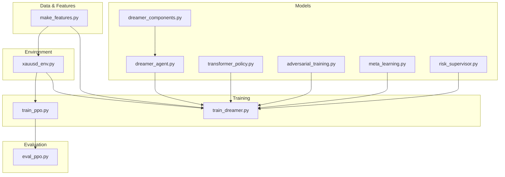
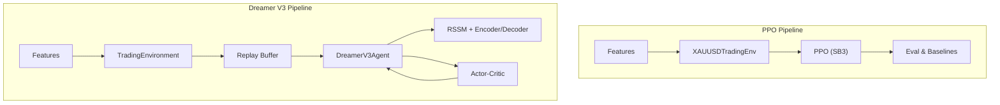
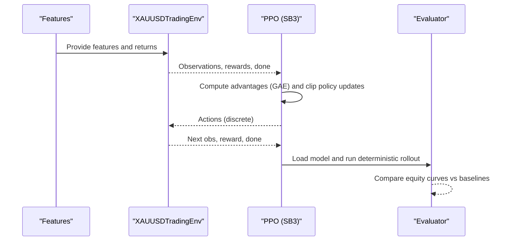
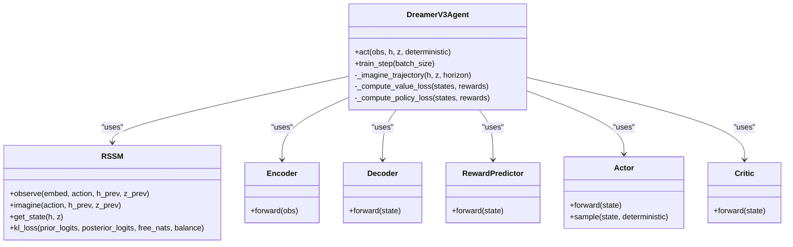
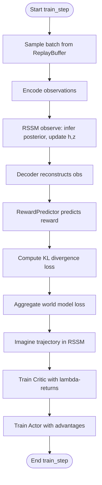
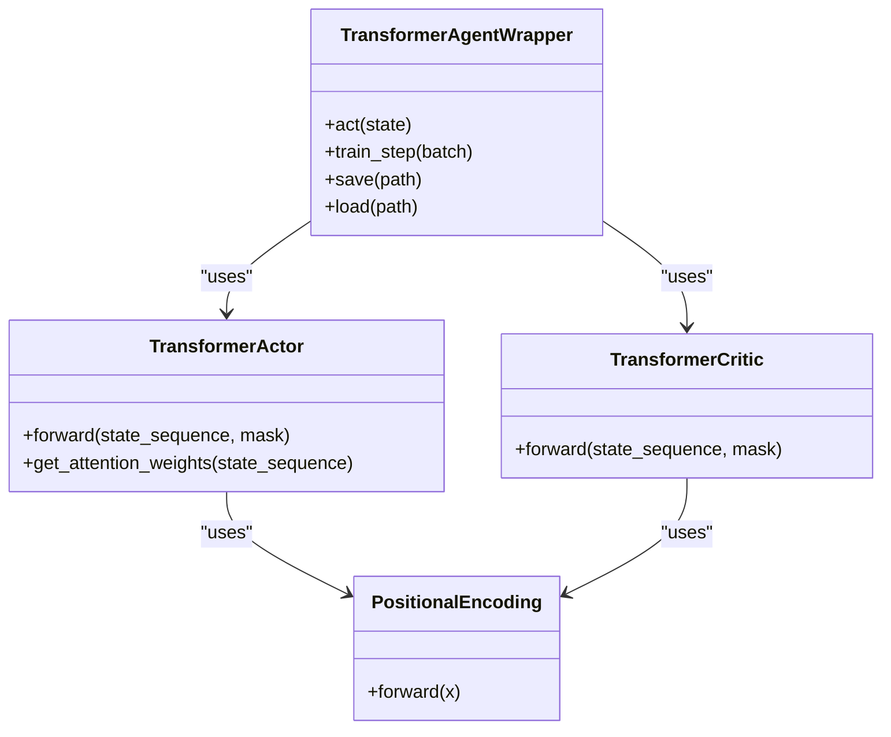
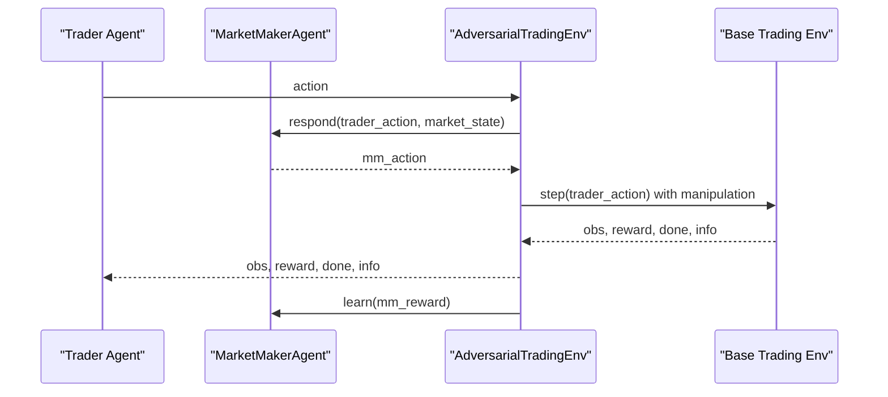
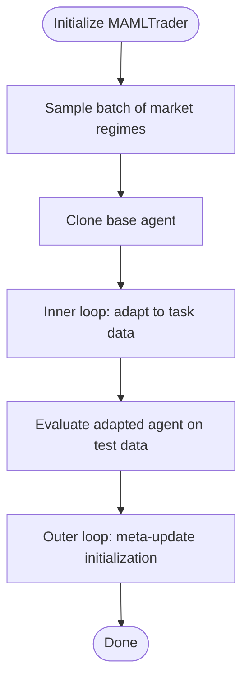
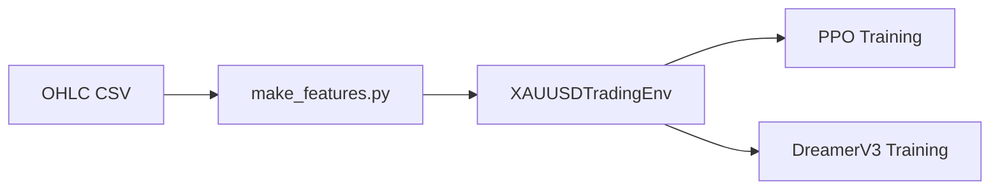
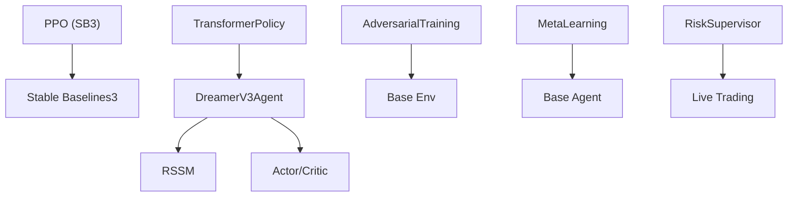

# Reinforcement Learning Algorithms

<cite>
**Referenced Files in This Document**
- [train/train_ppo.py](file://train/train_ppo.py)
- [eval/eval_ppo.py](file://eval/eval_ppo.py)
- [env/xauusd_env.py](file://env/xauusd_env.py)
- [features/make_features.py](file://features/make_features.py)
- [models/dreamer_agent.py](file://models/dreamer_agent.py)
- [models/dreamer_components.py](file://models/dreamer_components.py)
- [train/train_dreamer.py](file://train/train_dreamer.py)
- [models/transformer_policy.py](file://models/transformer_policy.py)
- [models/adversarial_training.py](file://models/adversarial_training.py)
- [models/meta_learning.py](file://models/meta_learning.py)
- [models/risk_supervisor.py](file://models/risk_supervisor.py)
</cite>

## Table of Contents
1. [Introduction](#introduction)
2. [Project Structure](#project-structure)
3. [Core Components](#core-components)
4. [Architecture Overview](#architecture-overview)
5. [Detailed Component Analysis](#detailed-component-analysis)
6. [Dependency Analysis](#dependency-analysis)
7. [Performance Considerations](#performance-considerations)
8. [Troubleshooting Guide](#troubleshooting-guide)
9. [Conclusion](#conclusion)
10. [Appendices](#appendices)

## Introduction
This document explains the reinforcement learning algorithms implemented in the system, focusing on:
- PPO (Proximal Policy Optimization) with an actor-critic architecture and policy clipping mechanisms, plus advantage estimation via GAE.
- Dreamer V3 world model approach including Recurrent State-Space Model (RSSM), imagination-based planning, and latent space optimization.
- Transformer-based policy network architecture for sequence-aware decision making.
- Adversarial training techniques to build robustness against market manipulation.
- Meta-learning components for fast adaptation to new market regimes.
It also covers agent initialization, training loops, policy evaluation, hyperparameter tuning strategies, convergence criteria, performance optimizations, integration with the trading environment and feature engineering pipeline, and common training issues such as instability, overfitting, and resource management.

## Project Structure
The RL system is organized into modules for environments, features, models, training scripts, and evaluations:
- Environments define the trading gym interface and reward shaping.
- Features compute normalized technical and macro indicators used by agents.
- Models implement PPO (via a library), Dreamer V3 (world model + actor-critic), transformer policies, adversarial training, meta-learning, and risk supervision.
- Training scripts orchestrate data loading, environment creation, agent training, checkpointing, and evaluation.

**Diagram sources**
- [features/make_features.py:1-83](file://features/make_features.py#L1-L83)
- [env/xauusd_env.py:1-118](file://env/xauusd_env.py#L1-L118)
- [models/dreamer_agent.py:1-460](file://models/dreamer_agent.py#L1-L460)
- [models/dreamer_components.py:1-338](file://models/dreamer_components.py#L1-L338)
- [models/transformer_policy.py:1-442](file://models/transformer_policy.py#L1-L442)
- [models/adversarial_training.py:1-556](file://models/adversarial_training.py#L1-L556)
- [models/meta_learning.py:1-345](file://models/meta_learning.py#L1-L345)
- [models/risk_supervisor.py:1-387](file://models/risk_supervisor.py#L1-L387)
- [train/train_ppo.py:1-93](file://train/train_ppo.py#L1-L93)
- [train/train_dreamer.py:1-331](file://train/train_dreamer.py#L1-L331)
- [eval/eval_ppo.py:1-94](file://eval/eval_ppo.py#L1-L94)

**Section sources**
- [train/train_ppo.py:1-93](file://train/train_ppo.py#L1-L93)
- [train/train_dreamer.py:1-331](file://train/train_dreamer.py#L1-L331)
- [env/xauusd_env.py:1-118](file://env/xauusd_env.py#L1-L118)
- [features/make_features.py:1-83](file://features/make_features.py#L1-L83)

## Core Components
- PPO Agent: Uses Stable Baselines3 PPO with an MLP policy; trained with parallel environments and periodic checkpoints.
- Dreamer V3 Agent: Implements RSSM-based world model, encoder/decoder, reward predictor, and actor-critic; trains via replay buffer sequences and imagines trajectories for policy improvement.
- Transformer Policy: Provides attention-based actor/critic that can be integrated with Dreamer V3 or used standalone for sequence modeling.
- Adversarial Training: Self-play framework where a Market Maker learns to manipulate markets to challenge the trader.
- Meta-Learning: MAML-style wrapper enabling fast adaptation to new market regimes using few-shot updates.
- Risk Supervisor: Deterministic safety layer that overrides AI decisions under adverse conditions.

**Section sources**
- [train/train_ppo.py:25-67](file://train/train_ppo.py#L25-L67)
- [models/dreamer_agent.py:84-147](file://models/dreamer_agent.py#L84-L147)
- [models/transformer_policy.py:67-153](file://models/transformer_policy.py#L67-L153)
- [models/adversarial_training.py:35-221](file://models/adversarial_training.py#L35-L221)
- [models/meta_learning.py:32-116](file://models/meta_learning.py#L32-L116)
- [models/risk_supervisor.py:18-174](file://models/risk_supervisor.py#L18-L174)

## Architecture Overview
The system supports two primary RL approaches:
- PPO: A standard off-policy/on-policy hybrid algorithm using policy gradient with clipping and GAE advantage estimation.
- Dreamer V3: A model-based RL method that learns a latent world model (RSSM) and performs planning via imagination to update actor-critic networks.

**Diagram sources**
- [env/xauusd_env.py:7-118](file://env/xauusd_env.py#L7-L118)
- [features/make_features.py:18-78](file://features/make_features.py#L18-L78)
- [train/train_ppo.py:25-67](file://train/train_ppo.py#L25-L67)
- [eval/eval_ppo.py:16-70](file://eval/eval_ppo.py#L16-L70)
- [train/train_dreamer.py:36-126](file://train/train_dreamer.py#L36-L126)
- [models/dreamer_agent.py:84-147](file://models/dreamer_agent.py#L84-L147)
- [models/dreamer_components.py:71-206](file://models/dreamer_components.py#L71-L206)

## Detailed Component Analysis

### PPO Implementation
- Actor-Critic Architecture: The policy network outputs discrete actions (flat/long). The value network estimates state values for baseline subtraction.
- Policy Clipping: Implemented by the underlying SB3 PPO implementation; ensures stable updates by limiting policy change per step.
- Advantage Estimation: Generalized Advantage Estimation (GAE) is used within SB3’s PPO to balance bias-variance trade-off.
- Training Loop: Parallel environments via SubprocVecEnv; chunked training with periodic checkpoints; deterministic evaluation on test set.

**Diagram sources**
- [features/make_features.py:18-78](file://features/make_features.py#L18-L78)
- [env/xauusd_env.py:7-118](file://env/xauusd_env.py#L7-L118)
- [train/train_ppo.py:25-67](file://train/train_ppo.py#L25-L67)
- [eval/eval_ppo.py:16-70](file://eval/eval_ppo.py#L16-L70)

**Section sources**
- [train/train_ppo.py:25-67](file://train/train_ppo.py#L25-L67)
- [eval/eval_ppo.py:16-70](file://eval/eval_ppo.py#L16-L70)
- [env/xauusd_env.py:7-118](file://env/xauusd_env.py#L7-L118)

### Dreamer V3 World Model Approach
- RSSM (Recurrent State-Space Model): Encodes observations into embeddings, predicts next latent states via GRU dynamics, and samples stochastic latent states from categorical distributions. Includes prior/posterior networks and KL regularization with free bits and balancing.
- Imagination-Based Planning: The agent imagines trajectories by rolling out the policy in the learned world model, predicting rewards and updating actor-critic networks based on imagined returns.
- Latent Space Optimization: Encoder/Decoder reconstructs observations; reward predictor estimates returns in symlog space; actor outputs action logits; critic estimates values.

**Diagram sources**
- [models/dreamer_agent.py:84-147](file://models/dreamer_agent.py#L84-L147)
- [models/dreamer_components.py:71-206](file://models/dreamer_components.py#L71-L206)

**Diagram sources**
- [models/dreamer_agent.py:190-304](file://models/dreamer_agent.py#L190-L304)
- [models/dreamer_components.py:134-206](file://models/dreamer_components.py#L134-L206)

**Section sources**
- [models/dreamer_agent.py:84-147](file://models/dreamer_agent.py#L84-L147)
- [models/dreamer_agent.py:190-304](file://models/dreamer_agent.py#L190-L304)
- [models/dreamer_components.py:71-206](file://models/dreamer_components.py#L71-L206)
- [train/train_dreamer.py:128-292](file://train/train_dreamer.py#L128-L292)

### Transformer-Based Policy Network
- Positional Encoding: Adds sinusoidal positional information to embeddings to preserve sequence order.
- Transformer Encoder Layers: Multi-head self-attention captures relevant historical patterns across time steps.
- Actor/Critic Heads: Action logits and value estimates derived from the last token representation.
- Integration: Can replace MLP-based actor/critic in Dreamer V3 via a wrapper that maintains a sliding window of states.

**Diagram sources**
- [models/transformer_policy.py:34-65](file://models/transformer_policy.py#L34-L65)
- [models/transformer_policy.py:67-153](file://models/transformer_policy.py#L67-L153)
- [models/transformer_policy.py:166-250](file://models/transformer_policy.py#L166-L250)
- [models/transformer_policy.py:252-373](file://models/transformer_policy.py#L252-L373)

**Section sources**
- [models/transformer_policy.py:67-153](file://models/transformer_policy.py#L67-L153)
- [models/transformer_policy.py:166-250](file://models/transformer_policy.py#L166-L250)
- [models/transformer_policy.py:252-373](file://models/transformer_policy.py#L252-L373)

### Adversarial Training Techniques
- Market Maker Agent: Learns manipulation strategies (spread widening, fake breakouts, stop hunts) to exploit trader weaknesses.
- Adversarial Environment: Wraps base environment to apply manipulations based on trader actions.
- Self-Play Trainer: Alternates training between trader and market maker to create an arms race, improving robustness.

**Diagram sources**
- [models/adversarial_training.py:35-221](file://models/adversarial_training.py#L35-L221)
- [models/adversarial_training.py:223-356](file://models/adversarial_training.py#L223-L356)
- [models/adversarial_training.py:358-485](file://models/adversarial_training.py#L358-L485)

**Section sources**
- [models/adversarial_training.py:35-221](file://models/adversarial_training.py#L35-L221)
- [models/adversarial_training.py:223-356](file://models/adversarial_training.py#L223-L356)
- [models/adversarial_training.py:358-485](file://models/adversarial_training.py#L358-L485)

### Meta-Learning Components
- MAML Wrapper: Enables fast adaptation to new market regimes by performing inner-loop updates on task-specific data and outer-loop meta-updates on the base agent’s parameters.
- Regime Generation: Splits historical data into diverse tasks (trending, ranging, volatile) to train generalizable initialization.

**Diagram sources**
- [models/meta_learning.py:32-116](file://models/meta_learning.py#L32-L116)
- [models/meta_learning.py:174-245](file://models/meta_learning.py#L174-L245)

**Section sources**
- [models/meta_learning.py:32-116](file://models/meta_learning.py#L32-L116)
- [models/meta_learning.py:174-245](file://models/meta_learning.py#L174-L245)

### Integration with Environment and Feature Engineering
- Environment: Discrete long-only actions with reward shaping including costs, turnover penalties, flat penalty, and hold bonus.
- Features: Technical indicators (returns, volatility, momentum, moving averages, RSI, MACD) and optional macro features (DXY, SPX, US10Y correlations); normalized for stability.

**Diagram sources**
- [features/make_features.py:18-78](file://features/make_features.py#L18-L78)
- [env/xauusd_env.py:7-118](file://env/xauusd_env.py#L7-L118)
- [train/train_ppo.py:25-67](file://train/train_ppo.py#L25-L67)
- [train/train_dreamer.py:128-292](file://train/train_dreamer.py#L128-L292)

**Section sources**
- [env/xauusd_env.py:7-118](file://env/xauusd_env.py#L7-L118)
- [features/make_features.py:18-78](file://features/make_features.py#L18-L78)

## Dependency Analysis
- PPO depends on Stable Baselines3 and uses vectorized environments for efficient sampling.
- Dreamer V3 depends on custom components (RSSM, encoder/decoder, actor/critic) and a replay buffer for sequence training.
- Transformer policy provides modular actor/critic that can integrate with Dreamer V3 via a wrapper.
- Adversarial training wraps base environments to simulate market manipulation.
- Meta-learning wraps any base agent to enable fast adaptation.
- Risk supervisor acts as a deterministic override layer during live trading.

**Diagram sources**
- [train/train_ppo.py:25-67](file://train/train_ppo.py#L25-L67)
- [models/dreamer_agent.py:84-147](file://models/dreamer_agent.py#L84-L147)
- [models/dreamer_components.py:71-206](file://models/dreamer_components.py#L71-L206)
- [models/transformer_policy.py:252-373](file://models/transformer_policy.py#L252-L373)
- [models/adversarial_training.py:223-356](file://models/adversarial_training.py#L223-L356)
- [models/meta_learning.py:32-116](file://models/meta_learning.py#L32-L116)
- [models/risk_supervisor.py:288-339](file://models/risk_supervisor.py#L288-L339)

**Section sources**
- [train/train_ppo.py:25-67](file://train/train_ppo.py#L25-L67)
- [models/dreamer_agent.py:84-147](file://models/dreamer_agent.py#L84-L147)
- [models/dreamer_components.py:71-206](file://models/dreamer_components.py#L71-L206)
- [models/transformer_policy.py:252-373](file://models/transformer_policy.py#L252-L373)
- [models/adversarial_training.py:223-356](file://models/adversarial_training.py#L223-L356)
- [models/meta_learning.py:32-116](file://models/meta_learning.py#L32-L116)
- [models/risk_supervisor.py:288-339](file://models/risk_supervisor.py#L288-L339)

## Performance Considerations
- Parallelization: Use SubprocVecEnv for PPO to scale data collection across multiple environments.
- Batch Sizes: Adjust batch sizes for Dreamer V3 based on available memory; larger batches improve stability but increase compute.
- Device Selection: Auto-detect CUDA/MPS/CPU in Dreamer training script to leverage hardware acceleration.
- Gradient Clipping: Apply gradient norm clipping to prevent exploding gradients in world model and actor-critic updates.
- Sequence Length: Tune sequence length in replay buffer and transformer inputs to balance context and compute.
- Checkpointing: Save periodic checkpoints to resume training and evaluate intermediate performance.

[No sources needed since this section provides general guidance]

## Troubleshooting Guide
Common training issues and mitigations:
- Instability: Reduce learning rates, increase batch size, apply gradient clipping, and ensure proper normalization of features.
- Overfitting: Use dropout in transformer layers, augment data via different market regimes, and validate on held-out periods.
- Resource Management: Monitor GPU memory usage, reduce sequence lengths, and use mixed precision if supported.
- Convergence Criteria: Track losses (reconstruction, reward prediction, KL, value, policy) and monitor equity curves for stabilization.
- Risk Controls: Integrate risk supervisor to halt trading under extreme conditions and prevent catastrophic losses.

**Section sources**
- [models/dreamer_agent.py:256-263](file://models/dreamer_agent.py#L256-L263)
- [models/dreamer_agent.py:282-293](file://models/dreamer_agent.py#L282-L293)
- [models/risk_supervisor.py:91-174](file://models/risk_supervisor.py#L91-L174)
- [train/train_dreamer.py:270-292](file://train/train_dreamer.py#L270-L292)

## Conclusion
The system implements robust reinforcement learning algorithms tailored for trading:
- PPO provides a reliable baseline with proven stability and effective advantage estimation.
- Dreamer V3 introduces model-based planning through RSSM, enabling imagination-driven policy improvements.
- Transformer policies enhance temporal reasoning by attending to relevant historical patterns.
- Adversarial training builds resilience against market manipulation.
- Meta-learning enables rapid adaptation to regime shifts.
- Risk supervision ensures safe deployment in live environments.

[No sources needed since this section summarizes without analyzing specific files]

## Appendices

### Hyperparameter Tuning Strategies
- PPO: Tune n_steps, batch_size, gamma, learning_rate; adjust chunk steps and number of chunks for extended training.
- Dreamer V3: Tune embed_dim, hidden_dim, stoch_dim, num_categories, lr_world_model, lr_actor, lr_critic, gamma, lambda_, horizon, free_nats, kl_balance.
- Transformer: Tune hidden_dim, num_heads, num_layers, seq_len, dropout.
- Adversarial: Tune market maker action space and detection features.
- Meta-Learning: Tune meta_lr, adapt_lr, adapt_steps, and number of regimes.

**Section sources**
- [train/train_ppo.py:46-54](file://train/train_ppo.py#L46-L54)
- [models/dreamer_agent.py:91-147](file://models/dreamer_agent.py#L91-L147)
- [models/transformer_policy.py:74-123](file://models/transformer_policy.py#L74-L123)
- [models/adversarial_training.py:48-75](file://models/adversarial_training.py#L48-L75)
- [models/meta_learning.py:39-65](file://models/meta_learning.py#L39-L65)

### Convergence Criteria
- Monitor world model losses (reconstruction, reward prediction, KL) for stability.
- Track value and policy losses for actor-critic convergence.
- Evaluate equity curves and trading metrics (trades, % time long) on test sets.

**Section sources**
- [train/train_dreamer.py:270-292](file://train/train_dreamer.py#L270-L292)
- [eval/eval_ppo.py:59-70](file://eval/eval_ppo.py#L59-L70)

### Performance Optimization Techniques
- Use parallel environments for PPO.
- Optimize Dreamer V3 batch sizes and sequence lengths.
- Leverage GPU/MPS acceleration when available.
- Apply gradient clipping and normalization for stability.

**Section sources**
- [train/train_ppo.py:43-54](file://train/train_ppo.py#L43-L54)
- [train/train_dreamer.py:142-159](file://train/train_dreamer.py#L142-L159)
- [models/dreamer_agent.py:256-263](file://models/dreamer_agent.py#L256-L263)