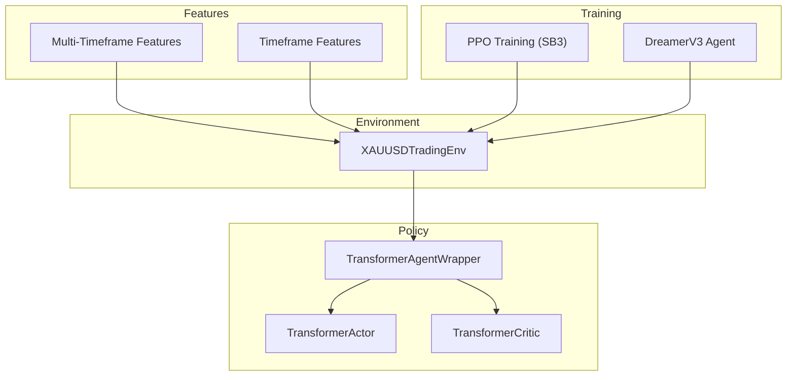
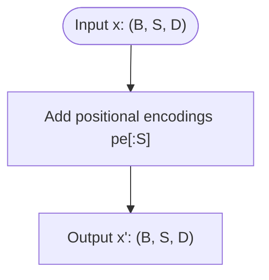
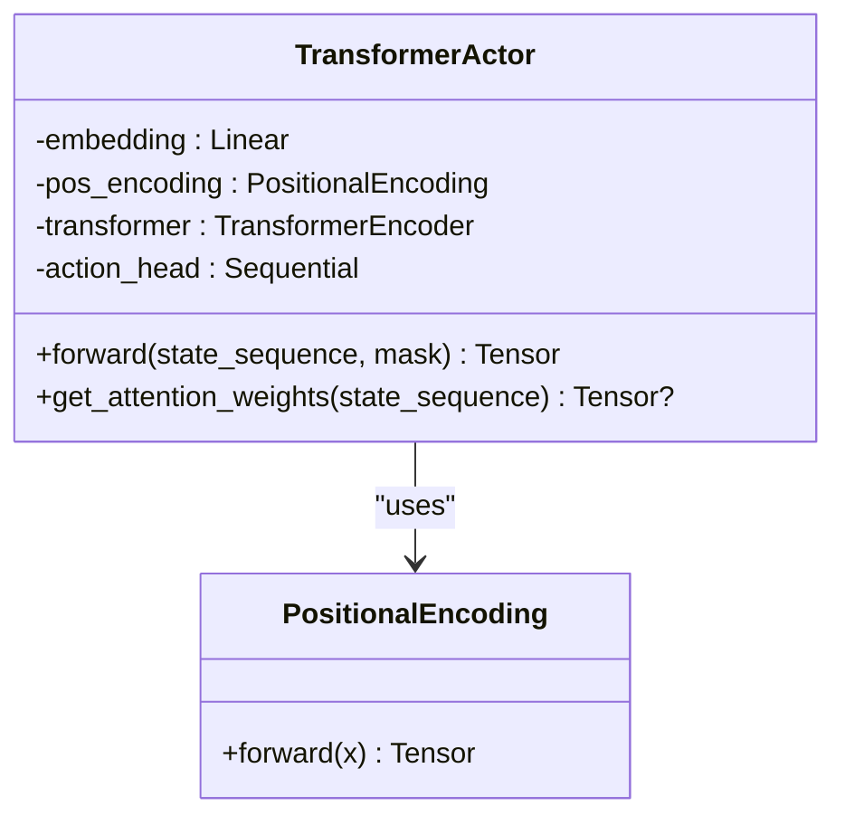
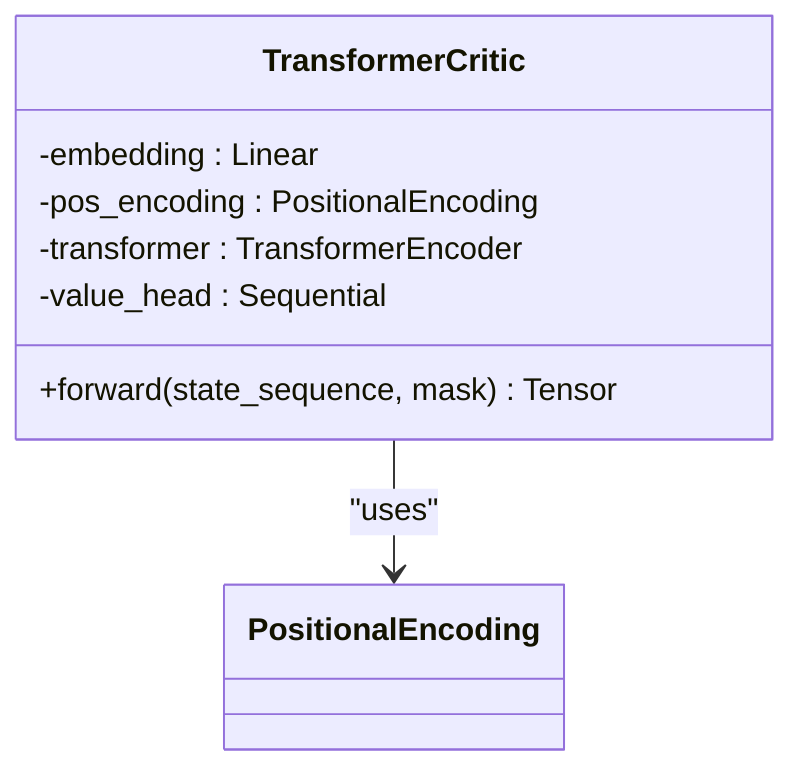
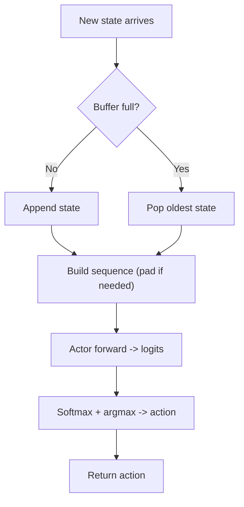
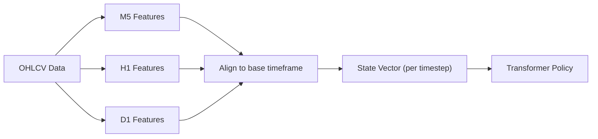
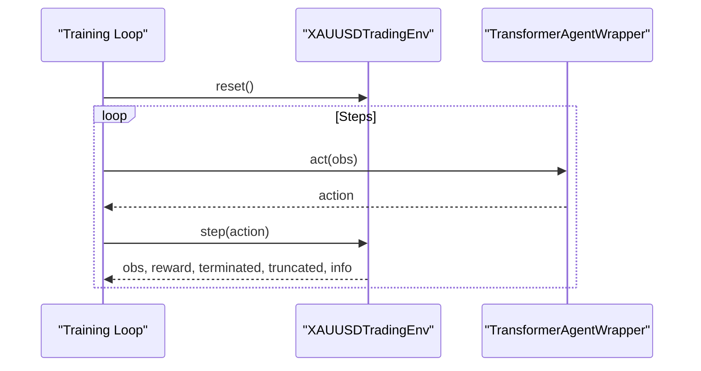
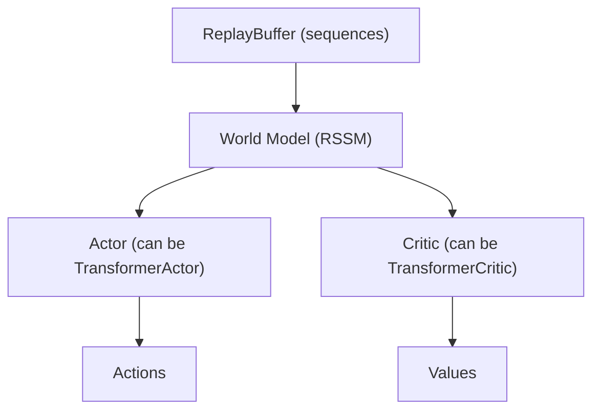
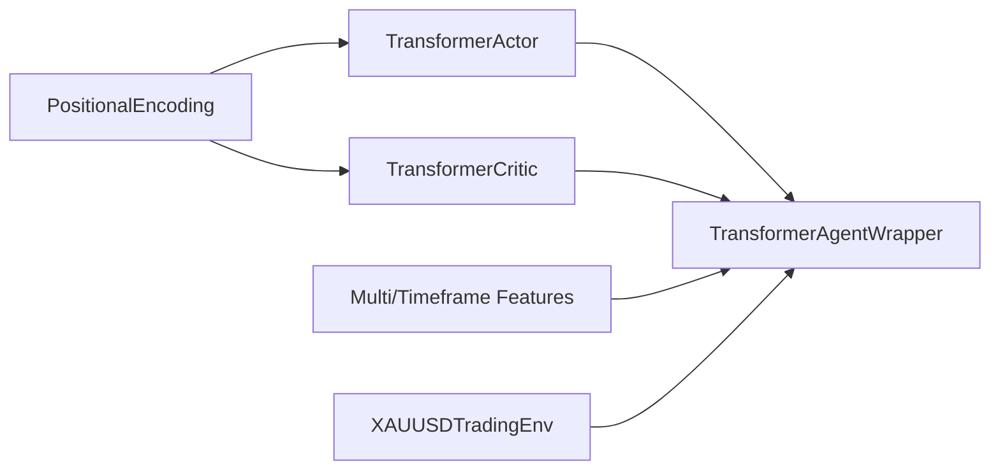

# Transformer-Based Policies

<cite>
**Referenced Files in This Document**
- [transformer_policy.py](file://models/transformer_policy.py)
- [multi_timeframe.py](file://features/multi_timeframe.py)
- [timeframe_features.py](file://features/timeframe_features.py)
- [xauusd_env.py](file://env/xauusd_env.py)
- [train_ppo.py](file://train/train_ppo.py)
- [dreamer_agent.py](file://models/dreamer_agent.py)
</cite>

## Table of Contents
1. Introduction
2. Project Structure
3. Core Components
4. Architecture Overview
5. Detailed Component Analysis
6. Dependency Analysis
7. Performance Considerations
8. Troubleshooting Guide
9. Conclusion
10. Appendices

## Introduction
This document explains the transformer-based policy network implementation for sequential decision making in trading environments. It focuses on how attention mechanisms enable the policy to focus on relevant market features across timeframes, how positional encodings capture temporal dependencies in price sequences, and how the transformer policy integrates with action sampling and training loops. It also contrasts transformer policies with traditional feedforward approaches, outlines configuration options, and discusses computational efficiency and memory usage for real-time trading scenarios.

## Project Structure
The transformer policy is implemented as a reusable actor-critic pair that can be used standalone or integrated into broader agents. Feature engineering modules provide multi-timeframe inputs suitable for sequence modeling. The trading environment provides discrete actions and a windowed observation structure compatible with transformer sequences.



**Diagram sources**
- [multi_timeframe.py:32-96](file://features/multi_timeframe.py#L32-L96)
- [timeframe_features.py:22-99](file://features/timeframe_features.py#L22-L99)
- [xauusd_env.py:7-118](file://env/xauusd_env.py#L7-L118)
- [transformer_policy.py:67-152](file://models/transformer_policy.py#L67-L152)
- [transformer_policy.py:166-249](file://models/transformer_policy.py#L166-L249)
- [transformer_policy.py:252-347](file://models/transformer_policy.py#L252-L347)
- [train_ppo.py:25-93](file://train/train_ppo.py#L25-L93)
- [dreamer_agent.py:84-188](file://models/dreamer_agent.py#L84-L188)

**Section sources**
- [multi_timeframe.py:32-96](file://features/multi_timeframe.py#L32-L96)
- [timeframe_features.py:22-99](file://features/timeframe_features.py#L22-L99)
- [xauusd_env.py:7-118](file://env/xauusd_env.py#L7-L118)
- [transformer_policy.py:67-152](file://models/transformer_policy.py#L67-L152)
- [transformer_policy.py:166-249](file://models/transformer_policy.py#L166-L249)
- [transformer_policy.py:252-347](file://models/transformer_policy.py#L252-L347)
- [train_ppo.py:25-93](file://train/train_ppo.py#L25-L93)
- [dreamer_agent.py:84-188](file://models/dreamer_agent.py#L84-L188)

## Core Components
- PositionalEncoding: Adds sinusoidal positional information to embeddings so the model understands sequence order.
- TransformerActor: Maps sequences of state vectors to action logits using self-attention and an output head.
- TransformerCritic: Maps sequences to scalar value estimates using a similar encoder-head pipeline.
- TransformerAgentWrapper: Manages a rolling buffer of recent states, constructs sequences, performs inference, and provides save/load utilities.

Key responsibilities:
- Sequence construction and padding for variable-length histories.
- Attention over historical states to identify relevant patterns.
- Discrete action selection via argmax over softmax probabilities during inference.

Configuration parameters exposed by the components:
- hidden_dim: internal representation size; must be divisible by num_heads.
- num_heads: number of attention heads per layer.
- num_layers: depth of the transformer encoder stack.
- seq_len: maximum sequence length handled by positional encoding and buffers.
- dropout: regularization applied within layers and heads.

**Section sources**
- [transformer_policy.py:34-64](file://models/transformer_policy.py#L34-L64)
- [transformer_policy.py:67-152](file://models/transformer_policy.py#L67-L152)
- [transformer_policy.py:166-249](file://models/transformer_policy.py#L166-L249)
- [transformer_policy.py:252-347](file://models/transformer_policy.py#L252-L347)

## Architecture Overview
The transformer policy processes a sliding window of past observations to produce decisions. Each timestep’s feature vector is embedded, augmented with positional encodings, and passed through stacked transformer encoder layers. The last token’s representation is projected to either action logits (actor) or a scalar value (critic).

```mermaid
sequenceDiagram
participant Env as "XAUUSDTradingEnv"
participant Wrap as "TransformerAgentWrapper"
participant Actor as "TransformerActor"
participant Critic as "TransformerCritic"
Env->>Wrap : step(action)
Wrap->>Wrap : append state to buffer<br/>build sequence (pad if needed)
Wrap->>Actor : forward(sequence)
Actor-->>Wrap : action_logits
Wrap->>Wrap : softmax + argmax -> action
Wrap->>Critic : forward(sequence)
Critic-->>Wrap : value estimate
Wrap-->>Env : return action (inference path)
```

**Diagram sources**
- [xauusd_env.py:75-118](file://env/xauusd_env.py#L75-L118)
- [transformer_policy.py:297-347](file://models/transformer_policy.py#L297-L347)
- [transformer_policy.py:125-152](file://models/transformer_policy.py#L125-L152)
- [transformer_policy.py:222-249](file://models/transformer_policy.py#L222-L249)

## Detailed Component Analysis

### Positional Encoding
- Purpose: Injects absolute position information into each token embedding using fixed sinusoidal functions.
- Behavior: For input shape (batch, seq_len, d_model), adds precomputed positional encodings up to seq_len.
- Complexity: O(seq_len * d_model) to compute and add; constant memory overhead via registered buffer.



**Diagram sources**
- [transformer_policy.py:34-64](file://models/transformer_policy.py#L34-L64)

**Section sources**
- [transformer_policy.py:34-64](file://models/transformer_policy.py#L34-L64)

### TransformerActor
- Inputs: state_sequence of shape (batch, seq_len, state_dim).
- Processing: Linear embedding -> positional encoding -> transformer encoder -> last-token pooling -> MLP head -> action logits.
- Outputs: action_logits of shape (batch, action_dim).
- Configuration: hidden_dim, num_heads, num_layers, seq_len, dropout.



**Diagram sources**
- [transformer_policy.py:34-64](file://models/transformer_policy.py#L34-L64)
- [transformer_policy.py:67-152](file://models/transformer_policy.py#L67-L152)

**Section sources**
- [transformer_policy.py:67-152](file://models/transformer_policy.py#L67-L152)

### TransformerCritic
- Inputs: same as actor.
- Processing: Embedding -> positional encoding -> transformer encoder -> last-token pooling -> value head.
- Outputs: scalar value per batch element.



**Diagram sources**
- [transformer_policy.py:34-64](file://models/transformer_policy.py#L34-L64)
- [transformer_policy.py:166-249](file://models/transformer_policy.py#L166-L249)

**Section sources**
- [transformer_policy.py:166-249](file://models/transformer_policy.py#L166-L249)

### TransformerAgentWrapper (Inference and Buffering)
- Maintains a rolling buffer of recent states up to seq_len.
- Constructs padded sequences when history is shorter than seq_len.
- Performs inference without gradients to select actions deterministically.
- Provides save/load for actor and critic checkpoints.



**Diagram sources**
- [transformer_policy.py:297-347](file://models/transformer_policy.py#L297-L347)

**Section sources**
- [transformer_policy.py:297-347](file://models/transformer_policy.py#L297-L347)

### Multi-Timeframe Features Integration
- Multi-timeframe feature engineering produces aligned features across timeframes (e.g., M5, M15, H1, H4, D1).
- Cross-timeframe features (trend alignment, momentum cascade, volatility regime, support/resistance confluence) enrich the state representation.
- These features form the state_dim input to the transformer policy, enabling it to attend to relevant signals at multiple horizons.



**Diagram sources**
- [multi_timeframe.py:32-96](file://features/multi_timeframe.py#L32-L96)
- [timeframe_features.py:22-99](file://features/timeframe_features.py#L22-L99)

**Section sources**
- [multi_timeframe.py:32-96](file://features/multi_timeframe.py#L32-L96)
- [timeframe_features.py:22-99](file://features/timeframe_features.py#L22-L99)

### Environment and Action Sampling
- XAUUSDTradingEnv exposes a discrete action space (flat/long) and returns rewards based on returns, costs, and penalties.
- The wrapper samples actions deterministically from the actor’s logits during inference.
- In training pipelines (e.g., PPO), the environment is wrapped and stepped repeatedly to collect trajectories.



**Diagram sources**
- [xauusd_env.py:7-118](file://env/xauusd_env.py#L7-L118)
- [transformer_policy.py:297-347](file://models/transformer_policy.py#L297-L347)
- [train_ppo.py:25-93](file://train/train_ppo.py#L25-L93)

**Section sources**
- [xauusd_env.py:7-118](file://env/xauusd_env.py#L7-L118)
- [transformer_policy.py:297-347](file://models/transformer_policy.py#L297-L347)
- [train_ppo.py:25-93](file://train/train_ppo.py#L25-L93)

### Integration with DreamerV3
- The Dreamer agent maintains a world model and uses an actor/critic for behavior learning.
- While the default Dreamer implementation uses MLP-style networks, the transformer actor/critic can conceptually replace them to handle longer-range dependencies in imagined rollouts.
- The replay buffer collects sequences suitable for transformer training, aligning with the seq_len parameter.



**Diagram sources**
- [dreamer_agent.py:24-78](file://models/dreamer_agent.py#L24-L78)
- [dreamer_agent.py:84-188](file://models/dreamer_agent.py#L84-L188)
- [transformer_policy.py:67-152](file://models/transformer_policy.py#L67-L152)
- [transformer_policy.py:166-249](file://models/transformer_policy.py#L166-L249)

**Section sources**
- [dreamer_agent.py:24-78](file://models/dreamer_agent.py#L24-L78)
- [dreamer_agent.py:84-188](file://models/dreamer_agent.py#L84-L188)
- [transformer_policy.py:67-152](file://models/transformer_policy.py#L67-L152)
- [transformer_policy.py:166-249](file://models/transformer_policy.py#L166-L249)

## Dependency Analysis
- TransformerActor and TransformerCritic depend on PositionalEncoding and PyTorch’s TransformerEncoderLayer/Encoder.
- TransformerAgentWrapper depends on both networks and manages state buffering and sequence creation.
- Feature modules supply the state dimensionality and content consumed by the transformer policy.
- The environment defines the action space and reward structure that guide policy optimization.



**Diagram sources**
- [transformer_policy.py:34-64](file://models/transformer_policy.py#L34-L64)
- [transformer_policy.py:67-152](file://models/transformer_policy.py#L67-L152)
- [transformer_policy.py:166-249](file://models/transformer_policy.py#L166-L249)
- [transformer_policy.py:252-347](file://models/transformer_policy.py#L252-L347)
- [multi_timeframe.py:32-96](file://features/multi_timeframe.py#L32-L96)
- [timeframe_features.py:22-99](file://features/timeframe_features.py#L22-L99)
- [xauusd_env.py:7-118](file://env/xauusd_env.py#L7-L118)

**Section sources**
- [transformer_policy.py:34-64](file://models/transformer_policy.py#L34-L64)
- [transformer_policy.py:67-152](file://models/transformer_policy.py#L67-L152)
- [transformer_policy.py:166-249](file://models/transformer_policy.py#L166-L249)
- [transformer_policy.py:252-347](file://models/transformer_policy.py#L252-L347)
- [multi_timeframe.py:32-96](file://features/multi_timeframe.py#L32-L96)
- [timeframe_features.py:22-99](file://features/timeframe_features.py#L22-L99)
- [xauusd_env.py:7-118](file://env/xauusd_env.py#L7-L118)

## Performance Considerations
- Memory usage:
  - Positional encodings are stored once as a buffer; memory scales with max_len × d_model.
  - TransformerEncoder stores intermediate activations proportional to seq_len × hidden_dim × num_layers during forward/backward passes.
  - The agent’s state buffer holds up to seq_len vectors of size state_dim.
- Computational complexity:
  - Self-attention scales quadratically with seq_len; choose seq_len conservatively for real-time inference.
  - Larger hidden_dim and num_layers increase compute and memory linearly.
- Real-time trading tips:
  - Use smaller seq_len and fewer layers for low-latency inference.
  - Cache embeddings where possible; avoid recomputing positional encodings per step.
  - Batch inference when possible to amortize overhead.
  - Monitor GPU/CPU memory and adjust hidden_dim, num_heads, and num_layers accordingly.

[No sources needed since this section provides general guidance]

## Troubleshooting Guide
- Shape mismatches:
  - Ensure state_dim matches the engineered feature dimensionality from multi-timeframe modules.
  - Verify seq_len does not exceed the configured max_len in positional encoding.
- Padding artifacts:
  - When history is shorter than seq_len, zero-padding is used; ensure masks or logic account for padded steps if training with variable lengths.
- Numerical stability:
  - Use appropriate learning rates and dropout to stabilize attention training.
  - Normalize or scale features to reduce extreme values that can destabilize attention weights.
- Debugging attention:
  - Extend get_attention_weights to expose internal attention maps for interpretability and diagnostics.

**Section sources**
- [transformer_policy.py:34-64](file://models/transformer_policy.py#L34-L64)
- [transformer_policy.py:125-152](file://models/transformer_policy.py#L125-L152)
- [transformer_policy.py:297-347](file://models/transformer_policy.py#L297-L347)

## Conclusion
The transformer-based policy leverages attention to selectively focus on relevant historical market features across multiple timeframes, addressing long-range dependencies that traditional feedforward models struggle with. Positional encodings preserve temporal order, while the actor-critic design supports both decision-making and value estimation. With careful configuration of hidden dimensions, attention heads, and sequence length, the architecture can balance performance and efficiency for real-time trading. Integrating with robust feature engineering and environment abstractions enables practical deployment in live markets.

[No sources needed since this section summarizes without analyzing specific files]

## Appendices

### Configuration Options Summary
- TransformerActor / TransformerCritic:
  - hidden_dim: internal representation size; must be divisible by num_heads.
  - num_heads: number of attention heads per layer.
  - num_layers: number of stacked transformer encoder layers.
  - seq_len: maximum sequence length; affects positional encoding and buffer sizing.
  - dropout: regularization rate applied in transformer layers and heads.
- TransformerAgentWrapper:
  - state_dim: input feature dimensionality.
  - action_dim: number of discrete actions.
  - seq_len: rolling buffer length for constructing sequences.

**Section sources**
- [transformer_policy.py:67-152](file://models/transformer_policy.py#L67-L152)
- [transformer_policy.py:166-249](file://models/transformer_policy.py#L166-L249)
- [transformer_policy.py:252-347](file://models/transformer_policy.py#L252-L347)

### Concrete Usage Examples (by reference)
- Constructing a transformer policy:
  - See initialization and forward pass examples in the module’s main block for creating actors, critics, and running test sequences.
- Forward pass through the network:
  - Input: tensor of shape (batch, seq_len, state_dim).
  - Output: action logits (actor) or value estimates (critic).
- Integration with action sampling:
  - The wrapper builds sequences from a rolling buffer, runs the actor, applies softmax and argmax to select actions deterministically.

**Section sources**
- [transformer_policy.py:375-442](file://models/transformer_policy.py#L375-L442)
- [transformer_policy.py:297-347](file://models/transformer_policy.py#L297-L347)