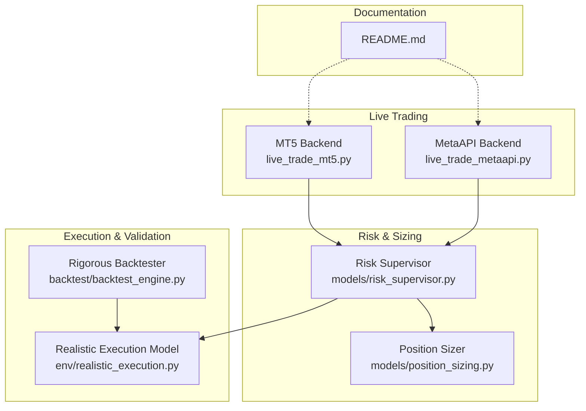
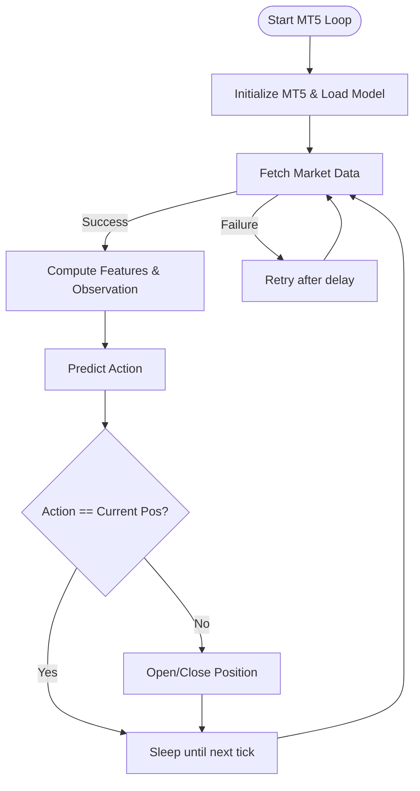
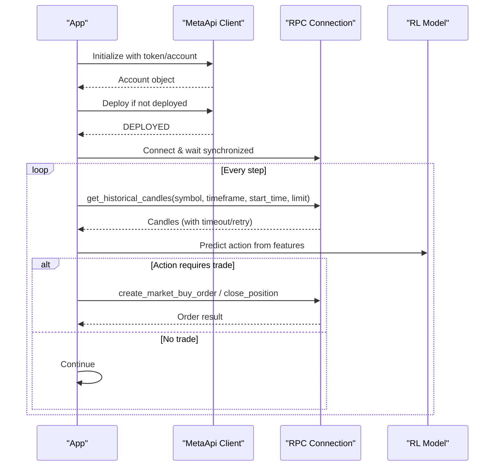
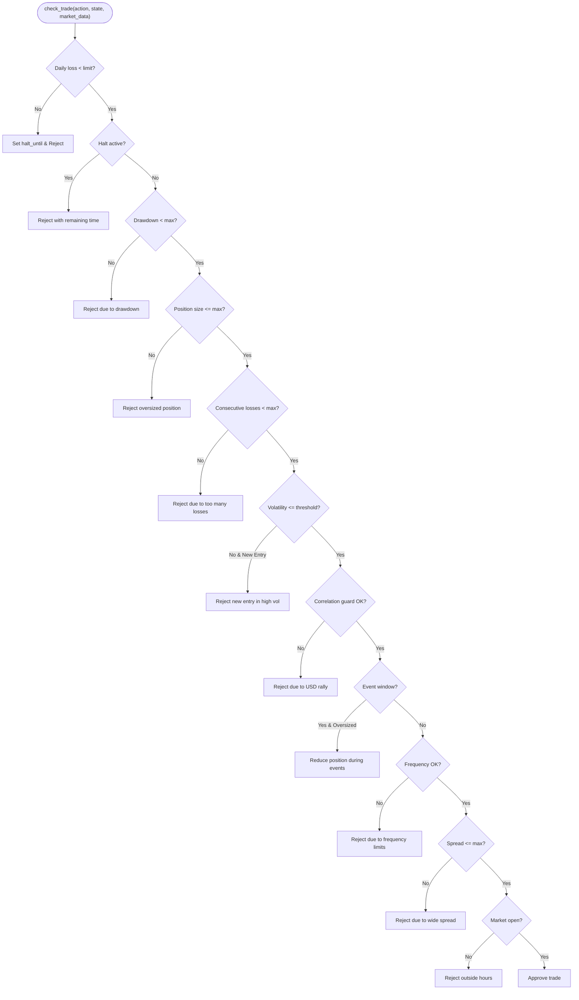
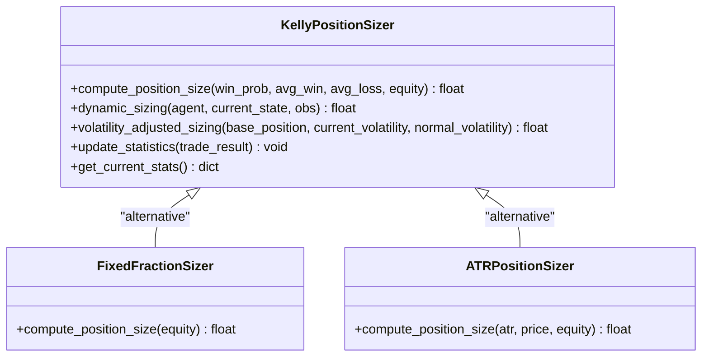
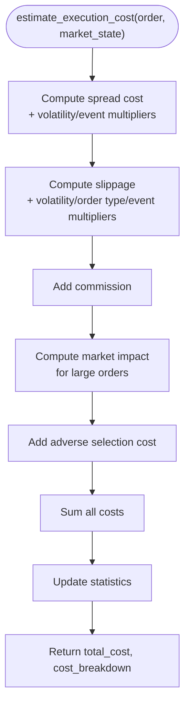
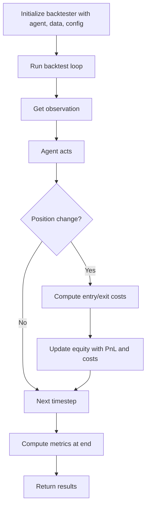
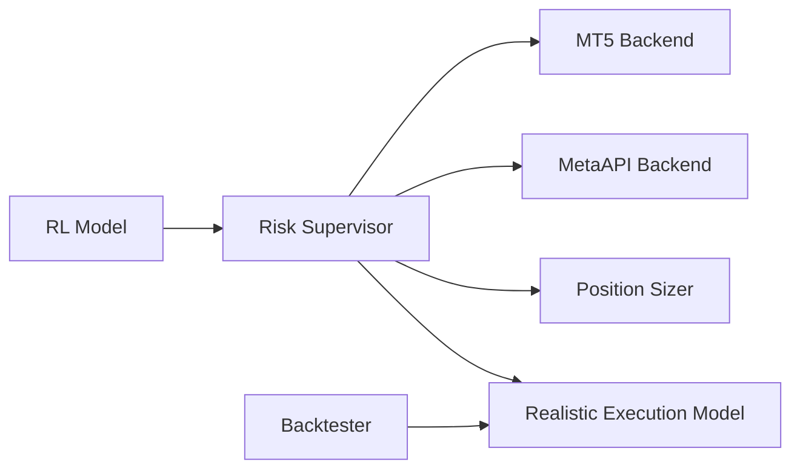

# Execution Layer Architecture

<cite>
**Referenced Files in This Document**
- [live_trade_mt5.py](file://live/live_trade_mt5.py)
- [live_trade_metaapi.py](file://live/live_trade_metaapi.py)
- [risk_supervisor.py](file://models/risk_supervisor.py)
- [position_sizing.py](file://models/position_sizing.py)
- [realistic_execution.py](file://env/realistic_execution.py)
- [backtest_engine.py](file://backtest/backtest_engine.py)
- [README.md](file://README.md)
</cite>

## Table of Contents
1. Introduction
2. Project Structure
3. Core Components
4. Architecture Overview
5. Detailed Component Analysis
6. Dependency Analysis
7. Performance Considerations
8. Troubleshooting Guide
9. Conclusion
10. Appendices

## Introduction
This document describes the production execution layer that handles live trading operations for a deep reinforcement learning-based trading system focused on XAUUSD. It explains the dual-backend architecture supporting both MetaTrader 5 direct integration and MetaAPI cloud trading services, the risk supervision system implementing dynamic position sizing, stop-loss placement, and drawdown protection, the execution engine translating model signals into trades with error handling and retry logic, monitoring and alerting considerations, and disaster recovery procedures to protect capital during failures or market anomalies.

## Project Structure
The execution layer spans several modules:
- Live trading backends: MT5 direct and MetaAPI cloud
- Risk supervision and position sizing
- Realistic execution modeling for cost-aware decisions
- Backtesting framework for validation and metrics



**Diagram sources**
- [live_trade_mt5.py:1-174](file://live/live_trade_mt5.py#L1-L174)
- [live_trade_metaapi.py:1-231](file://live/live_trade_metaapi.py#L1-L231)
- [risk_supervisor.py:1-387](file://models/risk_supervisor.py#L1-L387)
- [position_sizing.py:1-399](file://models/position_sizing.py#L1-L399)
- [realistic_execution.py:1-356](file://env/realistic_execution.py#L1-L356)
- [backtest_engine.py:1-423](file://backtest/backtest_engine.py#L1-L423)
- [README.md:135-156](file://README.md#L135-L156)

**Section sources**
- [README.md:135-156](file://README.md#L135-L156)

## Core Components
- Dual-backend execution:
  - MT5 direct backend: initializes terminal, fetches market data, computes features, runs RL model inference, and executes orders via MT5 API.
  - MetaAPI cloud backend: authenticates via token/account, deploys account if needed, establishes RPC connection, fetches historical candles asynchronously, runs RL inference, and places/closes orders through MetaAPI.
- Risk supervision: deterministic safety layer enforcing daily loss limits, maximum drawdown, position size caps, volatility filters, correlation guards, event risk filters, trade frequency controls, spread filters, and market hours checks; includes emergency shutdown capability.
- Position sizing: Kelly Criterion-based dynamic sizing with fractional Kelly, volatility-adjusted sizing, and alternative sizers (fixed fraction, ATR-based).
- Realistic execution modeling: estimates spread, slippage, commission, market impact, and adverse selection costs; simulates fill prices under varying market conditions.
- Backtesting framework: rigorous backtester with conservative cost assumptions, walk-forward validation, and comprehensive performance metrics.

**Section sources**
- [live_trade_mt5.py:11-174](file://live/live_trade_mt5.py#L11-L174)
- [live_trade_metaapi.py:23-231](file://live/live_trade_metaapi.py#L23-L231)
- [risk_supervisor.py:18-387](file://models/risk_supervisor.py#L18-L387)
- [position_sizing.py:29-399](file://models/position_sizing.py#L29-L399)
- [realistic_execution.py:24-356](file://env/realistic_execution.py#L24-L356)
- [backtest_engine.py:24-423](file://backtest/backtest_engine.py#L24-L423)

## Architecture Overview
The execution layer orchestrates a loop where market data is fetched, features computed, RL model predicts actions, risk supervisor approves/rejects, and orders are executed via one of two backends. The system includes robust error handling, retries, timeouts, and reconnection logic.

```mermaid
sequenceDiagram
participant Loop as "Trading Loop"
participant Data as "Market Data Fetcher"
participant Model as "RL Model"
participant Risk as "Risk Supervisor"
participant Exec as "Execution Backend"
Loop->>Data : Fetch recent candles / features
Data-->>Loop : Features + current state
Loop->>Model : Predict action from observation
Model-->>Loop : Action (flat/long)
Loop->>Risk : Check trade (action, state, market_data)
Risk-->>Loop : Approved or Rejected (reason)
alt Approved
Loop->>Exec : Place order / Close position
Exec-->>Loop : Order result
else Rejected
Loop->>Loop : Skip trade / Hold flat
end
Note over Loop,Exec : Includes retries, timeouts, reconnects
```

**Diagram sources**
- [live_trade_mt5.py:111-174](file://live/live_trade_mt5.py#L111-L174)
- [live_trade_metaapi.py:100-231](file://live/live_trade_metaapi.py#L100-L231)
- [risk_supervisor.py:91-174](file://models/risk_supervisor.py#L91-L174)

## Detailed Component Analysis

### MT5 Direct Backend
- Initializes MT5 terminal and loads RL model.
- Fetches market data, computes features, constructs observations, and predicts actions deterministically.
- Executes trades by opening long positions or closing existing ones based on action vs current position.
- Uses magic numbers and comments to identify orders.
- Implements basic error handling and sleep intervals between checks.



**Diagram sources**
- [live_trade_mt5.py:111-174](file://live/live_trade_mt5.py#L111-L174)

**Section sources**
- [live_trade_mt5.py:11-174](file://live/live_trade_mt5.py#L11-L174)

### MetaAPI Cloud Backend
- Loads credentials from environment variables.
- Connects to MetaAPI, retrieves account info, ensures deployment, and establishes RPC connection with synchronization and stabilization delays.
- Asynchronously fetches historical candles with timeout and retry logic.
- Computes features, constructs observations, predicts actions, and executes orders via MetaAPI RPC.
- Handles network timeouts, reconnection attempts, and critical errors.



**Diagram sources**
- [live_trade_metaapi.py:23-231](file://live/live_trade_metaapi.py#L23-L231)

**Section sources**
- [live_trade_metaapi.py:23-231](file://live/live_trade_metaapi.py#L23-L231)

### Risk Supervisor System
- Enforces multiple safety rules:
  - Daily loss limit with circuit breaker halt
  - Maximum drawdown protection
  - Position size limits
  - Volatility filter preventing new entries in high volatility
  - Correlation guard against strong USD rally when going long Gold
  - Event risk filter reducing position size during high-impact news windows
  - Trade frequency controls (max trades per day, minimum interval)
  - Spread filter to avoid wide spreads
  - Market hours check
- Tracks state: daily PnL, equity, peak equity, trade counters, consecutive losses, halt timers.
- Provides emergency shutdown to permanently halt trading until manual restart.
- Offers statistics for approval/rejection rates and reasons.



**Diagram sources**
- [risk_supervisor.py:91-174](file://models/risk_supervisor.py#L91-L174)

**Section sources**
- [risk_supervisor.py:18-387](file://models/risk_supervisor.py#L18-L387)

### Dynamic Position Sizing
- Kelly Criterion-based sizing using win probability and risk/reward ratio, with fractional Kelly for safety.
- Volatility-adjusted sizing reduces exposure in high volatility regimes.
- Alternative sizers: fixed fraction and ATR-based sizing for different strategies.
- Updates statistics from trade history to refine win rate and average win/loss estimates.



**Diagram sources**
- [position_sizing.py:29-399](file://models/position_sizing.py#L29-L399)

**Section sources**
- [position_sizing.py:29-399](file://models/position_sizing.py#L29-L399)

### Realistic Execution Modeling
- Estimates total execution cost including spread widening, slippage scaling with volatility, commissions, market impact for large orders, and adverse selection.
- Simulates fill prices adjusted for costs and provides cost breakdowns.
- Useful for training and backtesting to avoid overly optimistic results.



**Diagram sources**
- [realistic_execution.py:88-169](file://env/realistic_execution.py#L88-L169)

**Section sources**
- [realistic_execution.py:24-356](file://env/realistic_execution.py#L24-L356)

### Backtesting Framework
- Rigorous backtester with conservative cost assumptions (spread multiplier, slippage, commission).
- Walk-forward validation across rolling windows to simulate realistic out-of-sample testing.
- Comprehensive metrics: returns, risk ratios (Sharpe, Sortino, Calmar), trade stats, and cost analysis.



**Diagram sources**
- [backtest_engine.py:73-146](file://backtest/backtest_engine.py#L73-L146)
- [backtest_engine.py:148-195](file://backtest/backtest_engine.py#L148-L195)

**Section sources**
- [backtest_engine.py:24-423](file://backtest/backtest_engine.py#L24-L423)

## Dependency Analysis
- Live backends depend on feature computation and RL model inference.
- Risk supervisor sits between model predictions and execution, overriding unsafe actions.
- Position sizing informs risk supervisor’s position size limits and can be integrated into strategy logic.
- Realistic execution modeling supports backtesting and potentially live cost estimation.
- Backtester uses similar cost assumptions to validate strategies before live deployment.



**Diagram sources**
- [risk_supervisor.py:91-174](file://models/risk_supervisor.py#L91-L174)
- [live_trade_mt5.py:111-174](file://live/live_trade_mt5.py#L111-L174)
- [live_trade_metaapi.py:100-231](file://live/live_trade_metaapi.py#L100-L231)
- [position_sizing.py:29-399](file://models/position_sizing.py#L29-L399)
- [realistic_execution.py:88-169](file://env/realistic_execution.py#L88-L169)
- [backtest_engine.py:73-146](file://backtest/backtest_engine.py#L73-L146)

**Section sources**
- [risk_supervisor.py:91-174](file://models/risk_supervisor.py#L91-L174)
- [live_trade_mt5.py:111-174](file://live/live_trade_mt5.py#L111-L174)
- [live_trade_metaapi.py:100-231](file://live/live_trade_metaapi.py#L100-L231)
- [position_sizing.py:29-399](file://models/position_sizing.py#L29-L399)
- [realistic_execution.py:88-169](file://env/realistic_execution.py#L88-L169)
- [backtest_engine.py:73-146](file://backtest/backtest_engine.py#L73-L146)

## Performance Considerations
- Use asynchronous fetching and timeouts in MetaAPI backend to handle network latency and reduce blocking.
- Implement retry logic for data fetches and order submissions to improve resilience.
- Avoid excessive polling; align check intervals with timeframe (e.g., H1) to minimize overhead.
- Incorporate realistic execution costs in training and backtesting to prevent overfitting to idealized conditions.
- Monitor spread and volatility to throttle trading activity during adverse conditions.

[No sources needed since this section provides general guidance]

## Troubleshooting Guide
- MT5 initialization failures: check terminal connectivity and last_error codes; ensure correct symbol and timeframe configuration.
- MetaAPI connection issues: verify token and account ID, ensure account deployment, handle timeouts and reconnection loops.
- Risk supervisor halts: review daily loss limit, drawdown thresholds, and event windows; adjust parameters if necessary.
- Wide spreads or high volatility: expect increased rejections; consider reducing position sizes or pausing trading.
- Emergency shutdown: use to halt all trading in case of critical failures; requires manual restart.

**Section sources**
- [live_trade_mt5.py:111-117](file://live/live_trade_mt5.py#L111-L117)
- [live_trade_metaapi.py:135-197](file://live/live_trade_metaapi.py#L135-L197)
- [risk_supervisor.py:104-174](file://models/risk_supervisor.py#L104-L174)
- [risk_supervisor.py:231-241](file://models/risk_supervisor.py#L231-L241)

## Conclusion
The execution layer combines dual-backend live trading capabilities with a robust risk supervision system, dynamic position sizing, realistic execution modeling, and rigorous backtesting. These components collectively translate model signals into safe, resilient trades while protecting capital through circuit breakers, drawdown limits, and fail-safe mechanisms. Proper monitoring, alerting, and disaster recovery procedures further enhance operational reliability.

[No sources needed since this section summarizes without analyzing specific files]

## Appendices
- Configuration references for live trading parameters and risk management settings are documented in the project README.

**Section sources**
- [README.md:561-575](file://README.md#L561-L575)