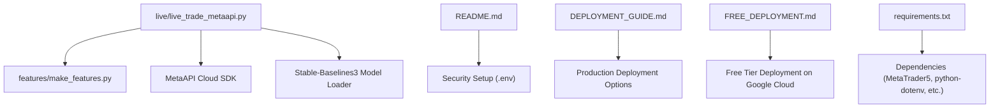
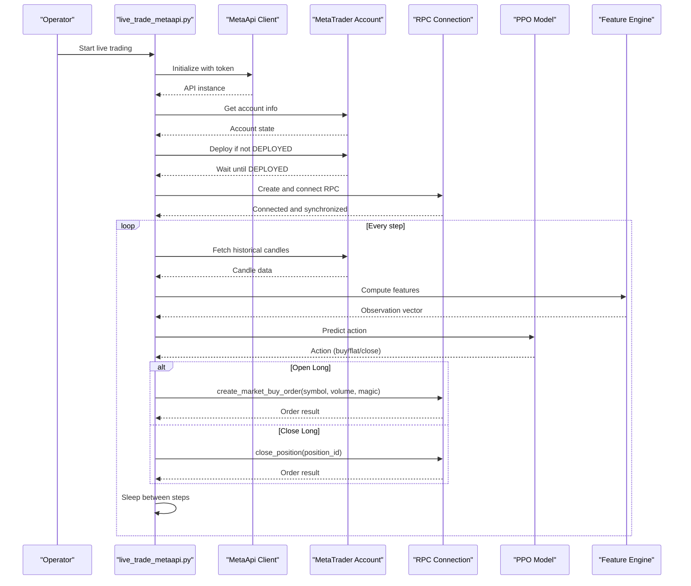
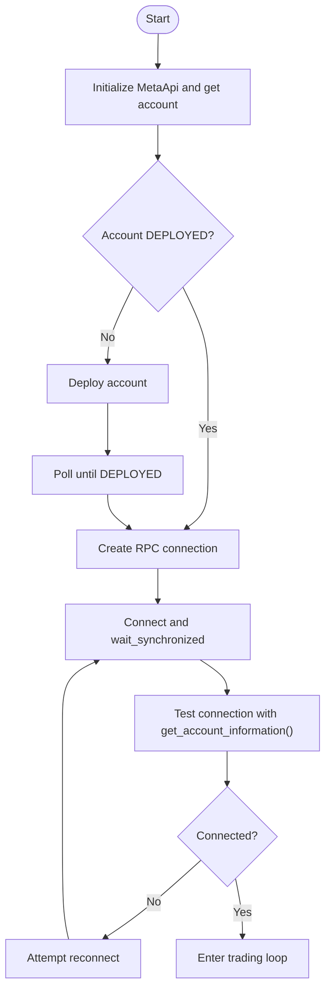
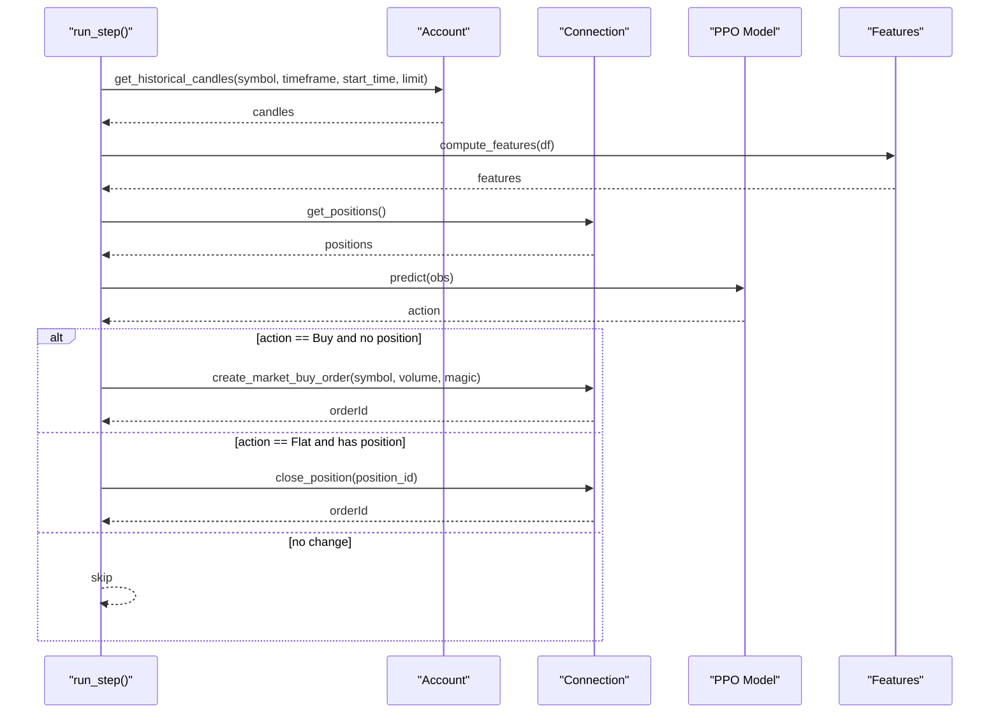
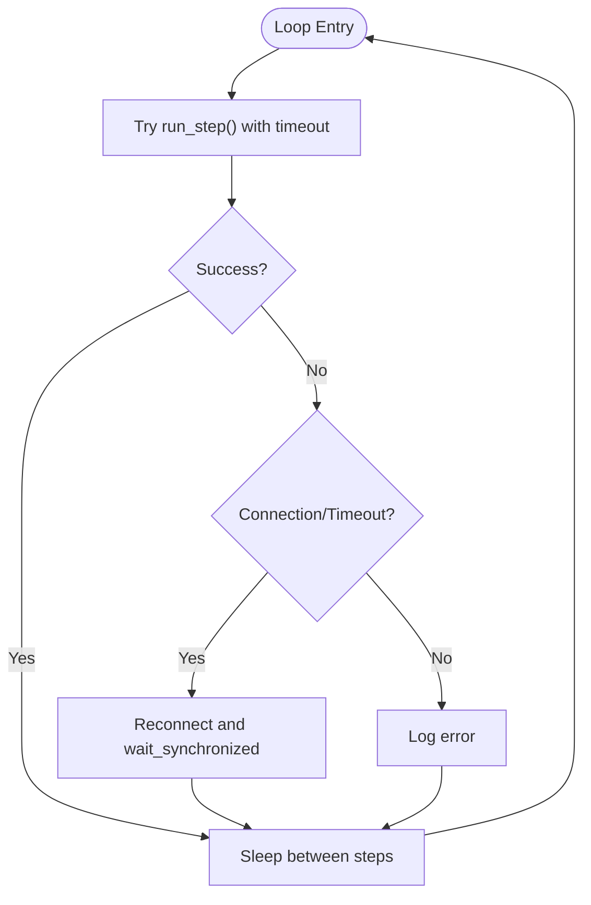
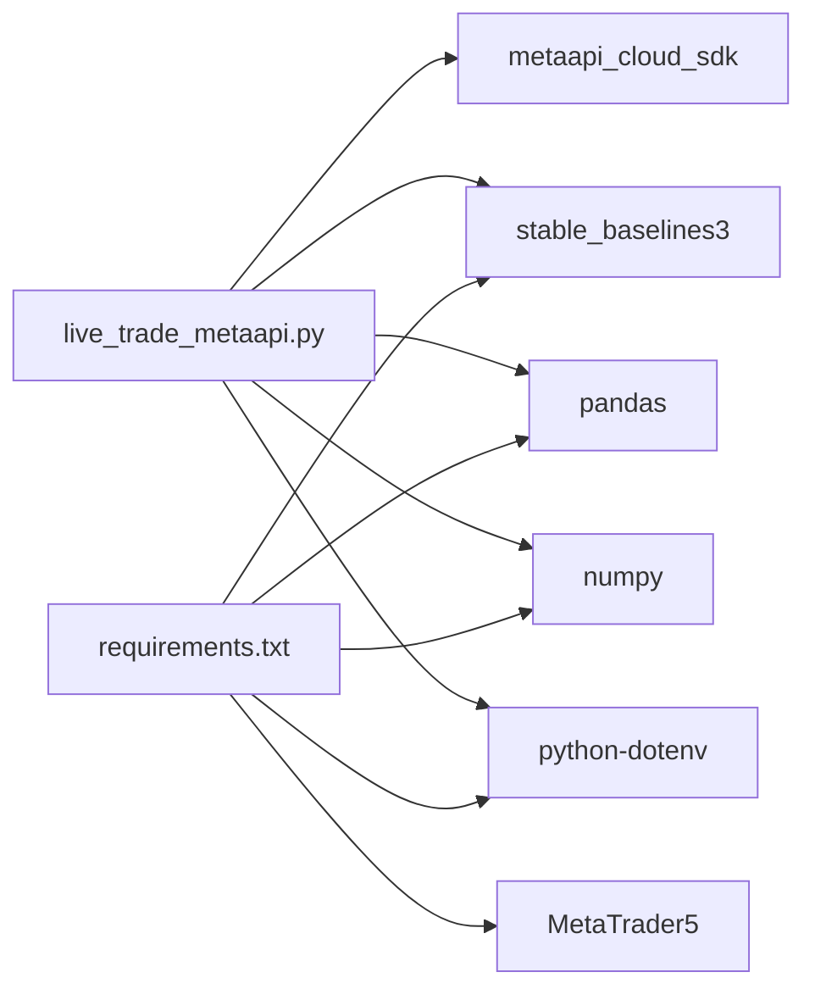

# MetaAPI Cloud Trading

<cite>
**Referenced Files in This Document**
- [live_trade_metaapi.py](file://live/live_trade_metaapi.py)
- [README.md](file://README.md)
- [DEPLOYMENT_GUIDE.md](file://DEPLOYMENT_GUIDE.md)
- [FREE_DEPLOYMENT.md](file://FREE_DEPLOYMENT.md)
- [requirements.txt](file://requirements.txt)
</cite>

## Table of Contents
1. [Introduction](#introduction)
2. [Project Structure](#project-structure)
3. [Core Components](#core-components)
4. [Architecture Overview](#architecture-overview)
5. [Detailed Component Analysis](#detailed-component-analysis)
6. [Dependency Analysis](#dependency-analysis)
7. [Performance Considerations](#performance-considerations)
8. [Troubleshooting Guide](#troubleshooting-guide)
9. [Conclusion](#conclusion)
10. [Appendices](#appendices)

## Introduction
This document explains the cloud-based trading integration using MetaAPI to execute trades remotely from a trained deep reinforcement learning model. It covers authentication, client initialization, connection management, order placement and lifecycle, account synchronization between local and cloud environments, error handling and retry logic for network issues and rate limiting, configuration options, deployment strategies, example workflows, and troubleshooting steps.

The implementation is centered around a single live trading script that:
- Authenticates with MetaAPI using an API token and account ID loaded from environment variables.
- Ensures the remote MetaTrader account is deployed and connected.
- Establishes an RPC connection and synchronizes state before trading.
- Runs a loop that fetches market data, computes features, predicts actions from a trained model, and places or closes orders via MetaAPI.
- Implements robust retries and reconnection logic for resilience.

**Section sources**
- [live_trade_metaapi.py:23-38](file://live/live_trade_metaapi.py#L23-L38)
- [README.md:135-148](file://README.md#L135-L148)

## Project Structure
The repository organizes code by feature areas (training, evaluation, features, environments, models) and includes live execution scripts for both MT5 and MetaAPI. The MetaAPI cloud trading flow is implemented in the live trading script under the live directory. Supporting documentation provides installation, security setup, quick start, and deployment guidance.

**Diagram sources**
- [live_trade_metaapi.py:1-10](file://live/live_trade_metaapi.py#L1-L10)
- [README.md:264-291](file://README.md#L264-L291)
- [DEPLOYMENT_GUIDE.md:1-192](file://DEPLOYMENT_GUIDE.md#L1-L192)
- [FREE_DEPLOYMENT.md:1-360](file://FREE_DEPLOYMENT.md#L1-L360)
- [requirements.txt:1-29](file://requirements.txt#L1-L29)

**Section sources**
- [README.md:418-471](file://README.md#L418-L471)
- [live_trade_metaapi.py:1-20](file://live/live_trade_metaapi.py#L1-L20)

## Core Components
- Authentication and Configuration
  - Loads METAAPI_TOKEN and METAAPI_ACCOUNT_ID from environment variables for secure configuration.
  - Uses python-dotenv to load .env if present.
- Client Initialization and Account Management
  - Initializes the MetaApi client with the token.
  - Retrieves account details and ensures it is deployed; deploys if needed and waits until DEPLOYED.
  - Waits for broker connection stabilization.
- Connection Management
  - Creates an RPC connection from the account and connects.
  - Waits for synchronization and performs a test call to validate connectivity.
- Data Acquisition and Feature Computation
  - Fetches historical candles with timeout and retry logic.
  - Computes features using the project’s feature module.
- Model Inference and Action Execution
  - Loads a trained PPO model and predicts actions deterministically.
  - Places buy orders or closes positions based on predicted action and current position state.
- Loop and Resilience
  - Runs a continuous loop with timeouts and exception handling.
  - Detects disconnections/timeouts and attempts automatic reconnection.

**Section sources**
- [live_trade_metaapi.py:23-38](file://live/live_trade_metaapi.py#L23-L38)
- [live_trade_metaapi.py:135-199](file://live/live_trade_metaapi.py#L135-L199)
- [live_trade_metaapi.py:40-86](file://live/live_trade_metaapi.py#L40-L86)
- [live_trade_metaapi.py:100-134](file://live/live_trade_metaapi.py#L100-L134)
- [live_trade_metaapi.py:202-220](file://live/live_trade_metaapi.py#L202-L220)

## Architecture Overview
The system integrates a trained RL policy with MetaAPI cloud services to execute trades remotely. The flow spans environment configuration, account deployment, connection establishment, data retrieval, feature computation, model inference, and order execution.

**Diagram sources**
- [live_trade_metaapi.py:135-199](file://live/live_trade_metaapi.py#L135-L199)
- [live_trade_metaapi.py:40-86](file://live/live_trade_metaapi.py#L40-L86)
- [live_trade_metaapi.py:100-134](file://live/live_trade_metaapi.py#L100-L134)
- [live_trade_metaapi.py:202-220](file://live/live_trade_metaapi.py#L202-L220)

## Detailed Component Analysis

### Authentication and Configuration
- Environment Variables
  - METAAPI_TOKEN: Your MetaAPI API token.
  - METAAPI_ACCOUNT_ID: Your MetaTrader account ID linked to MetaAPI.
- Security
  - Credentials are loaded from environment variables via python-dotenv; never hardcode secrets.
- Strategy Parameters
  - Symbol, timeframe, volume, model path, window size, and magic number are defined at the top of the script for easy tuning.

**Section sources**
- [live_trade_metaapi.py:23-38](file://live/live_trade_metaapi.py#L23-L38)
- [README.md:264-291](file://README.md#L264-L291)

### Client Initialization and Account Deployment
- Initialize MetaApi with token.
- Retrieve account information and region.
- If account is not DEPLOYED, deploy it and poll until ready.
- Wait for broker connection to stabilize before proceeding.

**Section sources**
- [live_trade_metaapi.py:135-172](file://live/live_trade_metaapi.py#L135-L172)

### Connection Management and Synchronization
- Create RPC connection from the account and connect.
- Wait for synchronization to ensure subscriptions are established.
- Validate connectivity by fetching account information with timeout and retries.
- On connection errors or timeouts, attempt reconnect within the main loop.

**Diagram sources**
- [live_trade_metaapi.py:135-199](file://live/live_trade_metaapi.py#L135-L199)
- [live_trade_metaapi.py:202-220](file://live/live_trade_metaapi.py#L202-L220)

**Section sources**
- [live_trade_metaapi.py:170-199](file://live/live_trade_metaapi.py#L170-L199)
- [live_trade_metaapi.py:202-220](file://live/live_trade_metaapi.py#L202-L220)

### Data Acquisition and Feature Computation
- Historical candles are fetched with a timeout and retry logic to handle transient failures.
- Data is transformed into a DataFrame and sorted by time for consistent feature computation.
- Features are computed using the project’s feature engine; insufficient history triggers a wait condition.

**Section sources**
- [live_trade_metaapi.py:40-86](file://live/live_trade_metaapi.py#L40-L86)
- [live_trade_metaapi.py:100-111](file://live/live_trade_metaapi.py#L100-L111)

### Model Inference and Order Placement
- Loads a trained PPO model and predicts actions deterministically.
- Compares predicted action with current position type to decide whether to open, hold, or close.
- Opens long positions with a specified volume and magic number for identification.
- Closes existing long positions by position ID.

**Diagram sources**
- [live_trade_metaapi.py:100-134](file://live/live_trade_metaapi.py#L100-L134)

**Section sources**
- [live_trade_metaapi.py:100-134](file://live/live_trade_metaapi.py#L100-L134)

### Error Handling and Retry Logic
- Data fetch retries with backoff on empty results, timeouts, and exceptions.
- Main loop wraps each step with a timeout; on timeout or connection-related errors, it logs and continues.
- Automatic reconnection logic detects “not connected” or “timeout” conditions and attempts to reconnect and resynchronize.

**Diagram sources**
- [live_trade_metaapi.py:202-220](file://live/live_trade_metaapi.py#L202-L220)

**Section sources**
- [live_trade_metaapi.py:40-86](file://live/live_trade_metaapi.py#L40-L86)
- [live_trade_metaapi.py:202-220](file://live/live_trade_metaapi.py#L202-L220)

### Account Synchronization Mechanisms
- After connecting, the script explicitly waits for synchronization to ensure all subscriptions and state are up-to-date.
- Before trading, it checks current positions to maintain consistency between local state and cloud-executed positions.
- Magic numbers are used to identify positions managed by this bot, ensuring correct matching when opening/closing.

**Section sources**
- [live_trade_metaapi.py:170-180](file://live/live_trade_metaapi.py#L170-L180)
- [live_trade_metaapi.py:88-98](file://live/live_trade_metaapi.py#L88-L98)
- [live_trade_metaapi.py:120-134](file://live/live_trade_metaapi.py#L120-L134)

### Configuration Options and Providers
- Provider: MetaAPI cloud service; credentials configured via environment variables.
- Key options:
  - METAAPI_TOKEN, METAAPI_ACCOUNT_ID
  - SYMBOL, TIMEFRAME, VOLUME, MODEL_PATH, WINDOW, MAGIC_NUMBER
- These can be adjusted per strategy or environment without modifying core logic.

**Section sources**
- [live_trade_metaapi.py:23-38](file://live/live_trade_metaapi.py#L23-L38)
- [README.md:264-291](file://README.md#L264-L291)

### Deployment Strategies for Production
- Recommended platforms: AWS Lightsail, DigitalOcean, Google Cloud free tier, or local machines with screen/nohup.
- Use systemd services for auto-start and crash recovery.
- Monitor logs via journalctl or log files; keep the process running 24/7.

**Section sources**
- [DEPLOYMENT_GUIDE.md:1-192](file://DEPLOYMENT_GUIDE.md#L1-L192)
- [FREE_DEPLOYMENT.md:1-360](file://FREE_DEPLOYMENT.md#L1-L360)

## Dependency Analysis
The live trading script depends on:
- MetaAPI Cloud SDK for remote trading operations.
- Stable-Baselines3 for loading and running the trained PPO model.
- pandas/numpy for data processing and feature computation.
- python-dotenv for secure configuration loading.
- MetaTrader5 package listed in requirements (used by other parts of the project).

**Diagram sources**
- [live_trade_metaapi.py:1-10](file://live/live_trade_metaapi.py#L1-L10)
- [requirements.txt:1-29](file://requirements.txt#L1-L29)

**Section sources**
- [requirements.txt:1-29](file://requirements.txt#L1-L29)
- [live_trade_metaapi.py:1-10](file://live/live_trade_metaapi.py#L1-L10)

## Performance Considerations
- Network Latency: Use timeouts and retries to mitigate slow responses; avoid excessive polling frequency.
- Data Volume: Fetch only necessary history to reduce bandwidth and processing time.
- Model Inference: Keep observation windows minimal yet sufficient for stable predictions.
- Resource Usage: The bot runs lightweight tasks; a small VM is sufficient for 24/7 operation.

[No sources needed since this section provides general guidance]

## Troubleshooting Guide
Common issues and resolutions:
- Missing Credentials
  - Ensure METAAPI_TOKEN and METAAPI_ACCOUNT_ID are set in your environment or .env file.
- Account Not Deployed
  - The script will attempt to deploy automatically; verify the account reaches DEPLOYED state.
- Connection Timeouts
  - The script retries data fetches and reconnects on timeouts; check network stability and firewall rules.
- Subscription Delays
  - After connecting, the script waits for synchronization; allow additional time for subscriptions to stabilize.
- Position Mismatch
  - Verify magic number matches and that positions are correctly identified before closing.

Operational tips:
- Use systemd to auto-restart the bot on crashes.
- Monitor logs continuously during initial runs.
- Start with demo accounts and minimal volumes.

**Section sources**
- [live_trade_metaapi.py:135-199](file://live/live_trade_metaapi.py#L135-L199)
- [live_trade_metaapi.py:202-220](file://live/live_trade_metaapi.py#L202-L220)
- [DEPLOYMENT_GUIDE.md:137-192](file://DEPLOYMENT_GUIDE.md#L137-L192)
- [FREE_DEPLOYMENT.md:303-335](file://FREE_DEPLOYMENT.md#L303-L335)

## Conclusion
The MetaAPI cloud trading integration enables reliable, remote execution of AI-driven trading strategies. By securely configuring credentials, ensuring account deployment, managing connections with synchronization, and implementing robust retries and reconnection logic, the system maintains state consistency and operational resilience. With straightforward deployment options and clear configuration, users can run production-grade automated trading across multiple providers while minimizing downtime and risk.

[No sources needed since this section summarizes without analyzing specific files]

## Appendices

### Example Cloud Trading Workflow
- Configure environment variables for MetaAPI token and account ID.
- Run the live trading script; it initializes the client, deploys the account if needed, and establishes a synchronized connection.
- Each step fetches market data, computes features, predicts actions, and executes orders accordingly.
- The loop continues with timeouts and automatic reconnection on failures.

**Section sources**
- [live_trade_metaapi.py:135-199](file://live/live_trade_metaapi.py#L135-L199)
- [live_trade_metaapi.py:202-220](file://live/live_trade_metaapi.py#L202-L220)

### Configuration Reference
- METAAPI_TOKEN: MetaAPI API token.
- METAAPI_ACCOUNT_ID: MetaTrader account ID.
- SYMBOL: Trading symbol (e.g., XAUUSD).
- TIMEFRAME: Chart timeframe (e.g., 1h).
- VOLUME: Lot size per trade.
- MODEL_PATH: Path to the trained model file.
- WINDOW: Observation window length for features.
- MAGIC_NUMBER: Unique identifier for bot-managed positions.

**Section sources**
- [live_trade_metaapi.py:23-38](file://live/live_trade_metaapi.py#L23-L38)

### Dependencies
- Python packages required include stable-baselines3, torch, gymnasium, pandas, numpy, MetaTrader5, tqdm, shimmy, python-dotenv, and optional utilities like yfinance and visualization libraries.

**Section sources**
- [requirements.txt:1-29](file://requirements.txt#L1-L29)