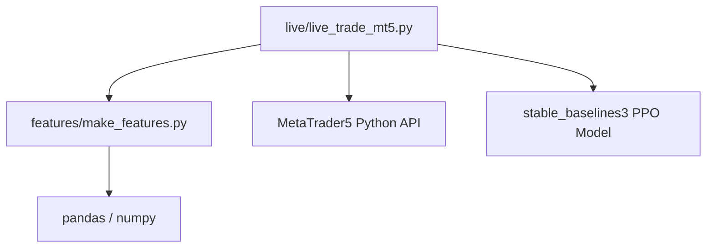
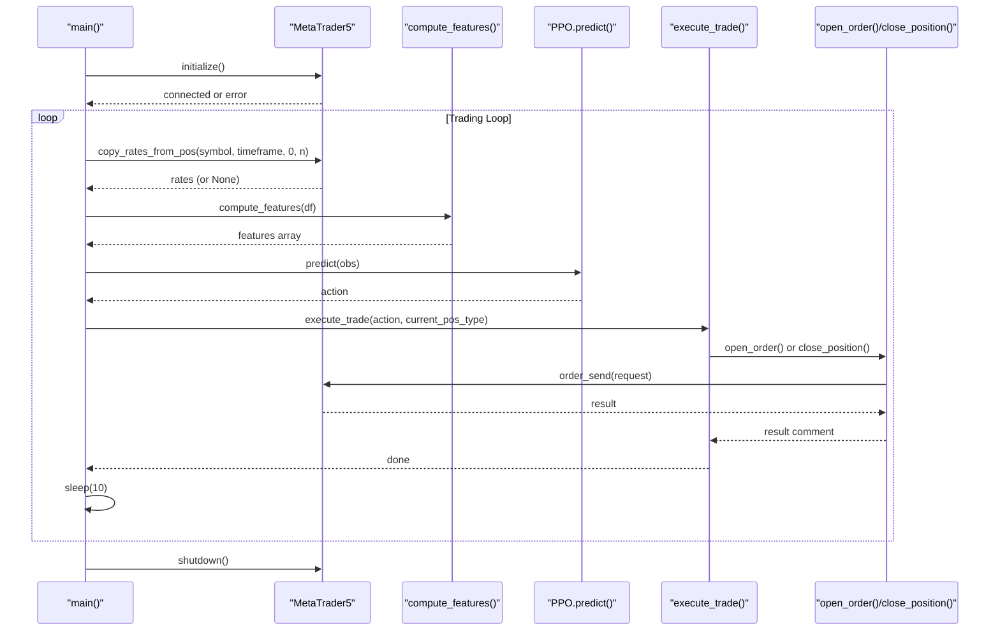
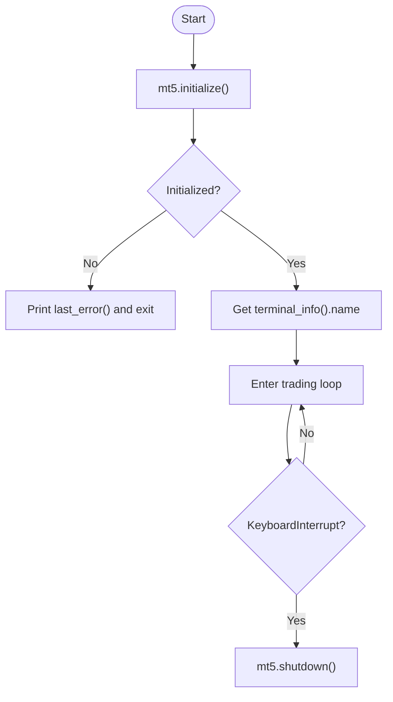
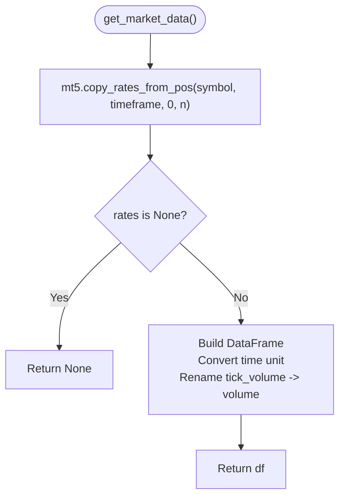
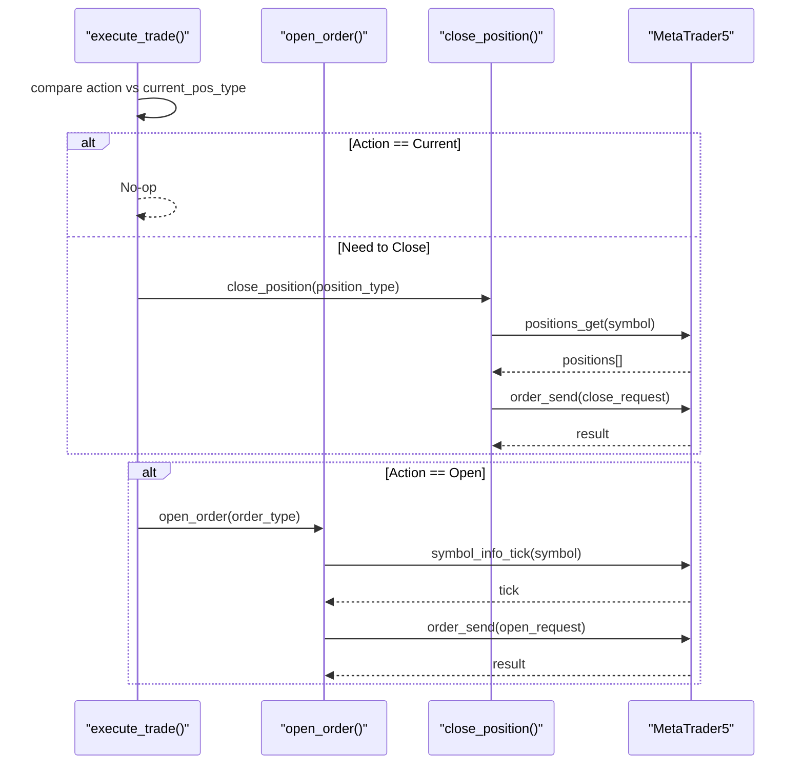
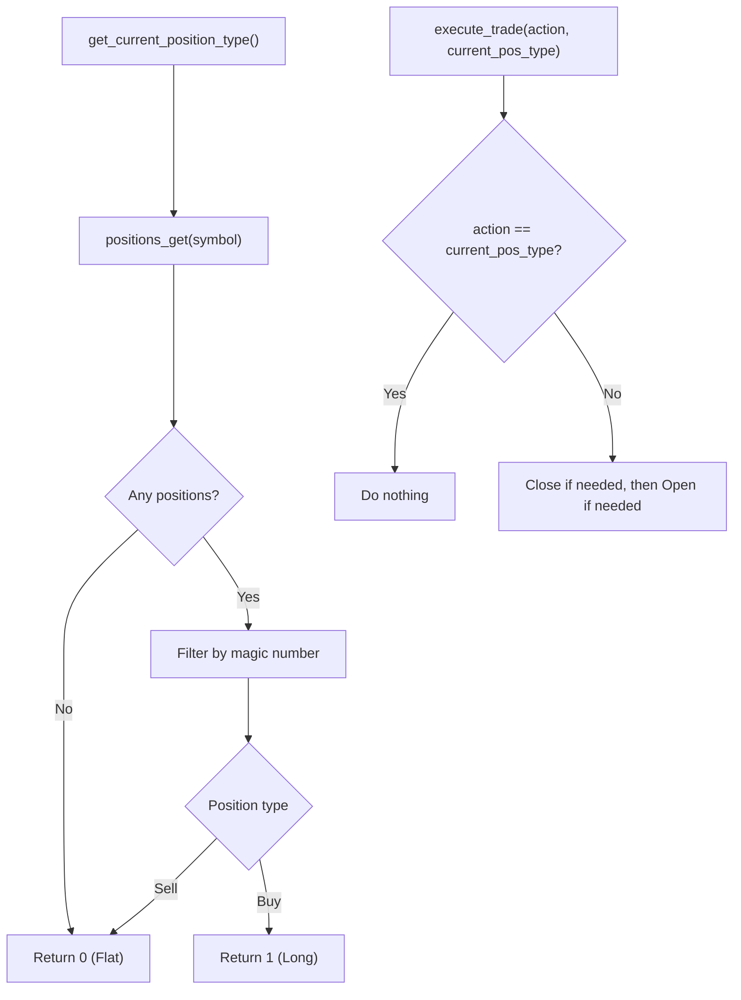
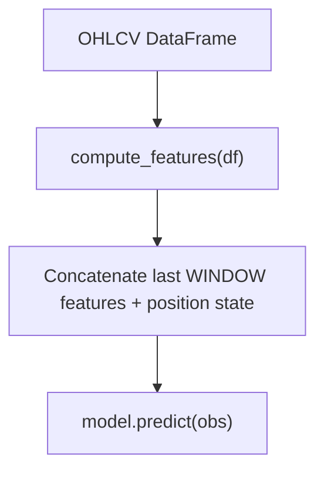
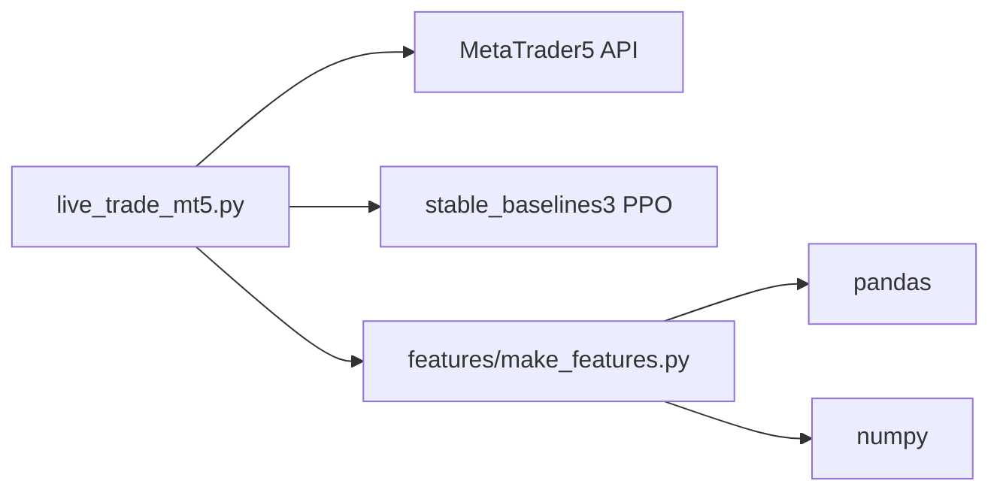

# MetaTrader 5 Integration

<cite>
**Referenced Files in This Document**
- [live_trade_mt5.py](file://live/live_trade_mt5.py)
- [make_features.py](file://features/make_features.py)
- [README.md](file://README.md)
</cite>

## Table of Contents
1. [Introduction](#introduction)
2. [Project Structure](#project-structure)
3. [Core Components](#core-components)
4. [Architecture Overview](#architecture-overview)
5. [Detailed Component Analysis](#detailed-component-analysis)
6. [Dependency Analysis](#dependency-analysis)
7. [Performance Considerations](#performance-considerations)
8. [Troubleshooting Guide](#troubleshooting-guide)
9. [Conclusion](#conclusion)

## Introduction
This document explains the MetaTrader 5 (MT5) integration used for live trading within the autonomous trading system. It covers MT5 initialization, connection management, market data retrieval, order execution, position management, configuration parameters, and error handling. The goal is to help you understand how the system connects to MT5, fetches real-time prices and historical candles, executes trades based on model signals, and manages positions with robust error handling.

## Project Structure
The MT5 integration lives under the live trading module and interacts with feature computation to prepare observations for the RL model. Key files:
- live/live_trade_mt5.py: MT5 client logic (initialization, data fetching, order execution, position tracking, main loop)
- features/make_features.py: Feature engineering used by the trading loop to build model observations
- README.md: Setup and usage notes including MT5 dependency and live trading instructions

**Diagram sources**
- [live_trade_mt5.py:1-174](file://live/live_trade_mt5.py#L1-L174)
- [make_features.py:1-83](file://features/make_features.py#L1-L83)

**Section sources**
- [live_trade_mt5.py:1-174](file://live/live_trade_mt5.py#L1-L174)
- [make_features.py:1-83](file://features/make_features.py#L1-L83)
- [README.md:250-449](file://README.md#L250-L449)

## Core Components
- MT5 Initialization and Connection Management
  - Initializes the MT5 terminal session and verifies connectivity.
  - Uses a simple shutdown on exit or interruption to release resources.
- Market Data Fetching
  - Retrieves recent OHLCV candles from MT5 for the configured symbol and timeframe.
  - Converts timestamps and normalizes column names for downstream processing.
- Order Execution System
  - Formats and sends buy/sell requests with deviation tolerance and magic number tagging.
  - Supports immediate fill orders using appropriate filling modes.
- Position Management
  - Detects current positions filtered by symbol and magic number.
  - Executes close operations for existing positions when switching states.
- Configuration Parameters
  - SYMBOL, TIMEFRAME, VOLUME, DEVIATION, MODEL_PATH, WINDOW define trading behavior and model inputs.

**Section sources**
- [live_trade_mt5.py:10-17](file://live/live_trade_mt5.py#L10-L17)
- [live_trade_mt5.py:21-30](file://live/live_trade_mt5.py#L21-L30)
- [live_trade_mt5.py:57-95](file://live/live_trade_mt5.py#L57-L95)
- [live_trade_mt5.py:97-109](file://live/live_trade_mt5.py#L97-L109)
- [live_trade_mt5.py:111-171](file://live/live_trade_mt5.py#L111-L171)

## Architecture Overview
The live trading loop orchestrates data acquisition, feature computation, model inference, and trade execution against MT5.

**Diagram sources**
- [live_trade_mt5.py:111-171](file://live/live_trade_mt5.py#L111-L171)
- [live_trade_mt5.py:21-30](file://live/live_trade_mt5.py#L21-L30)
- [live_trade_mt5.py:57-95](file://live/live_trade_mt5.py#L57-L95)
- [make_features.py:18-78](file://features/make_features.py#L18-L78)

## Detailed Component Analysis

### MT5 Initialization and Connection Management
- Initialization
  - Calls the MT5 library initialization and prints an error code if it fails.
  - On success, retrieves terminal info to confirm connection.
- Shutdown
  - Ensures proper cleanup on user interruption.

**Diagram sources**
- [live_trade_mt5.py:111-117](file://live/live_trade_mt5.py#L111-L117)
- [live_trade_mt5.py:168-171](file://live/live_trade_mt5.py#L168-L171)

**Section sources**
- [live_trade_mt5.py:111-117](file://live/live_trade_mt5.py#L111-L117)
- [live_trade_mt5.py:168-171](file://live/live_trade_mt5.py#L168-L171)

### Market Data Fetching
- Functionality
  - Retrieves recent candles using a positional copy function with the configured timeframe and count.
  - Converts timestamp units to datetime and renames tick_volume to volume for consistency.
- Error Handling
  - If no data is returned, the main loop retries after a delay.

**Diagram sources**
- [live_trade_mt5.py:21-30](file://live/live_trade_mt5.py#L21-L30)

**Section sources**
- [live_trade_mt5.py:21-30](file://live/live_trade_mt5.py#L21-L30)

### Order Execution System
- Open Order
  - Reads current tick price (ask for buys, bid for sells).
  - Builds a request with action type, symbol, volume, order type, price, deviation, magic number, comment, time-in-force, and filling mode.
  - Sends the order via the MT5 API and logs the result comment.
- Close Position
  - Retrieves open positions for the symbol.
  - For each matching position, constructs a closing request with opposite order type, position ticket, current price, deviation, magic number, and comment.
  - Sends the close request.

**Diagram sources**
- [live_trade_mt5.py:32-56](file://live/live_trade_mt5.py#L32-L56)
- [live_trade_mt5.py:57-95](file://live/live_trade_mt5.py#L57-L95)

**Section sources**
- [live_trade_mt5.py:32-56](file://live/live_trade_mt5.py#L32-L56)
- [live_trade_mt5.py:57-95](file://live/live_trade_mt5.py#L57-L95)

### Position Management
- Current Position Detection
  - Queries open positions for the symbol and filters by magic number.
  - Returns a simplified state: flat (0) or long (1), assuming single-position logic per magic number.
- Trade Decision Logic
  - If the model’s action differs from the current position, closes existing positions before opening new ones.
  - Prevents redundant actions when action equals current state.

**Diagram sources**
- [live_trade_mt5.py:97-109](file://live/live_trade_mt5.py#L97-L109)
- [live_trade_mt5.py:32-56](file://live/live_trade_mt5.py#L32-L56)

**Section sources**
- [live_trade_mt5.py:97-109](file://live/live_trade_mt5.py#L97-L109)
- [live_trade_mt5.py:32-56](file://live/live_trade_mt5.py#L32-L56)

### Configuration Parameters
- SYMBOL: Trading instrument (e.g., XAUUSD)
- TIMEFRAME: Chart interval for data retrieval (e.g., H1)
- VOLUME: Lot size for orders (minimum lot size considered)
- DEVIATION: Maximum allowed slippage in points for order execution
- MODEL_PATH: Path to the trained RL model file
- WINDOW: Number of recent feature steps used as observation input

These settings are defined at the top of the MT5 script and influence both data retrieval and order submission behavior.

**Section sources**
- [live_trade_mt5.py:10-17](file://live/live_trade_mt5.py#L10-L17)

### Feature Computation and Observation Construction
- Features
  - Computes technical indicators (returns, volatility, momentum, moving averages, RSI, MACD differences).
  - Optionally includes macro features if available; otherwise uses a fallback set.
  - Normalizes features and returns arrays suitable for model input.
- Observation
  - Concatenates flattened recent features with the current position state to form the RL observation.

**Diagram sources**
- [make_features.py:18-78](file://features/make_features.py#L18-L78)
- [live_trade_mt5.py:133-157](file://live/live_trade_mt5.py#L133-L157)

**Section sources**
- [make_features.py:18-78](file://features/make_features.py#L18-L78)
- [live_trade_mt5.py:133-157](file://live/live_trade_mt5.py#L133-L157)

## Dependency Analysis
- External Dependencies
  - MetaTrader5 Python API for direct platform connectivity
  - stable_baselines3 PPO model for policy inference
  - pandas/numpy for data manipulation and numerical operations
- Internal Coupling
  - The MT5 script depends on feature computation to produce observations
  - The main loop coordinates data fetching, feature computation, model prediction, and order execution

**Diagram sources**
- [live_trade_mt5.py:1-7](file://live/live_trade_mt5.py#L1-L7)
- [make_features.py:1-4](file://features/make_features.py#L1-L4)

**Section sources**
- [live_trade_mt5.py:1-7](file://live/live_trade_mt5.py#L1-L7)
- [make_features.py:1-4](file://features/make_features.py#L1-L4)

## Performance Considerations
- Data Retrieval Efficiency
  - Use a reasonable candle count to balance memory and latency; ensure enough history for feature windows.
- Sleep Interval
  - The loop sleeps between checks; adjust frequency based on timeframe and strategy needs.
- Filling Mode and Deviation
  - Immediate-fill orders may fail during high volatility; tune deviation to accommodate slippage without excessive rejections.
- Magic Number Filtering
  - Using a consistent magic number reduces overhead when scanning positions.

[No sources needed since this section provides general guidance]

## Troubleshooting Guide
Common issues and resolutions:
- Initialization Failure
  - Symptom: initialize() fails with an error code.
  - Resolution: Verify MT5 terminal is running and logged into the correct account; check last_error() output.
- Market Data Not Available
  - Symptom: get_market_data returns None.
  - Resolution: Ensure symbol exists and has sufficient history; retry after delay; verify timeframe compatibility.
- Order Rejection or Slippage
  - Symptom: order_send returns a failure comment.
  - Resolution: Increase DEVIATION; ensure VOLUME meets broker minimums; check ORDER_FILLING mode compatibility.
- Position Mismatch
  - Symptom: Closing/opening does not reflect expected state.
  - Resolution: Confirm magic number filtering; ensure only one position per magic number is active; verify position types.

**Section sources**
- [live_trade_mt5.py:111-117](file://live/live_trade_mt5.py#L111-L117)
- [live_trade_mt5.py:21-30](file://live/live_trade_mt5.py#L21-L30)
- [live_trade_mt5.py:57-95](file://live/live_trade_mt5.py#L57-L95)
- [live_trade_mt5.py:97-109](file://live/live_trade_mt5.py#L97-L109)

## Conclusion
The MT5 integration provides a straightforward yet robust pipeline for live trading: initialize the terminal, fetch market data, compute features, infer actions from the RL model, and execute orders with controlled deviation and magic number tagging. Position management ensures coherent state transitions between flat and long positions. Proper configuration and error handling are essential for reliable operation in live markets.

[No sources needed since this section summarizes without analyzing specific files]