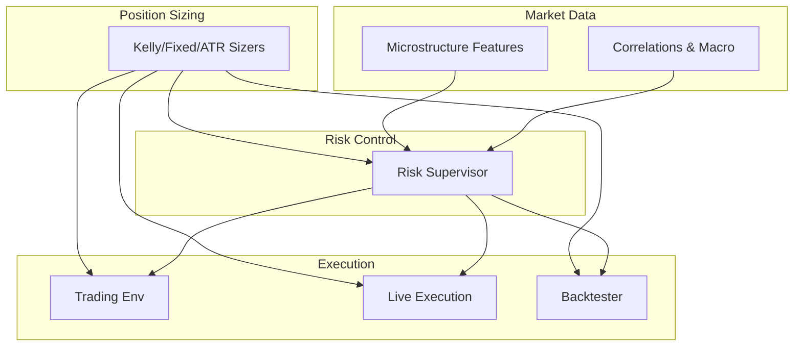
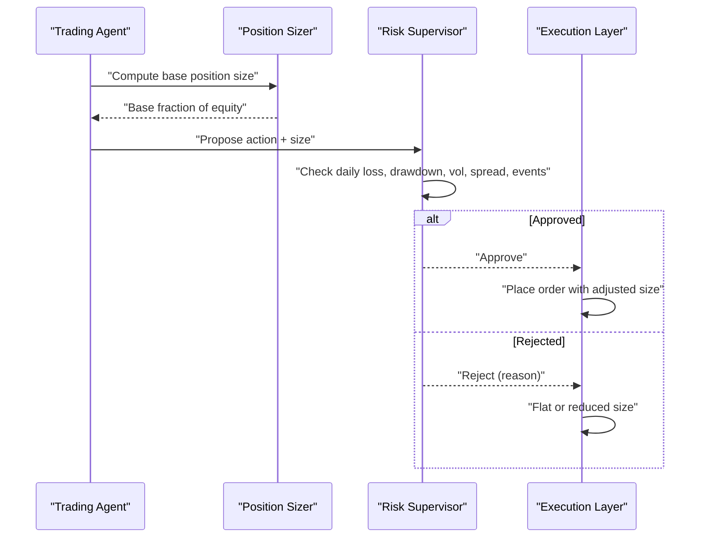
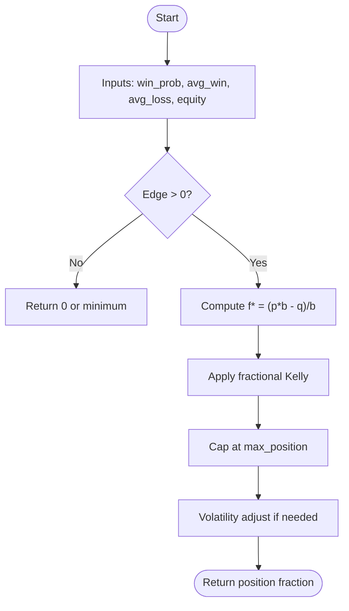
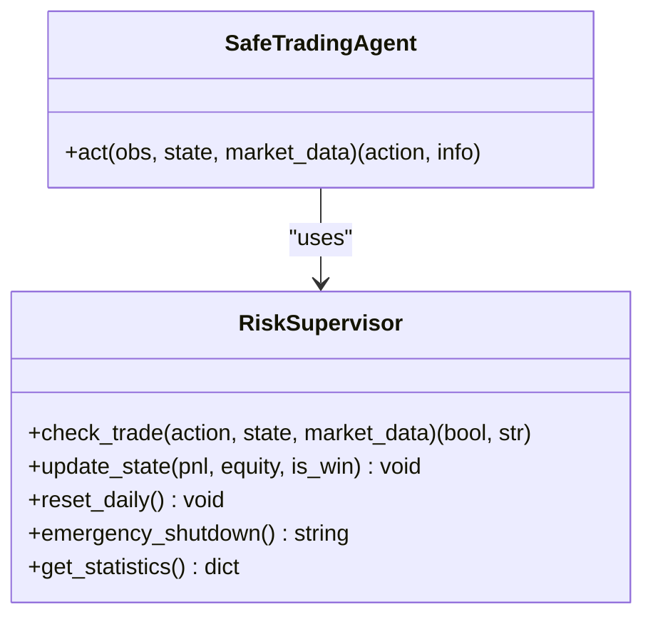
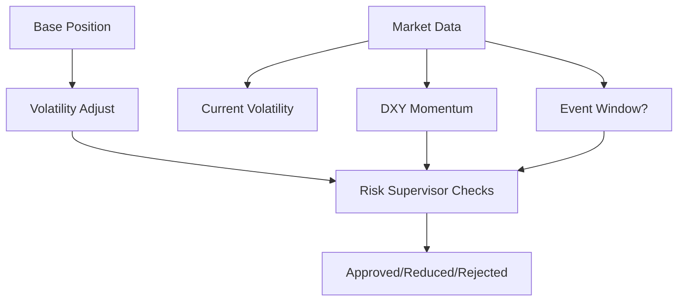
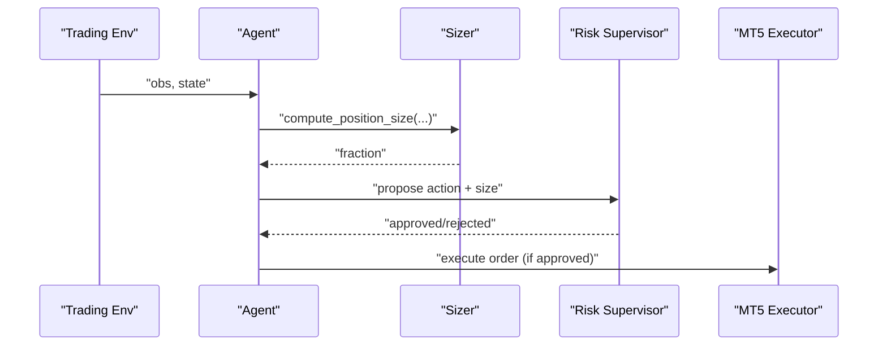
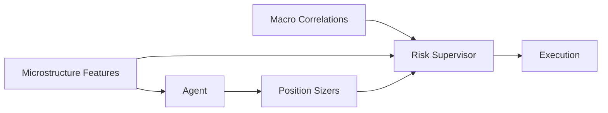

# Position Sizing Engine

<cite>
**Referenced Files in This Document**
- [position_sizing.py](file://models/position_sizing.py)
- [risk_supervisor.py](file://models/risk_supervisor.py)
- [backtest_engine.py](file://backtest/backtest_engine.py)
- [xauusd_env.py](file://env/xauusd_env.py)
- [live_trade_mt5.py](file://live/live_trade_mt5.py)
- [microstructure_features.py](file://features/microstructure_features.py)
- [fetch_correlations.py](file://data/fetch_correlations.py)
</cite>

## Table of Contents
1. Introduction
2. Project Structure
3. Core Components
4. Architecture Overview
5. Detailed Component Analysis
6. Dependency Analysis
7. Performance Considerations
8. Troubleshooting Guide
9. Conclusion
10. Appendices

## Introduction
This document explains the position sizing engine that determines optimal trade sizes based on multiple risk factors and integrates with market conditions, account equity, and individual trade risk assessment. It covers implemented algorithms (fixed fractional, Kelly criterion, volatility-adjusted sizing, ATR-based sizing), dynamic adjustment mechanisms, integration with a risk supervisor to enforce portfolio-level limits, mathematical formulations, parameter tuning guidelines, performance optimization techniques, and example calculations under different scenarios.

## Project Structure
The position sizing system is centered around modular components:
- Position sizing algorithms in models/position_sizing.py
- Risk supervision and safety overrides in models/risk_supervisor.py
- Backtesting framework for realistic evaluation in backtest/backtest_engine.py
- Trading environment and live execution hooks in env/xauusd_env.py and live/live_trade_mt5.py
- Market microstructure features used by agents and risk filters in features/microstructure_features.py
- Correlation data sources for macro context in data/fetch_correlations.py

**Diagram sources**
- [position_sizing.py:29-336](file://models/position_sizing.py#L29-L336)
- [risk_supervisor.py:18-174](file://models/risk_supervisor.py#L18-L174)
- [microstructure_features.py:170-225](file://features/microstructure_features.py#L170-L225)
- [fetch_correlations.py:5-54](file://data/fetch_correlations.py#L5-L54)
- [xauusd_env.py:7-118](file://env/xauusd_env.py#L7-L118)
- [live_trade_mt5.py:32-96](file://live/live_trade_mt5.py#L32-L96)
- [backtest_engine.py:24-146](file://backtest/backtest_engine.py#L24-L146)

**Section sources**
- [position_sizing.py:29-336](file://models/position_sizing.py#L29-L336)
- [risk_supervisor.py:18-174](file://models/risk_supervisor.py#L18-L174)
- [backtest_engine.py:24-146](file://backtest/backtest_engine.py#L24-L146)
- [xauusd_env.py:7-118](file://env/xauusd_env.py#L7-L118)
- [live_trade_mt5.py:32-96](file://live/live_trade_mt5.py#L32-L96)
- [microstructure_features.py:170-225](file://features/microstructure_features.py#L170-L225)
- [fetch_correlations.py:5-54](file://data/fetch_correlations.py#L5-L54)

## Core Components
- KellyPositionSizer: Implements Kelly criterion with fractional scaling, confidence-based sizing via agent value estimates, and volatility-adjusted sizing. Tracks win rate, average win/loss, and updates statistics from trade results.
- FixedFractionSizer: Simple constant-risk-per-trade approach.
- ATRPositionSizer: Size positions using Average True Range to normalize risk across volatility regimes.
- RiskSupervisor: Deterministic safety layer enforcing daily loss limits, drawdown caps, position size limits, volatility filters, correlation guards, event risk filters, overtrading prevention, spread filters, and market hours checks. Provides SafeTradingAgent wrapper to gate AI actions.

Key responsibilities:
- Compute base position sizes from strategy signals and risk parameters
- Adjust sizes dynamically for volatility and regime changes
- Enforce global risk constraints before execution

**Section sources**
- [position_sizing.py:29-336](file://models/position_sizing.py#L29-L336)
- [risk_supervisor.py:18-174](file://models/risk_supervisor.py#L18-L174)

## Architecture Overview
The engine composes sizing algorithms with a risk supervisor to produce safe, adaptive position sizes. The flow integrates market features and macro correlations to inform both sizing and risk checks.

**Diagram sources**
- [position_sizing.py:66-216](file://models/position_sizing.py#L66-L216)
- [risk_supervisor.py:91-174](file://models/risk_supervisor.py#L91-L174)
- [live_trade_mt5.py:32-96](file://live/live_trade_mt5.py#L32-L96)

## Detailed Component Analysis

### Kelly Criterion Position Sizing
- Mathematical formulation: f* = (p*b - q)/b where p is win probability, b is reward-to-risk ratio (avg_win/avg_loss), q = 1 - p. Fractional Kelly scales f* by a safety factor (e.g., 0.25).
- Dynamic sizing: Uses agent’s critic to estimate advantage and convert to a bounded win probability; combines with historical avg_win/avg_loss to compute Kelly size.
- Volatility adjustment: Divides base position by current_volatility / normal_volatility to keep dollar risk stable across regimes.
- Statistics update: Maintains rolling win rate, average win/loss from recent trades.

**Diagram sources**
- [position_sizing.py:66-111](file://models/position_sizing.py#L66-L111)
- [position_sizing.py:189-216](file://models/position_sizing.py#L189-L216)

**Section sources**
- [position_sizing.py:29-111](file://models/position_sizing.py#L29-L111)
- [position_sizing.py:113-187](file://models/position_sizing.py#L113-L187)
- [position_sizing.py:189-216](file://models/position_sizing.py#L189-L216)
- [position_sizing.py:218-262](file://models/position_sizing.py#L218-L262)

### Fixed Fraction Sizing
- Constant risk per trade regardless of signal strength or volatility.
- Useful baseline for robustness and simplicity.

**Section sources**
- [position_sizing.py:265-283](file://models/position_sizing.py#L265-L283)

### ATR-Based Position Sizing
- Computes stop distance as ATR * multiplier; derives position units from dollar risk and converts to equity fraction.
- Normalizes exposure across assets/timeframes with differing volatility.

**Section sources**
- [position_sizing.py:286-336](file://models/position_sizing.py#L286-L336)

### Risk Supervisor Integration
- Enforces hard constraints: daily loss limit, maximum drawdown, position size cap, consecutive losses, high volatility filter, correlation guard (e.g., DXY momentum), event risk reduction, overtrading prevention, spread filter, market hours.
- Provides SafeTradingAgent wrapper to approve/reject AI actions and override to flat when necessary.

**Diagram sources**
- [risk_supervisor.py:18-174](file://models/risk_supervisor.py#L18-L174)
- [risk_supervisor.py:289-339](file://models/risk_supervisor.py#L289-L339)

**Section sources**
- [risk_supervisor.py:18-174](file://models/risk_supervisor.py#L18-L174)
- [risk_supervisor.py:289-339](file://models/risk_supervisor.py#L289-L339)

### Dynamic Adjustment Mechanisms
- Real-time volatility: Use volatility_adjusted_sizing to scale positions inversely with current vs normal volatility.
- Correlation changes: RiskSupervisor uses DXY momentum to block long Gold entries when USD rallies strongly.
- Portfolio performance: Daily PnL and drawdown tracking trigger halts or reductions.
- Event risk: Reduce max position during high-impact news windows.

**Diagram sources**
- [position_sizing.py:189-216](file://models/position_sizing.py#L189-L216)
- [risk_supervisor.py:128-151](file://models/risk_supervisor.py#L128-L151)

**Section sources**
- [position_sizing.py:189-216](file://models/position_sizing.py#L189-L216)
- [risk_supervisor.py:128-151](file://models/risk_supervisor.py#L128-L151)

### Integration with Environment and Execution
- Environment: Discrete action space (flat/long) and equity tracking; rewards incorporate costs and turnover penalties.
- Live execution: Maps actions to orders with fixed lot sizes; can be extended to use computed position fractions.
- Backtesting: Realistic cost model (spread, slippage, commission) and walk-forward validation.

**Diagram sources**
- [xauusd_env.py:7-118](file://env/xauusd_env.py#L7-L118)
- [position_sizing.py:66-216](file://models/position_sizing.py#L66-L216)
- [risk_supervisor.py:91-174](file://models/risk_supervisor.py#L91-L174)
- [live_trade_mt5.py:32-96](file://live/live_trade_mt5.py#L32-L96)

**Section sources**
- [xauusd_env.py:7-118](file://env/xauusd_env.py#L7-L118)
- [live_trade_mt5.py:32-96](file://live/live_trade_mt5.py#L32-L96)
- [backtest_engine.py:24-146](file://backtest/backtest_engine.py#L24-L146)

## Dependency Analysis
- Position sizers depend on market inputs (volatility, price, ATR) and agent-derived probabilities.
- Risk supervisor depends on market data fields (volatility, spread, DXY momentum, event flags) and portfolio state (equity, daily PnL, drawdown).
- Microstructure features provide liquidity/session proxies used by agents and potentially risk filters.
- Correlation data supports macro-aware decisions (e.g., DXY momentum).

**Diagram sources**
- [microstructure_features.py:170-225](file://features/microstructure_features.py#L170-L225)
- [fetch_correlations.py:5-54](file://data/fetch_correlations.py#L5-L54)
- [position_sizing.py:66-216](file://models/position_sizing.py#L66-L216)
- [risk_supervisor.py:91-174](file://models/risk_supervisor.py#L91-L174)

**Section sources**
- [microstructure_features.py:170-225](file://features/microstructure_features.py#L170-L225)
- [fetch_correlations.py:5-54](file://data/fetch_correlations.py#L5-L54)
- [position_sizing.py:66-216](file://models/position_sizing.py#L66-L216)
- [risk_supervisor.py:91-174](file://models/risk_supervisor.py#L91-L174)

## Performance Considerations
- Computational efficiency:
  - Keep Kelly computation vectorized where possible; avoid unnecessary tensor conversions.
  - Cache normal volatility and rolling statistics to reduce recomputation.
- Risk control overhead:
  - Batch risk checks; short-circuit on early failures (daily loss, halt).
- Backtesting realism:
  - Include spread, slippage, and commission to avoid optimistic sizing.
- Latency-sensitive live trading:
  - Precompute features and maintain lightweight sizers; defer heavy computations off critical path.

[No sources needed since this section provides general guidance]

## Troubleshooting Guide
Common issues and resolutions:
- Negative or zero Kelly: Indicates no edge; ensure accurate win_prob and R:R estimates; consider reducing kelly_fraction or switching to fixed fraction temporarily.
- Excessive volatility: Use volatility_adjusted_sizing to shrink positions; verify normal_volatility baseline is representative.
- Wide spreads: RiskSupervisor will reject trades; wait for tighter spreads or reduce frequency.
- High-impact events: Expect reduced position sizes or halts; plan around economic calendar.
- Drawdown breaches: RiskSupervisor may halt; review strategy stability and reduce risk parameters.

**Section sources**
- [position_sizing.py:85-111](file://models/position_sizing.py#L85-L111)
- [position_sizing.py:189-216](file://models/position_sizing.py#L189-L216)
- [risk_supervisor.py:104-174](file://models/risk_supervisor.py#L104-L174)

## Conclusion
The position sizing engine combines mathematically grounded sizing methods (Kelly, fixed fraction, ATR) with dynamic adjustments for volatility and correlations, all gated by a deterministic risk supervisor. This architecture ensures robust, adaptive sizing while protecting against tail risks and extreme market conditions. Proper parameter tuning and realistic backtesting are essential to achieve sustainable performance.

[No sources needed since this section summarizes without analyzing specific files]

## Appendices

### Mathematical Formulations
- Kelly criterion: f* = (p*b - q)/b; fractional Kelly: f = alpha * f* (alpha typically 0.25–0.5).
- Volatility-adjusted sizing: size_adj = size_base / (current_vol / normal_vol).
- ATR sizing: position_units = (equity * risk%) / (ATR * multiplier); position_fraction = (position_units * price) / equity.

[No sources needed since this section provides conceptual formulas]

### Parameter Tuning Guidelines
- Kelly:
  - Start with quarter or half Kelly; increase only after robust out-of-sample validation.
  - Regularly update win_rate, avg_win, avg_loss with rolling windows; avoid overfitting to small samples.
- ATR:
  - Choose atr_multiplier based on typical stop distances; calibrate to desired risk per trade.
- Risk Supervisor:
  - Set max_daily_loss conservatively (e.g., 1–2%); tune max_drawdown to your risk tolerance.
  - Adjust vol_threshold and max_spread to instrument characteristics.
  - Limit max_trades_per_day and min_trade_interval to prevent churn.

[No sources needed since this section provides general guidance]

### Example Calculations Under Different Scenarios
- Strong edge: Higher win_prob and favorable R:R yield larger Kelly-based positions; still capped by max_position and volatility scaling.
- Weak edge: Lower win_prob or poor R:R reduces Kelly output; may result in minimal or zero position.
- High volatility: Volatility adjustment shrinks position to maintain constant dollar risk.
- News events: RiskSupervisor enforces reduced max position or halts new entries.

[No sources needed since this section provides conceptual examples]