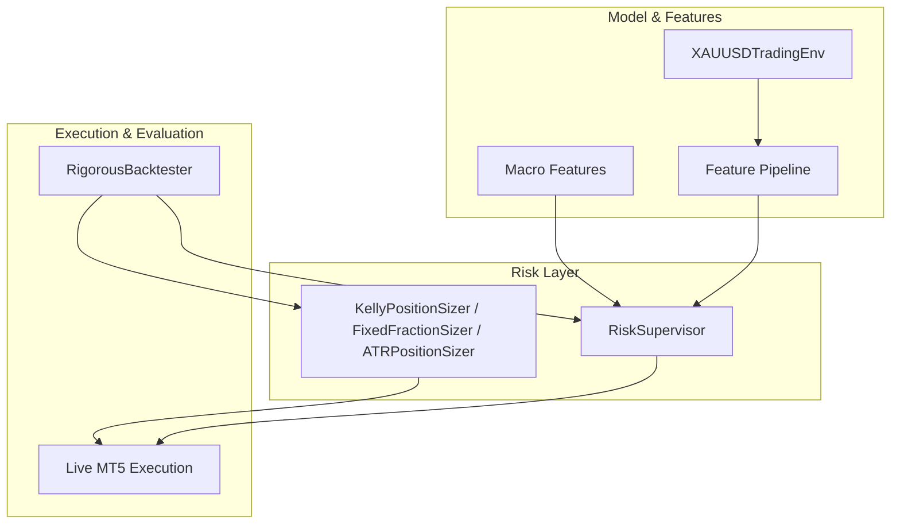
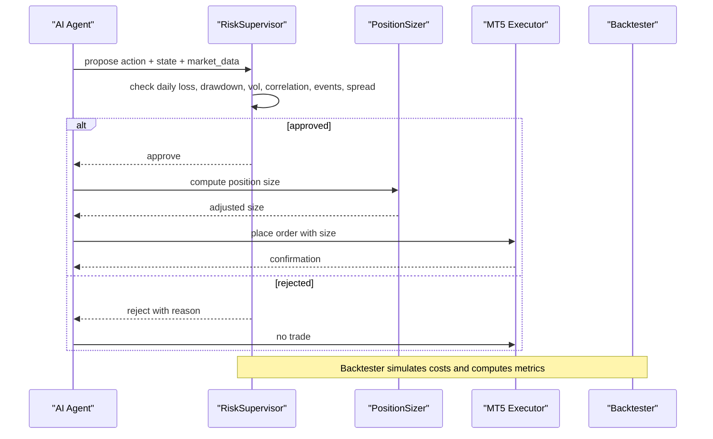
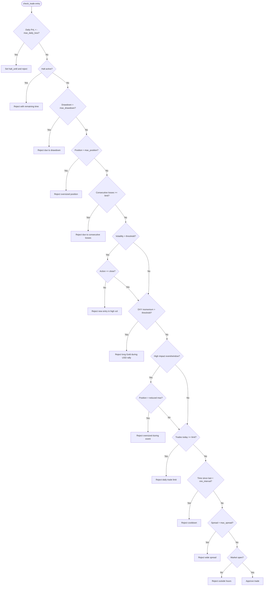
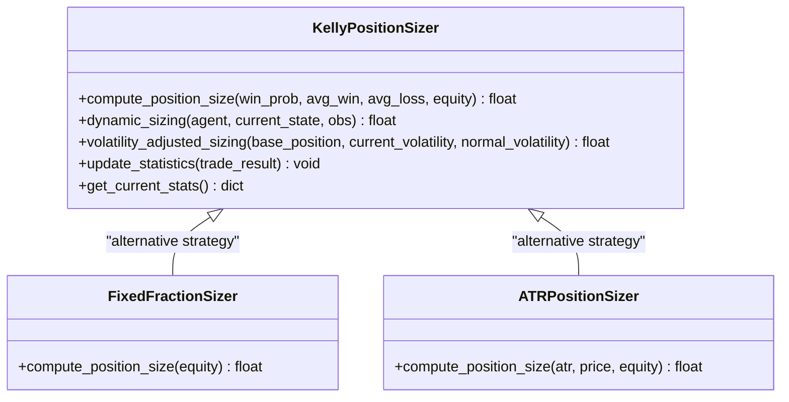
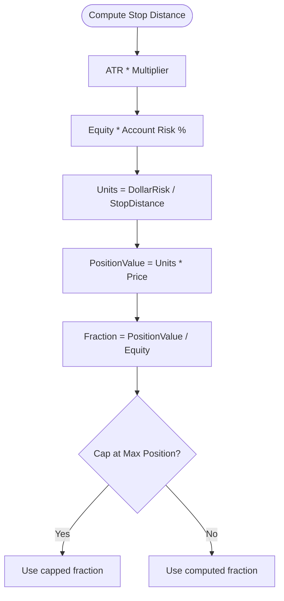
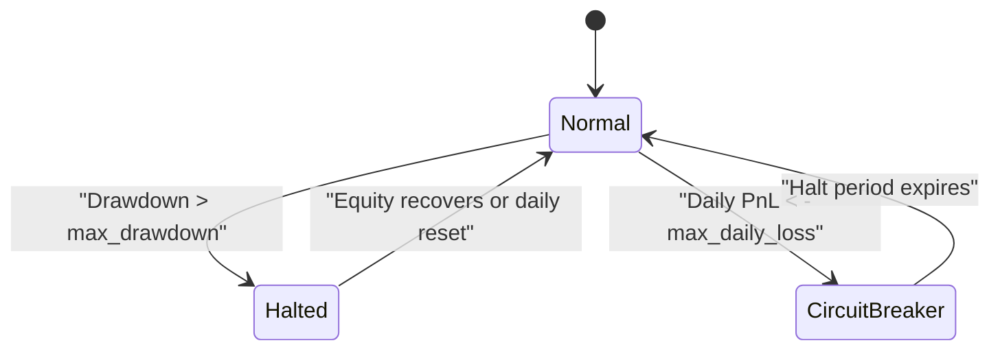
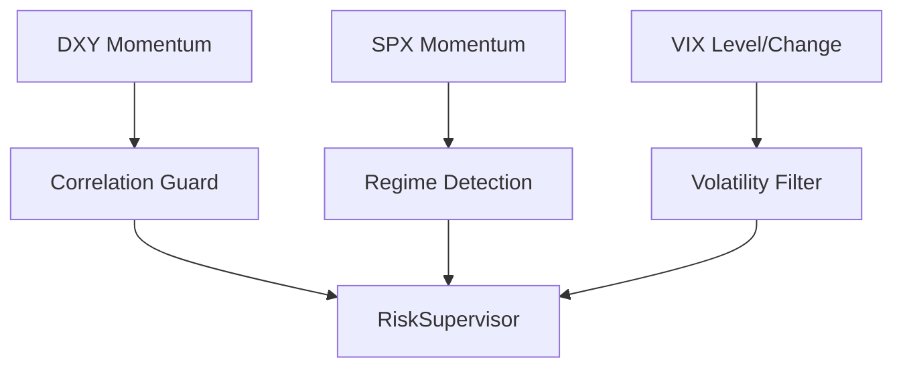
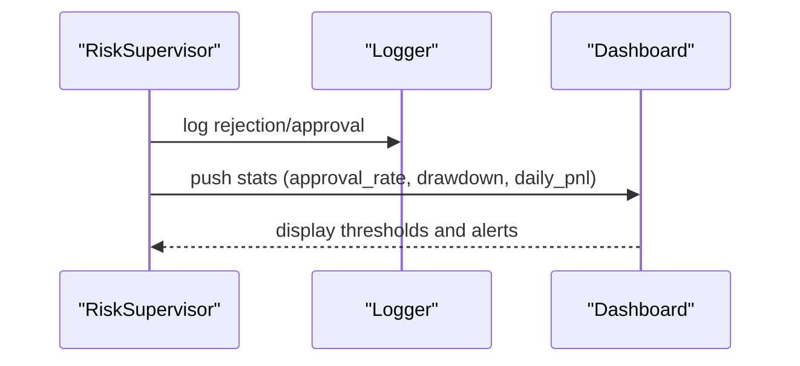
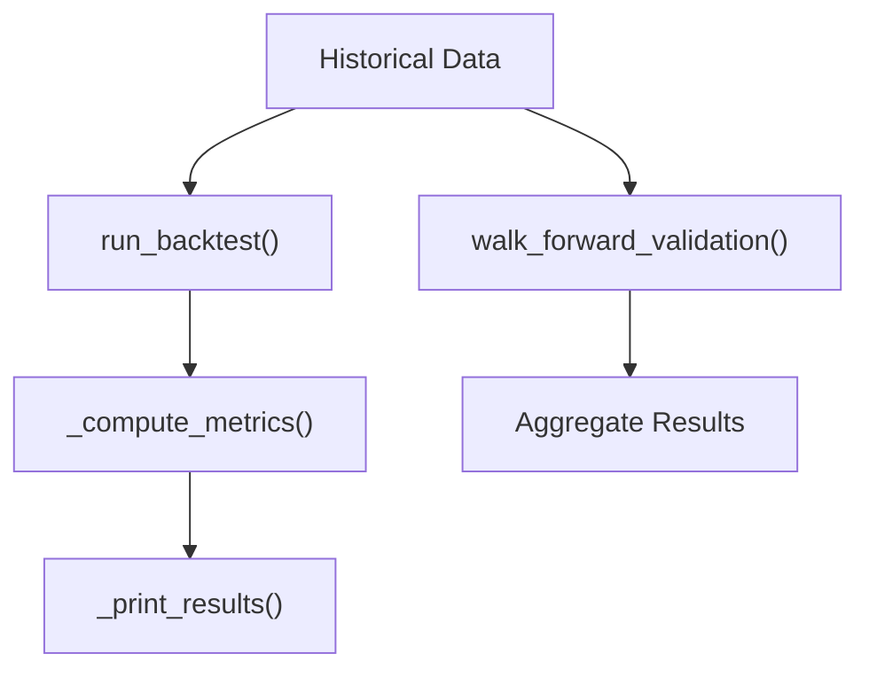
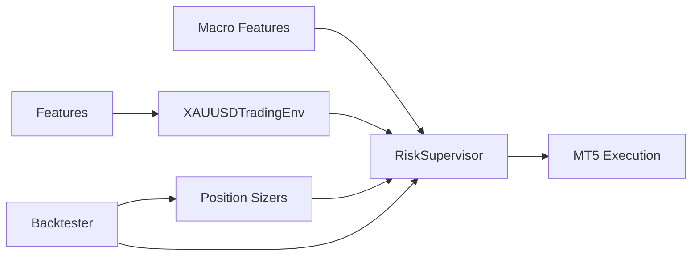

# Risk Management System

<cite>
**Referenced Files in This Document**
- [risk_supervisor.py](file://models/risk_supervisor.py)
- [position_sizing.py](file://models/position_sizing.py)
- [backtest_engine.py](file://backtest/backtest_engine.py)
- [xauusd_env.py](file://env/xauusd_env.py)
- [live_trade_mt5.py](file://live/live_trade_mt5.py)
- [macro_features.py](file://features/macro_features.py)
- [make_features.py](file://features/make_features.py)
- [README.md](file://README.md)
</cite>

## Table of Contents
1. [Introduction](#introduction)
2. [Project Structure](#project-structure)
3. [Core Components](#core-components)
4. [Architecture Overview](#architecture-overview)
5. [Detailed Component Analysis](#detailed-component-analysis)
6. [Dependency Analysis](#dependency-analysis)
7. [Performance Considerations](#performance-considerations)
8. [Troubleshooting Guide](#troubleshooting-guide)
9. [Conclusion](#conclusion)
10. [Appendices](#appendices)

## Introduction
This document explains the risk supervision system that enforces comprehensive risk controls for live trading operations. It covers dynamic position sizing, stop-loss placement mechanisms, drawdown protection, portfolio-level risk controls (correlation monitoring, sector exposure limits, and concentration rules), real-time monitoring and alerting, configuration examples for different risk tolerances, and backtesting results to validate effectiveness. The system is designed as a deterministic safety layer that can override AI decisions to prevent catastrophic losses during live trading.

## Project Structure
The risk management system spans several modules:
- Deterministic risk supervisor that gates trades based on daily loss limits, drawdown, volatility, correlation guards, event risk filters, spread filters, and overtrading prevention.
- Position sizing algorithms using Kelly Criterion, fixed fraction, and ATR-based methods with volatility adjustments.
- Backtesting framework with realistic costs, slippage, walk-forward validation, and comprehensive metrics.
- Trading environment and live execution integration via MetaTrader 5.
- Macro feature computation for correlation and regime detection used by risk controls.

**Diagram sources**
- [risk_supervisor.py:18-174](file://models/risk_supervisor.py#L18-L174)
- [position_sizing.py:29-111](file://models/position_sizing.py#L29-L111)
- [xauusd_env.py:7-118](file://env/xauusd_env.py#L7-L118)
- [macro_features.py:363-445](file://features/macro_features.py#L363-L445)
- [backtest_engine.py:24-146](file://backtest/backtest_engine.py#L24-L146)
- [live_trade_mt5.py:111-174](file://live/live_trade_mt5.py#L111-L174)

**Section sources**
- [risk_supervisor.py:18-174](file://models/risk_supervisor.py#L18-L174)
- [position_sizing.py:29-111](file://models/position_sizing.py#L29-L111)
- [backtest_engine.py:24-146](file://backtest/backtest_engine.py#L24-L146)
- [xauusd_env.py:7-118](file://env/xauusd_env.py#L7-L118)
- [macro_features.py:363-445](file://features/macro_features.py#L363-L445)
- [live_trade_mt5.py:111-174](file://live/live_trade_mt5.py#L111-L174)
- [README.md:149-155](file://README.md#L149-L155)

## Core Components
- Risk Supervisor: Hard-coded safety checks including daily loss limit, maximum drawdown, position size caps, volatility filter, correlation guard, event risk reduction, max trades per day, minimum time between trades, spread filter, and market hours check. Provides statistics and emergency shutdown.
- Position Sizing: Dynamic sizing via Kelly Criterion with fractional Kelly, volatility-adjusted sizing, and alternative methods (fixed fraction, ATR-based). Updates win rate and average win/loss from trade history.
- Backtesting: Rigorous backtester with conservative cost assumptions, equity curve tracking, metrics computation (Sharpe, Sortino, Calmar, max drawdown), and walk-forward validation.
- Environment: Discrete long-only trading environment with reward shaping including turnover penalties and stability bonuses.
- Live Execution: MT5 integration loop fetching data, computing features, predicting actions, and executing orders.
- Macro Features: Correlation and momentum features across macro assets used for regime detection and correlation guards.

**Section sources**
- [risk_supervisor.py:18-174](file://models/risk_supervisor.py#L18-L174)
- [position_sizing.py:29-111](file://models/position_sizing.py#L29-L111)
- [backtest_engine.py:24-146](file://backtest/backtest_engine.py#L24-L146)
- [xauusd_env.py:7-118](file://env/xauusd_env.py#L7-L118)
- [macro_features.py:363-445](file://features/macro_features.py#L363-L445)
- [live_trade_mt5.py:111-174](file://live/live_trade_mt5.py#L111-L174)

## Architecture Overview
The architecture layers AI decision-making with deterministic risk controls before execution. The Risk Supervisor evaluates proposed actions against multiple safety constraints and can reject or halt trading. Position sizing adjusts trade sizes based on account equity, volatility, and historical performance. The backtester validates strategies under realistic conditions.

**Diagram sources**
- [risk_supervisor.py:91-174](file://models/risk_supervisor.py#L91-L174)
- [position_sizing.py:66-111](file://models/position_sizing.py#L66-L111)
- [live_trade_mt5.py:111-174](file://live/live_trade_mt5.py#L111-L174)
- [backtest_engine.py:73-146](file://backtest/backtest_engine.py#L73-L146)

## Detailed Component Analysis

### Risk Supervisor
- Daily Loss Limit: Halts trading when daily PnL falls below threshold; sets a temporary halt period.
- Maximum Drawdown Protection: Stops new entries if peak-to-current equity drawdown exceeds configured limit.
- Position Size Limit: Caps position size relative to equity.
- Consecutive Losses Protection: Reduces activity after a streak of losses.
- Volatility Filter: Prevents new entries during high volatility; allows exits only.
- Correlation Guard: Uses DXY momentum to avoid long Gold positions when USD rallies strongly.
- Event Risk Filter: Reduces maximum position size during high-impact news windows.
- Overtrading Prevention: Limits number of trades per day and enforces cooldown between trades.
- Spread Filter: Avoids trading when spreads are too wide.
- Market Hours Check: Optional gating outside market hours.
- Emergency Shutdown: Immediate halt requiring manual restart.

**Diagram sources**
- [risk_supervisor.py:91-174](file://models/risk_supervisor.py#L91-L174)

**Section sources**
- [risk_supervisor.py:18-174](file://models/risk_supervisor.py#L18-L174)

### Dynamic Position Sizing Algorithms
- Kelly Criterion: Computes optimal fraction based on win probability and risk/reward ratio; uses fractional Kelly for safety; caps at maximum position.
- Volatility-Adjusted Sizing: Scales base position inversely with current vs normal volatility to maintain constant dollar risk.
- Alternative Methods: Fixed fraction (constant risk per trade) and ATR-based sizing (account risk divided by stop distance derived from ATR).

**Diagram sources**
- [position_sizing.py:29-111](file://models/position_sizing.py#L29-L111)
- [position_sizing.py:265-335](file://models/position_sizing.py#L265-L335)

**Section sources**
- [position_sizing.py:29-111](file://models/position_sizing.py#L29-L111)
- [position_sizing.py:265-335](file://models/position_sizing.py#L265-L335)

### Stop-Loss Placement Mechanisms
- ATR-Based Stops: Stop distance computed as ATR multiplied by a multiplier; position sizing ensures consistent dollar risk per trade.
- Technical Analysis Integration: Features such as volatility, momentum, and moving averages inform stop placement indirectly through sizing and risk filters.
- Event-Adjusted Stops: During high-impact events, maximum position size is reduced, effectively tightening risk exposure.

**Diagram sources**
- [position_sizing.py:286-335](file://models/position_sizing.py#L286-L335)

**Section sources**
- [position_sizing.py:286-335](file://models/position_sizing.py#L286-L335)

### Drawdown Protection Systems
- Peak Equity Tracking: Monitors current equity versus peak equity to compute drawdown.
- Threshold Enforcement: When drawdown exceeds configured limit, new trades are rejected until recovery or reset.
- Daily Reset: Resets daily counters and clears short-term halts at midnight UTC.

**Diagram sources**
- [risk_supervisor.py:114-117](file://models/risk_supervisor.py#L114-L117)
- [risk_supervisor.py:176-229](file://models/risk_supervisor.py#L176-L229)

**Section sources**
- [risk_supervisor.py:114-117](file://models/risk_supervisor.py#L114-L117)
- [risk_supervisor.py:176-229](file://models/risk_supervisor.py#L176-L229)

### Portfolio-Level Risk Controls
- Correlation Monitoring: Uses rolling correlations and momentum from macro assets (e.g., DXY, SPX, US10Y) to detect regime shifts and adjust risk.
- Sector Exposure Limits: While the system focuses on XAUUSD, macro features provide cross-asset context; future extensions can enforce sector caps.
- Concentration Rules: Maximum position size and daily trade limits prevent overexposure to a single asset or excessive churn.

**Diagram sources**
- [macro_features.py:135-160](file://features/macro_features.py#L135-L160)
- [macro_features.py:219-242](file://features/macro_features.py#L219-L242)
- [risk_supervisor.py:136-151](file://models/risk_supervisor.py#L136-L151)

**Section sources**
- [macro_features.py:135-160](file://features/macro_features.py#L135-L160)
- [macro_features.py:219-242](file://features/macro_features.py#L219-L242)
- [risk_supervisor.py:136-151](file://models/risk_supervisor.py#L136-L151)

### Real-Time Risk Monitoring Dashboard and Alerting
- Logging and Warnings: The Risk Supervisor logs approvals, rejections, consecutive losses, and drawdown warnings.
- Statistics: Tracks approval/rejection rates, reasons, equity, daily PnL, and trade counts for dashboards.
- Alerts: Can be extended to emit alerts via external systems based on logged events and thresholds.

**Diagram sources**
- [risk_supervisor.py:243-285](file://models/risk_supervisor.py#L243-L285)

**Section sources**
- [risk_supervisor.py:243-285](file://models/risk_supervisor.py#L243-L285)

### Configuration Examples for Different Risk Tolerances
- Conservative: Lower max daily loss, tighter drawdown limit, lower max position, stricter volatility and spread thresholds, fewer max trades per day.
- Balanced: Moderate thresholds suitable for typical intraday trading.
- Aggressive: Higher thresholds allowing more frequent trading and larger positions, but with strict drawdown and event risk controls.

Example parameters (refer to default config):
- max_daily_loss: 0.01–0.03
- max_drawdown: 0.10–0.20
- max_position: 0.05–0.15
- vol_threshold: 2.0–4.0
- max_spread: 0.0003–0.0007
- max_trades_per_day: 10–30
- min_trade_interval: 120–600 seconds
- max_consecutive_losses: 3–7

**Section sources**
- [risk_supervisor.py:43-89](file://models/risk_supervisor.py#L43-L89)
- [README.md:561-575](file://README.md#L561-L575)

### Backtesting Results Showing Risk Control Effectiveness
- Metrics Computed: Total return, annualized return, max drawdown, Sharpe ratio, Sortino ratio, Calmar ratio, win rate, average win/loss, profit factor, average duration, total costs.
- Walk-Forward Validation: Repeatedly trains and tests on rolling windows to assess robustness.
- Cost Assumptions: Conservative spread, slippage, and commission to reflect realistic trading conditions.

**Diagram sources**
- [backtest_engine.py:73-146](file://backtest/backtest_engine.py#L73-L146)
- [backtest_engine.py:219-391](file://backtest/backtest_engine.py#L219-L391)

**Section sources**
- [backtest_engine.py:73-146](file://backtest/backtest_engine.py#L73-L146)
- [backtest_engine.py:219-391](file://backtest/backtest_engine.py#L219-L391)

## Dependency Analysis
- Risk Supervisor depends on market data inputs (volatility, spread, DXY momentum, event flags) and updates state based on PnL and equity.
- Position Sizers depend on agent outputs or historical statistics and adjust sizes based on volatility and ATR.
- Backtester depends on agent behavior and historical data to simulate trades and compute metrics.
- Environment provides observations and rewards used for training and evaluation.
- Macro features supply correlation and regime signals used by risk controls.

**Diagram sources**
- [macro_features.py:363-445](file://features/macro_features.py#L363-L445)
- [xauusd_env.py:7-118](file://env/xauusd_env.py#L7-L118)
- [risk_supervisor.py:91-174](file://models/risk_supervisor.py#L91-L174)
- [position_sizing.py:66-111](file://models/position_sizing.py#L66-L111)
- [backtest_engine.py:73-146](file://backtest/backtest_engine.py#L73-L146)

**Section sources**
- [macro_features.py:363-445](file://features/macro_features.py#L363-L445)
- [xauusd_env.py:7-118](file://env/xauusd_env.py#L7-L118)
- [risk_supervisor.py:91-174](file://models/risk_supervisor.py#L91-L174)
- [position_sizing.py:66-111](file://models/position_sizing.py#L66-L111)
- [backtest_engine.py:73-146](file://backtest/backtest_engine.py#L73-L146)

## Performance Considerations
- Use fractional Kelly to reduce drawdown risk while maintaining growth potential.
- Apply volatility scaling to keep dollar risk consistent across regimes.
- Enforce tight spread and event risk filters to avoid adverse selection during illiquid or volatile periods.
- Monitor drawdown closely and adjust thresholds based on live performance.
- Validate with walk-forward backtests to ensure robustness across market conditions.

[No sources needed since this section provides general guidance]

## Troubleshooting Guide
- Frequent Rejections: Check volatility, spread, and event flags; adjust thresholds if overly restrictive.
- Halts Triggered: Review daily PnL and drawdown; ensure resets occur at midnight UTC.
- Low Approval Rate: Investigate rejection reasons via statistics; tune position sizing and risk parameters.
- Execution Issues: Verify MT5 connection, symbol availability, and order parameters.

**Section sources**
- [risk_supervisor.py:243-285](file://models/risk_supervisor.py#L243-L285)
- [live_trade_mt5.py:111-174](file://live/live_trade_mt5.py#L111-L174)

## Conclusion
The risk supervision system provides a robust, deterministic safety layer that complements AI-driven trading decisions. Through dynamic position sizing, stop-loss mechanisms, drawdown protection, correlation monitoring, and real-time monitoring, it mitigates risks and enhances resilience in live trading. Backtesting with realistic assumptions helps validate effectiveness and guides parameter tuning for different risk tolerances.

[No sources needed since this section summarizes without analyzing specific files]

## Appendices
- Feature Pipeline: Includes technical indicators and macro features used for observation construction and risk control inputs.
- Live Execution Loop: Fetches market data, computes features, predicts actions, and executes orders via MT5.

**Section sources**
- [make_features.py:18-78](file://features/make_features.py#L18-L78)
- [live_trade_mt5.py:111-174](file://live/live_trade_mt5.py#L111-L174)