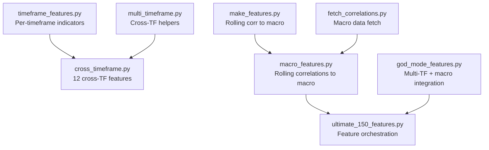
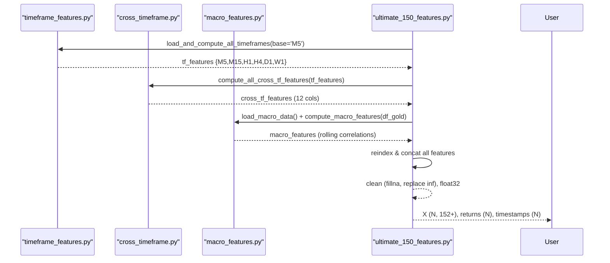
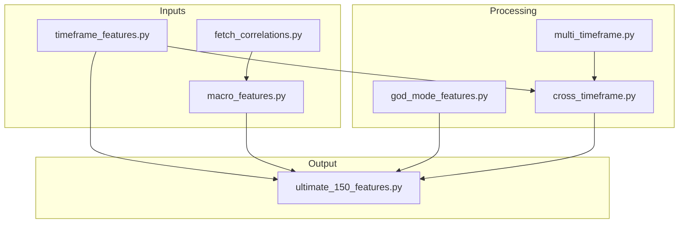

# Cross-Timeframe Correlations

<cite>
**Referenced Files in This Document**
- [cross_timeframe.py](file://features/cross_timeframe.py)
- [multi_timeframe.py](file://features/multi_timeframe.py)
- [timeframe_features.py](file://features/timeframe_features.py)
- [macro_features.py](file://features/macro_features.py)
- [god_mode_features.py](file://features/god_mode_features.py)
- [ultimate_150_features.py](file://features/ultimate_150_features.py)
- [make_features.py](file://features/make_features.py)
- [fetch_correlations.py](file://data/fetch_correlations.py)
</cite>

## Table of Contents
1. [Introduction](#introduction)
2. [Project Structure](#project-structure)
3. [Core Components](#core-components)
4. [Architecture Overview](#architecture-overview)
5. [Detailed Component Analysis](#detailed-component-analysis)
6. [Dependency Analysis](#dependency-analysis)
7. [Performance Considerations](#performance-considerations)
8. [Troubleshooting Guide](#troubleshooting-guide)
9. [Conclusion](#conclusion)
10. [Appendices](#appendices)

## Introduction
This document explains the cross-timeframe correlation engine that captures relationships across market periods to identify regime changes, validate trend strength, and generate multi-timeframe confirmation signals. It details how the system computes:
- Correlation coefficients between timeframes and macro series using rolling windows
- Momentum divergence and cascade effects across M5, M15, H1, H4, D1, and W1
- Trend consistency metrics via moving average crossovers and alignment scores
- Volatility regime detection through short-term vs long-term volatility ratios and spike/compression flags

The engine produces 12 cross-timeframe features grouped into four categories:
- Trend Alignment (3): overall agreement, strength cascade, divergence
- Momentum Cascade (3): higher-to-lower momentum interactions
- Volatility Regime (3): current vs long-term volatility, spikes, compression
- Pattern Confluence (3): support/resistance confluence and breakout alignment

It also integrates macro correlations (DXY, SPX, US10Y, etc.) computed with rolling windows to enrich regime detection and signal validation.

## Project Structure
The cross-timeframe engine is implemented across several modules:
- Timeframe feature computation per timeframe (M5–W1)
- Cross-timeframe aggregation and feature generation
- Macro correlation computation and integration
- Orchestration that combines all features into a unified dataset

**Diagram sources**
- [timeframe_features.py:22-99](file://features/timeframe_features.py#L22-L99)
- [cross_timeframe.py:21-249](file://features/cross_timeframe.py#L21-L249)
- [macro_features.py:114-132](file://features/macro_features.py#L114-L132)
- [ultimate_150_features.py:27-154](file://features/ultimate_150_features.py#L27-L154)
- [multi_timeframe.py:32-186](file://features/multi_timeframe.py#L32-L186)
- [god_mode_features.py:134-191](file://features/god_mode_features.py#L134-L191)
- [make_features.py:41-58](file://features/make_features.py#L41-L58)
- [fetch_correlations.py:5-54](file://data/fetch_correlations.py#L5-L54)

**Section sources**
- [timeframe_features.py:22-99](file://features/timeframe_features.py#L22-L99)
- [cross_timeframe.py:21-249](file://features/cross_timeframe.py#L21-L249)
- [macro_features.py:114-132](file://features/macro_features.py#L114-L132)
- [ultimate_150_features.py:27-154](file://features/ultimate_150_features.py#L27-L154)
- [multi_timeframe.py:32-186](file://features/multi_timeframe.py#L32-L186)
- [god_mode_features.py:134-191](file://features/god_mode_features.py#L134-L191)
- [make_features.py:41-58](file://features/make_features.py#L41-L58)
- [fetch_correlations.py:5-54](file://data/fetch_correlations.py#L5-L54)

## Core Components
- Per-timeframe feature computation: returns, volatility, momentum, moving averages, RSI, MACD, ATR, Bollinger Band position, volume ratio, distance to recent high/low
- Cross-timeframe feature computation: trend alignment, momentum cascade, volatility regime, pattern confluence
- Macro correlation computation: rolling correlations between asset returns and macro series (DXY, SPX, US10Y, VIX, Oil, BTC, EURUSD, Silver/GLD)
- Orchestration: aligns timeframes, concatenates features, cleans data, and prepares training-ready arrays

Key responsibilities:
- Compute standardized indicators per timeframe for comparability
- Aggregate cross-timeframe relationships into interpretable features
- Integrate macro correlations to capture regime shifts driven by external factors
- Provide utilities to resample and align data across timeframes

**Section sources**
- [timeframe_features.py:22-99](file://features/timeframe_features.py#L22-L99)
- [cross_timeframe.py:21-249](file://features/cross_timeframe.py#L21-L249)
- [macro_features.py:135-445](file://features/macro_features.py#L135-L445)
- [ultimate_150_features.py:27-154](file://features/ultimate_150_features.py#L27-L154)

## Architecture Overview
The pipeline loads OHLCV data per timeframe, computes per-timeframe indicators, then aggregates cross-timeframe features and macro correlations. The final step aligns everything to a base timeframe (default M5) and outputs a unified feature matrix.

**Diagram sources**
- [timeframe_features.py:236-304](file://features/timeframe_features.py#L236-L304)
- [cross_timeframe.py:205-249](file://features/cross_timeframe.py#L205-L249)
- [macro_features.py:363-445](file://features/macro_features.py#L363-L445)
- [ultimate_150_features.py:27-154](file://features/ultimate_150_features.py#L27-L154)

## Detailed Component Analysis

### Cross-Timeframe Feature Engine (12 Features)
The engine computes four groups of cross-timeframe features:

- Trend Alignment (3)
  - Overall trend agreement: mean of per-timeframe trend direction (-1 to +1)
  - Trend strength cascade: multiplicative product of trends from higher to lower TFs to amplify agreement
  - Trend divergence: standard deviation of trends across TFs; higher indicates conflicting signals

- Momentum Cascade (3)
  - Interactions between higher and lower timeframe momentum:
    - D1 × H1 momentum interaction
    - H4 × H1 momentum interaction
    - H1 × M15 momentum interaction
  - Positive products indicate aligned momentum flow; negative or near-zero indicate divergence

- Volatility Regime (3)
  - Current vs long-term volatility ratio (e.g., 20-period vs 100-period)
  - Volatility spike flag: when current exceeds a threshold relative to recent average
  - Volatility compression flag: when current falls below a threshold relative to recent average

- Pattern Confluence (3)
  - Support confluence: fraction of TFs near recent low within a small percentage band
  - Resistance confluence: fraction of TFs near recent high within a small percentage band
  - Breakout alignment: whether multiple TFs show momentum in the same direction (all positive or all negative)

Statistical methods:
- Rolling means and standard deviations for volatility and momentum
- Multiplicative cascades to emphasize consensus across TFs
- Threshold-based binary flags for spikes and compression
- Fractional aggregation for confluence measures

Practical interpretation:
- High trend alignment + strong momentum cascade → robust trend likely genuine
- Low divergence + breakout alignment → higher probability of sustained moves
- Volatility compression followed by spike → potential breakout context

**Section sources**
- [cross_timeframe.py:21-202](file://features/cross_timeframe.py#L21-L202)

### Multi-Timeframe Helpers and Alignment
- Provides a class to compute per-timeframe features and basic cross-timeframe helpers
- Aligns higher timeframe data to faster timeframes via forward-fill
- Computes simple trend alignment, momentum cascade, and volatility regime as baseline cross-TF features

Timeframes supported:
- M5, M15, H1, H4, D1, W1 (W1 optional depending on data availability)

Alignment strategy:
- Base index chosen (default M5)
- Higher TF DataFrames reindexed to base index with forward-fill to maintain temporal consistency

**Section sources**
- [multi_timeframe.py:32-186](file://features/multi_timeframe.py#L32-L186)
- [multi_timeframe.py:350-396](file://features/multi_timeframe.py#L350-L396)

### Per-Timeframe Indicators
Each timeframe computes a consistent set of 16 features:
- Price action: return, volatility (rolling std), momentum at multiple horizons
- Trend indicators: fast/slow moving averages, normalized difference, trend direction
- Technical indicators: RSI, MACD histogram normalized by price, ATR as % of price, Bollinger Band position
- Volume and S/R: volume ratio vs recent average, distance to recent high/low

These standardized features enable meaningful cross-timeframe comparisons and form the basis for cross-TF aggregations.

**Section sources**
- [timeframe_features.py:22-99](file://features/timeframe_features.py#L22-L99)

### Macro Correlations and Regime Detection
- Rolling correlation between asset returns and macro series (DXY, SPX, US10Y, VIX, Oil, BTC, EURUSD, Silver/GLD)
- Each macro source contributes returns, momentum, and correlation features
- Correlation window typically 120 periods for daily-aligned series; adapted for intraday where necessary
- Timezone normalization and alignment ensure valid correlation computations

Integration points:
- Macro features are aligned back to the gold timeframe via forward-fill
- Combined with cross-timeframe features to capture macro-driven regime changes

**Section sources**
- [macro_features.py:114-132](file://features/macro_features.py#L114-L132)
- [macro_features.py:135-445](file://features/macro_features.py#L135-L445)
- [make_features.py:41-58](file://features/make_features.py#L41-L58)
- [god_mode_features.py:194-232](file://features/god_mode_features.py#L194-L232)
- [fetch_correlations.py:5-54](file://data/fetch_correlations.py#L5-L54)

### Orchestration and Final Feature Matrix
- Loads per-timeframe features, computes cross-timeframe features, macro features, calendar features, and microstructure features
- Aligns all components to a base timeframe (default M5)
- Cleans data (fill NaNs, replace infinities), converts to float32 for memory efficiency
- Outputs a unified feature matrix suitable for model training

Feature breakdown:
- Timeframe features: 16 per timeframe (M5–W1)
- Cross-timeframe: 12
- Macro correlations: up to 24
- Calendar and microstructure: additional contextual features

**Section sources**
- [ultimate_150_features.py:27-154](file://features/ultimate_150_features.py#L27-L154)
- [ultimate_150_features.py:156-226](file://features/ultimate_150_features.py#L156-L226)

## Dependency Analysis
The cross-timeframe engine depends on:
- Timeframe-specific indicator computation for consistent inputs
- Macro data pipelines for correlation features
- Alignment utilities to synchronize disparate timeframes
- Orchestration module to combine and clean features

**Diagram sources**
- [timeframe_features.py:236-304](file://features/timeframe_features.py#L236-L304)
- [macro_features.py:363-445](file://features/macro_features.py#L363-L445)
- [cross_timeframe.py:205-249](file://features/cross_timeframe.py#L205-L249)
- [multi_timeframe.py:32-186](file://features/multi_timeframe.py#L32-L186)
- [god_mode_features.py:291-379](file://features/god_mode_features.py#L291-L379)
- [ultimate_150_features.py:27-154](file://features/ultimate_150_features.py#L27-L154)
- [fetch_correlations.py:5-54](file://data/fetch_correlations.py#L5-L54)

**Section sources**
- [timeframe_features.py:236-304](file://features/timeframe_features.py#L236-L304)
- [macro_features.py:363-445](file://features/macro_features.py#L363-L445)
- [cross_timeframe.py:205-249](file://features/cross_timeframe.py#L205-L249)
- [multi_timeframe.py:32-186](file://features/multi_timeframe.py#L32-L186)
- [god_mode_features.py:291-379](file://features/god_mode_features.py#L291-L379)
- [ultimate_150_features.py:27-154](file://features/ultimate_150_features.py#L27-L154)
- [fetch_correlations.py:5-54](file://data/fetch_correlations.py#L5-L54)

## Performance Considerations
- Rolling windows: Use appropriate lengths to balance responsiveness and stability (e.g., 20 vs 100 for volatility)
- Forward-fill alignment: Minimizes data loss but can introduce lag; ensure sufficient history before analysis
- Memory usage: Convert to float32 and fill NaNs early to reduce overhead
- Computational cost: Multi-timeframe calculations scale with number of timeframes and window sizes; consider subsampling if needed

[No sources needed since this section provides general guidance]

## Troubleshooting Guide
Common issues and resolutions:
- Missing timeframe files: Ensure required CSVs exist for M5, M15, H1, H4, D1; W1 is optional
- Misaligned indices: Reindex higher timeframes to base timeframe with forward-fill
- NaN propagation: Fill NaNs after each stage; check for initial warm-up periods where rolling windows are incomplete
- Macro data availability: If macro files are missing, macro features will be empty; fallback behavior uses zeros

Validation steps:
- Run test functions in each module to verify feature computation
- Inspect sample outputs and check for unexpected NaNs or infinities
- Confirm alignment by comparing indices across timeframes

**Section sources**
- [timeframe_features.py:236-304](file://features/timeframe_features.py#L236-L304)
- [cross_timeframe.py:252-292](file://features/cross_timeframe.py#L252-L292)
- [macro_features.py:448-492](file://features/macro_features.py#L448-L492)
- [ultimate_150_features.py:229-267](file://features/ultimate_150_features.py#L229-L267)

## Conclusion
The cross-timeframe correlation engine integrates per-timeframe indicators, cross-timeframe aggregations, and macro correlations to produce a comprehensive feature set for regime detection and signal validation. By computing trend alignment, momentum cascades, volatility regimes, and pattern confluence across M5–W1, it distinguishes genuine trends from temporary fluctuations and enhances decision-making robustness. The modular design allows flexible integration and scaling while maintaining interpretability and performance.

[No sources needed since this section summarizes without analyzing specific files]

## Appendices

### Statistical Methods Summary
- Rolling correlation: Pearson correlation over fixed windows between returns of assets and macro series
- Momentum divergence: Product of momentum across adjacent timeframes to detect alignment or conflict
- Trend consistency: Moving average crossovers and directional alignment across timeframes
- Volatility regime: Ratio of short-term to long-term volatility with thresholds for spikes and compression

[No sources needed since this section provides general guidance]

### Practical Examples
- Genuine trend identification:
  - High trend alignment across H1/H4/D1 with positive momentum cascade suggests a strong, sustained move
  - Breakout alignment across M15/H1/H4 reinforces entry confidence
- Temporary fluctuation detection:
  - Low trend alignment and high divergence indicate noise; avoid trading against conflicting signals
  - Volatility compression followed by no breakout alignment suggests false breakouts may occur

[No sources needed since this section provides general guidance]