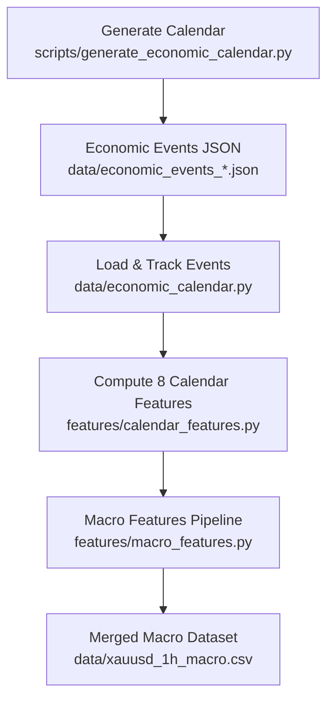
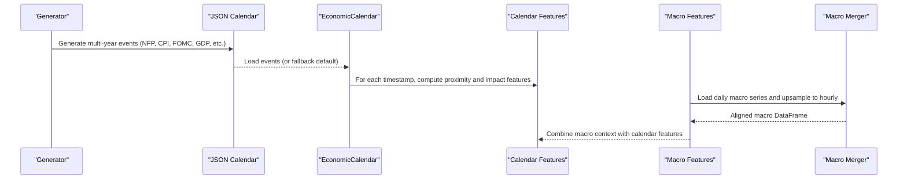
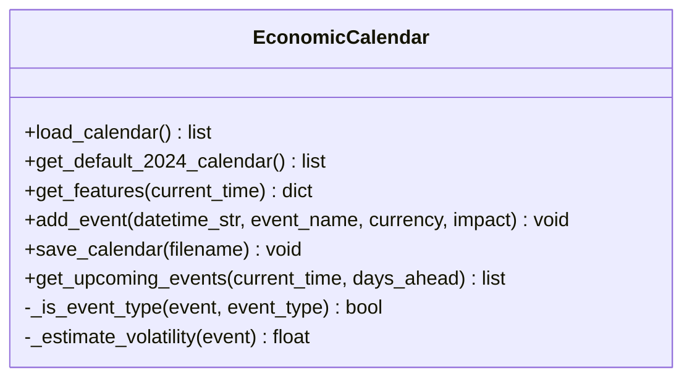
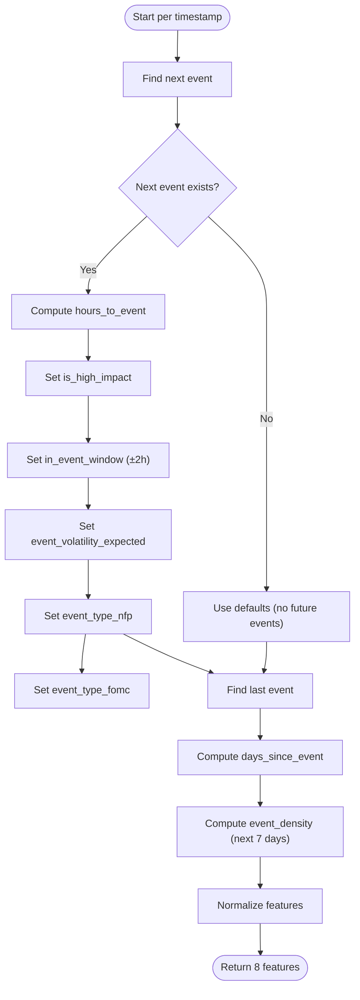
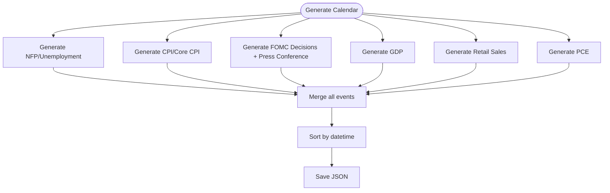
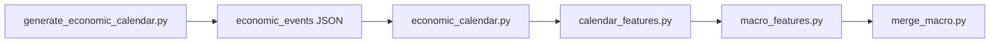

# Economic Calendar Integration

<cite>
**Referenced Files in This Document**
- [economic_calendar.py](file://data/economic_calendar.py)
- [calendar_features.py](file://features/calendar_features.py)
- [generate_economic_calendar.py](file://scripts/generate_economic_calendar.py)
- [macro_features.py](file://features/macro_features.py)
- [merge_macro.py](file://data/merge_macro.py)
</cite>

## Table of Contents
1. [Introduction](#introduction)
2. [Project Structure](#project-structure)
3. [Core Components](#core-components)
4. [Architecture Overview](#architecture-overview)
5. [Detailed Component Analysis](#detailed-component-analysis)
6. [Dependency Analysis](#dependency-analysis)
7. [Performance Considerations](#performance-considerations)
8. [Troubleshooting Guide](#troubleshooting-guide)
9. [Conclusion](#conclusion)

## Introduction
This document explains the economic calendar integration system that detects and incorporates high-impact financial events into feature engineering for a trading system focused on XAUUSD (gold). It covers how scheduled macro events such as Non-Farm Payrolls (NFP), Consumer Price Index (CPI), FOMC meetings, GDP releases, and central bank announcements are loaded, processed, and transformed into features that inform risk-aware decisions around event windows. The system provides both an event tracker and a richer set of 8 calendar features used to measure proximity to events, expected volatility, and event type signals.

## Project Structure
The economic calendar integration spans data generation, event loading, feature computation, and integration with broader macro features:

- Data generation: Produces a multi-year JSON calendar of major USD macro events.
- Event tracking: Loads calendar data and computes per-timestamp features for upcoming events.
- Feature computation: Derives 8 normalized calendar features aligned to price time series.
- Macro integration: Merges macro indicators and aligns them to the primary price timeframe.

**Diagram sources**
- [generate_economic_calendar.py:231-268](file://scripts/generate_economic_calendar.py#L231-L268)
- [economic_calendar.py:81-113](file://data/economic_calendar.py#L81-L113)
- [calendar_features.py:111-249](file://features/calendar_features.py#L111-L249)
- [macro_features.py:363-445](file://features/macro_features.py#L363-L445)
- [merge_macro.py:4-56](file://data/merge_macro.py#L4-L56)

**Section sources**
- [generate_economic_calendar.py:1-310](file://scripts/generate_economic_calendar.py#L1-L310)
- [economic_calendar.py:1-404](file://data/economic_calendar.py#L1-L404)
- [calendar_features.py:1-315](file://features/calendar_features.py#L1-L315)
- [macro_features.py:1-513](file://features/macro_features.py#L1-L513)
- [merge_macro.py:1-61](file://data/merge_macro.py#L1-L61)

## Core Components
- EconomicCalendar class: Loads or generates a calendar of high-impact USD events, estimates expected volatility by event type, and exposes methods to compute features at any timestamp.
- Calendar features module: Computes 8 normalized features per timestamp capturing proximity to next event, recency since last event, event density, impact flags, event window detection, expected volatility multiplier, and event-type indicators (NFP, FOMC).
- Calendar generator: Builds a comprehensive JSON calendar covering NFP, CPI, FOMC, GDP, Retail Sales, and PCE across multiple years.
- Macro features pipeline: Aligns external macro series (DXY, SPX, US10Y, VIX, Oil, BTC, EURUSD, Silver/GLD) to gold timestamps and produces additional context features.
- Macro merger: Upsamples daily macro series to hourly alignment with the master OHLC dataset.

Key responsibilities:
- Detect upcoming events and classify their impact.
- Quantify proximity and density to anticipate volatility regimes.
- Provide binary and continuous signals for model consumption.

**Section sources**
- [economic_calendar.py:27-79](file://data/economic_calendar.py#L27-L79)
- [calendar_features.py:23-50](file://features/calendar_features.py#L23-L50)
- [generate_economic_calendar.py:231-268](file://scripts/generate_economic_calendar.py#L231-L268)
- [macro_features.py:26-75](file://features/macro_features.py#L26-L75)
- [merge_macro.py:4-56](file://data/merge_macro.py#L4-L56)

## Architecture Overview
The system follows a pipeline from calendar generation to feature computation and macro alignment:

**Diagram sources**
- [generate_economic_calendar.py:231-268](file://scripts/generate_economic_calendar.py#L231-L268)
- [economic_calendar.py:81-113](file://data/economic_calendar.py#L81-L113)
- [calendar_features.py:111-249](file://features/calendar_features.py#L111-L249)
- [macro_features.py:363-445](file://features/macro_features.py#L363-L445)
- [merge_macro.py:4-56](file://data/merge_macro.py#L4-L56)

## Detailed Component Analysis

### EconomicCalendar Class
Responsibilities:
- Load events from JSON or generate a default 2024 calendar if missing.
- Identify the next upcoming event and compute features like hours/days until event, high-impact flag, event window flag, event-type one-hot flags, and expected volatility forecast.
- Provide utilities to add events manually, save calendar, and list upcoming events within a horizon.

Event detection algorithm:
- Filters events strictly after current time and selects the nearest future event.
- Uses string matching to detect event types (e.g., NFP, CPI, FOMC, Fed speeches).
- Estimates volatility using a predefined map keyed by event keywords; unknown HIGH impact defaults to moderate increase.

Feature outputs include:
- Time-based: days_until_event, hours_until_event
- Impact: is_high_impact, is_event_window
- Type: is_nfp, is_cpi, is_fomc, is_fed_speech
- Volatility: event_volatility_forecast
- Windows: event_in_24h, event_in_1h

**Diagram sources**
- [economic_calendar.py:27-79](file://data/economic_calendar.py#L27-L79)
- [economic_calendar.py:181-274](file://data/economic_calendar.py#L181-L274)

**Section sources**
- [economic_calendar.py:81-113](file://data/economic_calendar.py#L81-L113)
- [economic_calendar.py:181-274](file://data/economic_calendar.py#L181-L274)
- [economic_calendar.py:276-334](file://data/economic_calendar.py#L276-L334)

### Calendar Features Module (8 Features)
Computes 8 normalized features per timestamp to capture event proximity, impact severity, and timing:

1. hours_to_event: Hours until next event, capped and normalized to 0–1.
2. days_since_event: Days since last event, capped and normalized to 0–1.
3. event_density: Count of upcoming events in next 7 days, capped and normalized to 0–1.
4. is_high_impact: Binary flag indicating next event is HIGH impact.
5. in_event_window: Binary flag within ±2 hours of next event.
6. event_volatility_expected: Expected volatility multiplier based on impact level.
7. event_type_nfp: Binary indicator for NFP-type events.
8. event_type_fomc: Binary indicator for FOMC/Federal Reserve events.

Algorithm highlights:
- find_next_event and find_last_event locate surrounding events relative to each timestamp.
- count_upcoming_events aggregates near-term event density.
- Normalization ensures stable scaling for modeling.

**Diagram sources**
- [calendar_features.py:53-108](file://features/calendar_features.py#L53-L108)
- [calendar_features.py:111-249](file://features/calendar_features.py#L111-L249)

**Section sources**
- [calendar_features.py:111-249](file://features/calendar_features.py#L111-L249)

### Calendar Generator
Generates a comprehensive JSON calendar spanning multiple years with rule-based scheduling:

- NFP and Unemployment Rate: First Friday of each month at a fixed UTC time.
- CPI and Core CPI: Mid-month release times.
- FOMC Rate Decisions and Press Conferences: Approximated monthly schedule with press conference following decision.
- GDP: Quarterly releases approximated to late-month dates.
- Retail Sales: Monthly mid-month releases.
- PCE: End-of-month releases.

Output:
- Sorted list of event dictionaries saved to a JSON file consumed by downstream components.

**Diagram sources**
- [generate_economic_calendar.py:25-69](file://scripts/generate_economic_calendar.py#L25-L69)
- [generate_economic_calendar.py:72-104](file://scripts/generate_economic_calendar.py#L72-L104)
- [generate_economic_calendar.py:107-151](file://scripts/generate_economic_calendar.py#L107-L151)
- [generate_economic_calendar.py:154-178](file://scripts/generate_economic_calendar.py#L154-L178)
- [generate_economic_calendar.py:181-202](file://scripts/generate_economic_calendar.py#L181-L202)
- [generate_economic_calendar.py:205-228](file://scripts/generate_economic_calendar.py#L205-L228)
- [generate_economic_calendar.py:231-268](file://scripts/generate_economic_calendar.py#L231-L268)

**Section sources**
- [generate_economic_calendar.py:231-268](file://scripts/generate_economic_calendar.py#L231-L268)

### Macro Features Integration
While not part of the calendar itself, macro features provide complementary context:

- Loads multiple macro series (DXY, SPX, US10Y, VIX, Oil, BTC, EURUSD, Silver/GLD).
- Computes returns, momentum, and rolling correlations with gold.
- Aligns daily macro series to intraday gold timestamps via forward-fill.

Integration points:
- Calendar features can be combined with macro features to improve regime awareness around events.
- Macro merger upsamples daily data to hourly to match the master OHLC index.

**Section sources**
- [macro_features.py:26-75](file://features/macro_features.py#L26-L75)
- [macro_features.py:363-445](file://features/macro_features.py#L363-L445)
- [merge_macro.py:4-56](file://data/merge_macro.py#L4-L56)

## Dependency Analysis
High-level dependencies among modules:

- Generator depends only on standard libraries and date utilities to produce scheduled events.
- EconomicCalendar depends on JSON I/O and datetime handling.
- Calendar features depend on pandas/numpy and the generated calendar.
- Macro features depend on external CSV datasets and align to gold timestamps.
- Macro merger depends on the master OHLC dataset and daily macro series.

Potential coupling:
- Calendar features assume consistent event schema (time, event, impact).
- Macro features require correctly aligned timestamps and presence of close prices.

**Diagram sources**
- [generate_economic_calendar.py:231-268](file://scripts/generate_economic_calendar.py#L231-L268)
- [economic_calendar.py:81-113](file://data/economic_calendar.py#L81-L113)
- [calendar_features.py:111-249](file://features/calendar_features.py#L111-L249)
- [macro_features.py:363-445](file://features/macro_features.py#L363-L445)
- [merge_macro.py:4-56](file://data/merge_macro.py#L4-L56)

**Section sources**
- [generate_economic_calendar.py:231-268](file://scripts/generate_economic_calendar.py#L231-L268)
- [economic_calendar.py:81-113](file://data/economic_calendar.py#L81-L113)
- [calendar_features.py:111-249](file://features/calendar_features.py#L111-L249)
- [macro_features.py:363-445](file://features/macro_features.py#L363-L445)
- [merge_macro.py:4-56](file://data/merge_macro.py#L4-L56)

## Performance Considerations
- Iterative processing: Calendar feature computation iterates over each timestamp; consider vectorized approaches or chunking for very large datasets.
- Event lookup: Filtering future/past events per timestamp has O(n) complexity; indexing events by time could reduce lookups.
- Normalization: Features are capped and normalized to stabilize training and inference.
- Macro alignment: Forward-filling daily macro data to hourly introduces lag but maintains temporal consistency.

[No sources needed since this section provides general guidance]

## Troubleshooting Guide
Common issues and resolutions:

- Missing calendar file:
  - Symptom: Warnings about missing JSON calendar; fallback to default calendar.
  - Resolution: Run the generator script to create the multi-year calendar file before feature computation.

- No future events detected:
  - Symptom: All timestamps show neutral/default values for calendar features.
  - Resolution: Ensure the calendar file contains events beyond the analysis period and that timestamps are timezone-naive and sorted.

- NaN values in features:
  - Symptom: NaNs appear in computed features.
  - Resolution: The pipeline fills NaNs with zeros; verify input data integrity and ensure proper datetime parsing.

- Macro data misalignment:
  - Symptom: Macro features do not align with gold timestamps.
  - Resolution: Confirm daily macro files have correct 'time' columns and use the merger to resample to hourly alignment.

**Section sources**
- [economic_calendar.py:99-113](file://data/economic_calendar.py#L99-L113)
- [calendar_features.py:128-138](file://features/calendar_features.py#L128-L138)
- [calendar_features.py:226-228](file://features/calendar_features.py#L226-L228)
- [merge_macro.py:23-47](file://data/merge_macro.py#L23-L47)

## Conclusion
The economic calendar integration system equips the trading pipeline with robust awareness of high-impact macro events. By computing proximity, impact, and type signals, it enables strategies to avoid volatile windows or exploit predictable post-event patterns. Combined with macro features, the system provides a comprehensive view of market conditions around key announcements such as NFP, CPI, FOMC, GDP, and central bank communications.

[No sources needed since this section summarizes without analyzing specific files]