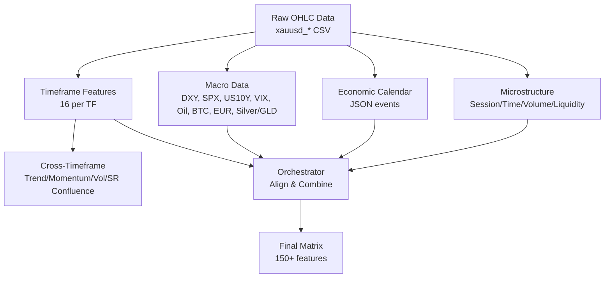
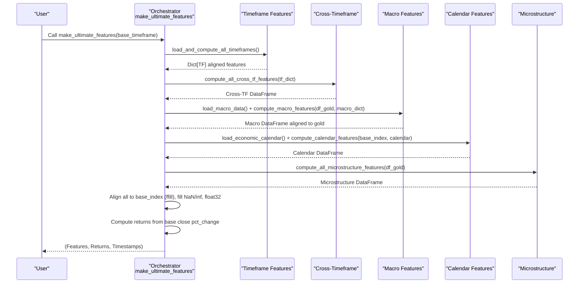
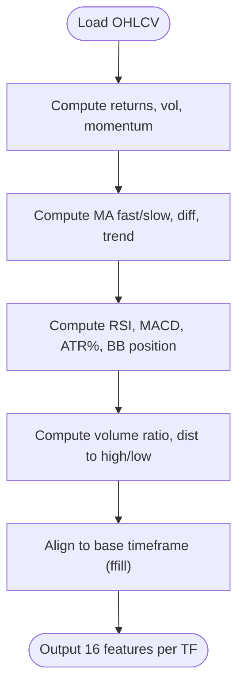
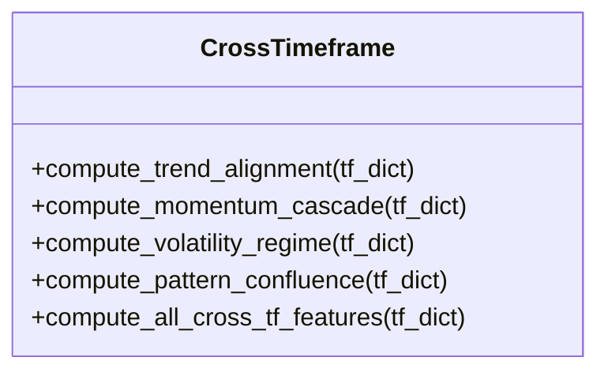
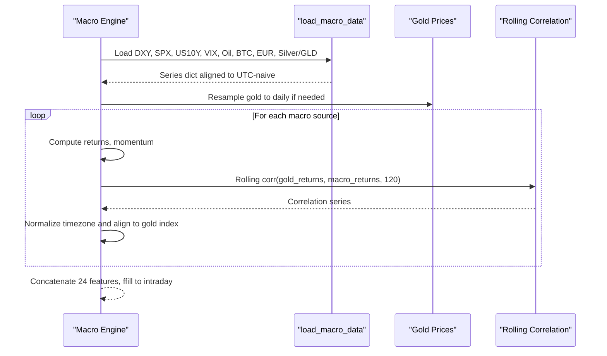
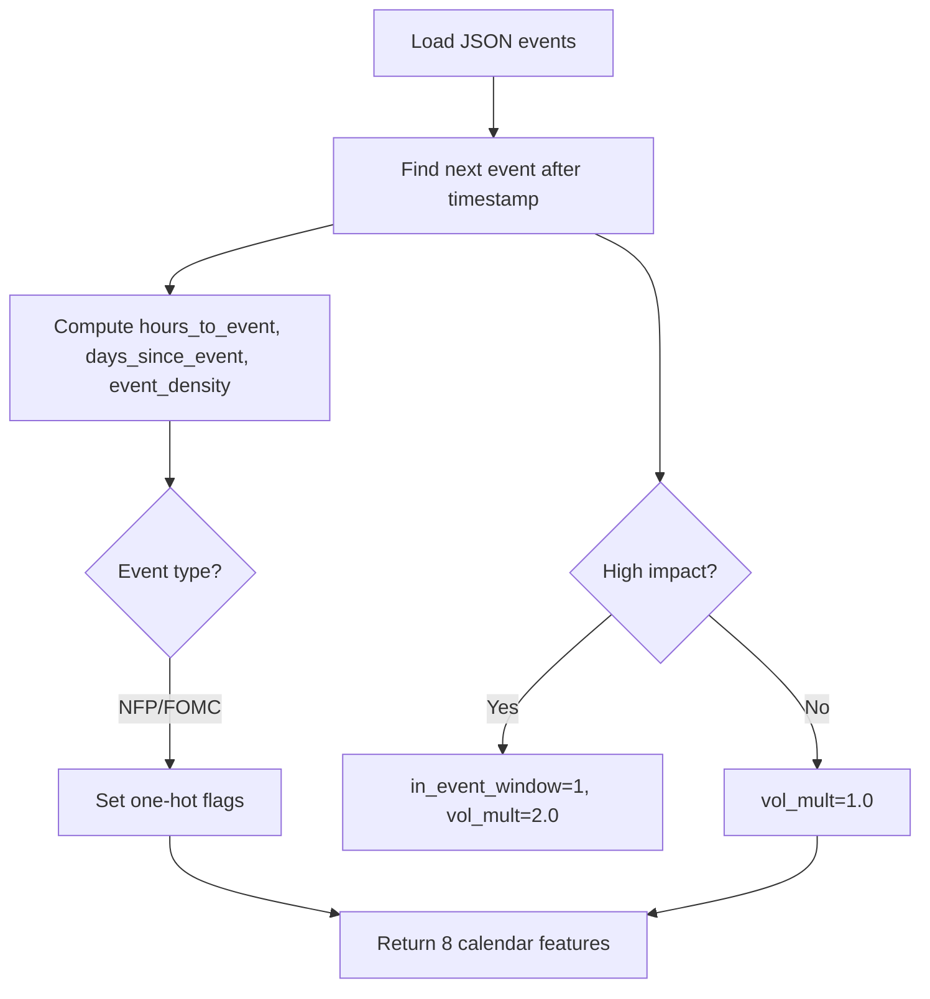
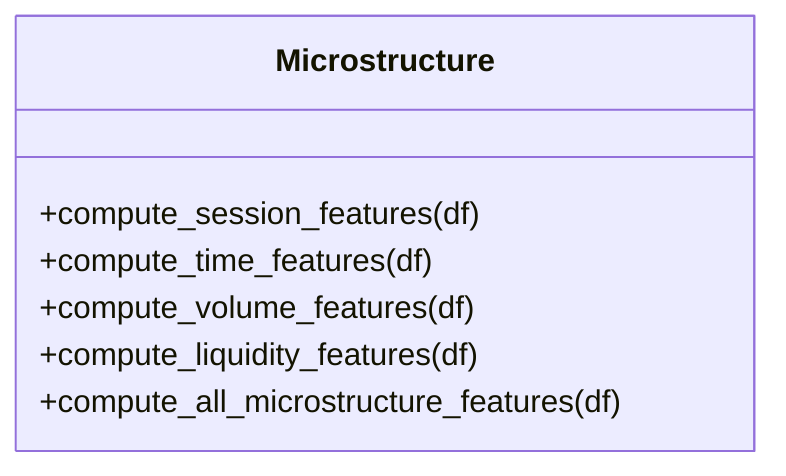
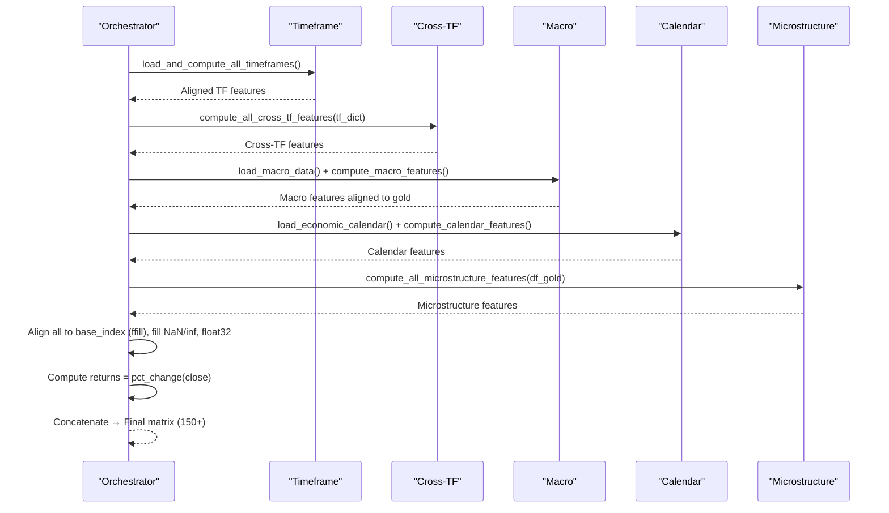
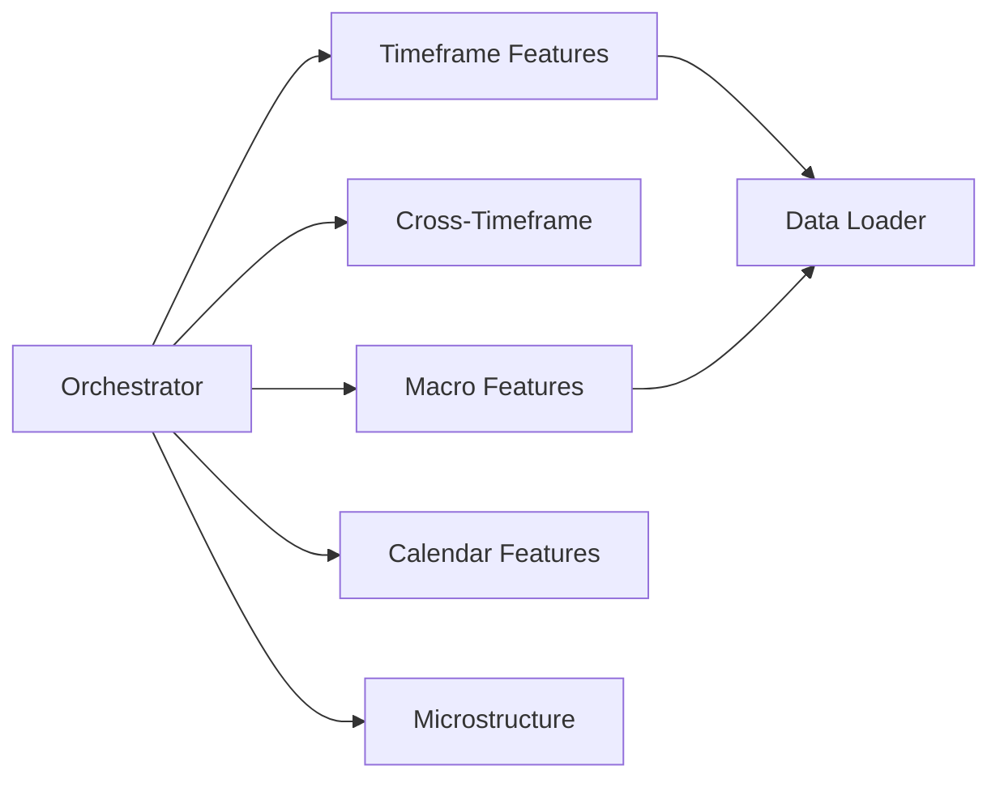

# Feature Engineering Pipeline

<cite>
**Referenced Files in This Document**
- [ultimate_150_features.py](file://features/ultimate_150_features.py)
- [timeframe_features.py](file://features/timeframe_features.py)
- [cross_timeframe.py](file://features/cross_timeframe.py)
- [macro_features.py](file://features/macro_features.py)
- [calendar_features.py](file://features/calendar_features.py)
- [microstructure_features.py](file://features/microstructure_features.py)
- [load_data.py](file://data/load_data.py)
</cite>

## Table of Contents
1. [Introduction](#introduction)
2. [Project Structure](#project-structure)
3. [Core Components](#core-components)
4. [Architecture Overview](#architecture-overview)
5. [Detailed Component Analysis](#detailed-component-analysis)
6. [Dependency Analysis](#dependency-analysis)
7. [Performance Considerations](#performance-considerations)
8. [Troubleshooting Guide](#troubleshooting-guide)
9. [Conclusion](#conclusion)

## Introduction
This document describes the modular feature engineering pipeline that transforms raw market data into a comprehensive 150+ dimensional feature matrix for training trading models. The system processes multiple timeframes (M5, M15, H1, H4, D1, W1), computes cross-timeframe correlations, integrates macro indicators (VIX, Oil, Bitcoin, DXY, SPX), incorporates economic calendar events, and adds market microstructure insights. A central orchestrator coordinates all extractors, aligns timestamps, cleans data, and outputs a unified feature set ready for model training.

## Project Structure
The pipeline is organized into specialized modules under features/, each responsible for a distinct aspect of feature generation:
- Timeframe features: 16 standardized features per timeframe
- Cross-timeframe features: relationships across timeframes
- Macro features: global indicators and correlations
- Calendar features: event timing and impact
- Microstructure features: session, time, volume, liquidity signals
- Orchestrator: combines all sources into the final matrix

**Diagram sources**
- [ultimate_150_features.py:27-226](file://features/ultimate_150_features.py#L27-L226)
- [timeframe_features.py:22-99](file://features/timeframe_features.py#L22-L99)
- [cross_timeframe.py:205-249](file://features/cross_timeframe.py#L205-L249)
- [macro_features.py:26-75](file://features/macro_features.py#L26-L75)
- [calendar_features.py:23-50](file://features/calendar_features.py#L23-L50)
- [microstructure_features.py:170-225](file://features/microstructure_features.py#L170-L225)

**Section sources**
- [ultimate_150_features.py:27-226](file://features/ultimate_150_features.py#L27-L226)
- [timeframe_features.py:236-304](file://features/timeframe_features.py#L236-L304)

## Core Components
- Multi-timeframe engine: Computes 16 features per timeframe (returns, volatility, momentum, moving averages, RSI, MACD, ATR, Bollinger position, volume ratio, distance to high/low). Supports M5, M15, H1, H4, D1, W1 with alignment to a base timeframe.
- Cross-timeframe correlation engine: Derives trend alignment, momentum cascade, volatility regime, and support/resistance confluence across timeframes.
- Macro correlation engine: Loads daily series for DXY, SPX, US10Y, VIX, Oil, Bitcoin, EURUSD, Silver/GLD; computes returns, momentum, and rolling correlations with gold; aligns to intraday via forward-fill.
- Economic calendar integration: Loads JSON events, computes hours/days to next event, event density, high-impact flags, event window detection, and expected volatility multipliers.
- Market microstructure analysis: Session effects (Asian, London, NY, overlap), time-of-day/week/month, volume profile and imbalance, spread proxy and liquidity regime.
- Pipeline orchestrator: Coordinates loading, computation, alignment, cleaning, normalization, target return computation, and concatenation into the final matrix.

**Section sources**
- [timeframe_features.py:22-99](file://features/timeframe_features.py#L22-L99)
- [cross_timeframe.py:21-203](file://features/cross_timeframe.py#L21-L203)
- [macro_features.py:135-360](file://features/macro_features.py#L135-L360)
- [calendar_features.py:111-249](file://features/calendar_features.py#L111-L249)
- [microstructure_features.py:22-167](file://features/microstructure_features.py#L22-L167)
- [ultimate_150_features.py:27-226](file://features/ultimate_150_features.py#L27-L226)

## Architecture Overview
The orchestrator composes five stages:
1. Load and compute timeframe features across M5, M15, H1, H4, D1, W1
2. Compute cross-timeframe features from the aligned timeframe outputs
3. Load macro data and compute macro features aligned to gold timestamps
4. Load economic calendar and compute calendar features on the base index
5. Compute microstructure features from base timeframe OHLCV
Then align all feature sets to the base timeframe index, clean NaNs/infs, convert to float32, compute target returns, and concatenate into the final matrix.

**Diagram sources**
- [ultimate_150_features.py:27-226](file://features/ultimate_150_features.py#L27-L226)
- [timeframe_features.py:236-304](file://features/timeframe_features.py#L236-L304)
- [cross_timeframe.py:205-249](file://features/cross_timeframe.py#L205-L249)
- [macro_features.py:363-445](file://features/macro_features.py#L363-L445)
- [calendar_features.py:111-249](file://features/calendar_features.py#L111-L249)
- [microstructure_features.py:170-225](file://features/microstructure_features.py#L170-L225)

## Detailed Component Analysis

### Multi-Timeframe Engine
Computes 16 features per timeframe:
- Price action: returns, volatility (rolling std), momentum at 5/10/20 periods
- Trend: fast/slow moving averages, MA difference, trend direction
- Technical: RSI (normalized), MACD histogram normalized by price, ATR as % of price, Bollinger Band position
- Volume and S/R: volume ratio vs 20-period average, distance to recent high/low (50-period)

Supports M5, M15, H1, H4, D1, W1 and aligns all to a base timeframe using forward-fill.

**Diagram sources**
- [timeframe_features.py:22-99](file://features/timeframe_features.py#L22-L99)
- [timeframe_features.py:207-233](file://features/timeframe_features.py#L207-L233)

**Section sources**
- [timeframe_features.py:22-99](file://features/timeframe_features.py#L22-L99)
- [timeframe_features.py:236-304](file://features/timeframe_features.py#L236-L304)

### Cross-Timeframe Correlation Engine
Generates 12 advanced features capturing hierarchical market dynamics:
- Trend alignment: overall agreement, strength cascade, divergence
- Momentum cascade: interactions between higher and lower timeframes (e.g., D1×H1, H4×H1, H1×M15)
- Volatility regime: current vs long-term volatility, spikes, compression
- Pattern confluence: support/resistance confluence across TFs, breakout alignment

**Diagram sources**
- [cross_timeframe.py:21-203](file://features/cross_timeframe.py#L21-L203)
- [cross_timeframe.py:205-249](file://features/cross_timeframe.py#L205-L249)

**Section sources**
- [cross_timeframe.py:21-203](file://features/cross_timeframe.py#L21-L203)
- [cross_timeframe.py:205-249](file://features/cross_timeframe.py#L205-L249)

### Macro Correlation Engine
Integrates eight macro sources (DXY, SPX, US10Y, VIX, Oil, Bitcoin, EURUSD, Silver/GLD) to produce 24 features:
- For each source: returns, momentum (20-period), rolling correlation with gold (120-day)
- Specialized features: VIX level/change/regime, Gold/Silver ratio, GLD flow proxy
- Alignment: Daily macro series are resampled/aligned to gold’s index via forward-fill

**Diagram sources**
- [macro_features.py:26-75](file://features/macro_features.py#L26-L75)
- [macro_features.py:114-132](file://features/macro_features.py#L114-L132)
- [macro_features.py:135-360](file://features/macro_features.py#L135-L360)
- [macro_features.py:363-445](file://features/macro_features.py#L363-L445)

**Section sources**
- [macro_features.py:26-75](file://features/macro_features.py#L26-L75)
- [macro_features.py:135-360](file://features/macro_features.py#L135-L360)
- [macro_features.py:363-445](file://features/macro_features.py#L363-L445)

### Economic Calendar Integration
Detects upcoming high-impact events and encodes their proximity and type:
- Hours/days to next event, days since last event
- Event density (upcoming events in next 7 days)
- High-impact flag, event window (±2 hours), expected volatility multiplier
- One-hot indicators for NFP and FOMC

**Diagram sources**
- [calendar_features.py:23-50](file://features/calendar_features.py#L23-L50)
- [calendar_features.py:111-249](file://features/calendar_features.py#L111-L249)

**Section sources**
- [calendar_features.py:23-50](file://features/calendar_features.py#L23-L50)
- [calendar_features.py:111-249](file://features/calendar_features.py#L111-L249)

### Market Microstructure Analysis
Captures intraday patterns and order flow proxies:
- Session effects: Asian, London, New York, overlap detection
- Time effects: hour of day, day of week, week of month, month of year
- Volume analysis: volume percentile profile, volume imbalance proxy
- Liquidity: spread proxy (high-low/close), liquidity regime based on rolling spread

**Diagram sources**
- [microstructure_features.py:22-167](file://features/microstructure_features.py#L22-L167)
- [microstructure_features.py:170-225](file://features/microstructure_features.py#L170-L225)

**Section sources**
- [microstructure_features.py:22-167](file://features/microstructure_features.py#L22-L167)
- [microstructure_features.py:170-225](file://features/microstructure_features.py#L170-L225)

### Pipeline Orchestration
Coordinates all extractors and ensures data alignment:
- Loads timeframe features across M5, M15, H1, H4, D1, W1
- Computes cross-timeframe features from aligned timeframe outputs
- Loads macro data and computes macro features aligned to gold timestamps
- Loads economic calendar and computes calendar features on base index
- Computes microstructure features from base timeframe OHLCV
- Aligns all feature sets to base index using forward-fill
- Cleans NaNs/infs, converts to float32, computes target returns from base close pct_change
- Concatenates into final matrix and returns features, returns, timestamps

**Diagram sources**
- [ultimate_150_features.py:27-226](file://features/ultimate_150_features.py#L27-L226)

**Section sources**
- [ultimate_150_features.py:27-226](file://features/ultimate_150_features.py#L27-L226)

## Dependency Analysis
- Orchestrator depends on:
  - Timeframe features module for per-TF computations and alignment
  - Cross-timeframe module for inter-TF relationships
  - Macro features module for external indicator integration
  - Calendar features module for event awareness
  - Microstructure module for intraday mechanics
- Data loader provides robust OHLC parsing and validation
- All modules output pandas DataFrames with DatetimeIndex, enabling consistent alignment and concatenation

**Diagram sources**
- [ultimate_150_features.py:27-226](file://features/ultimate_150_features.py#L27-L226)
- [load_data.py:5-73](file://data/load_data.py#L5-L73)

**Section sources**
- [ultimate_150_features.py:27-226](file://features/ultimate_150_features.py#L27-L226)
- [load_data.py:5-73](file://data/load_data.py#L5-L73)

## Performance Considerations
- Use base timeframe M5 for speed while retaining higher timeframe context via forward-fill alignment
- Rolling windows are sized appropriately per timeframe to balance responsiveness and stability
- Macro features computed on daily series then forward-filled to intraday to reduce computational load
- Data types converted to float32 to minimize memory usage for large datasets
- Forward-fill alignment avoids interpolation artifacts and preserves temporal causality

## Troubleshooting Guide
Common issues and resolutions:
- Missing timeframe files: Required files must exist; optional W1 can be skipped if absent
- Timezone mismatches: Macro series are normalized to UTC-naive indices before alignment
- NaN/Inf values: Pipeline fills NaNs with zeros and replaces infinities with zeros; ensure input data quality
- Column naming: Data loader standardizes MT5 angle-bracket columns; verify presence of required OHLC fields
- Calendar file missing: Calendar features default to neutral values when no events are found

**Section sources**
- [timeframe_features.py:266-283](file://features/timeframe_features.py#L266-L283)
- [macro_features.py:78-111](file://features/macro_features.py#L78-L111)
- [ultimate_150_features.py:156-173](file://features/ultimate_150_features.py#L156-L173)
- [load_data.py:12-73](file://data/load_data.py#L12-L73)
- [calendar_features.py:128-138](file://features/calendar_features.py#L128-L138)

## Conclusion
The pipeline delivers a robust, modular architecture that ingests raw market data and produces a rich 150+ dimensional feature matrix by combining multi-timeframe technicals, cross-timeframe correlations, macro indicators, economic calendar events, and microstructure signals. The orchestrator ensures precise alignment, cleaning, and target computation, enabling reliable training of advanced trading models with comprehensive market intelligence.