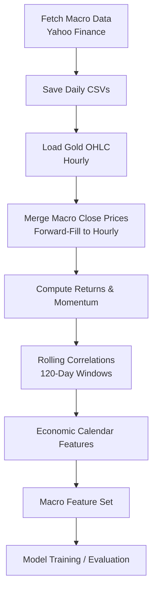
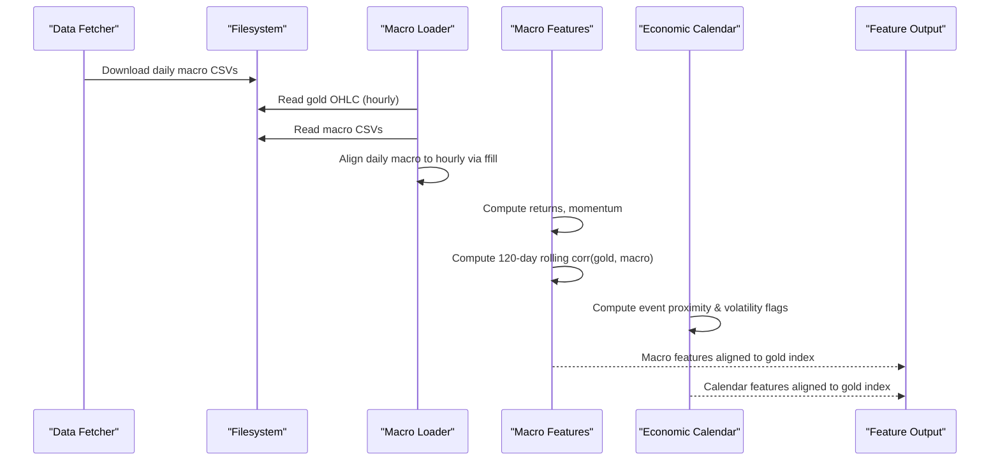
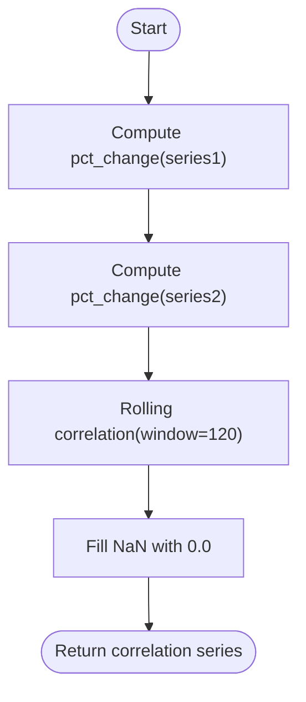
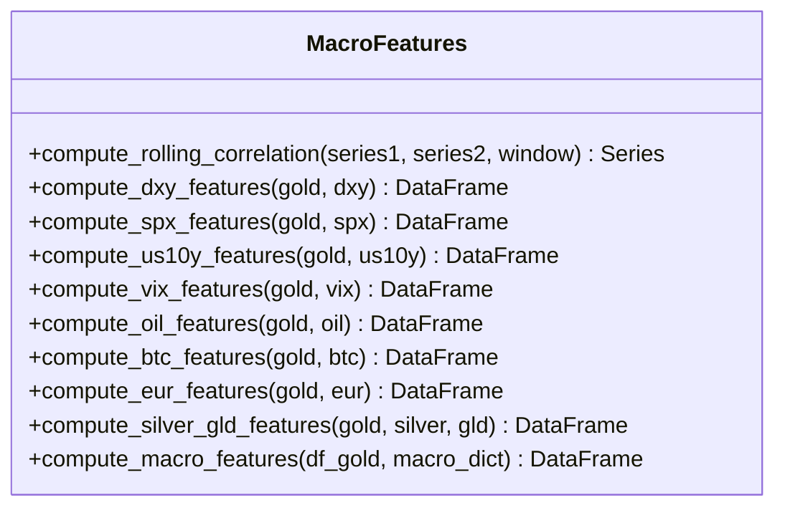
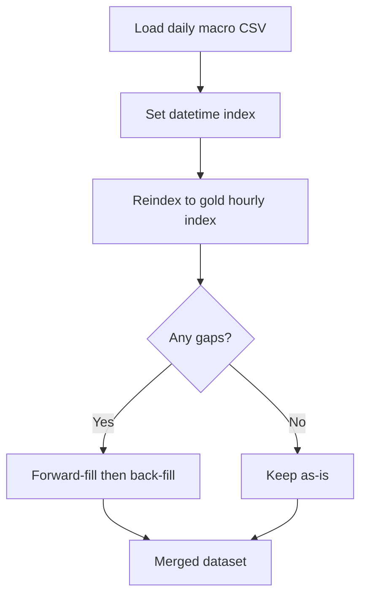
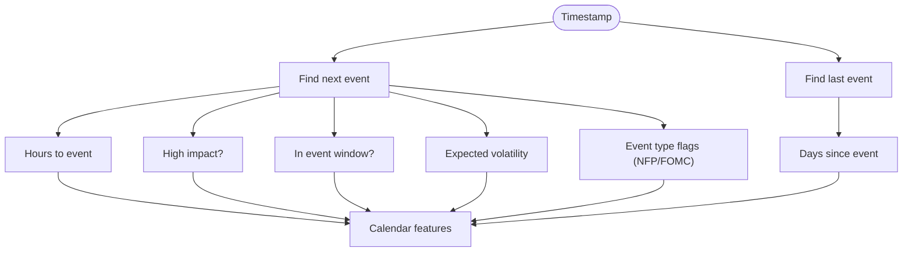

# Correlation Analysis System

<cite>
**Referenced Files in This Document**
- [macro_features.py](file://features/macro_features.py)
- [fetch_correlations.py](file://data/fetch_correlations.py)
- [merge_macro.py](file://data/merge_macro.py)
- [load_data.py](file://data/load_data.py)
- [make_features.py](file://features/make_features.py)
- [economic_calendar.py](file://data/economic_calendar.py)
- [calendar_features.py](file://features/calendar_features.py)
- [README.md](file://README.md)
</cite>

## Table of Contents
1. [Introduction](#introduction)
2. [Project Structure](#project-structure)
3. [Core Components](#core-components)
4. [Architecture Overview](#architecture-overview)
5. [Detailed Component Analysis](#detailed-component-analysis)
6. [Dependency Analysis](#dependency-analysis)
7. [Performance Considerations](#performance-considerations)
8. [Troubleshooting Guide](#troubleshooting-guide)
9. [Conclusion](#conclusion)
10. [Appendices](#appendices)

## Introduction
This document explains the correlation analysis system that measures relationships between gold and macroeconomic indicators to support trading signals and risk management. The system computes rolling correlations on percentage changes using 120-day windows, identifies safe-haven flows, risk sentiment indicators, and intermarket relationships, and normalizes features for comparability across asset classes. It also provides guidance on interpreting correlation shifts during market stress and economic events.

## Project Structure
The correlation pipeline spans data acquisition, alignment, feature engineering, and integration with macro-aware models:
- Data acquisition: daily macro series (DXY, SPX, US10Y, VIX, Oil, Bitcoin, EURUSD, Silver, GLD) are fetched and saved as CSVs.
- Alignment: daily macro series are merged into hourly gold time series via forward-fill to match intraday timestamps.
- Feature engineering: returns, momentum, and rolling correlations are computed; calendar event features enrich timing context.
- Integration: macro features feed into model training pipelines and evaluation routines.

**Diagram sources**
- [fetch_correlations.py:5-55](file://data/fetch_correlations.py#L5-L55)
- [merge_macro.py:4-61](file://data/merge_macro.py#L4-L61)
- [macro_features.py:114-132](file://features/macro_features.py#L114-L132)
- [calendar_features.py:111-249](file://features/calendar_features.py#L111-L249)

**Section sources**
- [README.md:90-101](file://README.md#L90-L101)
- [fetch_correlations.py:5-55](file://data/fetch_correlations.py#L5-L55)
- [merge_macro.py:4-61](file://data/merge_macro.py#L4-L61)

## Core Components
- Rolling correlation engine: Computes 120-day rolling correlations on percentage changes between gold and each macro indicator.
- Macro feature generators: For each indicator, compute return, momentum, and correlation with gold.
- Timezone and frequency alignment: Ensures daily macro series align to gold’s hourly index via forward-fill.
- Economic calendar features: Adds event proximity and expected volatility context around high-impact releases.
- Normalization: Standardizes features (e.g., VIX level normalized by a constant; ratios scaled by typical levels; z-score normalization in feature pipelines).

Key responsibilities:
- Safe-haven flow detection via gold–DXY and gold–US10Y correlations.
- Risk sentiment via gold–SPX and gold–Bitcoin correlations.
- Intermarket relationships via gold–Oil, gold–Silver/GLD, and gold–EURUSD correlations.
- Event-aware adjustments through calendar features.

**Section sources**
- [macro_features.py:114-132](file://features/macro_features.py#L114-L132)
- [macro_features.py:135-360](file://features/macro_features.py#L135-L360)
- [macro_features.py:363-445](file://features/macro_features.py#L363-L445)
- [merge_macro.py:4-61](file://data/merge_macro.py#L4-L61)
- [calendar_features.py:111-249](file://features/calendar_features.py#L111-L249)

## Architecture Overview
The system follows a modular pipeline:
1. Fetch daily macro prices from Yahoo Finance and persist to CSV.
2. Load gold OHLC at desired timeframe (hourly or finer).
3. Merge macro close prices into the gold timeline using forward-fill.
4. Compute macro features: returns, momentum, and 120-day rolling correlations with gold.
5. Add economic calendar features to capture event timing and expected volatility.
6. Output a unified macro feature set aligned to gold timestamps for modeling.

**Diagram sources**
- [fetch_correlations.py:5-55](file://data/fetch_correlations.py#L5-L55)
- [merge_macro.py:4-61](file://data/merge_macro.py#L4-L61)
- [macro_features.py:114-132](file://features/macro_features.py#L114-L132)
- [calendar_features.py:111-249](file://features/calendar_features.py#L111-L249)

## Detailed Component Analysis

### Rolling Correlation Engine (120-Day Windows)
- Computes percentage changes for both series before correlation to ensure stationarity and comparability.
- Uses a 120-day rolling window to capture medium-term regime shifts while smoothing noise.
- Handles missing values by filling with zeros after computation to maintain alignment.

**Diagram sources**
- [macro_features.py:114-132](file://features/macro_features.py#L114-L132)

**Section sources**
- [macro_features.py:114-132](file://features/macro_features.py#L114-L132)

### Macro Feature Generators
For each macro source, three core features are produced:
- Return or change: Captures short-term dynamics.
- Momentum: 20-day momentum to capture trend persistence.
- Rolling correlation with gold: 120-day correlation to detect regime shifts.

Sources and roles:
- DXY: Dollar strength proxy; negative correlation often indicates safe-haven demand.
- SPX: Equity risk-on/risk-off; positive correlation suggests risk-seeking behavior.
- US10Y: Yield environment; inverse relationship reflects opportunity cost of non-yielding assets.
- VIX: Fear gauge; normalized level and regime flag help adjust risk posture.
- Oil: Commodity co-movement; useful for inflation and growth signals.
- Bitcoin: Risk sentiment alternative; correlation divergence can signal regime changes.
- EURUSD: Currency exposure; helps isolate USD-driven moves vs. global risk.
- Silver/GLD: Precious metals and institutional positioning; ratio and ETF flow proxies.

**Diagram sources**
- [macro_features.py:114-132](file://features/macro_features.py#L114-L132)
- [macro_features.py:135-360](file://features/macro_features.py#L135-L360)
- [macro_features.py:363-445](file://features/macro_features.py#L363-L445)

**Section sources**
- [macro_features.py:135-360](file://features/macro_features.py#L135-L360)
- [macro_features.py:363-445](file://features/macro_features.py#L363-L445)

### Data Alignment and Merging
- Daily macro series are loaded and converted to timezone-naive indices.
- They are reindexed to the gold hourly index using forward-fill to propagate last known daily values across intraday bars.
- Missing gaps are filled via forward/backward fill to ensure complete alignment.

**Diagram sources**
- [merge_macro.py:4-61](file://data/merge_macro.py#L4-L61)
- [macro_features.py:78-112](file://features/macro_features.py#L78-L112)

**Section sources**
- [merge_macro.py:4-61](file://data/merge_macro.py#L4-L61)
- [macro_features.py:78-112](file://features/macro_features.py#L78-L112)

### Economic Calendar Features
- Identifies upcoming and recent high-impact events (NFP, CPI, FOMC, etc.).
- Produces features such as hours until next event, days since last event, event density, high-impact flags, event window flags, and expected volatility multipliers.
- Normalizes certain features to bounded ranges for stable modeling.

**Diagram sources**
- [calendar_features.py:111-249](file://features/calendar_features.py#L111-L249)
- [economic_calendar.py:181-234](file://data/economic_calendar.py#L181-L234)

**Section sources**
- [calendar_features.py:111-249](file://features/calendar_features.py#L111-L249)
- [economic_calendar.py:181-234](file://data/economic_calendar.py#L181-L234)

### Normalization Techniques
- VIX level is normalized by dividing by a reference value to stabilize scale.
- Gold/Silver ratio is normalized by a typical ratio to keep it near unity under normal conditions.
- In some pipelines, features are standardized via mean and standard deviation to improve model stability.
- Rolling correlations are inherently unitless and comparable across assets once computed on percentage changes.

Examples in code:
- VIX normalization and regime flagging.
- Gold/Silver ratio scaling.
- Z-score normalization in feature pipelines.

**Section sources**
- [macro_features.py:219-242](file://features/macro_features.py#L219-L242)
- [macro_features.py:329-360](file://features/macro_features.py#L329-L360)
- [make_features.py:73-78](file://features/make_features.py#L73-L78)

### Interpreting Correlation Patterns During Stress and Events
- Safe-haven flows: Rising gold–DXY negative correlation and gold–US10Y negative correlation often accompany flight-to-safety episodes.
- Risk sentiment: Declining gold–SPX correlation or positive spikes in gold–Bitcoin correlation can indicate risk-on shifts; widening divergence may precede regime changes.
- Intermarket relationships: Breakdowns in gold–oil or gold–silver correlations can signal commodity-specific shocks or inflation regimes.
- Event windows: Elevated expected volatility and event proximity flags suggest caution; correlation spikes around NFP/CPI/FOMC are common due to liquidity and repricing.

Guidance:
- Monitor rolling correlation trends rather than point-in-time values.
- Combine correlation shifts with calendar features to avoid false signals around events.
- Use regime flags (e.g., high VIX) to adjust position sizing and stop distances.

[No sources needed since this section synthesizes interpretation without analyzing specific files]

### Using Correlation Shifts as Trading Signals and Risk Indicators
- Entry signals:
  - Sustained increase in gold–SPX correlation during equity rallies can confirm risk-on environments; consider reducing safe-haven exposure.
  - Increasing gold–DXY negative correlation during dollar weakness can support long gold positions.
- Exit signals:
  - Rapid convergence of gold–Bitcoin correlation toward equity-like behavior may warn of diminishing safe-haven premium.
- Risk management:
  - Increase position sizing when correlations are stable and consistent with regime expectations.
  - Reduce size and widen stops during event windows or when correlations are rapidly changing.
- Confirmation:
  - Cross-validate with momentum and volatility features (e.g., rising VIX, expanding spreads) to filter noisy correlation moves.

[No sources needed since this section provides general guidance]

## Dependency Analysis
The correlation system depends on data fetching, loading, merging, and feature modules:

**Diagram sources**
- [fetch_correlations.py:5-55](file://data/fetch_correlations.py#L5-L55)
- [merge_macro.py:4-61](file://data/merge_macro.py#L4-L61)
- [load_data.py:5-73](file://data/load_data.py#L5-L73)
- [macro_features.py:114-132](file://features/macro_features.py#L114-L132)
- [calendar_features.py:111-249](file://features/calendar_features.py#L111-L249)

**Section sources**
- [fetch_correlations.py:5-55](file://data/fetch_correlations.py#L5-L55)
- [merge_macro.py:4-61](file://data/merge_macro.py#L4-L61)
- [load_data.py:5-73](file://data/load_data.py#L5-L73)
- [macro_features.py:114-132](file://features/macro_features.py#L114-L132)
- [calendar_features.py:111-249](file://features/calendar_features.py#L111-L249)

## Performance Considerations
- Rolling window choice: 120 days balances responsiveness and stability; shorter windows react faster but are noisier.
- Frequency alignment: Forward-filling daily macro to hourly introduces lag; be cautious interpreting rapid intraday moves.
- Computational load: Large datasets benefit from vectorized operations; avoid row-wise loops where possible.
- Missing data: Robust fill strategies prevent NaN propagation; validate alignment before modeling.
- Normalization: Ensure consistent scaling across assets to avoid dominance by high-variance series.

[No sources needed since this section provides general guidance]

## Troubleshooting Guide
Common issues and resolutions:
- Missing macro CSVs: Ensure fetch scripts run successfully and files exist in the data directory.
- Timezone mismatches: Convert all timestamps to timezone-naive UTC-aligned indices before merging.
- Misaligned frequencies: Reindex daily series to hourly using forward-fill; verify no unexpected gaps remain.
- Excessive NaNs: Check for insufficient history in early windows; ensure proper handling of initial periods.
- Calendar file not found: Provide a valid economic calendar JSON or rely on default fallback logic.

Operational checks:
- Validate column names and types after loading.
- Confirm OHLC integrity (high >= max(open, close, low), low <= min(open, close, high)).
- Inspect sample outputs to ensure correct alignment and feature presence.

**Section sources**
- [load_data.py:5-73](file://data/load_data.py#L5-L73)
- [merge_macro.py:4-61](file://data/merge_macro.py#L4-L61)
- [calendar_features.py:23-50](file://features/calendar_features.py#L23-L50)

## Conclusion
The correlation analysis system integrates macro data, computes robust rolling correlations on percentage changes, and augments them with economic calendar context. By focusing on 120-day windows, it captures meaningful regime shifts while filtering noise. The resulting features enable identification of safe-haven flows, risk sentiment, and intermarket relationships, supporting informed trading signals and dynamic risk management. Proper normalization and alignment ensure comparability across diverse asset classes, while event-aware features help navigate volatile periods.

[No sources needed since this section summarizes without analyzing specific files]

## Appendices

### Key Implementation Paths
- Rolling correlation function: [macro_features.py:114-132](file://features/macro_features.py#L114-L132)
- Macro feature generation per asset: [macro_features.py:135-360](file://features/macro_features.py#L135-L360)
- Macro feature aggregation and alignment: [macro_features.py:363-445](file://features/macro_features.py#L363-L445)
- Daily macro fetch and save: [fetch_correlations.py:5-55](file://data/fetch_correlations.py#L5-L55)
- Merge daily macro to hourly gold: [merge_macro.py:4-61](file://data/merge_macro.py#L4-L61)
- Economic calendar features: [calendar_features.py:111-249](file://features/calendar_features.py#L111-L249)
- Alternative correlation usage in feature pipeline: [make_features.py:41-58](file://features/make_features.py#L41-L58)

**Section sources**
- [macro_features.py:114-132](file://features/macro_features.py#L114-L132)
- [macro_features.py:135-360](file://features/macro_features.py#L135-L360)
- [macro_features.py:363-445](file://features/macro_features.py#L363-L445)
- [fetch_correlations.py:5-55](file://data/fetch_correlations.py#L5-L55)
- [merge_macro.py:4-61](file://data/merge_macro.py#L4-L61)
- [calendar_features.py:111-249](file://features/calendar_features.py#L111-L249)
- [make_features.py:41-58](file://features/make_features.py#L41-L58)