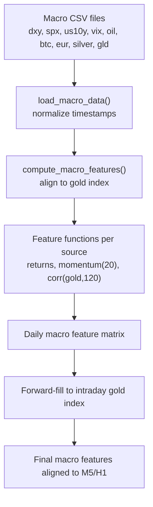
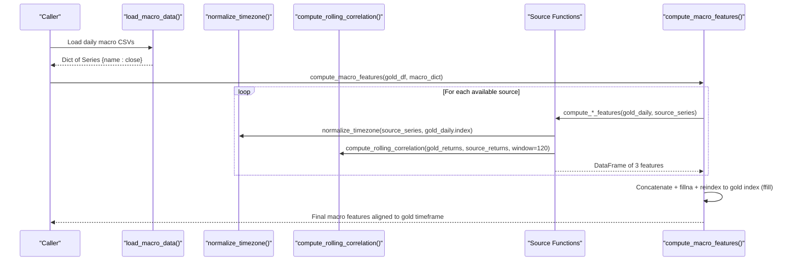
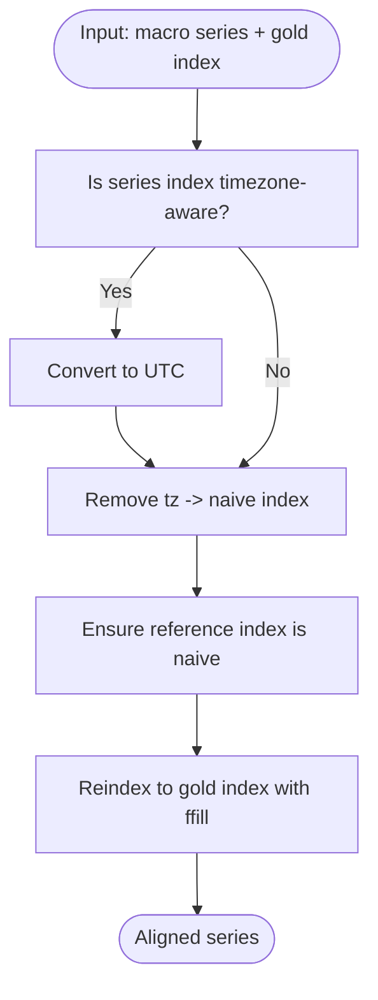
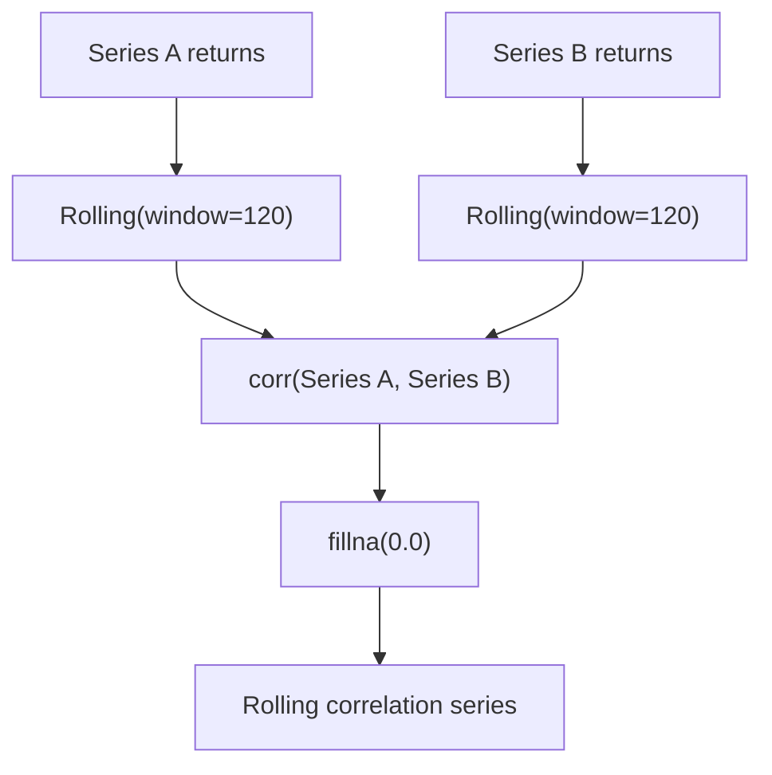
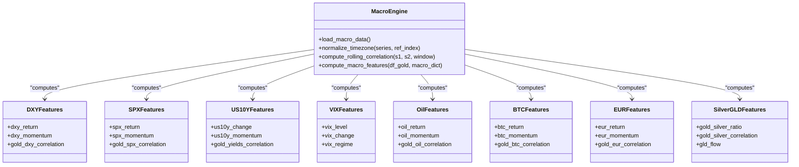
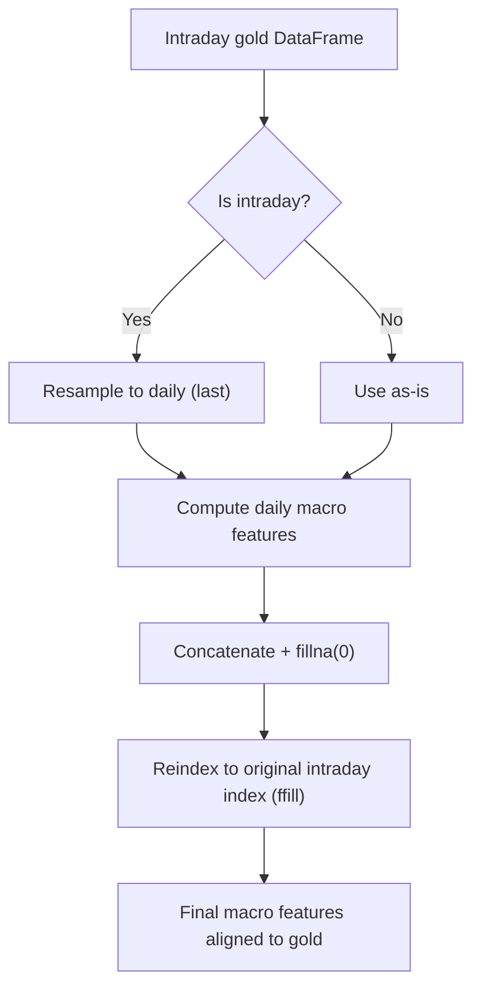
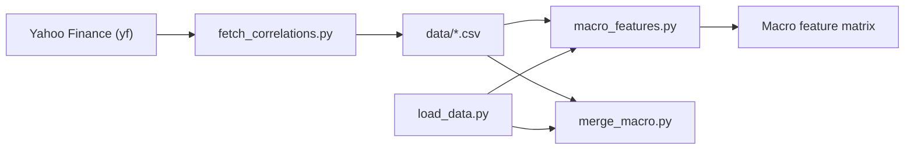

# Feature Computation Engine

<cite>
**Referenced Files in This Document**
- [macro_features.py](file://features/macro_features.py)
- [merge_macro.py](file://data/merge_macro.py)
- [load_data.py](file://data/load_data.py)
- [make_features.py](file://features/make_features.py)
- [fetch_correlations.py](file://data/fetch_correlations.py)
- [README.md](file://README.md)
</cite>

## Table of Contents
1. Introduction
2. Project Structure
3. Core Components
4. Architecture Overview
5. Detailed Component Analysis
6. Dependency Analysis
7. Performance Considerations
8. Troubleshooting Guide
9. Conclusion

## Introduction
This document explains the macro feature computation engine that generates 24 features across 8 macro data sources to enrich gold (XAUUSD) trading signals. For each source, the engine computes:
- Returns: daily or period-over-period returns
- Momentum: 20-day momentum
- Rolling correlation with gold: 120-day rolling correlation between the source’s returns and gold’s returns

The engine also implements specialized features such as VIX regime detection, gold-silver ratio normalization, and institutional flow proxies using GLD. It aligns timezone-aware daily macro series with intraday gold prices so that all features can be forward-filled onto the intraday timeline used for modeling.

## Project Structure
The macro feature pipeline spans data ingestion, alignment, and feature computation:
- Data loading and normalization utilities are provided by load_data.py and merge_macro.py.
- The core macro feature logic is implemented in macro_features.py.
- A complementary feature builder in make_features.py shows how macro inputs are integrated into a broader feature set.
- fetch_correlations.py demonstrates how to obtain historical macro time series from Yahoo Finance.
- README.md provides high-level context about macro data sources and their role in the system.

**Diagram sources**
- [macro_features.py:26-75](file://features/macro_features.py#L26-L75)
- [macro_features.py:363-445](file://features/macro_features.py#L363-L445)

**Section sources**
- [macro_features.py:26-75](file://features/macro_features.py#L26-L75)
- [merge_macro.py:4-56](file://data/merge_macro.py#L4-L56)
- [load_data.py:5-73](file://data/load_data.py#L5-L73)
- [make_features.py:18-78](file://features/make_features.py#L18-L78)
- [fetch_correlations.py:5-51](file://data/fetch_correlations.py#L5-L51)
- [README.md:90-100](file://README.md#L90-L100)

## Core Components
- Macro data loader: Reads daily CSVs for DXY, SPX, US10Y, VIX, Oil, Bitcoin, EURUSD, Silver, and GLD; normalizes timestamps to timezone-naive UTC-aligned indices; selects close price columns.
- Timezone alignment: Converts any timezone-aware index to naive UTC and reindexes to match the reference gold index using forward fill.
- Rolling correlation: Computes 120-day rolling correlation between returns of two series.
- Source-specific feature functions: Each produces three features (returns, 20-day momentum, 120-day rolling correlation with gold). Specialized logic includes VIX regime detection and gold-silver ratio normalization plus GLD flow proxy.
- Aggregation: Combines per-source feature DataFrames into a single daily macro feature matrix and forward-fills to the target intraday gold index.

Key responsibilities and behaviors:
- Robust handling of missing files and columns with warnings and safe defaults.
- Consistent use of pct_change for returns and diff for level changes where appropriate.
- Forward-filling daily features to intraday bars to maintain temporal alignment.

**Section sources**
- [macro_features.py:26-75](file://features/macro_features.py#L26-L75)
- [macro_features.py:78-111](file://features/macro_features.py#L78-L111)
- [macro_features.py:114-132](file://features/macro_features.py#L114-L132)
- [macro_features.py:135-360](file://features/macro_features.py#L135-L360)
- [macro_features.py:363-445](file://features/macro_features.py#L363-L445)

## Architecture Overview
The engine orchestrates data loading, alignment, and feature computation in a modular way. Each macro source has its own function that encapsulates the three standard features plus any domain-specific transformations.

**Diagram sources**
- [macro_features.py:26-75](file://features/macro_features.py#L26-L75)
- [macro_features.py:78-111](file://features/macro_features.py#L78-L111)
- [macro_features.py:114-132](file://features/macro_features.py#L114-L132)
- [macro_features.py:135-360](file://features/macro_features.py#L135-L360)
- [macro_features.py:363-445](file://features/macro_features.py#L363-L445)

## Detailed Component Analysis

### Timezone Alignment Process
- Purpose: Synchronize daily macro series with intraday gold prices.
- Steps:
  - Convert any timezone-aware index to UTC then remove timezone to produce a naive DatetimeIndex.
  - Ensure the reference gold index is also naive.
  - Reindex the macro series to the gold index using forward fill to propagate daily values across intraday bars.
- Outcome: All macro features share the same timestamp grid as gold, enabling consistent modeling.

**Diagram sources**
- [macro_features.py:78-111](file://features/macro_features.py#L78-L111)

**Section sources**
- [macro_features.py:78-111](file://features/macro_features.py#L78-L111)

### Rolling Correlation with Gold
- Purpose: Capture dynamic co-movement between each macro source and gold over a 120-day window.
- Implementation:
  - Compute percentage changes for both series.
  - Apply rolling correlation with window=120.
  - Fill NaNs with zero to ensure stable downstream usage.

**Diagram sources**
- [macro_features.py:114-132](file://features/macro_features.py#L114-L132)

**Section sources**
- [macro_features.py:114-132](file://features/macro_features.py#L114-L132)

### Source-Specific Features (Returns, Momentum, Correlation)
For each macro source, the engine computes:
- Returns: Daily or period-over-period change via pct_change or diff where appropriate.
- Momentum: 20-day momentum via pct_change(20) or diff(20) depending on the nature of the series.
- Rolling correlation with gold: 120-day rolling correlation between returns.

Specialized features:
- VIX regime detection:
  - Normalizes VIX level by dividing by 50.
  - Captures daily change.
  - Derives a regime flag: high fear (>20) vs low fear (-1), providing a simple volatility regime indicator.
- Gold-silver ratio normalization:
  - Computes gold/silver ratio and normalizes by a typical ratio (80) to stabilize scale.
  - Adds rolling correlation between gold and silver over 120 days.
- Institutional flow proxy:
  - Uses GLD daily returns as a proxy for institutional flows when available; otherwise fills with zeros.

**Diagram sources**
- [macro_features.py:135-360](file://features/macro_features.py#L135-L360)

**Section sources**
- [macro_features.py:135-160](file://features/macro_features.py#L135-L160)
- [macro_features.py:163-188](file://features/macro_features.py#L163-L188)
- [macro_features.py:191-216](file://features/macro_features.py#L191-L216)
- [macro_features.py:219-242](file://features/macro_features.py#L219-L242)
- [macro_features.py:245-270](file://features/macro_features.py#L245-L270)
- [macro_features.py:273-298](file://features/macro_features.py#L273-L298)
- [macro_features.py:301-326](file://features/macro_features.py#L301-L326)
- [macro_features.py:329-360](file://features/macro_features.py#L329-L360)

### Aggregation and Intraday Alignment
- Aggregation:
  - Iterates through available macro sources and appends their feature DataFrames.
  - Concatenates into a daily macro feature matrix and fills NaNs with zeros.
- Intraday alignment:
  - If the input gold DataFrame is intraday (e.g., M5), it resamples to daily using last bar per day for correlation computations.
  - After computing daily features, it reindexes back to the original intraday gold index using forward fill to propagate daily values across intraday bars.

**Diagram sources**
- [macro_features.py:363-445](file://features/macro_features.py#L363-L445)

**Section sources**
- [macro_features.py:363-445](file://features/macro_features.py#L363-L445)

### Integration with Broader Feature Set
- The make_features module demonstrates integrating macro inputs (when present) into a unified feature set alongside technical indicators.
- When macro columns exist, it adds macro returns and correlations; otherwise, it falls back to technical-only features.
- This illustrates how macro features can be combined with other indicators for model training.

**Section sources**
- [make_features.py:18-78](file://features/make_features.py#L18-L78)

## Dependency Analysis
- Data sources:
  - Daily macro CSVs are expected under the data directory with standardized names.
  - Optional GLD series enhances institutional flow proxy capability.
- Utilities:
  - load_data.py provides robust OHLC loading and validation for MT5-style exports.
  - merge_macro.py shows an alternative approach to merging daily macro data into hourly gold series using forward fill.
- External data fetching:
  - fetch_correlations.py uses Yahoo Finance to download long-history daily macro series for DXY, SPX, US10Y, and gold futures, which can be saved as CSVs for offline processing.

**Diagram sources**
- [fetch_correlations.py:5-51](file://data/fetch_correlations.py#L5-L51)
- [macro_features.py:26-75](file://features/macro_features.py#L26-L75)
- [merge_macro.py:4-56](file://data/merge_macro.py#L4-L56)
- [load_data.py:5-73](file://data/load_data.py#L5-L73)

**Section sources**
- [fetch_correlations.py:5-51](file://data/fetch_correlations.py#L5-L51)
- [macro_features.py:26-75](file://features/macro_features.py#L26-L75)
- [merge_macro.py:4-56](file://data/merge_macro.py#L4-L56)
- [load_data.py:5-73](file://data/load_data.py#L5-L73)

## Performance Considerations
- Rolling windows:
  - 20-day momentum and 120-day rolling correlation introduce lookback periods; ensure sufficient warm-up data before using features.
- Memory and speed:
  - Intraday gold data can be large; resampling to daily reduces memory footprint during correlation calculations.
  - Forward-filling daily features to intraday avoids recomputing per-bar.
- Missing data:
  - The engine fills NaNs with zeros to prevent propagation issues; consider monitoring for gaps in macro data.
- Timezone handling:
  - Converting to naive UTC ensures consistent alignment; verify that source timestamps are correctly parsed.

[No sources needed since this section provides general guidance]

## Troubleshooting Guide
Common issues and resolutions:
- Missing macro CSV files:
  - The loader logs warnings for missing files; ensure all required CSVs exist in the data directory.
- No close column found:
  - The loader expects a close or Close column; rename or adjust your CSV accordingly.
- Timezone mismatches:
  - Use the provided normalization function to convert to naive UTC and align to gold index.
- Excessive NaNs:
  - Verify that daily macro series have sufficient history for 120-day rolling correlation; check for holidays or missing dates.
- Intraday alignment artifacts:
  - Confirm that forward filling is appropriate for your use case; some strategies may require explicit handling of daily-to-intraday transitions.

**Section sources**
- [macro_features.py:51-72](file://features/macro_features.py#L51-L72)
- [macro_features.py:78-111](file://features/macro_features.py#L78-L111)
- [macro_features.py:363-445](file://features/macro_features.py#L363-L445)

## Conclusion
The macro feature computation engine delivers a comprehensive set of 24 features across eight macro sources, enabling gold-focused models to incorporate currency strength, equity sentiment, yields, volatility regimes, commodity dynamics, digital assets, and precious metals relationships. Its design emphasizes robust timezone alignment, consistent feature definitions (returns, momentum, correlation), and specialized enhancements like VIX regime detection and institutional flow proxies. By combining these features with technical indicators, the system supports sophisticated decision-making for automated trading.

[No sources needed since this section summarizes without analyzing specific files]