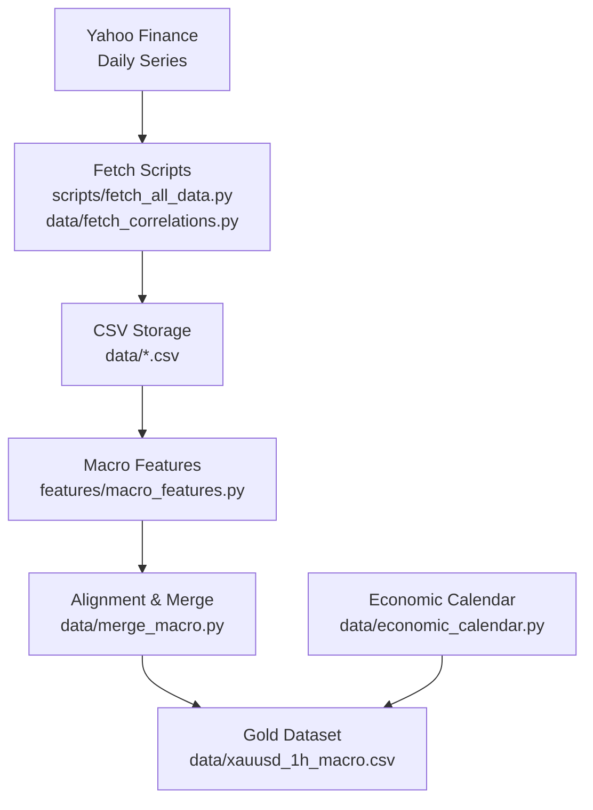
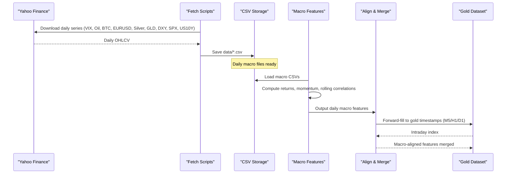
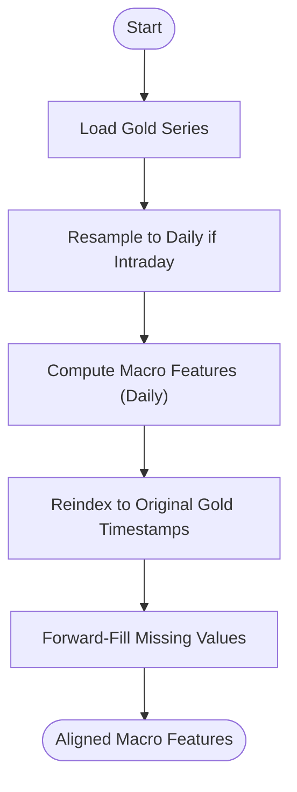
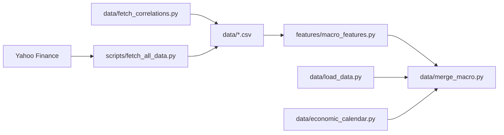

# Macro Correlation Engine

<cite>
**Referenced Files in This Document**
- [README.md](file://README.md)
- [fetch_all_data.py](file://scripts/fetch_all_data.py)
- [fetch_correlations.py](file://data/fetch_correlations.py)
- [macro_features.py](file://features/macro_features.py)
- [merge_macro.py](file://data/merge_macro.py)
- [load_data.py](file://data/load_data.py)
- [economic_calendar.py](file://data/economic_calendar.py)
</cite>

## Table of Contents
1. [Introduction](#introduction)
2. [Project Structure](#project-structure)
3. [Core Components](#core-components)
4. [Architecture Overview](#architecture-overview)
5. [Detailed Component Analysis](#detailed-component-analysis)
6. [Dependency Analysis](#dependency-analysis)
7. [Performance Considerations](#performance-considerations)
8. [Troubleshooting Guide](#troubleshooting-guide)
9. [Conclusion](#conclusion)
10. [Appendices](#appendices)

## Introduction
This document explains the macro correlation engine that integrates global market indicators into gold trading decisions. It covers how the system fetches and processes VIX, Oil (WTI), Bitcoin, DXY (US Dollar Index), SPX (S&P 500), US10Y yields, EURUSD, Silver, and GLD data using Yahoo Finance APIs; how it computes 24 macro correlation features; and how it synchronizes daily macro timestamps with intraday gold price series. It also provides examples of how macro correlations contextualize gold price movements during economic events and market stress periods.

## Project Structure
The macro correlation engine spans data acquisition, feature computation, and integration with gold price time series:
- Data acquisition scripts download daily macro series from Yahoo Finance and persist them as CSVs.
- A feature module computes 24 macro features per source and aligns them to gold’s timeframe.
- Utilities merge macro series into hourly gold datasets for modeling and backtesting.
- An economic calendar adds event-aware context around high-impact releases.

**Diagram sources**
- [fetch_all_data.py:27-128](file://scripts/fetch_all_data.py#L27-L128)
- [fetch_correlations.py:5-55](file://data/fetch_correlations.py#L5-L55)
- [macro_features.py:26-445](file://features/macro_features.py#L26-L445)
- [merge_macro.py:4-61](file://data/merge_macro.py#L4-L61)
- [economic_calendar.py:27-374](file://data/economic_calendar.py#L27-L374)

**Section sources**
- [README.md:90-109](file://README.md#L90-L109)
- [fetch_all_data.py:131-214](file://scripts/fetch_all_data.py#L131-L214)
- [macro_features.py:363-445](file://features/macro_features.py#L363-L445)
- [merge_macro.py:4-61](file://data/merge_macro.py#L4-L61)
- [economic_calendar.py:27-374](file://data/economic_calendar.py#L27-L374)

## Core Components
- Data fetchers:
  - scripts/fetch_all_data.py: downloads VIX, WTI Oil, Bitcoin, EURUSD, Silver, GLD, and optionally DXY via Yahoo Finance and saves daily CSVs.
  - data/fetch_correlations.py: demonstrates fetching a subset (gold futures, DXY, SPX, US10Y) and saving standardized CSVs.
- Feature computation:
  - features/macro_features.py: loads macro CSVs, normalizes timezones, computes returns/momentum/correlations, and produces 24 macro features aligned to gold.
- Alignment and merging:
  - data/merge_macro.py: merges daily macro close prices into an hourly gold dataset by forward-filling daily values to hourly timestamps.
- Data loading utilities:
  - data/load_data.py: standardizes OHLC formats and ensures consistent time columns for downstream processing.
- Economic calendar:
  - data/economic_calendar.py: tracks upcoming high-impact events and generates event-aware features used alongside macro signals.

**Section sources**
- [fetch_all_data.py:27-128](file://scripts/fetch_all_data.py#L27-L128)
- [fetch_correlations.py:5-55](file://data/fetch_correlations.py#L5-L55)
- [macro_features.py:26-445](file://features/macro_features.py#L26-L445)
- [merge_macro.py:4-61](file://data/merge_macro.py#L4-L61)
- [load_data.py:5-73](file://data/load_data.py#L5-L73)
- [economic_calendar.py:27-374](file://data/economic_calendar.py#L27-L374)

## Architecture Overview
The end-to-end flow:
1. Fetch daily macro series from Yahoo Finance and save to data/*.csv.
2. Load macro series and compute 24 macro features per source on daily frequency.
3. Align daily macro features to gold’s intraday index using forward-fill.
4. Optionally merge macro closes into hourly gold dataset for modeling.
5. Augment with economic calendar features around high-impact events.

**Diagram sources**
- [fetch_all_data.py:27-128](file://scripts/fetch_all_data.py#L27-L128)
- [macro_features.py:78-132](file://features/macro_features.py#L78-L132)
- [macro_features.py:363-445](file://features/macro_features.py#L363-L445)
- [merge_macro.py:4-61](file://data/merge_macro.py#L4-L61)

## Detailed Component Analysis

### Data Acquisition via Yahoo Finance
- scripts/fetch_all_data.py:
  - Uses yfinance to download daily series for VIX (^VIX), WTI Crude (CL=F), Bitcoin (BTC-USD), EURUSD (EURUSD=X), Silver (SI=F), GLD ETF (GLD), and optionally DXY (DX-Y.NYB).
  - Normalizes column names, selects relevant fields, and writes CSVs to data/.
  - Provides alignment helper to resample daily to hourly based on a reference index.
- data/fetch_correlations.py:
  - Demonstrates downloading a smaller set (GC=F, DX-Y.NYB, ^GSPC, ^TNX) with long history and saving standardized CSVs.

Key behaviors:
- Timezone handling: converts dates to datetime and standardizes column names.
- Error handling: logs warnings/errors when downloads fail or return empty data.
- Output format: CSV with a time column and OHLCV fields suitable for downstream processing.

**Section sources**
- [fetch_all_data.py:27-128](file://scripts/fetch_all_data.py#L27-L128)
- [fetch_all_data.py:131-214](file://scripts/fetch_all_data.py#L131-L214)
- [fetch_correlations.py:5-55](file://data/fetch_correlations.py#L5-L55)

### Macro Feature Computation (24 Features)
features/macro_features.py implements a modular pipeline:
- load_macro_data: reads daily macro CSVs, sets timezone-naive datetime indices, and extracts close prices.
- normalize_timezone: aligns any series to a reference index (e.g., gold’s index) by converting to UTC then removing tzinfo and forward-filling.
- compute_rolling_correlation: calculates rolling correlation between two series’ returns over a window (default 120 days).
- Per-source feature functions (each producing 3 features):
  - DXY: dxy_return, dxy_momentum, gold_dxy_correlation
  - SPX: spx_return, spx_momentum, gold_spx_correlation
  - US10Y: us10y_change, us10y_momentum, gold_yields_correlation
  - VIX: vix_level (normalized), vix_change, vix_regime (high fear threshold)
  - Oil: oil_return, oil_momentum, gold_oil_correlation
  - Bitcoin: btc_return, btc_momentum, gold_btc_correlation
  - EURUSD: eur_return, eur_momentum, gold_eur_correlation
  - Silver/GLD: gold_silver_ratio (normalized), gold_silver_correlation, gld_flow (proxy)
- compute_macro_features: orchestrates computing all features on daily gold series, then reindexes to original gold timeframe (intraday) via forward-fill.

Complexity notes:
- Rolling correlation uses pandas rolling operations; complexity scales with window size and number of bars.
- Timezone normalization and reindexing are O(n) relative to gold’s index length.

Output:
- A DataFrame of 24 macro features aligned to gold’s timestamps, filled with zeros where necessary.

**Section sources**
- [macro_features.py:26-75](file://features/macro_features.py#L26-L75)
- [macro_features.py:78-132](file://features/macro_features.py#L78-L132)
- [macro_features.py:135-360](file://features/macro_features.py#L135-L360)
- [macro_features.py:363-445](file://features/macro_features.py#L363-L445)

### Data Synchronization Mechanisms
- Daily to intraday alignment:
  - macro_features.py resamples gold to daily for macro alignment, computes features, then reindexes back to original intraday index using forward-fill.
- Hourly merge utility:
  - merge_macro.py loads master hourly gold data and merges daily macro closes by reindexing to master’s hourly timestamps and forward-filling gaps.
- Timezone normalization:
  - Both modules ensure timezone-naive indices before alignment to avoid misalignment across markets.

**Diagram sources**
- [macro_features.py:363-445](file://features/macro_features.py#L363-L445)
- [merge_macro.py:4-61](file://data/merge_macro.py#L4-L61)

**Section sources**
- [macro_features.py:78-132](file://features/macro_features.py#L78-L132)
- [macro_features.py:363-445](file://features/macro_features.py#L363-L445)
- [merge_macro.py:4-61](file://data/merge_macro.py#L4-L61)

### Economic Calendar Integration
- data/economic_calendar.py:
  - Tracks high-impact USD events (NFP, CPI, FOMC, GDP, etc.) and estimates expected volatility multipliers.
  - Generates features such as days/hours until next event, flags for event windows, one-hot encodings for event types, and volatility forecasts.
  - Can be applied to dataframes to augment macro features around event risk.

Use cases:
- Reduce exposure ahead of NFP/FOMC.
- Increase position sizing cautiously when no high-impact events are imminent.
- Adjust stop-loss widths based on expected volatility spikes.

**Section sources**
- [economic_calendar.py:27-374](file://data/economic_calendar.py#L27-L374)

## Dependency Analysis
- External dependencies:
  - yfinance for market data retrieval.
  - pandas/numpy for data manipulation and computations.
- Internal dependencies:
  - scripts/fetch_all_data.py depends on yfinance and writes CSVs consumed by features/macro_features.py.
  - data/fetch_correlations.py is a standalone example for fetching a subset of macro series.
  - features/macro_features.py depends on CSVs produced by fetch scripts and outputs aligned macro features.
  - data/merge_macro.py depends on load_data.py and merges macro closes into hourly gold datasets.
  - data/economic_calendar.py is independent but can be combined with macro features for event-aware modeling.

**Diagram sources**
- [fetch_all_data.py:27-128](file://scripts/fetch_all_data.py#L27-L128)
- [fetch_correlations.py:5-55](file://data/fetch_correlations.py#L5-L55)
- [macro_features.py:26-445](file://features/macro_features.py#L26-L445)
- [merge_macro.py:4-61](file://data/merge_macro.py#L4-L61)
- [load_data.py:5-73](file://data/load_data.py#L5-L73)
- [economic_calendar.py:27-374](file://data/economic_calendar.py#L27-L374)

**Section sources**
- [fetch_all_data.py:27-128](file://scripts/fetch_all_data.py#L27-L128)
- [macro_features.py:26-445](file://features/macro_features.py#L26-L445)
- [merge_macro.py:4-61](file://data/merge_macro.py#L4-L61)
- [load_data.py:5-73](file://data/load_data.py#L5-L73)
- [economic_calendar.py:27-374](file://data/economic_calendar.py#L27-L374)

## Performance Considerations
- Data freshness:
  - Daily macro series may lag intraday gold; forward-fill introduces staleness. Ensure frequent refresh cycles for live systems.
- Computational cost:
  - Rolling correlations over long windows (e.g., 120 days) can be expensive on large datasets. Consider vectorization and caching.
- Memory usage:
  - Intraday gold series can be large; aligning daily macro features via reindex and forward-fill increases memory footprint. Use chunked processing if needed.
- Robustness:
  - Handle missing data gracefully with ffill/bfill and explicit NaN checks. Validate OHLC ranges and time sorting in load_data.py.

[No sources needed since this section provides general guidance]

## Troubleshooting Guide
Common issues and resolutions:
- Yahoo Finance download failures:
  - Check network connectivity and symbol availability. The fetch scripts log warnings/errors and skip failed assets.
- Timezone mismatches:
  - Ensure all series are converted to timezone-naive indices before alignment. The macro features module handles conversion and warns if close prices are missing.
- Misaligned timestamps:
  - Verify that gold’s index is sorted and deduplicated. Use merge_macro.py’s reindex approach to align daily macro closes to hourly gold timestamps.
- Excessive NaNs after alignment:
  - Apply forward-fill and backward-fill strategies. Confirm that macro CSVs have contiguous daily coverage.
- Event calendar not found:
  - The economic calendar falls back to a default 2024 calendar if the JSON file is missing. Generate or supply a custom calendar as needed.

**Section sources**
- [fetch_all_data.py:27-128](file://scripts/fetch_all_data.py#L27-L128)
- [macro_features.py:26-75](file://features/macro_features.py#L26-L75)
- [merge_macro.py:4-61](file://data/merge_macro.py#L4-L61)
- [load_data.py:5-73](file://data/load_data.py#L5-L73)
- [economic_calendar.py:81-113](file://data/economic_calendar.py#L81-L113)

## Conclusion
The macro correlation engine integrates global market indicators to provide rich context for gold trading decisions. By fetching daily macro series from Yahoo Finance, computing 24 macro features, and synchronizing them with intraday gold timestamps, the system captures intermarket relationships, safe-haven flows, and risk sentiment. Combined with economic calendar awareness, it enables adaptive positioning around high-impact events and market stress periods.

[No sources needed since this section summarizes without analyzing specific files]

## Appendices

### 24 Macro Correlation Features Summary
- DXY (3): dxy_return, dxy_momentum, gold_dxy_correlation
- SPX (3): spx_return, spx_momentum, gold_spx_correlation
- US10Y (3): us10y_change, us10y_momentum, gold_yields_correlation
- VIX (3): vix_level, vix_change, vix_regime
- Oil (3): oil_return, oil_momentum, gold_oil_correlation
- Bitcoin (3): btc_return, btc_momentum, gold_btc_correlation
- EURUSD (3): eur_return, eur_momentum, gold_eur_correlation
- Silver/GLD (3): gold_silver_ratio, gold_silver_correlation, gld_flow

These features capture:
- Intermarket relationships (correlations with DXY, SPX, US10Y, Oil, BTC, EURUSD, Silver)
- Safe-haven flows (VIX regime, GLD flow proxy)
- Risk sentiment indicators (SPX/BTC momentum and correlations)

**Section sources**
- [macro_features.py:135-360](file://features/macro_features.py#L135-L360)

### Examples: Macro Context During Events and Stress
- Market stress (spiking VIX):
  - Rising VIX level and negative gold-VIX correlation shifts often signal flight-to-safety; models can increase gold exposure or widen stops.
- High-impact events (NFP/CPI/FOMC):
  - Economic calendar flags near-event windows; macro momentum and correlation changes can inform reduced position sizes or tighter risk controls.
- Dollar strength (rising DXY):
  - Negative gold-DXY correlation typically implies downward pressure on gold; traders may reduce longs or hedge with currency instruments.
- Equity rally (rising SPX):
  - Positive gold-SPX correlation during risk-on phases suggests lower safe-haven demand; adjust exposure accordingly.
- Commodity inflation (rising Oil):
  - Positive gold-Oil correlation can indicate inflation hedging demand; consider longer-duration positions if supported by other signals.

[No sources needed since this section provides conceptual examples grounded in computed features]