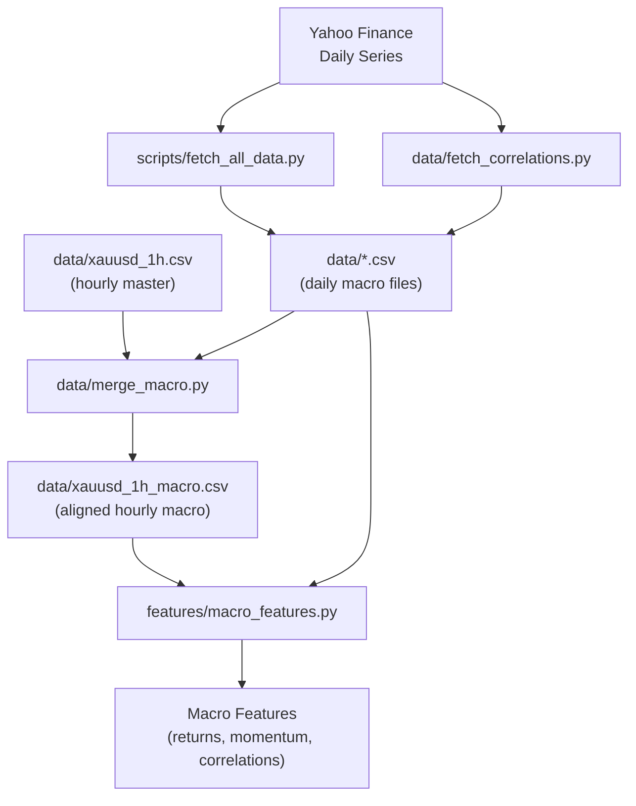
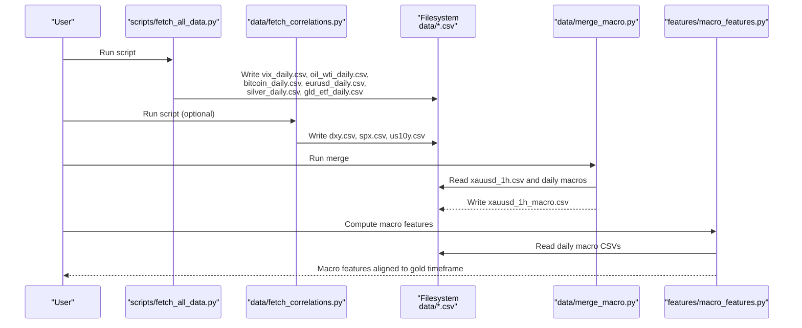
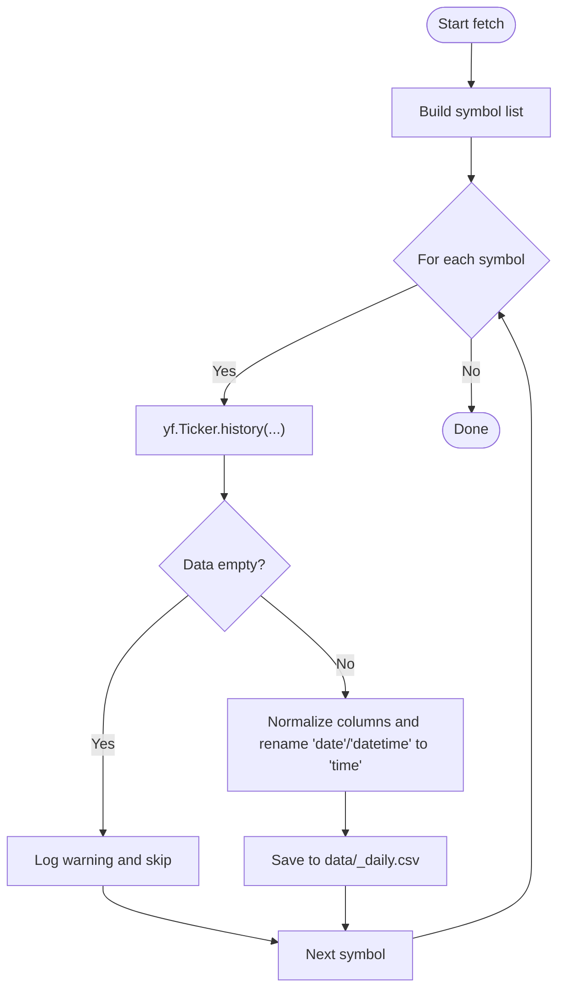
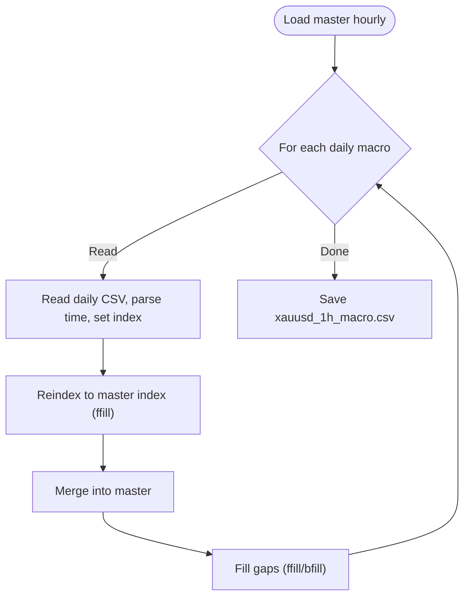
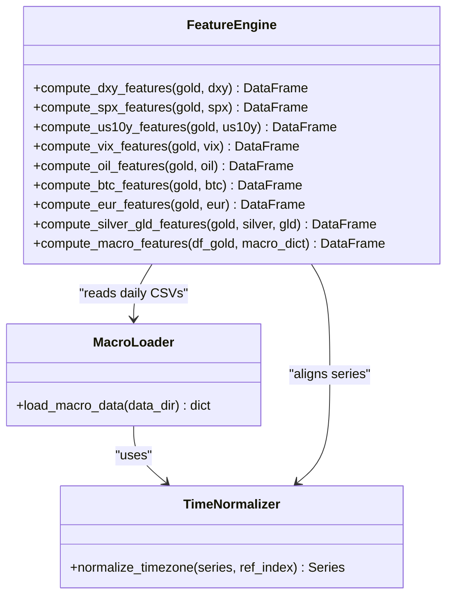
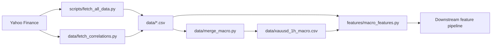

# Macro Data Fetching and Loading

<cite>
**Referenced Files in This Document**
- [fetch_all_data.py](file://scripts/fetch_all_data.py)
- [fetch_correlations.py](file://data/fetch_correlations.py)
- [load_data.py](file://data/load_data.py)
- [merge_macro.py](file://data/merge_macro.py)
- [macro_features.py](file://features/macro_features.py)
- [README.md](file://README.md)
</cite>

## Table of Contents
1. Introduction
2. Project Structure
3. Core Components
4. Architecture Overview
5. Detailed Component Analysis
6. Dependency Analysis
7. Performance Considerations
8. Troubleshooting Guide
9. Conclusion

## Introduction
This document explains the macro data fetching and loading system that retrieves global market indicators from Yahoo Finance and integrates them into the feature computation pipeline for gold trading. It covers how DXY (Dollar Index), SPX (S&P 500), US10Y (Treasury Yields), VIX (Fear Index), Oil (WTI Crude), Bitcoin, EURUSD, Silver, and GLD ETF data are fetched, stored, time-aligned, and consumed by macro feature engineering. It also documents timezone handling, automatic refresh mechanisms, configuration options, rate-limit considerations, missing data strategies, file layout, and integration points with the broader feature pipeline.

## Project Structure
The macro data workflow spans three layers:
- Data acquisition: scripts download daily series from Yahoo Finance and persist CSVs under data/.
- Data alignment: utilities normalize timestamps, merge daily macro series to hourly reference series, and produce a unified dataset.
- Feature computation: macro features are computed on daily series and forward-filled to intraday frequencies used by models.

**Diagram sources**
- [fetch_all_data.py:27-128](file://scripts/fetch_all_data.py#L27-L128)
- [fetch_correlations.py:5-51](file://data/fetch_correlations.py#L5-L51)
- [merge_macro.py:4-56](file://data/merge_macro.py#L4-L56)
- [macro_features.py:26-75](file://features/macro_features.py#L26-L75)

**Section sources**
- [README.md:172-186](file://README.md#L172-L186)
- [README.md:298-302](file://README.md#L298-L302)

## Core Components
- Daily fetcher (Yahoo Finance):
  - Centralized downloader using yfinance with symbol mapping and standardized output schema.
  - Persists daily OHLCV series as CSV files under data/.
- Correlation fetcher (optional):
  - Downloads additional macro series (DXY, SPX, US10Y) and saves to data/ for quick access.
- Loader and merger:
  - Loads hourly master series (e.g., XAUUSD), aligns daily macro series to hourly via forward-fill, and writes a merged hourly macro dataset.
- Macro feature engine:
  - Reads daily macro CSVs, normalizes timezones, computes returns, momentum, and rolling correlations with gold, then forward-fills to intraday frequency.

Key responsibilities:
- Consistent column naming and datetime normalization.
- Robust handling of missing data and holidays.
- Timezone-aware alignment to avoid mismatches.
- Modular design enabling selective inclusion of macro sources.

**Section sources**
- [fetch_all_data.py:27-128](file://scripts/fetch_all_data.py#L27-L128)
- [fetch_correlations.py:5-51](file://data/fetch_correlations.py#L5-L51)
- [merge_macro.py:4-56](file://data/merge_macro.py#L4-L56)
- [macro_features.py:26-75](file://features/macro_features.py#L26-L75)

## Architecture Overview
End-to-end flow from raw Yahoo Finance data to model-ready macro features:

**Diagram sources**
- [fetch_all_data.py:131-194](file://scripts/fetch_all_data.py#L131-L194)
- [fetch_correlations.py:20-51](file://data/fetch_correlations.py#L20-L51)
- [merge_macro.py:4-56](file://data/merge_macro.py#L4-L56)
- [macro_features.py:363-445](file://features/macro_features.py#L363-L445)

## Detailed Component Analysis

### Data Acquisition: Yahoo Finance Daily Series
- Purpose: Download daily OHLCV series for macro assets and save standardized CSVs.
- Symbols and outputs:
  - VIX → vix_daily.csv
  - Oil (WTI) → oil_wti_daily.csv
  - Bitcoin → bitcoin_daily.csv
  - EURUSD → eurusd_daily.csv
  - Silver → silver_daily.csv
  - GLD ETF → gld_etf_daily.csv
  - DXY (backup) → DX-Y.NYB symbol used when needed
- Standardization:
  - Columns normalized to lowercase; date/datetime renamed to time.
  - Only relevant columns retained (open, high, low, close, volume).
- Error handling:
  - Empty results and exceptions are logged; non-critical failures skip saving.
- Configuration:
  - Date range and data directory are configurable at the top of main().

**Diagram sources**
- [fetch_all_data.py:27-64](file://scripts/fetch_all_data.py#L27-L64)
- [fetch_all_data.py:67-101](file://scripts/fetch_all_data.py#L67-L101)
- [fetch_all_data.py:131-194](file://scripts/fetch_all_data.py#L131-L194)

**Section sources**
- [fetch_all_data.py:27-128](file://scripts/fetch_all_data.py#L27-L128)
- [fetch_all_data.py:131-194](file://scripts/fetch_all_data.py#L131-L194)

### Optional Correlation Fetcher: DXY, SPX, US10Y
- Purpose: Quickly fetch long-history daily series for key macro variables used in correlation-based features.
- Behavior:
  - Uses yf.download with daily interval and long period.
  - Normalizes MultiIndex columns and standardizes time column name.
  - Saves to data/dxy.csv, data/spx.csv, data/us10y.csv.

**Section sources**
- [fetch_correlations.py:5-51](file://data/fetch_correlations.py#L5-L51)

### Data Alignment: Merging Daily Macros to Hourly Master
- Purpose: Align daily macro series to an hourly master (e.g., XAUUSD H1) so features can be computed at intraday resolution.
- Process:
  - Load master hourly series and ensure naive timestamps.
  - For each daily macro CSV:
    - Parse time, set index, keep close price, reindex to master index with forward-fill.
    - Merge into master and fill remaining gaps.
  - Save merged dataset to data/xauusd_1h_macro.csv.

**Diagram sources**
- [merge_macro.py:4-56](file://data/merge_macro.py#L4-L56)

**Section sources**
- [merge_macro.py:4-56](file://data/merge_macro.py#L4-L56)

### Macro Feature Computation Pipeline
- Inputs:
  - Gold price series (intraday or daily).
  - Dictionary of daily macro series loaded from data/*.csv.
- Steps:
  - Load macro series, convert to UTC then remove timezone to ensure naive alignment.
  - For each macro source, compute:
    - Return (pct_change)
    - Momentum (e.g., 20-day pct_change)
    - Rolling correlation with gold (windowed)
  - Combine per-source feature DataFrames, fill NaNs, and forward-fill to original gold timeframe.
- Output:
  - A DataFrame of macro features aligned to gold timestamps, ready for modeling.

**Diagram sources**
- [macro_features.py:26-75](file://features/macro_features.py#L26-L75)
- [macro_features.py:78-111](file://features/macro_features.py#L78-L111)
- [macro_features.py:135-360](file://features/macro_features.py#L135-L360)
- [macro_features.py:363-445](file://features/macro_features.py#L363-L445)

**Section sources**
- [macro_features.py:26-75](file://features/macro_features.py#L26-L75)
- [macro_features.py:78-111](file://features/macro_features.py#L78-L111)
- [macro_features.py:135-360](file://features/macro_features.py#L135-L360)
- [macro_features.py:363-445](file://features/macro_features.py#L363-L445)

### Data Storage Format and File Layout
- Daily macro CSVs (from fetchers):
  - Columns: time, open, high, low, close, volume (lowercase).
  - Examples: vix_daily.csv, oil_wti_daily.csv, bitcoin_daily.csv, eurusd_daily.csv, silver_daily.csv, gld_etf_daily.csv, dxy.csv, spx.csv, us10y.csv.
- Hourly master:
  - Typically xauusd_1h.csv with time and OHLC.
- Merged hourly macro:
  - xauusd_1h_macro.csv contains master hourly rows plus aligned macro closes (e.g., dxy_close, spx_close, us10y_close).
- Loader behavior:
  - load_ohlc_csv supports MT5 angle-bracket columns and auto-detects separators; it builds a unified time column and ensures numeric OHLC.

**Section sources**
- [fetch_all_data.py:50-64](file://scripts/fetch_all_data.py#L50-L64)
- [fetch_correlations.py:28-46](file://data/fetch_correlations.py#L28-L46)
- [merge_macro.py:16-56](file://data/merge_macro.py#L16-L56)
- [load_data.py:5-73](file://data/load_data.py#L5-L73)

### Timezone Handling
- Daily fetchers:
  - Use Yahoo’s default time; after reading, times are parsed and treated consistently.
- Feature loader:
  - Converts time to UTC then removes timezone to create naive timestamps for reliable alignment.
- Merger:
  - Ensures master and daily series use naive timestamps before reindexing and merging.
- Result:
  - All series share a common naive DatetimeIndex, avoiding cross-timezone misalignment.

**Section sources**
- [macro_features.py:54-58](file://features/macro_features.py#L54-L58)
- [macro_features.py:78-111](file://features/macro_features.py#L78-L111)
- [merge_macro.py:10-12](file://data/merge_macro.py#L10-L12)
- [merge_macro.py:23-28](file://data/merge_macro.py#L23-L28)

### Automatic Data Refresh Mechanisms
- Manual refresh:
  - Re-run scripts/fetch_all_data.py to update daily macro CSVs.
  - Optionally run data/fetch_correlations.py to refresh DXY, SPX, US10Y.
- Integration:
  - After refreshing CSVs, re-run data/merge_macro.py to rebuild xauusd_1h_macro.csv.
  - Then recompute macro features via features/macro_features.py to propagate updates to downstream pipelines.

**Section sources**
- [fetch_all_data.py:131-194](file://scripts/fetch_all_data.py#L131-L194)
- [fetch_correlations.py:20-51](file://data/fetch_correlations.py#L20-L51)
- [merge_macro.py:4-56](file://data/merge_macro.py#L4-L56)
- [macro_features.py:363-445](file://features/macro_features.py#L363-L445)

### Configuring Data Sources
- Adjust date range and output directory in scripts/fetch_all_data.py main() to control history length and storage location.
- Add or remove symbols in fetch functions to tailor the macro universe.
- In features/macro_features.py, modify macro_files mapping to include/exclude specific datasets.

**Section sources**
- [fetch_all_data.py:131-194](file://scripts/fetch_all_data.py#L131-L194)
- [macro_features.py:37-47](file://features/macro_features.py#L37-L47)

### Handling API Rate Limits
- Yahoo Finance may throttle frequent requests. Recommendations:
  - Batch downloads within a single run to minimize repeated connections.
  - Add delays between requests if you extend the fetcher to many symbols.
  - Prefer daily intervals for long histories to reduce payload size.
  - Cache successful downloads locally; only refresh changed ranges.
  - If errors occur, retry with backoff and log failures for later inspection.

[No sources needed since this section provides general guidance]

### Managing Missing Data Scenarios
- During fetch:
  - Empty responses are logged and skipped; downstream components should tolerate missing files.
- During merge:
  - Daily series are forward-filled to match master timestamps; remaining gaps are filled via ffill/bfill.
- During feature computation:
  - Missing macro series are skipped with warnings; features are built only from available sources.
  - Final feature matrix is filled with zeros where necessary and aligned to gold timestamps.

**Section sources**
- [fetch_all_data.py:42-64](file://scripts/fetch_all_data.py#L42-L64)
- [merge_macro.py:33-47](file://data/merge_macro.py#L33-L47)
- [macro_features.py:51-72](file://features/macro_features.py#L51-L72)
- [macro_features.py:421-431](file://features/macro_features.py#L421-L431)

### Integration with Feature Computation Pipeline
- The macro feature module reads daily macro CSVs, computes per-source features, and aligns them to gold’s timeframe.
- Downstream training or evaluation pipelines consume these features alongside technical and multi-timeframe features to form the full observation vector.

**Section sources**
- [macro_features.py:363-445](file://features/macro_features.py#L363-L445)
- [README.md:172-186](file://README.md#L172-L186)

## Dependency Analysis
High-level dependencies among modules:

**Diagram sources**
- [fetch_all_data.py:131-194](file://scripts/fetch_all_data.py#L131-L194)
- [fetch_correlations.py:20-51](file://data/fetch_correlations.py#L20-L51)
- [merge_macro.py:4-56](file://data/merge_macro.py#L4-L56)
- [macro_features.py:363-445](file://features/macro_features.py#L363-L445)

**Section sources**
- [fetch_all_data.py:131-194](file://scripts/fetch_all_data.py#L131-L194)
- [fetch_correlations.py:20-51](file://data/fetch_correlations.py#L20-L51)
- [merge_macro.py:4-56](file://data/merge_macro.py#L4-L56)
- [macro_features.py:363-445](file://features/macro_features.py#L363-L445)

## Performance Considerations
- Use daily intervals for macro series to minimize network overhead and storage.
- Forward-fill daily values to hourly master to avoid expensive resampling operations.
- Limit rolling windows to reasonable sizes (e.g., 120 days) to balance responsiveness and performance.
- Cache intermediate results (merged hourly macro) to speed up repeated runs.
- Parallelize independent fetches if extending to more symbols, while respecting rate limits.

[No sources needed since this section provides general guidance]

## Troubleshooting Guide
Common issues and resolutions:
- No data returned from Yahoo Finance:
  - Verify symbol mappings and internet connectivity.
  - Check logs for warnings about empty results; rerun with adjusted date ranges.
- Missing macro CSV files:
  - Ensure fetch scripts ran successfully; confirm data/ directory exists and has write permissions.
- Timezone mismatch causing misalignment:
  - Confirm daily and master series use naive timestamps; rely on provided normalization routines.
- Excessive NaNs in features:
  - Inspect upstream merges for gaps; verify ffill/bfill steps and consider expanding lookback windows.
- Rate limiting or throttling:
  - Reduce request frequency, add delays, and implement retries with exponential backoff.

**Section sources**
- [fetch_all_data.py:42-64](file://scripts/fetch_all_data.py#L42-L64)
- [merge_macro.py:46-47](file://data/merge_macro.py#L46-L47)
- [macro_features.py:51-72](file://features/macro_features.py#L51-L72)
- [macro_features.py:421-431](file://features/macro_features.py#L421-L431)

## Conclusion
The macro data system provides a robust, modular pipeline to ingest global market indicators from Yahoo Finance, store them consistently, align them to intraday references, and compute predictive features for gold trading. With clear separation of concerns—fetching, merging, and feature computation—the system supports easy extension to new assets, resilient handling of missing data, and straightforward refresh workflows. Integrating these macro features into the broader feature pipeline enhances model awareness of macroeconomic regimes and improves decision-making across varying market conditions.