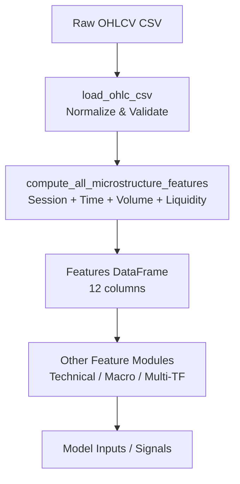
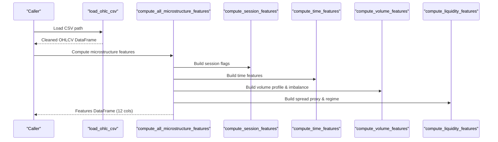
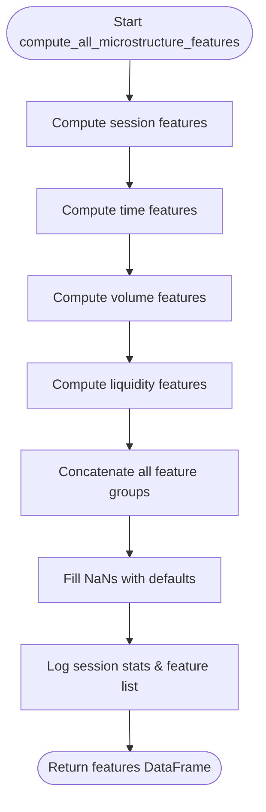
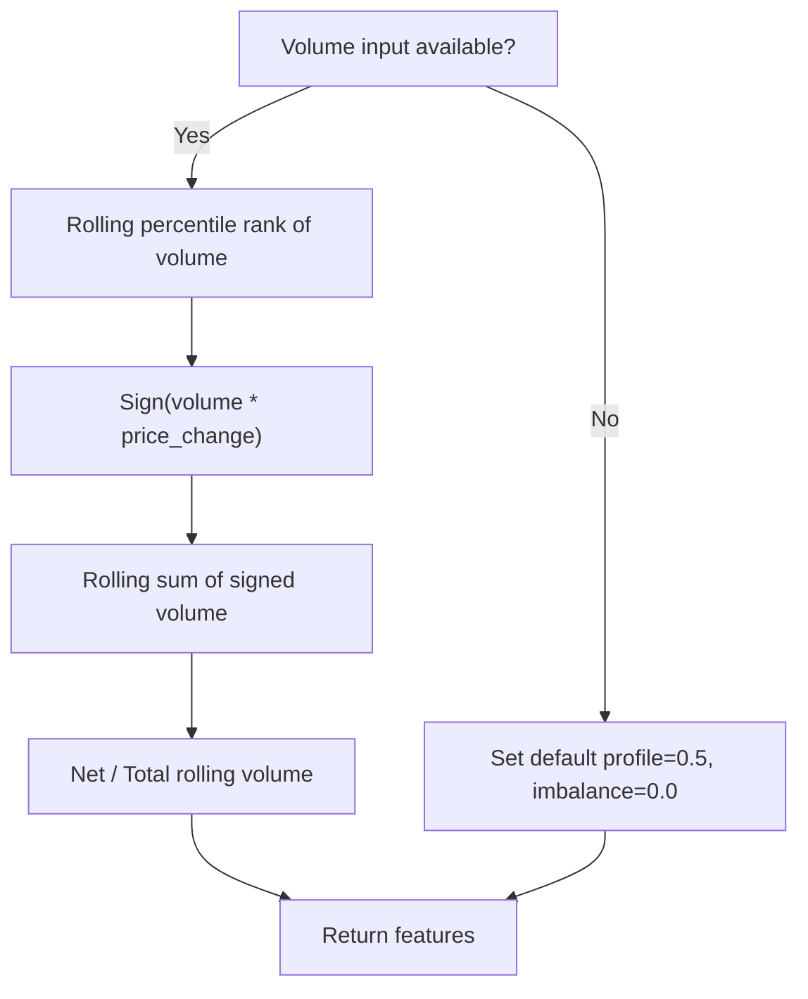
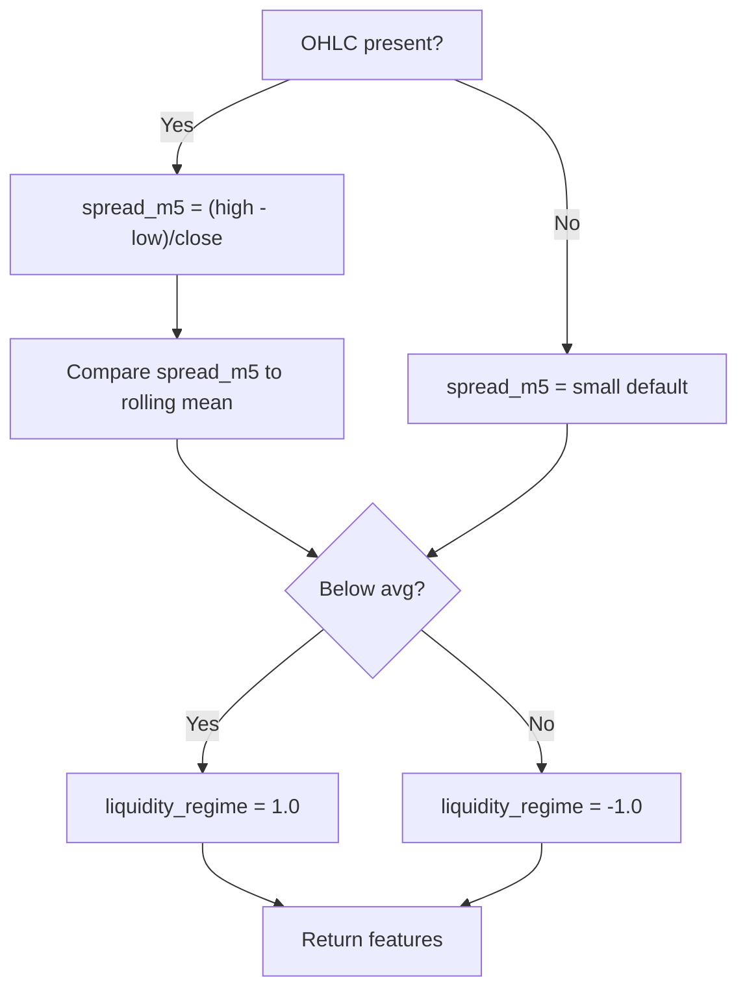
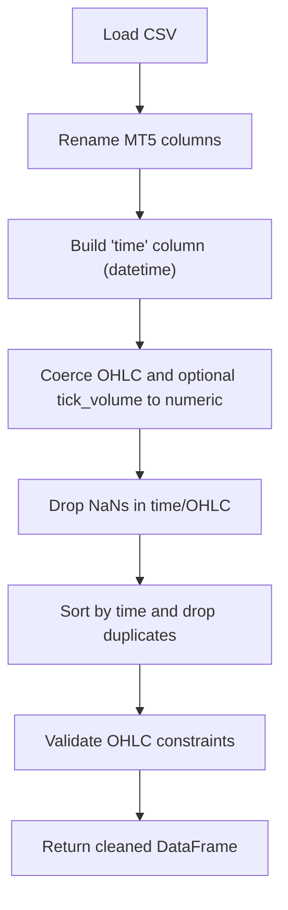
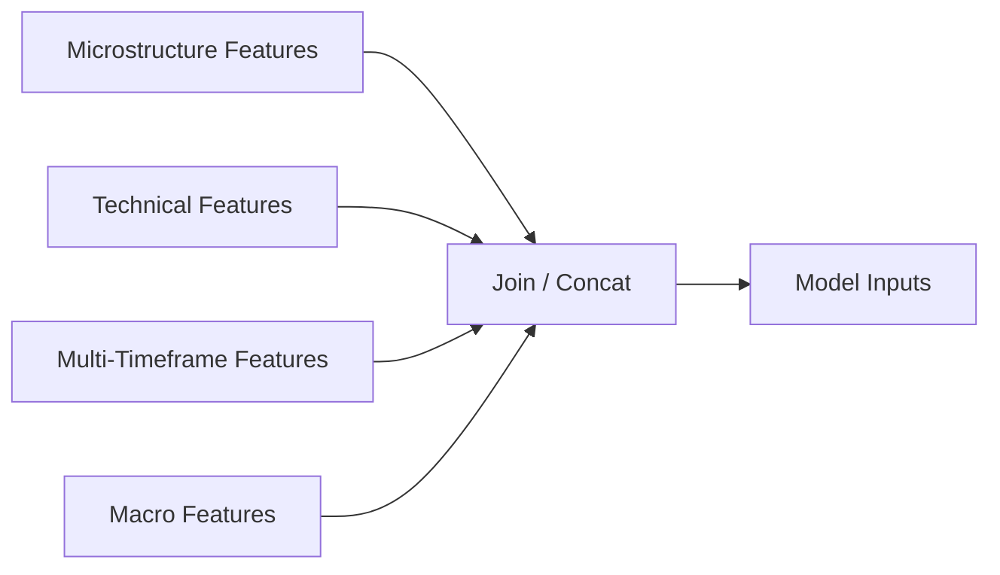
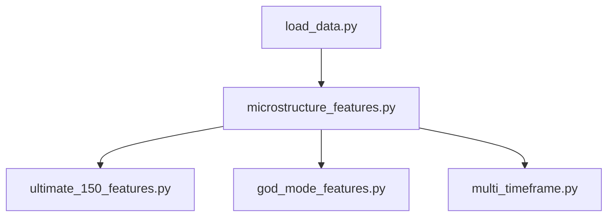

# Market Microstructure Analysis

<cite>
**Referenced Files in This Document**
- [microstructure_features.py](file://features/microstructure_features.py)
- [load_data.py](file://data/load_data.py)
- [make_features.py](file://features/make_features.py)
- [god_mode_features.py](file://features/god_mode_features.py)
- [multi_timeframe.py](file://features/multi_timeframe.py)
- [ultimate_150_features.py](file://features/ultimate_150_features.py)
</cite>

## Table of Contents
1. [Introduction](#introduction)
2. [Project Structure](#project-structure)
3. [Core Components](#core-components)
4. [Architecture Overview](#architecture-overview)
5. [Detailed Component Analysis](#detailed-component-analysis)
6. [Dependency Analysis](#dependency-analysis)
7. [Performance Considerations](#performance-considerations)
8. [Troubleshooting Guide](#troubleshooting-guide)
9. [Conclusion](#conclusion)
10. [Appendices](#appendices)

## Introduction
This document explains the market microstructure analysis module that extracts order flow and liquidity insights from tick-level or intraday data to support trading decisions. The module computes 12 microstructure features grouped into four categories: session effects, time effects, volume analysis, and liquidity conditions. These features capture intraday patterns and market mechanics such as bid-ask spread dynamics, order book imbalance proxies, trade size distributions, and volatility clustering patterns.

The system also integrates with broader feature pipelines (technical indicators, macro correlations, multi-timeframe context) to provide early warning signals for trend reversals and breakout opportunities. Preprocessing steps handle loading, cleaning, aggregation, and noise filtering to ensure robust feature computation on real-world data.

## Project Structure
The microstructure module resides under features and is designed to be composable with other feature modules. Data ingestion and normalization are handled by a shared loader, while higher-level pipelines integrate microstructure features into comprehensive models.

**Diagram sources**
- [load_data.py:5-73](file://data/load_data.py#L5-L73)
- [microstructure_features.py:170-225](file://features/microstructure_features.py#L170-L225)
- [god_mode_features.py:291-379](file://features/god_mode_features.py#L291-L379)
- [multi_timeframe.py:55-96](file://features/multi_timeframe.py#L55-L96)

**Section sources**
- [load_data.py:5-73](file://data/load_data.py#L5-L73)
- [microstructure_features.py:170-225](file://features/microstructure_features.py#L170-L225)

## Core Components
- Session Effects (4): Binary flags for Asian, London, New York sessions, plus an overlap flag during high-liquidity periods.
- Time Effects (4): Normalized hour-of-day, day-of-week, week-of-month regime, and month-of-year seasonality.
- Volume Analysis (2): Rolling volume percentile profile and signed volume imbalance proxy derived from price direction.
- Liquidity (2): Spread proxy computed from intraday range relative to close, and a liquidity regime indicator comparing current spread to rolling average.

These 12 features are computed via a single orchestrator function that combines outputs from each sub-computation and fills missing values to produce a clean feature matrix.

**Section sources**
- [microstructure_features.py:22-51](file://features/microstructure_features.py#L22-L51)
- [microstructure_features.py:54-86](file://features/microstructure_features.py#L54-L86)
- [microstructure_features.py:89-130](file://features/microstructure_features.py#L89-L130)
- [microstructure_features.py:133-167](file://features/microstructure_features.py#L133-L167)
- [microstructure_features.py:170-225](file://features/microstructure_features.py#L170-L225)

## Architecture Overview
The pipeline ingests raw OHLCV data, normalizes it, and then computes microstructure features. Higher-level modules can consume these features alongside technical and macro features to form model inputs.

**Diagram sources**
- [load_data.py:5-73](file://data/load_data.py#L5-L73)
- [microstructure_features.py:170-225](file://features/microstructure_features.py#L170-L225)

## Detailed Component Analysis

### Microstructure Feature Engine
The engine computes four groups of features and concatenates them into a unified output. It logs progress and provides summary statistics for session distribution and feature names.

**Diagram sources**
- [microstructure_features.py:170-225](file://features/microstructure_features.py#L170-L225)

**Section sources**
- [microstructure_features.py:170-225](file://features/microstructure_features.py#L170-L225)

### Session Effects
- Computes binary session flags based on UTC hours:
  - Asian: 00:00–09:00
  - London: 08:00–17:00
  - New York: 13:00–22:00
  - Overlap: 13:00–17:00 (London + NY)
- Outputs normalized floats (0/1) suitable for modeling.

**Section sources**
- [microstructure_features.py:22-51](file://features/microstructure_features.py#L22-L51)

### Time Effects
- Hour-of-day normalized to [0,1]
- Day-of-week normalized to [0,1]
- Week-of-month regime: first week vs last week vs middle
- Month-of-year normalized to [0,1]

**Section sources**
- [microstructure_features.py:54-86](file://features/microstructure_features.py#L54-L86)

### Volume Analysis
- Volume Profile: rolling percentile rank over a window to gauge current volume relative to recent history.
- Volume Imbalance Proxy: signed volume using price change direction; rolling net volume divided by total volume to estimate buy/sell pressure.

**Diagram sources**
- [microstructure_features.py:89-130](file://features/microstructure_features.py#L89-L130)

**Section sources**
- [microstructure_features.py:89-130](file://features/microstructure_features.py#L89-L130)

### Liquidity Conditions
- Spread Proxy: (high - low) / close as a per-bar measure of intraday volatility/spread.
- Liquidity Regime: compares current spread to rolling average; assigns +1 for high liquidity (low spread) and -1 for low liquidity (high spread).

**Diagram sources**
- [microstructure_features.py:133-167](file://features/microstructure_features.py#L133-L167)

**Section sources**
- [microstructure_features.py:133-167](file://features/microstructure_features.py#L133-L167)

### Data Preprocessing and Aggregation
- Loads CSV with auto delimiter detection and renames MT5-style columns to standardized names.
- Combines date and time into a datetime index, coerces numeric types, drops invalid rows, sorts, and deduplicates by time.
- Performs sanity checks on OHLC relationships to prevent malformed data from propagating.
- Optionally retains macro-related columns if present.

**Diagram sources**
- [load_data.py:5-73](file://data/load_data.py#L5-L73)

**Section sources**
- [load_data.py:5-73](file://data/load_data.py#L5-L73)

### Integration with Broader Feature Pipelines
- Technical features (returns, volatility, momentum, moving averages, RSI, MACD) are computed in a separate module and can be combined with microstructure features.
- Multi-timeframe features align lower and higher timeframe signals to strengthen or weaken entries based on trend alignment and momentum cascade.
- Macro features add cross-asset correlations (e.g., gold vs dollar index, equity indices, yields) to contextualize microstructure signals.

**Diagram sources**
- [make_features.py:18-78](file://features/make_features.py#L18-L78)
- [multi_timeframe.py:55-96](file://features/multi_timeframe.py#L55-L96)
- [god_mode_features.py:291-379](file://features/god_mode_features.py#L291-L379)

**Section sources**
- [make_features.py:18-78](file://features/make_features.py#L18-L78)
- [multi_timeframe.py:55-96](file://features/multi_timeframe.py#L55-L96)
- [god_mode_features.py:291-379](file://features/god_mode_features.py#L291-L379)

## Dependency Analysis
- Microstructure features depend only on pandas/numpy and require a DatetimeIndex with OHLCV columns.
- Data loader depends on file existence and column presence; raises errors for missing files or invalid OHLC.
- Higher-level modules may import microstructure features to augment their feature sets.

**Diagram sources**
- [load_data.py:5-73](file://data/load_data.py#L5-L73)
- [microstructure_features.py:170-225](file://features/microstructure_features.py#L170-L225)
- [ultimate_150_features.py:110-149](file://features/ultimate_150_features.py#L110-L149)
- [god_mode_features.py:291-379](file://features/god_mode_features.py#L291-L379)
- [multi_timeframe.py:55-96](file://features/multi_timeframe.py#L55-L96)

**Section sources**
- [load_data.py:5-73](file://data/load_data.py#L5-L73)
- [microstructure_features.py:170-225](file://features/microstructure_features.py#L170-L225)
- [ultimate_150_features.py:110-149](file://features/ultimate_150_features.py#L110-L149)
- [god_mode_features.py:291-379](file://features/god_mode_features.py#L291-L379)
- [multi_timeframe.py:55-96](file://features/multi_timeframe.py#L55-L96)

## Performance Considerations
- Vectorized operations: All computations use pandas/numpy vectorization for efficiency.
- Rolling windows: Use moderate window sizes (e.g., 20–100) to balance responsiveness and stability.
- Memory footprint: Keep feature sets minimal; avoid unnecessary copies.
- Logging: Enable logging at appropriate levels to monitor performance without excessive overhead.

[No sources needed since this section provides general guidance]

## Troubleshooting Guide
Common issues and resolutions:
- Missing OHLC columns: Ensure the dataset includes open, high, low, close; otherwise spread and regime features will fall back to defaults.
- Invalid OHLC: The loader enforces high >= max(open, close, low) and low <= min(open, close, high); fix upstream data generation if violated.
- No volume data: Volume features default to neutral values; consider adding tick_volume or volume for richer signals.
- Stale timestamps: Ensure the index is sorted and deduplicated; resample carefully when aggregating across timeframes.

**Section sources**
- [load_data.py:42-73](file://data/load_data.py#L42-L73)
- [microstructure_features.py:101-105](file://features/microstructure_features.py#L101-L105)
- [microstructure_features.py:145-167](file://features/microstructure_features.py#L145-L167)

## Conclusion
The microstructure module delivers a concise set of 12 features that quantify session timing, temporal patterns, volume dynamics, and liquidity regimes. When integrated with technical, macro, and multi-timeframe features, these signals can help identify early warnings for trend reversals and breakouts. Robust preprocessing ensures reliable operation on noisy tick-level or intraday datasets.

[No sources needed since this section summarizes without analyzing specific files]

## Appendices

### Practical Examples: Using Microstructure Features for Early Warning Signals
- Trend Reversal Signal:
  - Observe rising volume imbalance alongside widening spread proxy and transition to low liquidity regime.
  - Cross-check with multi-timeframe trend alignment weakening and momentum cascade turning negative.
  - Example paths:
    - [Volume imbalance logic:116-130](file://features/microstructure_features.py#L116-L130)
    - [Liquidity regime logic:153-167](file://features/microstructure_features.py#L153-L167)
    - [Cross-timeframe alignment:188-220](file://features/multi_timeframe.py#L188-L220)
    - [Momentum cascade:222-245](file://features/multi_timeframe.py#L222-L245)

- Breakout Opportunity:
  - Narrow spread proxy followed by expanding volume profile and positive volume imbalance.
  - Confirm with session overlap period and aligned trends across timeframes.
  - Example paths:
    - [Spread proxy:145-152](file://features/microstructure_features.py#L145-L152)
    - [Volume profile:109-114](file://features/microstructure_features.py#L109-L114)
    - [Session overlap:48-50](file://features/microstructure_features.py#L48-L50)
    - [Trend alignment:188-220](file://features/multi_timeframe.py#L188-L220)

[No sources needed since this section provides conceptual usage examples]