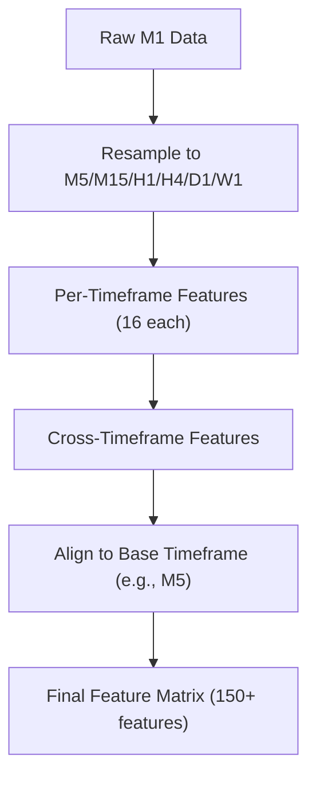
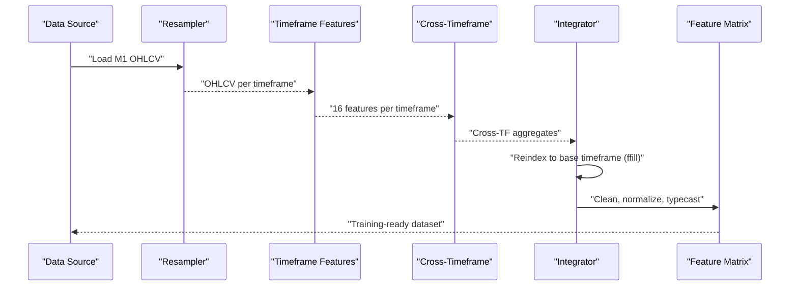
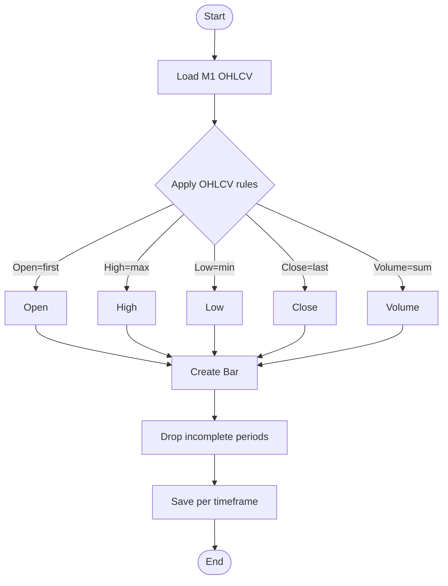
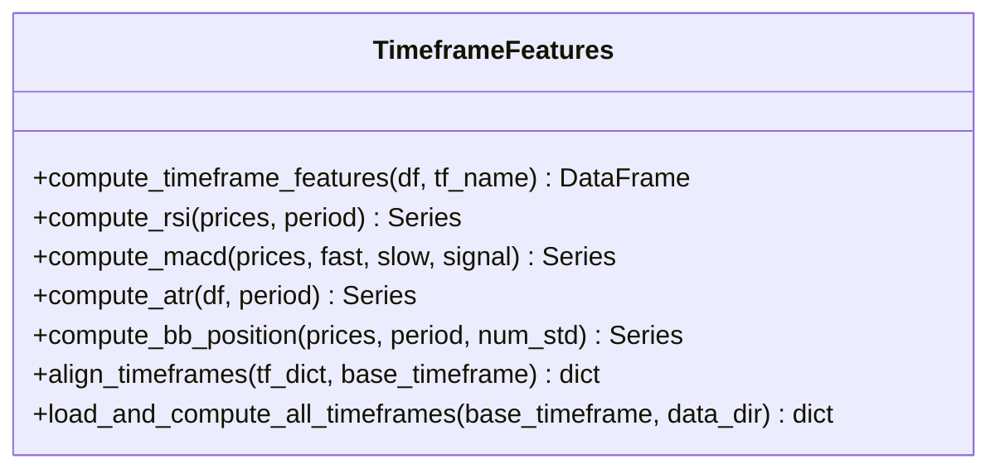
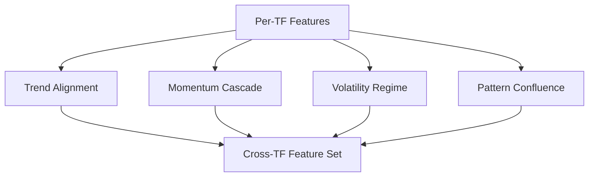
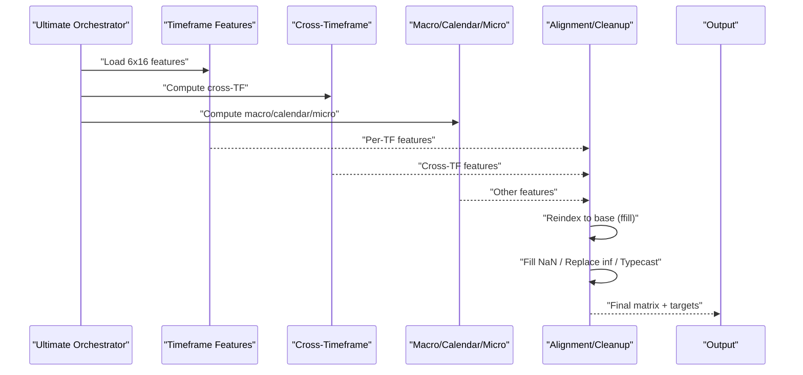

# Multi-Timeframe Analysis

<cite>
**Referenced Files in This Document**
- [multi_timeframe.py](file://features/multi_timeframe.py)
- [timeframe_features.py](file://features/timeframe_features.py)
- [cross_timeframe.py](file://features/cross_timeframe.py)
- [microstructure_features.py](file://features/microstructure_features.py)
- [ultimate_150_features.py](file://features/ultimate_150_features.py)
- [resample_m1_to_all_timeframes.py](file://scripts/resample_m1_to_all_timeframes.py)
</cite>

## Table of Contents
1. [Introduction](#introduction)
2. [Project Structure](#project-structure)
3. [Core Components](#core-components)
4. [Architecture Overview](#architecture-overview)
5. [Detailed Component Analysis](#detailed-component-analysis)
6. [Dependency Analysis](#dependency-analysis)
7. [Performance Considerations](#performance-considerations)
8. [Troubleshooting Guide](#troubleshooting-guide)
9. [Conclusion](#conclusion)
10. [Appendices](#appendices)

## Introduction
This document explains the multi-timeframe analysis system that processes market data across six timeframes (M5, M15, H1, H4, D1, W1). It details how 16 technical indicators are computed per timeframe, including moving averages, RSI, MACD, Bollinger Bands, and volume-based indicators. It also documents the resampling mechanism that converts higher-frequency data to lower timeframes while preserving OHLCV microstructure, and describes the feature computation pipeline for missing data handling, normalization, and temporal alignment across all timeframes. Finally, it provides examples of how timeframe-specific features capture different market dynamics from short-term noise to long-term trends.

## Project Structure
The multi-timeframe system is implemented as a modular feature pipeline:
- Data resampling from minute-level to multiple timeframes
- Per-timeframe feature extraction (16 indicators each)
- Cross-timeframe aggregation features
- Integration into a unified feature matrix aligned to a base timeframe

**Diagram sources**
- [resample_m1_to_all_timeframes.py:61-88](file://scripts/resample_m1_to_all_timeframes.py#L61-L88)
- [timeframe_features.py:22-99](file://features/timeframe_features.py#L22-L99)
- [cross_timeframe.py:205-249](file://features/cross_timeframe.py#L205-L249)
- [ultimate_150_features.py:27-226](file://features/ultimate_150_features.py#L27-L226)

**Section sources**
- [resample_m1_to_all_timeframes.py:1-172](file://scripts/resample_m1_to_all_timeframes.py#L1-L172)
- [timeframe_features.py:1-356](file://features/timeframe_features.py#L1-L356)
- [cross_timeframe.py:1-309](file://features/cross_timeframe.py#L1-L309)
- [ultimate_150_features.py:1-294](file://features/ultimate_150_features.py#L1-L294)

## Core Components
- Resampling engine: Converts high-resolution M1 data into consistent OHLCV bars for M5, M15, H1, H4, D1, and optionally W1.
- Timeframe feature extractor: Computes 16 standardized indicators per timeframe with robust normalization and missing value handling.
- Cross-timeframe aggregator: Derives hierarchical signals such as trend alignment, momentum cascade, volatility regime, and support/resistance confluence.
- Integration orchestrator: Aligns all features to a common base index, cleans data, and produces a final training-ready matrix.

Key responsibilities:
- Preserve market microstructure via correct OHLCV aggregation rules during resampling.
- Normalize indicators to stable ranges suitable for machine learning.
- Ensure temporal consistency by forward-filling higher timeframes to the base index.

**Section sources**
- [resample_m1_to_all_timeframes.py:61-88](file://scripts/resample_m1_to_all_timeframes.py#L61-L88)
- [timeframe_features.py:22-99](file://features/timeframe_features.py#L22-L99)
- [cross_timeframe.py:205-249](file://features/cross_timeframe.py#L205-L249)
- [ultimate_150_features.py:27-226](file://features/ultimate_150_features.py#L27-L226)

## Architecture Overview
The system follows a layered architecture:
- Data Layer: Raw tick or minute data loaded and resampled to standard OHLCV bars.
- Feature Layer: Per-timeframe technical indicators computed independently.
- Aggregation Layer: Cross-timeframe features combine signals across scales.
- Alignment Layer: All features reindexed to a base timeframe using forward-fill to maintain temporal integrity.
- Output Layer: Cleaned, normalized, and typed feature matrix ready for modeling.

**Diagram sources**
- [resample_m1_to_all_timeframes.py:61-88](file://scripts/resample_m1_to_all_timeframes.py#L61-L88)
- [timeframe_features.py:22-99](file://features/timeframe_features.py#L22-L99)
- [cross_timeframe.py:205-249](file://features/cross_timeframe.py#L205-L249)
- [ultimate_150_features.py:123-173](file://features/ultimate_150_features.py#L123-L173)

## Detailed Component Analysis

### Resampling Mechanism
- Purpose: Convert high-frequency M1 data into consistent lower timeframes while preserving market microstructure.
- Method: Uses OHLCV aggregation rules:
  - Open: first price in the period
  - High: maximum price
  - Low: minimum price
  - Close: last price
  - Volume: sum over the period
- Output: Separate DataFrames per timeframe with datetime indices sorted chronologically.
- Microstructure preservation: By aggregating OHLCV correctly, intraday extremes and volume are retained, enabling accurate indicator computation on derived bars.

**Diagram sources**
- [resample_m1_to_all_timeframes.py:61-88](file://scripts/resample_m1_to_all_timeframes.py#L61-L88)

**Section sources**
- [resample_m1_to_all_timeframes.py:23-58](file://scripts/resample_m1_to_all_timeframes.py#L23-L58)
- [resample_m1_to_all_timeframes.py:61-88](file://scripts/resample_m1_to_all_timeframes.py#L61-L88)
- [resample_m1_to_all_timeframes.py:103-166](file://scripts/resample_m1_to_all_timeframes.py#L103-L166)

### Timeframe Feature Extraction (16 Indicators)
Each timeframe computes a consistent set of 16 features designed for ML stability:
- Price Action (5): return, volatility (rolling std), momentum at 5/10/20 periods
- Trend Indicators (4): fast MA deviation, slow MA deviation, normalized MA difference, trend direction (+1/-1)
- Technical Indicators (4): RSI (normalized 0–1), MACD histogram normalized by price, ATR as percentage of price, Bollinger Band position (clipped 0–1)
- Volume & Support/Resistance (3): volume ratio vs rolling average, distance to recent high/low (50-period)

Normalization and missing data handling:
- Rolling windows produce initial NaNs; these are filled with neutral values (e.g., 0 or 0.5) to ensure continuity.
- Indicators like RSI and BB position are bounded to meaningful ranges.
- MACD is normalized by price to stabilize scale across assets and time.

**Diagram sources**
- [timeframe_features.py:22-99](file://features/timeframe_features.py#L22-L99)
- [timeframe_features.py:102-178](file://features/timeframe_features.py#L102-L178)
- [timeframe_features.py:207-233](file://features/timeframe_features.py#L207-L233)
- [timeframe_features.py:236-304](file://features/timeframe_features.py#L236-L304)

**Section sources**
- [timeframe_features.py:22-99](file://features/timeframe_features.py#L22-L99)
- [timeframe_features.py:102-178](file://features/timeframe_features.py#L102-L178)
- [timeframe_features.py:207-233](file://features/timeframe_features.py#L207-L233)
- [timeframe_features.py:236-304](file://features/timeframe_features.py#L236-L304)

### Cross-Timeframe Aggregation
Cross-timeframe features synthesize relationships across scales:
- Trend Alignment: Average trend agreement across M5/M15/H1/H4/D1; trend strength cascade by multiplying higher-to-lower trends; divergence measured by cross-TF trend variance.
- Momentum Cascade: Interaction terms between adjacent timeframes (e.g., D1×H1, H4×H1, H1×M15) to amplify coherent momentum flows.
- Volatility Regime: Current volatility relative to long-term average; binary flags for spikes and compression.
- Pattern Confluence: Counts of timeframes near support/resistance; breakout alignment when multiple timeframes show directional momentum.

These features capture hierarchical market structure and improve model awareness of regime shifts and confluences.

**Diagram sources**
- [cross_timeframe.py:21-66](file://features/cross_timeframe.py#L21-L66)
- [cross_timeframe.py:69-102](file://features/cross_timeframe.py#L69-L102)
- [cross_timeframe.py:105-138](file://features/cross_timeframe.py#L105-L138)
- [cross_timeframe.py:141-202](file://features/cross_timeframe.py#L141-L202)
- [cross_timeframe.py:205-249](file://features/cross_timeframe.py#L205-L249)

**Section sources**
- [cross_timeframe.py:21-66](file://features/cross_timeframe.py#L21-L66)
- [cross_timeframe.py:69-102](file://features/cross_timeframe.py#L69-L102)
- [cross_timeframe.py:105-138](file://features/cross_timeframe.py#L105-L138)
- [cross_timeframe.py:141-202](file://features/cross_timeframe.py#L141-L202)
- [cross_timeframe.py:205-249](file://features/cross_timeframe.py#L205-L249)

### Integration and Final Feature Matrix
The integration module orchestrates the full pipeline:
- Loads timeframe features for all six timeframes (W1 optional).
- Computes cross-timeframe features.
- Adds macro, calendar, and microstructure features.
- Reindexes all components to a base timeframe using forward-fill to preserve temporal alignment.
- Cleans data: fills NaNs, replaces infinities, casts to float32 for memory efficiency.
- Produces target returns based on base timeframe close prices.

**Diagram sources**
- [ultimate_150_features.py:27-226](file://features/ultimate_150_features.py#L27-L226)

**Section sources**
- [ultimate_150_features.py:27-226](file://features/ultimate_150_features.py#L27-L226)

### Examples of Timeframe-Specific Dynamics
- M5 (short-term noise and entry timing): Captures rapid momentum shifts and micro-volatility spikes; useful for precise entries and quick exits.
- M15/H1 (intraday trends): Balances responsiveness and smoothing; identifies prevailing intraday direction and local support/resistance.
- H4/D1 (swing and major trends): Filters out noise; highlights structural moves and regime changes; essential for trend-following strategies.
- W1 (structural context): Provides long-term anchors for support/resistance and macro trend bias.

These layers enable the model to weigh short-term signals against longer-term context, improving robustness across regimes.

[No sources needed since this section synthesizes conceptual insights without analyzing specific files]

## Dependency Analysis
The modules have clear dependencies:
- ultimate_150_features.py depends on timeframe_features.py, cross_timeframe.py, and other feature modules.
- timeframe_features.py provides foundational indicators used by cross_timeframe.py.
- cross_timeframe.py relies on per-timeframe outputs to compute aggregated signals.
- resample_m1_to_all_timeframes.py supplies the raw OHLCV inputs for downstream processing.

**Diagram sources**
- [resample_m1_to_all_timeframes.py:61-88](file://scripts/resample_m1_to_all_timeframes.py#L61-L88)
- [timeframe_features.py:236-304](file://features/timeframe_features.py#L236-L304)
- [cross_timeframe.py:205-249](file://features/cross_timeframe.py#L205-L249)
- [ultimate_150_features.py:27-226](file://features/ultimate_150_features.py#L27-L226)

**Section sources**
- [ultimate_150_features.py:47-154](file://features/ultimate_150_features.py#L47-L154)
- [timeframe_features.py:236-304](file://features/timeframe_features.py#L236-L304)
- [cross_timeframe.py:205-249](file://features/cross_timeframe.py#L205-L249)

## Performance Considerations
- Memory usage: The final matrix can be large; casting to float32 reduces memory footprint significantly.
- Computation cost: Rolling windows and EWMA operations dominate runtime; vectorized pandas/numpy operations are used efficiently.
- Alignment overhead: Forward-filling higher timeframes to the base index is lightweight but should be applied once per run.
- I/O: Reading and writing multiple CSVs can be a bottleneck; consider batching or using efficient formats if scaling up.

[No sources needed since this section provides general guidance]

## Troubleshooting Guide
Common issues and resolutions:
- Missing OHLCV columns: Ensure input DataFrames include open, high, low, close, and volume before computing features.
- Excessive NaNs after resampling: Incomplete periods may produce NaNs; drop them or pad appropriately before feature computation.
- Misaligned timestamps: Use the provided alignment function to forward-fill higher timeframes to the base index consistently.
- Infinite values: Replace infinities with zeros prior to training to avoid numerical instability.
- Optional W1 data: If weekly data is unavailable, the pipeline gracefully skips W1 and continues with other timeframes.

**Section sources**
- [timeframe_features.py:181-204](file://features/timeframe_features.py#L181-L204)
- [timeframe_features.py:207-233](file://features/timeframe_features.py#L207-L233)
- [ultimate_150_features.py:156-173](file://features/ultimate_150_features.py#L156-L173)
- [ultimate_150_features.py:175-181](file://features/ultimate_150_features.py#L175-L181)

## Conclusion
The multi-timeframe analysis system provides a comprehensive, scalable pipeline for extracting rich, normalized features across six timeframes. By combining per-timeframe technical indicators with cross-timeframe aggregations and aligning everything to a base timeframe, the system captures both short-term noise and long-term trends. The resampling mechanism preserves market microstructure, ensuring indicators reflect true price action and volume dynamics. The resulting feature matrix is clean, normalized, and optimized for machine learning, enabling robust trading models that leverage multi-scale market intelligence.

[No sources needed since this section summarizes without analyzing specific files]

## Appendices

### Indicator Reference Summary
- Moving Averages: Fast and slow MAs with normalized differences and trend direction.
- RSI: Relative Strength Index normalized to 0–1.
- MACD: Histogram normalized by price for scale stability.
- Bollinger Bands: Position within bands clipped to 0–1.
- ATR: Average True Range expressed as a percentage of price.
- Volume: Ratio of current volume to rolling average; imbalance proxies where applicable.
- Support/Resistance: Distance to recent highs/lows to detect proximity to key levels.

**Section sources**
- [timeframe_features.py:37-92](file://features/timeframe_features.py#L37-L92)
- [timeframe_features.py:102-178](file://features/timeframe_features.py#L102-L178)