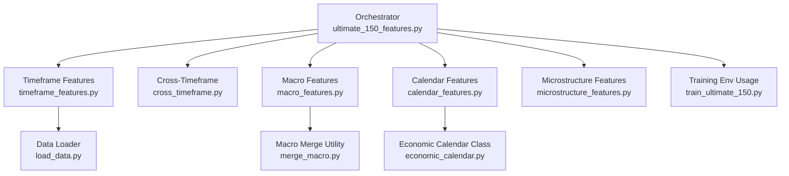
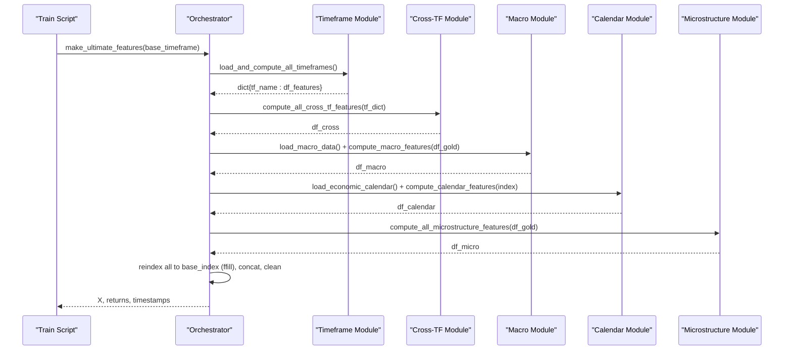
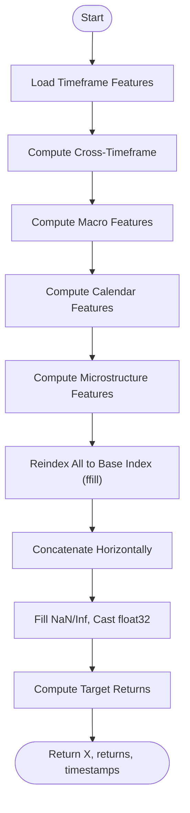
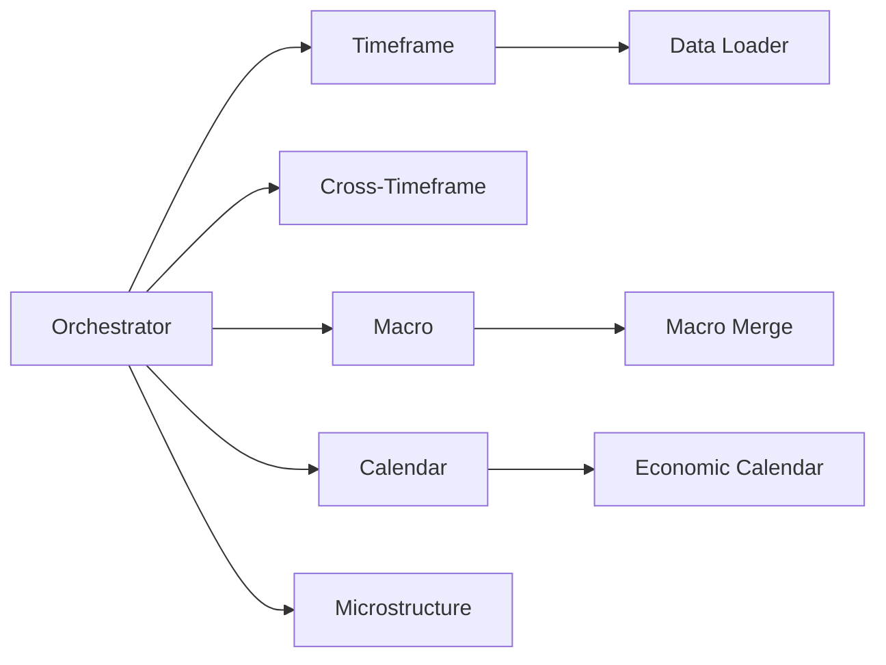
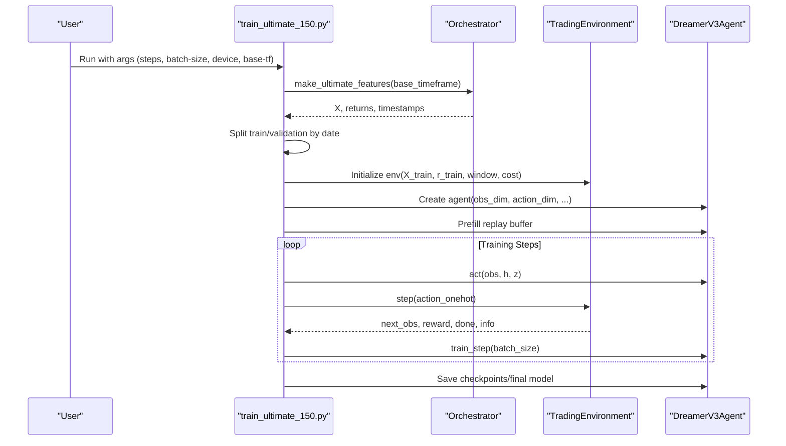

# Pipeline Orchestration

<cite>
**Referenced Files in This Document**
- [ultimate_150_features.py](file://features/ultimate_150_features.py)
- [timeframe_features.py](file://features/timeframe_features.py)
- [cross_timeframe.py](file://features/cross_timeframe.py)
- [macro_features.py](file://features/macro_features.py)
- [calendar_features.py](file://features/calendar_features.py)
- [microstructure_features.py](file://features/microstructure_features.py)
- [load_data.py](file://data/load_data.py)
- [merge_macro.py](file://data/merge_macro.py)
- [economic_calendar.py](file://data/economic_calendar.py)
- [train_ultimate_150.py](file://train/train_ultimate_150.py)
</cite>

## Table of Contents
1. [Introduction](#introduction)
2. [Project Structure](#project-structure)
3. [Core Components](#core-components)
4. [Architecture Overview](#architecture-overview)
5. [Detailed Component Analysis](#detailed-component-analysis)
6. [Dependency Analysis](#dependency-analysis)
7. [Performance Considerations](#performance-considerations)
8. [Troubleshooting Guide](#troubleshooting-guide)
9. [Conclusion](#conclusion)
10. [Appendices](#appendices)

## Introduction
This document explains the pipeline orchestration system that coordinates multiple feature extraction modules into a unified 150+ dimensional feature matrix for training trading agents. The master workflow sequences timeframe analysis, cross-timeframe correlations, macro integration, calendar processing, and microstructure computation. It also documents data alignment mechanisms to synchronize heterogeneous time series, memory management strategies for large datasets, error handling procedures, logging frameworks, progress tracking, and customization examples for different base timeframes and data configurations.

## Project Structure
The pipeline is implemented as a modular feature factory orchestrated by a single entry point. Each module computes a distinct feature family and returns a DataFrame aligned to a common timestamp index. The orchestrator concatenates these families into one wide feature matrix and prepares target returns.



**Diagram sources**
- [ultimate_150_features.py:27-226](file://features/ultimate_150_features.py#L27-L226)
- [timeframe_features.py:236-304](file://features/timeframe_features.py#L236-L304)
- [cross_timeframe.py:205-249](file://features/cross_timeframe.py#L205-L249)
- [macro_features.py:26-75](file://features/macro_features.py#L26-L75)
- [calendar_features.py:23-50](file://features/calendar_features.py#L23-L50)
- [microstructure_features.py:170-225](file://features/microstructure_features.py#L170-L225)
- [load_data.py:5-73](file://data/load_data.py#L5-L73)
- [merge_macro.py:4-56](file://data/merge_macro.py#L4-L56)
- [economic_calendar.py:27-114](file://data/economic_calendar.py#L27-L114)
- [train_ultimate_150.py:154-181](file://train/train_ultimate_150.py#L154-L181)

**Section sources**
- [ultimate_150_features.py:27-226](file://features/ultimate_150_features.py#L27-L226)
- [train_ultimate_150.py:154-181](file://train/train_ultimate_150.py#L154-L181)

## Core Components
- Orchestrator: Sequences steps, aligns features, cleans data, computes targets, and returns arrays for training.
- Timeframe Features: Computes 16 standardized indicators per timeframe (M5/M15/H1/H4/D1/W1).
- Cross-Timeframe: Derives 12 higher-order features capturing trend alignment, momentum cascade, volatility regime, and pattern confluence across timeframes.
- Macro Features: Integrates 24 features from eight macro sources with rolling correlations and momentum signals.
- Calendar Features: Encodes economic event timing, impact, density, and type flags.
- Microstructure Features: Captures session effects, time-of-day patterns, volume imbalance, and liquidity regimes.
- Data Utilities: Robust OHLC loading, timezone normalization, and merging helpers.

**Section sources**
- [timeframe_features.py:22-99](file://features/timeframe_features.py#L22-L99)
- [cross_timeframe.py:21-203](file://features/cross_timeframe.py#L21-L203)
- [macro_features.py:135-360](file://features/macro_features.py#L135-L360)
- [calendar_features.py:111-249](file://features/calendar_features.py#L111-L249)
- [microstructure_features.py:22-167](file://features/microstructure_features.py#L22-L167)
- [load_data.py:5-73](file://data/load_data.py#L5-L73)

## Architecture Overview
The master workflow executes five sequential stages, then combines outputs into a single feature matrix aligned to a base timeframe index.



**Diagram sources**
- [ultimate_150_features.py:47-154](file://features/ultimate_150_features.py#L47-L154)
- [timeframe_features.py:236-304](file://features/timeframe_features.py#L236-L304)
- [cross_timeframe.py:205-249](file://features/cross_timeframe.py#L205-L249)
- [macro_features.py:363-445](file://features/macro_features.py#L363-L445)
- [calendar_features.py:111-249](file://features/calendar_features.py#L111-L249)
- [microstructure_features.py:170-225](file://features/microstructure_features.py#L170-L225)

## Detailed Component Analysis

### Master Workflow in ultimate_150_features.py
- Step 1: Load timeframe features for multiple timeframes and return an aligned dictionary keyed by timeframe name.
- Step 2: Compute cross-timeframe features using the aligned timeframe dictionary.
- Step 3: Load macro data and compute macro features; resample gold to daily when needed to align with macro frequencies, then forward-fill back to intraday index.
- Step 4: Load economic calendar and compute calendar features against the base timeframe index.
- Step 5: Compute microstructure features directly on the base timeframe OHLCV series.
- Combine: Reindex all feature DataFrames to the base index using forward fill, concatenate horizontally, clean NaNs/infs, convert to float32, compute target returns from close prices, and return arrays plus timestamps.



**Diagram sources**
- [ultimate_150_features.py:47-181](file://features/ultimate_150_features.py#L47-L181)

**Section sources**
- [ultimate_150_features.py:27-226](file://features/ultimate_150_features.py#L27-L226)

### Data Alignment Mechanisms
- Timeframe alignment: Higher timeframe features are forward-filled onto the base timeframe index to ensure every bar has consistent multi-scale context.
- Macro alignment: Daily macro series are normalized to timezone-naive UTC indices and forward-filled to match the gold price index; if gold is intraday, macro features are computed on daily gold and then reindexed back to intraday via forward fill.
- Calendar alignment: Calendar features are computed over the base timeframe index without requiring external frequency alignment beyond timestamp matching.
- Microstructure alignment: Computed directly on the base timeframe index.

```mermaid
flowchart TD
A["Base Index (e.g., M5)"] --> B["Higher TF Features"]
B --> |reindex(method='ffill')| A
C["Daily Macro Series"] --> |normalize_timezone + reindex(ffill)| A
D["Calendar Events"] --> |timestamp lookup| A
E["Microstructure DF"] --> |same index| A
```

**Diagram sources**
- [timeframe_features.py:207-233](file://features/timeframe_features.py#L207-L233)
- [macro_features.py:78-111](file://features/macro_features.py#L78-L111)
- [macro_features.py:378-428](file://features/macro_features.py#L378-L428)
- [ultimate_150_features.py:123-150](file://features/ultimate_150_features.py#L123-L150)

**Section sources**
- [timeframe_features.py:207-233](file://features/timeframe_features.py#L207-L233)
- [macro_features.py:78-111](file://features/macro_features.py#L78-L111)
- [macro_features.py:378-428](file://features/macro_features.py#L378-L428)
- [ultimate_150_features.py:123-150](file://features/ultimate_150_features.py#L123-L150)

### Memory Management Strategies
- Float32 conversion: Feature matrices are cast to float32 to reduce memory footprint during concatenation and downstream training.
- Forward-fill reindexing: Avoids creating intermediate large objects by reusing existing indexes and filling missing values efficiently.
- Selective column retention: Data loader trims columns to only those required, reducing memory overhead early in the pipeline.
- Resampling macro to daily: Reduces computational cost for correlation computations before reindexing back to intraday.

**Section sources**
- [ultimate_150_features.py:160-173](file://features/ultimate_150_features.py#L160-L173)
- [load_data.py:61-73](file://data/load_data.py#L61-L73)
- [macro_features.py:378-428](file://features/macro_features.py#L378-L428)

### Error Handling Procedures
- File existence checks: Data loader raises FileNotFoundError if input CSV is missing; timeframe loader raises ValueError for missing OHLC columns.
- Data validation: OHLC sanity checks ensure high >= max(open, close, low) and low <= min(open, close, low).
- Graceful fallbacks: Missing macro files or calendar files result in warnings and default zero-filled features rather than crashes.
- Exception capture: Test functions catch exceptions, log errors, and print tracebacks for debugging.

**Section sources**
- [load_data.py:5-73](file://data/load_data.py#L5-L73)
- [timeframe_features.py:181-204](file://features/timeframe_features.py#L181-L204)
- [macro_features.py:51-75](file://features/macro_features.py#L51-L75)
- [calendar_features.py:23-50](file://features/calendar_features.py#L23-L50)
- [ultimate_150_features.py:229-267](file://features/ultimate_150_features.py#L229-L267)

### Logging Frameworks and Progress Tracking
- Structured logging: Each module configures a logger and emits step-wise logs with clear prefixes and summaries.
- Progress reporting: Iterative loops (e.g., calendar processing) report progress at intervals; overall pipeline prints stage headers and final summaries.
- Diagnostics: Counts of NaNs and infs are logged; feature counts and shapes are printed for verification.

**Section sources**
- [ultimate_150_features.py:40-45](file://features/ultimate_150_features.py#L40-L45)
- [timeframe_features.py:247-304](file://features/timeframe_features.py#L247-L304)
- [cross_timeframe.py:216-249](file://features/cross_timeframe.py#L216-L249)
- [macro_features.py:374-445](file://features/macro_features.py#L374-L445)
- [calendar_features.py:122-249](file://features/calendar_features.py#L122-L249)
- [microstructure_features.py:180-225](file://features/microstructure_features.py#L180-L225)

### Customization Examples
- Changing base timeframe: Pass base_timeframe='M15' or 'H1' to generate features aligned to that timeframe; the orchestrator will use corresponding base data file mapping and align all other features accordingly.
- Adding new timeframes: Extend the timeframe_files mapping in the timeframe loader to include additional files and ensure they exist in the data directory.
- Enabling/disabling macro sources: Macro features automatically skip missing files with warnings; add CSV files to the data directory to enable additional macro inputs.
- Calendar updates: Provide a JSON calendar file with events; the loader parses and uses it to compute timing and impact features.

**Section sources**
- [ultimate_150_features.py:78-90](file://features/ultimate_150_features.py#L78-L90)
- [timeframe_features.py:253-283](file://features/timeframe_features.py#L253-L283)
- [macro_features.py:37-75](file://features/macro_features.py#L37-L75)
- [calendar_features.py:23-50](file://features/calendar_features.py#L23-L50)

## Dependency Analysis
The orchestrator depends on each feature module and relies on shared data utilities. Modules have minimal coupling:
- Timeframe module is independent except for its own helper functions.
- Cross-timeframe depends on the output of timeframe features.
- Macro module depends on macro CSVs and optionally merges daily series to intraday.
- Calendar module depends on a JSON calendar file.
- Microstructure module depends on OHLCV data.



**Diagram sources**
- [ultimate_150_features.py:47-154](file://features/ultimate_150_features.py#L47-L154)
- [timeframe_features.py:236-304](file://features/timeframe_features.py#L236-L304)
- [macro_features.py:26-75](file://features/macro_features.py#L26-L75)
- [calendar_features.py:23-50](file://features/calendar_features.py#L23-L50)
- [microstructure_features.py:170-225](file://features/microstructure_features.py#L170-L225)
- [load_data.py:5-73](file://data/load_data.py#L5-L73)
- [merge_macro.py:4-56](file://data/merge_macro.py#L4-L56)
- [economic_calendar.py:27-114](file://data/economic_calendar.py#L27-L114)

**Section sources**
- [ultimate_150_features.py:47-154](file://features/ultimate_150_features.py#L47-L154)

## Performance Considerations
- Vectorized operations: Pandas rolling and ewm functions are used extensively for efficiency.
- Minimal intermediate copies: Reindex with method='ffill' avoids unnecessary allocations.
- Dtype optimization: float32 reduces memory usage and speeds up downstream ML operations.
- Conditional computation: Macro features compute only available sources; optional weekly timeframe is skipped if missing.
- Batched training: Training script uses replay buffer batching and periodic training steps to manage GPU/CPU utilization.

[No sources needed since this section provides general guidance]

## Troubleshooting Guide
Common issues and resolutions:
- Missing CSV files: Ensure required timeframe and macro files exist in the data directory; the pipeline logs warnings for optional files and skips them gracefully.
- Timezone mismatches: Macro series are normalized to timezone-naive UTC; if custom data includes timezones, ensure similar normalization or rely on provided utilities.
- Invalid OHLC: The loader validates OHLC relationships; fix source data if high < max(open, close, low) or low > min(open, close, low).
- Excessive NaNs: Check for gaps in timestamps; the pipeline fills NaNs with zeros after cleaning, but upstream data should be complete.
- Slow calendar computation: Processing iterates over all timestamps; consider subsampling for testing or optimizing event lookup if dataset grows very large.

**Section sources**
- [load_data.py:5-73](file://data/load_data.py#L5-L73)
- [macro_features.py:51-75](file://features/macro_features.py#L51-L75)
- [calendar_features.py:122-249](file://features/calendar_features.py#L122-L249)
- [ultimate_150_features.py:160-173](file://features/ultimate_150_features.py#L160-L173)

## Conclusion
The pipeline orchestrates multiple complementary feature sources into a robust, unified feature matrix suitable for advanced reinforcement learning training. Its design emphasizes modularity, alignment, memory efficiency, and comprehensive logging. By following the documented alignment and customization practices, users can adapt the system to different base timeframes and data configurations while maintaining reliability and performance.

[No sources needed since this section summarizes without analyzing specific files]

## Appendices

### Integration with Training Environment
The training script consumes the orchestrator’s outputs to build a trading environment, split data temporally, and run DreamerV3 training with configurable steps, batch size, device selection, and base timeframe.



**Diagram sources**
- [train_ultimate_150.py:154-326](file://train/train_ultimate_150.py#L154-L326)
- [ultimate_150_features.py:27-226](file://features/ultimate_150_features.py#L27-L226)

**Section sources**
- [train_ultimate_150.py:154-326](file://train/train_ultimate_150.py#L154-L326)