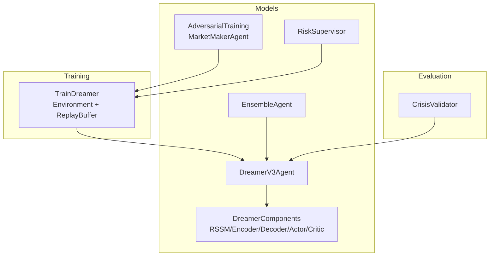
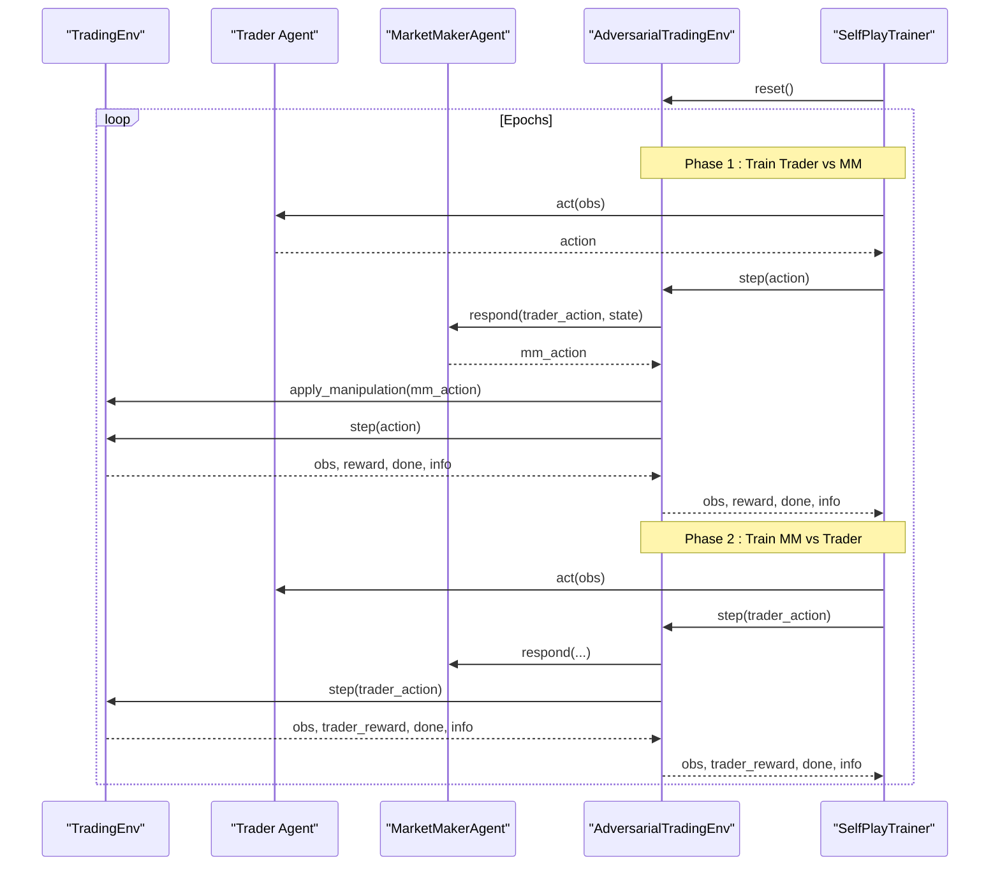
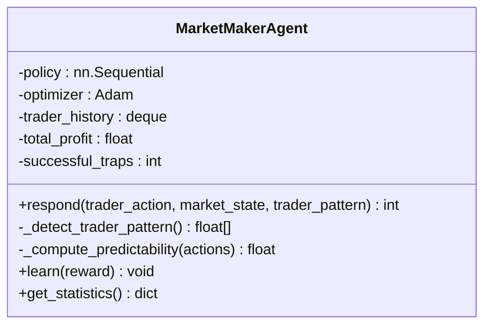
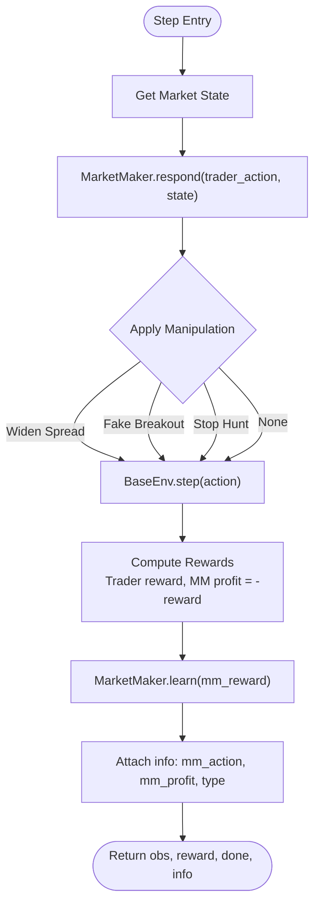
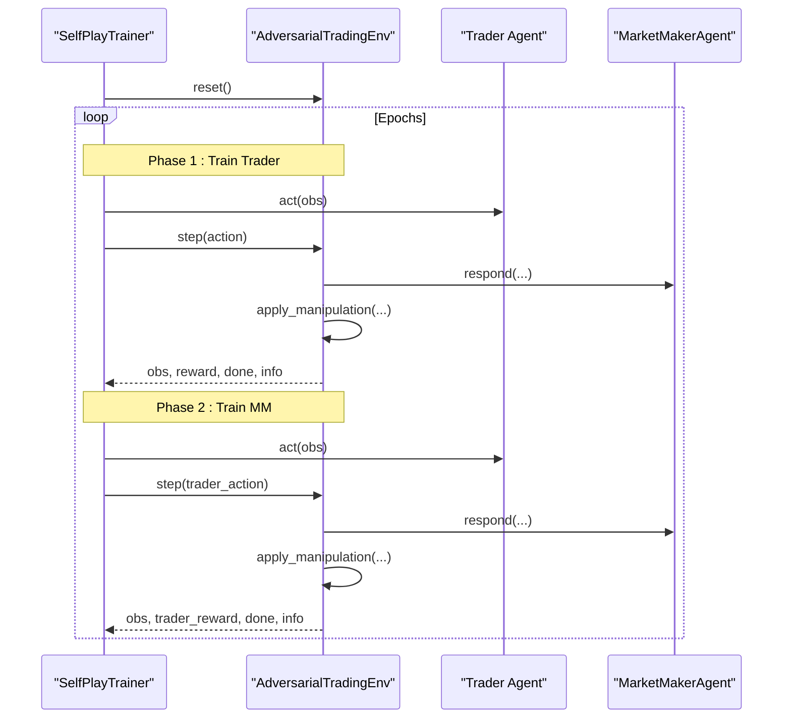
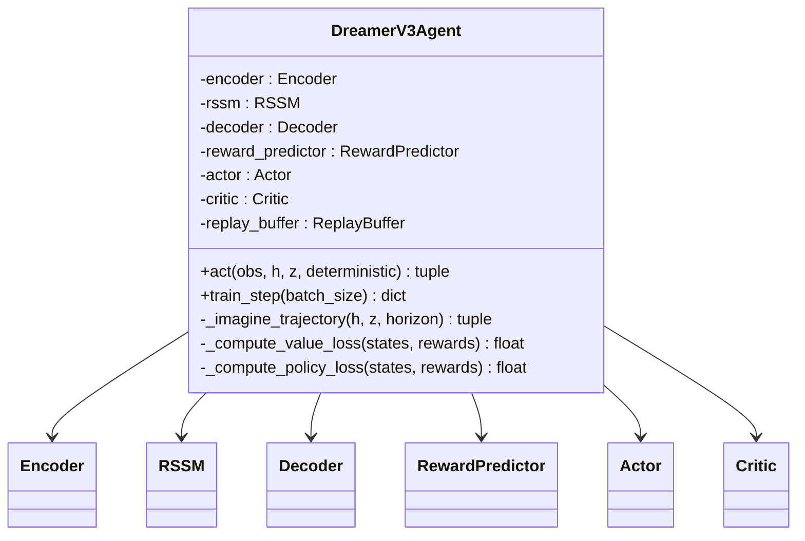
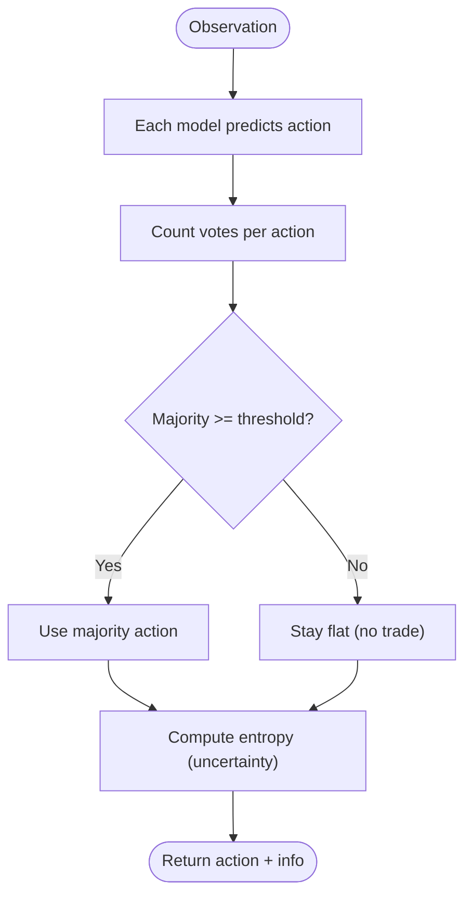
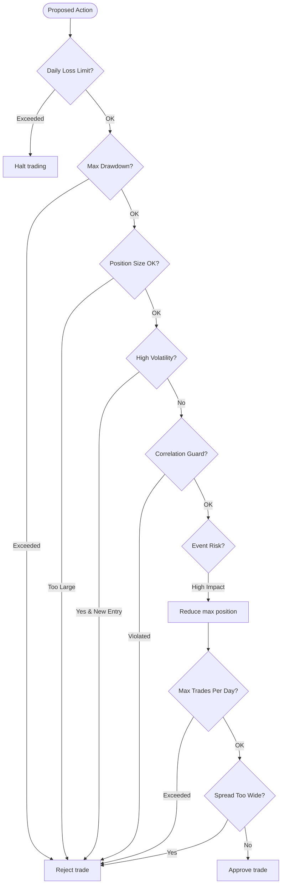
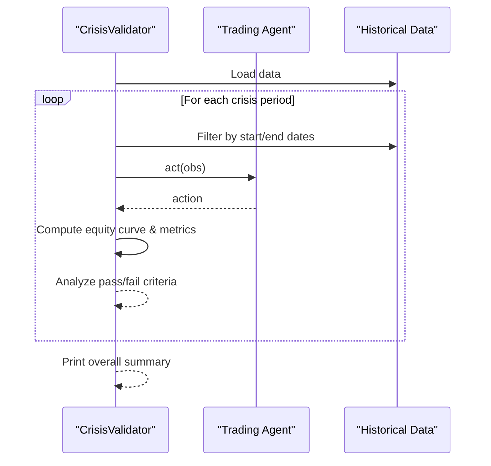
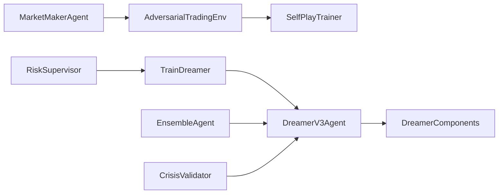

# Adversarial Training Framework

<cite>
**Referenced Files in This Document**
- [adversarial_training.py](file://models/adversarial_training.py)
- [dreamer_agent.py](file://models/dreamer_agent.py)
- [dreamer_components.py](file://models/dreamer_components.py)
- [train_dreamer.py](file://train/train_dreamer.py)
- [ensemble.py](file://models/ensemble.py)
- [risk_supervisor.py](file://models/risk_supervisor.py)
- [crisis_validation.py](file://eval/crisis_validation.py)
</cite>

## Table of Contents
1. [Introduction](#introduction)
2. [Project Structure](#project-structure)
3. [Core Components](#core-components)
4. [Architecture Overview](#architecture-overview)
5. [Detailed Component Analysis](#detailed-component-analysis)
6. [Dependency Analysis](#dependency-analysis)
7. [Performance Considerations](#performance-considerations)
8. [Troubleshooting Guide](#troubleshooting-guide)
9. [Conclusion](#conclusion)
10. [Appendices](#appendices)

## Introduction
This document explains the adversarial training framework that enhances model robustness against market regime changes and distribution shifts. It focuses on a generator-discriminator style setup where:
- The “generator” creates adversarial perturbations to market features (or simulates manipulative market conditions).
- The “discriminator” identifies whether inputs are real or adversarial, thereby forcing the policy to learn invariance to small market noise and resistance to overfitting on specific regimes.

The system also includes a self-play loop between a trader agent and an adversarial “market maker,” plus a world-model-based DreamerV3 agent trained via imagination. Together, these components provide minimax-style optimization that balances performance on clean data with robustness against adversarial examples. Practical guidance is provided for hyperparameter tuning of adversarial strength, perturbation bounds, and training stability, along with examples showing how adversarial training improves generalization across different market regimes and reduces vulnerability to unexpected events.

## Project Structure
At a high level, the repository organizes trading models, training loops, and evaluation utilities into modular files:
- Adversarial training and self-play live in a dedicated module.
- A world-model agent (DreamerV3) encapsulates representation learning, dynamics modeling, and actor-critic policy training.
- Training scripts orchestrate environment interaction, replay buffering, and checkpointing.
- Ensemble methods and risk supervision add robustness and safety layers.
- Crisis validation provides stress tests across known extreme periods.

**Diagram sources**
- [adversarial_training.py:35-221](file://models/adversarial_training.py#L35-L221)
- [dreamer_agent.py:84-190](file://models/dreamer_agent.py#L84-L190)
- [dreamer_components.py:71-206](file://models/dreamer_components.py#L71-L206)
- [train_dreamer.py:36-126](file://train/train_dreamer.py#L36-L126)
- [ensemble.py:27-131](file://models/ensemble.py#L27-L131)
- [risk_supervisor.py:18-175](file://models/risk_supervisor.py#L18-L175)
- [crisis_validation.py:29-171](file://eval/crisis_validation.py#L29-L171)

**Section sources**
- [adversarial_training.py:1-556](file://models/adversarial_training.py#L1-L556)
- [dreamer_agent.py:1-460](file://models/dreamer_agent.py#L1-L460)
- [dreamer_components.py:1-338](file://models/dreamer_components.py#L1-L338)
- [train_dreamer.py:1-331](file://train/train_dreamer.py#L1-L331)
- [ensemble.py:1-290](file://models/ensemble.py#L1-L290)
- [risk_supervisor.py:1-387](file://models/risk_supervisor.py#L1-L387)
- [crisis_validation.py:1-419](file://eval/crisis_validation.py#L1-L419)

## Core Components
- Market Maker Agent: An adversarial agent that learns to exploit the trader’s weaknesses by manipulating spreads, creating fake breakouts, hunting stops, and causing slippage. It observes recent trader actions to infer patterns and responds accordingly.
- Adversarial Trading Environment: Wraps a base environment to inject manipulations based on the market maker’s decisions, turning standard training into a zero-sum game between trader and market maker.
- Self-Play Trainer: Alternates phases to train the trader against the current market maker and then trains the market maker against the current trader, fostering continuous improvement.
- DreamerV3 Agent: Learns a world model (encoder, RSSM, decoder, reward predictor) and improves its policy by imagining trajectories and optimizing actor-critic objectives.
- Ensemble Agent: Trains multiple diverse agents and trades only under consensus, using disagreement as uncertainty to avoid risky decisions.
- Risk Supervisor: Deterministic safety layer enforcing daily loss limits, drawdown protection, position sizing, volatility filters, event risk guards, and spread checks.
- Crisis Validator: Evaluates agents on historical crisis periods to ensure survivability and robust behavior under extreme regimes.

**Section sources**
- [adversarial_training.py:35-221](file://models/adversarial_training.py#L35-L221)
- [adversarial_training.py:223-356](file://models/adversarial_training.py#L223-L356)
- [adversarial_training.py:358-485](file://models/adversarial_training.py#L358-L485)
- [dreamer_agent.py:84-190](file://models/dreamer_agent.py#L84-L190)
- [dreamer_agent.py:190-404](file://models/dreamer_agent.py#L190-L404)
- [dreamer_components.py:71-206](file://models/dreamer_components.py#L71-L206)
- [ensemble.py:27-131](file://models/ensemble.py#L27-L131)
- [risk_supervisor.py:18-175](file://models/risk_supervisor.py#L18-L175)
- [crisis_validation.py:29-171](file://eval/crisis_validation.py#L29-L171)

## Architecture Overview
The adversarial training framework combines two complementary approaches:
- Self-play adversarial training: A trader agent learns to maximize returns while a market maker agent learns to minimize it through manipulations. This zero-sum dynamic forces the trader to become robust to adversarial perturbations and market manipulation tactics.
- World-model-based planning: The DreamerV3 agent builds an internal model of market dynamics and uses imagined rollouts to improve its policy without relying solely on real-world data distributions.

**Diagram sources**
- [adversarial_training.py:223-356](file://models/adversarial_training.py#L223-L356)
- [adversarial_training.py:358-485](file://models/adversarial_training.py#L358-L485)

**Section sources**
- [adversarial_training.py:223-485](file://models/adversarial_training.py#L223-L485)

## Detailed Component Analysis

### Market Maker Agent (Generator of Adversarial Perturbations)
The Market Maker Agent acts as a generator of adversarial perturbations to market conditions. It detects trader patterns from recent actions and selects manipulations such as widening spreads, creating fake breakouts, or hunting stop losses. Its policy network takes concatenated market state and inferred trader pattern features to output discrete manipulation actions.

**Diagram sources**
- [adversarial_training.py:35-221](file://models/adversarial_training.py#L35-L221)

**Section sources**
- [adversarial_training.py:35-221](file://models/adversarial_training.py#L35-L221)

### Adversarial Trading Environment (Discriminator Role)
The Adversarial Trading Environment wraps a base environment and applies manipulations chosen by the market maker. It transforms standard steps into adversarial steps, providing feedback to both the trader and the market maker. In this role, it functions like a discriminator by exposing the trader to realistic adversarial scenarios and measuring success/failure via rewards.

**Diagram sources**
- [adversarial_training.py:223-356](file://models/adversarial_training.py#L223-L356)

**Section sources**
- [adversarial_training.py:223-356](file://models/adversarial_training.py#L223-L356)

### Self-Play Trainer (Minimax Optimization Loop)
The Self-Play Trainer alternates between training the trader against the current market maker and training the market maker against the current trader. This iterative process approximates a minimax objective: the trader maximizes expected return while the market maker minimizes it through adversarial perturbations. Over time, the trader becomes invariant to small market noise and resistant to overfitting on specific regimes.

**Diagram sources**
- [adversarial_training.py:358-485](file://models/adversarial_training.py#L358-L485)

**Section sources**
- [adversarial_training.py:358-485](file://models/adversarial_training.py#L358-L485)

### DreamerV3 Agent (World Model and Policy)
The DreamerV3 Agent learns a compact representation of market dynamics via an encoder and RSSM, predicts rewards, reconstructs observations, and optimizes an actor-critic policy through imagined rollouts. This enables robust planning and generalization across regimes by learning latent market states and transitions rather than memorizing surface-level feature distributions.

**Diagram sources**
- [dreamer_agent.py:84-190](file://models/dreamer_agent.py#L84-L190)
- [dreamer_agent.py:190-404](file://models/dreamer_agent.py#L190-L404)
- [dreamer_components.py:71-206](file://models/dreamer_components.py#L71-L206)

**Section sources**
- [dreamer_agent.py:84-404](file://models/dreamer_agent.py#L84-L404)
- [dreamer_components.py:71-206](file://models/dreamer_components.py#L71-L206)

### Ensemble Agent (Robustness Through Diversity)
The Ensemble Agent trains multiple models with varied seeds and slight architectural differences. It requires majority consensus before acting, using disagreement as an uncertainty measure to avoid risky decisions during uncertain regimes.

**Diagram sources**
- [ensemble.py:27-131](file://models/ensemble.py#L27-L131)

**Section sources**
- [ensemble.py:27-131](file://models/ensemble.py#L27-L131)

### Risk Supervisor (Safety Layer)
The Risk Supervisor enforces hard constraints to prevent catastrophic losses, including daily loss limits, maximum drawdown protection, position size limits, volatility filters, correlation guards, event risk filters, overtrading prevention, and spread filters. It can override AI decisions to ensure safe operation.

**Diagram sources**
- [risk_supervisor.py:18-175](file://models/risk_supervisor.py#L18-L175)

**Section sources**
- [risk_supervisor.py:18-175](file://models/risk_supervisor.py#L18-L175)

### Crisis Validation (Stress Testing Across Regimes)
The Crisis Validator evaluates agents on known crisis periods (e.g., COVID crash, rate hikes, SVB collapse) to ensure survivability and robust behavior under extreme regimes. It computes metrics like final equity, drawdown, Sharpe ratio, and trade frequency, and reports pass/fail status against predefined criteria.

**Diagram sources**
- [crisis_validation.py:29-171](file://eval/crisis_validation.py#L29-L171)

**Section sources**
- [crisis_validation.py:29-171](file://eval/crisis_validation.py#L29-L171)

## Dependency Analysis
The adversarial training framework integrates several modules:
- The self-play trainer depends on the market maker agent and the adversarial environment.
- The DreamerV3 agent depends on component modules (encoder, RSSM, decoder, reward predictor, actor, critic).
- Training scripts depend on the agent and environment abstractions.
- Ensemble and risk supervision wrap or augment the core agent for robustness and safety.
- Crisis validation depends on historical data and the agent interface.

**Diagram sources**
- [adversarial_training.py:35-485](file://models/adversarial_training.py#L35-L485)
- [dreamer_agent.py:84-404](file://models/dreamer_agent.py#L84-L404)
- [dreamer_components.py:71-206](file://models/dreamer_components.py#L71-L206)
- [train_dreamer.py:36-126](file://train/train_dreamer.py#L36-L126)
- [ensemble.py:27-131](file://models/ensemble.py#L27-L131)
- [risk_supervisor.py:18-175](file://models/risk_supervisor.py#L18-L175)
- [crisis_validation.py:29-171](file://eval/crisis_validation.py#L29-L171)

**Section sources**
- [adversarial_training.py:35-485](file://models/adversarial_training.py#L35-L485)
- [dreamer_agent.py:84-404](file://models/dreamer_agent.py#L84-L404)
- [dreamer_components.py:71-206](file://models/dreamer_components.py#L71-L206)
- [train_dreamer.py:36-126](file://train/train_dreamer.py#L36-L126)
- [ensemble.py:27-131](file://models/ensemble.py#L27-L131)
- [risk_supervisor.py:18-175](file://models/risk_supervisor.py#L18-L175)
- [crisis_validation.py:29-171](file://eval/crisis_validation.py#L29-L171)

## Performance Considerations
- Minimax balance: Ensure the adversarial strength (manipulation intensity) does not overwhelm the trader; adjust market maker learning rates and strategy diversity to maintain a balanced arms race.
- Perturbation bounds: Constrain manipulations (e.g., spread widening magnitude, fake breakout duration) to reflect realistic market frictions and avoid unrealistic adversarial examples.
- Training stability: Use gradient clipping, KL balancing, and symlog transformations for reward/value stability in the world model; monitor reconstruction, reward prediction, and policy losses.
- Exploration vs exploitation: Prefill the replay buffer with random exploration to diversify experiences before training; use stochastic sampling in actor policies during imagination.
- Ensemble uncertainty: Leverage disagreement to reduce trading during uncertain regimes; increase consensus thresholds when volatility spikes.
- Risk controls: Enforce daily loss limits, drawdown caps, and spread filters to prevent catastrophic failures during adverse regimes.

[No sources needed since this section provides general guidance]

## Troubleshooting Guide
Common issues and resolutions:
- Imbalanced self-play: If trader rewards consistently exceed market maker profits or vice versa, adjust learning rates, strategy variety, or manipulation intensity to restore balance.
- Overfitting to regimes: Increase diversity in market maker strategies and ensemble configurations; validate across crisis periods to detect regime-specific vulnerabilities.
- Training instability: Monitor loss curves (reconstruction, reward prediction, KL divergence); tune KL balancing and free nats; apply gradient clipping and appropriate learning rates.
- Excessive trading: Use risk supervisor to enforce minimum time between trades and maximum daily trades; consider higher consensus thresholds in ensemble mode.
- High volatility environments: Risk supervisor may reject new entries; ensure agent adapts by reducing exposure or staying flat until conditions normalize.

**Section sources**
- [adversarial_training.py:358-485](file://models/adversarial_training.py#L358-L485)
- [dreamer_agent.py:190-404](file://models/dreamer_agent.py#L190-L404)
- [risk_supervisor.py:18-175](file://models/risk_supervisor.py#L18-L175)
- [crisis_validation.py:29-171](file://eval/crisis_validation.py#L29-L171)

## Conclusion
The adversarial training framework combines self-play adversarial dynamics with world-model-based planning to build robust trading policies. By generating adversarial perturbations and training against them, the trader learns invariance to small market noise and resistance to overfitting on specific regimes. The minimax optimization balances performance on clean data with resilience against adversarial examples. Ensemble methods and risk supervision further enhance robustness and safety. Crisis validation ensures survivability under extreme market conditions. With careful hyperparameter tuning and monitoring, this framework improves generalization across market regimes and reduces vulnerability to unexpected events.

[No sources needed since this section summarizes without analyzing specific files]

## Appendices

### Hyperparameter Tuning Guidance
- Adversarial strength: Tune market maker policy learning rate and strategy diversity; moderate manipulation magnitudes to reflect realistic market frictions.
- Perturbation bounds: Limit spread widening, fake breakout duration, and stop-hunt intensity to avoid unrealistic adversarial examples.
- Training stability: Use KL balancing and free nats in RSSM; apply gradient clipping; monitor reconstruction and reward prediction losses; adjust learning rates for world model, actor, and critic.
- Exploration: Prefill replay buffer with sufficient random steps; use stochastic sampling in actor policies during imagination.
- Ensemble: Vary hidden dimensions and seeds; set consensus thresholds based on regime uncertainty; monitor entropy to gauge disagreement.
- Risk controls: Adjust daily loss limits, drawdown caps, position sizes, and spread filters according to asset characteristics and market conditions.

[No sources needed since this section provides general guidance]

### Examples of Improved Generalization
- Cross-regime robustness: Adversarial training exposes the trader to manipulative tactics and noisy features, encouraging policies that generalize beyond in-sample regimes.
- Reduced vulnerability: Crisis validation demonstrates survivability during extreme periods, indicating reduced sensitivity to black swan events.
- Ensemble benefits: Majority voting reduces false signals during uncertain regimes, lowering drawdowns and improving stability.

[No sources needed since this section provides conceptual examples]