# Dreamer V3 World Model Architecture

<cite>
**Referenced Files in This Document**
- [dreamer_agent.py](file://models/dreamer_agent.py)
- [dreamer_components.py](file://models/dreamer_components.py)
- [train_dreamer.py](file://train/train_dreamer.py)
- [analyze_dreamer.py](file://eval/analyze_dreamer.py)
- [DREAMER_IMPLEMENTATION_GUIDE.md](file://DREAMER_IMPLEMENTATION_GUIDE.md)
</cite>

## Table of Contents
1. [Introduction](#introduction)
2. [Project Structure](#project-structure)
3. [Core Components](#core-components)
4. [Architecture Overview](#architecture-overview)
5. [Detailed Component Analysis](#detailed-component-analysis)
6. [Dependency Analysis](#dependency-analysis)
7. [Performance Considerations](#performance-considerations)
8. [Troubleshooting Guide](#troubleshooting-guide)
9. [Conclusion](#conclusion)

## Introduction
This document provides a comprehensive architectural overview of the Dreamer V3 world model implementation for trading. It explains how the system learns market dynamics through self-supervised learning and uses imagination-based planning to improve policy. The architecture includes:
- An encoder that maps observations to embeddings
- A Recurrent State-Space Model (RSSM) that maintains deterministic memory and stochastic regime variables
- A decoder that reconstructs observations from latent states
- A reward predictor that estimates future rewards in latent space
- An actor policy that selects actions and a critic that estimates state values
- An experience replay buffer that stores sequences for efficient, temporally consistent training

The agent trains by alternating between world model learning and imagination-driven policy improvement, enabling long-horizon strategy optimization without requiring extensive real-world exploration.

## Project Structure
The implementation is organized into modular components:
- models/dreamer_components.py: Neural network building blocks (Encoder, RSSM, Decoder, RewardPredictor, Actor, Critic)
- models/dreamer_agent.py: Agent orchestration, replay buffer, training loop, and imagination
- train/train_dreamer.py: Training environment, data loading, prefill, training phases, and evaluation
- eval/analyze_dreamer.py: Diagnostics for reconstruction quality, reward prediction accuracy, and latent space analysis
- DREAMER_IMPLEMENTATION_GUIDE.md: High-level guide and usage instructions

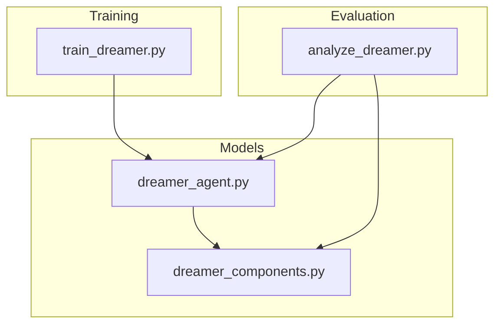

**Diagram sources**
- [dreamer_agent.py:18-21](file://models/dreamer_agent.py#L18-L21)
- [train_dreamer.py:17-18](file://train/train_dreamer.py#L17-L18)
- [analyze_dreamer.py:19-20](file://eval/analyze_dreamer.py#L19-L20)

**Section sources**
- [dreamer_agent.py:18-21](file://models/dreamer_agent.py#L18-L21)
- [train_dreamer.py:17-18](file://train/train_dreamer.py#L17-L18)
- [analyze_dreamer.py:19-20](file://eval/analyze_dreamer.py#L19-L20)

## Core Components
- Encoder: Compresses raw features into stable embeddings using symlog transformation and RMSNorm layers.
- RSSM: Maintains a deterministic hidden state h and a stochastic categorical state z; supports observe (posterior) and imagine (prior) modes.
- Decoder: Reconstructs observations from the concatenated latent state (h, z).
- Reward Predictor: Predicts rewards in symlog space from latent states.
- Actor: Outputs categorical action logits over discrete actions (e.g., flat, long, short).
- Critic: Estimates state value in symlog space.
- Replay Buffer: Stores transitions and samples fixed-length sequences for temporally consistent updates.

Key design choices:
- Symlog/symexp transformations stabilize training with large price movements.
- Categorical latent variables provide expressive regime modeling.
- KL balancing and free nats prevent posterior collapse.
- Imagination horizon enables multi-step planning in latent space.

**Section sources**
- [dreamer_components.py:22-29](file://models/dreamer_components.py#L22-L29)
- [dreamer_components.py:71-89](file://models/dreamer_components.py#L71-L89)
- [dreamer_components.py:92-205](file://models/dreamer_components.py#L92-L205)
- [dreamer_components.py:208-294](file://models/dreamer_components.py#L208-L294)
- [dreamer_agent.py:24-81](file://models/dreamer_agent.py#L24-L81)

## Architecture Overview
The agent alternates between two phases each training step:
1. World Model Learning: Encode observations, infer posteriors, reconstruct observations, predict rewards, and regularize via KL divergence.
2. Imagination and Policy Improvement: Start from terminal latent states, roll out imagined trajectories using the actor and RSSM prior, then update the critic and actor based on imagined returns.

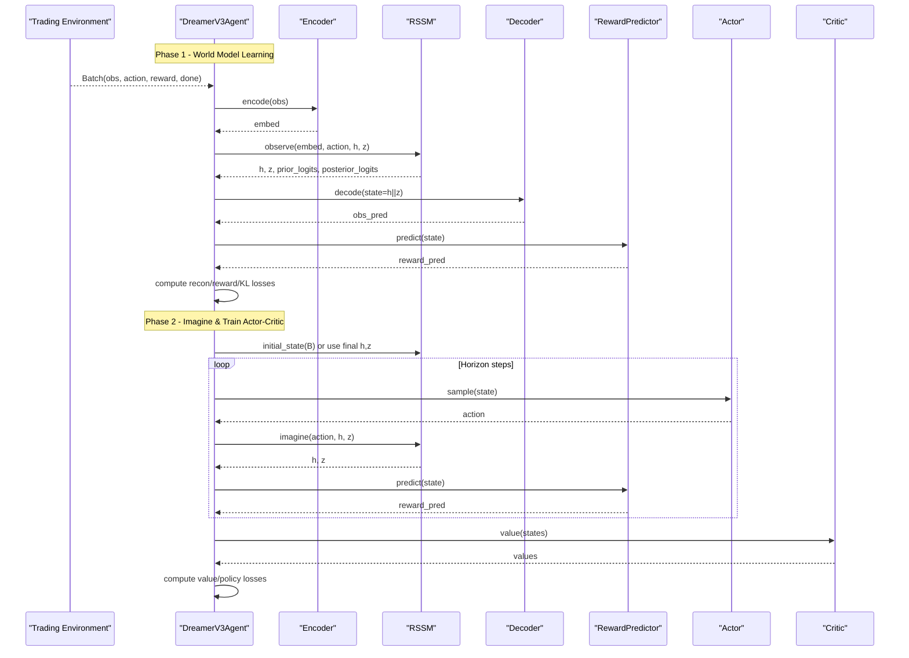

**Diagram sources**
- [dreamer_agent.py:190-304](file://models/dreamer_agent.py#L190-L304)
- [dreamer_components.py:134-168](file://models/dreamer_components.py#L134-L168)
- [dreamer_components.py:184-205](file://models/dreamer_components.py#L184-L205)
- [dreamer_components.py:208-294](file://models/dreamer_components.py#L208-L294)

**Section sources**
- [dreamer_agent.py:190-304](file://models/dreamer_agent.py#L190-L304)

## Detailed Component Analysis

### Encoder Network
- Purpose: Map high-dimensional market features to a compact embedding suitable for dynamics modeling.
- Design: Linear layers with RMSNorm and SiLU activations; applies symlog to inputs for stability.
- Output: Embedding vector passed to RSSM posterior and prior networks.

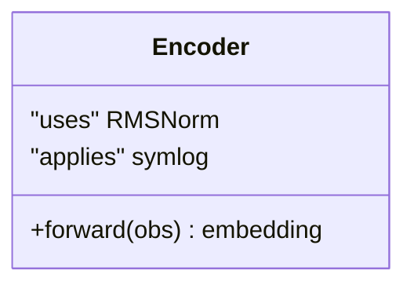

**Diagram sources**
- [dreamer_components.py:71-89](file://models/dreamer_components.py#L71-L89)
- [dreamer_components.py:32-41](file://models/dreamer_components.py#L32-L41)
- [dreamer_components.py:22-29](file://models/dreamer_components.py#L22-L29)

**Section sources**
- [dreamer_components.py:71-89](file://models/dreamer_components.py#L71-L89)

### Recurrent State-Space Model (RSSM)
- Purpose: Learn market dynamics by maintaining a deterministic memory state h and a stochastic regime variable z composed of categorical distributions.
- Posterior inference: Uses observed embeddings to infer q(z_t | h_t, e_t).
- Prior imagination: Samples p(z_t | h_t) for planning without real observations.
- Dynamics: Updates h via a GRU cell conditioned on previous z and action.
- KL regularization: Balances KL divergence with free nats to avoid posterior collapse.

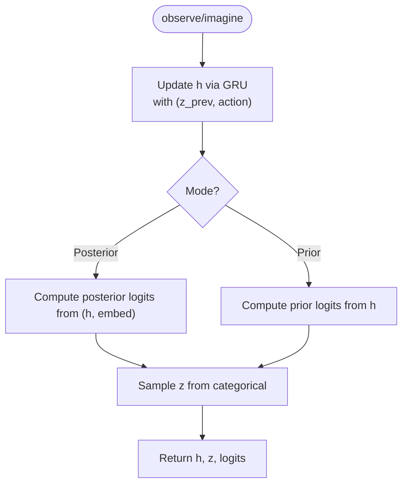

**Diagram sources**
- [dreamer_components.py:134-168](file://models/dreamer_components.py#L134-L168)
- [dreamer_components.py:170-182](file://models/dreamer_components.py#L170-L182)
- [dreamer_components.py:188-205](file://models/dreamer_components.py#L188-L205)

**Section sources**
- [dreamer_components.py:92-205](file://models/dreamer_components.py#L92-L205)

### Decoder
- Purpose: Reconstruct observations from the full latent state (concatenation of h and z).
- Design: Multi-layer MLP with RMSNorm and SiLU; outputs mean of observation distribution using symexp for stability.

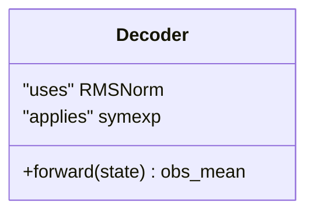

**Diagram sources**
- [dreamer_components.py:208-224](file://models/dreamer_components.py#L208-L224)
- [dreamer_components.py:22-29](file://models/dreamer_components.py#L22-L29)

**Section sources**
- [dreamer_components.py:208-224](file://models/dreamer_components.py#L208-L224)

### Reward Predictor
- Purpose: Estimate future rewards directly from latent states.
- Design: MLP with RMSNorm and SiLU; outputs scalar in symlog space.

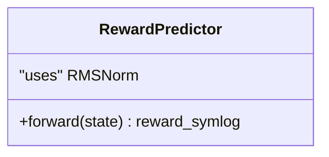

**Diagram sources**
- [dreamer_components.py:227-243](file://models/dreamer_components.py#L227-L243)

**Section sources**
- [dreamer_components.py:227-243](file://models/dreamer_components.py#L227-L243)

### Actor Policy
- Purpose: Select actions (e.g., flat, long, short) as a categorical distribution over action indices.
- Behavior: Supports deterministic greedy sampling during evaluation and stochastic sampling during training.

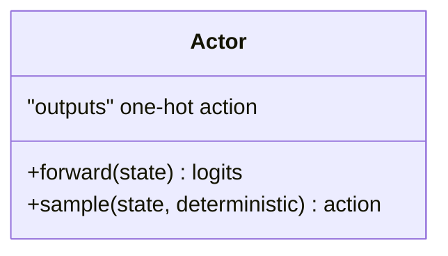

**Diagram sources**
- [dreamer_components.py:246-275](file://models/dreamer_components.py#L246-L275)

**Section sources**
- [dreamer_components.py:246-275](file://models/dreamer_components.py#L246-L275)

### Value Critic
- Purpose: Estimate state value in symlog space to support lambda-returns and advantage computation.
- Design: MLP with RMSNorm and SiLU; outputs scalar value.

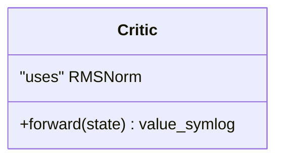

**Diagram sources**
- [dreamer_components.py:278-294](file://models/dreamer_components.py#L278-L294)

**Section sources**
- [dreamer_components.py:278-294](file://models/dreamer_components.py#L278-L294)

### Experience Replay Buffer
- Purpose: Store transitions and sample contiguous sequences to preserve temporal structure for world model learning.
- Behavior: Maintains a bounded deque; samples random start indices to extract fixed-length sequences; stacks into batches for training.

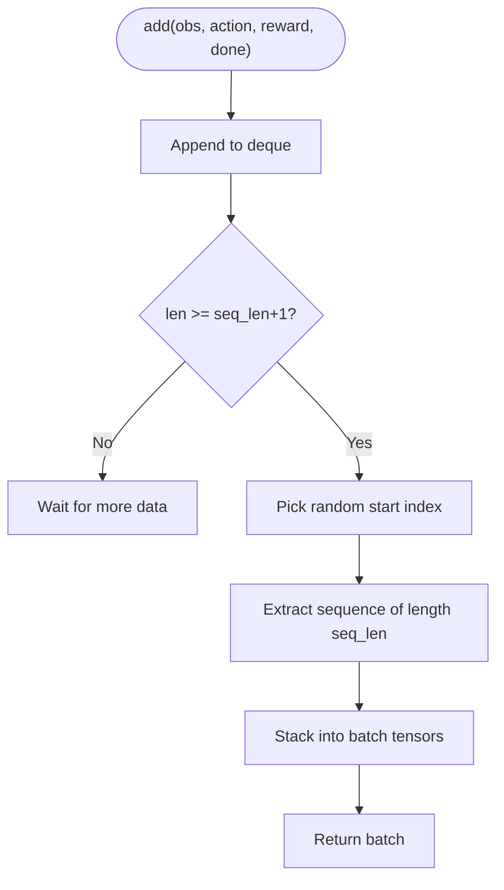

**Diagram sources**
- [dreamer_agent.py:24-81](file://models/dreamer_agent.py#L24-L81)

**Section sources**
- [dreamer_agent.py:24-81](file://models/dreamer_agent.py#L24-L81)

### Imagination-Based Planning
- Purpose: Generate future trajectories in latent space to optimize policy without executing trades.
- Process: Starting from terminal latent states, repeatedly apply the actor to sample actions, predict rewards, and advance the RSSM prior to simulate H steps. Use these imagined states and rewards to update the critic and actor.

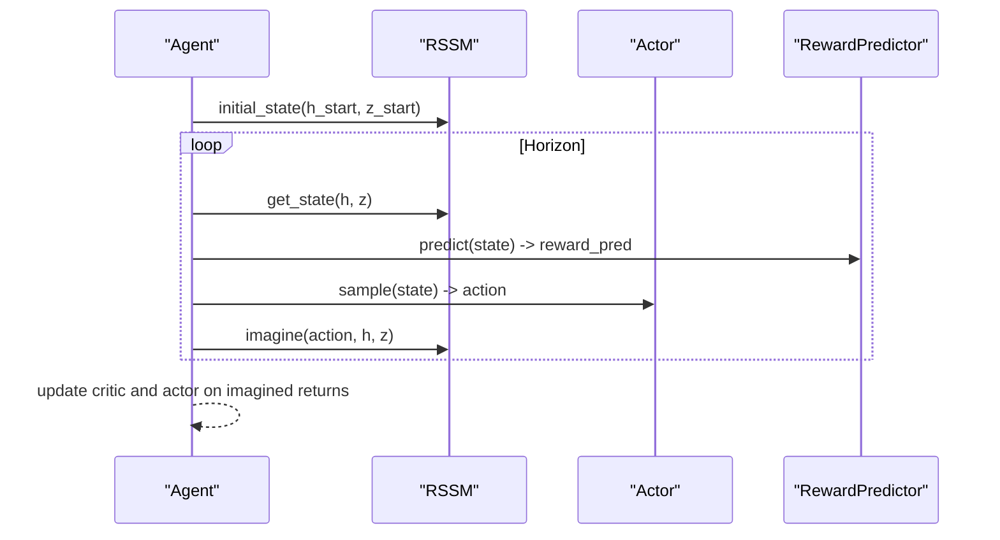

**Diagram sources**
- [dreamer_agent.py:306-338](file://models/dreamer_agent.py#L306-L338)
- [dreamer_components.py:155-168](file://models/dreamer_components.py#L155-L168)

**Section sources**
- [dreamer_agent.py:306-338](file://models/dreamer_agent.py#L306-L338)

### Training Loop and Phases
- Phase 1: Prefill the replay buffer with random exploration to gather diverse experiences.
- Phase 2: Alternate between world model updates and imagination-based actor-critic updates every few environment steps.
- Phase 3: Evaluate on held-out test data using deterministic actions.

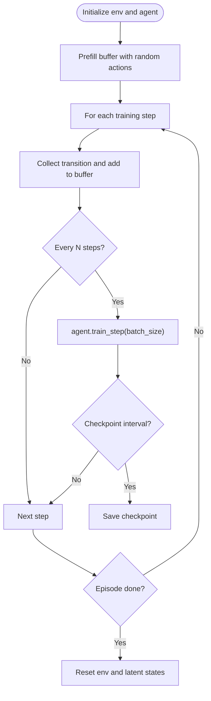

**Diagram sources**
- [train_dreamer.py:210-292](file://train/train_dreamer.py#L210-L292)

**Section sources**
- [train_dreamer.py:210-292](file://train/train_dreamer.py#L210-L292)

## Dependency Analysis
- dreamer_agent.py depends on dreamer_components.py for all neural modules and utilities.
- train_dreamer.py imports the agent and constructs a simple trading environment for XAUUSD.
- analyze_dreamer.py loads checkpoints and runs diagnostics on reconstruction, reward prediction, and latent space.

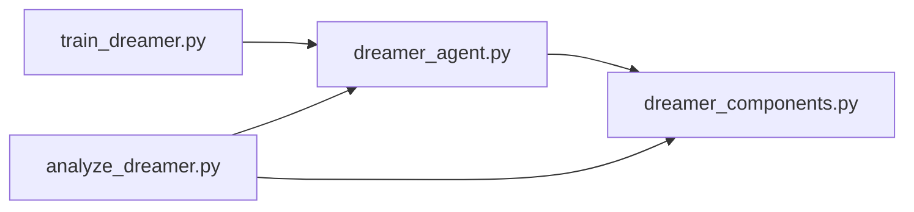

**Diagram sources**
- [train_dreamer.py:17-18](file://train/train_dreamer.py#L17-L18)
- [dreamer_agent.py:18-21](file://models/dreamer_agent.py#L18-L21)
- [analyze_dreamer.py:19-20](file://eval/analyze_dreamer.py#L19-L20)

**Section sources**
- [train_dreamer.py:17-18](file://train/train_dreamer.py#L17-L18)
- [dreamer_agent.py:18-21](file://models/dreamer_agent.py#L18-L21)
- [analyze_dreamer.py:19-20](file://eval/analyze_dreamer.py#L19-L20)

## Performance Considerations
- Symlog/symexp transformations reduce gradient instability under extreme price moves.
- Categorical latents with KL balancing and free nats help maintain informative latent regimes while avoiding collapse.
- Gradient clipping prevents exploding updates across all components.
- Sequence sampling preserves temporal dependencies for world model learning.
- Imagination horizon balances planning depth and computational cost.

[No sources needed since this section provides general guidance]

## Troubleshooting Guide
- Loss NaN or unstable training: Reduce learning rates, increase gradient clipping, validate data for inf/nan.
- KL loss too high or too low: Adjust free_nats; high indicates excessive regularization, low may indicate posterior collapse.
- Poor reconstruction: Check encoder/decoder capacity and ensure sufficient training steps; verify data preprocessing.
- Reward prediction correlation low: Inspect reward scaling and ensure adequate horizon and discounting; consider adjusting critic learning rate.
- Memory issues: Reduce batch size or model dimensions; run on CPU if necessary.

**Section sources**
- [DREAMER_IMPLEMENTATION_GUIDE.md:242-261](file://DREAMER_IMPLEMENTATION_GUIDE.md#L242-L261)

## Conclusion
The Dreamer V3 implementation builds a robust world model for trading by learning market dynamics through self-supervised objectives and improving policy via imagination-based planning. The RSSM captures both deterministic memory and stochastic regimes, while the actor-critic pair optimizes decisions using imagined futures. The replay buffer ensures temporally consistent training, and diagnostics tools enable monitoring of reconstruction quality, reward prediction accuracy, and latent structure. This architecture provides a strong foundation for advanced planning techniques such as Monte Carlo Tree Search to further enhance decision-making.

[No sources needed since this section summarizes without analyzing specific files]